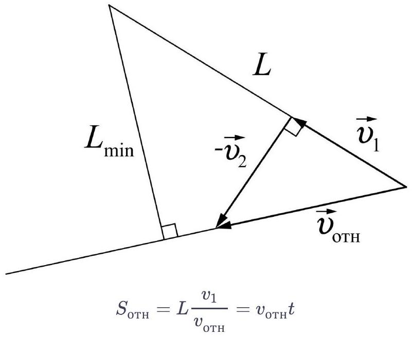
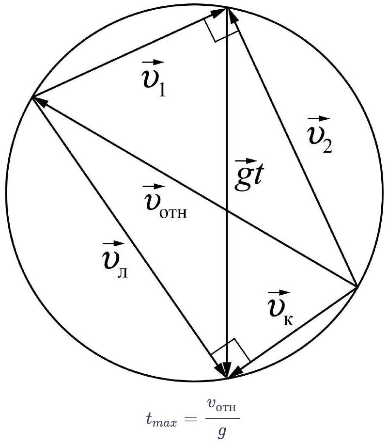
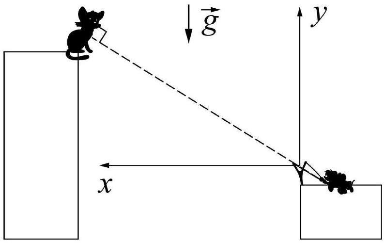
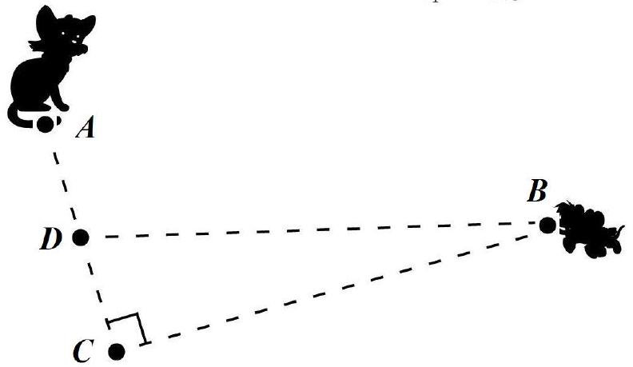
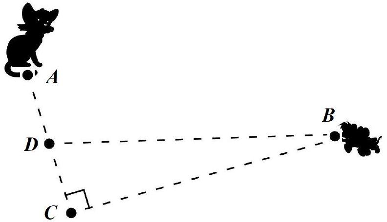

Предисловие: Последняя "перестрелка" Леопольда и мышей произошла в 2002 году, с тех пор мыши кота не беспокоили. Спустя 18 лет, в 2020 году, нашлись новые подводные камушки для легендарной рогатки и мыши решили "тряхнуть стариной".
Примечание: в ходе перестрелки никто из животных не пострадал.
В системе отсчёта Леопольда камень движется прямолинейно с постоянной скоростью $v _ { \text {отн. } }$ Расстояние от Леопольда до камня минимально, когда соединяющий их отрезок перпендикулярен вектору относительной скорости (см. рис.). Из подобия треугольников определим перемещение камня относительно Леопольда:

откуда

$$
L = \frac { v _ { \mathrm { oTH } } ^ { 2 } t } { v _ { 1 } }
$$

Найдем максимально возможное время, через которое скорости камня и Леопольда вновь станут перпендикулярны. Построим треугольники скоростей камня и Леопольда для максимального сближения, объединив их в один четырёхугольник. Заметим, что этот четырёхугольник можно вписать в окружность, поскольку сумма противоположных углов равна 180°. Диаметр окружности фиксирован и равен $v _ { \text {отн } }$. Поскольку $L$ максимально при максимальном значении $t$, необходимо, чтобы вторая диагональ четырёхугольника, равная $g t$, также была максимальна. Это достигается если $g t$ - диаметр данной окружности. Таким образом,

и окончательно:

$$
L _ { \max } = \frac { v _ { \mathrm { oTH } } ^ { 3 } } { g v _ { 1 } } = \frac { \left( v _ { 1 } ^ { 2 } + v _ { 2 } ^ { 2 } \right) ^ { \frac { 3 } { 2 } } } { g v _ { 1 } }
$$

Второе решение
Введём систему координат, как показано на рисунке. Пусть угол, под которым брошен камень к горизонту, равен $\alpha$. Получим зависимости координат, проекций скоростей и расстояния между камнем и Леопольдом от времени.

$$
x _ { \kappa } = v _ { 1 } t \cos \alpha ; y _ { \kappa } = v _ { 1 } t \sin \alpha - \frac { g t ^ { 2 } } { 2 }
$$

$$
v _ { y \kappa } = v _ { 1 } \sin \alpha - g t ; v _ { x \kappa } = v _ { 1 } \cos \alpha
$$

$$
\begin{gathered}
x _ { л } = L \cos \alpha - v _ { 2 } t \sin \alpha ; y _ { л } = L \sin \alpha + v _ { 2 } t \cos \alpha - \frac { g t ^ { 2 } } { 2 } \\
v _ { y л } = v _ { 1 } \cos \alpha - g t ; v _ { x л } = - v _ { 1 } \sin \alpha
\end{gathered}
$$

Расстояние между Леопольдом и камнем назовём $l$.

$$
\begin{gathered}
l ^ { 2 } = \left( x _ { \kappa } - x _ { л } \right) ^ { 2 } + \left( y _ { \kappa } - y _ { л } \right) ^ { 2 } \\
l ^ { 2 } = \left( L \cos \alpha - \left( v _ { 1 } \cos \alpha + v _ { 2 } \sin \alpha \right) t \right) ^ { 2 } + \left( L \sin \alpha - \left( v _ { 1 } \sin \alpha - v _ { 2 } \cos \alpha \right) t \right) ^ { 2 } \\
l ^ { 2 } = L ^ { 2 } - 2 v _ { 1 } L t + \left( v _ { 1 } ^ { 2 } + v _ { 2 } ^ { 2 } \right) t ^ { 2 }
\end{gathered}
$$

Минимальное значение $l$ достигается в вершине параболы в момент времени

$$
\tau = L v _ { 1 } / \left( v _ { 1 } ^ { 2 } + v _ { 2 } ^ { 2 } \right)
$$

Для нахождения максимально возможного значения $L$ необходимо найти максимально возможное значение $\tau$.
Пусть в момент времени $\tau$ скорость камня направлена под углом $\beta$ к горизонту. Поскольку в данный момент времени скорости Леопольда и камня перпендикулярны, скорость Леопольда направлена под углом $90 - \beta$ к горизонту. Значит, для этого момента времени можно записать

$$
v _ { y \kappa } / v _ { x \kappa } = - v _ { x л } / v _ { y л }
$$

$$
\left( v _ { 1 } \sin \alpha - g \tau \right) \left( v _ { 2 } \cos \alpha - g \tau \right) - v _ { 1 } v _ { 2 } \sin \alpha \cos \alpha = 0
$$

Из последнего соотношения находим $\tau$

$$
\tau = \frac { \left( v _ { 1 } \sin \alpha + v _ { 2 } \cos ( \alpha ) \right) } { g }
$$

Комбинируя два способа получения $\tau$, получим зависимость расстояния от угла броска камня

$$
L = \frac { \left( v _ { 1 } ^ { 2 } + v _ { 2 } ^ { 2 } \right) \left( v _ { 1 } \sin \alpha + v _ { 2 } \cos \alpha \right) } { g v _ { 1 } }
$$

Для нахождения максимума L необходимо найти максимум величины $v ^ { \prime } = \left( v _ { 1 } \sin \alpha + v _ { 2 } \cos \alpha \right)$

$$
\left( v ^ { \prime } - v _ { 1 } \sin \alpha \right) ^ { 2 } = v _ { 2 } ^ { 2 } \left( 1 - \sin ^ { 2 } \alpha \right)
$$

$$
\left( v _ { 1 } ^ { 2 } + v _ { 2 } ^ { 2 } \right) \sin ^ { 2 } \alpha - 2 v ^ { \prime } v _ { 1 } \sin \alpha + v ^ { 2 ^ { \prime } } - v _ { 2 } ^ { 2 } = 0
$$

Найдём дискриминант квадратного уравнения относительно \sina

$$
\begin{gathered}
D = 4 v ^ { 2 ^ { \prime } } v _ { 1 } ^ { 2 } - 4 \left( v _ { 1 } ^ { 2 } + v _ { 2 } ^ { 2 } \right) \left( v ^ { 2 ^ { \prime } } - v _ { 2 } ^ { 2 } \right) \\
\left. D = 4 v _ { 2 } ^ { 2 } \left( v _ { 1 } ^ { 2 } + v _ { 2 } ^ { 2 } \right) - v ^ { 2 ^ { \prime } } \right)
\end{gathered}
$$

Максимальное значение $v ^ { \prime }$ достигается при нулевом дискриминанте и равно

$$
v ^ { \prime } = \sqrt { v _ { 1 } ^ { 2 } + v _ { 2 } ^ { 2 } }
$$

Таким образом, максимально возможное значение

Ответ:

$$
L _ { \max } = \frac { \left( v _ { 1 } ^ { 2 } + v _ { 2 } ^ { 2 } \right) ^ { \frac { 3 } { 2 } } } { g v _ { 1 } }
$$

модулю следует, что $B D = \frac { L } { 2 }$, а также, что треугольник $D C B$ - прямоугольный, причём $\frac { v _ { 2 } } { v _ { 1 } } = \frac { C D } { B C }$. Измеряя $B C , B D$ и $C D$, получим

## камень

$$
\begin{gathered}
v _ { 2 } = \frac { C D } { B C } v _ { 1 } \\
B D = \sqrt { B C ^ { 2 } + C D ^ { 2 } } = \frac { \left( v _ { 1 } ^ { 2 } + v _ { 2 } ^ { 2 } \right) ^ { \frac { 3 } { 2 } } } { 2 g v _ { 1 } } = \frac { \left( B C ^ { 2 } + C D ^ { 2 } \right) ^ { \frac { 3 } { 2 } } } { B C ^ { 3 } } \frac { v _ { 1 } ^ { 2 } } { 2 g }
\end{gathered}
$$

Ответ:

$$
\begin{aligned}
& v _ { 1 } = \sqrt { \frac { 2 g B C } { B C ^ { 2 } + C D ^ { 2 } } } B C = 10,8 \mathrm {~m} / \mathrm { c } \\
& v _ { 2 } = \sqrt { \frac { 2 g B C } { B C ^ { 2 } + C D ^ { 2 } } } C D = 2,7 \mathrm {~m} / \mathrm { c }
\end{aligned}
$$

## камень

Второе решение
Выражение для $\sin \alpha$ из решения предыдущего пункта

$$
\sin \alpha = \frac { v _ { 1 } } { \sqrt { v _ { 1 } ^ { 2 } + v _ { 2 } ^ { 2 } } }
$$

Найдём координаты камня и расстояние между ним и Леопольдом в момент времени $\tau$

$$
\begin{gathered}
x _ { \kappa } = v _ { 1 } \tau \cos \alpha = \frac { v _ { 1 } v _ { 2 } } { g } \\
y _ { \kappa } = v _ { 1 } \tau \sin \alpha - \frac { g \tau ^ { 2 } } { 2 } = \frac { v _ { 1 } ^ { 2 } } { g } - \frac { v _ { 1 } ^ { 2 } + v _ { 2 } ^ { 2 } } { 2 g } = \frac { v _ { 1 } ^ { 2 } - v _ { 2 } ^ { 2 } } { 2 g } \\
l = \frac { \left( v _ { 1 } ^ { 2 } + v _ { 2 } ^ { 2 } \right) v _ { 2 } } { g v _ { 1 } }
\end{gathered}
$$

Таким образом, перемещение камня

$$
S _ { \kappa } = \frac { v _ { 1 } ^ { 2 } + v _ { 2 } ^ { 2 } } { 2 g }
$$

Измеряя перемещение камня, а также расстояние между ним и Леопольдом, мы получим систему из двух уравнений с двумя неизвестными. Выразим начальные скорости через $l$ и $S _ { k }$

$$
\begin{aligned}
& \frac { S _ { k } } { l } = \frac { v _ { 1 } } { 2 v _ { 2 } } \\
& v _ { 2 } = \frac { l } { 2 S _ { k } } v _ { 1 }
\end{aligned}
$$

$$
\begin{gathered}
S _ { k } = \frac { 1 + \frac { l ^ { 2 } } { 4 S _ { k } ^ { 2 } } } { 2 g } v _ { 1 } ^ { 2 } \\
v _ { 1 } = \sqrt { \frac { 8 g S _ { k } } { l ^ { 2 } + 4 S _ { k } ^ { 2 } } } S _ { k } = 10,8 \mathrm {~m} / \mathrm { c } \\
v _ { 2 } = \sqrt { \frac { 2 g S _ { k } } { l ^ { 2 } + 4 S _ { k } ^ { 2 } } } l = 2,7 \mathrm {~m} / \mathrm { c }
\end{gathered}
$$
