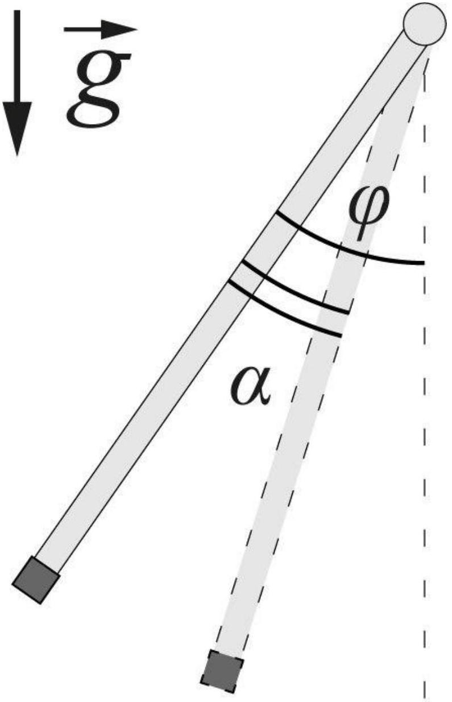

Пусть в положении равновесия угол между стержнем и вертикалью равен $\varphi$, причём он отсчитывается от нижнего положения частицы. Тогда из условия равновесия получим выражение для силы $F$

$$
F = m g \sin \varphi
$$

Отметим, что $0 \leq \varphi \leq \frac { \pi } { 2 }$, поскольку иначе положение равновесия неуйстойчиво.
Проанализируем последующее движение. Пусть $\alpha$ - угол поворота стержня от начального положения, а $L$ - его длина. Из второго закона Ньютона для тангенциального ускорения можно получить

$$
a _ { \tau } = \frac { F } { m } + g \sin ( \varphi - \alpha ) = g ( \sin \varphi + \sin ( \varphi - \alpha ) )
$$

Из выражения следует, что при $0 \leq \alpha \leq 2 \varphi$ частица разгоняется, при $2 \varphi < \alpha \leq \pi$ - замедляется, и при $\pi < \alpha \leq 2 ( \pi + \varphi )$ вновь разгоняется. Запишем закон сохранения механической энергии в произвольный момент времени

$$
- m g L \cos \varphi + F L \alpha = - m g L \cos ( \varphi - \alpha ) + \frac { m v ^ { 2 } } { 2 }
$$

Если остановка частицы происходит при значениях $\alpha < \pi$, то в дальнейшем частица будет двигаться в области, ограниченной двумя положениями её нулевой скорости. Если же частица преодолевает данный барьер, то при $\alpha > \pi$ её кинетическая энергия будет возрастать. Таким образом, необходимым условием полного оборота является ненулевая скорость в момент $\alpha = \pi$, или же

$$
v ^ { 2 } = \frac { 2 \pi L F } { m } - 4 g L \cos \varphi \geq 0
$$

Выразим $\cos ( \varphi )$ из первого соотношения

$$
\cos \varphi = \sqrt { 1 - \left( \frac { F } { m g } \right) ^ { 2 } }
$$

Из последних двух соотношений получим

$$
\frac { \pi F } { 2 } \geq \sqrt { ( m g ) ^ { 2 } - F ^ { 2 } }
$$

Также из условия равновесия стержня ясно, что

$$
F \leq m g
$$

и окончательный диапазон значений $F$

Ответ:

$$
m g \geq F \geq \frac { m g } { \sqrt { 1 + \left( \frac { \pi } { 2 } \right) ^ { 2 } } }
$$
