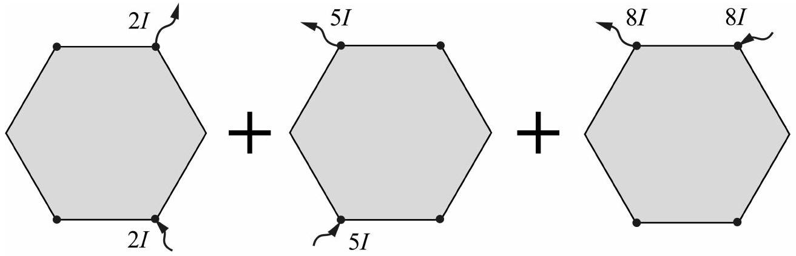
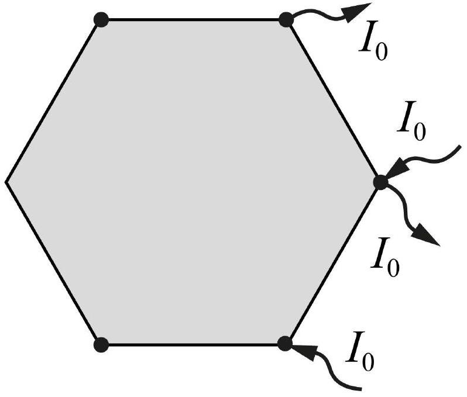

Воспользуемся локальным законом Ома

$$
\vec { j } = \frac { \vec { E } } { \rho }
$$

Для определения знаков и отношения проекций электрического поля достаточно найти те же соотношения между проекциями плотностей тока. Для этого воспользуемся методом наложения токов.

Между вершинами $D B$ пропустим силу тока $2 I$, между $E A - 5 I$, и между $B A - 8 I$.

При этом из симметрии ясно, что в первых двух ситуациях $j _ { y } > 0 , j _ { x } = 0$ и в третьей ситуации $j _ { x } < 0$ и $j _ { y } = 0$. Поскольку электрическое поле подчиняется принципу суперпозиции, вектор плотности тока - тоже. Таким образом

$$
E _ { x } < 0 \quad \text { и } \quad E _ { y } > 0
$$

При подключении источника к двум вершинам линии тока не меняются при увеличении силы тока. Поэтому введём коэффициент пропорциональности модуля плотности тока в центре и силы тока

$$
j = k I
$$

При разных подключениях коэффициент $k$ разный. Они одинаковы в первом и втором подключении. Обозначим его за $k _ { 1 }$. Коэффициент в третьем подключении обозначим за $k _ { 2 }$. Таким образом

$$
\frac { E _ { x } } { E _ { y } } = - \frac { 8 } { 7 } \frac { k _ { 2 } } { k _ { 1 } }
$$

Найдём соотношение между $k _ { 1 }$ и $k _ { 2 }$. Подключение к вершинам $A$ и $C$ эквивалентно суперпозиции подключений к $A B$ и $B C$, при которых коэффициенты равны $k _ { 2 }$.
Таким образом

$$
\frac { k _ { 2 } } { k _ { 1 } } = \frac { A B } { A C } = \frac { 1 } { \sqrt { 3 } }
$$

Окончательно имеем

Ответ:

$$
\frac { E _ { x } } { E _ { y } } = - \frac { 8 } { 7 \sqrt { 3 } }
$$
