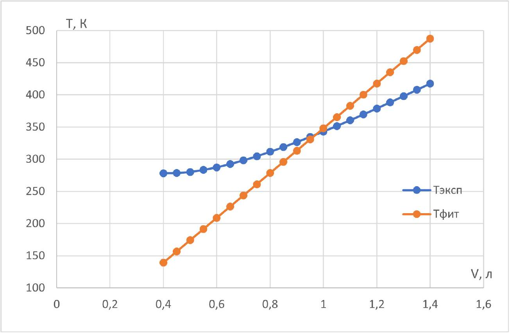
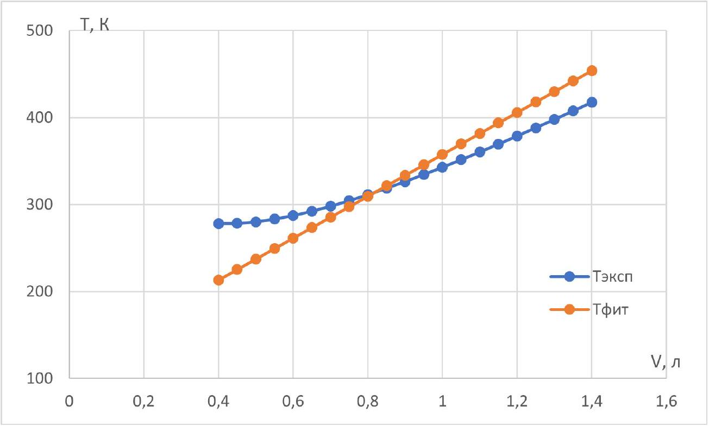
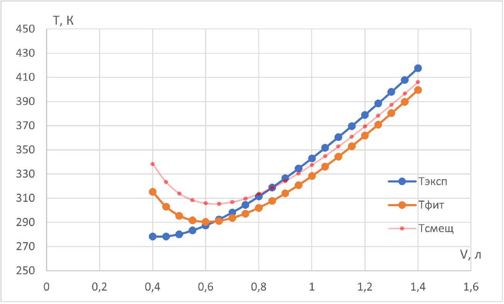
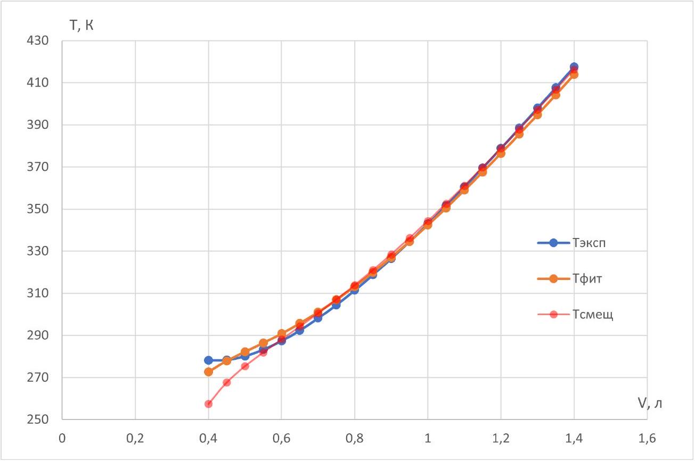

Будем решать задачу формально, выразим температуру из модельной функции и запишем сумму $S$, которую нужно минимизировать.

$$
\begin{gathered}
T = \frac { \left( p + a _ { 0 } \right) V } { R } \\
S = \sum _ { n } \left( T _ { i } - \frac { p V _ { i } } { R } - \frac { a _ { 0 } V _ { i } } { R } \right) ^ { 2 }
\end{gathered}
$$

Дифференцируем:

$$
\frac { \partial S } { \partial a _ { 0 } } = \sum _ { n } 2 \left( T _ { i } - \frac { \left( p + a _ { 0 } \right) V _ { i } } { R } \right) \left( - \frac { V _ { i } } { R } \right) = 0
$$

Преобразуем (сократив на "-2"):

$$
\frac { 1 } { R } \sum _ { n } T _ { i } V _ { i } - \frac { p + a _ { 0 } } { R ^ { 2 } } \sum _ { n } V _ { i } ^ { 2 } = 0
$$

И далее

$$
p + a _ { 0 } = \frac { R \sum _ { n } T _ { i } V _ { i } } { \sum _ { n } V _ { i } ^ { 2 } }
$$

Окончательно получаем

$$
a _ { 0 } = \frac { R \sum _ { n } T _ { i } V _ { i } } { \sum _ { n } V _ { i } ^ { 2 } } - p = R \frac { \overline { T V } } { \overline { V ^ { 2 } } } - p
$$

Примечание: Ответ можно было бы написать почти сразу, если осознать, что модельная формула - это линейная зависимость с одним параметром: угловым коэффициентом.

A2 ${ } ^ { 0.30 }$ Рассчитайте значения нужных вам сумм (или средних) для всего набора данных.

$$
\begin{aligned}
& \sum _ { n } T _ { i } V _ { i } = 6.5903 \mathrm { К } \cdot \mathrm { м } ^ { 3 } , \overline { T V } = 0.31382 \mathrm { К } \cdot \mathrm { м } ^ { 3 } \\
& \sum _ { n } V _ { i } ^ { 2 } = 1.8935 \cdot 10 ^ { - 5 } \mathrm {~m} ^ { 6 } , \overline { V ^ { 2 } } = 9.0167 \cdot 10 ^ { - 7 } \mathrm {~m} ^ { 6 }
\end{aligned}
$$

Здесь и далее сохраняем побольше значащих цифр для уменьшения погрешности округления итогового ответа.

А3 ${ } ^ { 0.40 }$ Рассчитайте значение $a _ { 0 }$. Укажите его с точностью до трех значащих цифр.
$a _ { 0 } = 892$ кПа

A4 ${ } ^ { 0.40 }$ Для каждого значения объема рассчитайте значение температуры, которое получается в результате фитирования. Постройте на одном графике исходные экспериментальные данные и точки фитирования. Данные разных серий отмечайте разными значками. Подпишите серии.

В1 ${ } ^ { 0.40 }$ Запишите выражение для нахождения оптимального значения $a _ { 1 }$ через суммы (или средние) величин $T , V$ и их комбинаций.

Действуем опять же формально:

$$
\begin{gathered}
T = \frac { p V } { R } + \frac { a _ { 1 } } { R } \\
S = \sum _ { n } \left( T _ { i } - \frac { p V _ { i } } { R } - \frac { a _ { 1 } } { R } \right) ^ { 2 } \\
\frac { \partial S } { \partial a _ { 1 } } = \sum _ { n } 2 \left( T _ { i } - \frac { p V _ { i } } { R } - \frac { a _ { 1 } } { R } \right) \left( - \frac { 1 } { R } \right) = 0 \\
\sum _ { n } T _ { i } - \frac { p } { R } \sum _ { n } V _ { i } - \frac { a _ { 1 } } { R } \sum _ { n } 1 = 0
\end{gathered}
$$

Откуда получаем окончательный ответ:

$$
a _ { 1 } = \frac { R \sum _ { n } T _ { i } - p \sum _ { n } V _ { i } } { n } = R \bar { T } - p \bar { V }
$$

В2 ${ } ^ { 0.30 }$ Рассчитайте значения нужных вам сумм (или средних) для всего набора данных.

$$
\begin{aligned}
& \sum _ { n } T _ { i } = 7009.2 \mathrm { К } , \bar { T } = 333.771 \mathrm { К } \\
& \sum _ { n } V _ { i } = 0.0189 \mathrm { M } ^ { 3 } , \bar { V } = 0.0009 \mathrm { м } ^ { 3 }
\end{aligned}
$$

В3 ${ } ^ { 0.40 }$ Рассчитайте значение $a _ { 1 }$. Укажите его с точностью до трех значащих цифр.

$$
a _ { 1 } = 974 П а \cdot \mathrm {~m} ^ { 3 }
$$

В4 ${ } ^ { 0,40 }$ Для каждого значения объема рассчитайте значение температуры, которое получается в результате фитирования. Постройте на одном графике исходные экспериментальные данные и точки фитирования. Данные разных серий отмечайте разными значками. Подпишите серии.

С1 ${ } ^ { 0.40 }$ Запишите выражение для нахождения оптимального значения $a _ { 2 }$ через суммы (или средние) величин $T , V$ и их комбинаций.

Действуем опять же формально:

$$
\begin{gathered}
T = \frac { p V } { R } + \frac { a _ { 2 } } { V R } \\
S = \sum _ { n } \left( T _ { i } - \frac { p V _ { i } } { R } - \frac { a _ { 2 } } { V _ { i } R } \right) ^ { 2 } \\
\frac { \partial S } { \partial a _ { 2 } } = \sum _ { n } 2 \left( T _ { i } - \frac { p V _ { i } } { R } - \frac { a _ { 2 } } { V _ { i } R } \right) \left( - \frac { 1 } { V _ { i } R } \right) = 0 \\
- \frac { 1 } { R } \sum _ { n } \frac { T _ { i } } { V _ { i } } + \frac { p } { R ^ { 2 } } \sum _ { n } 1 + \frac { a _ { 2 } } { R ^ { 2 } } \sum _ { n } \frac { 1 } { V _ { i } ^ { 2 } } = 0
\end{gathered}
$$

Откуда окончательно получаем:

$$
a _ { 2 } = \frac { R \sum _ { n } \frac { T _ { i } } { V _ { i } } - p n } { \sum _ { n } \frac { 1 } { V _ { i } ^ { 2 } } } = \frac { R \overline { \left( \frac { T } { V } \right) } - p } { \overline { \left( \frac { 1 } { V ^ { 2 } } \right) } }
$$

Примечание: Интуитивно можно было бы пойти путем линеаризации $p V ^ { 2 } + a _ { 2 } = R T V$, и по аналогии с пунктом В1 написать, что $a _ { 2 } = R \overline { T V } - p \overline { V ^ { 2 } }$. Это ошибочный путь и неверное решение. При расчете таким способом оценка для $a _ { 2 }$ будет "смещенной". В решении пункта СЗ мы рассчитаем значения обоими способами и убедимся в том, что применение линеаризации приводит к более высокому значению суммы квадратов отклонений.

C2 ${ } ^ { 0.30 }$ Рассчитайте значения нужных вам сумм (или средних) для всего набора данных.

$$
\begin{aligned}
& \sum _ { n } \frac { T _ { i } } { V _ { i } } = 8489686 \mathrm {~K} / \mathrm { M } ^ { 3 } , \overline { \left( \frac { T } { V } \right) } = 404271 \mathrm {~K} / \mathrm { M } ^ { 3 } \\
& \sum _ { n } \frac { 1 } { V _ { i } ^ { 2 } } = 39221160 \mathrm { M } ^ { - 6 } , \overline { \left( \frac { 1 } { V ^ { 2 } } \right) } = 1867674 \mathrm { M } ^ { - 6 }
\end{aligned}
$$

с3 ${ } ^ { 0.40 }$ Рассчитайте значение $a _ { 2 }$. Укажите его с точностью до трех значащих цифр.
$a _ { 2 } = 0.728$ Па $\cdot$ м $^ { 6 }$
Для расчета $a _ { 2 } ^ { * }$ для линеаризованной зависимости у нас уже посчитаны все величины (пункт А2). Поэтому $a _ { 2 } ^ { * } = 0.805$. Если рассчитать $S \left( a _ { 2 } ^ { * } \right) = 8813 К ^ { 2 }$, то оно окажется больше, чем $S \left( a _ { 2 } \right) = 5478 К ^ { 2 }$.

С4 ${ } ^ { 0,40 }$ Для каждого значения объема рассчитайте значение температуры, которое получается в результате фитирования. Постройте на одном графике исходные экспериментальные данные и точки фитирования. Данные разных серий отмечайте разными значками. Подпишите серии.

D1 ${ } ^ { 1.50 }$ Запишите выражения для нахождения оптимальных значений $c$ и $d$ через суммы (или средние) величин $T , V$ и их комбинаций.

Действуем опять же формально:

$$
\begin{gathered}
T = \frac { p V } { R } + \frac { C } { R V } + \frac { d } { R V ^ { 2 } } \\
S = \sum _ { n } \left( T _ { i } - \frac { p V _ { i } } { R } - \frac { c } { R V _ { i } } - \frac { d } { R V _ { i } ^ { 2 } } \right) ^ { 2 }
\end{gathered}
$$

Дифференцируя, получаем систему уравнений:

$$
\begin{gathered}
\frac { \partial S } { \partial c } = \sum _ { n } 2 \left( T _ { i } - \frac { p V _ { i } } { R } - \frac { c } { R V _ { i } } - \frac { d } { R V _ { i } ^ { 2 } } \right) \left( - \frac { 1 } { R V _ { i } } \right) = 0 \\
\frac { \partial S } { \partial d } = \sum _ { n } 2 \left( T _ { i } - \frac { p V _ { i } } { R } - \frac { C } { R V _ { i } } - \frac { d } { R V _ { i } ^ { 2 } } \right) \left( - \frac { 1 } { R V _ { i } ^ { 2 } } \right) = 0
\end{gathered}
$$

Преобразуем систему:

$$
\begin{gathered}
R \sum _ { n } \frac { T _ { i } } { V _ { i } } - p \sum _ { n } 1 - c \sum _ { n } \frac { 1 } { V _ { i } ^ { 2 } } - d \sum _ { n } \frac { 1 } { V _ { i } ^ { 3 } } = 0 \\
R \sum _ { n } \frac { T _ { i } } { V _ { i } ^ { 2 } } - p \sum _ { n } \frac { 1 } { V _ { i } } - c \sum _ { n } \frac { 1 } { V _ { i } ^ { 3 } } - d \sum _ { n } \frac { 1 } { V _ { i } ^ { 4 } } = 0
\end{gathered}
$$

Перейдем к средним значениям и приведем систему к удобному виду:

$$
\begin{gathered}
c \overline { V ^ { - 2 } } + \overline { d V ^ { - 3 } } = R \overline { T / V } - p \\
c \overline { V ^ { - 3 } } + \overline { d V ^ { - 4 } } = R \overline { T / V ^ { 2 } } - p \overline { V ^ { - 1 } }
\end{gathered}
$$

Откуда, решая совместно уравнения, получим ответы:

$$
\begin{aligned}
& c = \frac { R \left( \overline { T / V ^ { 2 } } \overline { V ^ { - 3 } } - \overline { T / V } \overline { V ^ { - 4 } } \right) - p \left( \overline { V ^ { - 1 } } \overline { V ^ { - 3 } } - \overline { V ^ { - 4 } } \right) } { \left( \overline { V ^ { - 3 } } \right) ^ { 2 } - \overline { V ^ { - 2 } } \overline { V ^ { - 4 } } } \\
& d = \frac { R \left( \overline { T / V ^ { 2 } } \overline { V ^ { - 2 } } - \overline { T / V } \overline { V ^ { - 3 } } \right) - p \left( \overline { V ^ { - 1 } } \overline { V ^ { - 2 } } - \overline { V ^ { - 3 } } \right) } { \overline { V ^ { - 2 } } \overline { V ^ { - 4 } } - \left( \overline { V ^ { - 3 } } \right) ^ { 2 } }
\end{aligned}
$$

Примечание: Аналогично пункту С1, можно было бы привести модельную функцию к линейной зависимости: $c V + d = R T V ^ { 2 } - p V ^ { 3 }$, и определять коэффициенты $c$ и $d$ по формулам, приведенным во введении к задаче. Это ошибочный путь и неверное решение. При расчете таким способом оценки для $c$ и $d$ будут "смещенными".

Две величины $\overline { T / V }$ и $\overline { V ^ { - 2 } }$ у нас посчитаны в пункте С2.

$$
\begin{aligned}
& \overline { V ^ { - 1 } } = 1270.76 \mathrm {~m} ^ { - 3 } \\
& \overline { V ^ { - 3 } } = 3.13694 \cdot 10 ^ { 9 } \mathrm { M } ^ { - 9 } \\
& \overline { V ^ { - 4 } } = 5.85765 \cdot 10 ^ { 12 } \mathrm { M } ^ { - 12 } \\
& \overline { T / V ^ { 2 } } = 0.568387 \cdot 10 ^ { 9 } \mathrm {~K} / \mathrm { M } ^ { 6 }
\end{aligned}
$$

D3 ${ } ^ { 1.00 }$ Рассчитайте значения $c$ и $d$. Укажите их с точностью до трех значащих цифр.

$$
\begin{aligned}
& c = 1.02 П \mathrm { a } \cdot \mathrm { м } ^ { 6 } \\
& d = - 1.73 \cdot 10 ^ { - 4 } П \mathrm { a } \cdot \mathrm { M } ^ { 9 }
\end{aligned}
$$

Смещенные значения:

$$
c ^ { * } = 1.08 \text { Па } \cdot \mathrm { M } ^ { 6 } , d ^ { * } = - 2.17 \cdot 10 ^ { - 4 } \text { Па } \cdot \mathrm { M } ^ { 9 }
$$

D4 ${ } ^ { 1.00 }$ Для каждого значения объема рассчитайте значение температуры, которое получается в результате фитирования. Постройте на одном графике исходные экспериментальные данные и точки фитирования. Данные разных серий отмечайте разными значками. Подпишите серии.

E1 ${ } ^ { \text {?? } }$ Рассчитайте значения $a$ и $b$. Укажите их с точностью до трех значащих цифр. Оцените масштаб работы, проведенной Ван-дер-Ваальсом.

В этой части задачи нужно аналогично формально выполнить минимизацию суммы по параметрам $a$ и $b$. Итоговая система уравнений на параметры будет выглядеть следующим образом:

$$
\left\{ \begin{array} { l }
\alpha _ { 1 } a + \alpha _ { 2 } b + \alpha _ { 3 } a b + \alpha _ { 4 } a ^ { 2 } + \alpha _ { 5 } a ^ { 2 } b = c _ { 1 } \\
\beta _ { 1 } a + \beta _ { 2 } b + \beta _ { 3 } a b + \beta _ { 4 } b ^ { 2 } + \beta _ { 5 } a b ^ { 2 } = c _ { 2 }
\end{array} \right.
$$

Коэффициенты $\alpha _ { i }$ и $\beta _ { i }$ связаны целиком со средними величинами, посчитанными в пункте D2. T.е. дополнительно ничего считать не требовалось бы. Каждое из уравнений линейно по одной из переменной и квадратично по второй. Поэтому систему можно свести к уравнению пятой степени на одну из переменных. Уравнение пятой степени точно имеет как минимум одно действительное решение.
