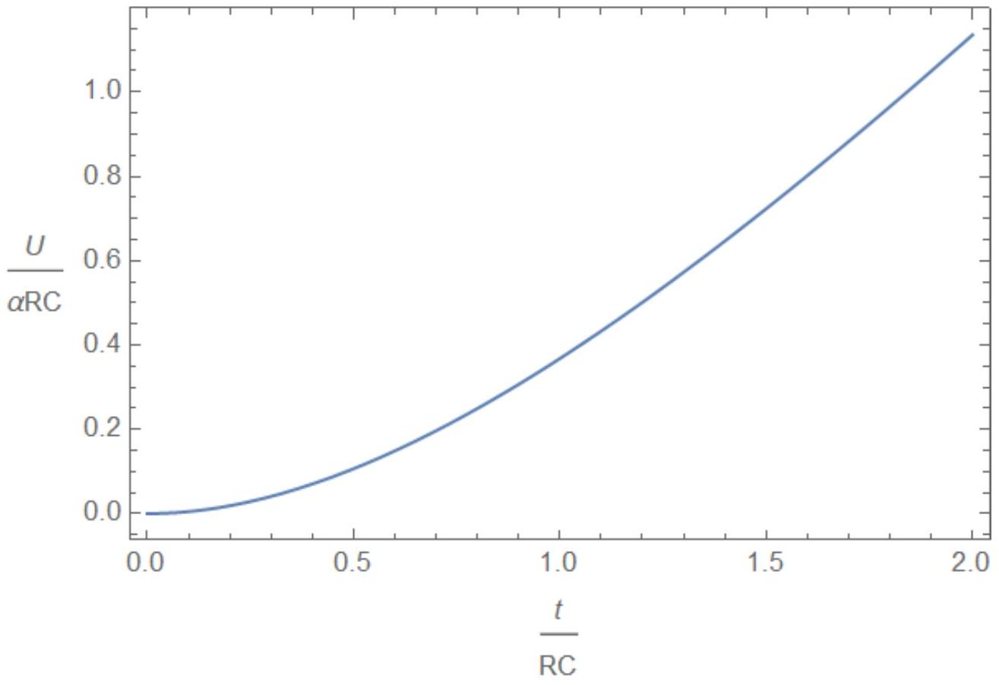
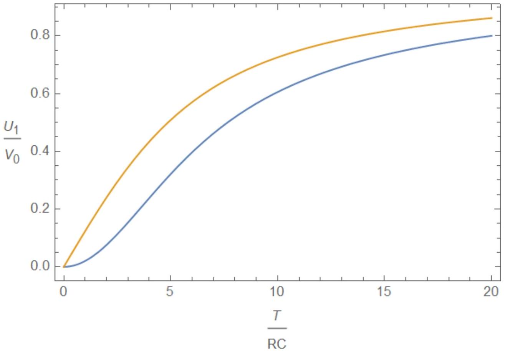
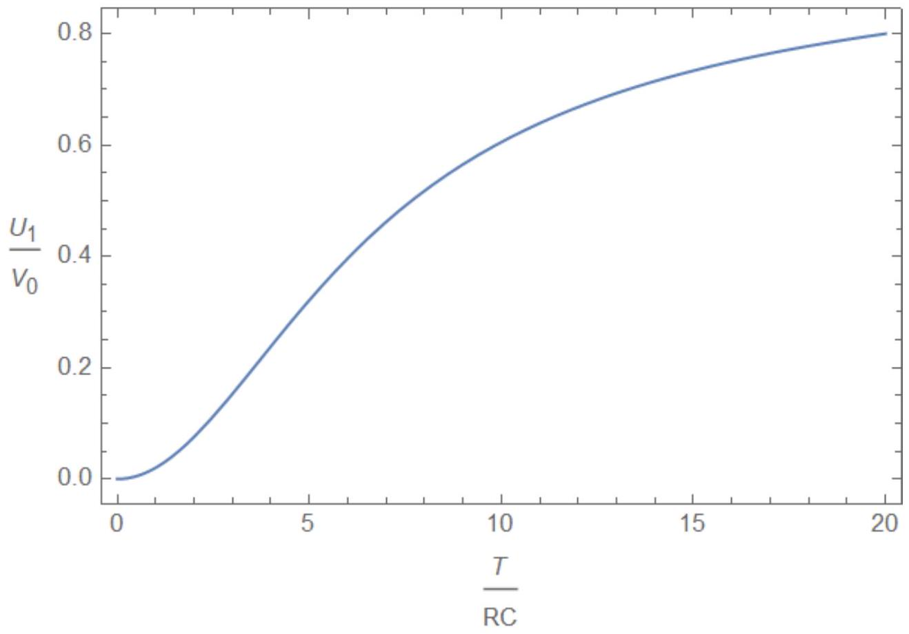

А1 ${ } ^ { 0.30 }$ Изначально заряд конденсатора равен нулю. Пусть в момент времени $t = 0$ на вход цепи подается постоянное напряжение $V = V _ { 0 }$. Найдите зависимость напряжения на конденсаторе от времени $U ( t )$ при $t > 0$.

Мгновенное значение тока через конденсатор

$$
I = \frac { V _ { 0 } - U } { R }
$$

Ток равен производной заряда конденсатора $I = \frac { d q } { d t }$, а заряд можно выразить через напряжение. $q = C U$, откуда $I = C \frac { d U } { d t }$, поэтому уравнение на напряжение

$$
\frac { d U } { d t } = \frac { 1 } { R C } \left( V _ { 0 } - U \right)
$$

a eго решение

Ответ:

$$
U = V _ { 0 } \left( 1 - e ^ { - t / R C } \right)
$$

А2 ${ } ^ { 0.20 }$ Найдите зависимость тока через резистор от времени $I ( t ) ( t > 0 )$.

$$
I = C \frac { d U } { d t }
$$

Ответ:

$$
I = \frac { V _ { 0 } } { R } e ^ { - t / R C }
$$

А3 ${ } ^ { 0.20 }$ Найдите тепло $Q _ { 0 }$, которое выделится на резисторе за все время процесса.

Через цепь за все время проходит заряд $q = C V _ { 0 }$, над которым совершается работа $A = V _ { 0 } q = C V _ { 0 } ^ { 2 }$. Конечная энергия конденсатора $W = C V _ { 0 } ^ { 2 } / 2$, а тепло $Q = A - W$

Ответ:

$$
Q = C V _ { 0 } ^ { 2 } - \frac { C V _ { 0 } ^ { 2 } } { 2 } = \frac { C V _ { 0 } ^ { 2 } } { 2 } .
$$

д4 ${ } ^ { 0.60 }$ Пусть теперь начальное напряжение на конденсаторе при $t = 0$ равно $U _ { 1 }$, и как и раньше на вход подается постоянное напряжение $V = V _ { 0 }$. Найдите зависимость напряжения на конденсаторе от времени $U ( t )$ и тока через резистор $I ( t )$.

Уравнение на напряжение такое же, как и в первом пункте, а его решение, с учетом начальных условий

Ответ:

$$
U = V _ { 0 } - \left( V _ { 0 } - U _ { 1 } \right) e ^ { - t / R C } , \quad I = \frac { V _ { 0 } - U _ { 1 } } { R } e ^ { - t / R C } .
$$

A5 ${ } ^ { 0.70 }$ Найдите количество теплоты $Q _ { 1 }$, которое выделится за все время процесса из пункта \textbf\{A4\}. Постройте (качественно) график зависимости $Q _ { 1 }$ от $U _ { 1 }$.

Через цепь за время зарядки протекает заряд $q = C \left( V _ { 0 } - U _ { 1 } \right)$, изменение энергии конденсатора $\Delta W = \frac { C V _ { 0 } ^ { 2 } } { 2 } - \frac { C U _ { 1 } ^ { 2 } } { 2 }$, работа источника $A = V _ { 0 } q$, поэтому выделившееся тепло

$$
Q = A - \Delta W = C V _ { 0 } ^ { 2 } - C V _ { 0 } U _ { 1 } - \frac { C V _ { 0 } ^ { 2 } } { 2 } + \frac { C U _ { 1 } ^ { 2 } } { 2 } = \frac { C \left( V _ { 0 } - U _ { 1 } \right) ^ { 2 } } { 2 }
$$

Ответ:

$$
Q = \frac { C \left( V _ { 0 } - U _ { 1 } \right) ^ { 2 } } { 2 } .
$$

В1 ${ } ^ { 0.30 }$ Пусть прошло достаточно большое время. Найдите выражение для тока через резистор $I ( t )$.

Заряд конденсатора через большое время $q = C U \approx C V = C \alpha t$, а ток $I = d q / d t$

Ответ:

$$
I = C \alpha .
$$

В2 ${ } ^ { 0.20 }$ Найдите количество теплоты $Q$, которое выделится на резисторе за достаточно большое время $t$.

Мощность после установления процесса $P = I ^ { 2 } R \approx C ^ { 2 } \alpha ^ { 2 } R$

Ответ:

$$
Q = C ^ { 2 } \alpha ^ { 2 } R t .
$$

Вз ${ } ^ { 0.10 }$ Найдите ток через резистор $I$. Выразите его через мгновенное значение напряжения на конденсаторе $U$, входное напряжение $V$ и параметры схемы.

Ответ:

$$
I = \frac { V - U } { R } .
$$

В4 ${ } ^ { 0.10 }$ Выразите скорость изменения напряжения на конденсаторе $d U / d t$ через ток через резистор $I$ и параметры схемы.

Ответ:

$$
\frac { d U } { d t } = \frac { 1 } { C } I
$$

В5 ${ } ^ { 0.40 }$ Продифференцировав уравнение из \textbf\{B3\}, получите дифференциальное уравнение на ток через резистор, то есть выразите $d I / d t$ через $I$, параметры схемы и постоянную $\alpha$.

Ответ:

$$
\frac { d I } { d t } = \frac { 1 } { R } \left( \frac { d V } { d t } - \frac { d U } { d t } \right) = \frac { 1 } { R } \left( \alpha - \frac { I } { C } \right)
$$

В6 0.10 Чему равен ток через резистор в начальный момент времени $I ( 0 )$ ?

Ответ:

$$
I = 0 .
$$

Из уравнения видно, что ток возрастает, как напряжение на конденсаторе при его зарядке, причем максимальное значение тока $C \alpha$, а характерное время изменения тока $\tau = R C$, как и при зарядке конденсатора.

Ответ:

$$
I = C \alpha \left( 1 - e ^ { - t / R C } \right)
$$

В8 ${ } ^ { 0.70 }$ Найдите зависимость напряжения на конденсаторе от времени $U ( t )$. Постройте (качественно) график зависимости напряжения от времени.

Заряд на конденсаторе можно найти, интегрируя ток (при этом начальный заряд равен нулю):

$$
q = \int _ { 0 } ^ { t } I ( t ) d t = C \alpha \left( t - R C \left( 1 - e ^ { - t / R C } \right) \right) = C \alpha \left( t - R C + R C e ^ { - t / R C } \right)
$$

а напряжение $U = q / C$

Ответ:

$$
U = \alpha t - \alpha R C \left( 1 - e ^ { - t / R C } \right) .
$$

Ответ:

в9 ${ } ^ { 0.50 }$ Найдите количество тепла $Q ( t )$, которое выделится на резисторе за время $t$.

На резисторе выделяется мощность $P = I ^ { 2 } ( t ) R$, интегрируя ее, найдем выделившееся тепло

$$
Q = \int _ { 0 } ^ { t } I ^ { 2 } ( t ) R d t = C ^ { 2 } \alpha ^ { 2 } R \int _ { 0 } ^ { t } \left( 1 - e ^ { - t / R C } \right) ^ { 2 } d t
$$

Ответ:

$$
Q = C ^ { 2 } \alpha ^ { 2 } R \left( t - 2 R C \left( 1 - e ^ { - t / R C } \right) + \frac { R C } { 2 } \left( 1 - e ^ { - 2 t / R C } \right) \right)
$$

В10 ${ } ^ { 0.30 }$ Найдите зависимость напряжения на конденсаторе от времени при $t > T$.

Эта задача аналогична задаче из пункта А4. Тут в качестве начального напряжения нужно использовать напряжение в момент времени $T$. Также нужно использовать соотношение $V _ { 0 } = \alpha T$.
Тогда $V _ { 0 } - U _ { 1 } = \alpha R C \left( 1 - e ^ { - T / R C } \right)$.

Ответ:

$$
U = V _ { 0 } - \alpha R C \left( 1 - e ^ { - T / R C } \right) e ^ { - \frac { t - T } { R C } } .
$$

В11 ${ } ^ { 0.30 }$ Найдите количество тепла $Q _ { 2 }$, которое выделилось на резисторе при $t > T$.

Это количество тепла можно вычислить с помощью результата из A5.

$$
Q _ { 2 } = \frac { C \left( V _ { 0 } - U _ { 1 } \right) ^ { 2 } } { 2 } = \frac { 1 } { 2 } \alpha ^ { 2 } R ^ { 2 } C ^ { 3 } \left( 1 - e ^ { - T / R C } \right) ^ { 2 } .
$$

Ответ:

$$
Q _ { 2 } = \frac { 1 } { 2 } \alpha ^ { 2 } R ^ { 2 } C ^ { 3 } \left( 1 - e ^ { - T / R C } \right) ^ { 2 } .
$$

В12 ${ } ^ { 0.40 }$ Найдите количество теплоты $Q _ { T }$, которое выделилось на резисторе за все время зарядки конденсатора.

Складываем ответы из В9 и В11, приводим подобные слагаемые, заменяем $\alpha = V _ { 0 } / T$.

Ответ:

$$
Q _ { T } = \frac { R C } { T } C V _ { 0 } ^ { 2 } - C V _ { 0 } ^ { 2 } \frac { R ^ { 2 } C ^ { 2 } } { T ^ { 2 } } \left( 1 - e ^ { - T / R C } \right) .
$$

В13 ${ } ^ { \mathbf { 0 . 6 0 } }$ Найдите отношение $k = Q _ { T } / Q _ { 0 }$. Здесь $Q _ { 0 }$ - тепло, которое выделяется на резисторе, когда на вход схемы мгновенно подается напряжение $V _ { 0 }$ (см. пункт \textbf\{A3\}), $Q _ { T }$ определено в предыдущем пункте.
Запишите приближенное выражение для $k$ при $T \gg R C$.
$Q _ { 0 } = C V _ { 0 } ^ { 2 } / 2$, с учетом этого

$$
k = \frac { 2 R C } { T } - \frac { 2 R ^ { 2 } C ^ { 2 } } { T ^ { 2 } } \left( 1 - e ^ { - T / R C } \right) .
$$

На больших временах второе слагаемое много меньше первого,

$$
k \approx \frac { 2 R C } { T } .
$$

Заметим также, что при маленьких временах

$$
e ^ { - T / R C } \approx 1 - \frac { T } { R C } + \frac { T ^ { 2 } } { 2 R ^ { 2 } C ^ { 2 } } - \frac { T ^ { 3 } } { 6 R ^ { 3 } C ^ { 3 } } ,
$$

поэтому

$$
k \approx 1 - \frac { T } { 3 R C }
$$

Ответ:

$$
k = \frac { 2 R C } { T } - \frac { 2 R ^ { 2 } C ^ { 2 } } { T ^ { 2 } } \left( 1 - e ^ { - T / R C } \right) \approx \frac { 2 R C } { T } .
$$

С1 ${ } ^ { 0.20 }$ Пусть прошло достаточно большое время и колебания установились. Как при этом должны быть связаны $U _ { 1 }$ и $U _ { 2 }$ ?

В установившемся режиме противоположным значениям внешнего напряжения отвечают противоположные значения напряжения на конденсаторе.

Ответ:

$$
U _ { 2 } = - U _ { 1 } .
$$

С2 ${ } ^ { 0.20 }$ Чему равен ток через резистор $I _ { 1 }$, когда напряжение на входе равно $V _ { 0 }$ ?

Ответ:

$$
I _ { 1 } = \frac { V _ { 0 } - U _ { 1 } } { R } .
$$

C3 ${ } ^ { 0.40 }$ По аналогии с пунктом \textbf\{B4\} напишите уравнение, которому удовлетворяет ток через резистор на участке, где входное напряжение линейно затухает.

Входное напряжение на рассматриваемом участке

$$
V = V _ { 0 } - \frac { 4 V _ { 0 } } { T } t
$$

В уравнение для тока входит только $d V / d t$, поэтому постоянное слагаемое на него не влияет. Тогда уравнение совпадает с уравнением из пункта В5 с $\alpha = - 4 V _ { 0 } / T$.

Ответ:

$$
\frac { d I } { d t } = \frac { 1 } { R } \left( - \frac { 4 V _ { 0 } } { T } - \frac { I } { C } \right)
$$

С4 ${ } ^ { 0.50 }$ С учетом предыдущих двух пунктов найдите зависимость тока от времени на участке, где входное напряжение линейно затухает. Для простоты записи считайте, что этот участок начинается в момент времени $t = 0$.

Через большое время ток будет равен $I _ { 2 } = - 4 C V _ { 0 } / T$, а общее решение уравнения имеет вид

$$
I = I _ { 2 } + \left( I _ { 1 } - I _ { 2 } \right) e ^ { - t / R C }
$$

Ответ:

$$
I = - \frac { 4 C V _ { 0 } } { T } + \left( \frac { V _ { 0 } - U _ { 1 } } { R } + \frac { 4 C V _ { 0 } } { T } \right) e ^ { - t / R C }
$$

С5 ${ } ^ { 0.60 }$ Используя найденное выражение для тока, выразите напряжение на конденсаторе в конце линейного участка $U _ { 2 }$ через напряжение в начале $U _ { 1 }$ и параметры задачи.

Изменение заряда на конденсаторе за время уменьшения напряжения

$$
\Delta q = \int _ { 0 } ^ { T / 2 } I ( t ) d t = - 2 C V _ { 0 } + R C \left( \frac { V _ { 0 } - U _ { 1 } } { R } + \frac { 4 C V _ { 0 } } { T } \right) \left( 1 - e ^ { - T / 2 R C } \right)
$$

тогда изменение напряжения

$$
\Delta U = \frac { \Delta q } { C } = U _ { 2 } - U _ { 1 } = - V _ { 0 } - U _ { 1 } + \frac { 4 R C } { T } V _ { 0 } - \left( V _ { 0 } - U _ { 1 } + \frac { 4 R C } { T } \right) e ^ { - T / 2 R C } .
$$

Ответ:

$$
U _ { 2 } = - V _ { 0 } + \frac { 4 R C } { T } V _ { 0 } - \left( V _ { 0 } - U _ { 1 } + \frac { 4 R C } { T } \right) e ^ { - T / 2 R C } .
$$

С6 ${ } ^ { 1.00 }$ Найдите максимальное напряжение на конденсаторе $U _ { 1 }$ в установившемся режиме. Напишите приближенные выражения для $U _ { 1 }$ при $T \ll R C$ и $T \gg R C$.

Решая уравнение $U _ { 2 } = - U _ { 1 }$ относительно $U _ { 1 }$ найдем (для удобства записи мы используем так называемую гиперболическую функцию $\tanh x$, при желании ответ можно записать и просто через экспоненты.)

При больших значениях аргумента $\tanh x \approx 1$ и $U _ { 1 } \approx V _ { 0 } ( 1 - 4 R C / T ) \approx V _ { 0 }$, при малых значениях аргумента $\tanh x \approx x - x ^ { 3 } / 3$, $U _ { 1 } \approx \frac { T ^ { 2 } } { 48 R ^ { 2 } C ^ { 2 } } V _ { 0 }$.

Если ответ для поведения функции не получается получить аналитически, это можно сделать и численно, вычисляя значения для малых значений времени $T / R C$. Так можно убедиться, что при малых временах $U _ { 1 } \sim T ^ { 2 }$.

Ответ:

$$
U _ { 1 } = V _ { 0 } \left( 1 - \frac { 4 R C } { T } \tanh \frac { T } { 4 R C } \right) , \quad \tanh x = \frac { e ^ { x } - e ^ { - x } } { e ^ { x } + e ^ { - x } } .
$$

Заметим, что значение $U _ { 1 }$ на самом деле не является максимальным значением напряжения на конденсаторе, поскольку конденсатор продолжает заряжаться еще некоторое время после того, как входное напряжение начало убывать. Максимальное значение напряжения достигается, когда ток через конденсатор обращается в 0 , после чего знак тока меняется и конденсатор начинает разряжаться. Это время $t _ { 1 }$ можно найти из условия

$$
I \left( t _ { 1 } \right) = 0 = - \frac { 4 C V _ { 0 } } { T } + \left( I _ { 1 } + \frac { 4 C V _ { 0 } } { T } \right) e ^ { - t _ { 1 } / R C }
$$

поэтому

$$
e ^ { - t _ { 1 } / R C } = \frac { 4 C V _ { 0 } / T } { I _ { 1 } + 4 C V _ { 0 } / T } , \quad I _ { 1 } = \frac { V _ { 0 } - U _ { 1 } } { R } = \frac { 4 C V _ { 0 } } { T } \tanh \frac { T } { 4 R C } .
$$

За время $t _ { 1 }$ в конденсатор затечет дополнительный заряд

$$
\Delta q _ { 1 } = \int _ { 0 } ^ { t _ { 1 } } I ( t ) d t = - 4 C V _ { 0 } \frac { t _ { 1 } } { T } + + R C \left( I _ { 1 } + \frac { 4 C V _ { 0 } } { T } \right) \left( 1 - e ^ { - t _ { 1 } / R C } \right)
$$

Подставляя во второе сложение выражение для экспоненты и напряжения $U _ { 1 }$ получим

$$
\Delta q _ { 1 } = - 4 C V _ { 0 } \frac { t _ { 1 } } { T } + R C I _ { 1 } .
$$

Тогда максимальное напряжение

$$
U _ { \max } = U _ { 1 } + \frac { \Delta q _ { 1 } } { C } = V _ { 0 } - 4 V _ { 0 } \frac { t _ { 1 } } { T } = V _ { 0 } \left( 1 - \frac { 4 R C } { T } \ln \left( 1 + \tanh \frac { T } { 4 R C } \right) \right) .
$$

Это напряжение больше $U _ { 1 }$, при малых значениях времени оно зависит от времени линейно.

Ответ:

