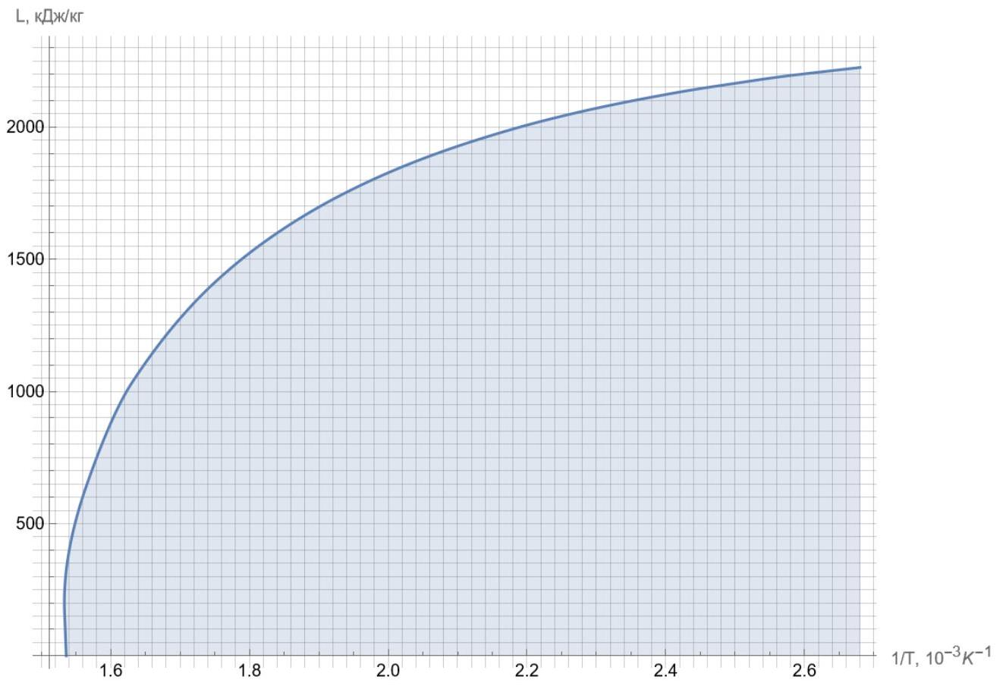

А1 ${ } ^ { 1.00 }$ Запишите уравнение, которое позволит с помощью метода простой итерации найти величину $\frac { T _ { \mathrm { c } } } { L _ { 0 } }$, и уравнения, с помощью которых отсюда можно будет найти сами величины $T _ { \mathrm { c } }$ и $L _ { 0 }$.

$$
\begin{gathered}
\left\{ \begin{array} { l }
\frac { L _ { 1 } } { L _ { 0 } } = \operatorname { th } \left[ \frac { L _ { 1 } T _ { \mathrm { c } } } { L _ { 0 } T _ { 1 } } \right] \\
\frac { L _ { 2 } } { L _ { 0 } } = \operatorname { th } \left[ \frac { L _ { 2 } T _ { \mathrm { c } } } { L _ { 0 } T _ { 2 } } \right]
\end{array} \Longrightarrow L _ { 1 } \operatorname { th } \left[ \frac { L _ { 2 } T _ { \mathrm { c } } } { L _ { 0 } T _ { 2 } } \right] = L _ { 2 } \operatorname { th } \left[ \frac { L _ { 1 } T _ { \mathrm { c } } } { L _ { 0 } T _ { 1 } } \right] \Longrightarrow \frac { T _ { \mathrm { c } } } { L _ { 0 } } = \frac { T _ { 2 } } { L _ { 2 } } \operatorname { arth } \left[ \frac { L _ { 2 } } { L _ { 1 } } \operatorname { th } \left[ \frac { L _ { 1 } } { T _ { 1 } } \frac { T _ { \mathrm { c } } } { L _ { 0 } } \right] \right] \right. \\
\Longrightarrow L _ { 0 } = L _ { 1 } / \operatorname { th } \left[ \frac { L _ { 1 } } { T _ { 1 } } \frac { T _ { \mathrm { c } } } { L _ { 0 } } \right] , \quad T _ { \mathrm { c } } = L _ { 0 } \times \frac { T _ { \mathrm { c } } } { L _ { 0 } }
\end{gathered}
$$

Ответ:

$$
\frac { T _ { \mathrm { c } } } { L _ { 0 } } = \frac { T _ { 2 } } { L _ { 2 } } \operatorname { arth } \left[ \frac { L _ { 2 } } { L _ { 1 } } \operatorname { th } \left[ \frac { L _ { 1 } } { T _ { 1 } } \frac { T _ { \mathrm { c } } } { L _ { 0 } } \right] \right] , \quad L _ { 0 } = L _ { 1 } / \operatorname { th } \left[ \frac { L _ { 1 } } { T _ { 1 } } \frac { T _ { \mathrm { c } } } { L _ { 0 } } \right] , \quad T _ { \mathrm { c } } = L _ { 0 } \times \frac { T _ { \mathrm { c } } } { L _ { 0 } }
$$

A2 ${ } ^ { 4.00 }$ Для каждой пары точек найдите величины $T _ { \mathrm { c } }$ и $L _ { 0 }$.

Ответ:

| $t _ { 1 } , { } ^ { \circ } \mathrm { C }$ | $L _ { 1 } , \frac { \text { кДж } } { \text { кг } }$ | $t _ { 2 } , { } ^ { \circ } \mathrm { C }$ | $L _ { 2 } , \frac { \text { кДж } } { \text { кг } }$ | $T _ { \mathrm { c } }$, К | $L _ { 0 } , \frac { \text { кДж } } { \text { кг } }$ |
| :--- | :--- | :--- | :--- | :--- | :--- |
| 151.8 | 2108 | 247.3 | 1728 | 652.5 | 2419 |
| 158.8 | 2086 | 253.2 | 1697 | 653.2 | 2417 |
| 165.0 | 2066 | 258.8 | 1667 | 653.8 | 2414 |
| 170.4 | 2048 | 263.9 | 1638 | 654.1 | 2412 |
| 175.4 | 2030 | 266.4 | 1624 | 654.8 | 2409 |
| 179.9 | 2014 | 271.1 | 1596 | 655.0 | 2407 |
| 184.1 | 1999 | 277.7 | 1556 | 655.5 | 2405 |
| 188.0 | 1985 | 281.9 | 1530 | 655.9 | 2404 |
| 191.6 | 1971 | 285.8 | 1504 | 656.0 | 2402 |
| 195.0 | 1958 | 289.6 | 1478 | 656.1 | 2401 |
| 198.3 | 1946 | 293.2 | 1453 | 656.1 | 2402 |
| 201.4 | 1934 | 296.7 | 1428 | 656.1 | 2401 |
| 204.3 | 1922 | 300.1 | 1403 | 656.1 | 2400 |
| 209.8 | 1900 | 303.3 | 1378 | 656.0 | 2400 |
| 212.4 | 1889 | 306.5 | 1353 | 656.2 | 2399 |
| 217.2 | 1868 | 309.5 | 1328 | 656.2 | 2398 |
| 221.8 | 1849 | 312.4 | 1304 | 656.0 | 2400 |
| 228.1 | 1820 | 315.3 | 1279 | 656.1 | 2398 |
| 233.8 | 1794 | 318.0 | 1254 | 655.8 | 2400 |
| 240.9 | 1760 | 320.7 | 1229 | 655.6 | 2401 |

Ответ:

$$
\bar { T } _ { \mathrm { c } } = 655.3 \mathrm {~K} , \quad \bar { L } _ { 0 } = 2404 \frac { \text { кДж } } { \text { кг } }
$$

B1 ${ } ^ { 0.30 }$ Запишите формулу, которая позволяет с помощью метода простой итерации найти $L \left( \frac { 1 } { T } \right)$ по значениям $\bar { L } _ { 0 }$ и $\bar { T } _ { \mathrm { c } }$, полученным в предыдущей части.

Ответ:

$$
L = \bar { L } _ { 0 } \operatorname { th } \left[ \frac { \bar { T } _ { \mathrm { c } } } { \bar { L } _ { 0 } } L \frac { 1 } { T } \right]
$$

B2 ${ } ^ { 2.00 }$ С помощью этой формулы найдите зависимость $L \left( \frac { 1 } { T } \right)$ в диапазоне температур от $t = 100 ^ { \circ } \mathrm { C }$ до $T _ { \mathrm { c } }$.
Примечание: Пересчитайте не менее 20 точек, старайтесь покрыть диапазон однородно. Это увеличит точность ваших дальнейших расчётов.

| $1 / T , 10 ^ { - 3 } \mathrm {~K} ^ { - 1 }$ | $L$, кДж/кг | $1 / T , 10 ^ { - 3 } \mathrm {~K} ^ { - 1 }$ | $L$, кДж/кг |
| :--- | :--- | :--- | :--- |
| 1.54 | 395 | 2.14 | 1961 |
| 1.60 | 879 | 2.20 | 2007 |
| 1.66 | 1144 | 2.26 | 2047 |
| 1.72 | 1334 | 2.32 | 2082 |
| 1.78 | 1481 | 2.38 | 2113 |
| 1.84 | 1599 | 2.44 | 2141 |
| 1.90 | 1697 | 2.50 | 2165 |
| 1.96 | 1779 | 2.56 | 2188 |
| 2.02 | 1849 | 2.62 | 2207 |
| 2.08 | 1909 | 2.68 | 2225 |

B3 0.50 Постройте график $L \left( \frac { 1 } { T } \right)$ в диапазоне от $t = 100 ^ { \circ } \mathrm { C }$ до $T _ { \mathrm { c } }$.

Ответ:

Ответ:

$$
S = 2.04 \cdot 10 ^ { 3 } \frac { \text { Дж } } { \kappa \Gamma \cdot К }
$$

Примечание: Площадь можно посчитать методом трапеций, минуя непосредственное построение графика.

В5 ${ } ^ { 0.70 }$ Выразите давление $p _ { \mathrm { c } }$ в критической точке через $S$ и вычислите его с тремя значащими цифрами, если давление $p _ { \mathrm { H } } \left( 100 ^ { \circ } \mathrm { C } \right) = 1.013 \cdot 10 ^ { 5 }$ Па.

Ответ:

$$
p _ { \mathrm { c } } = p _ { \mathrm { H } } \left( 100 ^ { \circ } \mathrm { C } \right) \exp \left[ \frac { \mu S } { R } \right] = 8.36 \cdot 10 ^ { 6 } П а
$$

Примечание: результат получился заметно заниженным, поскольку уравнение Клапейрона-Клаузиуса было записано в пренебрежении удельным объёмом жидкой фазы и отличием пара от идеального газа, что особенно некорректно вблизи критической точки.
