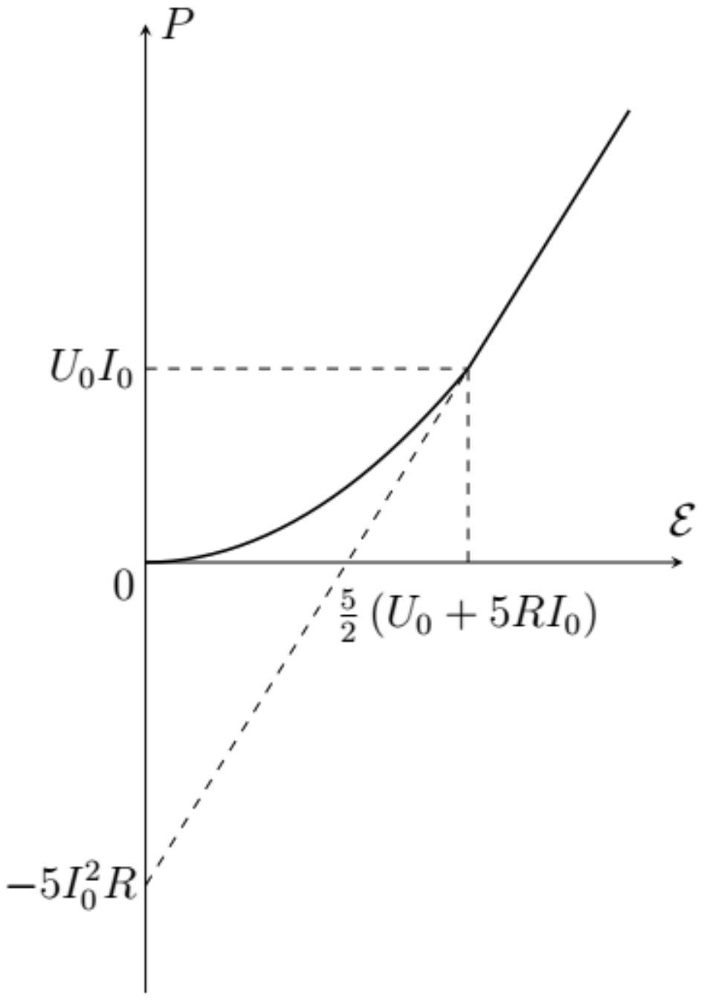

А1 ${ } ^ { 1.50 }$ Поскольку без участка цепи между узлами $A$ и $B$ электрическая цепь состоит целиком из источников постоянного напряжения и резисторов -зависимость силы тока $I _ { A B }$, текущего от узла $A$ к узлу $B$, от напряжения $U _ { A B } = \varphi _ { A } - \varphi _ { B }$ на данном участке цепи можно представить в виде, не зависящем от элемента, включенного между узлами $A$ и $B$ :

$$
I _ { A B } = \frac { \mathcal { E } _ { 0 } - U _ { A B } } { r _ { 0 } } .
$$

Определите $\mathcal { E } _ { 0 }$ и $r _ { 0 }$. Ответы выразите через $\mathcal { E }$ и $R$.

Если между узлами $A$ и $B$ подключить идеальный вольтметр, напряжение на нем

$$
U _ { V } = \mathcal { E } \left( \frac { 6 R } { 6 R + 4 R } - \frac { 2 R } { 2 R + 8 R } \right) = \frac { 2 } { 5 } \mathcal { E } = \mathcal { E } _ { 0 } .
$$

Если напряжение на источнике равно нулю, его можно заменить на провод с нулевым сопротивлением. Тогда схема между выводами $A$ и $B$ будет представлять собой две пары параллельно соединенных резисторов, $( 2 R , 8 R )$ и $( 6 R , 4 R )$, соединенных последовательно, а значит сопротивление

$$
r _ { 0 } = R _ { A B } = \frac { 2 R \cdot 8 R } { 2 R + 8 R } + \frac { 6 R \cdot 4 R } { 6 R + 4 R } = 4 R .
$$

Тогда зависимость напряжения от силы тока будет иметь вид

$$
U _ { A B } = \mathcal { E } _ { 0 } - I _ { A B } r _ { 0 } ,
$$

откуда

$$
I _ { A B } = \frac { \mathcal { E } _ { 0 } - U _ { A B } } { r _ { 0 } } .
$$

Альтернативно можно вычислить ток короткого замыкания $I _ { c } = \mathcal { E } _ { 0 } / r _ { 0 }$, который будет течь через идеальный амперметр, подключенный между выводами $A$ и $B$. При таком подключении общее сопротивление цепи, к которой подключен источник $\mathcal { E }$, равно

$$
r _ { 1 } = \frac { 2 R \cdot 6 R } { 2 R + 6 R } + \frac { 8 R \cdot 4 R } { 8 R + 4 R } = \frac { 25 } { 6 } R .
$$

Тогда полный ток через источник $\mathcal { E } I _ { \mathcal { E } } = 6 \mathcal { E } / 25 R$, а токи через резисторы $2 R$ и $8 R$ будут равны соответственно:

$$
I _ { 1 } = \frac { 3 } { 4 } I _ { \mathcal { E } } = \frac { 9 \mathcal { E } } { 50 R } , \quad I _ { 2 } = \frac { 1 } { 3 } I _ { \mathcal { E } } = \frac { 2 \mathcal { E } } { 25 R } .
$$

Тогда ток короткого замыкания

$$
I _ { c } = I _ { A B } = I _ { 1 } - I _ { 2 } = \frac { \mathcal { E } } { 10 R }
$$

Отсюда получаем прежнее значение сопротивления

$$
r _ { 0 } = \mathcal { E } _ { 0 } / I _ { c } = 4 R .
$$

Ответ:

$$
r _ { 0 } = 4 R , \quad \mathcal { E } _ { 0 } = \frac { 2 } { 5 } \mathcal { E }
$$

А2 ${ } ^ { 0.50 }$ Получите зависимость силы тока $I _ { A B }$ от величины $\mathcal { E }$. Ответ выразите через $\mathcal { E } , R , U _ { 0 }$ и $I _ { 0 }$.

Предположим, что напряжение на нелинейном элементе меньше $U _ { 0 }$, тогда это напряжение можно найти из уравнения

$$
\left( r _ { 0 } + R \right) I _ { A B } = \mathcal { E } _ { 0 } - U _ { A B } , \quad \left( r _ { 0 } + R \right) I _ { 0 } \frac { U _ { A B } } { U _ { 0 } } = \mathcal { E } _ { 0 } - U _ { A B }
$$

откуда

$$
U _ { A B } = \frac { \mathcal { E } _ { 0 } U _ { 0 } } { U _ { 0 } + \left( r _ { 0 } + R \right) I _ { 0 } } , \quad \mathcal { E } _ { 0 } \leq U _ { 0 } + \left( r _ { 0 } + R \right) I _ { 0 } .
$$

Соответствующее значение тока

$$
I _ { A B } = \frac { \mathcal { E } _ { 0 } I _ { 0 } } { U _ { 0 } + 5 R I _ { 0 } } , \quad \mathcal { E } _ { 0 } \leq U _ { 0 } + 5 R I _ { 0 } .
$$

При дальнейшем увеличении напряжения источника напряжение на нелинейном элементе станет больше $U _ { 0 }$, а ток через него будет равен $I _ { 0 }$. Напряжение на нелинейном элементе $U _ { A B } = \mathcal { E } _ { 0 } - I _ { 0 } r _ { 0 }$. Подставляя выражения для $\mathcal { E } _ { 0 }$ и $r _ { 0 }$, получим ответ.

Ответ:

$$
I _ { A B } = \left\{ \begin{array} { l }
\frac { 2 \mathcal { E } I _ { 0 } } { 5 \left( U _ { 0 } + 5 R I _ { 0 } \right) } , \quad \mathcal { E } \leq \frac { 5 } { 2 } \left( U _ { 0 } + 5 R I _ { 0 } \right) \\
I _ { 0 } , \quad \mathcal { E } > \frac { 5 } { 2 } \left( U _ { 0 } + 5 R I _ { 0 } \right) .
\end{array} \right.
$$

Мощность на нелинейном элементе $P _ { \text {н.э. } } = U _ { \text {н.э. } } I _ { A B }$. Используя результаты предыдущего пункта, получим ответ.

Ответ:

$$
P _ { \text {н.э. } } = \left\{ \begin{array} { l }
U _ { 0 } I _ { 0 } \frac { 4 \mathcal { E } ^ { 2 } } { 25 \left( U _ { 0 } + 5 R I _ { 0 } \right) ^ { 2 } } , \quad \mathcal { E } \leq \frac { 5 } { 2 } \left( U _ { 0 } + 5 R I _ { 0 } \right) ; \\
I _ { 0 } \left( \frac { 2 } { 5 } \mathcal { E } - 5 I _ { 0 } R \right) , \quad \mathcal { E } > \frac { 5 } { 2 } \left( U _ { 0 } + 5 R I _ { 0 } \right) .
\end{array} \right.
$$

A4 ${ } ^ { 0.50 }$
Постройте качественный график зависимости $P _ { \text {н.э } } ( \mathcal { E } )$. Укажите на графике все характерные точки и укажите соответствующие им значения.

При малых напряжениях график - парабола с вершиной в начале координат, при $\mathcal { E } \leq \frac { 5 } { 2 } \left( U _ { 0 } + 4 R I _ { 0 } \right)$ - прямая. В точке, в которой происходит переход от квадратичной зависимости к линейной $\mathcal { E } = U _ { 0 } + 4 R I _ { 0 } , P _ { \text {н.э. } } = I _ { 0 } U _ { 0 }$.

Ответ:

В1 ${ } ^ { 0.80 }$ Получите зависимость силы тока $I _ { C } ( t )$ через конденсатор от времени $t$. Ответ выразите через $\mathcal { E } , R , U _ { 0 } , I _ { 0 } , C$ и $t$.

Если напряжение на нелинейном элементе меньше $U _ { 0 }$, он ведет себя как резистор с сопротивлением $r _ { 0 } = U _ { 0 } / I _ { 0 } = 500$ Ом $= R$. Поэтому в этом случае напряжение на нелинейном элементе должно быть равно напряжению на резисторе. Тогда начальное напряжение на нелинейном элементе равно $\mathcal { E } / 2 = 3 \mathrm {~B} < U _ { 0 }$, поэтому мы везде можем пользоваться линейной зависимостью тока от напряжения. Тогда заряд конденсатора и ток через него связаны соотношением (которое получается из уравнения Кирхгофа)

$$
I \left( R + r _ { 0 } \right) + q C = \mathcal { E }
$$

Продифференцировав его по времени и учитывая, что $\dot { q } = I$, получим

$$
\dot { I } = - \frac { I } { C \left( R + r _ { 0 } \right) } , \quad I ( t ) = I ( 0 ) e ^ { - \frac { t } { C \left( R + r _ { 0 } \right) } }
$$

В начальный момент времени конденсатор не заряжен, поэтому $I ( 0 ) = \mathcal { E } / \left( R + r _ { 0 } \right)$. Тогда ток через конденсатор

Ответ:

$$
I _ { C } = \frac { \mathcal { E } } { R + U _ { 0 } / I _ { 0 } } e ^ { - \frac { t } { C \left( R + U _ { 0 } / I _ { 0 } \right) } }
$$

В2 ${ } ^ { 0.60 }$ Какое количество теплоты $Q _ { \text {н. } }$ выделится на нелинейном элементе за время установления постоянного тока? Ответ выразите через $\mathcal { E } , R , U _ { 0 } , I _ { 0 }$ и $C$. Найдите численное значение.

При зарядке конденсатора через источник проходит заряд $q = C \mathcal { E }$, и он совершает работу $A _ { \text {ист } } = q \mathcal { E } = C \mathcal { E } ^ { 2 }$. Эта работа идет на увеличение энергии конденсатора и на выделившееся тепло:

$$
A _ { \text {ист } } = \frac { C \mathcal { E } ^ { 2 } } { 2 } + Q ,
$$

поэтому в цепи выделяется тепло $Q = C \mathcal { E } ^ { 2 } / 2$. Оно делится между резистором и нелинейным элементом пропорционально их сопротивлениям (поскольку при рассматриваемых напряжениях нелинейный элемент ведет себя как резистор)

$$
Q _ { \text {н.э. } } = \frac { r _ { 0 } } { r _ { 0 } + R } \frac { C \mathcal { E } ^ { 2 } } { 2 } = \frac { U _ { 0 } } { U _ { 0 } + R I _ { 0 } } \frac { C \mathcal { E } ^ { 2 } } { 2 } = 0.9 \text { мДж }
$$

В3 ${ } ^ { \mathbf { 0 . 6 0 } }$ Через какое время $\tau$ количество теплоты, выделившееся на нелинейном элементе, достигнет $80 \%$ от величины $Q _ { \text {н. } }$ ? Ответ выразите через $R , U _ { 0 } , I _ { 0 }$, и $C$. Найдите численное значение.

Мощность на нелинейном элементе в зависимости от времени имеет вид

$$
P = I _ { C } ^ { 2 } U _ { 0 } / I _ { 0 } = A e ^ { - 2 t / t _ { 0 } } , \quad A = \frac { \mathcal { E } ^ { 2 } U _ { 0 } I _ { 0 } } { \left( R I _ { 0 } + U _ { 0 } \right) ^ { 2 } } , \quad t _ { 0 } = C \left( R + U _ { 0 } / I _ { 0 } \right) .
$$

Тогда за время $t$ на нелинейном элементе выделяется тепло

$$
Q ( t ) = \int _ { 0 } ^ { t } P ( t ) d t = A \frac { t _ { 0 } } { 2 } \left( 1 - e ^ { - 2 t / t _ { 0 } } \right) = Q _ { \text {н.э. } } \left( 1 - e ^ { - 2 t / t _ { 0 } } \right) .
$$

В момент времени, когда $Q = 0.8 Q _ { \text {н. } \text {. } }$, $e ^ { - 2 t / t _ { 0 } } = 0.2$,

Ответ:

$$
t = \frac { \ln 5 } { 2 } t _ { 0 } = \frac { \ln 5 } { 2 } C \left( R + \frac { U _ { 0 } } { I _ { 0 } } \right) = 0.0804 \mathrm { c }
$$

В4 ${ } ^ { 1.50 }$ Получите зависимость силы тока $I _ { C } ( t )$ через конденсатор от времени $t$. Ответ выразите через $\mathcal { E } , R , U _ { 0 } , I _ { 0 } , C$ и $t$.

Теперь начальное напряжение на нелинейном элементе больше $U _ { 0 }$, а значит ток через нелинейный элемент (равный току через конденсатор), равен $I _ { C } = I _ { 0 }$. Этот ток будет оставаться постоянным, пока напряжение на конденсаторе не упадет до значения $U _ { 0 }$.
До этого момента заряд конденсатора зависит от времени как $q = I _ { 0 } t$, а значит напряжение на нелинейном элементе

$$
U _ { \text {н.э. } } = \mathcal { E } - R I _ { 0 } - I _ { 0 } t / C .
$$

Эта зависимость справедлива, пока $U _ { \text {н.э. } } \geq U _ { 0 }$, то есть

$$
t \leq t _ { 1 } = \frac { C } { I _ { 0 } } \left( \mathcal { E } - U _ { 0 } - R I _ { 0 } \right) .
$$

Далее ток будет экспоненциально затухать, как при обычной зарядке конденсатора:

$$
I = I _ { 0 } \exp \left( - \frac { t - t _ { 1 } } { C \left( R + U _ { 0 } / I _ { 0 } \right) } \right) .
$$

Ответ:

$$
I _ { C } = \left\{ \begin{array} { l }
I _ { 0 } , \quad t \leq \frac { C } { I _ { 0 } } \left( \mathcal { E } - U _ { 0 } - R I _ { 0 } \right) ; \\
I _ { 0 } \exp \left( - \frac { t - C \left( \mathcal { E } - U _ { 0 } - R I _ { 0 } \right) / I _ { 0 } } { C \left( R + U _ { 0 } / I _ { 0 } \right) } \right) , \quad t > \frac { C } { I _ { 0 } } \left( \mathcal { E } - U _ { 0 } - R I _ { 0 } \right) .
\end{array} \right.
$$

В5 ${ } ^ { 1.50 }$ Какое количество теплоты $Q _ { \text {н. } }$ выделится на нелинейном элементе за время установления постоянного тока? Найдите численное значения с точностью не меньше 1\%.

Пока ток остается постоянным, мощность на нелинейном элементе

$$
P = I _ { 0 } U _ { \text {н.э. } } = I _ { 0 } \left( \mathcal { E } - R I _ { 0 } - I _ { 0 } t / C \right) .
$$

Тогда за время $t _ { 1 }$ выделится тепло

$$
Q _ { 1 } = \int _ { 0 } ^ { t _ { 1 } } d t I _ { 0 } \left( \mathcal { E } - R I _ { 0 } - I _ { 0 } t / C \right) = I _ { 0 } \left( \mathcal { E } - R I _ { 0 } \right) t _ { 1 } - I _ { 0 } ^ { 2 } t _ { 1 } ^ { 2 } / 2 C
$$

$$
Q _ { 1 } = C \left( \mathcal { E } - R I _ { 0 } \right) \left( \mathcal { E } - U _ { 0 } - R I _ { 0 } \right) - C \left( \mathcal { E } - U _ { 0 } - R I _ { 0 } \right) ^ { 2 } / 2 = \frac { C } { 2 } \left( \left( \mathcal { E } - I _ { 0 } R \right) ^ { 2 } - U _ { 0 } ^ { 2 } \right) = 1.2 \text { мДж }
$$

Далее зависимость мощности от времени имеет вид $\left( t ^ { \prime } = t - t _ { 1 } \right)$

$$
P = \frac { U _ { 0 } } { I _ { 0 } } I _ { 0 } ^ { 2 } e ^ { - 2 t ^ { \prime } / t _ { 0 } } , \quad t _ { 0 } = C \left( R + U _ { 0 } / I _ { 0 } \right)
$$

а значит полное выделившееся тепло

$$
Q _ { 2 } = \int _ { 0 } ^ { \infty } d t ^ { \prime } U _ { 0 } I _ { 0 } e ^ { - 2 t ^ { \prime } / t _ { 0 } } = \frac { 1 } { 2 } U _ { 0 } I _ { 0 } t _ { 0 } = \frac { 1 } { 2 } U _ { 0 } I _ { 0 } C \left( R + U _ { 0 } / I _ { 0 } \right) = 2.5 \text { мДж }
$$

Ответ:

$$
Q = Q _ { 1 } + Q _ { 2 } = \frac { C } { 2 } \left( \left( \mathcal { E } - I _ { 0 } R \right) ^ { 2 } - U _ { 0 } ^ { 2 } \right) + \frac { C } { 2 } U _ { 0 } \left( U _ { 0 } + I _ { 0 } R \right) = \frac { C } { 2 } \left( \left( \mathcal { E } - I _ { 0 } R \right) ^ { 2 } + U _ { 0 } I _ { 0 } R \right) = 3.7 \text { мДж }
$$
