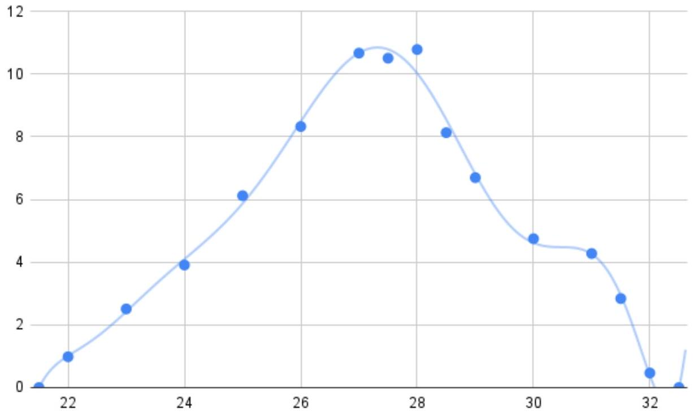
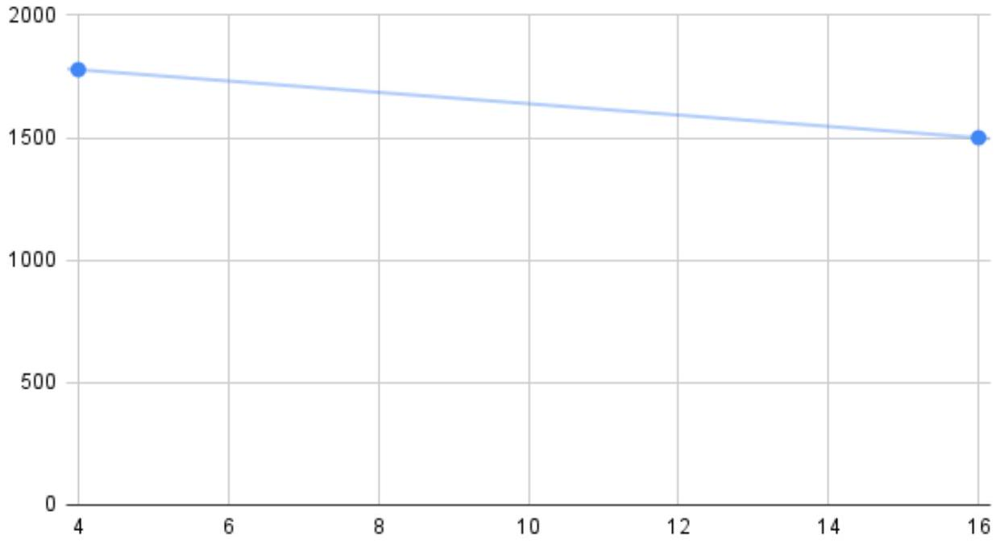

Пусть $\alpha$ - угол падения луча на пузырь, $\beta$ - угол, который радиус, проведенный в точку падения, составляет с горизонталью, $\theta$ - угол падающего луча с горизонталью. Тогда:

$$
\begin{gathered}
\sin \beta = \frac { \rho } { R } \\
\tan \theta = \frac { \rho } { L - R \cos \beta } \\
\alpha = \beta + \theta
\end{gathered}
$$

Угол, который отраженный луч составляет с горизонталью, тогда равен $\alpha + \beta = 2 \beta + \theta$. Следовательно:

$$
r = \rho + ( L - R \cos \beta ) \tan 2 \beta + \theta
$$

Теперь воспользуемся приближением $\rho < R \ll L$. Тогда $\theta \ll 1$, откуда:

$$
\begin{gathered}
\theta \approx \frac { \rho } { L } \\
\tan 2 \beta + \theta \approx \tan 2 \beta + \frac { \theta } { \cos ^ { 2 } 2 \beta } \\
r = L \tan 2 \beta + \left( \rho - R \cos \beta \tan 2 \beta + \frac { L \theta } { \cos ^ { 2 } 2 \beta } - \frac { \theta R \cos \beta } { \cos ^ { 2 } 2 \beta } \right)
\end{gathered}
$$

Все слагаемые в скобках имеют по порядку не более $R \ll L$. Таким образом:

$$
r = L \tan 2 \beta = \frac { 2 L \rho \sqrt { R ^ { 2 } - \rho ^ { 2 } } } { R ^ { 2 } - 2 \rho ^ { 2 } }
$$

Ответ:

$$
r = \frac { 2 L \rho \sqrt { R ^ { 2 } - \rho ^ { 2 } } } { R ^ { 2 } - 2 \rho ^ { 2 } }
$$

А2 ${ } ^ { 1.00 }$ Выразите малый элемент площади объекта $\mathrm { d } S$ через параметры соответствующего участка изображения. В ответ могут входить величины $\rho , R , L$, а также дифференциал расстояния $\mathrm { d } \rho$ и дифференциал полярного угла $\mathrm { d } \varphi$.

Малый элемент площади в полярных координатах:

$$
\mathrm { d } S = r \mathrm {~d} r \mathrm {~d} \varphi = \frac { \mathrm { d } \varphi } { 2 } \mathrm {~d} \left( r ^ { 2 } \right)
$$

Найдем $\mathrm { d } \left( r ^ { 2 } \right)$ :

$$
\begin{aligned}
& r ^ { 2 } = \frac { 4 L ^ { 2 } \rho ^ { 2 } \left( R ^ { 2 } - \rho ^ { 2 } \right) } { \left( R ^ { 2 } - 2 \rho ^ { 2 } \right) ^ { 2 } } \\
& \mathrm {~d} \left( r ^ { 2 } \right) = \frac { 8 L ^ { 2 } R ^ { 4 } \rho } { \left( R ^ { 2 } - 2 \rho ^ { 2 } \right) ^ { 3 } } \mathrm {~d} \rho
\end{aligned}
$$

Для удобства введем безразмерную величину $\delta = \frac { \rho } { R }$. Тогда:

$$
\mathrm { d } S = \frac { 4 L ^ { 2 } \delta \mathrm {~d} \delta } { \left( 1 - 2 \delta ^ { 2 } \right) ^ { 3 } } \mathrm {~d} \varphi
$$

Ответ:

$$
\mathrm { d } S = \frac { 4 L ^ { 2 } R ^ { 4 } \rho } { \left( R ^ { 2 } - 2 \rho ^ { 2 } \right) ^ { 3 } } \mathrm {~d} \rho \mathrm {~d} \varphi
$$

А3 ${ } ^ { 2.50 }$ В листе ответов приведена фотография пузыря в натуральный размер. Как можно точнее найдите площадь объекта на стене. Численное значение $L = 1 \mathrm {~m}$.
Примечание: Удобно представить ответ как площадь под некоторым графиком. Миллиметровая бумага для построения графика приведена в листе ответов.

Разобьем имеющуюся площадь на сегменты колец радиусом $\delta$ и толщиной $\mathrm { d } \delta$. Обозначим угол, под которым виден этот сегмент из центра $\psi ( \delta ) = \int \mathrm { d } \varphi$. Тогда для одного кольца:

$$
\mathrm { d } S = 4 L ^ { 2 } \frac { \delta \psi ( \delta ) } { \left( 1 - 2 \delta ^ { 2 } \right) ^ { 3 } } \mathrm {~d} \delta = L ^ { 2 } k ( \delta ) \psi ( \delta ) \mathrm { d } \delta
$$

Итого имеем:

$$
S = \int _ { \delta _ { \min } } ^ { \delta _ { \max } } k ( \delta ) \psi ( \delta ) \mathrm { d } \delta
$$

Данный интеграл можно вычислить как площадь под графиком $k \psi ( \delta )$.

| $\delta , \frac { 1 } { 60 }$ | $\psi , \frac { \pi } { 180 }$ рад | $k \cdot \psi$ |
| :--- | :--- | :--- |
| 22.0 | 15 | 1.0 |
| 23.0 | 33 | 2.5 |
| 24.0 | 44 | 3.9 |
| 25.0 | 58.5 | 6.1 |
| 26.0 | 67 | 8.3 |
| 27.0 | 71.5 | 10.7 |
| 27.5 | 64 | 10.5 |
| 28.0 | 59.5 | 10.8 |
| 28.5 | 40.5 | 8.1 |
| 29.0 | 30 | 6.7 |
| 30.0 | 17 | 4.8 |
| 31.0 | 12 | 4.3 |
| 31.5 | 7 | 2.8 |
| 32.0 | 1 | 0.5 |

Численное интегрирование приводит к $S = 59 \cdot \frac { 1 } { 60 } \mathrm { M } ^ { 2 }$ (здесь учтено, что $L = 1$ м)

Ответ:

$$
S = 0.98 \mathrm {~m} ^ { 2 }
$$

В1 ${ } ^ { 1.00 }$ Получите теоретическую формулу для площади $S ( x )$ изображения квадрата. Считайте, что $x - x _ { 0 } > F + a / 2$.

Из формулы тонкой линзы очевидно, что ближняя к линзе сторона квадрата изображается в дальнее от линзы основание трапеции.
Пусть $L _ { 1 }$ - расстояние от ближнего основания трапеции до линзы, а $L _ { 2 }$ - от дальнего до линзы. Пусть также $2 b$ и $2 c$ - меньшее и большее основание трапеции соответственно. Тогда:

$$
S ( x ) = ( b + c ) \left( L _ { 2 } - L _ { 1 } \right)
$$

Из геометрических построений луча, идущего через фокус:

$$
\begin{aligned}
b & = \left( L _ { 1 } - F \right) \tan \alpha = \left( L _ { 1 } - F \right) \frac { a } { 2 F } \\
c & = \left( L _ { 2 } - F \right) \tan \alpha = \left( L _ { 2 } - F \right) \frac { a } { 2 F } \\
S ( x ) & = \frac { a } { 2 F } \left( L _ { 1 } + L _ { 2 } - 2 F \right) \left( L _ { 2 } - L _ { 1 } \right)
\end{aligned}
$$

Определим $L _ { 1 } , L _ { 2 }$ из формулы тонкой линзы:

$$
\begin{gathered}
\frac { 1 } { L _ { 1 } } + \frac { 1 } { x - x _ { 0 } + \frac { a } { 2 } } = \frac { 1 } { F } \Rightarrow L _ { 1 } = \frac { F \left( x - x _ { 0 } + \frac { a } { 2 } \right) } { x - x _ { 0 } + \frac { a } { 2 } - F } \\
\frac { 1 } { L _ { 2 } } + \frac { 1 } { x - x _ { 0 } - \frac { a } { 2 } } = \frac { 1 } { F } \Rightarrow L _ { 2 } = \frac { F \left( x - x _ { 0 } - \frac { a } { 2 } \right) } { x - x _ { 0 } - \frac { a } { 2 } - F } \\
L _ { 2 } - L _ { 1 } = \frac { a F ^ { 2 } } { \left( x - x _ { 0 } - F \right) ^ { 2 } - \frac { a ^ { 2 } } { 4 } } \\
L _ { 1 } + L _ { 2 } - 2 F = \frac { 2 F ^ { 2 } \left( x - x _ { 0 } - F \right) } { \left( x - x _ { 0 } - F \right) ^ { 2 } - \frac { a ^ { 2 } } { 4 } }
\end{gathered}
$$

Подставляя в выражение для $S ( x )$, получим:

Ответ:

$$
S ( x ) = \frac { a ^ { 2 } F ^ { 3 } \left( x - x _ { 0 } - F \right) } { \left( \left( x - x _ { 0 } - F \right) ^ { 2 } - \frac { a ^ { 2 } } { 4 } \right) ^ { 2 } }
$$

В2 ${ } ^ { 1.00 }$ Чтобы зависимость не имела расходимости при $x = 16$ см, её удобно домножить на некоторую функцию $f ( x )$, которая в этой точке обращается в 0. Предложите такую функцию. Пересчитайте точки для $f ( x ) S ( x )$.

Учитывая вид исходной функции, расходимость исчезнет при домножении на ( $x - 16 \mathrm {~cm}$ ) ${ } ^ { 2 }$. По совместительству можем заключить, что $x _ { 0 } + F + a / 2 = 16$ см. Пересчитанные значения внесём в таблицу.

Ответ:

| $x , \mathrm { CM }$ | $S , \mathrm {~cm} ^ { 2 }$ | $S \cdot ( x - 16 \text { см } ) ^ { 2 }$, см $^ { 4 }$ | $S \cdot ( x - 16 \text { см } ) ^ { 2 }$, см $^ { 4 } / S _ { 0 }$ | $S ( x ) f ( x ) / C$ | $a , \mathrm { CM }$ | $F$, CM | $x _ { 0 }$, CM |
| :--- | :--- | :--- | :--- | :--- | :--- | :--- | :--- |
| 16 | - | - | - | 1.00 | - | - | - |
| 18 | 440 | 1780 | 1.00 | 0.95 | 6.9 | 8.1 | 4.39 |
| 20 | 94 | 1500 | 0.84 | 0.80 | 5.0 | 9.1 | 4.42 |
| 22 | 36 | 1280 | 0.72 | 0.68 | 4.7 | 9.29 | 4.38 |
| 24 | 17.4 | 1110 | 0.63 | 0.59 | 4.6 | 9.36 | 4.36 |
| 26 | 9.8 | 980 | 0.55 | 0.52 | 4.5 | 9.41 | 4.35 |
| 28 | 6.1 | 880 | 0.49 | 0.47 | 4.5 | 9.44 | 4.34 |
| 30 | 4.0 | 790 | 0.44 | 0.42 | 4.4 | 9.47 | 4.33 |
| 32 | 2.8 | 720 | 0.41 | 0.39 | 4.4 | 9.47 | 4.33 |
| 34 | 2.0 | 660 | 0.37 | 0.35 | 4.4 | 9.49 | 4.32 |

Вз ${ } ^ { 1.00 }$ Получите экстраполированное значение $C = f ( x ) S ( x )$ в точке $x = 16$ см.
Примечание: Учтите, что зависимость может не быть линейной в окрестности этой точки

Обозначим $x _ { 0 } + F + \frac { a } { 2 } = 16 \mathrm {~cm} = x _ { 1 } , \left( x - x _ { 1 } \right) = \delta$. Тогда:

$$
S ( x ) f ( x ) = \frac { a ^ { 2 } F ^ { 3 } \left( \delta + \frac { a } { 2 } \right) } { ( \delta + a ) ^ { 2 } } = \frac { a F ^ { 3 } \left( 1 + \frac { 2 \delta } { a } \right) } { 2 \left( 1 + \frac { \delta } { a } \right) ^ { 2 } }
$$

Воспользуемся приближением $\delta \ll a$ :

$$
S ( x ) f ( x ) \approx \frac { a F ^ { 3 } } { 2 } \left( 1 + \frac { 2 \delta } { a } \right) \left( 1 - 2 \frac { \delta } { a } - \frac { \delta ^ { 2 } } { a ^ { 2 } } + 4 \frac { \delta ^ { 2 } } { a ^ { 2 } } \right) \approx \frac { a F ^ { 3 } } { 2 } \left( 1 - \frac { \delta ^ { 2 } } { a ^ { 2 } } \right)
$$

Как видно, в окрестности $x _ { 1 } S ( x ) f ( x )$ зависит от $x - x _ { 1 }$ квадратично, поэтому требуется построить график $S ( x ) f ( x )$ от $\left( x - x _ { 1 } \right) ^ { 2 }$. При этом $C = \frac { a F ^ { 3 } } { 2 }$. Экстраполируя по первым двум точкам, получаем $C = 1870$ см $^ { 4 }$. По первым трем точкам - 1800 см $^ { 4 }$.

Отметим, что в силу $a \approx 4.5$ см и необходимости условия $\delta \ll a$, точки дальше второй не подходят для экстраполяции: уже третья точка приводит к $\frac { \delta } { a } \sim 1$.

В4 ${ } ^ { 0.50 }$ Пересчитайте точки для $f ( x ) S ( x ) / C$.

В5 ${ } ^ { 2.50 }$ Для каждой точки найдите $a , F$ и $x _ { 0 }$. Также приведите в листе ответов усреднённые результаты $\bar { a } , \bar { F }$ и $\bar { x } _ { 0 }$.

В пункте B3 найдено:

$$
\frac { S ( x ) f ( x ) } { C } = \frac { 1 + 2 \frac { \delta } { a } } { \left( 1 + \frac { \delta } { a } \right) ^ { 2 } } = A
$$

Решая квадратное уравнения относительно $\frac { \delta } { a }$ :

$$
\begin{aligned}
& \frac { \delta } { a } = \frac { 1 - A + \sqrt { 1 - A } } { A } \\
& a = \frac { \left( x - x _ { 1 } \right) A } { 1 - A + \sqrt { 1 - A } }
\end{aligned}
$$

Здесь выбран положительный корень, т.к. используются только точки $x > x _ { 1 } = 16$ см.
Далее:

$$
\begin{gathered}
C = \frac { a F ^ { 3 } } { 2 } \Rightarrow F = \left( \frac { 2 C } { a } \right) ^ { 1 / 3 } \\
x _ { 1 } = x _ { 0 } + F + \frac { a } { 2 } \Rightarrow x _ { 0 } = x _ { 1 } - F - \frac { a } { 2 }
\end{gathered}
$$

Окончательно имеем, приняв точку $x = 18$ см за выброс:

Ответ:

$$
\begin{aligned}
& \bar { a } = ( 4.54 \pm 0.19 ) \mathrm { cM } \\
& \bar { F } = ( 9.38 \pm 0.13 ) \mathrm { cM } \\
& \bar { x } _ { 0 } = ( 4.35 \pm 0.03 ) \mathrm { cm }
\end{aligned}
$$
