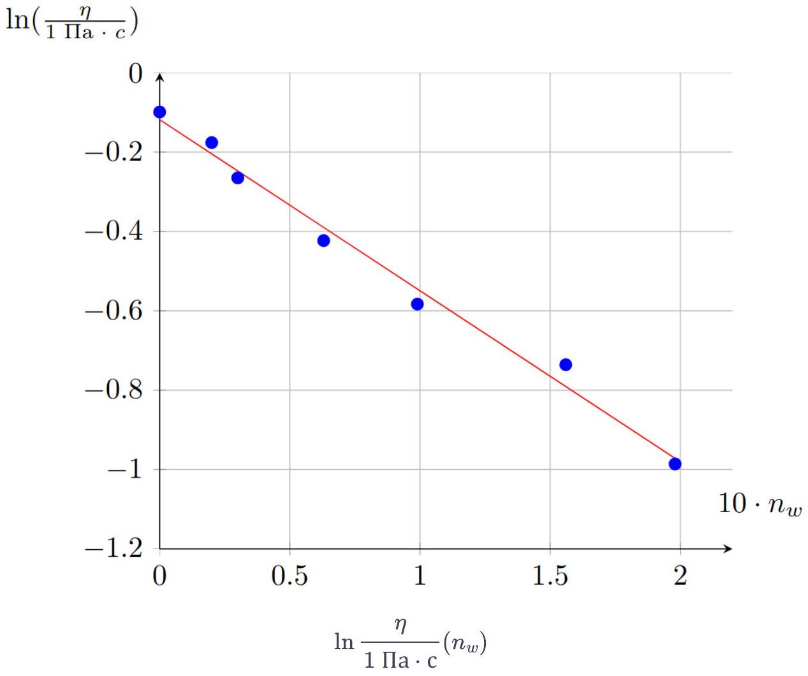
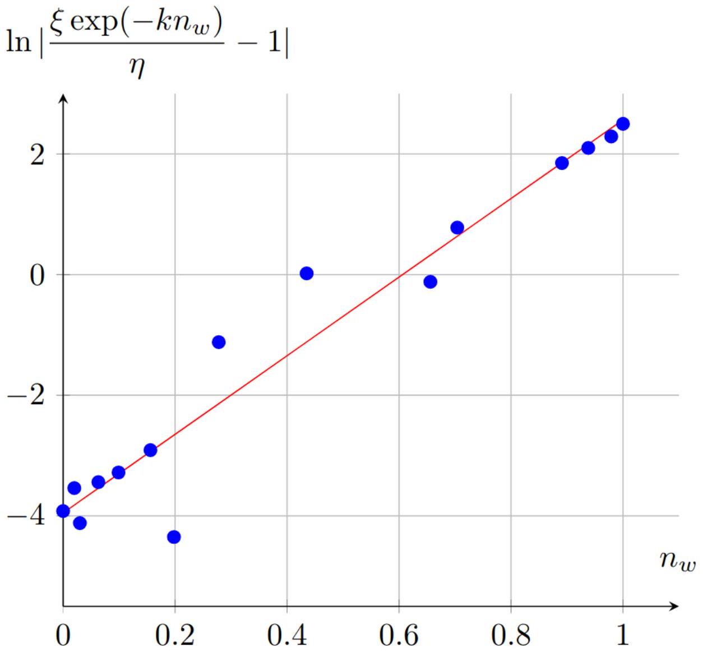
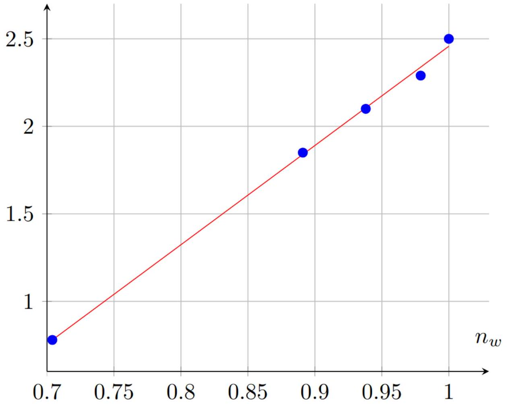
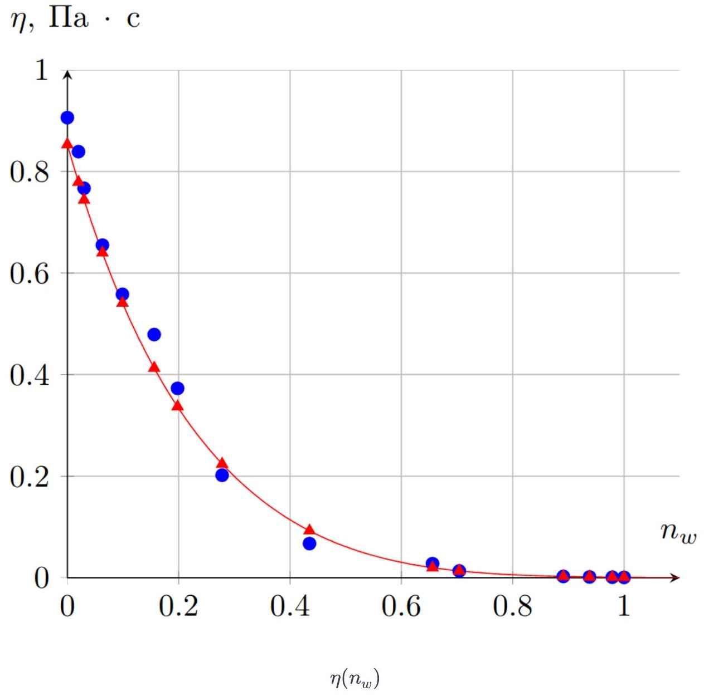
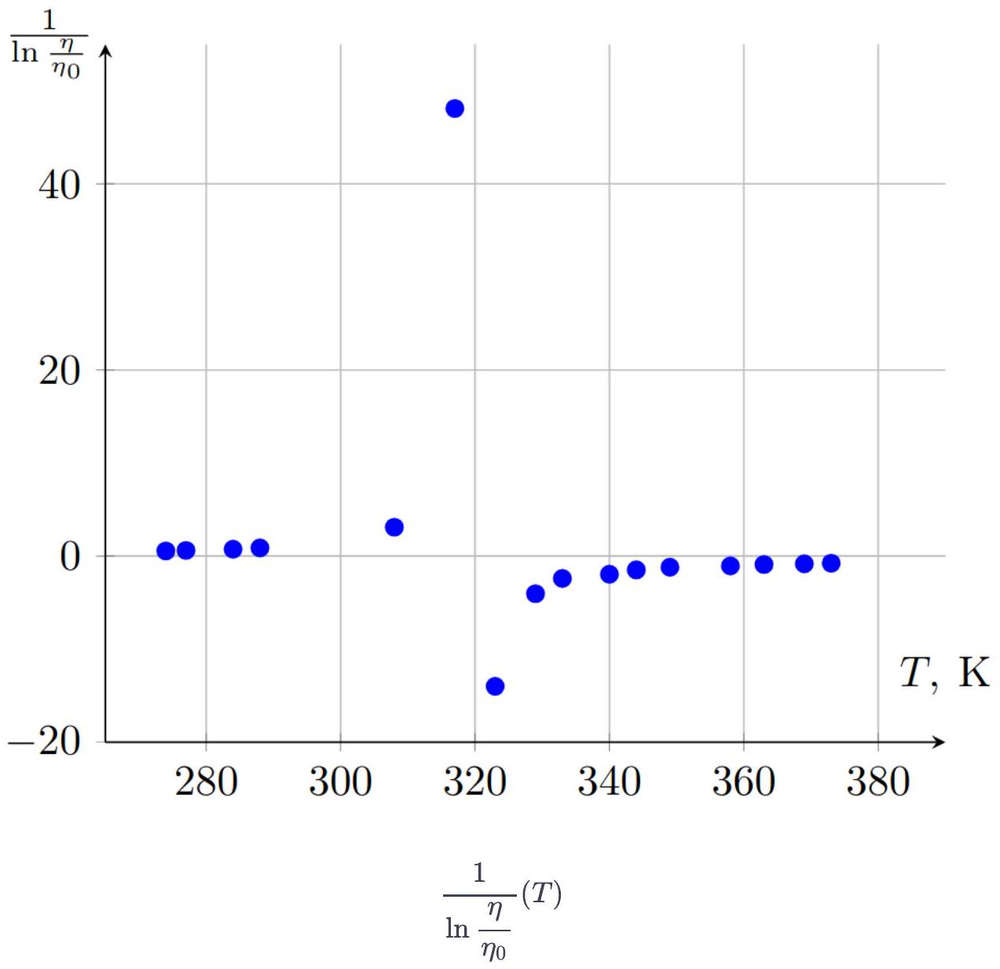
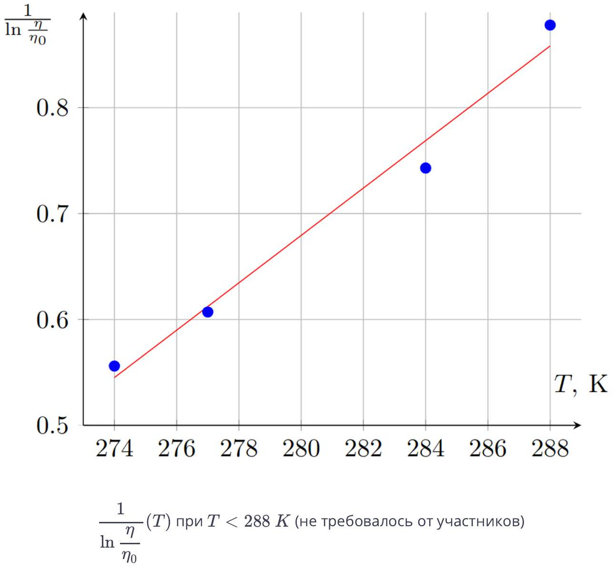

Количество вещества в смеси определяется как:

$$
\nu = \frac { m } { \mu } ,
$$

где $m$ - масса вещества, а $\mu$ - его молярная масса.

Запишем формулу для молярной концентрации воды:

$$
n _ { w } = 1 - n _ { g } = 1 - \frac { \nu _ { g } } { \nu _ { g } + \nu _ { w } } ,
$$

отсюда:

Ответ:

$$
n _ { w } = 1 - \frac { w _ { g } \mu _ { w } } { \mu _ { g } - w _ { g } \left( \mu _ { g } - \mu _ { w } \right) }
$$

Используя уравнение (2), пересчитайте значения $T _ { g }$ в значения $w _ { g }$.

Методом table или методом простых итераций с $a = 0.9$, получим:

Ответ:

| $T _ { g }$, К | $w _ { g }$ | $\eta , П _ { \mathrm { a } } \cdot \mathrm { c }$ |
| :--- | :--- | :--- |
| 195.2 | 1.000 | 0.906 |
| 194.8 | 0.996 | 0.839 |
| 194.6 | 0.994 | 0.767 |
| 193.9 | 0.987 | 0.655 |
| 193.1 | 0.979 | 0.558 |
| 191.8 | 0.965 | 0.479 |
| 190.8 | 0.954 | 0.373 |
| 188.6 | 0.930 | 0.202 |
| 183.4 | 0.869 | 0.0674 |
| 173.0 | 0.728 | 0.0278 |
| 170.0 | 0.682 | 0.0134 |
| 154.6 | 0.384 | 0.0026 |
| 149.3 | 0.252 | 0.0017 |
| 143.8 | 0.100 | 0.0012 |
| 140.3 | 0 | 0.0009 |

Произведём пересчёт точек в зависимость $\ln \frac { \eta } { 1 \text { Па } \cdot \mathrm { c } } \left( n _ { w } \right)$.

| $T _ { g }$, К | $w _ { g }$ | $\eta , П _ { \mathrm { a } } \cdot \mathrm { c }$ | $n _ { w }$ | $\ln \eta$ |
| :--- | :--- | :--- | :--- | :--- |
| 195.2 | 1.000 | 0.906 | 0 | -0.099 |
| 194.8 | 0.996 | 0.839 | 0.020 | -0.176 |
| 194.6 | 0.994 | 0.767 | 0.030 | -0.265 |
| 193.9 | 0.987 | 0.655 | 0.063 | -0.423 |
| 193.1 | 0.979 | 0.558 | 0.099 | -0.583 |
| 191.8 | 0.965 | 0.479 | 0.156 | -0.736 |
| 190.8 | 0.954 | 0.373 | 0.198 | -0.986 |
| 188.6 | 0.930 | 0.202 | 0.278 | -1.600 |
| 183.4 | 0.869 | 0.0674 |  |  |
| 173.0 | 0.728 | 0.0278 |  |  |
| 170.0 | 0.682 | 0.0134 |  |  |
| 154.6 | 0.384 | 0.0026 |  |  |
| 149.3 | 0.252 | 0.0017 |  |  |
| 143.8 | 0.100 | 0.0012 |  |  |
| 140.3 | 0 | 0.0009 |  |  |

Аппроксимируя зависимость прямой, получим:

$$
\begin{gathered}
k = 4.31 , \\
\ln \frac { \xi } { 1 \Pi \mathrm { a } \cdot \mathrm { c } } = - 0.12 ,
\end{gathered}
$$

откуда следует:

Ответ:

$$
\begin{gathered}
k = 4.31 \\
\xi = 0.887 \text { Па } \cdot \text { с }
\end{gathered}
$$

Ответ: Зависимость $\ln \left| \frac { \xi \exp \left( - k n _ { w } \right) } { \eta } - 1 \right| \left( n _ { w } \right)$ линейна.

А6 ${ } ^ { 1.20 }$ Постройте график линеаризованной зависимости. Из графика определите $a$ и $b$.
Примечание: в силу неточности экспериментальных данных некоторые значения пересчитать не получится. Таких значений не более 5.

Продолжим пересчёт точек:

| $T _ { g }$, К | $w _ { g }$ | $\eta$, Па • с | $n _ { w }$ | $\ln \left\| \frac { \xi \exp \left( - k n _ { w } \right) } { \eta } - 1 \right\|$ |
| :--- | :--- | :--- | :--- | :--- |
| 195.2 | 1.000 | 0.906 | 0 | -3.92 |
| 194.8 | 0.996 | 0.839 | 0.020 | -3.54 |
| 194.6 | 0.994 | 0.767 | 0.030 | -4.12 |
| 193.9 | 0.987 | 0.655 | 0.063 | -3.44 |
| 193.1 | 0.979 | 0.558 | 0.099 | -3.28 |
| 191.8 | 0.965 | 0.479 | 0.156 | -2.91 |
| 190.8 | 0.954 | 0.373 | 0.198 | -4.35 |
| 188.6 | 0.930 | 0.202 | 0.278 | -1.12 |
| 183.4 | 0.869 | 0.0674 | 0.435 | 0.02 |
| 173.0 | 0.728 | 0.0278 | 0.656 | -0.12 |
| 170.0 | 0.682 | 0.0134 | 0.704 | 0.78 |
| 154.6 | 0.384 | 0.0026 | 0.891 | 1.85 |
| 149.3 | 0.252 | 0.0017 | 0.938 | 2.10 |
| 143.8 | 0.100 | 0.0012 | 0.979 | 2.29 |
| 140.3 | 0 | 0.0009 | 1 | 2.50 |

Нанесём полученные точки на график:

$$
\ln \left| \frac { \xi \exp \left( - k n _ { w } \right) } { \eta } - 1 \right| \left( n _ { w } \right)
$$

В диапазоне $n _ { w } \in [ 0,0.2 ]$ выражение под логарифмом имеет разный знак и является околонулевым, поэтому функция в этой области ведёт себя немонотонно. Для проведения прямой учитываем только точки в диапазоне $n _ { w } \in [ 0.7,1 ]$.

$$
\ln \left| \frac { \xi \exp \left( - k n _ { w } \right) } { \eta } - 1 \right|
$$

$$
\ln \left| \frac { \xi \exp \left( - k n _ { w } \right) } { \eta } - 1 \right| \left( n _ { w } \right) \text { в диапазоне } n _ { w } \in [ 0.7,1 ] \text { (не требовалось от участников) }
$$

При $n _ { w } > 0.7$ выполняется $\frac { \xi \exp \left( - k n _ { w } \right) } { \eta } > 1$, поэтому $a > 0$.
Проведя аппроксимирующую прямую, находим:

$$
\begin{aligned}
b & = 5.66 \\
\ln a & = - 3.21
\end{aligned}
$$

отсюда:

Ответ:

$$
\begin{aligned}
a & = 0.040 \\
b & = 5.66
\end{aligned}
$$

A7 ${ } ^ { 1.00 }$ Постройте на одной миллиметровке график теоретической и экспериментальной зависимостей $\eta \left( n _ { w } \right)$.

Рассчитаем теоретические значения $\eta \left( n _ { w } \right)$ :

| $T _ { g }$, К | $w _ { g }$ | $\eta$, Па • с | $n _ { w }$ | $\ln \eta$ | $\ln \left\| \frac { \xi \exp \left( - k n _ { w } \right) } { \eta } - 1 \right\|$ | $\eta _ { \text {теор } } , П \mathrm { a } \cdot \mathrm { c }$ |
| :--- | :--- | :--- | :--- | :--- | :--- | :--- |
| 195.2 | 1.000 | 0.906 | 0 | -0.099 | -3.92 | 0.853 |
| 194.8 | 0.996 | 0.839 | 0.020 | -0.176 | -3.54 | 0.779 |
| 194.6 | 0.994 | 0.767 | 0.030 | -0.265 | -4.12 | 0.744 |
| 193.9 | 0.987 | 0.655 | 0.063 | -0.423 | -3.44 | 0.640 |
| 193.1 | 0.979 | 0.558 | 0.099 | -0.583 | -3.28 | 0.541 |
| 191.8 | 0.965 | 0.479 | 0.156 | -0.736 | -2.91 | 0.413 |
| 190.8 | 0.954 | 0.373 | 0.198 | -0.986 | -4.35 | 0.337 |
| 188.6 | 0.930 | 0.202 | 0.278 | -1.600 | -1.12 | 0.224 |
| 183.4 | 0.869 | 0.0674 | 0.435 |  | 0.02 | 0.0926 |
| 173.0 | 0.728 | 0.0278 | 0.656 |  | -0.12 | 0.0199 |
| 170.0 | 0.682 | 0.0134 | 0.704 |  | 0.78 | 0.0135 |
| 154.6 | 0.384 | 0.0026 | 0.891 |  | 1.85 | 0.0026 |
| 149.3 | 0.252 | 0.0017 | 0.938 |  | 2.10 | 0.0017 |

| 143.8 | 0.100 | 0.0012 | 0.979 | 2.29 | 0.0012 |
| :--- | :--- | :--- | :--- | :--- | :--- |
| 140.3 | 0 | 0.0009 | 1 | 2.50 | 0.0010 |

Построим график полученных зависимостей:

Проведя сглаживающие кривые, делаем вывод: уравнение применимо на всём диапазоне $\left( n _ { w } \in [ 0,1 ] \right)$.

В1 ${ } ^ { 0.50 }$ Используя уравнение (2), определите температуру стеклования раствора $T _ { g }$.

Выразим $w _ { g }$ :

$$
w _ { g } = \frac { m _ { g } } { m _ { g } + m _ { w } } = \frac { \rho _ { g } c _ { g } } { \left( \rho _ { g } - \rho _ { w } \right) c _ { g } + \rho _ { w } } ,
$$

тогда:

$$
\text { Ответ: } T _ { g } = \left( 140.3 + 35.272 \frac { \rho _ { g } c _ { g } } { \left( \rho _ { g } - \rho _ { w } \right) c _ { g } + \rho _ { w } } - 3.879 \left( \frac { \rho _ { g } c _ { g } } { \left( \rho _ { g } - \rho _ { w } \right) c _ { g } + \rho _ { w } } \right) ^ { 2 } + 23.467 \left( \frac { \rho _ { g } c _ { g } } { \left( \rho _ { g } - \rho _ { w } \right) c _ { g } + \rho _ { w } } \right) ^ { 3 } \right) К \approx 162.8 \text { К }
$$

В2 ${ } ^ { 2.00 }$ Предложите линеаризацию, позволяющую определить значения параметров $D$ и $T _ { 0 }$. Построив график линеаризованной зависимости, определите значения этих параметров.

Зависимость $\frac { 1 } { \ln \frac { \eta } { \eta _ { 0 } } } ( T )$ линейна с угловым коэффициентом $k = \frac { 1 } { D T _ { 0 } }$ и свободным членом $b = - \frac { 1 } { D }$. Пересчитаем точке по данной формуле и построим график линеаризованной зависимости:

| $T , { } ^ { \circ } C$ | $\eta , П _ { \mathrm { a } } \cdot \mathrm { c }$ | $T$, К | $\frac { 1 } { \ln \frac { \eta } { \eta _ { 0 } } }$ |
| :--- | :--- | :--- | :--- |
| 1 | 0.0201 | 274 | 0.556 |
| 4 | 0.0173 | 277 | 0.607 |
| 11 | 0.0128 | 284 | 0.743 |
| 15 | 0.0104 | 288 | 0.878 |
| 35 | 0.0046 | 308 | 3.10 |
| 44 | 0.0034 | 317 | 48.1 |
| 50 | 0.0031 | 323 | -14.0 |

| 56 | 0.0026 | 329 | -4.04 |
| :--- | :--- | :--- | :--- |
| 60 | 0.0022 | 333 | -2.41 |
| 67 | 0.0020 | 340 | -1.96 |
| 71 | 0.0017 | 344 | -1.487 |
| 76 | 0.00145 | 349 | -1.20 |
| 85 | 0.0013 | 358 | -1.06 |
| 90 | 0.0011 | 363 | -0.903 |
| 96 | 0.0010 | 369 | -0.831 |
| 100 | 0.0009 | 373 | -0.764 |

Построим график полученной зависимости:

Из предложенного уравнения следует, что оно может выполняться только при достаточно низких температурах. Из графика видно, что уравнение применимо для первых 4 точек графика (при $T < 288 К$ ). Продемонстрируем это наглядно:

Определив параметры аппроксимирующей прямой, получим систему уравнений:

$$
\left\{ \begin{aligned}
- \frac { 1 } { D } & = - 5.60 \\
\frac { 1 } { D T _ { 0 } } & = 0.022 \mathrm {~K} ^ { - 1 }
\end{aligned} \right.
$$

откуда следует:

Ответ:

$$
\begin{gathered}
T _ { 0 } = 255 \text { К } \\
D = 0.18
\end{gathered}
$$

С1 ${ } ^ { 0.40 }$ Определите вязкость смеси $\eta _ { n }$ при объемной концентрации глицерина $c _ { g } = 0.5$ и температуре $T = 25 ^ { \circ } \mathrm { C }$, используя зависимость от молярной концентрации воды.

Уравнение, полученное для $\eta _ { n } \left( n _ { w } \right)$ применимо на всем диапазоне. Поэтому достаточно пересчитать $c _ { g }$ в $n _ { w }$ :

$$
n _ { w } = 1 - \frac { w _ { g } \mu _ { w } } { \mu _ { g } - w _ { g } \left( \mu _ { g } - \mu _ { w } \right) } = 1 - \frac { \frac { \rho _ { g } c _ { g } } { \left( \rho _ { g } - \rho _ { w } \right) c _ { g } + \rho _ { w } } \mu _ { w } } { \mu _ { g } - \frac { \rho _ { g } c _ { g } } { \left( \rho _ { g } - \rho _ { w } \right) c _ { g } + \rho _ { w } } \left( \mu _ { g } - \mu _ { w } \right) } \approx 0.80
$$

и подставить в полученное уравнение. Таким образом получаем:

Ответ: $\eta _ { n } = 6.0 \mathrm { м } П а \cdot с$

C2 ${ } ^ { 0.40 }$ Определите вязкость смеси $\eta _ { t }$ при тех же условиях, используя зависимость от температуры.

Уравнение, полученное для $\eta _ { t } ( T )$ непременимо при $T = 25 ^ { \circ } C$. Определить вязкость при данной температуре можно, например, графическим методом, построив кривую $\eta _ { t } ( T )$, однако ответ с хорошей точностью даёт линейное приближение:

$$
\eta _ { 25 } \approx \frac { \eta _ { 15 } + \eta _ { 35 } } { 2 } = 7.5 \text { мПа • с. }
$$

Ответ:

$$
\eta _ { t } = 7.5 \text { мПа ⋅ с }
$$

C3 ${ } ^ { 0.20 }$ Сравните полученные результаты. Если есть расхождения, предложите возможную причину их возникновения.

Ответ: Значения $\eta _ { t }$ и $\eta _ { n }$ расходятся. Одна из главных возможных причин несовпадения результатов - плохо измеренная температура (например, если в помещении температура менялась во время эксперимента), ведь зависимость вязкости смеси от температуры очень сильная.
