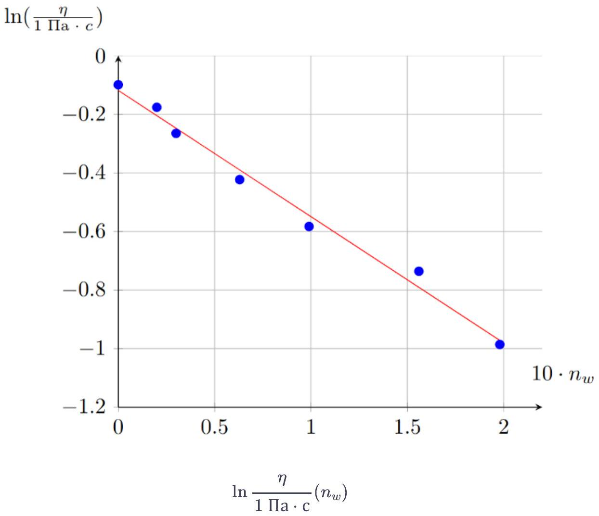
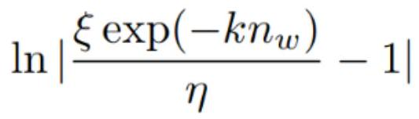
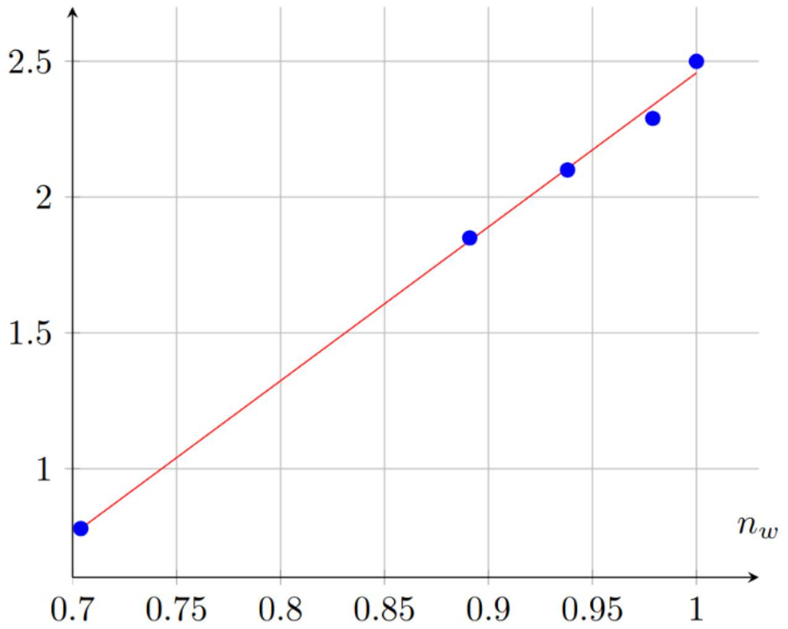
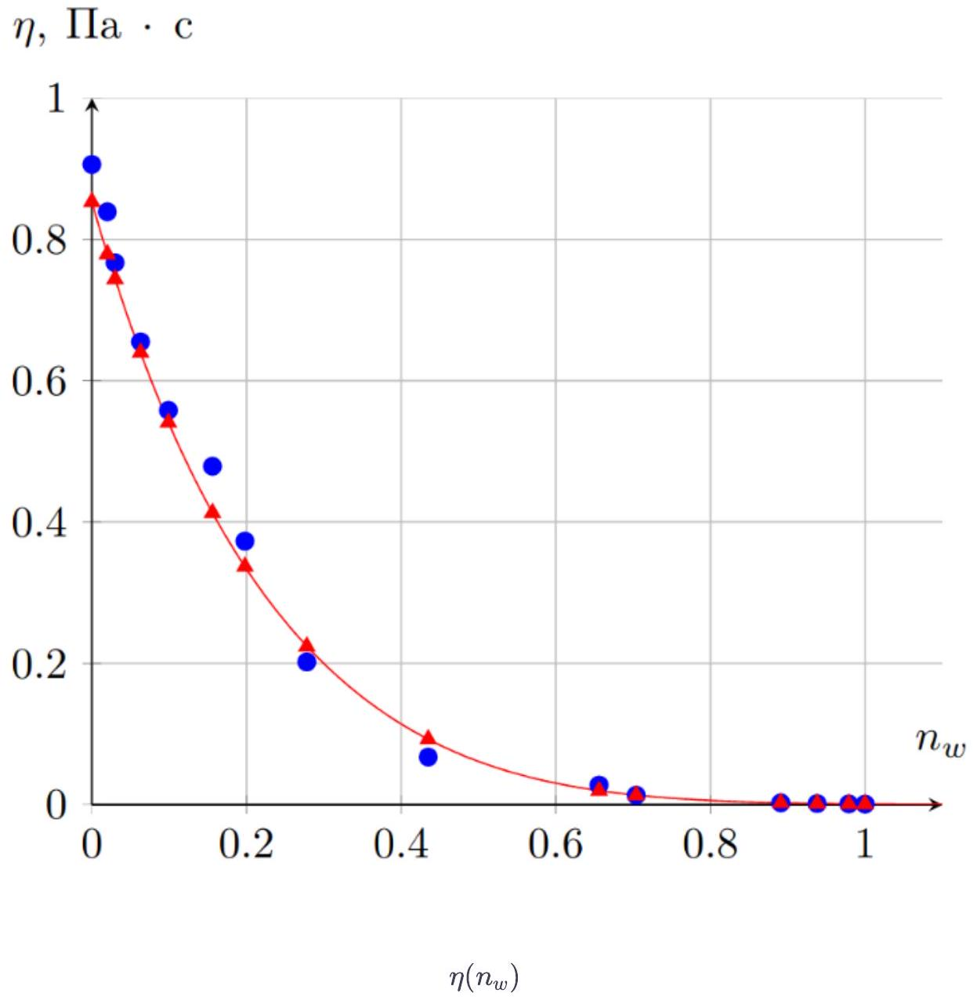
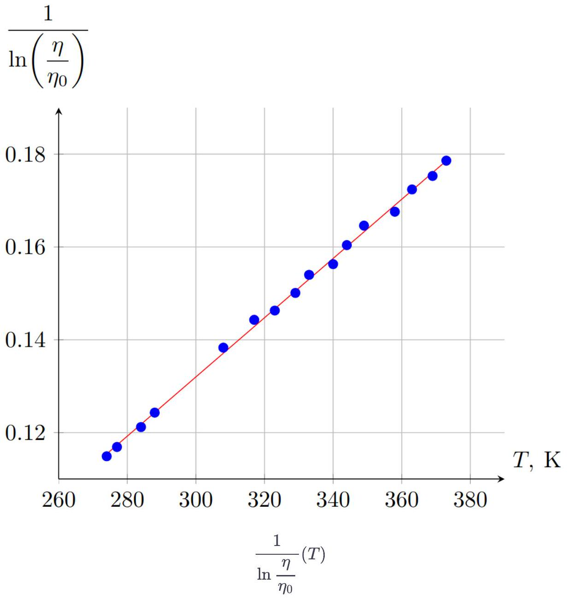
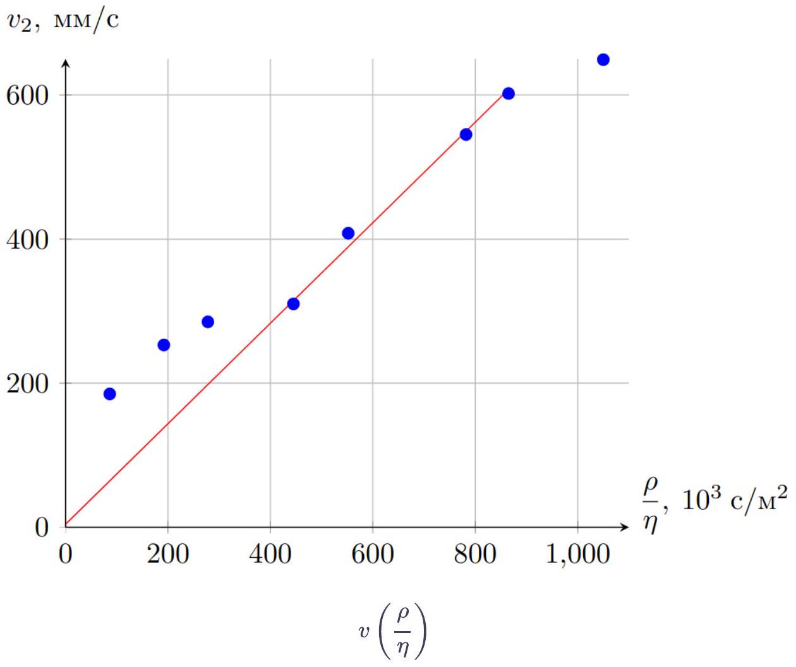
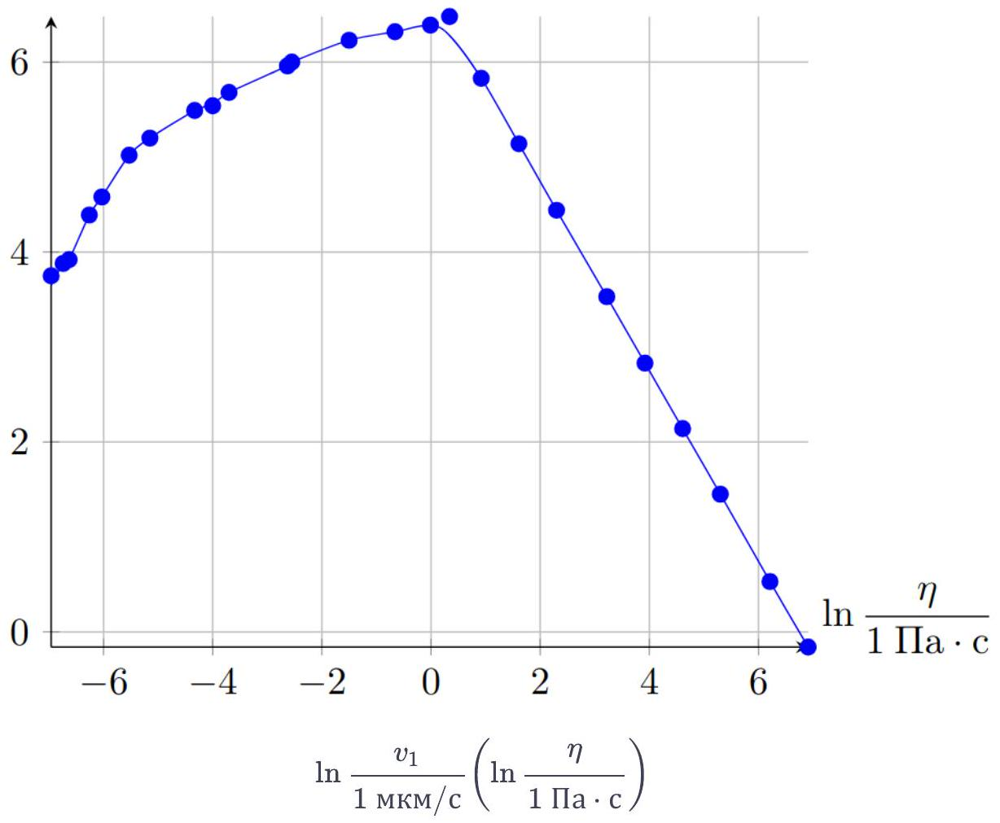

Количество вещества в смеси определяется как:

$$
\nu = \frac { m } { \mu } ,
$$

где $m$ - масса вещества, а $\mu$ - его молярная масса.
Запишем формулу для молярной концентрации воды:

$$
n _ { w } = 1 - n _ { g } = 1 - \frac { \nu _ { g } } { \nu _ { g } + \nu _ { w } } ,
$$

отсюда:

Ответ:

$$
n _ { w } = 1 - \frac { w _ { g } \mu _ { w } } { \mu _ { g } - w _ { g } \left( \mu _ { g } - \mu _ { w } \right) }
$$

А2 ${ } ^ { 1.50 }$ Используя уравнение (1), пересчитайте значения $T _ { g }$ в значения $w _ { g }$.

Методом table или методом простых итераций с $a = 0.9$, получим:

Ответ:

| $T _ { g }$, К | $w _ { g }$ | $\eta , П _ { \mathrm { a } } \cdot \mathrm { c }$ |
| :--- | :--- | :--- |
| 195.2 | 1.000 | 0.906 |
| 194.8 | 0.996 | 0.839 |
| 194.6 | 0.994 | 0.767 |
| 193.9 | 0.987 | 0.655 |
| 193.1 | 0.979 | 0.558 |
| 191.8 | 0.965 | 0.479 |
| 190.8 | 0.954 | 0.373 |
| 188.6 | 0.930 | 0.202 |
| 183.4 | 0.869 | 0.0674 |
| 173.0 | 0.728 | 0.0278 |
| 170.0 | 0.682 | 0.0134 |
| 154.6 | 0.384 | 0.0026 |
| 149.3 | 0.252 | 0.0017 |
| 143.8 | 0.100 | 0.0012 |
| 140.3 | 0 | 0.0009 |

A3 ${ } ^ { 0.60 }$
Предложите линеаризацию, описывающую систему с малой молярной долей воды, с помощью которой можно будет определить параметры $\xi$ и $k$. Постройте график линеаризованной зависимости. Определите параметры $\xi$ и $k$, используя полученный график.

Произведём пересчёт точек в зависимость $\ln \frac { \eta } { 1 \text { Па } \cdot \mathrm { c } } \left( n _ { w } \right)$.

| $T _ { g }$, К | $w _ { g }$ | $\eta$, Па • с | $n _ { w }$ | $\ln \eta$ |
| :--- | :--- | :--- | :--- | :--- |
| 195.2 | 1.000 | 0.906 | 0 | -0.099 |
| 194.8 | 0.996 | 0.839 | 0.020 | -0.176 |

| 194.6 | 0.994 | 0.767 | 0.030 | -0.265 |
| :--- | :--- | :--- | :--- | :--- |
| 193.9 | 0.987 | 0.655 | 0.063 | -0.423 |
| 193.1 | 0.979 | 0.558 | 0.099 | -0.583 |
| 191.8 | 0.965 | 0.479 | 0.156 | -0.736 |
| 190.8 | 0.954 | 0.373 | 0.198 | -0.986 |
| 188.6 | 0.930 | 0.202 | 0.278 | -1.600 |
| 183.4 | 0.869 | 0.0674 |  |  |
| 173.0 | 0.728 | 0.0278 |  |  |
| 170.0 | 0.682 | 0.0134 |  |  |
| 154.6 | 0.384 | 0.0026 |  |  |
| 149.3 | 0.252 | 0.0017 |  |  |
| 143.8 | 0.100 | 0.0012 |  |  |
| 140.3 | 0 | 0.0009 |  |  |

Построим график полученной зависимости в диапазоне $n _ { w } \in [ 0,0.2 ]$.

Аппроксимируя зависимость прямой, получим:

$$
\begin{gathered}
k = 4.31 , \\
\ln \frac { \xi } { 1 \Pi a \cdot c } = - 0.12 ,
\end{gathered}
$$

откуда следует:

Ответ:

$$
\begin{gathered}
k = 4.31 \\
\xi = 0.887 \text { Па } \cdot \text { с }
\end{gathered}
$$

Продолжим пересчёт точек:

| $T _ { g }$, К | $w _ { g }$ | $\eta$, Па $\cdot$ с | $n _ { w }$ | $\ln \left\| \frac { \xi \exp \left( - k n _ { w } \right) } { \eta } - 1 \right\|$ |
| :--- | :--- | :--- | :--- | :--- |
| 195.2 | 1.000 | 0.906 | 0 | -3.92 |

| 194.8 | 0.996 | 0.839 | 0.020 | -3.54 |
| :--- | :--- | :--- | :--- | :--- |
| 194.6 | 0.994 | 0.767 | 0.030 | -4.12 |
| 193.9 | 0.987 | 0.655 | 0.063 | -3.44 |
| 193.1 | 0.979 | 0.558 | 0.099 | -3.28 |
| 191.8 | 0.965 | 0.479 | 0.156 | -2.91 |
| 190.8 | 0.954 | 0.373 | 0.198 | -4.35 |
| 188.6 | 0.930 | 0.202 | 0.278 | -1.12 |
| 183.4 | 0.869 | 0.0674 | 0.435 | 0.02 |
| 173.0 | 0.728 | 0.0278 | 0.656 | -0.12 |
| 170.0 | 0.682 | 0.0134 | 0.704 | 0.78 |
| 154.6 | 0.384 | 0.0026 | 0.891 | 1.85 |
| 149.3 | 0.252 | 0.0017 | 0.938 | 2.10 |
| 143.8 | 0.100 | 0.0012 | 0.979 | 2.29 |
| 140.3 | 0 | 0.0009 | 1 | 2.50 |

Нанесём полученные точки на график:

$$
\ln \left| \frac { \xi \exp \left( - k n _ { w } \right) } { \eta } - 1 \right|
$$

$$
\ln \left| \frac { \xi \exp \left( - k n _ { w } \right) } { \eta } - 1 \right| \left( n _ { w } \right)
$$

В диапазоне $n _ { w } \in [ 0,0.2 ]$ выражение под логарифмом имеет разный знак и является околонулевым, поэтому функция в этой области ведёт себя немонотонно. Для проведения прямой учитываем только точки в диапазоне $n _ { w } \in [ 0.7,1 ]$.

$$
\ln \left| \frac { \xi \exp \left( - k n _ { w } \right) } { \eta } - 1 \right| \left( n _ { w } \right) \text { в диапазоне } n _ { w } \in [ 0.7,1 ] \text { (не требовалось от участников) }
$$

При $n _ { w } > 0.2$ выполняется $\frac { \xi \exp \left( - k n _ { w } \right) } { \eta } > 1$, поэтому $a > 0$.
Проведя аппроксимирующую прямую, находим:

$$
\begin{aligned}
b & = 5.66 \\
\ln a & = - 3.21 ,
\end{aligned}
$$

отсюда:

Ответ:

$$
\begin{aligned}
a & = 0.040 \\
b & = 5.66
\end{aligned}
$$

A5 ${ } ^ { 0.70 }$ Постройте на одной миллиметровке график теоретической и экспериментальной зависимости $\eta \left( n _ { w } \right)$. Укажите диапазон применимости полученного уравнения.

Рассчитаем значения теоретической зависимость $\eta \left( n _ { w } \right)$ :

| $T _ { g }$, К | $w _ { g }$ | $\eta$, Па $\cdot$ с | $n _ { w }$ | $\ln \eta$ | $\ln \left\| \frac { \xi \exp \left( - k n _ { w } \right) } { \eta } - 1 \right\|$ | $\eta _ { \text {теор } }$, |
| :--- | :--- | :--- | :--- | :--- | :--- | :--- |
| 195.2 | 1.000 | 0.906 | 0 | -0.099 | -3.92 | 0.853 |
| 194.8 | 0.996 | 0.839 | 0.020 | -0.176 | -3.54 | 0.779 |
| 194.6 | 0.994 | 0.767 | 0.030 | -0.265 | -4.12 | 0.744 |
| 193.9 | 0.987 | 0.655 | 0.063 | -0.423 | -3.44 | 0.640 |
| 193.1 | 0.979 | 0.558 | 0.099 | -0.583 | -3.28 | 0.541 |
| 191.8 | 0.965 | 0.479 | 0.156 | -0.736 | -2.91 | 0.413 |
| 190.8 | 0.954 | 0.373 | 0.198 | -0.986 | -4.35 | 0.337 |
| 188.6 | 0.930 | 0.202 | 0.278 | -1.600 | -1.12 | 0.224 |
| 183.4 | 0.869 | 0.0674 | 0.435 |  | 0.02 | 0.0926 |
| 173.0 | 0.728 | 0.0278 | 0.656 |  | -0.12 | 0.0199 |
| 170.0 | 0.682 | 0.0134 | 0.704 |  | 0.78 | 0.0135 |
| 154.6 | 0.384 | 0.0026 | 0.891 |  | 1.85 | 0.0026 |

| 149.3 | 0.252 | 0.0017 | 0.938 | 2.10 | 0.0017 |
| :--- | :--- | :--- | :--- | :--- | :--- |
| 143.8 | 0.100 | 0.0012 | 0.979 | 2.29 | 0.0012 |
| 140.3 | 0 | 0.0009 | 1 | 2.50 | 0.0010 |

Построим график полученных зависимостей:

Проведя сглаживающие кривые, делаем вывод:

Ответ: Уравнение применимо на всём диапазоне ( $n _ { w } \in [ 0,1 ]$ ).

В1 ${ } ^ { 0.40 }$ Используя уравнение (2), определите температуру стеклования раствора.

Выразим $w _ { g }$ :

$$
w _ { g } = \frac { m _ { g } } { m _ { g } + m _ { w } } = \frac { \rho _ { g } c _ { g } } { \left( \rho _ { g } - \rho _ { w } \right) c _ { g } + \rho _ { w } } ,
$$

тогда:

$$
\text { Ответ: } T _ { g } = \left( 140.3 + 35.272 \frac { \rho _ { g } c _ { g } } { \left( \rho _ { g } - \rho _ { w } \right) c _ { g } + \rho _ { w } } - 3.879 \left( \frac { \rho _ { g } c _ { g } } { \left( \rho _ { g } - \rho _ { w } \right) c _ { g } + \rho _ { w } } \right) ^ { 2 } + 23.467 \left( \frac { \rho _ { g } c _ { g } } { \left( \rho _ { g } - \rho _ { w } \right) c _ { g } + \rho _ { w } } \right) ^ { 3 } \right) K \approx 162.8 K
$$

В2 ${ } ^ { 1.50 }$ Предложите линеаризацию, позволяющую определить значения параметров $D$ и $T _ { 0 }$. Построив график линеаризованной зависимости или используя метод наименьших квадратов (МНК), определите значения параметров.

Зависимость $\frac { 1 } { \ln \frac { \eta } { \eta _ { 0 } } } ( T )$ линейна с угловым коэффициентом $k = \frac { 1 } { D T _ { 0 } }$ и свободным членом $b = - \frac { 1 } { D }$. Пересчитаем точке по данной формуле и построим график линеаризованной зависимости:

| $T , { } ^ { \circ } C$ | $\eta , \Pi \mathrm { a } \cdot \mathrm { c }$ | $T$, К | $\frac { 1 } { \ln \frac { \eta } { \eta _ { 0 } } }$ |
| :--- | :--- | :--- | :--- |
| 1 | 0.0201 | 274 | 0.1149 |
| 4 | 0.0173 | 277 | 0.1169 |
| 11 | 0.0128 | 284 | 0.1212 |
| 15 | 0.0104 | 288 | 0.1243 |

| 35 | 0.0046 | 308 | 0.1383 |
| :--- | :--- | :--- | :--- |
| 44 | 0.0034 | 317 | 0.1443 |
| 50 | 0.0031 | 323 | 0.1463 |
| 56 | 0.0026 | 329 | 0.1501 |
| 60 | 0.0022 | 333 | 0.1540 |
| 67 | 0.0020 | 340 | 0.1563 |
| 71 | 0.0017 | 344 | 0.1604 |
| 76 | 0.00145 | 349 | 0.1646 |
| 85 | 0.0013 | 358 | 0.1676 |
| 90 | 0.0011 | 363 | 0.1724 |
| 96 | 0.0010 | 369 | 0.1753 |
| 100 | 0.0009 | 373 | 0.1786 |

Определив параметры аппроксимирующей прямой, получим систему уравнений:

$$
\left\{ \begin{array} { l }
- \frac { 1 } { D } = - 0.059 \\
\frac { 1 } { D T _ { 0 } } = 6.38 \cdot 10 ^ { - 4 } \mathrm {~K} ^ { - 1 }
\end{array} \right.
$$

откуда следует:

Ответ:

$$
\begin{gathered}
T _ { 0 } = 92.5 \mathrm {~K} \\
D = 16.9
\end{gathered}
$$

Уравнение, полученное для $\eta _ { n } \left( n _ { w } \right)$ применимо на всем диапазоне. Поэтому достаточно пересчитать $c _ { g }$ в $n _ { w }$ :

$$
n _ { w } = 1 - \frac { w _ { g } \mu _ { w } } { \mu _ { g } - w _ { g } \left( \mu _ { g } - \mu _ { w } \right) } = 1 - \frac { \frac { \rho _ { g } c _ { g } } { \left( \rho _ { g } - \rho _ { w } \right) c _ { g } + \rho _ { w } } \mu _ { w } } { \mu _ { g } - \frac { \rho _ { g } c _ { g } } { \left( \rho _ { g } - \rho _ { w } \right) c _ { g } + \rho _ { w } } \left( \mu _ { g } - \mu _ { w } \right) } \approx 0.80
$$

и подставить в полученное уравнение. Таким образом получаем:

Ответ: $\eta _ { n } = 6.0 \mathrm { м } П а \cdot$ с

C2 ${ } ^ { 0.30 }$ Определите вязкость смеси $\eta _ { t }$ при тех же условиях, используя зависимость от температуры.

Аналогично предыдущему пункту, подставим значение $T = 25 ^ { \circ } C = 298$ К в уравнение, полученное в части В, откуда следует:

Ответ: $\eta _ { t } = 6.8 \mathrm { м } П а \cdot с$

C3 ${ } ^ { 0.20 }$ Сравните полученные результаты. Если есть расхождения, объясните причину их возникновения.

Ответ: Учитывая, что диапазон измерений большой, результаты можно признать совпадающими. Небольшое различие возникает, скорее всего, из-за неточности измерения температуры, ведь зависимость вязкости от температуры очень сильная.

D1 ${ } ^ { 2.00 }$ Восстановите недостающие значения $v _ { 2 }$ в таблице. Используйте для этого линеаризованный график зависимости $v _ { 2 } ( \eta )$. Используйте пустые столбцы таблицы в листе ответов для пересчета необходимых величин.

В случае гидрофильного капилляра зависимость объёмного расхода жидкости от вязкости представляется уравнением:

$$
Q = \pi r ^ { 2 } v = \frac { \pi r ^ { 4 } \Delta P } { 8 \eta L } = \frac { \pi r ^ { 4 } \rho g } { 8 \eta }
$$

, откуда следует соотношение:

$$
v = k \frac { \rho } { \eta } ,
$$

где $k$ - постоянная величина. Плотность смеси можно рассчитать как:

$$
\rho = \rho _ { g } c _ { g } + \rho _ { w } c _ { w } = \rho _ { w } + \left( \rho _ { g } - \rho _ { w } \right) c _ { g }
$$

Используя выражение:

$$
n _ { w } = 1 - \frac { \frac { \rho _ { g } c _ { g } } { \left( \rho _ { g } - \rho _ { w } \right) c _ { g } + \rho _ { w } } \mu _ { w } } { \mu _ { g } - \frac { \rho _ { g } c _ { g } } { \left( \rho _ { g } - \rho _ { w } \right) c _ { g } + \rho _ { w } } \left( \mu _ { g } - \mu _ { w } \right) } ,
$$

выразим $c _ { g }$ :

$$
\begin{gathered}
n _ { w } \left( \mu _ { g } \rho _ { w } \left( 1 - c _ { g } \right) + \rho _ { g } c _ { g } \mu _ { w } \right) = \mu _ { g } \rho _ { w } \left( 1 - c _ { g } \right) \\
c _ { g } = \frac { \mu _ { g } \rho _ { w } \left( 1 - n _ { w } \right) } { \rho _ { g } \mu _ { w } + \rho _ { w } \mu _ { g } \left( 1 - n _ { w } \right) }
\end{gathered}
$$

Тогда выражение для плотности смеси принимает вид:

$$
\rho = \rho _ { w } + \left( \rho _ { g } - \rho _ { w } \right) \frac { \mu _ { g } \rho _ { w } \left( 1 - n _ { w } \right) } { \rho _ { g } \mu _ { w } + \rho _ { w } \mu _ { g } \left( 1 - n _ { w } \right) }
$$

Используя результаты части A , численно определим значения $n _ { w }$ при $\eta < \xi$, затем рассчитаем значения плотностей смесей, затем для каждого значения скорости в гидрофильном канале рассчитаем значение величины $\frac { \rho } { \eta }$ и построим график $v \left( \frac { \rho } { \eta } \right)$ :

| $\eta , \mathrm { m } П \mathrm { a } \cdot \mathrm { c }$ | $v _ { 1 }$, мкм/с | $v _ { 2 } , \mathrm { MM } / \mathrm { c }$ | $n _ { w }$ | $\rho , \frac { \text { КГ } } { \mathrm { M } ^ { 3 } }$ | $\rho / \eta , \frac { \mathrm { C } } { \mathrm { M } ^ { 2 } } \cdot 10 ^ { 3 }$ |
| :--- | :--- | :--- | :--- | :--- | :--- |
| 0.95 | 4.25 | 649 | 1.000 | 1000 | 1050 |
| 1.18 | 4.86 | 602 | 0.978 | 1021 | 865 |
| 1.32 | 5.03 | 545 | 0.966 | 1032 | 782 |
| 1.92 | 8.03 | 408 | 0.926 | 1060 | 552 |
| 2.41 | 9.80 | 310 | 0.905 | 1072 | 445 |
| 3.95 | 15.2 | 285 | 0.847 | 1100 | 278 |
| 5.81 | 18.2 | 253 | 0.804 | 1115 | 192 |

| 13.2 | 24.3 | 185 | 0.707 | 1141 | 86.4 |
| :--- | :--- | :--- | :--- | :--- | :--- |
| 18.4 | 25.5 |  | 0.666 | 1150 | 62.5 |
| 24.8 | 29.3 |  | 0.627 | 1157 | 46.7 |
| 72.3 | 38.8 |  | 0.475 | 1177 | 16.3 |
| 78.0 | 40.3 |  | 0.463 | 1178 | 15.1 |
| 224 | 51.0 |  | 0.278 | 1194 | 5.33 |
| 515 | 55.3 |  | 0.110 | 1204 | 2.34 |
| 989 | 59.4 |  |  | 1260 | 1.27 |
| 1400 | 65.2 |  |  | 1260 | 0.900 |

Прямая должна проходить через $( 0,0 )$, поэтому проводя ее по 4 точкам, находим $k$ :

$$
k = 0.674 \cdot 10 ^ { - 6 } \frac { \mathrm { M } ^ { 3 } } { \mathrm { c } ^ { 2 } }
$$

Теперь зная $k$, можем восстановить зависимость $v _ { 2 } ( \eta )$ :

| $\eta , \mathrm { m } П а \cdot с$ | $v _ { 1 }$, мкм/с | $v _ { 2 } , \mathrm { MM } / \mathrm { c }$ | $n _ { w }$ | $\rho , \frac { \text { КГ } } { \mathrm { M } ^ { 3 } }$ | $\rho / \eta , \frac { \mathrm { C } } { \mathrm { M } ^ { 2 } } \cdot 10 ^ { 3 }$ |
| :--- | :--- | :--- | :--- | :--- | :--- |
| 0.95 | 42.5 | 649 | 1.000 | 1000 | 1050 |
| 1.18 | 48.6 | 602 | 0.978 | 1021 | 865 |
| 1.32 | 50.3 | 545 | 0.966 | 1032 | 782 |
| 1.92 | 80.3 | 408 | 0.926 | 1060 | 552 |
| 2.41 | 98.0 | 310 | 0.905 | 1072 | 445 |
| 3.95 | 152 | 285 | 0.847 | 1100 | 278 |
| 5.81 | 182 | 253 | 0.804 | 1115 | 192 |
| 13.2 | 243 | 185 | 0.707 | 1141 | 86.4 |
| 18.4 | 255 | 42.2 | 0.666 | 1150 | 62.5 |
| 24.8 | 293 | 31.5 | 0.627 | 1157 | 46.7 |
| 72.3 | 388 | 11.0 | 0.475 | 1177 | 16.3 |
| 78.0 | 403 | 10.2 | 0.463 | 1178 | 15.1 |
| 224 | 510 | 3.59 | 0.278 | 1194 | 5.33 |
| 515 | 553 | 1.58 | 0.110 | 1204 | 2.34 |

| 989 | 594 | 0.856 | 1260 | 1.27 |
| :--- | :--- | :--- | :--- | :--- |
| 1400 | 652 | 0.607 | 1260 | 0.900 |

D2 ${ } ^ { 1.50 }$ Постройте график $v _ { 1 } ( \eta )$ в диапазоне от $\eta _ { 1 } = 10 ^ { - 3 }$ Па $\cdot$ с до $\eta _ { 2 } = 10 ^ { 3 }$ Па $\cdot$ с в максимально удобных для графического анализа координатах. Все точки, нанесенные на график, должны быть занесены в таблицу в листе ответов.

При больших вязкостях скорости в гидрофобном и гидрофильном капиллярах равны, при $\eta = 1.400 П а \cdot$ с $v _ { 1 } > v _ { 2 }$, поэтому далее считаем, что $v _ { 1 } = v _ { 2 }$ при $\eta > \eta _ { \text {max } } = 1.400$ Па ⋅ с .
Занесем точки в таблицу, построим график в логарифмических координатах, так как значения исследуемых величин меняются на несколько порядков.

| $\eta , \mathrm { m } П а \cdot с$ | $v _ { 1 } , \mathrm { MKM } / \mathrm { c }$ | $v _ { 2 } , \mathrm { MM } / \mathrm { c }$ | $n _ { w }$ | $\rho , \frac { \text { КГ } } { \mathrm { M } ^ { 3 } }$ | $\rho / \eta , \frac { \mathrm { C } } { \mathrm { M } ^ { 2 } } \cdot 10 ^ { 3 }$ | $\ln \frac { v } { 1 \mathrm { MM } / \mathrm { c } }$ | $\ln \frac { \eta } { 1 \Pi \mathrm { a } \cdot \mathrm { c } }$ |
| :--- | :--- | :--- | :--- | :--- | :--- | :--- | :--- |
| 0.95 | 42.5 | 649 | 1.000 | 1000 | 1050 | 3.75 | -6.96 |
| 1.18 | 48.6 | 602 | 0.978 | 1021 | 865 | 3.88 | -6.74 |
| 1.32 | 50.3 | 545 | 0.966 | 1032 | 782 | 3.92 | -6.63 |
| 1.92 | 80.3 | 408 | 0.926 | 1060 | 552 | 4.39 | -6.26 |
| 2.41 | 98.0 | 310 | 0.905 | 1072 | 445 | 4.58 | -6.03 |
| 3.95 | 152 | 285 | 0.847 | 1100 | 278 | 5.02 | -5.53 |
| 5.81 | 182 | 253 | 0.804 | 1115 | 192 | 5.20 | -5.15 |
| 13.2 | 243 | 185 | 0.707 | 1141 | 86.4 | 5.49 | -4.33 |
| 18.4 | 255 | 42.2 | 0.666 | 1150 | 62.5 | 5.54 | -4.00 |
| 24.8 | 293 | 31.5 | 0.627 | 1157 | 46.7 | 5.68 | -3.70 |
| 72.3 | 388 | 11.0 | 0.475 | 1177 | 16.3 | 5.96 | -2.63 |
| 78.0 | 403 | 10.2 | 0.463 | 1178 | 15.1 | 6.00 | -2.55 |
| 224 | 510 | 3.59 | 0.278 | 1194 | 5.33 | 6.23 | -1.50 |
| 515 | 553 | 1.58 | 0.110 | 1204 | 2.34 | 6.32 | -0.66 |
| 989 | 594 | 0.856 |  | 1260 | 1.27 | 6.39 | -0.01 |
| 1400 | 652 | 0.607 |  | 1260 | 0.900 | 6.48 | 0.34 |
| $\eta$, Па $\cdot$ с | $v _ { 1 } , \mathrm { MKM } / \mathrm { c }$ | $v _ { 2 } , \mathrm { MM } / \mathrm { c }$ | $n _ { w }$ | $\rho , \frac { \text { КГ } } { \mathrm { M } ^ { 3 } }$ | $\rho / \eta , \frac { \mathrm { C } } { \mathrm { M } ^ { 2 } }$ | $\ln \frac { v _ { 1 } } { 1 \text { мкм/с } }$ | $\ln \frac { \eta } { 1 \Pi \mathrm { a } \cdot \mathrm { c } }$ |
| 2.5 | 340 |  |  | 1260 | 504 | 5.83 | 0.92 |
| 5.0 | 170 |  |  | 1260 | 252 | 5.14 | 1.61 |
| 10.0 | 84.9 |  |  | 1260 | 126 | 4.44 | 2.30 |
| 25.0 | 34.0 |  |  | 1260 | 50.4 | 3.53 | 3.22 |
| 50.0 | 17.0 |  |  | 1260 | 25.2 | 2.83 | 3.92 |
| 100 | 8.49 |  |  | 1260 | 12.6 | 2.14 | 4.61 |
| 200 | 4.25 |  |  | 1260 | 6.30 | 1.45 | 5.30 |
| 500 | 1.70 |  |  | 1260 | 2.52 | 0.53 | 6.21 |
| 1000 | 0.85 |  |  | 1260 | 1.26 | -0.16 | 6.91 |

Нанесем полученные точки на график:

$$
\ln \frac { v _ { 1 } } { 1 \text { мкм/с } }
$$

Ответ:

$$
\eta _ { \max } = 1.400 П а \cdot с
$$
