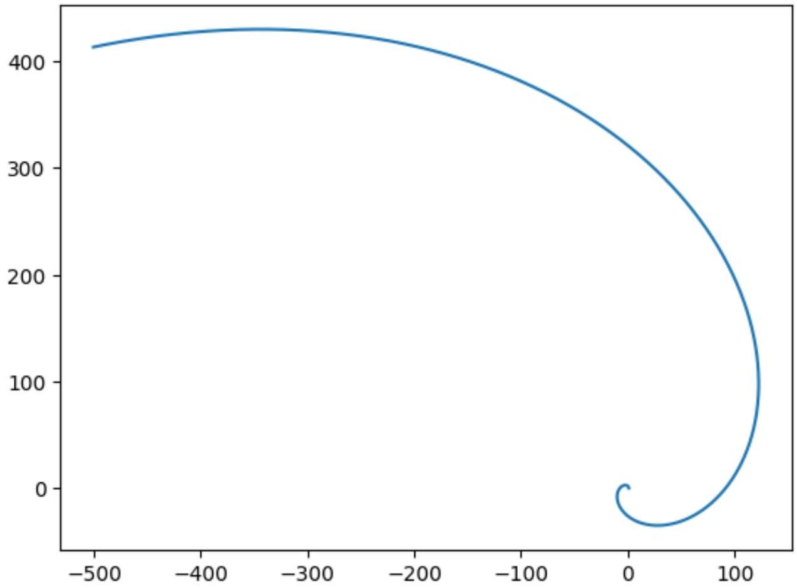
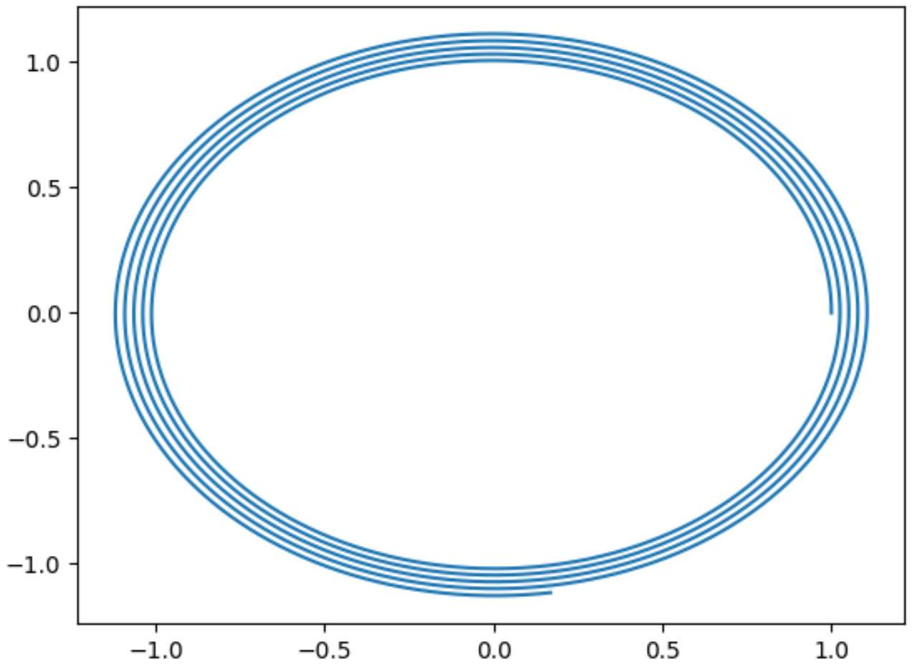

А1 ${ } ^ { 1.30 }$ Найдите траекторию движения $\vec { r } ( t )$ для этой частицы. Выразите ответ в векторном виде через $\vec { v } _ { 0 } , \vec { g } , \varepsilon$ или выразите зависимости компонент вектора $\vec { r } ( t )$ в декартовой системе координат через компоненты векторов $\vec { v } _ { 0 } , \vec { g }$.

Второй закон Ньютона:

$$
m \dot { \vec { v } } = - \varepsilon m \vec { v } + m \vec { g } .
$$

Разобьём скорость на два слагаемых:

$$
\vec { v } ( t ) = \vec { u } ( t ) + \frac { \vec { g } } { \varepsilon }
$$

Уравнение на $\vec { u }$ :

$$
\begin{gathered}
\dot { \vec { u } } = - \varepsilon \vec { u } \\
\vec { v } ( t ) = \frac { \vec { g } } { \varepsilon } + \left( \vec { v } _ { 0 } - \frac { \vec { g } } { \varepsilon } \right) e ^ { - \varepsilon t }
\end{gathered}
$$

Ответ:

$$
\vec { r } ( t ) = \frac { \vec { g } t } { \varepsilon } + \left( \vec { v } _ { 0 } - \frac { \vec { g } } { \varepsilon } \right) \frac { 1 - e ^ { - \varepsilon t } } { \varepsilon }
$$

А2 ${ } ^ { 0.70 }$ Как зависит от времени мощность потерь энергии $P ( t )$, которая уходит в тепло? Выразите ответ через $\vec { v } _ { 0 } , \vec { g } , \varepsilon , t , m$.

Запишем закон изменения энергии системы частица+среда:

$$
\begin{gathered}
m ( \vec { v } , \dot { \vec { v } } ) = m ( \vec { v } , \vec { g } ) - P . \\
P = - m ( \vec { v } , \dot { \vec { v } } - \vec { g } ) = \varepsilon m v ^ { 2 } \\
\vec { v } ( t ) = \frac { \vec { g } } { \varepsilon } \left( 1 - e ^ { - \varepsilon t } \right) + \vec { v } _ { 0 } e ^ { - \varepsilon t } \\
v ^ { 2 } = \frac { g ^ { 2 } \left( 1 - e ^ { - \varepsilon t } \right) ^ { 2 } } { \varepsilon ^ { 2 } } + v _ { 0 } ^ { 2 } e ^ { - 2 \varepsilon t } + \frac { 2 \left( \vec { v } _ { 0 } , \vec { g } \right) } { \varepsilon } \left( 1 - e ^ { - \varepsilon t } \right) e ^ { - \varepsilon t }
\end{gathered}
$$

Ответ:

$$
P = \varepsilon m \left( \frac { g ^ { 2 } \left( 1 - e ^ { - \varepsilon t } \right) ^ { 2 } } { \varepsilon ^ { 2 } } + v _ { 0 } ^ { 2 } e ^ { - 2 \varepsilon t } + \frac { 2 \left( \vec { v } _ { 0 } , \vec { g } \right) } { \varepsilon } \left( 1 - e ^ { - \varepsilon t } \right) e ^ { - \varepsilon t } \right)
$$

А3 ${ } ^ { 2.00 }$ Найдите мощность потерь $P$, которая уходит в тепло, через большое время после включения силы $t \gg 1 / \varepsilon$. Выразите ответ через $F _ { 0 } , \varepsilon , m , \omega$.

За время $t \gg 1 / \varepsilon$ движение устанавливается, при этом из изотропии системы понятно, что движение будет происходит по окружности с угловой скоростью $\omega$ и постоянной по модулю скоростью $u$. При этом угол между скоростью и силой постоянен и равен $\alpha$. Запишем второй закон Ньютона в проекции на направление скорости и на нормаль к нему.

$$
\begin{gathered}
\left\{ \begin{array} { l }
0 = F _ { 0 } \cos \alpha - \varepsilon m u \\
m u \omega = F _ { 0 } \sin \alpha
\end{array} \right. \\
\tan \alpha = \frac { \omega } { \varepsilon } \\
u = \frac { F _ { 0 } \cos \alpha } { \varepsilon m } = \frac { F _ { 0 } } { \varepsilon m } \frac { \varepsilon } { \sqrt { \varepsilon ^ { 2 } + \omega ^ { 2 } } } = \frac { F _ { 0 } } { m \sqrt { \varepsilon ^ { 2 } + \omega ^ { 2 } } }
\end{gathered}
$$

Закон изменения энергии для системы:

$$
P = F _ { 0 } u \cos \alpha = \frac { F _ { 0 } ^ { 2 } \varepsilon } { m \left( \varepsilon ^ { 2 } + \omega ^ { 2 } \right) } .
$$

Ответ:

$$
P = \frac { F _ { 0 } ^ { 2 } \varepsilon } { m \left( \varepsilon ^ { 2 } + \omega ^ { 2 } \right) }
$$

Проекция второго закона Ньютона в проекции на ось $z$ :

$$
\begin{gathered}
m \ddot { z } = - m g - \varepsilon m \dot { z } . \\
\ddot { z } = - g - \varepsilon \dot { z }
\end{gathered}
$$

Решаем аналогично прошлой части задачи.

Ответ:

$$
z ( t ) = - \frac { g t } { \varepsilon } + \frac { g \left( 1 - e ^ { - \varepsilon t } \right) } { \varepsilon ^ { 2 } }
$$

В2 ${ } ^ { 1.00 }$ Выразите $\ddot { x }$ и $\ddot { y }$ через $x , y , \dot { x } , \dot { y } , \varepsilon$ и $\omega$.

Второй закон Ньютона:

$$
m \ddot { \vec { r } } = m \vec { g } + \varepsilon m ( [ \vec { \omega } , \vec { r } ] - \dot { \vec { r } } ) .
$$

В проекции на оси $x$ и $y$ :

Ответ:

$$
\left\{ \begin{array} { l }
\ddot { x } = \varepsilon ( - \omega y - \dot { x } ) \\
\ddot { y } = \varepsilon ( \omega x - \dot { y } )
\end{array} \right.
$$

Вз ${ } ^ { 1.00 }$ Используя решение $\left( x _ { 1 } , y _ { 1 } \right)$, получите систему уравнений, из которой можно определить возможные значения постоянных $a$ и $\Omega$. В ответ также могут входить $\varepsilon , \omega$.

Первый метод
Заметим, что достаточно рассмотреть одно из решение, так как другое получено поворотом системы относительно оси $z$, поэтому из симметрии коэффициенты зависимостей не поменяются. Подставим в ответ из прошлого пункта первый вариант решения.

$$
\begin{gathered}
\binom { x } { y } = A e ^ { a t } \binom { \cos ( \Omega t ) } { \sin ( \Omega t ) } \\
\binom { \dot { x } } { \dot { y } } = A e ^ { a t } \binom { a \cos ( \Omega t ) - \Omega \sin ( \Omega t ) } { a \sin ( \Omega t ) + \Omega \cos ( \Omega t ) } \\
\binom { \ddot { x } } { \ddot { y } } = A e ^ { a t } \binom { \left( a ^ { 2 } - \Omega ^ { 2 } \right) \cos ( \Omega t ) - 2 a \Omega \sin ( \Omega t ) } { \left( a ^ { 2 } - \Omega ^ { 2 } \right) \sin ( \Omega t ) + 2 a \Omega \cos ( \Omega t ) }
\end{gathered}
$$

Подставим в ответ прошлого пункта:

$$
\binom { \left( a ^ { 2 } - \Omega ^ { 2 } \right) \cos ( \Omega t ) - 2 a \Omega \sin ( \Omega t ) } { \left( a ^ { 2 } - \Omega ^ { 2 } \right) \sin ( \Omega t ) + 2 a \Omega \cos ( \Omega t ) } = \binom { - \varepsilon \omega \sin ( \Omega t ) } { \varepsilon \omega \cos ( \Omega t ) } - \binom { a \varepsilon \cos ( \Omega t ) - \varepsilon \Omega \sin ( \Omega t ) } { a \varepsilon \sin ( \Omega t ) + \varepsilon \Omega \cos ( \Omega t ) }
$$

Приравниваем коэффициенты перед синусами и косинусами получим систему уравнение на $a$ и $\Omega$ :

$$
\left\{ \begin{array} { l }
a ^ { 2 } - \Omega ^ { 2 } = - a \varepsilon \\
2 a \Omega = \varepsilon \omega - \varepsilon \Omega
\end{array} \right.
$$

Второй метод
Рассмотрим плоское движение в полярных координатах $( r , \varphi )$.

$$
\begin{gathered}
\dot { \vec { r } } = \dot { r } \vec { e } _ { r } + \dot { \varphi } r \vec { e } _ { \varphi } \\
\ddot { \vec { r } } = \left( \ddot { r } - \dot { \varphi } ^ { 2 } r \right) \vec { e } _ { r } + ( \ddot { \varphi } r + 2 \dot { r } \dot { \varphi } ) \vec { e } _ { \varphi }
\end{gathered}
$$

Запишем второй закон Ньютона в проекции на $\vec { e } _ { r }$ и $\vec { e } _ { \varphi }$ :

$$
\left\{ \begin{array} { l }
\ddot { r } - \dot { \varphi } ^ { 2 } r = - \varepsilon \dot { r } \\
\ddot { \varphi } r + 2 \dot { r } \dot { \varphi } = \varepsilon ( \omega r - \dot { \varphi } r )
\end{array} \right.
$$

Подставим $r = A e ^ { a t }$ и $\varphi = \Omega t$ :

$$
\left\{ \begin{array} { l }
a ^ { 2 } - \Omega ^ { 2 } = - \varepsilon a \\
2 a \Omega = \varepsilon \omega - \varepsilon \Omega
\end{array} \right.
$$

Получили систему уравнений аналогичную первому методу.

Ответ:

$$
\left\{ \begin{array} { l }
a ^ { 2 } - \Omega ^ { 2 } = - \varepsilon a \\
2 a \Omega = \varepsilon \omega - \varepsilon \Omega
\end{array} \right.
$$

В4 ${ } ^ { 1.00 }$ Решите полученную систему уравнений и найдите подходящие пары значений $\left( a _ { 1 } , \Omega _ { 1 } \right)$ и $\left( a _ { 2 } , \Omega _ { 2 } \right)$, если $a _ { 2 } > a _ { 1 }$. Выразите ответ через $\varepsilon$, $\omega$.

Для решения преобразуем уравнения:

$$
\left\{ \begin{array} { l }
\Omega ^ { 2 } = \left( a + \frac { \varepsilon } { 2 } \right) ^ { 2 } - \frac { \varepsilon ^ { 2 } } { 4 } \\
\Omega = \frac { \varepsilon \omega } { 2 \left( a + \frac { \varepsilon } { 2 } \right) }
\end{array} \right.
$$

Обозначим $\gamma = \left( a + \frac { \varepsilon } { 2 } \right) ^ { 2 }$.

$$
\begin{gathered}
\frac { \varepsilon ^ { 2 } \omega ^ { 2 } } { 4 \gamma } = \Omega ^ { 2 } = \gamma - \frac { \varepsilon ^ { 2 } } { 4 } \\
\gamma ^ { 2 } - \frac { \varepsilon ^ { 2 } } { 4 } \gamma = \frac { \varepsilon ^ { 2 } \omega ^ { 2 } } { 4 } = \left( \gamma - \frac { \varepsilon ^ { 2 } } { 8 } \right) ^ { 2 } - \frac { \varepsilon ^ { 4 } } { 64 } \\
\gamma = \frac { \varepsilon ^ { 2 } } { 8 } \pm \sqrt { \frac { \varepsilon ^ { 2 } \omega ^ { 2 } } { 4 } + \frac { \varepsilon ^ { 4 } } { 64 } }
\end{gathered}
$$

Заметим, что $\gamma > 0$, поэтому подходит только корень со знаком + .

$$
\begin{gathered}
a + \frac { \varepsilon } { 2 } = \pm \sqrt { \frac { \varepsilon ^ { 2 } } { 8 } + \sqrt { \frac { \varepsilon ^ { 2 } \omega ^ { 2 } } { 4 } + \frac { \varepsilon ^ { 4 } } { 64 } } } \\
a = \varepsilon \left( - \frac { 1 } { 2 } \pm \sqrt { \frac { 1 } { 8 } + \sqrt { \frac { \omega ^ { 2 } } { 4 \varepsilon ^ { 2 } } + \frac { 1 } { 64 } } } \right) \\
\Omega = \pm \frac { \omega } { \sqrt { \frac { 1 } { 2 } + \sqrt { \frac { 4 \omega ^ { 2 } } { \varepsilon ^ { 2 } } + \frac { 1 } { 4 } } } }
\end{gathered}
$$

Ответ:

$$
\begin{gathered}
a _ { 1 } = \varepsilon \left( - \frac { 1 } { 2 } - \sqrt { \frac { 1 } { 8 } + \sqrt { \frac { \omega ^ { 2 } } { 4 \varepsilon ^ { 2 } } + \frac { 1 } { 64 } } } \right) \\
a _ { 2 } = \varepsilon \left( - \frac { 1 } { 2 } + \sqrt { \frac { 1 } { 8 } + \sqrt { \frac { \omega ^ { 2 } } { 4 \varepsilon ^ { 2 } } + \frac { 1 } { 64 } } } \right) \\
\Omega _ { 1 } = - \frac { \omega } { \sqrt { \frac { 1 } { 2 } + \sqrt { \frac { 4 \omega ^ { 2 } } { \varepsilon ^ { 2 } } + \frac { 1 } { 4 } } } } \\
\Omega _ { 2 } = \frac { \omega } { \sqrt { \frac { 1 } { 2 } + \sqrt { \frac { 4 \omega ^ { 2 } } { \varepsilon ^ { 2 } } + \frac { 1 } { 4 } } } }
\end{gathered}
$$

Ответ: Для $\varepsilon \ll \omega$ :

$$
\begin{gathered}
a _ { 1 } = - \sqrt { \frac { \omega \varepsilon } { 2 } } = \Omega _ { 1 } \\
a _ { 2 } = \sqrt { \frac { \omega \varepsilon } { 2 } } = \Omega _ { 2 }
\end{gathered}
$$

Для $\varepsilon \gg \omega$ :

$$
\begin{gathered}
a _ { 1 } = - \varepsilon \\
a _ { 2 } = 0 \\
\Omega _ { 1 } = - \omega \\
\Omega _ { 2 } = \omega
\end{gathered}
$$

В6 ${ } ^ { 1.50 }$ Произвольное решение системы уравнений имеет вид

$$
( x ( t ) , y ( t ) ) = A \vec { r } _ { 11 } + B \vec { r } _ { 12 } + C \vec { r } _ { 21 } + D \vec { r } _ { 22 } .
$$

Используя начальные условия, приведенные во введении к части, выразите $A , B , C$ и $D$ через $r _ { 0 } , a _ { 1 } , a _ { 2 } , \Omega _ { 1 }$ и $\Omega _ { 2 }$.

Начальные условия: $x ( 0 ) = 0 , y ( 0 ) = r _ { 0 } , \dot { x } ( 0 ) = 0$ и $\dot { y } ( 0 ) = 0$.

$$
\begin{gathered}
\left\{ \begin{array} { l }
A + B = r _ { 0 } \\
C + D = 0 \\
a _ { 1 } A + a _ { 2 } B - \Omega _ { 1 } C - \Omega _ { 2 } D = 0 \\
a _ { 1 } C + a _ { 2 } D + \Omega _ { 1 } A + \Omega _ { 2 } B = 0
\end{array} \right. \\
D = - C \\
\left\{ \begin{array} { l }
A + B = r _ { 0 } \\
a _ { 1 } A + a _ { 2 } B = C \left( \Omega _ { 1 } - \Omega _ { 2 } \right) \\
\Omega _ { 1 } A + \Omega _ { 2 } B = C \left( a _ { 2 } - a _ { 1 } \right)
\end{array} \right. \\
\frac { a _ { 1 } A + a _ { 2 } B } { \Omega _ { 1 } A + \Omega _ { 2 } B } = \frac { \Omega _ { 1 } - \Omega _ { 2 } } { a _ { 2 } - a _ { 1 } } \\
A \left( a _ { 1 } \left( a _ { 2 } - a _ { 1 } \right) + \Omega _ { 1 } \left( \Omega _ { 2 } - \Omega _ { 1 } \right) \right) = B \left( a _ { 2 } \left( a _ { 1 } - a _ { 2 } \right) + \Omega _ { 2 } \left( \Omega _ { 1 } - \Omega _ { 2 } \right) \right) \\
r _ { 0 } = A \frac { a _ { 2 } \left( a _ { 1 } - a _ { 2 } \right) + \Omega _ { 2 } \left( \Omega _ { 1 } - \Omega _ { 2 } \right) + a _ { 1 } \left( a _ { 2 } - a _ { 1 } \right) + \Omega _ { 1 } \left( \Omega _ { 2 } - \Omega _ { 1 } \right) } { a _ { 2 } \left( a _ { 1 } - a _ { 2 } \right) + \Omega _ { 2 } \left( \Omega _ { 1 } - \Omega _ { 2 } \right) } \\
r _ { 0 } = A \frac { \left( a _ { 2 } - a _ { 1 } \right) ^ { 2 } + \left( \Omega _ { 2 } - \Omega _ { 1 } \right) ^ { 2 } } { a _ { 2 } \left( a _ { 2 } - a _ { 1 } \right) + \Omega _ { 2 } \left( \Omega _ { 2 } - \Omega _ { 1 } \right) } \\
A = r _ { 0 } \frac { a _ { 2 } \left( a _ { 2 } - a _ { 1 } \right) + \Omega _ { 2 } \left( \Omega _ { 2 } - \Omega _ { 1 } \right) } { \left( a _ { 2 } - a _ { 1 } \right) ^ { 2 } + \left( \Omega _ { 2 } - \Omega _ { 1 } \right) ^ { 2 } } \\
B = - r _ { 0 } \frac { a _ { 1 } \left( a _ { 2 } - a _ { 1 } \right) + \Omega _ { 1 } \left( \Omega _ { 2 } - \Omega _ { 1 } \right) } { \left( a _ { 2 } - a _ { 1 } \right) ^ { 2 } + \left( \Omega _ { 2 } - \Omega _ { 1 } \right) ^ { 2 } } \\
C = \frac { a _ { 1 } A + a _ { 2 } B } { \Omega _ { 1 } - \Omega _ { 2 } } = r _ { 0 } \frac { a _ { 2 } \Omega _ { 1 } - a _ { 1 } \Omega _ { 2 } } { \left( a _ { 2 } - a _ { 1 } \right) ^ { 2 } + \left( \Omega _ { 2 } - \Omega _ { 1 } \right) ^ { 2 } } \\
D = r _ { 0 } \frac { a _ { 1 } \Omega _ { 2 } - a _ { 2 } \Omega _ { 1 } } { \left( a _ { 2 } - a _ { 1 } \right) ^ { 2 } + \left( \Omega _ { 2 } - \Omega _ { 1 } \right) ^ { 2 } }
\end{gathered}
$$

Ответ:

$$
\begin{gathered}
A = r _ { 0 } \frac { a _ { 2 } \left( a _ { 2 } - a _ { 1 } \right) + \Omega _ { 2 } \left( \Omega _ { 2 } - \Omega _ { 1 } \right) } { \left( a _ { 2 } - a _ { 1 } \right) ^ { 2 } + \left( \Omega _ { 2 } - \Omega _ { 1 } \right) ^ { 2 } } \\
B = - r _ { 0 } \frac { a _ { 1 } \left( a _ { 2 } - a _ { 1 } \right) + \Omega _ { 1 } \left( \Omega _ { 2 } - \Omega _ { 1 } \right) } { \left( a _ { 2 } - a _ { 1 } \right) ^ { 2 } + \left( \Omega _ { 2 } - \Omega _ { 1 } \right) ^ { 2 } } \\
C = r _ { 0 } \frac { a _ { 2 } \Omega _ { 1 } - a _ { 1 } \Omega _ { 2 } } { \left( a _ { 2 } - a _ { 1 } \right) ^ { 2 } + \left( \Omega _ { 2 } - \Omega _ { 1 } \right) ^ { 2 } } \\
D = r _ { 0 } \frac { a _ { 1 } \Omega _ { 2 } - a _ { 2 } \Omega _ { 1 } } { \left( a _ { 2 } - a _ { 1 } \right) ^ { 2 } + \left( \Omega _ { 2 } - \Omega _ { 1 } \right) ^ { 2 } }
\end{gathered}
$$

$$
\begin{aligned}
& x ( t ) = r _ { 0 } \cos \Omega _ { 2 } t \cosh \Omega _ { 2 } t \\
& y ( t ) = r _ { 0 } \sin \Omega _ { 2 } t \sinh \Omega _ { 2 } t
\end{aligned}
$$

При пренебрежении затухающей экспонентой получается логарифмическая спираль. Угол между радиус-вектором и скоростью через большое время после начала движения равен 45°.

Ответ:

При $\varepsilon \gg \omega$ частица движется по окружности радиуса $r _ { 0 }$ с медленно возрастающим радиусом:

$$
\begin{aligned}
& x ( t ) \approx r _ { 0 } \cos \omega t \\
& y ( t ) \approx r _ { 0 } \sin \omega t
\end{aligned}
$$

Ответ:

В8 ${ } ^ { 1.00 }$ Найдите мощность потерь энергии $P$, которая уходит в тепло, в момент, когда частица находится в точке с координатами $\vec { r } = ( x , y , z )$ и движется со скоростью $\vec { v } = \left( v _ { x } , v _ { y } , v _ { z } \right)$.

Запишем закон изменения энергии системы:

$$
m ( \vec { v } , \dot { \vec { v } } ) = m ( \vec { g } , \vec { v } ) - P + W ,
$$

где $W$ - мощность внешних сил, действующая на среду. Найдём $W$. Чтобы среда вращалась в постоянной угловой скоростью, на каждый её участок должна действовать сила с нулевой проекцией на направление скорости, поэтому на область, в которой находится частица, действует сила $- \vec { F }$ со стороны частицы и внешняя сила $\vec { F }$.

$$
\begin{gathered}
W = ( \vec { F } , [ \vec { \omega } , \vec { r } ] ) \\
( \vec { v } , m \vec { g } + \vec { F } ) = m ( \vec { g } , \vec { v } ) - P + ( \vec { F } , [ \vec { \omega } , \vec { r } ] ) \\
P = ( \vec { F } , [ \vec { \omega } , \vec { r } ] - \vec { v } ) = \varepsilon m v _ { \mathrm { oTH } } ^ { 2 } = \varepsilon m \left( v _ { z } ^ { 2 } + \left( v _ { x } + \omega y \right) ^ { 2 } + \left( v _ { y } - \omega x \right) ^ { 2 } \right)
\end{gathered}
$$

Ответ:

$$
P = ( \vec { F } , [ \vec { \omega } , \vec { r } ] - \vec { v } ) = \varepsilon m v _ { \text {отн } } ^ { 2 } = \varepsilon m \left( v _ { z } ^ { 2 } + \left( v _ { x } + \omega y \right) ^ { 2 } + \left( v _ { y } - \omega x \right) ^ { 2 } \right)
$$
