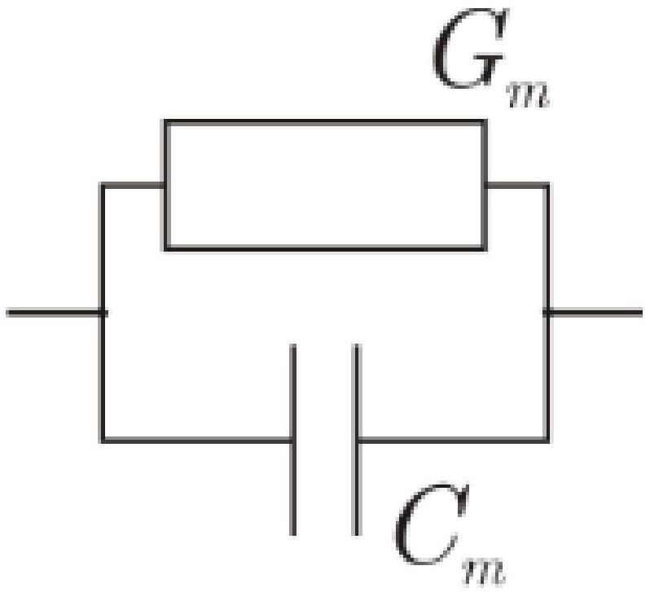
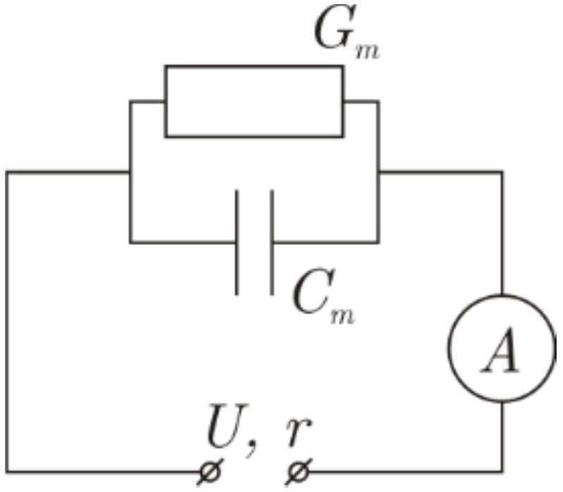
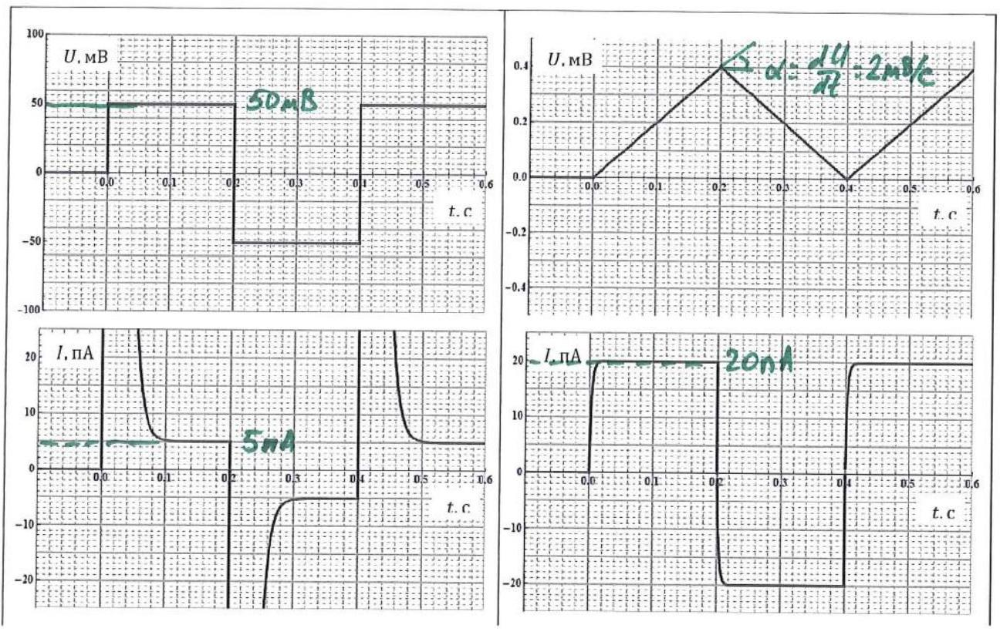
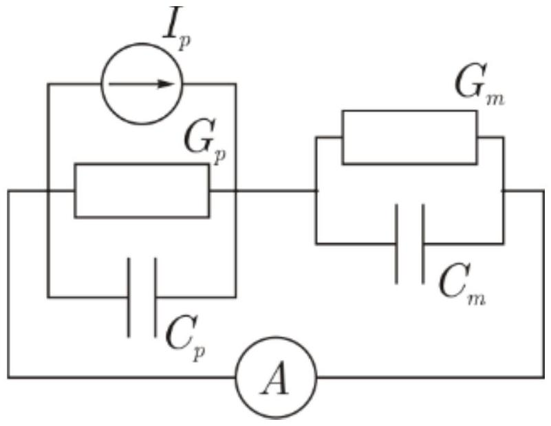
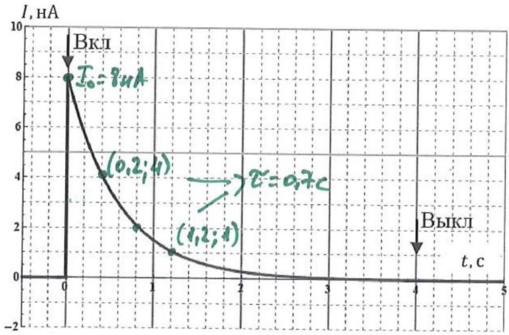
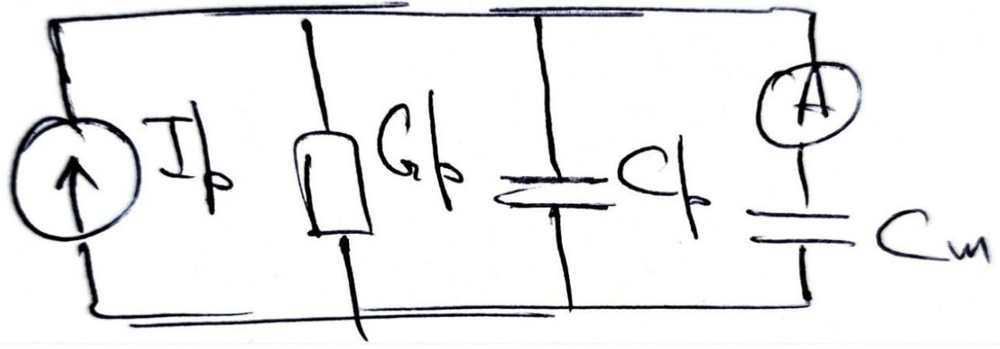
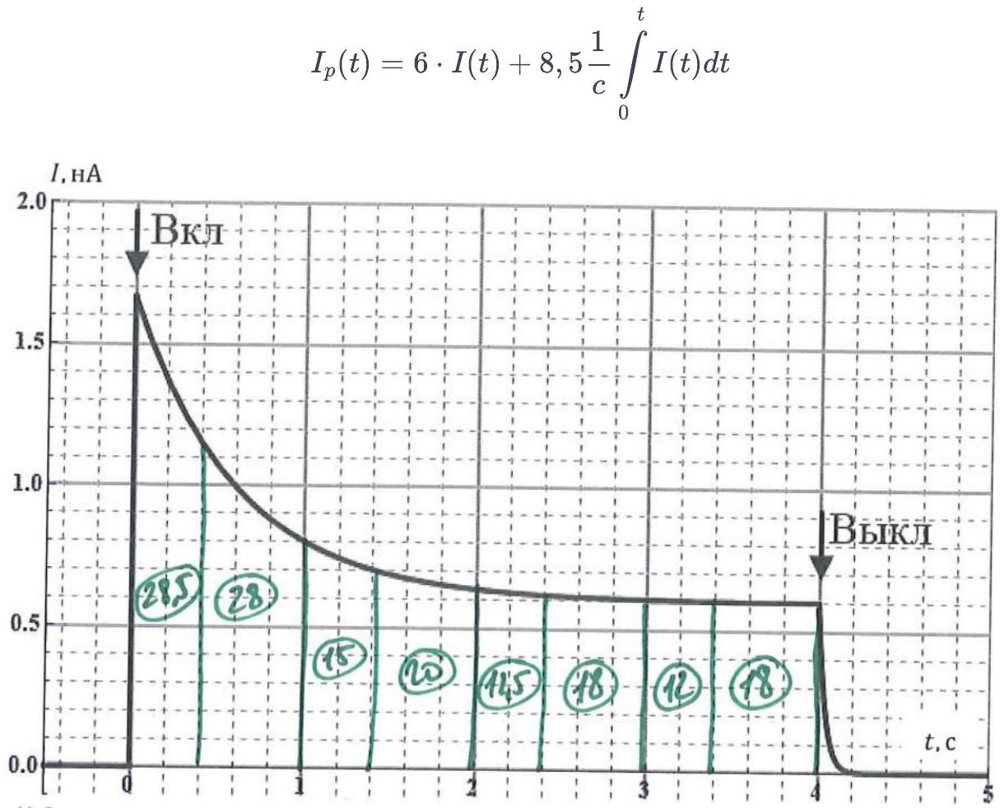
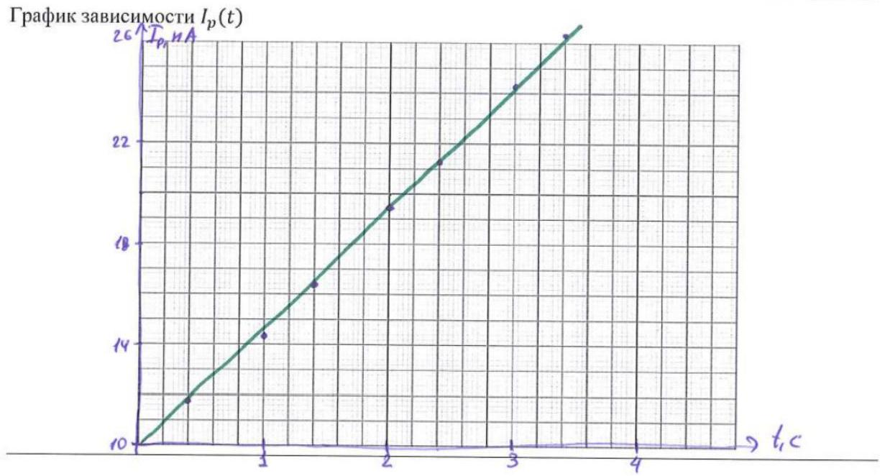
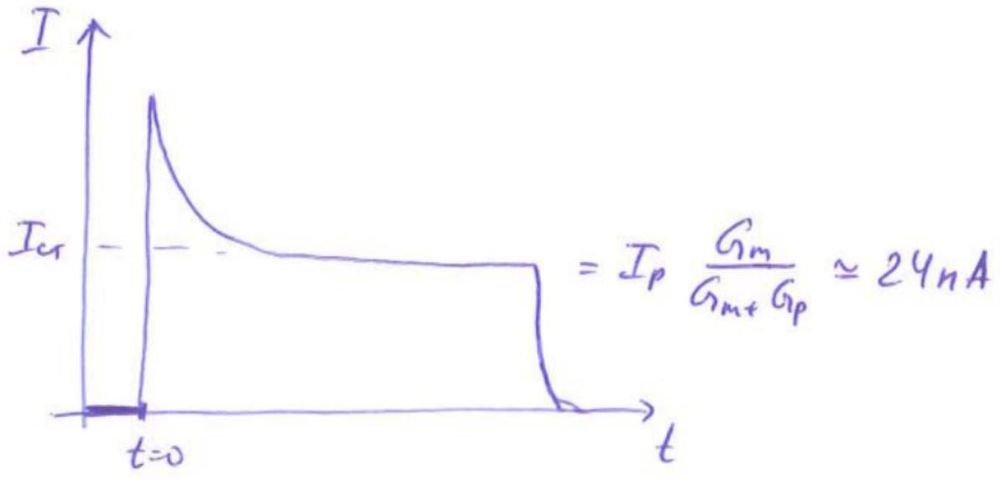

А1 ${ } ^ { 0.50 }$ Пусть плоские куски мембран, содержащие бактериородопсин, освещаются достаточно мощным светом. Какой ток $I _ { b R }$ течет через 1 мм ${ } ^ { 2 }$ таких мембран (в мкА/ММ ${ } ^ { 2 }$ )? Из исследования этих мембран методом электронной микроскопии известно, что плотность белковых молекул в них $9 \cdot 10 ^ { 12 } \mathrm {~cm} ^ { - 2 }$

Из фотоцикла ясно, что один протон прокачивается белком за $\tau = 15$ мс. Поэтому

$$
I _ { b R } = \frac { n S e } { \tau }
$$

Ответ:

$$
I _ { b R } = 0,96 \text { мкА } / \text { мм } ^ { 2 }
$$

В1 ${ } ^ { 0.50 }$ Нарисуйте простейшую эквивалентную электрическую схему мембраны, которая хорошо описывает полученные результаты. Нарисуйте эквивалентную электрическую схему эксперимента, описанного выше.

Мы видим на графиках затухание, похожее на экспоненту, а также стационарный ток при постоянном напряжении. Поэтому в системе есть конденсатор $C _ { m }$ и сопротивление $R _ { m }$ подключенное к нему параллельно.

Ответ: В схеме конденсатор $C _ { m }$ и резистор $G _ { m }$ соединены параллельно.

Ответ:
Итак, мембрана

Ответ:
Установка

Из спадания графика на Рис. 6 и нарастания на Рис. 7, видно, что $\tau = R C$ разное, притом, что $C$ - одинаковые. Значит эти характерные времена обусловлены сопротивлением источника $r$, которое $r \ll R _ { m }$.
Ещё одно объяснение могло бы быть $r \sim R _ { m }$, но сопротивление источника в 10 гом - нереально.
Считая $r \ll R _ { m }$ запишем ток при линейно возрастающем направлении

$$
\begin{gathered}
U = \alpha t = U _ { c } + I r \rightarrow U _ { c } = \alpha t - I r \\
I = C _ { m } \frac { d U _ { c } } { d t } = C _ { m } \left( \alpha - r \frac { d I } { d t } \right) \\
\frac { I } { C _ { m } } = \alpha - r \frac { d I } { d t } \rightarrow \frac { d I } { C _ { m } \alpha - I } = \frac { d t } { r C _ { m } } \rightarrow I = \alpha C _ { m } \left( 1 - e ^ { - t / r C } \right)
\end{gathered}
$$

Из уравнения видно, что установившийся ток связан с ёмкостью $C _ { m }$ и скоростью изменения напряжения. Из Рис. 7

$$
\begin{gathered}
\alpha = \frac { 0,4 \mathrm { mB } } { 0,2 \mathrm { c } } = 2 \mathrm { mB } / \mathrm { c } \\
I _ { c r } = 20 \pi \mathrm {~A} \\
U _ { \infty } , r \\
\underset { \varnothing } { r }
\end{gathered}
$$

Ответ:

$$
C _ { m } = \frac { I _ { c r } } { \alpha } = \frac { 20 \Pi \mathrm {~A} } { 2 \mathrm { MB } / \mathrm { c } } = 10 \mathrm { H } \Phi
$$

B3 ${ } ^ { 0.50 }$ Используя Рис. 6 и 7, оцените проводимость $G _ { m }$ мембраны. С помощью формул, графиков и диаграмм объясните свое решение.

Из Рис. 6 видно, что с течением времени, ток через амперметр устанавливается. При этом подано на мембрану $U = 50 \mathrm { мB }$. Стационарный ток $I _ { c r } = 5$ пА, откуда $R _ { m } = \frac { U } { I _ { c r } } = \frac { 50 \mathrm { MB } } { 5 п \mathrm {~A} } = 10$ гом

Ответ: $G _ { m } = \frac { 1 } { R _ { m } } = 0,1 \mathrm { HCM }$

С1 ${ } ^ { 0.50 }$ Пусть описанная система мембран освещается достаточно мощным светом, таким, что суммарный ток, создаваемый всеми белками постоянен и равен $I _ { p }$, а через амперметр течет ток $I$. Нарисуйте эквивалентную электрическую схему для такого эксперимента.

Протоны после прокачки попадают сразу к чёрной мембране. Поэтому Источник тока подключен параллельно мембране с белком.
Отметим, что мембраны с током это источник тока, а не напряжения.

Ответ:

с2 ${ } ^ { 2.00 }$ Получите теоретическое выражение для фототока $I ( t )$, измеряемого амперметром, в зависимости от времени. Ответ выразите через суммарный ток белков $I _ { p }$, электрические характеристики мембраны с белком $C _ { p }$ и $G _ { p }$ и электрические характеристики черной липидной мембраны $C _ { m }$ и $G _ { m }$. Начало отсчета времени $t = 0$ возьмите в момент включения света.

Пусть на мембране с белком напряжение $U _ { p }$, а на черной мембране $- U _ { m }$
Тогда закон Киргофа:

$$
\begin{aligned}
U _ { p } + U _ { m } & = 0 \\
I = I _ { p } + U _ { p } G _ { p } + C _ { p } \frac { U _ { p } } { d t } & = U _ { m } G _ { m } + C _ { m } \frac { d U _ { m } } { d t }
\end{aligned}
$$

Обозначим $C _ { 0 } = C _ { p } + C _ { m }$ и $G _ { 0 } = G _ { p } + G _ { m } , \tau _ { 0 } = \frac { C _ { 0 } } { G _ { 0 } }$, решаем систему и находим $U _ { p }$ или $U _ { m }$

$$
\begin{gathered}
I _ { p } + U _ { p } G _ { 0 } = - C _ { 0 } \frac { d U _ { p } } { d t } \\
- \frac { d t } { C _ { 0 } } = \frac { d U _ { p } } { I _ { p } + U _ { p } G _ { 0 } }
\end{gathered}
$$

Считая $I _ { p } =$ const и $U _ { p } ( 0 ) = 0$ интегрируем

$$
\begin{gathered}
- \frac { t } { C _ { 0 } } = \frac { 1 } { G _ { 0 } } \ln \frac { I _ { p } + U _ { p } G _ { 0 } } { I _ { p } } \\
U _ { m } = - U _ { p } = - \frac { I _ { p } } { G _ { 0 } } \left( 1 - e ^ { - t / \tau _ { 0 } } \right)
\end{gathered}
$$

Подставим $U _ { m }$ в уравнение для тока

$$
I = - I _ { p } \frac { G _ { m } } { G _ { 0 } } + I _ { p } \left( \frac { G _ { m } } { G _ { 0 } } - \frac { C _ { m } } { C _ { 0 } } \right) e ^ { - t / \tau _ { 0 } }
$$

Ответ:

$$
I ( t ) = I _ { p } \left[ \frac { G _ { m } } { G _ { m } + G _ { p } } + \left( \frac { C _ { m } } { C _ { m } + C _ { p } } - \frac { G _ { m } } { G _ { m } + G _ { p } } \right) e ^ { - t \frac { G _ { m } + G _ { p } } { C _ { m } + C _ { p } } } \right]
$$

с3 ${ } ^ { 0.50 }$ Используя Рис. 9 и численные данные полученные ранее, оцените проводимость $G _ { p }$ мембран с белком. С помощью формул, графиков и диаграмм объясните свое решение.

Из вышеуказанной формулы видно, что должен существовать стационарный ток при $t \rightarrow \infty I = I _ { p } \frac { G _ { m } } { G _ { m } + G _ { p } }$, но он исчезающе мал $\left( \frac { G _ { m } } { G _ { m } + G _ { p } } \ll 1 \right.$ т. к. $\left. G _ { m } \ll G _ { p } \right)$, поэтому ток можно описать как

$$
I ( t ) = I _ { p } \frac { C _ { m } } { C _ { m } + C _ { p } } e ^ { - t \frac { G _ { p } } { C _ { m } + C _ { p } } }
$$

Найдя характерное время $\tau = \frac { C _ { m } + C _ { p } } { G _ { p } }$, мы сможем найти $G _ { p }$. Из графика находим $\tau \approx 0,7$ с. Зная из Вз $C _ { m }$, получаем

Ответ:

$$
G _ { p } \approx \frac { 60 \mathrm { H } \Phi } { 0,7 \mathrm { c } } = 85 \mathrm { HCM } _ { \mathrm { C } }
$$

C4 ${ } ^ { 0.20 }$ Вычислите отношение проводимости черной липидной мембраны и мембран с белком, т.е. найдите $G _ { m } / G _ { p }$.

Ответ:

$$
\frac { G _ { m } } { G _ { p } } = \frac { 0,1 } { 85 } \approx 10 ^ { - 3 } \ll 1
$$

C5 ${ } ^ { 0.50 }$ Используя Рис. 9 и численные данные полученные ранее, оцените суммарный ток $I _ { p }$, создаваемый белками. С помощью формул, графиков и диаграмм объясните свое решение.

Ток от белков $I _ { p }$ получается из значения $t = 0$

Ответ:

$$
I _ { p } = I ( 0 ) \frac { C _ { m } + C _ { p } } { C _ { m } } = 48 \mathrm { HA }
$$

C6 ${ } ^ { 0.30 }$ Рассчитайте, какая доля мембран $\alpha$ была ориентирована преимущественным образом на черной мембране. Найдите отношение количества белков, качающих протоны к мембране, к их общему количеству.

Зная ток от мембраны из пункта А1, запишем суммарный ток $I _ { p }$

$$
\begin{gathered}
I _ { p } = \alpha I _ { b R } - ( 1 - \alpha ) I _ { b R } \\
\frac { I _ { p } } { I _ { b R } } = 2 \alpha - 1
\end{gathered}
$$

Ответ:

$$
\alpha = \frac { 1 } { 2 } \left( 1 + \frac { I _ { p } } { I _ { b R } } \right) \approx 0,525
$$

D1 ${ } ^ { 0.20 }$ Используя результат пункта C4, сделав необходимые пренебрежения, нарисуйте эквивалентную электрическую схему эксперимента.

D2 ${ } ^ { 1.00 }$ Получите выражение для тока, создаваемого белками, $I _ { p } ( t )$, считая известным измеряемый амперметром фототок $I ( t )$. Ответ выразите через фототок $I ( t )$ и электрические характеристики мембран с белком и черной мембраны. Начало отсчета времени $t = 0$ возьмите в момент включения света.

Аналогично C2 запишем закон Киргофа:

$$
\begin{gathered}
U _ { p } + U _ { m } = 0 \\
I = I _ { p } + U _ { p } G _ { p } + C _ { p } \frac { d U _ { p } } { d t } = C _ { m } \frac { d U _ { m } } { d t }
\end{gathered}
$$

Учитывая, что $U _ { m } ( 0 ) = 0$ и $U _ { m } = - U _ { p }$

$$
\begin{gathered}
U _ { m } = \frac { 1 } { C _ { m } } \int _ { 0 } ^ { t } I ( t ) d t \\
I _ { p } = I - U _ { p } G _ { p } - C _ { p } \frac { d U _ { p } } { d t }
\end{gathered}
$$

Ответ:

$$
I _ { p } ( t ) = \frac { C _ { p } + C _ { m } } { C _ { m } } I ( t ) + \frac { G _ { p } } { C _ { m } } \int _ { 0 } ^ { t } I ( t ) d t
$$

D3 ${ } ^ { 1.30 }$ Используя результат из пункта D2 и Рис. 10, численно постройте график зависимости тока $I _ { p }$ от времени $t$. С точностью до коэффициента пропорциональности это будет график зависимости интенсивности падающего света от времени

Нам нужно будет численно интегрировать график $I ( t ) /$
Расчетная формула для

| $t$, c | 0,4 | 1,0 | 1,4 | 2,0 | 2,4 | 3,0 | 3,4 |
| :--- | :--- | :--- | :--- | :--- | :--- | :--- | :--- |
| $I ( t )$, нА | 1,15 | 0,8 | 0,7 | 0,65 | 0,61 | 0,6 | 0,6 |
| $\int I ( t ) d t$, клет. | 28,5 | 56,5 | 71,5 | 91,5 | 104 | 122 | 134 |
| $\int I ( t ) d t$, на • с | 0,57 | 1,12 | 1,43 | 1,83 | 2,08 | 2,44 | 2,68 |
| $I _ { p } , \mathrm { HA }$ | 11,7 | 14,3 | 16,4 | 19,5 | 21,3 | 24,3 | 26,4 |

Ответ:

E1 1.00 В условиях эксперимента из части С этой задачи, но с увеличенной проводимостью черной липидной мембраны, перерисуйте Рис. 9. Т.е. схематично изобразите зависимость фототока $I ^ { G R } ( t )$ от времени $t$, считая, что доля мембран с белком, ориентированных преимущественным образом, осталась той же, а мощности падающего света достаточно, чтобы все белки прокачивали протоны.

Используя результат из С2, скажем, что теперь $G _ { m } \sim G _ { p }$, поэтому мы увидим стационарный ток при освещении, т. е.

$$
I _ { \text {ст } } = I _ { p } \frac { G _ { m } } { G _ { m } + G _ { p } }
$$

Ответ:

$$
I _ { \text {ст } } = 24 \text { пА }
$$

