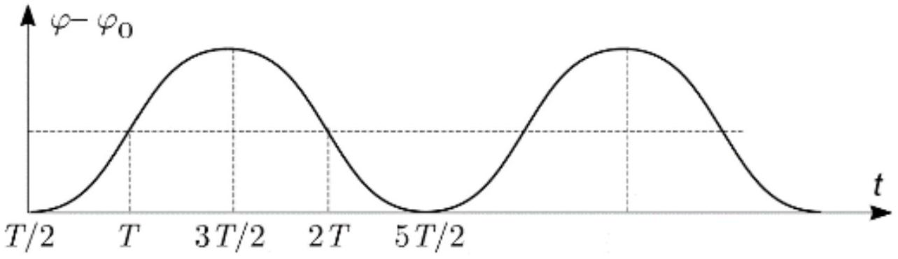

А1 ${ } ^ { 1.50 }$ Выразите угловое ускорение стержня $\ddot { \varphi }$ через $\varphi , l$ и $g$. Покажите, что зависимость угла наклона $\varphi$ от времени задается выражением $\varphi = A e ^ { t / \tau } + B e ^ { - t / \tau }$, где $A$ и $B$ - постоянные, зависящие от начального положения и начальной угловой скорости стержня, а $\tau$ - характерное время падения. Выразите $\tau$ через $l$ и $g$.

Уравнение моментов для стержня относительно шарнира:

$$
I = M \ddot { \varphi } ,
$$

где $I = \frac { 1 } { 3 } m l ^ { 2 }$ - момент инерции стержня относительно его конца, а $M = m g \cdot \left( \frac { 1 } { 2 } l \sin \varphi \right) \simeq \frac { 1 } { 2 } m g l \varphi$ - момент силы тяжести.

Ответ: $\ddot { \varphi } = \frac { 3 g } { 2 l } \varphi$.

Проверим, что $\varphi = A e ^ { t / \tau } + B e ^ { - t / \tau \tau }$ является решением полученного уравнения: $\ddot { \varphi } = \frac { 1 } { \tau ^ { 2 } } \left( A e ^ { t / \tau } + B e ^ { - t / \tau \tau } \right) = \frac { \varphi ( t ) } { \tau ^ { 2 } }$.

Ответ:

$$
\tau = \sqrt { \frac { 2 l } { 3 g } }
$$

A2 ${ } ^ { 0.50 }$ Пусть теперь мальчик пытается поддерживать длинную тонкую палку в вертикальном положении на своей руке. Как только палка начинает падать, например, влево, он двигает руку влево на еще большее расстояние так, что центр масс палки оказывается правее её точки опоры. Вследствие этого момент силы тяжести начинает вращать палку вправо, уменьшая ее скорость вращения, направленную влево. Оцените, палку какой длины мальчик может держать вертикально, если время его реакции примерно равно $\tau _ { r } = 0,2 \mathrm { c }$. (Время реакции - это временная задержка между командой, посланной мозгом рукам, и соответствующим движением рук.)

Время реакции мальчика $\tau _ { r }$ должно быть порядка характерного времени падения $\tau$. Используя это, находим длину палки: $l _ { r } = \tau _ { r } ^ { 2 } \frac { 3 g } { 2 }$.

Ответ:

$$
l _ { r } = \tau _ { r } ^ { 2 } \frac { 3 g } { 2 } = 0.59 \mathrm {~m}
$$

А3 ${ } ^ { 0.50 }$ Люди и птицы удерживают себя в стоячем положении похожим образом. Они двигают точку опоры (точку внизу ступни, где приложена нормальная сила реакции опоры), например, изменяя угол между ступней и ногой, чтобы противостоять падению верхней части тела.
Маленькая птичка высоты $l = 6$ см может стоять на ногах. Оцените сверху её время реакции.

Время реакции птички $\tau _ { b }$ должно быть порядка характерного времени падения $\tau$ Используя это, находим время реакции птички:
$\tau _ { b } = \sqrt { \frac { 2 l _ { b } } { 3 g } }$.

Ответ:

$$
\tau _ { b } = \sqrt { \frac { 2 l _ { b } } { 3 g } } = 0.065 \mathrm { c }
$$

A4 ${ } ^ { 1.00 }$ Равновесие на велосипеде тоже поддерживается путём переноса точки опоры, лежащей на линии между точками соприкосновения колес с землёй. Эта линия может быть перемещена поворотом руля во время езды. Оцените минимальную скорость велосипедиста $v _ { m }$, при которой он может держать равновесие таким способом. Считайте, что для него характерное время падения такое же, как и у стержня длиной $L = 2 \mathrm {~m}$; расстояние между осями колёс $d = 1$ м.

Время $\tau _ { m }$ за которое можно перенести точку опоры велосипедиста зависит от базы $d$ велосипеда и его скорости $v _ { m }$ следующим образом $\tau _ { m } = \frac { d } { v _ { m } }$. Это время должно быть порядка характерного времени падания $\tau$. Находим скорость $v _ { m } = d \sqrt { \frac { 3 g } { 2 L } }$.

Ответ:

$$
v _ { m } = d \sqrt { \frac { 3 g } { 2 L } } = 2.7 \mathrm {~m} / \mathrm { c }
$$

В1 ${ } ^ { 1.00 }$ Предположим, что изначально канатоходец стоял в почти идеальном равновесии
( $\alpha _ { 1 } = \alpha _ { 2 } = 0$ ). Из-за неустойчивости равновесия он медленно начинает падать по часовой стрелке. Он это замечает, когда $t = t _ { 0 } , \alpha _ { 1 } = \alpha _ { 2 } = \alpha _ { 0 } > 0$. Он быстро изгибается, чтобы перестать падать. Считайте, что угол $\beta$ мгновенно принимает значение $\beta _ { 0 }$. Выразите новые значения углов $\alpha _ { 1 }$ и $\alpha _ { 2 }$ через $\beta _ { 0 }$ и $\alpha _ { 0 }$.

В процессе изменения конфигурации на канатоходца действует момент силы тяжести, однако, это не приводит к изменению момента импульса (изменения углов $\alpha _ { 1 }$ и $\alpha _ { 2 }$ происходят с очень большой скоростью за небольшой период времени). Запишем закон сохранения момента импульса относительно точки опоры

$$
m ( 1.4 H ) ^ { 2 } \dot { \alpha } _ { 1 } + m H ^ { 2 } \dot { \alpha } _ { 2 } = 0
$$

с учетом того, что в начальный момент канатоходец покоится. Полученное выражение проинтегрируем по времени и получим $1.96 \left( \alpha _ { 1 } - \alpha _ { 0 } \right) + \left( \alpha _ { 2 } - \alpha _ { 0 } \right) = 0$. К этому уравнению добавим условие $\alpha _ { 1 } - \alpha _ { 2 } = \beta$ и решим систему из двух линейных уравнений.

Ответ:

$$
\alpha _ { 1 } = \alpha _ { 0 } + \frac { \beta _ { 0 } } { 2.96 } \$ , \$ \alpha _ { 2 } = \alpha _ { 0 } - \frac { 1.96 \beta _ { 0 } } { 2.96 }
$$

В2 ${ } ^ { 0.50 }$ Таким образом, канатоходец теперь согнут и поддерживает ту же форму тела ( $\beta = \beta _ { 0 }$ ) в течение времени $T _ { b }$, после которого он почти мгновенно выпрямляется ( $\beta = 0$ ). Он хочет снова встать вертикально $\alpha _ { 1 } = \alpha _ { 2 } = 0$. Должен ли он был сгибаться по часовой стрелке ( $\beta _ { 0 } > 0$ ) или против часовой стрелки ( $\beta _ { 0 } < 0$ )? Объясните свой ответ.

Момент силы тяжести $M = m g ( 1.4 H ) \alpha _ { 1 } + m g H \cdot \alpha _ { 2 }$. Подставим сюда $\alpha _ { 1 }$ и $\alpha _ { 2 }$ из предыдущего пункта и получим

$$
M = m g H \left( 2.4 \alpha _ { 0 } - \frac { 7 } { 37 } \beta _ { 0 } \right) .
$$

Для того, чтобы канатоходец вернулся в прежнее положение, ему нужно развернуть набранную скорость, для этого должно быть $M < 0$, т.е. $\beta _ { 0 } > 0$.

Ответ:

$$
\beta _ { 0 } > 0
$$

В3 ${ } ^ { 1.00 }$ Теперь будем считать, что $\alpha _ { 0 } \ll \beta _ { 0 }$. Сразу после того, как он выпрямился, ни его угловая скорость $\left( \dot { \alpha } _ { 1 } = \dot { \alpha } _ { 2 } \right)$, ни угол $\alpha _ { 1 }$ не равны нулю (равными нулю они станут значительно позже). Найдите значение выражения $\dot { \alpha } _ { 1 } / \alpha _ { 1 }$. Ответ выразите через $H$ и $g$.

Движение выпрямленного канатоходца описывается уравнением $2.96 m H ^ { 2 } \ddot { \alpha } _ { 1 } = 2.4 m g H \alpha _ { 1 }$. Его решение ищем в виде $\alpha _ { 1 } = A e ^ { t / \tau } + B e ^ { - t / \tau }$.

Для того, чтобы канатоходец возвращался в исходное положение, $A = 0$. Поэтому $\frac { \alpha _ { 1 } } { \alpha _ { 1 } } = - \frac { 1 } { \tau }$.

Ответ:

$$
\frac { \dot { \alpha } _ { 1 } } { \alpha _ { 1 } } = - \frac { 1 } { \tau } = - \sqrt { \frac { 30 g } { 37 H } }
$$

В4 ${ } ^ { 1.00 }$ Найдите время $T _ { b }$, в течение которого канатоходец согнут. Ответ выразите через $\alpha _ { 0 } , \beta _ { 0 } , H$ и $g$. Можно считать, что $\alpha _ { 0 } \ll \beta _ { 0 }$.

Как показано выше, скорость канатоходца сразу после выпрямления (после второго изменения формы) равна $\dot { \alpha } _ { \text {к } } = - \frac { \alpha } { \tau }$. Скорость прямо перед сгибанием равна $\dot { \alpha } _ { \mathrm { H } } = \frac { \alpha _ { 0 } } { \tau }$, так как этот этот процесс с точностью до изменения знака времени эквивалентен тому, который описан в предыдущем пункте.

Изменение момента импульса в согнутой конфигурации:

$$
\Delta L = 2.96 m H ^ { 2 } \cdot \left( \alpha _ { \kappa } - \alpha _ { \mathrm { H } } \right) = - \frac { 5.92 m H ^ { 2 } \alpha _ { 0 } } { \tau }
$$

С учётом условия $\alpha _ { 0 } \ll \beta _ { 0 }$, момент сил $M \simeq - \frac { 7 } { 37 } m g H \beta _ { 0 }$.

Изменение момента импульса происходит за счёт момента $M$ за время $T _ { b } = \frac { \Delta L } { M }$. Отсюда получаем ответ $T _ { b } = 28.18 \frac { \alpha _ { 0 } } { \beta _ { 0 } } \sqrt { \frac { H } { g } }$.

Ответ:

$$
T _ { b } = 28.18 \frac { \alpha _ { 0 } } { \beta _ { 0 } } \sqrt { \frac { H } { g } }
$$

С1 ${ } ^ { 1.50 }$ Считайте, что в момент $t = T / 2$ маятник был неподвижен и наклонён под малым углом $\varphi _ { 0 }$. Нарисуйте график зависимости угла наклона $\varphi$ от времени, и определите угловое смещение маятника $\Delta \varphi$ в момент $t = T$, то есть, $\Delta \varphi = \varphi ( T ) - \varphi ( T / 2 )$. Можно считать, что $\Delta \varphi \ll \varphi _ { 0 }$.

В случае, когда ускорение направлено вверх (например, $0 < t < T$ ) сила инерции направлена вниз. Уравнение движения для этого случая:

$$
\ddot { \varphi } = \frac { 2 v _ { 0 } } { l T } \varphi .
$$

Так как смещения от положения $\varphi _ { 0 }$ малы, то можно считать, что движение равноускоренное: $\ddot { \varphi } = \frac { 2 v _ { 0 } } { l T } \varphi _ { 0 }$.
С учетом начальных условий $\dot { \varphi } \left( \frac { T } { 2 } \right) = 0 , \varphi \left( \frac { T } { 2 } \right) = \varphi _ { 0 }$ получаем зависимость $\varphi ( t ) = \varphi _ { 0 } + \frac { v _ { 0 } } { l T } \left( t - \frac { T } { 2 } \right) ^ { 2 }$. После $t = T$ момент силы меняет направление, и движение описывается похожим законом. Амплитуда изменения угла $\Delta \varphi = \frac { v _ { 0 } T } { 4 l } \varphi _ { 0 }$.

Ответ:

Ответ:

$$
\Delta \varphi = \frac { v _ { 0 } T } { 4 l } \varphi _ { 0 }
$$

С2 ${ } ^ { 1.50 }$ Так как мы все еще пренебрегаем силой тяжести, только сила инерции имеет ненулевой момент относительно шарнира. Найдите среднее по времени значение этого момента силы инерции за время $2 T$.

Средний момент вычислим "в лоб":

$$
\langle M \rangle = \langle m l a \varphi \rangle = m l \langle a \cdot [ ( \varphi - \langle \varphi \rangle ) + \langle \varphi \rangle ] \rangle = m l \langle a ( \varphi - \langle \varphi \rangle ) \rangle + m l \langle \varphi \rangle \langle a \rangle = - m l a _ { 0 } \langle | \varphi - \langle \varphi \rangle | \rangle + 0
$$

Вычислим среднее модуля отклонения:

$$
\langle | \varphi ( t ) - \varphi | \rangle = \frac { 2 } { t } \int _ { 0 } ^ { \frac { T } { 2 } } \Delta \varphi \left( 1 - \frac { 4 t ^ { 2 } } { T ^ { 2 } } \right) d t = \frac { 2 } { 3 } \Delta \varphi = \frac { v _ { 0 } T } { 6 l } \varphi _ { 0 }
$$

Тогда выражение для среднего момента силы $\langle M \rangle = - \frac { m v _ { 0 } ^ { 2 } } { 3 } \varphi _ { 0 }$

Ответ:

$$
\langle M \rangle = - \frac { m v _ { 0 } ^ { 2 } } { 3 } \varphi _ { 0 }
$$

С3 ${ } ^ { 1.00 }$ Теперь учтем силу тяжести. Напишите неравенство, которое должно выполняться для $g , T , l$ и $v _ { 0 }$, чтобы существовало вертикальное положение.

Сила тяжести не влияет на значение среднего момента силы инерции, полученного ранее. Добавляется момент силы тяжести, равный $m g l \varphi _ { 0 }$. Тогда уравнение движения имеет следующий вид $l ^ { 2 } \ddot { \varphi } = \left( g l - \frac { v _ { 0 } ^ { 2 } } { 3 } \right) \varphi _ { 0 }$. Вертикально положение будет устойчивым, когда правая часть отрицательная, то есть, возникает возвращающий момент.

Ответ:

$$
v _ { 0 } ^ { 2 } > 3 g l
$$
