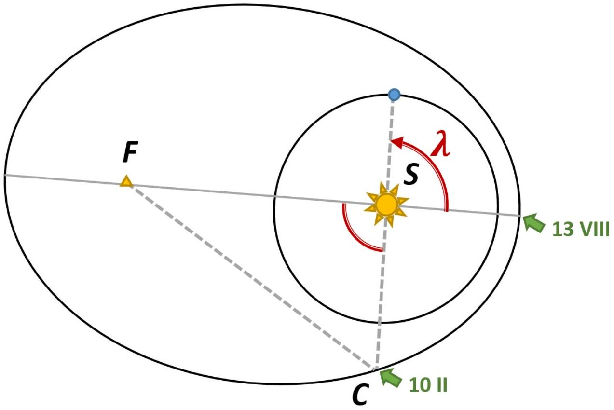

А1 ${ } ^ { 0.50 }$ Для эллипса можно определить параметр эксцентриситет $e = \sqrt { 1 - b ^ { 2 } / a ^ { 2 } }$, где $a$ и $b$ - большая и малая полуоси эллипса соответственно. Найдите эксцентриситет $e$ орбиты кометы Чурюмова-Герасименко.

При прохождении перигелия и афелия орбиты лучевая скорость кометы $v _ { r } = 0$. Из графика: $q = 1.24$ а.е., $Q = 5.68$ а.е., откуда $\frac { 1 + e } { 1 - e } = \frac { Q } { q } = 4.58$. Итого $e = \frac { Q - q } { Q + q } = 0.64$.

Ответ:

$$
e = \frac { Q - q } { Q + q } = 0.64
$$

А2 ${ } ^ { 1.00 }$ Полная энергия тела, которое движется по эллиптической орбите, не зависит от ее эксцентриситета, а зависит только от длины большой полуоси $a$. Найдите скорость $v$ кометы в зависимости от расстояния $r$. Ответ выразите через $a , r$ и физические постоянные.

Удобно рассмотреть круговую орбиту радиусом $a$. Тело движется по ней с "первой космической" скоростью $v = \sqrt { \frac { G M } { a } }$, которую можно найти из II закона Ньютона $\frac { G M } { a ^ { 2 } } = \frac { v ^ { 2 } } { a }$. Тогда полная энергия

$$
E = \frac { m v ^ { 2 } } { 2 } - \frac { G M m } { a } = - \frac { G M m } { 2 a } ,
$$

откуда нетрудно выразить $v = \sqrt { G M \left( \frac { 2 } { r } - \frac { 1 } { a } \right) }$.

Ответ:

$$
v = \sqrt { G M \left( \frac { 2 } { r } - \frac { 1 } { a } \right) }
$$

А3 ${ } ^ { 1.00 }$ Найдите лучевую скорость $v _ { r }$ в зависимости от расстояния $r$. Ответ выразите через $a , r , e$ и физические постоянные.

По теореме Пифагора $v _ { r } ^ { 2 } = v ^ { 2 } - v _ { \tau } ^ { 2 }$, где $v _ { \tau }$ - тангенциальная скорость кометы. Всходя из ЗСМИ $L = m v _ { \tau } r$, поэтому $v _ { r } ^ { 2 } = v ^ { 2 } - \frac { L ^ { 2 } } { m ^ { 2 } r ^ { 2 } }$.
Найдем $L$ с помощью равенства $v = v _ { \tau }$ в перигелии и афелии:

$$
v ^ { 2 } = G M \left( \frac { 2 } { a ( 1 - e ) } - \frac { 1 } { a } \right) = \frac { L ^ { 2 } } { m ^ { 2 } a ^ { 2 } ( 1 - e ) ^ { 2 } } .
$$

В итоге получим $v _ { \tau } ^ { 2 } = \frac { L ^ { 2 } } { m ^ { 2 } r ^ { 2 } } = G M \frac { a \left( 1 - e ^ { 2 } \right) } { r ^ { 2 } }$ и $v _ { r } = \sqrt { G M \left( \frac { 2 } { r } - \frac { 1 } { a } - \frac { a \left( 1 - e ^ { 2 } \right) } { r ^ { 2 } } \right) }$.

Ответ:

$$
v _ { r } = \sqrt { G M \left( \frac { 2 } { r } - \frac { 1 } { a } - \frac { a \left( 1 - e ^ { 2 } \right) } { r ^ { 2 } } \right) }
$$

A4 ${ } ^ { 0.50 }$ Используя график, найдите значение длины большой полуоси $a$ орбиты кометы.

В точке $r _ { 0 } = a \left( 1 - e ^ { 2 } \right)$ выполняется $\frac { d v _ { r } } { d r } = 0$. В тоже время касательная к графику горизонтальна при $r _ { 0 } = 2.04$ а.е., откуда $a = 3.46$ а.е..

Ответ:

$$
a = 3.46 \text { a.e. }
$$

В1 ${ } ^ { \mathbf { 0 . 4 0 } }$ Когда комета пройдет перигелий в следующий раз?

По третьему закону Кеплера период обращения кометы вокруг Солнца составляет

$$
T = \left( \frac { a } { \text { а.e. } } \right) ^ { 3 / 2 } \text { лет } = 2350 \text { сут. }
$$

Ответ: середина января 2022 года

В2 ${ } ^ { 2.50 }$ Оцените, когда можно ожидать ближайшее тесное сближение кометы с Землей (расстояние при тесном сближении не превышает минимально возможное более, чем на 15\%). Плоскости орбит Земли и кометы совпадают, как и направления угловых скоростей. Орбиту Земли считать круговой.

Положение Земли относительно перицентра орбиты кометы однозначно определяется (см. рис.) полярным углом $\lambda ( t )$.

Найдём величину $\lambda _ { c }$ этого угла на 10 февраля 2015 года. В треугольнике С (комета) - S (Солнце) - F (второй фокус орбиты эллипса) известны все три стороны:

$$
\begin{aligned}
& | S C | = d _ { 0 } - 1 \text { a.e. } = 2.70 \text { a.e., } \\
& | S F | = 2 a e = 4.43 \text { a.e., } \\
& | F C | = 2 a - | S C | = 4.22 \text { a.e. }
\end{aligned}
$$

По теореме косинусов вычислим $\lambda _ { c } = 68 ^ { \circ }$. Тогда на момент прохождения кометой перигелия в 2015 году:

$$
\lambda _ { p , 0 } \simeq \lambda _ { 0 } + \frac { 13 \text { августа } - 10 \text { февраля } } { 365 } \cdot 360 ^ { \circ } = 68 ^ { \circ } + 180 ^ { \circ } = - 112 ^ { \circ } .
$$

Поскольку период обращения кометы вокруг Солнца составляет 6.44 земных лет, $\lambda _ { p , i }$ отстоят друг от друга на угол $\Delta \lambda = 0.44 \cdot 360 ^ { \circ } = 180 ^ { \circ } - 21.5 ^ { \circ }$.

Уже через три периода (см. таблицу) наступит момент, когда в момент прохождения перигелия Земля окажется между Солнцем и кометой, почти на одной прямой:

$$
13 \text { августа } 2015 \text { года } + 3 T = \text { ноябрь - декабрь } 2034 \text { года. }
$$

| $i$ | $\lambda _ { p , i }$ |
| :--- | :--- |
| 0 | -112° |
| 1 | 46.5° |
| 2 | -155° |
| 3 | 3.5° |

Ответ: ноябрь-декабрь 2034 года

C1 ${ } ^ { 0.10 }$ Запишите текущее перигелийное расстояние $q$ кометы.

Ответ:

$$
q = 1.24 \text { a. е. }
$$

С2 ${ } ^ { 2.00 }$ Найдите изменение $\Delta \left( v ^ { 2 } \right)$ квадрата модуля скорости кометы при взаимодействии с Юпитером. Ответ выразите через $q , q _ { l } , v _ { r _ { m a x } } , e$. Получите также численное значение $\Delta \left( v ^ { 2 } \right)$.

Орбитальная скорость тела зависит только от его гелиоцентрического расстояния r и большой полуоси орбиты а (пункт А2). При тесном сближении с Юпитером $r = R$.
Поскольку эксцентриситет орбиты остался прежним, старая и новая орбита подобны: $\frac { a _ { l } } { a } = \frac { q _ { l } } { q }$, откуда $a _ { l } = 7.53$ a.e..
Выражение для искомой величины записать нетрудно:

$$
\Delta v ^ { 2 } = G M \left( \frac { 2 } { R } - \frac { 1 } { a } - \frac { 2 } { R } + \frac { 1 } { a _ { l } } \right) = G M \frac { a - a _ { l } } { a \cdot a _ { l } } .
$$

Осталось найти значение постоянной Кеплера $G M$. Вновь обратимся к данным графика: $v _ { r , \max } = 13.4$ км/с достигается (пункт А4) при $r = a \left( 1 - e ^ { 2 } \right)$. При этом выражение для $v _ { r } ^ { 2 }$ принимает вид

$$
v _ { r , \max } ^ { 2 } = G M \left( \frac { 2 } { a \left( 1 - e ^ { 2 } \right) } - \frac { 1 } { a } - \frac { a \left( 1 - e ^ { 2 } \right) } { \left( a ^ { 2 } \left( 1 - e ^ { 2 } \right) ^ { 2 } \right. } \right) = G M \frac { e ^ { 2 } } { a \left( 1 - e ^ { 2 } \right) }
$$

В итоге имеем

$$
\Delta v ^ { 2 } = \frac { 1 - e ^ { 2 } } { e ^ { 2 } } \cdot \frac { a - a _ { l } } { a _ { l } } \cdot v _ { r , \max } ^ { 2 } = - 140 ( \text { км } / \mathrm { c } ) ^ { 2 } .
$$

Ответ:

$$
\Delta v ^ { 2 } = \frac { 1 - e ^ { 2 } } { e ^ { 2 } } \cdot \frac { a - a _ { l } } { a _ { l } } \cdot v _ { r , \max } ^ { 2 } = - 140 ( \text { км } / \mathrm { c } ) ^ { 2 }
$$

С3 ${ } ^ { 1.00 }$ Найдите угол $\Delta \psi$, на который повернулся вектор скорости кометы в результате описанного взаимодействия, если известно, что он не превышает $30 ^ { \circ }$. Считайте, что Юпитер движется по круговой орбите радиуса $R = 5,20$ a.е.

Рассчитаем (с точностью до знака) скорости $v _ { r } ( R )$ и $v _ { \tau } ( R )$ при движении по старой и новой орбитам (пункт А3); для упрощения вычислений положим $G M = 1$ a.e..
По этим данным рассчитаем угол, который скорость кометы образовывала с лучом зрения:

$$
| \psi | = \arctan \frac { v _ { \tau } } { v _ { r } }
$$

$$
r = R = 5.20 \text { а.е }
$$

| $a$, a.e. | $e$ | $v _ { r }$, y.e. | $v _ { \tau }$, y.e. | $\mid$ \psi $\mid$ |
| :--- | :--- | :--- | :--- | :--- |
| 7.53 | 0.64 | 0.296 | 0.405 | 54° |
| 3.46 |  | 0.142 | 0.275 | 63° |

Ответ:

$$
\Delta \psi = 9 ^ { \circ }
$$
