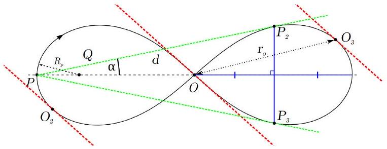
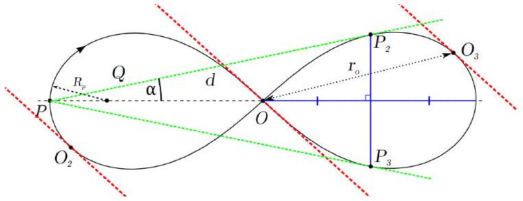

Найдите время движения одного из тел

1. из точки $O _ { 2 }$ до точки $O$;
2. из точки $O _ { 3 }$ до точки $P _ { 2 }$.

Одно тело проходит точки в следующей последовательности:

$$
O _ { 3 } \rightarrow O _ { 2 } \rightarrow O \rightarrow O _ { 3 } , \quad P _ { 3 } \rightarrow P _ { 2 } \rightarrow P \rightarrow P _ { 3 }
$$

За время $T$ расстояние $L _ { O _ { 2 } O }$ проходится тремя телами по одинаковому закону движения, т.е. $t _ { O _ { 2 } \rightarrow O } = T / 3$.
Время движения из точки $O$ до самой себя составляет $T / 2$ в силу зеркальной симметрии траектории и всего движения. Обозначим точкам $O _ { 2 } ^ { \prime }$ и $O _ { 3 } ^ { \prime }$ положения 2-го и 3-го в это момент времени.

Тогда $t _ { O \rightarrow O _ { 3 } } = T / 3$. При этом $t _ { O \rightarrow O _ { 2 } } = - T / 3 , t _ { O _ { 2 } \rightarrow O _ { 2 } ^ { \prime } } = T / 2$, поэтому $t _ { O \rightarrow O _ { 2 } ^ { \prime } } = T / 6$. В силу симметрии $t _ { P \rightarrow O } = \left( t _ { O \rightarrow O _ { 3 } } + t _ { O \rightarrow O _ { 2 } ^ { \prime } } \right) / 2 = T / 4$.
В итоге $t _ { O \rightarrow O _ { 3 } } = T / 3 , t _ { O \rightarrow P _ { 2 } } = t _ { O \rightarrow P } + t _ { P \rightarrow P _ { 2 } } = - T / 4 + 2 T / 3$. Значит $t _ { O _ { 3 } \rightarrow P _ { 2 } } = T / 3 - T / 4 = T / 12$.

А2 ${ } ^ { 1.00 }$ Пусть $\vec { v } _ { 1 } , \vec { v } _ { 2 }$ и $\vec { v } _ { 3 }$ - скорости этих трёх тел в некоторый момент времени. Запишите выражение, связывающее эти скорости между собой.

Центр масс покоится, поэтому $\vec { v } _ { 1 } + \vec { v } _ { 2 } + \vec { v } _ { 3 } = 0$

А3 ${ } ^ { 2.00 }$ Докажите, что суммарный момент импульса этой системы равен нулю.

Центр масс системы в силу симметрии относительно отражений не может быть нигде кроме центра, то есть

$$
\vec { r } _ { 1 } + \vec { r } _ { 2 } + \vec { r } _ { 3 } = 0
$$

Тогда в момент времени, когда 1 -тело находится в точке $O , \vec { r } _ { 2 } = - \vec { r } _ { 3 }$ и

$$
\vec { L } = m \vec { r } _ { 2 } \times \vec { v } _ { 2 } + m \vec { r } _ { 3 } \times \vec { v } _ { 3 } = m \vec { r } _ { 2 } \times \left( \vec { v } _ { 2 } - \vec { v } _ { 3 } \right)
$$

Из-за симметрии траектории $\vec { v } _ { 2 } = \vec { v } _ { 3 } = - \vec { v } _ { 2 } / 2$., поэтому $\vec { L } = 0$ когда 1-ое тело находится в точке $O$. Помимо этого система замкнутая, поэтому $\vec { L } =$ const и в любой момент времени $\vec { L } = 0$.

A4 ${ } ^ { 2.00 }$ Постройте положения точек $O _ { 2 }$ и $O _ { 3 }$ на листе ответов. В листе решений докажите справедливость построения.

Точки $O _ { 2 }$ и $O _ { 3 }$ должны быть симметричны друг другу относительно $O$. При этом касательная в обоих точках должна быть параллельна направлению движения в точке $O$.

A5 ${ } ^ { 2.00 }$ Постройте положения точек $P _ { 2 }$ и $P _ { 3 }$ на листе ответов. Предложите два независимых метода построения. В листе решений докажите справедливость построений.

С одной стороны центр масс должен быть в точке $O$, поэтому $P _ { 2 }$ и $P _ { 3 }$ можно найти через серединный перпендикуляр $P ^ { \prime } O$.

С другой стороны вертикальные составляющей скоростей $v _ { 2 }$ и $v _ { 3 }$ являются половинами от $v _ { 1 }$ и дают нулевой вклад в момент импульса. Горизонтальные составляющей скоростей $v _ { 2 }$ и $v _ { 3 }$ направлены в разные стороны и дают одинаковый вклад в момент импульса. Момент импульса относительно точки $P$ обнулится, если касательные в точках $P _ { 2 }$ и $P _ { 3 }$ будут проходить через точку $P$.

А6 ${ } ^ { 2.00 }$ Найдите отношение скоростей тел в точках $O$ и $P$.

Из рисунка траектории определим:

- Радиус кривизны в точке $P : R _ { p } = 41.7$;
- Расстояние $O O _ { 3 } : r _ { 0 } = 145.2$

- Расстояние $P P _ { 2 } : d = 242$
- Угол между $P O$ и $P P _ { 2 }$ : $\alpha = 11.6 ^ { \circ }$

Когда 1 -ое тело находится в точке $O$ полная энергия системы:

$$
E = \frac { m v _ { 1 , o } ^ { 2 } } { 2 } + \frac { m v _ { 2 , o } ^ { 2 } } { 2 } + \frac { m v _ { 3 , o } ^ { 2 } } { 2 } - \frac { G m ^ { 2 } } { r _ { 12 , o } } - \frac { G m ^ { 2 } } { r _ { 23 , o } } - \frac { G m ^ { 2 } } { r _ { 13 , o } }
$$

При этом $v _ { 1 , o } = 2 v _ { 2 , o } = 2 v _ { 3 , o } = v _ { o }$ и $r _ { 12 , o } = r _ { 13 , o } = \frac { 1 } { 2 } r _ { 12 , o } = r _ { o }$. То есть

$$
E = \frac { 3 m v _ { o } ^ { 2 } } { 4 } - \frac { 5 G m ^ { 2 } } { 2 r _ { o } }
$$

Когда 1-ое находится в точке $P$ полная энергия системы находится аналогичным образом. При этом $r _ { 12 , p } = r _ { 13 , p } = d , r _ { 23 , p } = 2 d \sin \alpha$. При этом $y$-проекция уравнения $\vec { v } _ { 1 } + \vec { v } _ { 2 } + \vec { v } _ { 3 } = 0$ позволяет написать $v _ { p } = v _ { 1 , p } = 2 v _ { 2 , p } \sin \alpha = 2 v _ { 3 , p } \sin \alpha$. Подстановка дает

$$
E = \frac { m v _ { p } ^ { 2 } } { 2 } \left( 1 + \frac { 1 } { 2 \sin ^ { 2 } \alpha } \right) - \frac { G m ^ { 2 } } { d } \left( 2 + \frac { 1 } { 2 \sin \alpha } \right) = 6.68 m v _ { p } ^ { 2 } - 4.49 \frac { G m ^ { 2 } } { d }
$$

Когда 1-ое тело находится в точке $P$ для него можно записать II закон Ньютона:

$$
\frac { m v _ { p } ^ { 2 } } { R _ { p } } = 2 \frac { G m ^ { 2 } } { d ^ { 2 } } \cos \alpha
$$

Полученную систему уравнений можно решить и получить результат

$$
\frac { v _ { o } } { v _ { p } } = \sqrt { \frac { 4 } { 3 } \left( 6.68 + 0.510 \frac { d ^ { 2 } } { R _ { p } } \left[ \frac { 5 } { 2 r _ { o } } - \frac { 4.49 } { d } \right] \right) } = 2.8
$$
