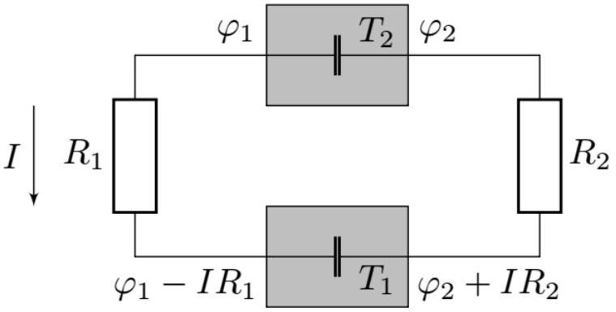

A1 ${ } ^ { 1.00 }$ Найдите величину тока в схеме, если коэффициенты $\alpha$ и $\beta$ заданы. Найдите мощности $P _ { 1 }$ и $P _ { 2 }$, выделяющиеся на обоих контактах.

Запишем контактную разность потенциалов:

$$
\left\{ \begin{array} { l }
\varphi _ { 1 } - \varphi _ { 2 } = \beta + \alpha T _ { 2 } \\
\left( \varphi _ { 1 } - I R _ { 1 } \right) - \left( \varphi _ { 2 } + I R _ { 2 } \right) = \beta + \alpha T _ { 1 }
\end{array} \right.
$$

Тогда ток $I = \alpha \frac { T _ { 2 } - T _ { 1 } } { R _ { 1 } + R _ { 2 } }$. Поэтому

$$
\begin{gathered}
P _ { 1 } = \left( \beta + \alpha T _ { 1 } \right) \alpha \frac { T _ { 2 } - T _ { 1 } } { R _ { 1 } + R _ { 2 } } \\
P _ { 2 } = - \left( \beta + \alpha T _ { 2 } \right) \alpha \frac { T _ { 2 } - T _ { 1 } } { R _ { 1 } + R _ { 2 } }
\end{gathered}
$$

A2 ${ } ^ { 1.00 }$ Из общих термодинамических соображений и условия укажите знак коэффициентов $\alpha$ и $\beta$.

В условии задачи написано «На контакте потенциал проводника 1 всегда выше, чем у проводника 2», что может быть только тогда, когда $\alpha \geq 0$ и $\beta > 0$

A3 ${ } ^ { 1.00 }$ Из общих термодинамических соображений и условия найдите минимально возможное значение коэффициента $\beta$.

Рассмотренную схему можно воспринимать как тепловую машину, полезная мощность которой - тепло $P _ { \text {пол } } = I ^ { 2 } \left( R _ { 1 } + R _ { 2 } \right)$ выделяющееся на нагрузке. При это мощность, подводимая к системе это $- P _ { 2 } = \left( \beta + \alpha T _ { 2 } \right) I$. При этому КПД $\eta$ должно быть не больше КПД машины Карно:

$$
\eta = \frac { P _ { \text {пол } } } { P _ { 1 } } = \frac { \alpha \left( T _ { 2 } - T _ { 1 } \right) } { \beta + \alpha T _ { 2 } } \leq \frac { T _ { 2 } - T _ { 1 } } { T _ { 2 } } ,
$$

поэтому $\beta / \alpha \geq 0$. Поэтому минимальное значение $\beta _ { \min } = 0$.

A4 ${ } ^ { 0.50 }$ Пометьте в листе ответов плюсом контакты с прямым эффектом Пельтье и минусом с обратным, а также укажите стрелкой направление тока в цепи.

| Контакт \#1 | + | При $T _ { 2 } > T _ { 1 }$ получается, что $P _ { 1 } > 0$, значит эффект Пельтье прямой |
| :--- | :--- | :--- |
| Контакт \#2 | - | При $T _ { 2 } > T _ { 1 }$ получается, что $P _ { 2 } < 0$, значит эффект Пельтье обратный |
| Направление тока | Против часовой | При $T _ { 2 } > T _ { 1 }$ получается, что $I > 0$ |

В $1 ^ { 1.50 }$ Найдите температуры $T _ { 1 }$ и $T _ { 2 }$ первого и второго сосудов в момент, когда в системе остановится ток.

В системе остановится ток тогда, когда разность температура станет нулевой. Обозначим теплоемкость $m$ воды за $C$. Запишем уравнения на температуру сосудов:

$$
\left\{ \begin{array} { l }
C \dot { T } _ { 1 } = P _ { 1 } = \alpha ^ { 2 } T _ { 1 } \frac { T _ { 2 } - T _ { 1 } } { R _ { 1 } + R _ { 2 } } \\
- C \dot { T } _ { 2 } = P _ { 2 } = - \alpha ^ { 2 } T _ { 2 } \frac { T _ { 2 } - T _ { 1 } } { R _ { 1 } + R _ { 2 } }
\end{array} . \right.
$$

Делением первого уравнения на $T _ { 1 }$ а второго на $T _ { 2 }$ получаем

$$
\frac { \dot { T } _ { 1 } } { T _ { 1 } } + \frac { \dot { T } _ { 2 } } { T _ { 2 } } = 0 \Rightarrow \ln \frac { T _ { \mathrm { K } } } { T _ { 1,0 } } + \ln \frac { T _ { \mathrm { K } } } { T _ { 2,0 } } = 0 \Rightarrow T _ { \mathrm { K } } = \sqrt { T _ { 1,0 } \cdot T _ { 2,0 } } = 46 ^ { \circ } \mathrm { C }
$$

В2 ${ } ^ { 1.00 }$ Найдите тепло $Q _ { 1 }$ и $Q _ { 2 }$, выделившееся на резисторах

Через резисторы течет одинаковый ток, поэтому $Q _ { 1 } / Q _ { 2 } = R _ { 1 } / R _ { 2 }$. При этом полное тепло $Q = Q _ { 2 } \left( 1 + R _ { 1 } / R _ { 2 } \right)$, которое выделилось на резисторах можно найти из ЗСЭ для всей системы:

$$
\begin{gathered}
Q + 2 C T _ { \mathrm { K } } = C T _ { 1,0 } + C T _ { 2,0 } \Rightarrow Q = C \left( T _ { 2,0 } + T _ { 1,0 } - 2 \sqrt { T _ { 1,0 } T _ { 2,0 } } \right) = C \left( \sqrt { T _ { 2,0 } } - \sqrt { T _ { 1,0 } } \right) ^ { 2 } \\
Q _ { 1 } = c m \left( \sqrt { T _ { 2,0 } } - \sqrt { T _ { 1,0 } } \right) ^ { 2 } \frac { R _ { 1 } } { R _ { 1 } + R _ { 2 } } \quad Q _ { 2 } = c m \left( \sqrt { T _ { 2,0 } } - \sqrt { T _ { 1,0 } } \right) ^ { 2 } \frac { R _ { 2 } } { R _ { 1 } + R _ { 2 } }
\end{gathered}
$$

С1 ${ } ^ { 0.50 }$ Найдите максимально выдаваемое напряжение такой батареи $U _ { 0 }$, если $\alpha = 1000 \mathrm { mB } /$ К.

Напряжение батареи $U _ { 0 } = \left( R _ { 1 } + R _ { 2 } \right) I = \alpha \left( T _ { 2 } - T _ { 1 } \right) = 196$ В

С2 ${ } ^ { 2.50 }$ Считая, что основные теплопотери происходят в проводе между двумя резервуарами (левом), и пренебрегая потерями в проводах, ведущих на нагрузку, а также стенках резервуара, найдите такое значение тока $I _ { 0 }$, при котором отношение полезной работы к теплу, получаемому азотом, максимально. Найдите значение этого максимального коэффициента. Теплопроводность $\chi$ и удельное сопротивление $\rho$, а также сечение $S$ и длину $l$ левого провода считайте заданными. Провод, находящийся между резервуарами, проходит в основном снаружи. Считайте, что $\frac { \alpha ^ { 2 } \Delta T } { \rho \chi } \gg 1$.

Полезная мощность в равна $P _ { п } = I ^ { 2 } R$. При этом мощность, которую получает азот:

$$
P _ { \mathrm { H } } = \alpha T _ { 1 } I + \chi \frac { \Delta T S } { l } .
$$

Значит их отношение $\gamma$ :

$$
\gamma = \frac { I ^ { 2 } R } { \alpha T _ { 1 } I + \chi \frac { \Delta T S } { l } } , \quad \Rightarrow \quad \gamma ^ { \prime } = \frac { 2 I R \left( \alpha T _ { 1 } I + \chi \frac { \Delta T S } { l } \right) - \alpha T _ { 1 } I ^ { 2 } R } { \cdots } > 0
$$
