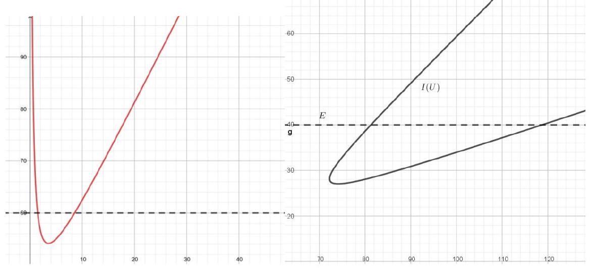
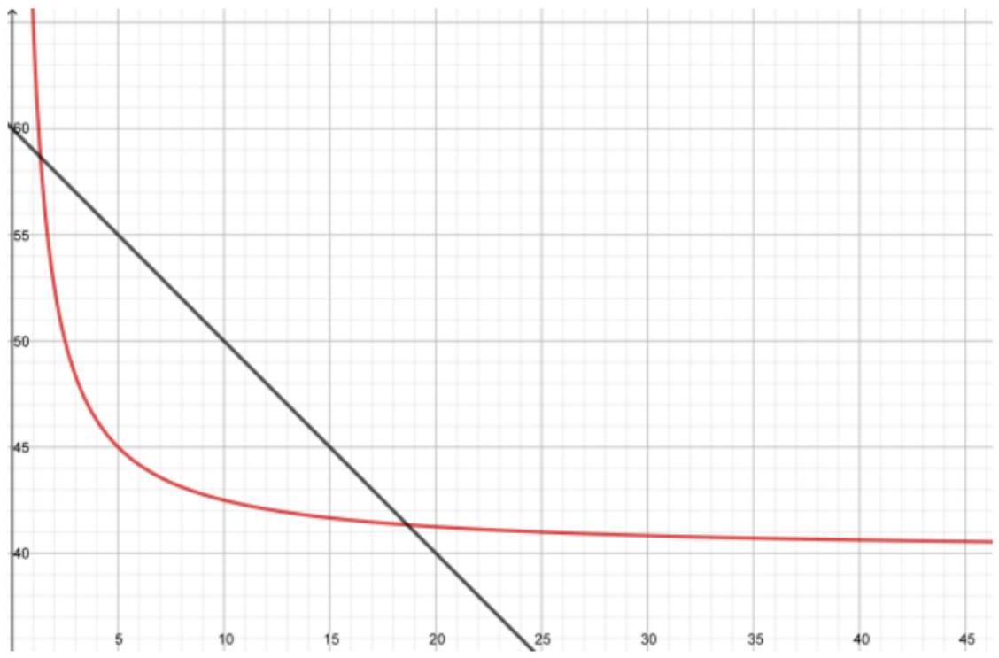
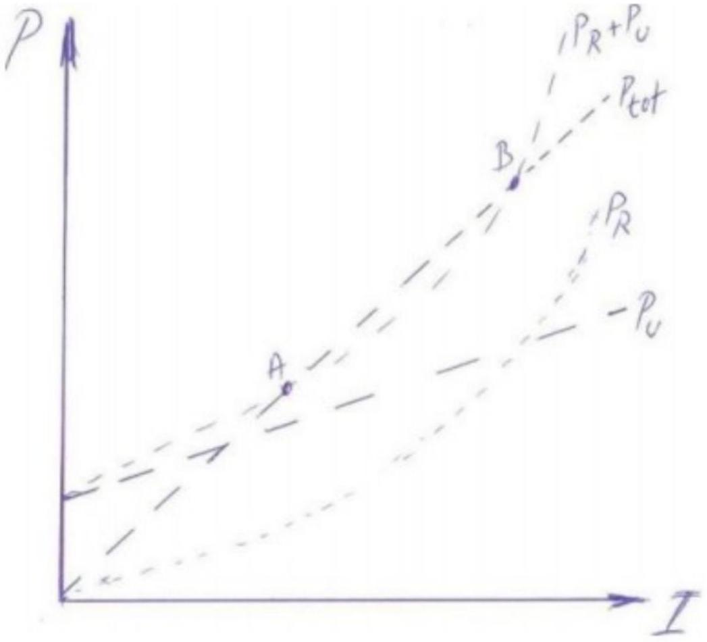

Магнитное поле в плазменном шнуре на расстоянии $r$ от центра (из т. о циркуляции):

$$
B = \mu _ { 0 } \frac { j \pi r ^ { 2 } } { 2 \pi r } = \frac { \mu _ { 0 } j r } { 2 }
$$

Выделим цилиндрический слой длиной $l$, радиусом r и толщиной $\mathrm { d } r$, в котором находится $n ( r ) \cdot 2 \pi r \cdot l \cdot \mathrm {~d} r$ электронов, движущихся со скоростью $v ( r )$; плотность тока $j = e n v$. Условие механического равновесия для него запишется как:

$$
0 = F _ { л } - \mathrm { d } p \cdot 2 \pi r d
$$

$$
\mathrm { d } p \cdot 2 \pi r l = - 2 \pi e n v B r l \mathrm {~d} r = - \pi \mu _ { 0 } j ^ { 2 } r ^ { 2 } l \mathrm {~d} r
$$

Интегрируя, получим зависимость:

$$
p ( r ) = p ( 0 ) - \mu _ { 0 } j ^ { 2 } r ^ { 2 } / 4
$$

Так как нам дана температура и концентрация электронного газа на оси, имеем $p ( 0 ) = n k T$.

Ответ:

$$
p ( r ) = n k T - \mu _ { 0 } j ^ { 2 } r ^ { 2 } / 4
$$

A2 ${ } ^ { 0.50 }$ Считая, что на границе шнура давление пренебрежимо мало, получите зависимость радиуса шнура от напряжения, пользуясь соотношением $j = \lambda E$ , где $E$ - напряженность поля, $\lambda$ - проводимость среды (считайте её постоянной). Соотношение выше - это закон Ома, записанный в дифференциальной форме

Считая, что на границе давление равно нулю (пренебрежимо мало), получаем зависимость радиуса шнура от плотности тока:

$$
\mu _ { 0 } j ^ { 2 } R ^ { 2 } = 4 n k T , \quad R = \sqrt { \frac { 4 n k T } { \mu _ { 0 } j ^ { 2 } } }
$$

С другой стороны,

$$
E = \frac { U - U _ { 0 } } { d } = \frac { j } { \lambda }
$$

Отсюда:

Ответ:

$$
R = \frac { d } { \lambda \left( U - U _ { 0 } \right) } \sqrt { \frac { 4 n k T } { \mu _ { 0 } } }
$$

A3 ${ } ^ { 0.50 }$ Покажите, что из результатов пунктов А1 и А2 следует схожий вид зависимости. Найдите значения $a$ и $b$ через заданные параметры дуги и физические постоянные.

Полный ток в дуге:

$$
I = j \pi R ^ { 2 } = \frac { 4 \pi d n k T } { \lambda \mu _ { 0 } \left( U - U _ { 0 } \right) }
$$

Отсюда:

$$
U = U _ { 0 } + \frac { 4 \pi d n k T } { \lambda \mu _ { 0 } I } ,
$$

что совпадает с тем, что нужно

В1 ${ } ^ { 1.00 }$ Постройте вольтамперные характеристики для всей цепи (кроме источника) для каждого из случаев. Укажите на графике точки, в которых может возникнуть разряд.

Для последовательного соединения имеем BAX

$$
U = R I + a + \frac { b } { I }
$$

для параллельного ВАХ неоднозначный и даётся формулой

$$
U = I r + \frac { a + I R \pm \sqrt { ( a - I R ) ^ { 2 } - 4 b R } } { 2 }
$$

Ответ:

Точки, в которых может возникнуть разряд - пересечения ВАХ с горизонтальной прямой $U = \varepsilon$.

В2 ${ } ^ { 2.00 }$ С помощью схем, графиков, формул проанализируйте возможности получения устойчивого разряда. Укажите все точки, где получается устойчивый и неустойчивый разряд.

Для анализа устойчивости удобно искать пересечения ВАХ дуги с нагрузочной прямой $U = \varepsilon - R I$ :

Обозначим точки пересечения за А и В. Если в точке А ток случайно увеличится на какую-то величину $\Delta I$, то напряжение на концах дуги $\varepsilon - r I$ уменьшится; однако, для горения дуги оно должно быть еще меньше, так как ВАХ лежит ниже нагрузочной прямой; таким образом, напряжение продолжит уменьшаться, а ток - расти. В точке В же при увеличении тока подаваемое напряжение уменьшается, а должно увеличиться; чтобы обеспечить это, ток уменьшается.
В общем случае условие устойчивости можно представить так: суммарное дифференциальное сопротивление цепи $\frac { \mathrm { d } U } { \mathrm {~d} I }$ больше нуля.

B3 ${ } ^ { 0.50 }$ Найдите значения тока в разряде (т.н. рабочие точки) через $\mathcal { E } , R , r , a , b$.

Просто решаем квадратное уравнение:

$$
\varepsilon = ( R + r ) I + a + \frac { b } { I }
$$

Получаем два значения тока:

$$
I _ { \pm } = \frac { \varepsilon - a \pm \sqrt { ( \varepsilon - a ) ^ { 2 } - 4 b ( R + r ) } } { 2 ( R + r ) }
$$

При отрицательном дискриминанте пересечений у нагрузочной прямой и ВАХ дуги нет.

Ответ:

$$
I _ { \pm } = \frac { \varepsilon - a \pm \sqrt { ( \varepsilon - a ) ^ { 2 } - 4 b ( R + r ) } } { 2 ( R + r ) }
$$

B4 ${ } ^ { 1.50 }$ Найдите условие устойчивости тока разряда. Ответ выразите через $R , r$ и $b$.

Условие положительности дифференциального сопротивления выглядит как

$$
\frac { \mathrm { d } } { \mathrm {~d} I } \left( a + \frac { b } { I } + I ( R + r ) \right) = R + r - \frac { b } { I ^ { 2 } } > 0
$$

Отсюда:

$$
I ^ { 2 } > \frac { b } { R + r }
$$

Заметим, что положительный корень уравнения из предыдущего пункта этому условию действительно удовлетворяет.

Ответ:

$$
I ^ { 2 } > \frac { b } { R + r }
$$

В5 ${ } ^ { 0.50 }$ Найдите максимальное значение сопротивления $R$, для которого можно получить стационарный разряд для заданного источника ( $\mathcal { E } , r$ ).

Устойчивый корень исчезает, когда корни $I _ { \pm }$совпадают, т.е.

$$
R = \frac { ( \varepsilon - a ) ^ { 2 } } { 4 b } - r
$$

Ответ:

$$
R = \frac { ( \varepsilon - a ) ^ { 2 } } { 4 b } - r
$$

В6 ${ } ^ { 1.00 }$ Нарисуйте на одном графике зависимость выделяемой мощности от силы тока $P = f ( I )$ для каждого элемента цепи и для всей цепи в целом. Отметьте на графике точки, в которых возможно горение дуги.

Мощность, выделяемая на активном сопротивлении

$$
P _ { 1 } = I ^ { 2 } ( R + r )
$$

а на дуге

$$
P _ { 2 } = U I = a + b I
$$

Все мощности, включая суммарную $( \varepsilon I )$ представлены на рисунке. Горение возможно в точках A и B

Ответ:

C1 ${ } ^ { 1.00 }$ Определите вид зависимости коэффициентов $a$ и $b$ от длины дуги и численные значения характерных параметров.

Снимая зависимость $U ( l )$ при $I =$ const для разных токов, понимаем, что коэффициенты - линейная функция длины разряда. Вычитая прямые $U ( l )$ для разных токов, мы можем найти, что $b = c + d L$ и оба коэффициента $c$ и $d$; затем можно найти $a$ и убедиться, что оно от $L$ не зависит.
Численные ответы:

$$
b = 16.7 \mathrm { BT } + 10 \frac { \mathrm { BT } } { \mathrm { MM } } L ,
$$

$$
a = 39.3 \mathrm {~B}
$$

Ответ:

$$
b = 16.7 \mathrm { BT } + 10 \frac { \mathrm { BT } } { \mathrm { MM } } L
$$

$$
a = 39.3 \mathrm {~B}
$$

C2 ${ } ^ { 0.50 }$
С дугой, исследуемой в пункте С1, проводится следующий эксперимент. После получения устойчивого разряда длина дугового промежутка начинает увеличиваться, при этом ЭДС в цепи изменяется так, чтобы поддерживать ток через дугу постоянным и равным $I = 5 \mathrm {~A}$. Полное омическое сопротивление цепи (без дуги) равно $R = 2$ Ом. Определите:

1. при какой длине дуги разряд станет нестационарным;
2. какова при этом будет ЭДС источника.

В предыдущих пунктах было получено, что разряд стабилен при условии

$$
I ^ { 2 } > \frac { c + d L } { R }
$$

отсюда следует, что он перестанет быть стабильным при

$$
L = \frac { I ^ { 2 } R - c } { d } \approx 3.3 \mathrm { mM }
$$

Из закона Кирхгофа при этом полное напряжение в цепи

$$
\varepsilon = a + I R + \frac { c + d L } { I } = a + 2 I R \approx 59 \mathrm {~B}
$$

Ответ:

$$
\begin{gathered}
L = \frac { I ^ { 2 } R - c } { d } \approx 3.3 \mathrm { MM } \\
\varepsilon = a + I R + \frac { c + d L } { I } = a + 2 I R \approx 59 \mathrm {~B}
\end{gathered}
$$
