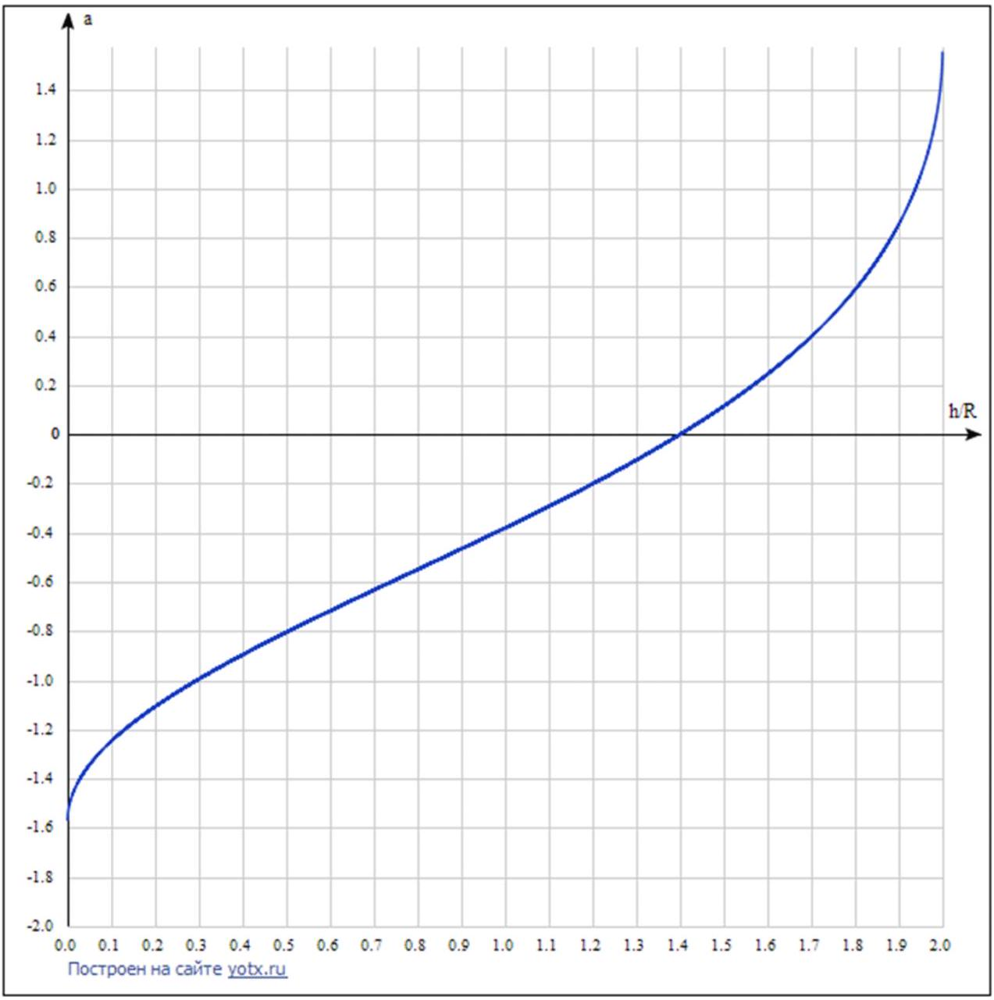
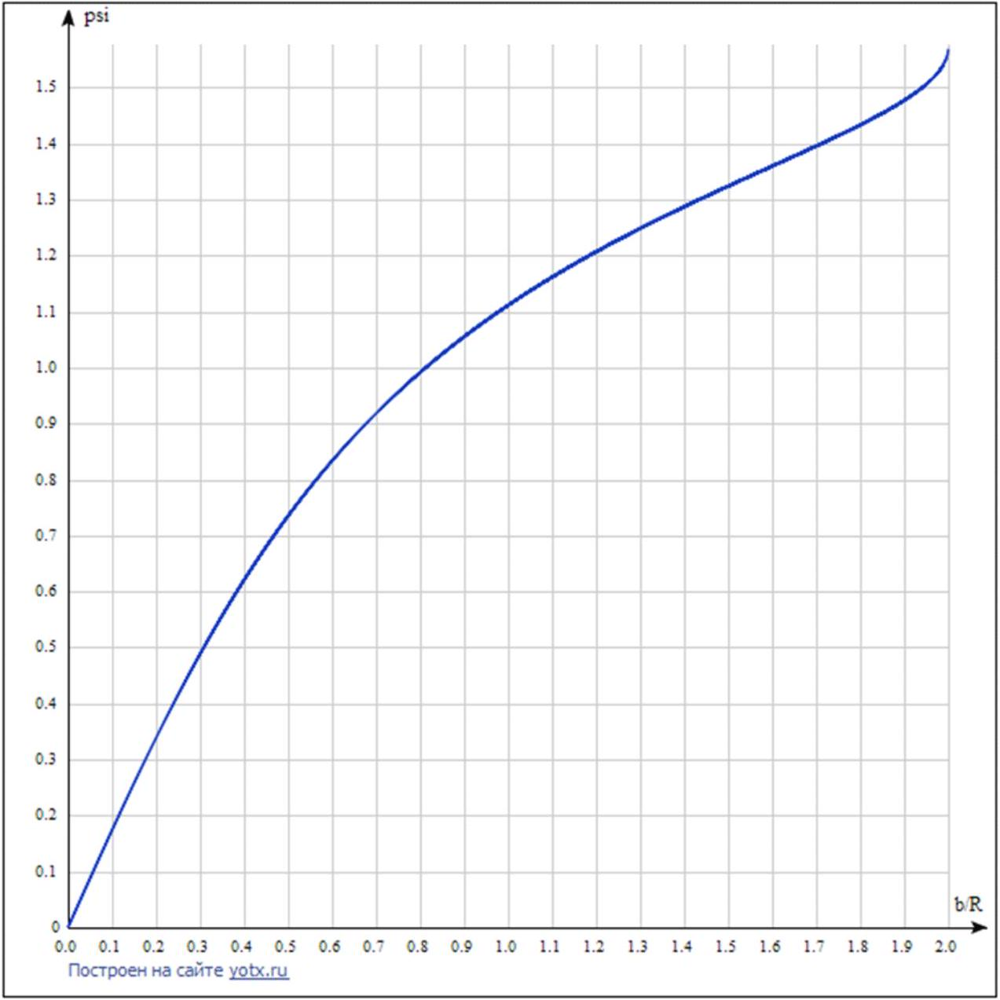

Сообщенный шарику горизонтальный импульс равен $\cos \alpha \int F ( t ) d t = m v$, где $F$ - сила удара. С другой стороны, сообщённый момент импульса относительно центра масс

$$
\frac { 2 } { 5 } m R ^ { 2 } \omega = \left( ( h - R ) \cos \alpha - \sqrt { R ^ { 2 } - ( h - R ) ^ { 2 } } \sin \alpha \right) \int F ( t ) d t
$$

В случае отсутствия проскальзывания $v = \omega R$, так что имеем соотношение

$$
\frac { 2 } { 5 } = \frac { h - R } { R } - \sqrt { 1 - \frac { ( h - R ) ^ { 2 } } { R ^ { 2 } } } \operatorname { tg } \alpha
$$

Ответ:

$$
\frac { 2 } { 5 } = \frac { h - R } { R } - \sqrt { 1 - \frac { ( h - R ) ^ { 2 } } { R ^ { 2 } } } \operatorname { tg } \alpha
$$

A2 ${ } ^ { 0.50 }$
Нарисуйте (качественно) график зависимости $\alpha ( h / R )$ с указанием точек, соответствующих $\alpha = 0$ и $h = R$.

Ответ:

$$
\begin{aligned}
& \alpha = 0 \Longrightarrow h = \frac { 7 R } { 5 } \\
& h = R \Longrightarrow \alpha = - \operatorname { arctg } \frac { 2 } { 5 }
\end{aligned}
$$

Ответ:

B1 ${ } ^ { 1.00 }$
Найдите скорости шаров после разлёта (модули и направления).

Сила, действующая между шарами, направлена в их точке касания по линии, соединяющей центры в момент касания, то есть под углом $\phi = \arcsin \frac { b } { 2 R }$ к направлению движения. Отсюда следует, что сообщенная второму шару скорость также направлена вдоль этой прямой. Тогда ЗСИ вместе с ЗСЭ дают для скоростей шариков:
биток:

$$
\vec { v } _ { c } = \binom { - v \sin \phi \cos \phi } { v \sin ^ { 2 } \phi } ,
$$

второй шар:

$$
\vec { v } _ { o } = \binom { v \sin \phi \cos \phi } { v \cos ^ { 2 } \phi } .
$$

T.e. $\left| \vec { v } _ { c } \right| = v \sin \phi , \left| \vec { v } _ { o } \right| = v \cos \phi$

Ответ:

$$
\left| \vec { v } _ { c } \right| = v \frac { b } { 2 R } , \left| \vec { v } _ { o } \right| = v \sqrt { 1 - \frac { b ^ { 2 } } { 4 R ^ { 2 } } }
$$

В2 ${ } ^ { 0.50 }$ Какой угол образуют скорости шаров после разлёта в такой модели?

Скорость 2 шара направлена под углом $\phi$ к исходному направлению движения, а битка - под углом $\pi / 2 - \phi$. Итого угол между скоростями шаров равен $\pi / 2$.

Ответ:

$$
\pi / 2
$$

В3 ${ } ^ { 1.50 }$ Рассмотрим вспомогательную задачу: шар на горизонтальном столе в начальный момент имеет поступательную скорость $\vec { v } = \binom { v _ { x } } { v _ { y } }$ и угловую скорость $\vec { \omega } = \binom { \omega _ { x } } { \omega _ { y } }$ (вектора $\vec { v }$ и $\vec { \omega }$ лежат в плоскости стола). Имеется трение о поверхность, которое прекращается, как только исчезает проскальзывание. Какова будет установившаяся скорость шара (модуль и направление)?

Момент импульса относительно точки касания в начальный момент равен

$$
\vec { L } = \vec { L } _ { \text {оцм } } + \vec { L } _ { \text {цм } } = \frac { 2 } { 5 } m R ^ { 2 } \binom { \omega _ { x } } { \omega _ { y } } + m R \binom { - v _ { y } } { v _ { x } }
$$

После установления движения он равен

$$
\vec { L } = \frac { 7 } { 5 } m R \binom { - u _ { y } } { u _ { x } }
$$

Внешних моментов относительно точки касания не действует и она движется параллельно центру масс, так что момент импульса относительно нее сохраняется. Итого мы находим установившуюся скорость

$$
\vec { u } = \binom { u _ { x } } { u _ { y } } = \binom { \frac { 5 } { 7 } v _ { x } + \frac { 2 } { 7 } R \omega _ { y } } { \frac { 5 } { 7 } v _ { y } - \frac { 2 } { 7 } R \omega _ { x } }
$$

Ответ:

$$
\vec { u } = \binom { \frac { 5 } { 7 } v _ { x } + \frac { 2 } { 7 } R \omega _ { y } } { \frac { 5 } { 7 } v _ { y } - \frac { 2 } { 7 } R \omega _ { x } }
$$

В4 ${ } ^ { 0.50 }$ Вернемся к столкновению двух шаров; пусть до удара «биток » двигался без проскальзывания. Под какими углами к начальной скорости теперь направлены установившиеся скорости шаров?

Известны скорости шаров сразу после удара:
биток:

$$
\vec { v } _ { c } = \binom { - v \sin \phi \cos \phi } { v \sin ^ { 2 } \phi } , \vec { \omega } _ { c } = \binom { - v / R } { 0 }
$$

второй шар:

$$
\vec { v } _ { o } = \binom { v \sin \phi \cos \phi } { v \cos ^ { 2 } \phi } , \vec { \omega } _ { o } = \overrightarrow { 0 }
$$

Тогда установившиеся скорости:
биток:

$$
\vec { u } _ { c } = \binom { - \frac { 5 } { 7 } v \sin \phi \cos \phi } { \frac { 5 } { 7 } v \sin ^ { 2 } \phi + \frac { 2 } { 7 } v }
$$

второй шар:

$$
\vec { u } _ { o } = \frac { 5 } { 7 } \binom { v \sin \phi \cos \phi } { v \cos ^ { 2 } \phi }
$$

Ответ:

$$
\begin{aligned}
& \operatorname { tg } \phi _ { c } = \frac { \sin \phi \cos \phi } { \sin ^ { 2 } \phi + \frac { 2 } { 5 } } \\
& \sin \phi _ { o } = \sin \phi
\end{aligned}
$$

где $\sin \phi = b / 2 R$

В5 ${ } ^ { 0.50 }$ Определите угол $\varphi$ между установившимися скоростями шаров как функцию прицельного параметра $\frac { b } { R }$.

В терминах прицельного параметра $x = b / R$ угол разлета $\varphi$

$$
\varphi = \arcsin \left( \frac { x } { 2 } \right) + \operatorname { arctg } \left( \frac { \frac { x } { 2 } \cdot \sqrt { 1 - \frac { x ^ { 2 } } { 4 } } } { \frac { 2 } { 5 } + \frac { x ^ { 2 } } { 4 } } \right)
$$

Ответ:

$$
\varphi = \arcsin \left( \frac { x } { 2 } \right) + \operatorname { arctg } \left( \frac { \frac { x } { 2 } \cdot \sqrt { 1 - \frac { x ^ { 2 } } { 4 } } } { \frac { 2 } { 5 } + \frac { x ^ { 2 } } { 4 } } \right) , x = \frac { b } { R }
$$

В6 ${ } ^ { 0.50 }$ Нарисуйте качественный график зависимости $\varphi \left( \frac { b } { R } \right)$.

Ответ:

Коэффициент трения скольжения узнаем по графику зависимости скорости 2 шара от времени (для 1 шара сила трения в общем случае не коллинеарна скорости), приближая участок графика со скольжением прямой. Получаем ускорение 2 шара $a = \mu g \approx ( 2.1 \pm 0.2 )$ м/ $\mathrm { c } ^ { 2 }$; $\mu \approx 0.21 \pm 0.02$

Ответ:

$$
\mu \approx 0.023 \pm 0.002
$$

C2 ${ } ^ { 0.50 }$ Оцените относительные потери энергии при столкновении шаров.

Сразу после столкновения имеем скорости шаров $v _ { c } \approx 0.90 \mathrm {~m} / \mathrm { c } , v _ { o } \approx 0.42 \mathrm {~m} / \mathrm { c }$. Разность между энергией до и после $\Delta E \approx 0.04 ( \mathrm {~m} / \mathrm { c } ) ^ { 2 } \frac { m } { 2 }$; начальная энергия (вращательная + поступательная) $E _ { 0 } = \frac { 7 } { 5 } \frac { m } { 2 } ( \mathrm {~m} / \mathrm { c } ) ^ { 2 }$, так что потери энергии достаточно малы и составляют $\approx 5 \%$.

Ответ:

С3 ${ } ^ { 1.00 }$ Определите относительный прицельный параметр $\frac { b } { R }$ для столкновения, используя данные для обоих шаров. Оцените погрешность полученного значения.

Для скоростей сразу после столкновения (и после установления) имеем

$$
v _ { c } = v \sin \phi , v _ { o } = v \cos \phi , u _ { o } = \frac { 5 } { 7 } v \cos \phi , u _ { c } = \frac { 5 } { 7 } v \sqrt { \frac { 4 } { 25 } + \frac { 9 } { 5 } \sin ^ { 2 } \phi }
$$

Используя данные из графика (в м/с)

$$
v = 1.00 , v _ { c } = 0.42 , v _ { o } = 0.90 , u _ { o } = 0.63 , u _ { c } = 0.48
$$

находим соответственно 4 значения для $\sin \phi = b / 2 R$ и оцениваем погрешность

$$
\sin \phi = 0.44 ; 0.42 ; 0.47 ; 0.40
$$

Итого $b / R = ( 0.86 \pm 0.08 )$

Ответ:

$$
b / R = ( 0.86 \pm 0.08 )
$$

D1 ${ } ^ { 1.50 }$ Рассмотрим центральный удар ( $b = 0$ ) двух одинаковых шаров массы $M$. Первый шар налетает на второй со скоростью $V$. Считая скорость налетающего шара много меньшей скорости звука в материале шара, найдите время столкновения $\tau$ и максимальную деформацию $h _ { m }$.

Указание: считайте известным значение интеграла

$$
\int _ { 0 } ^ { 1 } \frac { d x } { \sqrt { 1 - x ^ { 5 / 2 } } } \approx 1.5
$$

В задаче о столкновении шаров, поскольку скорость шаров много меньше скорости звука, можно считать, что в любой момент картина деформаций установилась и сила зависит от деформации как в статическом случае.
Зависимость потенциальной энергии от деформации легко получить интегрированием силы

$$
U = \frac { 2 } { 5 } E R ^ { \frac { 1 } { 2 } } h ^ { \frac { 5 } { 2 } }
$$

В системе центра масс ЗСЭ имеет вид ( $\mu = M / 2$ - приведённая масса)

$$
\frac { M v ^ { 2 } } { 2 } + \frac { 2 } { 5 } E R ^ { \frac { 1 } { 2 } } h ^ { \frac { 5 } { 2 } } = \frac { M V ^ { 2 } } { 2 }
$$

Где $v$ - относительная скорость шаров, она же $\dot { h }$. Максимальная деформация

$$
h _ { m } = \left( \frac { 5 \mu V ^ { 2 } } { 4 E R ^ { \frac { 1 } { 2 } } } \right) ^ { \frac { 2 } { 5 } }
$$

Время деформации, т.е. время, в течение которого h меняется от 0 до $\mathrm { h } \_ \mathrm { m }$ и обратно, можно найти как

$$
\tau = 2 \int _ { 0 } ^ { h _ { m } } \frac { d h } { v } = \left( x = \frac { h } { h _ { m } } \right) = \frac { 2 } { h _ { m } ^ { \frac { 1 } { 4 } } } \left( \frac { 5 \mu } { 4 E R ^ { \frac { 1 } { 2 } } } \right) ^ { \frac { 1 } { 2 } } \int _ { 0 } ^ { 1 } \frac { d x } { \sqrt { 1 - x ^ { \frac { 5 } { 2 } } } } \approx 3 V ^ { - \frac { 1 } { 5 } } \left( \frac { 5 M } { 8 E R ^ { \frac { 1 } { 2 } } } \right) ^ { \frac { 2 } { 5 } }
$$

Ответ:

$$
h _ { m } = \left( \frac { 5 M V ^ { 2 } } { 8 E R ^ { \frac { 1 } { 2 } } } \right) ^ { \frac { 2 } { 5 } } , \tau = 3 V ^ { - \frac { 1 } { 5 } } \left( \frac { 5 M } { 8 E R ^ { \frac { 1 } { 2 } } } \right) ^ { \frac { 2 } { 5 } }
$$

D2 ${ } ^ { 0.50 }$
Оцените модуль Юнга материала шара, исходя из экспериментальных значений: $\tau = 310$ мкс, $V = 7.0$ м/с, $M = 280$ г, $R = 6.8$ см.

Ответ:

$$
E = \left( \frac { \tau V ^ { \frac { 1 } { 5 } } } { 3 } \right) ^ { - \frac { 5 } { 2 } } \cdot \frac { 5 m } { 8 R ^ { \frac { 1 } { 2 } } } \approx 2.3 \text { ГПа }
$$
