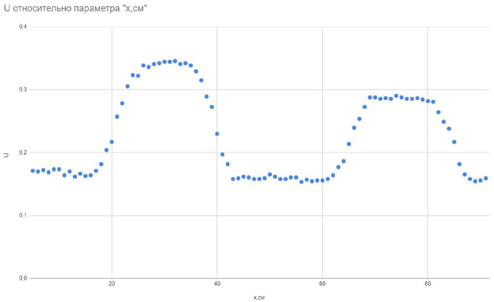

00 ?? Перечислите все предметы оборудования и вашего рабочего места, к которым магнитится выданный вам магнит.
$01 ^ { - 1.00 }$ Запрещено наносить какие-либо надписи напрямую на алюминиевые или пластиковые трубы. Если вам необходимо нанести какие-то отметки, приклейте малярный скотч вдоль трубы или сделайте наклейки в нужных вам местах. Ручкой и карандашом можно писать только на малярном скотче. Дежурный по аудитории имеет право в любой момент проверить наличие надписей на трубах. В случае обнаружения надписей, дежурный немедленно ставит штрафной балл в лист ответов. Утверждение, что вы сотрете надписи позже, не принимается. Штрафной балл можно получить до 20 раз.

A1 ${ } ^ { ? ? }$ Измерьте расстояния от верхнего края трубы до середины первой катушки $L _ { 1 }$ и от середины первой катушки до середины второй $L _ { 2 }$ и занесите их в лист ответов.

A2 ${ } ^ { 0.50 }$ Найдите время $t$, за которое магнит пролетает между центрами двух катушек. Выразите $t$ через $L _ { 1 } , L _ { 2 } , \mu _ { 1 } , g$, $\alpha$, где $\mu _ { 1 }$ - коэффициент трения скольжения между трубкой и магнитом.

Внутри пластиковой трубы на магнит будут действовать 3 силы: сила тяжести, нормальная реакция опоры и сила трения. Все они постоянные, а значит ускорение магнита будет постоянным $a = ( \sin \alpha - \mu \cos \alpha ) g$, а тогда несложно показать, что:

$$
t = \sqrt { \frac { 2 } { ( \sin \alpha - \mu \cos \alpha ) g } } \left( \sqrt { L _ { 1 } + L _ { 2 } } - \sqrt { L _ { 1 } } \right)
$$

A3 ${ } ^ { \mathbf { 0 . 5 0 } }$ На листе ответов качественно изобразите картину сигнала, регистрируемого осциллографом. Укажите, как вы измеряете время $t$ по осциллограмме.

При прохождении магнита через катушку в последней будет возбуждаться $\varepsilon _ { \text {ind } }$. По положению пиков мы сможем определить, когда магнит проходит через катушку.

A4 ${ } ^ { 1.40 }$ Снимите зависимость времени $t$ от угла наклона $\alpha$ пластиковой трубы для 7 различных углов. Диапазон углов должен быть в интервале $( \pi / 4 ; \pi / 2 )$.

A5 ${ } ^ { 0.20 }$ Предложите линеаризацию зависимости, полученной в пункте А2.

Преобразуя полученную выше тождество $t$ от $\alpha$ выберем такие координаты, что бы получить линейную зависимость, по углу которой возможно определить $g$. $\frac { 1 } { t ^ { 2 } \cos \alpha }$ oт $\operatorname { tg } \alpha$ :

$$
\frac { 1 } { t ^ { 2 } \cos \alpha } = \operatorname { tg } \alpha \frac { g } { 2 \left( \sqrt { L _ { 1 } + L _ { 2 } } - \sqrt { L _ { 1 } } \right) ^ { 2 } } - \frac { \mu g } { 2 \left( \sqrt { L _ { 1 } + L _ { 2 } } - \sqrt { L _ { 1 } } \right) ^ { 2 } }
$$

A6 ${ } ^ { \mathbf { 0 . 5 0 } }$ Постройте график в координатах, соответствующих линеаризации в пункте A5.

A7 ${ } ^ { 0.40 }$ Используя график, определите $g$. Оцените погрешность.

$$
g = 9.8 \frac { \mathrm {~m} } { \mathrm { c } }
$$

В1 ${ } ^ { 2.00 }$ Измерьте радиус магнита $R$ и его высоту $H$. Определите дипольный момент магнита $M$. С помощью схем, диаграмм, графиков поясните, как вы это делаете.

Поле магнитного диполя:

$$
\boldsymbol { B } = \frac { \mu _ { 0 } } { 4 \pi } \left( \frac { 3 ( \boldsymbol { m } , \boldsymbol { r } ) } { r ^ { 5 } } - \frac { \boldsymbol { m } } { r ^ { 3 } } \right)
$$

Если мы будем считать поле на оси магнита, то формула упростится:

$$
B _ { x } = \frac { \mu _ { 0 } } { 2 \pi } \cdot \frac { m } { r ^ { 3 } }
$$

Измерим показания датчика Холла в зависимости от расстояния до центра магнита и построим график в осях $U$ от $\frac { 1 } { r ^ { 3 } }$ или аналогичных. После этого по угловому наклону $( \alpha )$ определим $m$ :

$$
m = \frac { 2 \pi \alpha } { \chi \mu _ { 0 } } = 3.85 \mathrm {~A} \cdot \mathrm { M } ^ { 2 }
$$

С1 ${ } ^ { 0.50 }$ Найдите зависимость скорости магнита $v _ { \text {магн } }$ от времени через $t , g , k , \mu _ { 2 } , \alpha$, где $\mu _ { 2 }$ - коэффициент трения скольжения между алюминиевой трубкой и магнитом.

Запишем второй закон Ньютона относительно оси, по которой движется магнит:

$$
m a = m g \sin \alpha - \mu _ { 2 } m g \cos \alpha - k v
$$

Это дифференциальное уравнение первого порядка относительно скорости. Произведём замену переменной $v ^ { \prime } = v + \frac { m g } { k } \left( - \sin \alpha + \mu _ { 2 } \cos \alpha \right)$, тогда уравнение принимает вид:

$$
\dot { v } ^ { \prime } + \frac { k } { m } v ^ { \prime } = 0
$$

Отсюда получаем решение:

$$
v _ { \text {магн } } = \left( 1 - e ^ { - \frac { k } { m } t } \right) \frac { m g } { k } ( \sin \alpha - \mu \cos \alpha )
$$

С2 ${ } ^ { 0.50 }$ Выразите установившуюся скорость $u$ через $g , k , \mu _ { 2 } , \alpha$.

Отбросив из предыдущего уравнения экспоненциально затухающую составляющую получим установившуюся скорость:

$$
u = \frac { m g } { k } ( \sin \alpha - \mu \cos \alpha )
$$

с3 ${ } ^ { 0.50 }$ Схематично изобразите экспериментальную установку, с помощью которой можно измерить установившуюся скорость на нескольких интервалах. Поясните с помощью диаграмм, графиков, осциллограмм, что и как вы измеряете, чтобы рассчитать установившуюся скорость.

Для этого пункта несколько видоизменим схему, изображённую ранее: будем использовать большее количество последовательно соединённых катушек. Магнит должен проехать некое расстояние прежде чем скорость установится, поэтому катушки стоит располагать на неком расстоянии от верхнего края трубки. Что бы упростить измерения и оценку того, установилась скорость или нет, стоит располагать катушки на равных расстояниях друг от друга.

C4 ${ } ^ { 0.50 }$ Каким образом вы проверяете, что на исследуемом участке скорость можно считать установившейся? Объясните с помощью диаграмм, графиков, осциллограмм.

Для того, что бы проверить установилась скорость или нет, нужно сравнить интервалы времени, за которые магнит пролетает через разные пары катушек. Если время изменяется незначительно, то можно считать скорость установившейся и приступать к измерениям.

С5 ${ } ^ { 1.00 }$ Снимите зависимость установившейся скорости движения магнита от угла наклона алюминиевой трубы для не менее 7 углов наклона. Для каждого угла наклона усредните установившуюся скорость по не менее трем интервалам. В таблицах указывайте первичные данные, снимаемые с приборов.

C6 ${ } ^ { 0.50 }$ Предложите линеаризацию зависимости, полученной в пункте C2, чтобы можно было определить коэффициент трения скольжения $\mu _ { 2 }$ и коэффициент в силе сопротивления $k$.

Преобразовав результат полученный в пункте С2 выберем линейную зависимость. К примеру можно построить график $\frac { v } { \cos \alpha }$ от $\operatorname { tg } \alpha : \frac { v } { \cos \alpha } = \operatorname { tg } \alpha \frac { m g } { k } - \mu \frac { m g } { k }$ ) или использовать напрямую $\Delta t$ (например $\frac { 1 } { \Delta t \cos \alpha }$ от $\operatorname { tg } \alpha : \frac { 1 } { \Delta t \cos \alpha } = \operatorname { tg } \alpha \frac { m g } { \Delta l k } - \mu \frac { m g } { \Delta l k }$ ).

C7 ${ } ^ { 0.50 }$ В соответствии с С6 постройте график зависимости для определения $\mu _ { 2 }$ и $k$.

С8 ${ } ^ { 0.50 }$ Используя график, определите $\mu _ { 2 }$ и $k$.

$$
\begin{aligned}
& k = 0.95 \frac { \mathrm { kr } } { \mathrm { c } } \\
& \mu _ { 2 } = 0.17
\end{aligned}
$$

с9 ${ } ^ { 0.50 }$ Определите удельную проводимость алюминия $\sigma$. Оцените погрешности.

$$
\sigma = 35 \frac { \mathrm { M } } { \mathrm { OM } _ { \mathrm { M } \cdot \mathrm { MM } } { } ^ { 2 } }
$$

D1 ${ } ^ { 4.00 }$ Для каждой трубы определите соответствующий коэффициент в силе сопротивления $k _ { i } ( i = 2,3,4,5 )$. Будьте внимательны, эффекты проявляющиеся здесь, очень тонкие. Следите за качеством снимаемых с установки данных и их оптимальной обработкой.

Будем измерять установившуюся скорость в зависимости от угла наклона для каждой из этих труб аналогично пункту C.

$$
\begin{aligned}
& k _ { 2 } = 0,59 \frac { \mathrm {~K} \Gamma } { \mathrm { c } } \\
& k _ { 3 } = 0,58 \frac { \mathrm {~K} } { \mathrm { c } } \\
& k _ { 4 } = 0,57 \frac { \mathrm {~K} \Gamma } { \mathrm { c } } \\
& k _ { 5 } = 0,56 \frac { \mathrm {~K} } { \mathrm { c } }
\end{aligned}
$$

D2 ${ } ^ { 1.00 }$ Измерьте ширину разреза $x$ и постройте график зависимости $k _ { i }$ от $x$.

Измерим ширину разъёма в разных частях трубы используя штангенциркуль.
Используя построенный график определим $\frac { d k } { d x }$ :

$$
\frac { d k } { d x } = 10 \frac { \text { КГ } } { \mathrm { M } \cdot c }
$$

D3 ${ } ^ { 0.50 }$ Определите параметры зависимости, полученной в пункте D2.

E1 ${ } ^ { 4.00 }$ Найдите положение и ширину разрезов. С помощью формул и картинок поясните, как вы это делаете и приведите расчеты.

Во время движения в трубе скорость магнита будет изменяться из-за того, что на разных участках трубы $k$ различен. Для того, что бы определить расположение разрезов и их $x$ необходимо измерить зависимость скорости от координаты.

В предыдущих пунктах мы определяли скорость по времени, за которое магнит пролетит между катушками, однако данный метод позволяет определить только среднюю скорость. Для того, что бы определить мгновенную скорость будем измерять высоту пиков.

$$
\Phi ( x ) = f ( x ) = > \varepsilon _ { i n d } = - \frac { d \Phi ( x ) } { d t } = - \frac { d \Phi ( x ) } { d x } \cdot v
$$

Коэффициент пропорциональности мы можем определить по измерению скорости обоими методами на одной из предыдущих алюминиевых трубок.
Координаты первого разреза:

$$
\begin{aligned}
& l _ { 1 } = 20 \mathrm {~cm} \\
& l _ { 2 } = 40 \mathrm {~cm}
\end{aligned}
$$

Координаты второго разреза:

$$
\begin{aligned}
& l _ { 1 } = 65 \mathrm {~cm} \\
& l _ { 2 } = 85 \mathrm {~cm}
\end{aligned}
$$

Ширина первого разреза:

$$
x _ { 1 } = 7 \text { мм }
$$

Ширина второго разреза:

$$
x _ { 2 } = 4 \mathrm { мM }
$$
