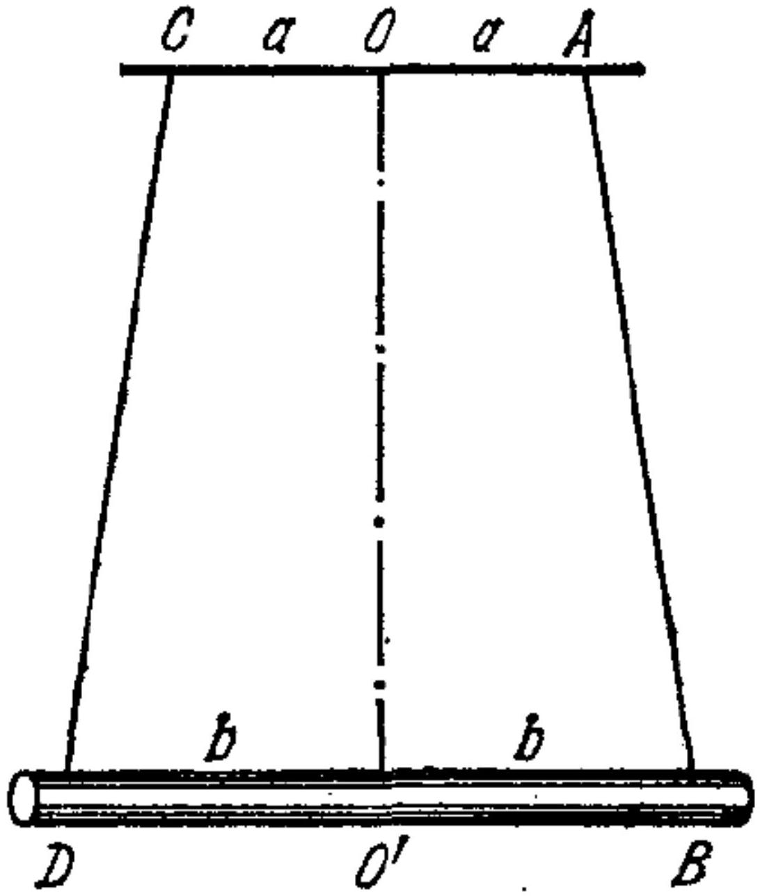

А1 ${ } ^ { 0,20 }$ Пусть кривая совершает один оборот вокруг цилиндра радиуса $R < \frac { l } { 2 \pi }$
(т.е $\varphi _ { B } - \varphi _ { A } = 2 \pi$ )
Найдите угол между касательной к кривой и осью симметрии цилиндра.

Ответ: Угол наклона постоянен, так что "развернув" винтовую линию получим

$$
l \sin \theta = 2 \pi R
$$

откуда

$$
\theta = \arcsin \frac { 2 \pi R } { l }
$$

А2 ${ } ^ { 0.40 }$ Пусть $\varphi _ { B } - \varphi _ { A } = \Delta \varphi$.
Выразите $z _ { B } - z _ { A }$ через $l , R$ и $\Delta \varphi$

Ответ: Длина куска винтовой линии $d \varphi$ равна по теореме Пифагора

$$
d l = \sqrt { ( R \operatorname { tg } \theta d \varphi ) ^ { 2 } + ( R d \varphi ) ^ { 2 } } = d \varphi \sqrt { R ^ { 2 } \operatorname { tg } ^ { 2 } \theta + R ^ { 2 } }
$$

Поэтому полная длина равна $l = R \Delta \varphi \sqrt { \operatorname { tg } ^ { 2 } \theta + 1 }$, откуда получаем $\operatorname { tg } \theta = \sqrt { \left( \frac { l } { R \Delta \varphi } \right) ^ { 2 } - 1 }$ и

$$
\Delta z = z _ { B } - z _ { A } = R \operatorname { tg } \theta \Delta \varphi = \sqrt { l ^ { 2 } - ( R \Delta \varphi ) ^ { 2 } }
$$

А3 ${ } ^ { 0.40 }$ Для $\frac { R \Delta \varphi } { l } \ll 1$ покажите, что

$$
z _ { B } - z _ { A } = l - \frac { ( R \Delta \varphi ) ^ { 2 } } { 2 l }
$$

Ответ: Раскладывая предыдущую формулу в ряд Тейлора получим ответ.

В1 ${ } ^ { 0.10 }$ Измерьте массу гайки $m$.

Ответ: Взесим гайку на весах. Разброс масс гаек достаточно большой. Ответ: $m = 10.0 \pm 0.4$ г.

В2 ${ } ^ { 0.90 }$ Измерьте радиус нити $r _ { 1 }$ методом рядов.

Ответ: Измерим радиус, плотно наматывая нить на линейку $N$ раз. Если длина намотанной части равна $D$, то радиус нити равен $r = \frac { D } { 2 N }$. Получим $N = 60 , D = 12 \pm 1$ мм и $r = 0.10 \pm 0.01$ мм.

Вз ${ } ^ { 3.00 }$ Измерьте момент инерции гайки относительно её главной оси.
Считайте, что $g = 9,8 \mathrm {~m} / \mathrm { c } ^ { 2 }$.

Ответ: Соберем бифилярный подвес (см. рис.). Нужно следить, чтобы гайка была параллельна полу. Из теории период крутильных колебаний будет равен

$$
T = 2 \pi \sqrt { \frac { I L } { m g a R } }
$$

Отсюда находим

$$
I = \frac { m g a R T ^ { 2 } } { 4 \pi ^ { 2 } L }
$$

Численно $I = ( 5.1 \pm 0.5 ) \cdot 10 ^ { - 7 }$ кг ⋅ $\mathrm { M } ^ { 2 }$.
Чтобы увеличить точность измерения $a$ стоит взять его достаточно большим, но так чтобы успевать "ловить" период $T$.
Чтобы точно измерить $R$ можно прокатить гайку по линейке. При перекате между гранями гайка проскальзывает по линейке. От этого можно избавиться прилепив очень тонкий слой клейкой массы на уголки гайки. Если гайка проехала расстояние $l$ за $N$ перекатов, ее длина радиус равен

$$
R = \frac { \sqrt { 3 } } { 2 } \frac { l } { N }
$$

C1 ${ } ^ { ? ? }$ Запишите расстояние $L$ от точки подвеса до точки скрепления для вашей установки.

C2 ${ } ^ { 1.70 }$ При закручивании нитей на угол $\varphi$ гайка поднимается на высоту $h$. Снимите зависимость $h ( \varphi )$ в максимально широком диапазоне (до углов порядка $500 \pi$ ), закручивая гайку против часовой стрелки, если смотреть на на неё сверху вниз. В дальнейшем будем называть это направление закрутки правым. Следите за тем, чтобы отрезки нитей ниже точки скрепления не перекручивались. На нитях не должны появляться узелки и катышки.

с3 ${ } ^ { 1.10 }$ Снимите аналогичную зависимость для закручивания в другую сторону. Убедитесь в асимметрии установки.

C4 ${ } ^ { 0.30 }$ Выведите теоретическую зависимость $h ( \varphi )$. Пользуясь этим, линеаризуйте зависимость, полученную в пункте С2.

Ответ: Систему из двух перекрученных нитей можно рассматривать как две винтовые линии с ненулевой "толщиной" линии. Точки соприкосновения двух нитей лежат на одной прямой, которая является осью винтовой линии. Поэтому и радиус винтовой линии равен радиусу нитей $r$. Используя результат А3 получим

$$
h = \frac { ( r \varphi ) ^ { 2 } } { 2 L }
$$

С5 ${ } ^ { 1.20 }$ Для правой закрутки нити постройте график зависимости $h ( \varphi )$ в координатах, в которых он является линейным. Из углового коэффициента еще раз определите радиус нити $r _ { 2 }$.

Ответ: Как следует из предыдущего пункта зависимость $h \left( \varphi ^ { 2 } \right)$ должна быть линейной. Построим график в этих осях. Получается прямая. Ее угловой коэффициент из теории равен

$$
k = \frac { r ^ { 2 } } { 2 L }
$$

откуда находим $r _ { 2 } = \sqrt { 2 L k }$.

с6 ${ } ^ { 0.70 }$ Получите теоретическую зависимость $\tau$ от параметров установки, где $\tau ( h )$ - время, за которое гайка останавливается, если её отпустить с высоты $h$.

Ответ: Запишем закон сохранения энергии:

$$
E = m g h + \frac { I \omega ^ { 2 } } { 2 } = m g \frac { ( r \varphi ) ^ { 2 } } { 2 L } + \frac { I \dot { \varphi } ^ { 2 } } { 2 } = \mathrm { const }
$$

Дифференцируя это по времени, получим

$$
0 = m g \frac { r ^ { 2 } \varphi \dot { \varphi } } { L } + I \dot { \varphi } \ddot { \varphi }
$$

откуда

$$
\ddot { \varphi } + \frac { m g r ^ { 2 } } { I L } \varphi = 0 .
$$

Это уравнение гармонических колебаний с частотой $\omega _ { 0 } = \sqrt { \frac { m g r ^ { 2 } } { I L } }$.

Время до первой остановки равно половине периода, т.е.

$$
\tau = \frac { 1 } { 2 } \frac { 2 \pi } { \omega _ { 0 } } = \pi \sqrt { \frac { I L } { m g r ^ { 2 } } }
$$

C7 ${ } ^ { 1.00 }$ Для правой закрутки экспериментально получите зависимость $\tau ( h )$.

Ответ: Измерив $\tau ( h )$, получим, что это константа с точностью до случайной погрешности $\approx 1 c$, что и соответствует гармноническим колебаниям -период не зависит от амплитуды.

С8 ${ } ^ { 2.50 }$ Снимите зависимость $\tau ( L )$. Постройте линеаризованный график.

Ответ: Из пункта C6

$$
\tau = \pi \sqrt { \frac { I L } { m g r ^ { 2 } } } .
$$

Построим график в осях $\tau ( \sqrt { L } )$. Он линейный, что подверждает теоретическую формулу для $\tau$.

с9 ${ } ^ { 1.20 }$ Модулем кручения $f$ однородного стержня называют коэффициент пропорциональности в формуле $M = f \cdot \varphi$, где $M$ - закручивающий момент сил, приложенных к основанию стержня, $\varphi$ - угол поворота основания стержня. Определите коэффициент $C$ в зависимости $f = C / L$, где $f$ - собственный модуль кручения одной нити, $L$ - длина нити. Опишите метод. Оцените отношение $\frac { C } { m g r ^ { 2 } }$. Убедитесь, что рассмотренный эффект почти не влияет на полученные результаты.

Ответ: Подвесим гайку на одной нити так, чтобы натянутая нить располагалась на оси вращательной симметрии гайки. Из теории известно, что при этом будут происходить гармонические колебания с периодом

$$
T _ { f } = 2 \pi \sqrt { \frac { I } { f } }
$$

Таким образом:

$$
f = 4 \pi ^ { 2 } \frac { I } { T _ { f } ^ { 2 } } = \frac { C } { L } \Leftrightarrow T _ { f } ^ { 2 } = 4 \pi ^ { 2 } \frac { I } { C } L
$$

Проведем измерения $T _ { f } ( L )$ и построим график в координатах $T _ { f } ^ { 2 } ( L )$. По коэффициенту наклона определим $C$ :

$$
C = ( 1.9 \pm 0.3 ) \cdot 10 ^ { - 9 } \mathrm { H } \cdot \mathrm { м }
$$

С10 ${ } ^ { 0.30 }$ Заметьте, что гайка раскручивается до неразличимых глазом угловых скоростей. Оцените по порядку, с какой максимальной угловой скоростью она вращается.

Ответ: Энергия системы равна

$$
E = \frac { I \dot { \varphi } ^ { 2 } } { 2 } + m g h = \frac { I \dot { \varphi } ^ { 2 } } { 2 } + \frac { m g r ^ { 2 } } { 2 L } \varphi ^ { 2 }
$$

Приравняем энергию системы в верхней и нижней точке:

$$
\frac { I \omega ^ { 2 } } { 2 } = m g h
$$

откуда

$$
\omega = \sqrt { \frac { 2 m g h } { I } }
$$

Взяв $h = 30$ мм и подставив числа, получим $\omega _ { \max } \approx 160$ рад/с.

D1 ${ } ^ { 1.20 }$ Считая известным, что при отклонении линейки на угол $\varphi$ от положения равновесия изменение её высоты представимо в виде

$$
h = A \varphi ,
$$

выразите $A$ через $R _ { 0 } , H _ { 0 }$ и $r$.

Ответ: При переходе из прямого участка нити в винтовую линию ее угол наклона не меняется. "Развернув" нить и записав теорему Пифагора получим

$$
H ^ { 2 } + \left( R _ { 0 } + r \varphi \right) ^ { 2 } = H _ { 0 } { } ^ { 2 } + R _ { 0 } { } ^ { 2 }
$$

Диффернцируя это по $\varphi$ получим

$$
2 H _ { 0 } \frac { d H } { d \varphi } + 2 R _ { 0 } r = 0
$$

(здесь мы пренебрегли слагаемым $2 r ^ { 2 } \varphi$ ).
Отсюда

$$
H = H _ { 0 } - \frac { R _ { 0 } } { H _ { 0 } } r \varphi
$$

D2 ${ } ^ { 0.80 }$ Получите теоретическую зависимость $\tau ^ { \prime } \left( \varphi _ { 0 } \right)$, где $\tau ^ { \prime }$ - время от начала движения линейки до момента ее первой остановки, $\varphi _ { 0 }$ - начальный угол закручивания нитей.

Ответ: Линейку можно считать длинным однородным стержнем, тогда ее момент инерции равен $I = \frac { 1 } { 3 } m R _ { 0 } ^ { 2 }$.
Запишем закон сохранения энергии:

$$
E = m g h + \frac { I \dot { \varphi } ^ { 2 } } { 2 } = m g A \varphi + \frac { I \dot { \varphi } ^ { 2 } } { 2 } = \mathrm { const }
$$

Диффиринцируя это по времени:

$$
0 = m g A \dot { \varphi } + I \dot { \varphi } \ddot { \varphi }
$$

откуда

$$
\ddot { \varphi } = - \frac { m g A } { I } = \mathrm { const }
$$

Это уравнение равноускоренного движения. Время до остановки равно удвоенному времени прохождения из крайнего положения в положение равновесия:

$$
\tau ^ { \prime } = 2 \sqrt { \frac { 2 I \varphi _ { 0 } } { m g A } } = 2 \sqrt { \frac { 2 R _ { 0 } ^ { 2 } \varphi _ { 0 } } { 3 g A } } = 2 \sqrt { \frac { 2 H _ { 0 } R _ { 0 } \varphi _ { 0 } } { 3 g r } }
$$

D3 ${ } ^ { 1.50 }$ Снимите зависимость $\tau ^ { \prime } \left( \varphi _ { 0 } \right)$, где $\tau ^ { \prime }$ - время от начала движения линейки до момента ее первой остановки, $\varphi _ { 0 }$ - начальный угол закручивания нитей. Измерения проводите в диапазоне $\varphi _ { 0 } \in [ \pi ; 10 \pi ]$.

D4 ${ } ^ { 1.50 }$ Постройте линеаризованный график и в третий раз определите радиус нити $r _ { 3 }$.

Ответ: Учитывая D2 построим график в координатах $\tau ^ { \prime } \left( \sqrt { \varphi _ { 0 } } \right)$. Он линейный. Из теории, его угловой коэффициент равен $k = 2 \sqrt { \frac { 2 H _ { 0 } R _ { 0 } } { 3 g r } }$. Отсюда найдем $r _ { 3 } = \frac { 8 H _ { 0 } R _ { 0 } } { 3 g k ^ { 2 } }$.
