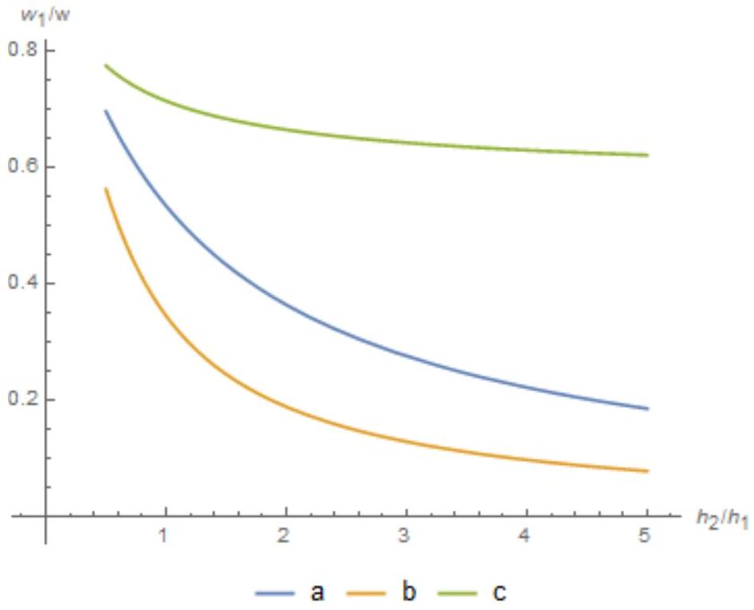

А1 ${ } ^ { 1.00 }$ Пусть $v ( x )$ - скорость течения жидкости в щели. Начало координат оси $O x$ находится посередине между плоскостями, а плоскости, ограничивающие течение, находятся при $x = \pm d / 2$. Разность давлений на противоположных краях щели равна $\Delta P$. Рассматривая силы, действующие на бесконечно малый слой жидкости толщины $d x$, получите дифференциальное уравнение на $v ( x )$. Найдите из него $v ( x )$. На стенках щели скорость обращается в 0. Найдите среднюю скорость течения жидкости $\langle v \rangle$ (выразите ее через $\Delta P , L , \eta$, d). Найдите поток (поток - объем жидкости, протекающий через щель в единицу времени) жидкости через щель. Выразите ответ через $\Delta P , L , \eta , d , w$.

Скорость течения жидкости постоянна, поэтому сумма силы давления и силы вязкого трения, действующей на слой жидкости толщины $d x$ должна быть равна нулю, откуда получаем уравнение

$$
\eta \frac { d ^ { 2 } v } { d x ^ { 2 } } = - \frac { \Delta P } { L }
$$

его решение, удовлетворяющее правильным граничным условиям

$$
v ( x ) = \frac { \Delta P } { 2 \eta L } \left( \frac { d ^ { 2 } } { 4 } - x ^ { 2 } \right) .
$$

Интегрируя, находим среднюю скорость

$$
\langle v \rangle = \frac { 1 } { d } \int _ { - d / 2 } ^ { d / 2 } d x v ( x ) = \frac { \Delta P d ^ { 2 } } { 12 \eta L }
$$

и поток

$$
q = d w \langle v \rangle = \frac { d ^ { 3 } w } { 12 \eta L } \Delta P .
$$

Ответ:

$$
\langle v \rangle = \frac { \Delta P d ^ { 2 } } { 12 \eta L } , \quad q = \frac { d ^ { 3 } w } { 12 \eta L } \Delta P .
$$

А2 ${ } ^ { 0.80 }$ Теперь рассмотрим течение жидкости через длинную круглую трубку длины $L$ и радиуса $r$.
Из соображений симметрии скорость при течении через трубку зависит только от расстояния до ее оси. На границе трубки скорость обращается в 0. Найдите зависимость скорости от расстояния до оси $\rho$. Разность давлений на между концами трубки $\Delta P$, вязкость жидкости $\eta$.

Найдите объемный расход $q$ при течении жидкости через трубку. Ответ выразите через $\Delta P , L , r , \eta$.

Приравнивая нулю силу, действующую на цилиндр жидкости радиуса $\rho$, находим уравнение

$$
2 \pi \rho \frac { d v } { d \rho } \eta L = - \pi \rho ^ { 2 } \Delta P , \quad \frac { d v } { d \rho } = - \rho \frac { \Delta P } { 2 \eta L } .
$$

Его решение

$$
v ( \rho ) = \frac { \Delta P } { 4 \eta L } \left( r ^ { 2 } - \rho ^ { 2 } \right) ,
$$

откуда поток равен

$$
q = \int _ { 0 } ^ { r } 2 \pi \rho d \rho v ( \rho ) = \frac { \pi r ^ { 4 } \Delta P } { 8 \eta L }
$$

Ответ:

$$
q = \frac { \pi r ^ { 4 } \Delta P } { 8 \eta L }
$$

А3 ${ } ^ { 0.20 }$ Найдите гидродинамические сопротивления щели $R _ { s }$ и трубки $R _ { t }$. Ответ выразите через геометрические размеры, заданные в пунктах А1 и А2 соответственно и через вязкость жидкости $\eta$.

Используя результаты предыдущих пунктов, получим

Ответ:

$$
R _ { s } = \frac { 12 \eta L } { d ^ { 3 } w } , \quad R _ { t } = \frac { 8 \eta L } { \pi r ^ { 4 } }
$$

А4 ${ } ^ { 0.70 }$ Жидкость вязкости $\eta$ течет по трубке радиуса $r$ и длины $L$ под действием разности давлений $\Delta P$ (как в А2). Найдите мощность сил вязкого трения.

Работа сил вязкого трения равна по модулю и противоположна по знаку работе сил давления (жидкость движется равномерно, поэтому полная работа равна нулю).
Сила давления, действующая на узкий цилиндр жидкости площади $d S$ (ось цилиндра параллельна направлению движения жидкости) равна $F = \Delta P d S$. Соответствующий вклад в мощность $d W = \Delta P d S v$, а полная мощность сил трения

$$
\begin{gathered}
W = - \int \Delta P v d S = - \Delta P q . \\
W = - q \Delta P = - \Delta P ^ { 2 } / R = - \frac { \pi r ^ { 4 } } { 8 \eta L } \Delta P ^ { 2 }
\end{gathered}
$$

Альтернативно можно использовать факт, что в бесконечно малом объеме мощность сил вязкого трения $d W = - d V \eta ( d v / d \rho ) ^ { 2 }$.
Интегрируя по объему, найдем

$$
W = \int d V \eta ( d v / d \rho ) ^ { 2 } = - \eta L \int _ { 0 } ^ { r } d \rho 2 \pi \rho ( d v / d \rho ) ^ { 2 } = - \frac { \pi r ^ { 4 } } { 8 \eta L } \Delta P ^ { 2 }
$$

Ответ:

$$
W = - \frac { \pi r ^ { 4 } } { 8 \eta L } \Delta P ^ { 2 }
$$

В1 ${ } ^ { 0.40 }$ Пусть заданы объемные расходы $q _ { 1 }$ и $q _ { 2 }$ жидкостей 1 и 2 , а также их средние скорости $\left\langle v _ { 1 } \right\rangle$ и $\left\langle v _ { 2 } \right\rangle$. Найдите относительную ширину потока образца $w _ { 1 } / w$.

Напишем выражения для потоков жидкостей через их средние скорости и ширины потоков:

$$
q _ { 1 } = \left\langle v _ { 1 } \right\rangle d w _ { 1 } , \quad q _ { 2 } = \left\langle v _ { 2 } \right\rangle d w _ { 2 } = \left\langle v _ { 2 } \right\rangle d \left( w - w _ { 1 } \right)
$$

Решая полученные уравнения, находим

$$
\frac { q _ { 2 } } { q _ { 1 } } = \frac { \left\langle v _ { 2 } \right\rangle } { \left\langle v _ { 1 } \right\rangle } \left( \frac { w } { w _ { 1 } } - 1 \right) , \quad \frac { w _ { 1 } } { w } = \frac { 1 } { 1 + q _ { 2 } \left\langle v _ { 1 } \right\rangle / q _ { 1 } \left\langle v _ { 2 } \right\rangle } .
$$

Ответ:

$$
\frac { w _ { 1 } } { w } = \frac { 1 } { 1 + q _ { 2 } \left\langle v _ { 1 } \right\rangle / q _ { 1 } \left\langle v _ { 2 } \right\rangle }
$$

В2 ${ } ^ { 0.40 }$ Пусть заданы вязкости жидкостей $\eta _ { 1 }$ и $\eta _ { 2 }$, а их средние скорости определяются результатами части $A$. Выразите $w _ { 1 } / w$ через $q _ { 1 } , q _ { 2 } , \eta _ { 1 }$ и $\eta _ { 2 }$. Эффектами, которые происходят на границе между жидкостями 1 и 2, можно пренебречь, так как они важны только в области шириной порядка $d \ll w$.

Из формул для средних скоростей

$$
\frac { \left\langle v _ { 1 } \right\rangle } { \left\langle v _ { 2 } \right\rangle } = \frac { \eta _ { 2 } } { \eta _ { 1 } }
$$

Ответ:

$$
\frac { w _ { 1 } } { w } = \frac { 1 } { 1 + q _ { 2 } \eta _ { 2 } / q _ { 1 } \eta _ { 1 } }
$$

Вз ${ } ^ { 0.30 }$ Найдите отношение потоков $q _ { 1 } / q _ { 2 }$, если заданы плотности жидкостей ( $\rho _ { 1 }$ и $\rho _ { 2 }$ ), их вязкости ( $\eta _ { 1 }$ и $\eta _ { 2 }$ ) и высоты, на которые подняты резервуары $h _ { 1 }$ и $h _ { 2 }$.

$$
\frac { q _ { 1 } } { q _ { 2 } } = \frac { \rho _ { 1 } g h _ { 1 } / R _ { 1 } } { \rho g h _ { 2 } / R _ { 2 } } = \frac { \rho _ { 1 } h _ { 1 } } { \rho _ { 2 } h _ { 2 } } \frac { R _ { 2 } } { R _ { 1 } } = \frac { \rho _ { 1 } h _ { 1 } \eta _ { 2 } } { \rho _ { 2 } h _ { 2 } \eta _ { 1 } }
$$

Ответ:

$$
\frac { q _ { 1 } } { q _ { 2 } } = \frac { \rho _ { 1 } h _ { 1 } \eta _ { 2 } } { \rho _ { 2 } h _ { 2 } \eta _ { 1 } }
$$

B4 ${ } ^ { 0.30 }$ Найдите соответствующее отношение ширин потоков $w _ { 1 } / w$.

Ответ:

$$
\frac { w _ { 1 } } { w } = \frac { 1 } { 1 + \rho _ { 2 } h _ { 2 } / \rho _ { 1 } h _ { 1 } }
$$

С1 ${ } ^ { 0.40 }$ Опять рассмотрим течение одной жидкости между плоскостями. Однако теперь скорость создается не только за счет разности давлений, но и за счет силы тяжести. Геометрия такая же как и в части A1, сила тяжести направлена вдоль оси $y$. Поток жидкости сонаправлен с силой тяжести. Найдите среднюю скорость жидкости. Выразите ответ через $\rho , g , \eta , d , \Delta P , L$.

Без учета гравитации

$$
\langle v \rangle = \frac { d ^ { 2 } } { 12 \eta L } \Delta P .
$$

За счет гравитации возникает дополнительный вклад в разность давлений

$$
\Delta P \rightarrow \Delta P + \rho g L .
$$

Отсюда скорость

Ответ:

$$
\langle v \rangle = \frac { d ^ { 2 } } { 12 \eta } \left( \frac { \Delta P } { L } + \rho g \right)
$$

С2 ${ } ^ { 0.80 }$ Пусть теперь между плоскостями течет два типа жидкостей, как в части $B$. Написав выражения для средних скоростей жидкостей 1 и 2 , исключите из них разность давлений (она одинакова для обеих жидкостей) найдите отношение $\left\langle v _ { 1 } \right\rangle / \left\langle v _ { 2 } \right\rangle$. Выразите ответ через $\left\langle v _ { 2 } \right\rangle , \eta _ { 1 } , \eta _ { 2 } , d , g , \rho _ { 1 } , \rho _ { 2 }$.

Запишем выражения для средних скоростей двух жидкостей

$$
\left\langle v _ { 1 } \right\rangle = \frac { d ^ { 2 } } { 12 \eta _ { 1 } } \left( \frac { \Delta P } { L } + \rho _ { 1 } g \right) , \quad \left\langle v _ { 2 } \right\rangle = \frac { d ^ { 2 } } { 12 \eta _ { 2 } } \left( \frac { \Delta P } { L } + \rho _ { 2 } g \right) .
$$

Умножим эти уравнения на соответствующие вязкости и вычтем одно из другого

$$
\eta _ { 1 } \left\langle v _ { 1 } \right\rangle - \eta _ { 2 } \left\langle v _ { 2 } \right\rangle = \frac { g d ^ { 2 } } { 12 } \left( \rho _ { 1 } - \rho _ { 2 } \right) .
$$

Разделив на $\eta _ { 1 } \left\langle v _ { 2 } \right\rangle$ получим

$$
\frac { \left\langle v _ { 1 } \right\rangle } { \left\langle v _ { 2 } \right\rangle } - \frac { \eta _ { 2 } } { \eta _ { 1 } } = \frac { g d ^ { 2 } } { 12 \eta _ { 1 } \left\langle v _ { 2 } \right\rangle } \left( \rho _ { 1 } - \rho _ { 2 } \right)
$$

откуда

Ответ:

$$
\frac { \left\langle v _ { 1 } \right\rangle } { \left\langle v _ { 2 } \right\rangle } = \frac { \eta _ { 2 } } { \eta _ { 1 } } \left( 1 + \frac { g d ^ { 2 } } { 12 \eta _ { 2 } \left\langle v _ { 2 } \right\rangle } \left( \rho _ { 1 } - \rho _ { 2 } \right) \right)
$$

С3 ${ } ^ { 1.00 }$ Подставьте выражение для средних скоростей в формулу для относительной ширины сфокусированного потока из В1. Получите уравнение для определения ширины вида

$$
\frac { w } { w _ { 1 } } = \ldots
$$

В правую часть могут входить отношение $\frac { w _ { 1 } } { w }$ и безразмерные параметры $\alpha = q _ { 2 } \eta _ { 2 } / q _ { 1 } \eta _ { 1 } , \beta = \left( \rho _ { 1 } - \rho _ { 2 } \right) q _ { G } / \rho _ { 2 } q _ { 2 }$. Здесь $q _ { G } = \rho _ { 2 } g d ^ { 3 } w / 12 \eta _ { 2 }$ - величина с размерностью потока жидкости, характеризующая влияние гравитации.

Используем соотношение из В1

$$
\frac { w } { w _ { 1 } } = 1 + q _ { 2 } \left\langle v _ { 1 } \right\rangle / q _ { 1 } \left\langle v _ { 2 } \right\rangle .
$$

Подставим в него найденное ранее отношение скоростей

$$
\frac { w } { w _ { 1 } } = 1 + \frac { q _ { 2 } \eta _ { 2 } } { q _ { 1 } \eta _ { 1 } } \left( 1 + \frac { g d ^ { 2 } } { 12 \eta _ { 2 } \left\langle v _ { 2 } \right\rangle } \left( \rho _ { 1 } - \rho _ { 2 } \right) \right)
$$

Выразим среднюю скорость $\left\langle v _ { 2 } \right\rangle$ через соответствующий поток:

$$
\left\langle v _ { 2 } \right\rangle = \frac { q _ { 2 } } { d w _ { 2 } } = \frac { q _ { 2 } } { d \left( w - w _ { 1 } \right) } .
$$

Тогда

$$
\frac { w } { w _ { 1 } } = 1 + \frac { q _ { 2 } \eta _ { 2 } } { q _ { 1 } \eta _ { 1 } } \left( 1 + \frac { g d ^ { 3 } } { 12 \eta _ { 2 } q _ { 2 } } \left( \rho _ { 1 } - \rho _ { 2 } \right) \left( w - w _ { 1 } \right) \right)
$$

Преобразуем это выражение:

$$
\begin{gathered}
\frac { w } { w _ { 1 } } = 1 + \frac { q _ { 2 } \eta _ { 2 } } { q _ { 1 } \eta _ { 1 } } \left( 1 + \frac { g d ^ { 3 } w } { 12 \eta _ { 2 } q _ { 2 } } \left( \rho _ { 1 } - \rho _ { 2 } \right) \frac { w - w _ { 1 } } { w } \right) = \\
1 + \alpha \left( 1 + \frac { q _ { G } \left( \rho _ { 1 } - \rho _ { 2 } \right) } { q _ { 2 } \rho _ { 2 } } \left( 1 - \frac { w _ { 1 } } { w } \right) \right) = 1 + \alpha \left( 1 + \beta \left( 1 - \frac { w _ { 1 } } { w } \right) \right) .
\end{gathered}
$$

Ответ:

$$
\frac { w } { w _ { 1 } } = 1 + \alpha \left( 1 + \beta \left( 1 - \frac { w _ { 1 } } { w } \right) \right) .
$$

С4 ${ } ^ { 0.60 }$ Решите это уравнение и найдите относительную ширину сфокусированного потока $w _ { 1 } / w$. Ответ выразите через безразмерные величины $\alpha , \beta$.

Получили квадратное уравнение

$$
\alpha \beta \frac { w _ { 1 } ^ { 2 } } { w ^ { 2 } } - ( 1 + \alpha + \alpha \beta ) \frac { w _ { 1 } } { w } + 1 = 0 .
$$

Его решение (нужный нам корень должен быть меньше 1, поэтому берем знак -)

Ответ:

$$
\frac { w _ { 1 } } { w } = \frac { 1 } { 2 \alpha \beta } \left( 1 + \alpha + \alpha \beta - \sqrt { ( 1 + \alpha + \alpha \beta ) ^ { 2 } - 4 \alpha \beta } \right)
$$

D1 ${ } ^ { 0.60 }$ Найдите гидродинамическое сопротивление каждого из реостатов, если по ним течет вода. Пусть в качестве жидкости 1 используется раствор соли, плотность которого $\rho _ { 1 } = 1.15 \cdot 10 ^ { 3 }$ кг/ $\mathrm { M } ^ { 3 }$, а вязкость совпадает с вязкостью воды. Найдите $q _ { G }$ для такой щели.

Подставляем приведенные выше числа в формулы для сопротивления и $q _ { G }$

$$
R = \frac { 8 \eta L } { \pi r ^ { 4 } } , \quad q _ { G } = \frac { \rho _ { 2 } g d ^ { 3 } w } { 12 \eta _ { 2 } }
$$

Ответ:

$$
R = 3.97 \cdot 10 ^ { 12 } \Pi \mathrm { a } \cdot \mathrm { c } / \mathrm { m } ^ { 3 } , \quad q _ { G } = 1.48 \cdot 10 ^ { - 8 } \mathrm { M } ^ { 3 } / c .
$$

D2 ${ } ^ { 0.30 }$ Найдите относительную ширину потока жидкости 1 (раствора соли)
$w _ { 1 } / w$ для случаев, когда жидкость 1 подается с высот $h _ { 1 } = 0.25 \mathrm {~m} , 0.5 \mathrm {~m} , 1.0 \mathrm { м }$.

Подставим числа в формулы, полученные в С4. Подставим числа в формулы из В4. Получим значения для $h = 0.25 \mathrm {~m} , 0.5 \mathrm {~m} , 1.0 \mathrm {~m}$ соответственно:

Ответ:

$$
\frac { w _ { 1 } } { w } = 0.190 ; 0.346 ; 0.563 .
$$

D3 ${ } ^ { 0.30 }$ Как изменится значение ширины потока, если пренебречь влиянием силы тяжести? Вычислите относительную ширину потока для тех же параметров $h _ { 1 } = 0.25 \mathrm {~m} , 0.5 \mathrm {~m} , 1.0 \mathrm {~m}$, что и в предыдущем пункте, не учитывая силу тяжести.

Подставим числа в формулы из В4. Получим значения для $h = 0.25 \mathrm {~m} , 0.5 \mathrm {~m} , 1.0 \mathrm {~m}$ соответственно:

Ответ:

$$
\frac { w _ { 1 } } { w } = 0.365 ; 0.535 ; 0.697
$$

D4 ${ } ^ { 0.30 }$ Пусть теперь по центру течет некоторая жидкость 1, плотность которой равна $\rho _ { 1 } ^ { \prime } = 0.8 \cdot 10 ^ { 3 }$ кг $/ \mathrm { M } ^ { 3 }$, а вязкость совпадает с вязкостью воды. Найдите отношение $w _ { 1 } / w$ для значений $h _ { 1 } = 0.25 \mathrm {~m} , 0.5 \mathrm {~m} , 1.0 \mathrm {~m}$.

Ответ:

$$
\frac { w _ { 1 } } { w } = 0.666 ; 0.715 ; 0.775 .
$$

D5 ${ } ^ { 0.80 }$ Постройте качественно на одном графике зависимости $w _ { 1 } / w$ от $h _ { 2 } / h _ { 1 }$ для трех случаев: a) гравитации нет, b) по центру течет раствор соли, с) по центру течет жидкость с плотностью $\rho _ { 1 } ^ { \prime }$. Все параметры как в предыдущих пунктах, высота $h _ { 2 }$ фиксирована, меняется только $h _ { 1 }$.

На рисунке приведены графики для случаев а), b), с) соответственно. Обратите внимание, что все три зависимости монотонно убывают, а также на порядок расположения кривых (когда плотность центральной жидкости больше, поток становится уже после учета гравитации, а когда меньше - поток наоборот расширяется).

Пусть резервуар для воды (жидкости 2) представляет собой цилиндр радиуса $r _ { r } = 20 \mathrm {~m}$.
Оцените время, за которое уровень воды в резервуаре уменьшается на $\delta h _ { 2 } = 10 \mathrm {~cm}$. Если эксперимент провести за время такого порядка, изменение уровня воды в резервуаре практически на нем не скажется. Начальный уровень равен $h _ { 2 } = 0.5 \mathrm {~m}$.

Скорость уменьшения уровня воды можно оценить из

$$
\pi r _ { r } ^ { 2 } \frac { d h _ { 2 } } { d t } = - q _ { 2 } = - \frac { \rho _ { 2 } g h _ { 2 } } { R } .
$$

Считая эту скорость приближенно постоянной, находим

Ответ:

$$
\Delta t \approx \frac { \pi r _ { r } ^ { 2 } \delta h _ { 2 } R } { \rho _ { 2 } g h _ { 2 } } \approx 10 ^ { 5 } \text { с.. }
$$
