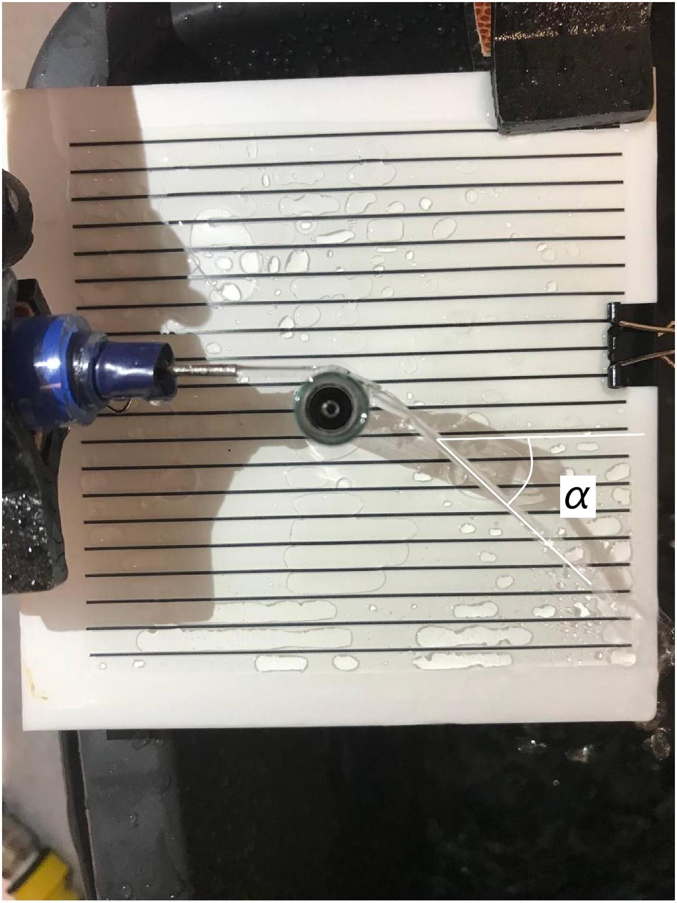

А1 ${ } ^ { 1.30 }$ Экспериментально изучите зависимость $z ( x )$. Сделайте не менее 15 измерений. Подробно опишите методику.

Для получения зависимости $z ( x )$ необходимо снять координаты струи. Это можно сделать, поместив миллиметровку параллельно плоскости движения воды и ручкой проставить точки.

A2 ${ } ^ { 0.80 }$ Определите $U _ { 0 }$.

Получим линеаризацию для зависимости $z ( x )$ :

$$
\begin{aligned}
x ( t ) & = U _ { 0 } \cdot t \\
z ( t ) & = \frac { g t ^ { 2 } } { 2 } \\
z & = \frac { g x ^ { 2 } } { 2 U _ { 0 } ^ { 2 } }
\end{aligned}
$$

С помощью данной линаеризации мы можем определить $U _ { 0 }$ с помощью углового коэффициента зависимости $z \left( x ^ { 2 } \right)$.

А3 ${ } ^ { 0.50 }$ Определите площадь внутреннего сечения $A _ { 0 }$ насадки и диаметр струи на выходе из нее $D _ { j }$.

С помощью мерного цилиндра и секундомера можно измерить объёмный расход $Q$ при выбранной скорости.

$$
\begin{gathered}
A = \frac { Q } { U _ { 0 } } = 1.96 \mathrm { mM } ^ { 2 } \\
D = 2 \sqrt { \frac { A } { \pi } } = 1.58 \mathrm { MM }
\end{gathered}
$$

В1 ${ } ^ { 1.50 }$ Экспериментально получите зависимость $z ( X )$, сделайте не менее 30 измерений. Прочитайте предупреждение ниже.

Сделаем установку, которая будет создавать необходимую спираль.
Поместим внутрь пробирки миллиметровку и снимем зависимость по этой миллиметровке.
При снятии зависимости будем учитывать, что внешний и внутренний диаметры пробирки различаются, поэтому скорректируем значения $x$ :

$$
x _ { \text {ист } } = \frac { D _ { \text {внешн } } } { D _ { \text {внутр } } } x
$$

В2 ${ } ^ { 0.80 }$ Постройте график зависимости $z ( X )$.

Вз ${ } ^ { 1.30 }$ Рассчитайте $\psi ( s )$ и постройте график этой зависимо-
сти.
$\psi$ можно определить несколькими способами:

1. ) С помощью построения сглаживающей кривой на графике $z ( x )$ и определение $\psi$ с помощью касательных.
2. ) Определение $\psi$ с помощью двух соседних точек: $\operatorname { ctg } ( \psi ) = \frac { z _ { i } - z _ { i - 1 } } { x _ { i } - x _ { i - 1 } }$

$s$ определяется итеративно:

$$
s _ { i + 1 } = s _ { i } + \sqrt { \left( z _ { i + 1 } - z _ { i } \right) ^ { 2 } + \left( x _ { i + 1 } - x _ { i } \right) ^ { 2 } }
$$

С1 ${ } ^ { 0.80 }$ Для всех пробирок измерьте $\lambda ( R )$ при одинаковых начальных условиях.

При измерении $\lambda$ на различных пробирках важно сохранять одинаковые условия измерения, в них входят $\psi _ { 0 }$, скорость струи при попадании на пробирку, степень прижатости струи к пробирки, а так же метод измерения $\lambda$.

С2 ${ } ^ { 0.50 }$ Поставьте точки, соответствующие экспериментальным данным, полученным в предыдущем пункте, на графике $z ( X )$. Основываясь на этом сделайте вывод относительно справедливости утверждения: «Радиус пробирки $R$ не влияет на зависимость $z ( X )$ при одинаковых начальных условиях $\left( U _ { 0 } , \psi _ { 0 } \right)$ ».

При нанесении точек, соответствующих различным пробиркам, на изначальный график $z ( x )$ можно убедится, что с точностью до погрешности они попадают на зависимость. Это говорит о том, что радиус пробирки не влияет на зависимость $z ( x )$ при одинаковых начальных условиях.

D1 ${ } ^ { 2.00 }$ Получите коэффициенты $a , b$ и $c$ для параболического приближения зависимости $\psi ( s ) = a s ^ { 2 } + b s + c$.

Продифференциируем зависимость $\sigma \left( a , b , c , s _ { i } , \psi _ { i } \right)$ по $a , b , c$ :

$$
\left\{ \begin{array} { l }
\frac { \partial \sigma } { \partial a } = \sum 2 \left( a s _ { i } ^ { 2 } + b s _ { i } + c - \psi _ { i } \right) x _ { i } ^ { 2 } = 0 \\
\frac { \partial \sigma } { \partial b } = \sum 2 \left( a s _ { i } ^ { 2 } + b s _ { i } + c - \psi _ { i } \right) x _ { i } = 0 \\
\frac { \partial \sigma } { \partial c } = \sum 2 \left( a s _ { i } ^ { 2 } + b s _ { i } + c - \psi _ { i } \right) = 0
\end{array} \right.
$$

Упростим данную систему:

$$
\left\{ \begin{array} { l }
a \sum s _ { i } ^ { 4 } + b \sum s _ { i } ^ { 3 } + c \sum s _ { i } ^ { 2 } - \sum s _ { i } ^ { 2 } \psi _ { i } = 0 \\
a \sum s _ { i } ^ { 3 } + b \sum s _ { i } ^ { 2 } + c \sum s _ { i } - \sum s _ { i } \psi _ { i } = 0 \\
a \sum s _ { i } ^ { 2 } + b \sum s _ { i } + c \cdot n - \sum \psi _ { i } = 0
\end{array} \right.
$$

Посчитав все необходимые суммы решим её.

D2 ${ } ^ { 0.70 }$ Допустим, что по плоской поверхности твердого тела стационарно и однородно течет слой воды высотой $H$. Можно считать, что разность давлений между точками, лежащими на разных торцах и одной линии тока не зависят от этой линии тока, т.к. иначе они бы искривились. Найдите распределение скорости $u ( h )$ внутри этого слоя, где $h$ - высота над поверхностью. Ответ выразите через скорость воды у поверхности $U _ { \text {пов } } , h$ и $H$. Выразите силу вязкого трения $F _ { \text {вяз, } 1 }$, действующую на участок слоя ширины $W$ и длины $L$ со стороны поверхности, через $U _ { \text {пов } } , A , W , L , \eta$, где $A = W H$ - площадь сечения.

Рассмотрим слой, заключённый между высотами $h$ и $H$. В силу того, что течение носит установившийся характер, силы действующие на слой уравновешены.
Очевидно, что силы вязкого трения действуют только на нижнюю часть слоя, так как верхняя поверхность является свободной. Тогда уравнение баланса сил запишется следующим образом:

$$
\Delta P \cdot ( H - h ) W + \eta W L \frac { \partial u } { \partial h } = 0
$$

где $\Delta P$ - постоянная разность давлений между торцами слоя. Отсюда несложно заключить, что зависимость $u ( h )$ - квадратичная.
Подберём коэффициенты с помощью подстановки известных начальных условий:

$$
\begin{aligned}
& u ( 0 ) = 0 \quad u ( H ) = U _ { \text {пов } } \\
& F _ { \text {тр } } ( H ) \propto \frac { \partial u } { \partial h } ( H ) = 0
\end{aligned}
$$

Решая систему из трёх линейных уравнений на параметры зависимости

$$
u ( h ) = C _ { 1 } h ^ { 2 } + C _ { 2 } h + C _ { 3 } ,
$$

получим в итоге

Ответ:

$$
u ( h ) = 2 U _ { \text {пов } } \left( \frac { h } { H } - \frac { h ^ { 2 } } { 2 H ^ { 2 } } \right)
$$

Выражение для силы вязкого трения можно получить, подставив зависимость $u ( h )$ в явное выражение для $F _ { \text {тр } }$ :

Ответ:

$$
F _ { \text {вяз } } = \frac { 2 \eta L W ^ { 2 } } { A } U _ { \text {пов } }
$$

D3 ${ } ^ { 0.60 }$ Выразите $U _ { \text {пов } }$ через $U$.

Напомним, что $U$ - некоторая характерная величина, определяемая через выражение $Q = A U$.

Фактически, задача сводится к выражению суммарного потока жидкости через $U _ { \text {пов } }$ с помощью элементарного интегрирования.

$$
Q = \int _ { 0 } ^ { H } u ( h ) W d h = 2 U _ { \text {пов } } W H \int _ { 0 } ^ { 1 } \left( x - \frac { x ^ { 2 } } { 2 } \right) d x = \frac { 2 } { 3 } U _ { \text {пов } } W H
$$

Из чего в итоге очевидно следует

Ответ:

$$
U _ { \text {пов } } = \frac { 3 } { 2 } U
$$

D4 ${ } ^ { 0.20 }$ Сформулируйте закон сохранения массы для данного кусочка. Выразите ответ через $U , A , d s , \rho$.

Ответ:

$$
d m = \rho A d s = \text { const }
$$

D5 ${ } ^ { 1.50 }$ Запишите векторный II закон Ньютона в импульсной форме. Возьмите в качестве базиса ортонормированную тройку векторов $( \vec { t } ( s ) , \vec { n } ( s ) , \vec { b } ( s ) ) : \vec { t }$ направлен вдоль струи; $\vec { n }$ - направлен перпендикулярно поверхности пробирки от нее; $\vec { b }$ - их ортогональное дополнение (в касательной плоскости перпендикулярно $\vec { t }$ ). При записи изменения импульса струи пренебрегайте распределением скоростей внутри нее и считайте ее равномерным по сечению потоком, двигающимся со скоростью $U ( s )$, это приближение можно использовать в силу того, что учет неравномерности скорости в данном члене дает поправку, очень близкую к 1. Воспользуйтесь пунктом $D 4$ для упрощения данного выражения.

Довольно очевидно можно получить, что импульс исследуемого кусочка

$$
d m \cdot \vec { U } = \rho A d s \cdot U \vec { t }
$$

Используя предыдущий пункт, $d m$ можно вынести из под знака дифференцирования по времени:

$$
\frac { d } { d t } [ \rho A d s \cdot U \vec { t } ] = \rho A d s \cdot \frac { d } { d t } [ U \vec { t } ]
$$

Осталось корректно записать силы, действующие на кусочек. Дополнительных преобразований может потребовать только сила вязкого трения: объединяя результаты $D 2$ и $D 3$ получим

$$
\vec { F } _ { \text {вяз } } = - \frac { 3 C \eta W ^ { 2 } } { A } d s \cdot U \vec { t } .
$$

Комбинируя все полученные результаты, запишем закон в виде:

Ответ:

$$
\rho A d s \cdot \frac { d } { d t } [ U \vec { t } ] = \rho A g \vec { z } d s - \Delta P W \vec { n } d s - \frac { 3 C \eta W ^ { 2 } } { A } U \vec { t } d s
$$

D6 ${ } ^ { 0.20 }$ Исключите время из уравнения, воспользовавшись тождественностью операторов

$$
\frac { d } { d t } \equiv U \cdot \frac { d } { d s }
$$

Ответ:

$$
\rho A U \cdot \frac { d } { d s } [ U \vec { t } ] = \rho A g \vec { z } - \Delta P W \vec { n } - \frac { 3 C \eta W ^ { 2 } } { A } U \vec { t }
$$

D7 ${ } ^ { 0.60 }$ Найдите проекции $\frac { d } { d s } ( U \vec { t } )$ на $\vec { t }$ и $\vec { b }$. Выразите ответы через функции от $U , \psi$ и их производные по $s$.

Дифференцируя произведение по правилу Лейбница, получим:

$$
\frac { d } { d s } [ U \vec { t } ] = \frac { d U } { d s } \vec { t } + U \frac { d \vec { t } } { d s }
$$

В силу того, что $\vec { t }$ - единичный, то

$$
\vec { t } \cdot \frac { d \vec { t } } { d s } = 0
$$

Проекцию $\vec { b } \cdot \frac { d \vec { t } } { d s }$ можно найти исходя из того, что угол $\psi$ определяет ориентацию векторов $\vec { t } , \vec { b }$ в касательной к трубке плоскости, что аналогично простому вращению пары векторов в $\mathbb { R } ^ { 2 }$ с использованием полярных координат:

$$
\vec { b } \cdot \frac { d \vec { t } } { d s } = - \frac { d \psi } { d s }
$$

Аналогично, последнее выражение можно получить дифференцированием тождества $\vec { t } \cdot \vec { z } = \cos \psi$, где $\vec { z }$ - постоянный единичный вектор, направленный вниз.
Итого:

Ответ:

$$
\begin{aligned}
& { \left[ \frac { d } { d s } ( U \vec { t } ) \right] \cdot \vec { t } = \frac { d U } { d s } } \\
& { \left[ \frac { d } { d s } ( U \vec { t } ) \right] \cdot \vec { b } = - \frac { d \psi } { d s } \cdot U }
\end{aligned}
$$

D8 ${ } ^ { 0.60 }$ Воспользовавшись результатами пунктов D4-D7, получите систему из двух диф.уравнений на $U$ и $\psi$ такого вида:

$$
\left\{ \begin{array} { l }
\frac { d U } { d s } = - \alpha _ { 1 } U ^ { 2 } + \frac { \alpha _ { 2 } \cos \psi } { U } \\
\frac { d \psi } { d s } = - \frac { \beta \sin \psi } { U ^ { 2 } }
\end{array} \right.
$$

где $\alpha _ { 1 } , \alpha _ { 2 }$ и $\beta$ - некоторые положительные константы. Выразите их через следующие постоянные: $\eta , U _ { 0 } , D j , \rho , g , C$.

Спроецировав уравнение $D 6$ на $\vec { t }$ и $\vec { b }$, а затем воспользовавшись $D 7$, получим следующие уравнения:

$$
\begin{gathered}
\rho A U \cdot \frac { d U } { d s } = \rho A g \cos \psi - \frac { 3 C \eta W ^ { 2 } } { A } U \\
- \rho A U ^ { 2 } \cdot \frac { d \psi } { d s } = \rho A g \sin \psi
\end{gathered}
$$

Разделив уравнения на множители перед производными для получения искомых коэффициентов остаётся вспомнить, что, строго говоря, $A$ является переменной величиной, зависящей от $U$. Считая жидкость несжимаемой, можно привести закон сохранения массы к закону сохранения объёмного потока, что будет иметь вид:

$$
Q = A U = \frac { \pi D _ { j } ^ { 2 } } { 4 } U _ { 0 } = \text { const }
$$

Заменив с помощью этого выражения $A ^ { 2 }$ в последнем члене первого уравнения, получим:

$$
\begin{gathered}
\frac { d U } { d s } = \frac { g \cos \psi } { U } - \frac { 48 C \eta } { \rho \pi ^ { 2 } D _ { j } ^ { 2 } U _ { 0 } ^ { 2 } } U ^ { 2 } \\
\frac { d \psi } { d s } = - \frac { g \sin \psi } { U ^ { 2 } } ,
\end{gathered}
$$

из чего искомые коэффициенты

Ответ:

$$
\begin{gathered}
\alpha _ { 1 } = \frac { 48 C \eta } { \rho \pi ^ { 2 } D _ { j } ^ { 2 } U _ { 0 } ^ { 2 } } \\
\alpha _ { 2 } = \beta = g
\end{gathered}
$$

D9 ${ } ^ { 1.20 }$ Рассчитайте значение $U$ в экспериментальных точках опираясь на параболическое приближение $\psi ( s )$ (пункт D1). Погрешность $U$ можно не оценивать. Постройте график $U ( s )$.

Из второго уравнения части $D 8$ выразим $U$ :

$$
U = \sqrt { - \frac { g \sin \psi } { d \psi / d s } }
$$

Производную $\frac { d \psi } { d s }$ рассчитаем, используя параболическое приближение:

$$
\frac { d \psi } { d s } = 2 a s + b
$$

D10 ${ } ^ { 0.80 }$ Оцените значение $C$.

Теперь воспользуемся первым уравнением пункта $D 8$. Для оценки достаточно построить касательную к графику $U ( s )$ в нуле, и, используя найденный коэффициент наклона, получить $C$ :

$$
C = \frac { \rho \pi ^ { 2 } D _ { j } ^ { 2 } } { 48 C \eta } \left[ \frac { g \cos \psi } { U _ { 0 } } - \frac { d U } { d s } ( 0 ) \right]
$$

D11 ${ } ^ { 1.20 }$ Приближенно численно решите дифференциальные уравнения. Найдите вид «теоретической» зависимости $U _ { t } ( s ) , \psi _ { t } ( s ) , X _ { t } ( z )$ в не менее чем 15-ти точках.

D12 ${ } ^ { 0.90 }$ На графиках $z ( X ) , \psi ( s ) , U ( s )$ отметьте точки теоретического моделирования $z _ { t } ( X ) , \psi _ { t } ( s ) , U _ { t } ( s )$.

E1 ${ } ^ { 1.50 }$ Экспериментально исследуйте зависимость $\alpha \left( U _ { 0 } \right)$, постройте ее график. Сделайте не менее 13 измерений. Подробно опишите методику.

Методика измерения скорости воды:

Зафиксируем положение крана и иглы, что бы начальная скорость вытекания сохранялась постоянной. Определим эту скорость так же, как и в пункте А (однако теперь мы знаем $A$ и нам достаточно измерить объёмный расход).

Теперь будем изменять наклон струи, что бы изменить высоту, на которой струя становится горизонтальной. С помощью измерения этой высоты мы можем определить скорость на горизонтальном участке.

Методика определения угла поворота:

Поместим самую маленькую пробирку в отверстие экрана и прозрачной пластины с параллельными линиями. Повернём установку так, что бы изначальное направление струи совпадало с линиями на экране. С помощью транспортира определим необходимый угол, как показано на фотографии.

$$
U _ { \text {крит } } = 0.60 \pm 0.05 \frac { \mathrm { M } } { \mathrm { c } }
$$
