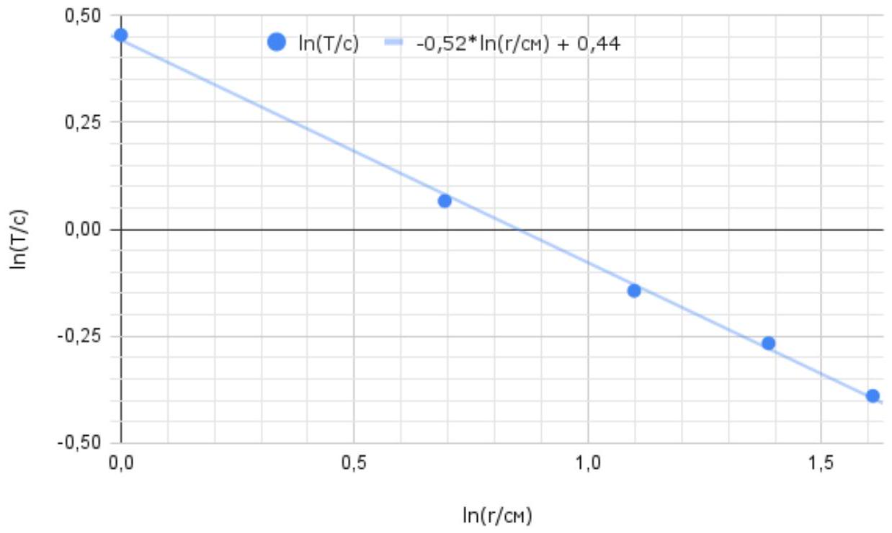
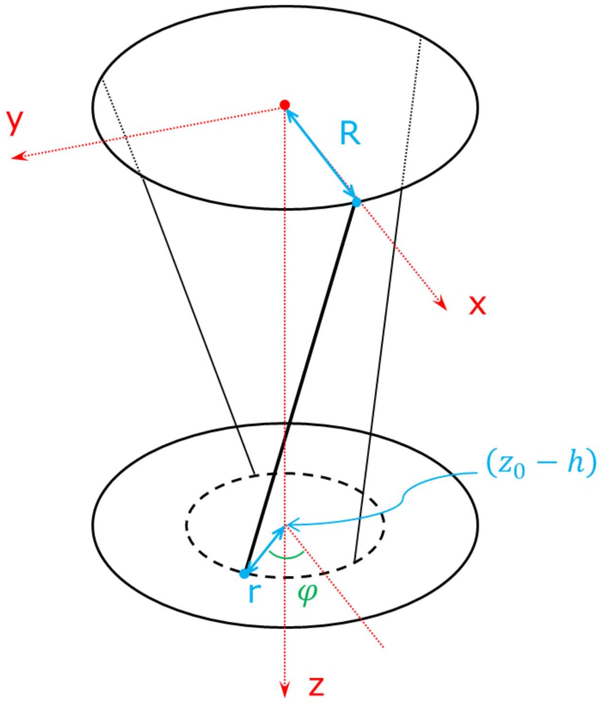
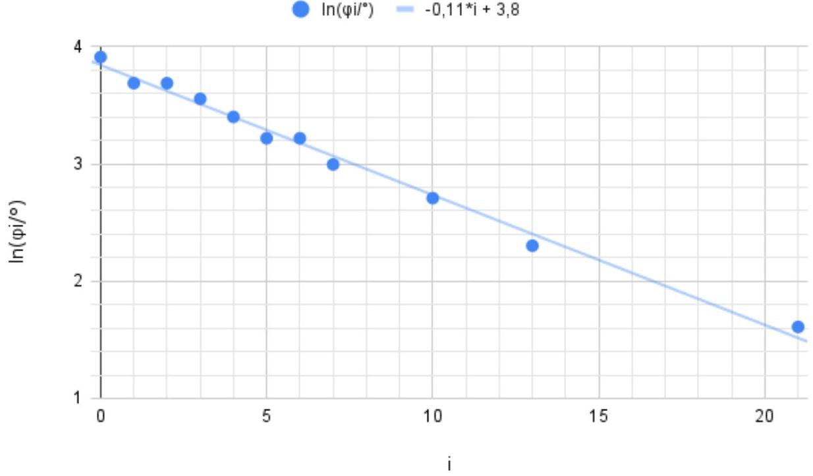
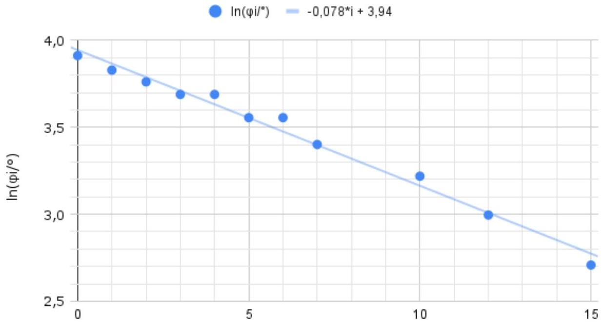

А1 ${ } ^ { 1.70 }$ При фиксированном $R$ проведите точные измерения периода $T ( r )$. Запишите, какие значения $r$ и $z _ { 0 }$ вы выбираете при сборке установки для этого пункта, и чему равно измеренное вами $R$. Постройте линеаризованный график и определите $\beta$.

Соберем установку с $z _ { 0 } = 50.0 \mathrm {~cm}$ и после каждого изменения $r$ будем корректировать длину нитей так, чтобы $z _ { 0 }$ оставалось прежним. Измерим расстояние от верхнего конца нитей до оси установки: $R = 5.0$ см. Для каждого из доступных $r$ измерим суммарное время $N$ колебаний. Поскольку зависимость $T ( r )$ имеет описанный в условии вид $T = C \cdot R ^ { \alpha } r ^ { \beta }$, для ее линеаризации построим график $\ln T ( \ln r )$. Его угловой коэффициент будет равен $\beta$.

| r, CM | N*T(r), c | N | T(r), c | $\ln ( \mathrm { r } / \mathrm { cm } )$ | $\ln ( \mathrm { T } / \mathrm { c } )$ |
| :--- | :--- | :--- | :--- | :--- | :--- |
| 5 | 33,87 | 50 | 0,6774 | 1,61 | -0,39 |
| 4 | 38,30 | 50 | 0,766 | 1,39 | -0,27 |
| 3 | 43,30 | 50 | 0,866 | 1,10 | -0,14 |
| 2 | 53,40 | 50 | 1,068 | 0,69 | 0,07 |
| 1 | 78,70 | 50 | 1,574 | 0,00 | 0,45 |

По графику определяем $\beta = - 0.52 \approx - 0.5$.

А2 ${ } ^ { 0.30 }$ Чему равна $\alpha$ ? Объясните свой ответ.

Ответ: $\alpha = \beta = - 0.5$.

Для обоснования этого равенства можно привести любой из следующих аргументов:

1. Геометрия установки определяется величинами $R$ и $r$ равноправно. Например, на высоту подъема нижнего диска при его повороте на фиксированный угол влияют оба этих радиуса, и высота не изменится при "перевороте" установки. Таким образом, $R$ и $r$ должны входить в формулу для $T$ симметрично, и формула не должна меняться при замене $R \leftrightarrow r$.
2. Попробуем "угадать" примерный вид формулы $T \left( R , r , z _ { 0 } , I , m , g \right)$. По аналогии с периодом колебаний математического маятника, а также с учетом найденного $\beta = - 0.5$, имеем: $T \propto \sqrt { \frac { z _ { 0 } } { g r } }$. Чтобы размерность массы сократилась, в формулу должно входить отношение $I / m$. Также, по условию, $T \propto R ^ { \alpha }$. Причем ясно, что при увеличении момента инерции, а также при уменьшении $R$, период возрастет. Таким образом, имеем:

$$
T \propto \sqrt { \frac { z _ { 0 } } { g r } \cdot \left( \frac { I } { m } \right) ^ { \gamma } } \cdot \frac { 1 } { R ^ { | \alpha | } } ,
$$

где $\gamma > 0$.
Применим метод размерностей:

$$
c = \sqrt { \frac { c ^ { 2 } } { M } \cdot \left( M ^ { 2 } \right) ^ { \gamma } } \cdot \frac { 1 } { M ^ { | \alpha | } }
$$

Получаем условие на степени: $2 \gamma = 1 + 2 | \alpha |$. Простейшее решение этого уравнения: $\alpha = - 0.5 , \gamma = 1$. Для подтверждения выбора такой пары корней можно провести, например, аналогию с формулой колебанияй стержня, подвешенного на двух нитях.
3. Явная формула, которая будет получена в пункте В3, подтверждает найденный ранее коэффициент $\beta = - 0.5$ и дает $\alpha = - 0.5$.

В1 ${ } ^ { 0.60 }$ Введите Декартову систему координат и запишите координаты верхнего и нижнего концов одной из нитей. Выразите расстояние $L$ между ними через $R , r , z _ { 0 } , h , \varphi$.

Введем систему координат, например, связанную с верхним радиус-вектором и с осью $z$, направленной вниз (см. рис.).
Кординаты верхнего конца выделенной на рисунке нити:

$$
\begin{aligned}
& X = R \\
& Y = 0 \\
& Z = 0
\end{aligned}
$$

Нижний конец нити:

$$
\begin{aligned}
& x = r \cdot \cos \varphi \\
& y = r \cdot \sin \varphi \\
& z = z _ { 0 } - h
\end{aligned}
$$

По теореме Пифагора выражаем длину нити:

Ответ: $L = \sqrt { ( R - r \cos \varphi ) ^ { 2 } + ( r \sin \varphi ) ^ { 2 } + \left( z _ { 0 } - h \right) ^ { 2 } }$

В2 ${ } ^ { 0.60 }$ Нити нерастяжимы и при колебаниях всегда натянуты. Используя это, выразите $h$ через $R , r , z _ { 0 } , \varphi$. Напоминаем, что угол $\varphi$ мал.

В положении равновесия $\varphi = 0$ и $h = 0$, а длина нити $L _ { 0 } = \sqrt { ( R - r ) ^ { 2 } + z _ { 0 } ^ { 2 } }$. Нити нерастяжимые и при колебаниях всегда натянуты, значит $L = L _ { 0 }$ :

$$
\begin{gathered}
( R - r \cos \varphi ) ^ { 2 } + ( r \sin \varphi ) ^ { 2 } + \left( z _ { 0 } - h \right) ^ { 2 } = ( R - r ) ^ { 2 } + z _ { 0 } ^ { 2 } \\
( R - r \cos \varphi ) ^ { 2 } + ( r \sin \varphi ) ^ { 2 } - ( R - r ) ^ { 2 } = z _ { 0 } ^ { 2 } - \left( z _ { 0 } - h \right) ^ { 2 } \\
- 2 R r \cos \varphi + 2 R r = 2 z _ { 0 } h - h ^ { 2 } \\
2 R r ( 1 - \cos \varphi ) = 2 z _ { 0 } h - h ^ { 2 }
\end{gathered}
$$

При $\varphi \ll 1$ и $h \ll z _ { 0 }$ можем отбросить все порядки их малости, кроме первых ненулевых:

$$
2 R r \cdot \frac { \varphi ^ { 2 } } { 2 } = 2 z _ { 0 } h
$$

Окончательно:

Ответ:

$$
h = \frac { \operatorname { Rr } \varphi ^ { 2 } } { 2 z _ { 0 } }
$$

В3 ${ } ^ { 0.80 }$ С помощью закона сохранения энергии при крутильных колебаниях получите выражение для $T$ через $R , r , z 0 , I , m , g$.

Запишем закон сохранения энергии, пренебрегая вертикальным движением центра масс:

$$
\begin{gathered}
\frac { I ( \dot { \varphi } ) ^ { 2 } } { 2 } + m g h = \text { const } \\
\frac { I ( \dot { \varphi } ) ^ { 2 } } { 2 } + m g \frac { R r } { z _ { 0 } } \frac { \varphi ^ { 2 } } { 2 } = \text { const }
\end{gathered}
$$

Дифференцируем это уравнение по времени:

$$
\frac { I \cdot 2 \dot { \varphi } \ddot { \varphi } } { 2 } + m g \frac { R r } { z _ { 0 } } \frac { 2 \varphi \dot { \varphi } } { 2 } = 0
$$

И сокращаем на не равную тождественно нулю функцию $\dot { \varphi } ( t )$ :

$$
\begin{gathered}
I \ddot { \varphi } + m g \frac { R r } { z _ { 0 } } \varphi = 0 \\
\ddot { \varphi } = - \frac { m g R r } { z _ { 0 } I } \varphi
\end{gathered}
$$

Получилось уравнение гармонических колебаний, по нему легко определить их период:

Ответ:

$$
T = 2 \pi \sqrt { \frac { I } { m } \cdot \frac { z _ { 0 } } { g R r } }
$$

Видно, что полученные в части А результаты $\alpha = \beta = - \frac { 1 } { 2 }$ согласуются с теорией.

С1 ${ } ^ { 0.20 }$ С помощью рычага определите отношения $m _ { A } / m _ { 0 }$ и $m _ { B } / m _ { 0 }$ как можно точнее.

Сделаем из линейки симметричный рычаг. К одному из концов линейки подвесим на нитях диск трифилярного подвеса, на другом плече "взвесим" по очереди обе гайки. Уравновешивая рычаг в обоих случаях, получаем соотношения:

Ответ: $m _ { A } / m _ { 0 } = 5.86$,
$m _ { B } / m _ { 0 } = 8.79$.

C2 ${ } ^ { 3.80 }$ Проведите точные измерения периодов колебаний гаек.

Определите $a$ и $b$.
Опишите проводимые вами измерения. Приведите их результаты, в т.ч. геометрические параметры гаек, а также предоставьте все используемые вами теоретические выкладки и расчеты. Запишите, какие значения $r$ и $z _ { 0 }$ вы выбираете при сборке установки для этого пункта.

Будем использовать $z _ { 0 } \approx 49 \mathrm {~cm}$ и $r = R = 5.0 \mathrm {~cm}$. Нити немного растягиваются под действием помещенного на трифилярный подвес груза, поэтому точные значения $z _ { 0 }$ будем проверять для каждого отдельного эксперимента. В таблице приведены результаты измерений периода крутильных колебаний как пустой платформы трифилярного подвеса, так и платформы с каждой из гаек. Как и прежде, измеряется суммарное время $N$ колебаний. Также измерим линейкой расстояние 3.5 см между противоположными сторонами 6-угольной гайки, отсюда сторона 6-угольника равна $s = \frac { 3.5 \mathrm { CM } } { \sqrt { 3 } } = 2.02$ см.

|  | T*N, c | N | T, c | $\mathrm { Z } _ { 0 } , \mathrm { M }$ |
| :--- | :--- | :--- | :--- | :--- |
| без гайки | 52,16 | 50 | 1,043 | 0,492 |
| с гайкой A | 28,50 | 50 | 0,570 | 0,497 |
| с гайкой B | 24,54 | 50 | 0,491 | 0,499 |

Выведем теоретические формулы, позволяющие рассчитать $a$ и $b$.
Масса гайки выражается через сторону 6-угольника $s$ и радиус отверстия $a$ следующим образом:

$$
m _ { A } = \rho \cdot \left( \frac { 3 \sqrt { 3 } } { 2 } s ^ { 2 } H - \pi a ^ { 2 } H \right)
$$

Для расчета момента инерции гайки вычислим сначала момент инерции плоского треугольника со стороной $s$ относительно его центра. Для этого разделим треугольник средними линиями на 4 треугольника меньшего размера: масса каждого из них равна $m _ { \Delta } / 4$, сторона каждого равна $s / 2$. Если момент инерции большого треугольника равен $\alpha \cdot m _ { \Delta } s ^ { 2 }$ (из соображений размерности), где $\alpha$ - некий числовой коэффициент, то момент инерции каждого из меньших треугольников относительно своего центра равен $\alpha \cdot \frac { m _ { \Delta } } { 4 } \left( \frac { s } { 2 } \right) ^ { 2 }$. Их суммарный момент инерции, равный, с одной стороны, $\alpha \cdot m _ { \Delta } s ^ { 2 }$, можно, с другой стороны, выразить через моменты инерции меньших треугольников (с учетом добавок Гюйгенса-Штейнера):

$$
I _ { \Delta } = \alpha m _ { \Delta } s ^ { 2 } = 3 \cdot \left( \alpha \frac { m _ { \Delta } } { 4 } \left( \frac { s } { 2 } \right) ^ { 2 } + \frac { m _ { \Delta } } { 4 } \left( \frac { s } { 2 \sqrt { 3 } } \right) ^ { 2 } \right) + \alpha \frac { m _ { \Delta } } { 4 } \left( \frac { s } { 2 } \right) ^ { 2 } .
$$

После сокращения на $\left( m _ { \Delta } s ^ { 2 } \right)$ :

$$
\alpha = 3 \cdot \left( \alpha \frac { 1 } { 16 } + \frac { 1 } { 48 } \right) + \alpha \frac { 1 } { 16 } ,
$$

откуда $\alpha = \frac { 1 } { 12 }$. Итого, для треугольника относительно его центра: $I _ { \Delta } = \frac { 1 } { 12 } m _ { \Delta } s ^ { 2 }$. Тогда относительно вершины: $I _ { \Delta } = \frac { 5 } { 12 } m _ { \Delta } s ^ { 2 }$. Аналогичное выражение для момента инерции треугольной призмы при ее вращении вокруг оси, совпадающей с одним из боковых ребер.

Момент инерции гайки, если ее приблизить 6-угольной призмой (состоящей из шести треугольных) с цилиндрическим отверстием, выражается следующим образом:

$$
I _ { A } = \rho \left( \frac { 5 } { 12 } s ^ { 2 } H \frac { 3 \sqrt { 3 } } { 2 } s ^ { 2 } - \frac { 1 } { 2 } \pi a ^ { 2 } H a ^ { 2 } \right) .
$$

Объединяя в одно уравнение неизвестный радиус отверстия $a$ и измеряемые величины, получаем биквадратное уравнение на $a$ :

$$
a ^ { 4 } - 2 \kappa a ^ { 2 } + \frac { 3 \sqrt { 3 } } { \pi } \cdot s ^ { 2 } \left( \kappa - \frac { 5 } { 12 } s ^ { 2 } \right) = 0 ,
$$

где

$$
\kappa = \operatorname { Rrg } \left( \left( \frac { T _ { A } } { 2 \pi } \right) ^ { 2 } \cdot \frac { \frac { m _ { 0 } } { m _ { A } } + 1 } { z _ { 0 A } } - \left( \frac { T _ { 0 } } { 2 \pi } \right) ^ { 2 } \cdot \frac { \frac { m _ { 0 } } { m _ { A } } } { z _ { 0 } } \right) .
$$

Здесь через $T _ { 0 }$ обозначен период колебаний подвеса без гайки, $T _ { A }$ - с гайкой, $m _ { 0 }$ - масса линейки, $z _ { 0 }$ - длина нитей подвеса, $z _ { 0 A }$ - длина растянувшихся под весом гайки нитей подвеса.

Аналогичное уравнение для гайки B можно получить из этого, если заменить $a$ на $b$ и сменить индексы $A \rightarrow B$.
Рассчеты по приведенным формулам для гайки А дают два ответа:

$$
a _ { 1 } = \sqrt { a _ { 1 } ^ { 2 } } = 1.2 \text { см и } a _ { 2 } = \sqrt { a _ { 2 } ^ { 2 } } = 1.8 \text { см. }
$$

Заметим, что расстояние от центра гайки до середины ее грани (при $s = 2.0 \mathrm {~cm}$ ) равно 1.7 см, что меньше предполагаемого вторым ответом отверстия, поэтому $a _ { 2 }$ соответствует не реализуемому на практике случаю и мы вынуждены выбрать ответ $a _ { 1 }$.

Примечание. Полученное число хорошо соответствует среднему радиусу 1.15 см нарезанной в гайке метрической резьбы.
Для гайки В один из ответов отпадает по той же причине, остается вариант $b _ { 1 } = 3.9$ мм. Фактически при изготовлении гайки В в нее был вкручен отрезок шпильки соответствующего диаметра, так что отверстие в ней отсутствует вовсе. Возможные небольшие отклонения рассчитанного радиуса $b$ от нулевого значения могут проявляться по нескольким причинам: неплотная резьба, разброс длины нарезаемых отрезков шпильки, пренебрежение массой зажимов гайки, неточное измерение ее сторон.

Ответ: По расчетам:

$$
a = 1.2 \text { см; } b = 3.9 \text { мм. }
$$

Примечание. По прямым измерениям разобранной установки:

$$
a = 1.15 \text { см; } b = 0 \text {. }
$$

D1 ${ } ^ { 0.40 }$ Проведите точные измерения периодов колебаний при установке бруска с пластинами на грань с пластинами $\left( T _ { y } \right)$, а также при установке на одну из других граней ( $T _ { x }$ или $T _ { z }$ ). Запишите, какие значения $r$ и $z _ { 0 }$ вы выбираете при сборке установки для этого пункта.

Начнем с полноценного расчета, т.е. выполним пункт b).
Система уравнений принимает вид

$$
\left( \begin{array} { c c }
A & B \\
D & E
\end{array} \right) \cdot \binom { M _ { \text {бр } } / m _ { 0 } } { 4 M _ { \text {пл } } / m _ { 0 } } = \binom { C } { F } ,
$$

где коэффициенты рассчитываются следующим образом:

$$
\begin{aligned}
& A = \left( \frac { 1 } { 12 } \left( b ^ { 2 } + c ^ { 2 } \right) - \left( \frac { T _ { x } } { 2 \pi } \right) ^ { 2 } \frac { g R r } { z _ { 0 } ^ { \prime } } \right) = - 299 \cdot 10 ^ { - 6 } \mathrm { M } ^ { 2 } \\
& B = \left( \left( \frac { 1 } { 12 } \left( c ^ { 2 } + ( 2 d ) ^ { 2 } \right) + \left( \frac { b } { 2 } + d \right) ^ { 2 } \right) - \left( \frac { T _ { x } } { 2 \pi } \right) ^ { 2 } \frac { g R r } { z _ { 0 } ^ { \prime } } \right) = 44 \cdot 10 ^ { - 6 } \mathrm { M } ^ { 2 } \\
& C = \left( \left( \frac { T _ { x } } { 2 \pi } \right) ^ { 2 } \frac { g R r } { z _ { 0 } ^ { \prime } } - \left( \frac { T _ { 0 } } { 2 \pi } \right) ^ { 2 } \frac { g R r } { z _ { 0 } } \right) = - 769 \cdot 10 ^ { - 6 } \mathrm { M } ^ { 2 } \\
& D = \left( \frac { 1 } { 12 } \left( a ^ { 2 } + c ^ { 2 } \right) - \left( \frac { T _ { y } } { 2 \pi } \right) ^ { 2 } \frac { g R r } { z _ { 0 } ^ { \prime } } \right) = - 65 \cdot 10 ^ { - 6 } \mathrm { M } ^ { 2 } \\
& E = \left( \frac { 1 } { 12 } \left( a ^ { 2 } + c ^ { 2 } \right) - \left( \frac { T _ { y } } { 2 \pi } \right) ^ { 2 } \frac { g R r } { z _ { 0 } ^ { \prime } } \right) = - 65 \cdot 10 ^ { - 6 } \mathrm { M } ^ { 2 } \\
& F = \left( \left( \frac { T _ { y } } { 2 \pi } \right) ^ { 2 } \frac { g R r } { z _ { 0 } ^ { \prime } } - \left( \frac { T _ { 0 } } { 2 \pi } \right) ^ { 2 } \frac { g R r } { z _ { 0 } } \right) = - 836 \cdot 10 ^ { - 6 } \mathrm { M } ^ { 2 }
\end{aligned}
$$

Искомое отношение масс находим, решая систему методом Крамера (либо после расчета чисел $A \ldots F$ - подстановкой уравнений друг в друга):

$$
\left. \frac { M _ { \text {пл } } } { M _ { \text {бр } } } \right| _ { x y } = \frac { 1 } { 4 } \frac { 4 M _ { \text {пл } } } { m _ { 0 } } : \frac { M _ { \text {бр } } } { m _ { 0 } } = \frac { 1 } { 4 } \frac { \left| \begin{array} { l l }
A & C \\
D & F
\end{array} \right| } { \left| \begin{array} { l l }
C & B \\
F & E
\end{array} \right| } = \mathbf { 0 . 5 7 3 . }
$$

Можно по аналогии повторить выкладки, получить выражение

$$
I _ { z } = m _ { \text {бр } } \cdot \frac { 1 } { 12 } \left( b ^ { 2 } + a ^ { 2 } \right) + 4 m _ { \text {пл } } \cdot \left( \frac { 1 } { 12 } \left( a ^ { 2 } + ( 2 d ) ^ { 2 } \right) + \left( \frac { b } { 2 } + d \right) ^ { 2 } \right)
$$

и повторно рассчитать искомое отношение $M _ { \text {пл } } / M _ { \text {бр } }$, опираясь на измерения $T _ { y } , T _ { z }$ и $T _ { 0 }$. Получим

$$
\left. \frac { M _ { \text {пл } } } { M _ { \text {бр } } } \right| _ { y z } = \mathbf { 0 . 5 6 4 } .
$$

Примечание. Отметим, что обоими способами полученные ответы хорошо сходятся и друг с другом, и со значением, вычисленным с помощью взвешивая частей разобранной установки: $\left. \frac { M _ { \text {пл } } } { M _ { \text {бр } } } \right| _ { \text {взвеш. } } = \mathbf { 0 . 5 6 9 }$.

Ответ: Ответ для пункта b), т.е. с учетом диска: $\frac { M _ { \text {пл } } } { M _ { \text {бр } } } \approx 0.569$.

Приступим к расчетам для пункта а). Пренебережем $I _ { 0 }$ и $m _ { 0 }$ и будем учитывать только брусок.

$$
T _ { x } = 2 \pi \sqrt { \frac { \frac { I _ { x } } { m _ { 0 } } + \frac { I _ { 0 } } { m _ { 0 } } } { \frac { M _ { \text {бр } } } { m _ { 0 } } + \frac { 4 M _ { \text {пл } } } { m _ { 0 } } + 1 } \cdot \frac { z _ { 0 } ^ { \prime } } { g R r } } \underset { m _ { 0 } \rightarrow 0 ; I _ { 0 } \rightarrow 0 } { \longrightarrow } 2 \pi \sqrt { \frac { \frac { I _ { x } } { m _ { 0 } } } { \frac { M _ { \text {бр } } } { m _ { 0 } } + \frac { 4 M _ { \text {пл } } } { m _ { 0 } } } \cdot \frac { z _ { 0 } ^ { \prime } } { g R r } }
$$

Такое упрощение формулы соответствует занулению правых частей обоих уравнений в системе: $C = F = 0$. Тогда искомое соотношение $\left. \frac { M _ { \text {пЛ } } } { M _ { \text {бр } } } \right| _ { \text {пренебр. } } = \frac { 1 } { 4 } \frac { 4 M _ { \text {пл } } } { m _ { 0 } } : \frac { M _ { \text {бр } } } { m _ { 0 } } = - \frac { 1 } { 4 } \frac { A } { B } = \mathbf { 1 . 6 9 }$ по первому уравнению системы, -0.25 - по второму уравнению, $\mathbf { 1 . 2 4 }$ - по измерениям $T _ { z }$.

Ответ: Таким образом, при пребрежении диском ответ получается непредсказуемо отличающимся от верного, диском пренебрегать ни в коем случае не следует.

D2 ${ } ^ { 2.40 }$ Выразите теоретически моменты инерции $I _ { x } , I _ { y } , I _ { z }$ (см. рисунок выше) бруска с пластинами через его стороны $a$ и $b = \mathrm { c }$, толщину металлической пластины $d = 1.8$ мм, а также $M _ { \text {пл, } } , M _ { \text {бр } }$. Получите систему уравнений, из которой можно будет найти отношение $M _ { \text {пл } } / M _ { \text {бр } }$.

D3 ${ } ^ { 0.20 }$ Рассчитайте величину $M _ { \text {пл } } / M _ { \text {бр } }$ численно.
Сделайте это двумя способами:

a) пренебрегая массой и моментом инерции диска и учитывая только брусок с пластинами;

b) учитывая диск.

Сравните результаты этих расчетов. Существенна ли потеря точности при пренебрежением диском?

Е1 ${ } ^ { 1.00 }$ Проведите точные измерения периода крутильных колебаний зажима. Рассчитайте отношение $\frac { I } { m }$. Найдите отношение $m _ { \mathrm { p } } / m _ { 0 }$.

E2 ${ } ^ { 1.00 }$ Для каждой из 6 осей в сечении $\alpha$ проведите точные измерения периода колебаний и рассчитайте величину $\frac { 1 } { \sqrt { I / m } }$. Для каждой из осей на приведенной в листе ответов диаграмме (совпадающей с сечением $\alpha$ и нарисованной с соблюдением пропорции сторон) отложите от центра отрезок равный $\frac { 1 } { \sqrt { I / m } }$ в обе стороны вдоль направления соответствующей оси. Обведите полученные 12 «внешних» концов отрезков единой замкнутой кривой.

E3 ${ } ^ { 1.00 }$ Повторите аналогичные действия для осей, лежащих в плоскости $\beta$. Приведите все результаты измерений и расчеты. Постройте соответствующую диаграмму в листе ответов.

E4 ${ } ^ { 1.00 }$ Повторите аналогичные действия для осей, лежащих в плоскости $\gamma$. Приведите все результаты измерений и расчеты. Постройте соответствующую диаграмму в листе ответов.

F1 ${ } ^ { 0,30 }$ Запишите, какое значение $z _ { 0 }$ вы выбираете при сборке установки. Измерьте и запишите $r _ { 1 }$ и $r _ { 2 }$ - внешний и внутренний радиусы шайбы соответственно. Рассчитайте теоретически численное значение величины $\frac { I } { m }$ для шайбы.

Измеряем величины $z _ { 0 } = 46.0 \mathrm {~cm} , r _ { 1 } = 1.3 \mathrm {~cm} , r _ { 2 } = 3.5$ см.
Момент инерции шайбы (кольца) можно теоретически рассчитать так ( $\rho$ - плотность стали, $h$ - толщина шайбы):

$$
\frac { I } { m } = \frac { \frac { \rho \left( h \pi r _ { 2 } ^ { 2 } \right) r _ { 2 } ^ { 2 } } { 2 } - \frac { \rho \left( h \pi r _ { 1 } ^ { 2 } \right) r _ { 1 } ^ { 2 } } { 2 } } { \rho \left( h \pi r _ { 2 } ^ { 2 } \right) - \rho \left( h \pi r _ { 1 } ^ { 2 } \right) } = \frac { r _ { 1 } ^ { 2 } + r _ { 2 } ^ { 2 } } { 2 } = 6.97 \cdot 10 ^ { - 4 } \mathrm {~m} ^ { 2 } .
$$

Ответ: $\frac { I } { m } = 6.97 \cdot 10 ^ { - 4 } \mathrm {~m} ^ { 2 }$.

F2 ${ } ^ { 0.40 }$ Проведите точные измерения периода крутильных колебаний шайбы в воде. Рассчитайте эффективное ускорение свободного падения $g _ { \text {эфф } }$.

| T*N, c | N | T, с | Zo, M |
| :--- | :--- | :--- | :--- |
| 9,28 | 10 | 0,928 | 0,460 |

Период колебаний выражается прежней формулой: $T = 2 \pi \sqrt { \frac { I } { m } \cdot \frac { z _ { 0 } } { g _ { \text {эфф } } R r _ { 2 } } }$. Поэтому $g _ { \text {эфф } } = \frac { I } { m } \cdot \frac { z _ { 0 } } { R r _ { 2 } } \left( \frac { 2 \pi } { T } \right) ^ { 2 } = 8.4 \frac { \mathrm { M } } { \mathrm { c } ^ { 2 } }$.
Примечание. Похожий результат получается, если принять $\rho _ { \text {шайбы } } = \rho _ { \text {стали } } = 7800 \frac { \text { КГ } } { \mathrm { M } ^ { 3 } }$ и учесть силу Архимеда: $g _ { \text {эфф } } = \frac { \rho _ { \text {стали } } - \rho _ { \text {воды } } } { \rho _ { \text {стали } } } = 8.6 \frac { \mathrm { M } } { \mathrm { c } ^ { 2 } }$.

Ответ: $g _ { \text {эф } } = 8.4 \frac { \mathrm { M } } { \mathrm { c } ^ { 2 } }$.

F3 ${ } ^ { 1.30 }$ Решите теоретическую задачу. Пусть тонкая шайба с внутренним и внешним радиусами $r _ { 1 }$ и $r _ { 2 }$ соответственно колеблется в толще воды, за счет вязкого трения приводя в движение с некоторыми скоростями слои воды на глубинах от ( $H - h$ ) до ( $H + h$ ), где $H$ - глубина погружения шайбы, $h$ - условная суммарная толщина движущихся слоёв. Вязкость воды $\eta = 8.9 \cdot 10 ^ { - 4 }$ Па с, ускорение свободного падения $g = 9.81 \mathrm {~m} / \mathrm { c } ^ { 2 }$.

Какой момент сил вязкого трения $M$ действует на шайбу в момент, когда она вращается с угловой скоростью $\dot { \varphi }$ ? Выразите $M$ через $\dot { \varphi } , \eta , h , r _ { 1 } , r _ { 2 }$.
Выразите логарифмический декремент затухания $d$ колебаний с вязким трением через $\eta , h , r _ { 1 } , r _ { 2 } , m , T$.

Пусть вода вращается «слоями»: угловая скорость $\omega$ одна общая для всего слоя и линейно убывает с высотой от $\omega ( 0 ) = \dot { \varphi }$ до $\omega ( h ) = 0$ (симметрично сверху и снизу от шайбы).

Выделим на верхней поверхности шайбы кольцо радиуса $r$ и ширины $d r$. Момент сил сопротивления, действующих на него, равен $d M = r \cdot \eta \cdot 2 \pi r d r \cdot \frac { \dot { \varphi } r } { h }$, а (с учетом нижней поверхности шайбы) полный момент сил $M = 2 \int _ { r _ { 1 } } ^ { r _ { 2 } } r \cdot \eta \cdot 2 \pi r d r \cdot \frac { \dot { \varphi } r } { h } = \frac { 4 \pi \eta \dot { \varphi } } { h } \int _ { r _ { 1 } } ^ { r _ { 2 } } r ^ { 3 } d r = \dot { \varphi } \cdot \frac { \eta \pi \left( r _ { 2 } ^ { 4 } - r _ { 1 } ^ { 4 } \right) } { h }$.

Ответ: $M = \dot { \varphi } \cdot \frac { \eta \pi \left( r _ { 2 } ^ { 4 } - r _ { 1 } ^ { 4 } \right) } { h }$.

Известно, что уравнение вида $\ddot { \varphi } + 2 \gamma \dot { \varphi } + \omega _ { 0 } ^ { 2 } \varphi = 0$ имеет решение вида $\varphi ( t ) = \varphi _ { 0 } \cdot e ^ { - \gamma t } \cdot \cos \left( \sqrt { \omega _ { 0 } ^ { 2 } - \beta ^ { 2 } } \cdot t + \psi \right)$. Логарифмический декремент вычисляется в таком случае следующим образом: $d = \ln \frac { \varphi _ { i } } { \varphi _ { i + 1 } } = \ln \left( e ^ { \gamma T } \right) = \gamma T$, где $T = \frac { 2 \pi } { \omega } \approx \frac { 2 \pi } { \omega _ { 0 } }$ - период колебаний.

В нашем случае уравнение колебаний с учетом вязкости принимает вид $I \ddot { \varphi } + \frac { \eta \pi \left( r _ { 2 } ^ { 4 } - r _ { 1 } ^ { 4 } \right) } { h } \dot { \varphi } + m g \frac { R r } { z _ { 0 } } \varphi = 0$. Поэтому $d = \gamma T = \frac { \eta \pi \left( r _ { 2 } ^ { 4 } - r _ { 1 } ^ { 4 } \right) } { 2 I h } T = \frac { \eta \pi \left( r _ { 2 } ^ { 4 } - r _ { 1 } ^ { 4 } \right) } { 2 m \frac { r _ { 1 } ^ { 2 } + r _ { 2 } ^ { 2 } } { 2 } h } T = \frac { T \eta \pi \left( r _ { 2 } ^ { 2 } - r _ { 1 } ^ { 2 } \right) } { h m }$.

Ответ: $d = \frac { T \eta \pi \left( r _ { 2 } ^ { 2 } - r _ { 1 } ^ { 2 } \right) } { h m }$.

F4 ${ } ^ { 1.00 }$ Как вы заметили, колебания довольно быстро затухают. Пусть $\varphi ( i )$ - амплитуда $i$-го колебания. Снимите зависимость $\varphi ( i )$. Возможно, для этого потребуется несколько раз запускать колебания с одинаковыми начальными условиями. Постройте линеаризованный график и по нему рассчитайте логарифмический декремент затухания $d$.

| $\varphi _ { \mathrm { i } , } { } ^ { \circ }$ | i | $\ln \left( \varphi _ { \mathrm { i } } / { } ^ { \circ } \right)$ |
| :--- | :--- | :--- |
| 50 | 0 | 3,91 |
| 40 | 1 | 3,69 |
| 40 | 2 | 3,69 |
| 35 | 3 | 3,56 |
| 30 | 4 | 3,40 |
| 25 | 5 | 3,22 |
| 25 | 6 | 3,22 |
| 20 | 7 | 3,00 |
| 15 | 10 | 2,71 |
| 10 | 13 | 2,30 |
| 5 | 21 | 1,61 |

Определение логарифмического декремента $d = \ln \frac { \varphi _ { i } } { \varphi _ { i + 1 } }$ преобразуется к выражению $\ln \varphi _ { i } = \ln \varphi _ { 0 } - i d$. Поэтому график $\ln \varphi _ { i } ( i )$ должен быть линейным с коэффициентом $( - d )$.

По коэффициенту наклона построенного линеаризованного графика определяем $d = 0.11$.

Ответ: $d = 0.11$.

Ранее получено выражение $d = \frac { T \eta \pi \left( r _ { 2 } ^ { 2 } - r _ { 1 } ^ { 2 } \right) } { h m }$. Воспользуемся измеренными и рассчитанными величинами, а также приведенным в условии значением $m = 80$ г, чтобы рассчитать $h = \frac { T \eta \pi \left( r _ { 2 } ^ { 2 } - r _ { 1 } ^ { 2 } \right) } { m d } = 0.31$ мм.

Ответ: $h = 0.31 \mathrm {~mm}$.

Примечание. Отметим, что в условии была намеренно указана $m = 80$ г вместо настоящего значения 120 г. Это было сделано для отсечения возможности успешно решить часть $C$ простым взвешиванием гаек на рычаге. Если в расчетах учесть настоящее значение $m$, получится несколько другая оценка: $h = 0.21 \mathrm { мм }$.

G0 ?? Запишите, какое значение $z _ { 0 }$ вы выбираете при сборке установки. Если вы не делали пункт F1, сделайте его сейчас.

Ответ: $z _ { 0 } = 45.5$ см

G1 ${ } ^ { 0.40 }$ Проведите точные измерения периода крутильных колебаний шайбы над доской с магнитами. Рассчитайте эффективное ускорение свободного падения $g _ { \text {эфф } }$.

| T*N, c | N | T, с |
| :--- | :--- | :--- |
| 8,4 | 12 | 0,70 |

Ответ: $g _ { \text {эф } } = \frac { I } { m } \cdot \frac { z _ { 0 } } { R r _ { 2 } } \left( \frac { 2 \pi } { T } \right) ^ { 2 } = 14.6 \frac { \mathrm { M } } { \mathrm { c } ^ { 2 } }$

G2 ${ } ^ { 1.00 }$ Как и в предыдущей части, колебания затухающие. Снимите зависимость $\varphi ( i )$. Возможно, для этого потребуется несколько раз запускать колебания с одинаковыми начальными условиями. Постройте линеаризованный график и по нему рассчитайте логарифмический декремент затухания $d$.

| $\varphi _ { \mathrm { i } , } { } ^ { \circ }$ | i | $\ln \left( \varphi _ { \mathrm { i } } / { } ^ { \circ } \right)$ |
| :--- | :--- | :--- |
| 50 | 0 | 3,91 |
| 46 | 1 | 3,83 |
| 43 | 2 | 3,76 |
| 40 | 3 | 3,69 |
| 40 | 4 | 3,69 |
| 35 | 5 | 3,56 |
| 35 | 6 | 3,56 |
| 30 | 7 | 3,40 |
| 25 | 10 | 3,22 |
| 20 | 12 | 3,00 |
| 15 | 15 | 2,71 |

Ответ: $d = 0.078$.

G3 ${ } ^ { 0.30 }$ Рассчитайте численно коээфициент пропорциональности в соотношении $M _ { \text {маг. тр. } } = k \cdot \omega$ между моментом сил магнитного трения и угловой скоростью.

Уравнение колебаний на этот раз выглядит так: $I \ddot { \varphi } + k \dot { \varphi } + m g \frac { R r } { z _ { 0 } } \varphi = 0$. Логарифмический декремент соответствует величине $d = \frac { k } { 2 I } T$. Поэтому коэффициент $k$ можно выразить и рассчитать следующим образом: $k = \frac { d \cdot 2 I } { T } = \frac { 2 d \frac { I } { m } m } { T } = 1.24 \cdot 10 ^ { - 5 } \frac { \text { КГ } \cdot \mathrm { м } ^ { 2 } } { \text { с } }$.

Примечание. Как и в части F, это значение на самом деле надо скорректировать, если учитывать настоящую $m = 120$ г: тогда $k = 1.87 \cdot 10 ^ { - 5 } \frac { \text { Кг } \cdot \mathrm { M } ^ { 2 } } { \mathrm { c } }$.

Ответ: $k = 1.24 \cdot 10 ^ { - 5 } \frac { \text { КГ } \cdot \mathrm { M } ^ { 2 } } { \mathrm { c } }$.
