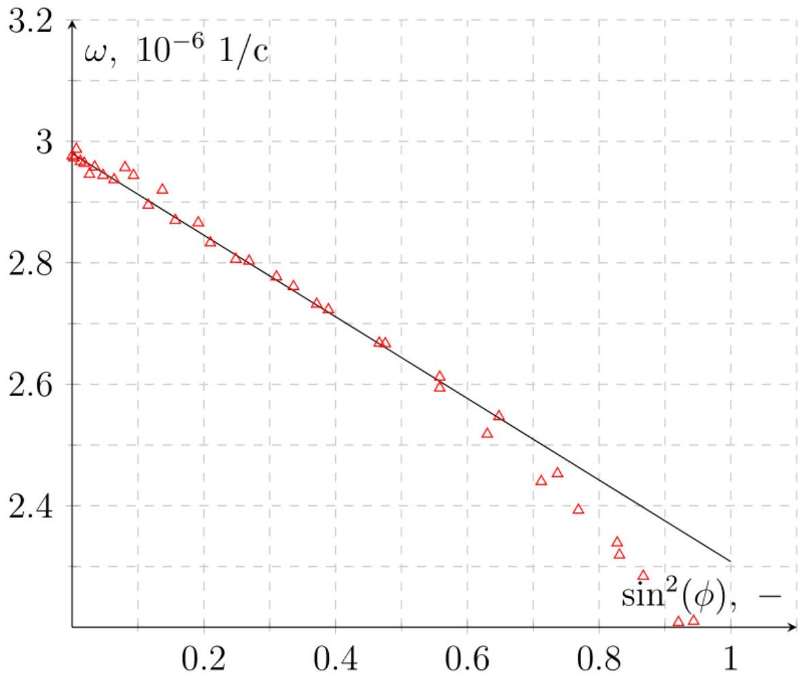
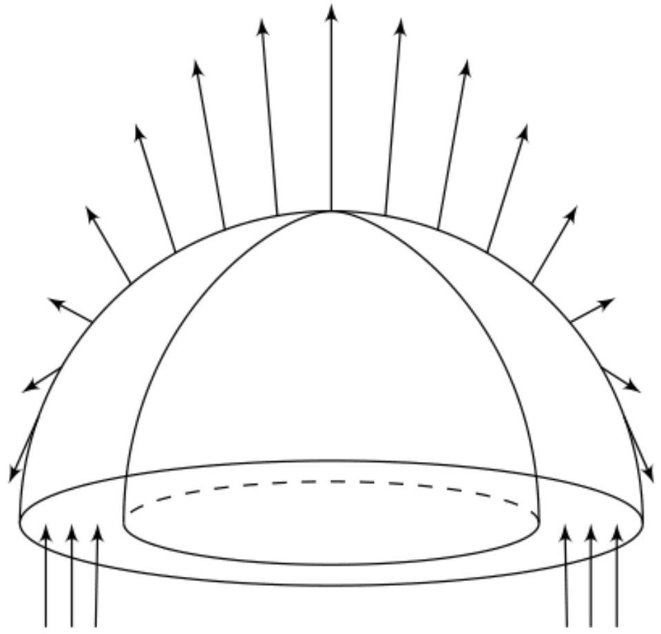
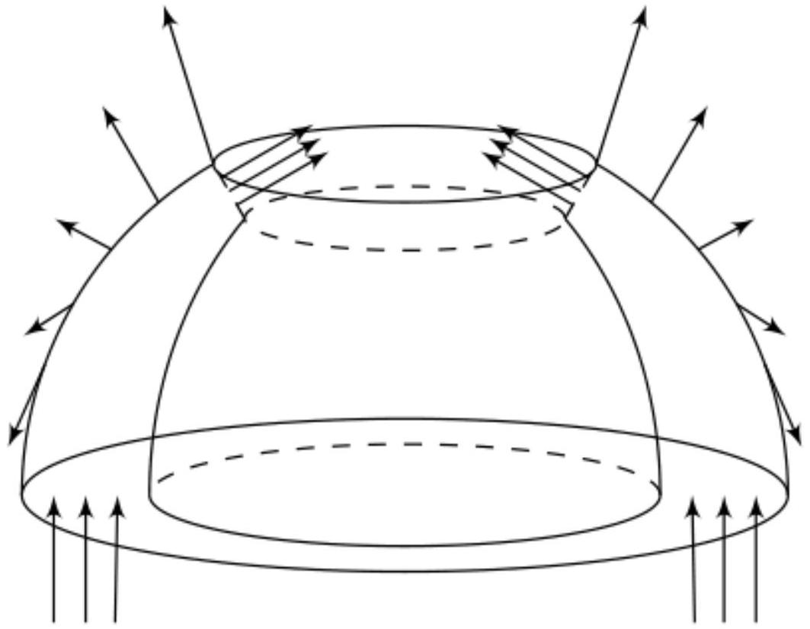
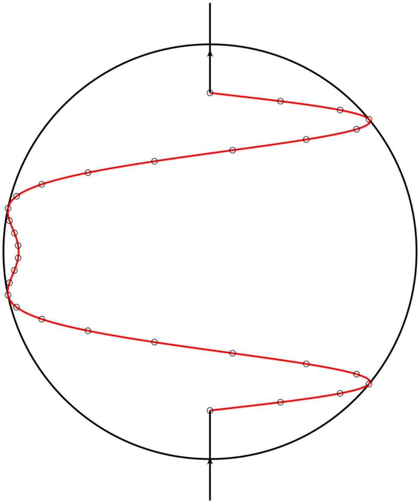
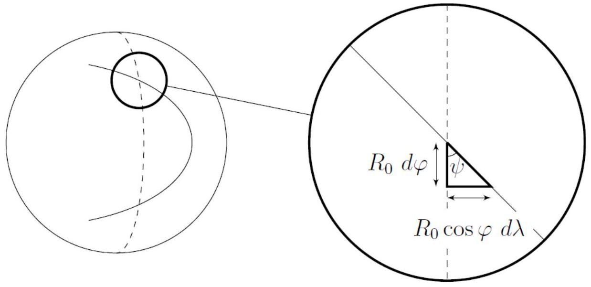
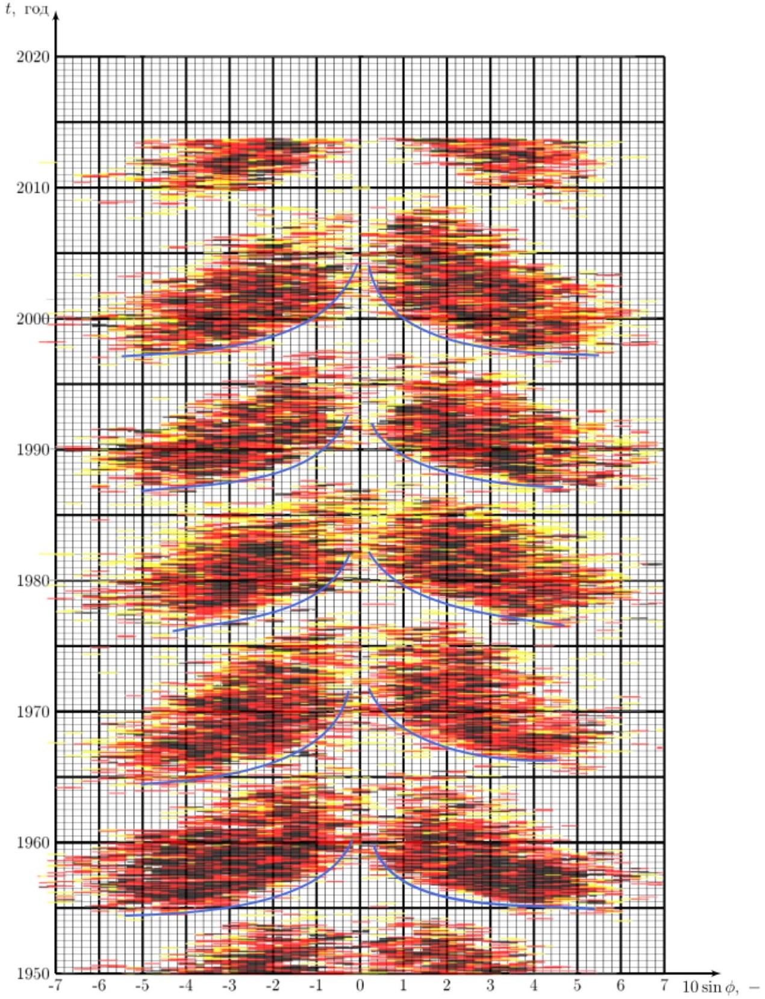

Построим график $\omega \left( \sin ^ { 2 } \varphi \right)$. По начальному участку проведем аппроксимирующую прямую, из которой находим параметры $a$ и $b$.

Ответ: $a = ( 2.99 \pm 0.2 ) \cdot 10 ^ { - 6 } 1 / \mathrm { c }$

Ответ: $b = 0.67 \cdot 10 ^ { - 6 } 1 / \mathrm { c }$

A2 ${ } ^ { 0.30 }$ Найдите границы применимости формулы, указанной выше.

Из графика находим угол $\varphi _ { \max }$ после которого точки значительно отклоняются от прямой.

Ответ: $\varphi _ { \text {max } } = 50 ^ { \circ }$

В1 ${ } ^ { 0.30 }$ Получите все составляющие магнитного поля на поверхности Солнца $B _ { 0 , r } ( \phi ) , B _ { 0 , \phi } ( \phi ) , B _ { 0 , \lambda } ( \phi )$. Ответы выразите через $\varphi , \mathfrak { M } , R _ { 0 }$ и $\mu _ { 0 }$.

Запишем поле магнитного диполя на широте $\varphi$ :

$$
\vec { B } ( \varphi ) = \frac { \mu _ { 0 } } { 4 \pi } \frac { \mathfrak { M } } { R _ { 0 } ^ { 3 } } ( 3 \vec { n } \sin \varphi - \vec { z } )
$$

Проецируя это на оси, соответствующие $r , \varphi$ и $\lambda$ получим:

Ответ:

$$
B _ { 0 , r } ( \varphi ) = \frac { \mu _ { 0 } } { 4 \pi } \frac { \mathfrak { M } } { R _ { 0 } ^ { 3 } } 2 \sin \varphi
$$

Ответ:

$$
B _ { 0 , \varphi } ( \varphi ) = - \frac { \mu _ { 0 } } { 4 \pi } \frac { \mathfrak { M } } { R _ { 0 } ^ { 3 } } \cos \varphi
$$

Ответ:

$$
B _ { 0 , \lambda } ( \varphi ) = 0
$$

Выберем поверхность натянутую на магнитные линии. Тогда поток магнитного поля через экваториальное сечение внутри Солнца равен потоку через одно из полушарий.

Таким образом $2 \pi R _ { 0 } H _ { 0 } B _ { e } = \Phi _ { 0 }$, значит $B _ { e } = \frac { \Phi _ { 0 } } { 2 \pi \xi R _ { 0 } ^ { 2 } } = 53$ мТл. С другой стороны мы можем посчитать поток $\Phi _ { 0 }$ проинтегрировав поле диполя:

$$
\Phi _ { 0 } = \int _ { 0 } ^ { \pi / 2 } B _ { 0 , r } 2 \pi R _ { 0 } ^ { 2 } \cos \varphi d \varphi = \frac { \mu _ { 0 } \mathfrak { M } } { R _ { 0 } } \int _ { 0 } ^ { \pi / 2 } \sin \varphi \cos \varphi d \varphi = \frac { \mu _ { 0 } \mathfrak { M } } { 2 R _ { 0 } }
$$

Подставим это в предыдущую формулу и полчучим следующее:

Ответ:

$$
B _ { e } = \frac { \mu _ { 0 } \mathfrak { M } } { 4 \pi \xi R _ { 0 } ^ { 3 } } .
$$

В3 ${ } ^ { 0.10 }$ Найдите численное значение $B _ { e }$.

Ответ:

$$
B _ { e } = \frac { \Phi _ { 0 } } { 2 \pi \xi R _ { 0 } ^ { 2 } } = 53 \text { мТл }
$$

B4 ${ } ^ { 0.60 }$ Получите величину магнитного поля $B _ { \varphi } ( \varphi )$ внутри Солнца у его поверхности в зависимости от широты $\varphi$. Ответ выразите через $\varphi , B _ { e }$.

Теперь тоже выберем поверхность, натянутую на магнитные линии. Только теперь она будет простираться от экватора до искомой широты $\varphi$.

Тогда для рассчета $B _ { \varphi }$ нужно найти поток $\Phi ( \varphi )$ магнитного поля диполя через часть широты от 0 до $\varphi$. Это уже знакомый нам интеграл:

$$
\Phi ( \varphi ) ( \varphi ) = \int _ { 0 } ^ { \varphi } B _ { 0 , r } 2 \pi R _ { 0 } ^ { 2 } \cos \varphi d \varphi = \frac { \mu _ { 0 } \mathfrak { M } } { 2 R _ { 0 } } \sin ^ { 2 } \varphi
$$

Поток через поверхность равен 0:

$$
\Phi ( \varphi ) + 2 \pi R _ { 0 } \cos \varphi H _ { 0 } \cos ^ { 2 } \varphi B _ { \varphi } ( \varphi ) = \Phi _ { 0 }
$$

тогда:

$$
2 \pi \xi R _ { 0 } ^ { 2 } \cos ^ { 3 } \varphi B _ { \varphi } ( \varphi ) = \Phi _ { 0 } \cos ^ { 2 } \varphi .
$$

Значит

Ответ:

$$
B _ { \varphi } = \frac { B _ { e } } { \cos \varphi } .
$$

С1 ${ } ^ { 1.70 }$ Точно рассчитайте 30 пар точек ( $\varphi , \lambda$ ), через которые будет проходить магнитная линия, пронизывающая точки $\varphi = \pm 50 ^ { \circ } , \lambda = 0$ в момент времени $t = 150$ дней.

Пусть магнтная линия проходит через точки $\left( \pm \varphi _ { 0 } , \lambda _ { 0 } \right)$, где $\varphi _ { 0 } = 50 ^ { \circ } , \lambda _ { 0 } = 0 ^ { \circ }$. Тогда ее уравнение в угловых координатах задается следующим образом:

$$
\lambda = \omega ( \varphi ) t = \left( a - b \sin ^ { 2 } \varphi \right) t
$$

С2 ${ } ^ { 1.00 }$ Используя эти данные постройте в листе ответов, как будет выглядеть эта линия для земного наблюдателя.

Точки с уголовыми координатами в плоскости имеют следующие координаты:

$$
\left\{ \begin{array} { l }
x = R \cdot \sin \lambda \cos \varphi \\
y = R \cdot \sin \varphi
\end{array} \right.
$$

Проведем через пересчитанные точки линию:

с3 ${ } ^ { 0.30 }$ Найдите угол $\psi ( \varphi , t )$, который составляют магнитные линии с меридианом. Ответ выразите через $\varphi , t , a , b$.

Из картинки ясно, что

$$
\tan \psi = \frac { d \lambda } { d \varphi } \cos \varphi = 2 b t \sin \varphi \cos ^ { 2 } \varphi
$$

откуда

Ответ:

$$
\psi = \arctan \left( 2 b t \sin \varphi \cos ^ { 2 } \varphi \right) .
$$

C4 ${ } ^ { 0.20 }$ Пусть внутри Солнца вблизи его поверхности магнитные линии составляют угол $\psi$ с меридианом. Найдите модуль магнитного поля $B$ в этой точке. Ответ выразите через $\psi , \varphi , B _ { e }$.

Поток магнитного поля через поверхности, рассмотренные в части В не должен поменяться, поэтому $B _ { \varphi } =$ const. Тогда

$$
B = \frac { B _ { \varphi } } { \cos \psi }
$$

и, следовательно,

Ответ:

$$
\frac { B _ { e } } { \cos \varphi \cos \psi }
$$

В приближении $\sin \psi \approx 1$ выполняется, что $\tan \psi = 1 / \cos \psi$, поэтому:

$$
B = \frac { B _ { e } \tan \psi } { \cos \varphi } = 2 B _ { e } b t \sin \varphi ,
$$

значит вид кривой, $\varphi ( t )$, на которой на Солнце появляются пятна описывается следующим выражением:

$$
B _ { \text {крит } } = 2 B _ { e } b t \sin \varphi ,
$$

т.е. ее линеаризация следующая:

$$
t = \frac { A } { \sin 2 \varphi } ,
$$

где $A = \frac { B _ { \text {крит } } } { B _ { e } b }$, а $t$ отсчитывается от начала 11-летнего солнечного цикла (одна "бабочка" на диаграмме Маундера).
Строя огибающую на диаграмме Маундера, получим зависимость $t ( \sin 2 \varphi )$ для критических точек (появления пятен). Из нее найдем $A$, а затем $B _ { \text {крит } }$.

Ответ:

$$
B _ { \text {крит } } = ( 15 \pm 5 ) \text { мТл }
$$

D2 ${ } ^ { 0.20 }$ Определите период солнечной активности $T _ { 0 }$, т.е. время через которое магнитное поля Солнца возвращается в исходное состояние.

Период находим, как время между двуями точками с совпадающей «фазой» деленное на количество циклов:
$T = 11$ лет. Далее это число нужно еще увеличить в 2 раза, так как после одного цикла поле меняет направление.

Ответ:

$$
T _ { 0 } = 22 \text { года }
$$
