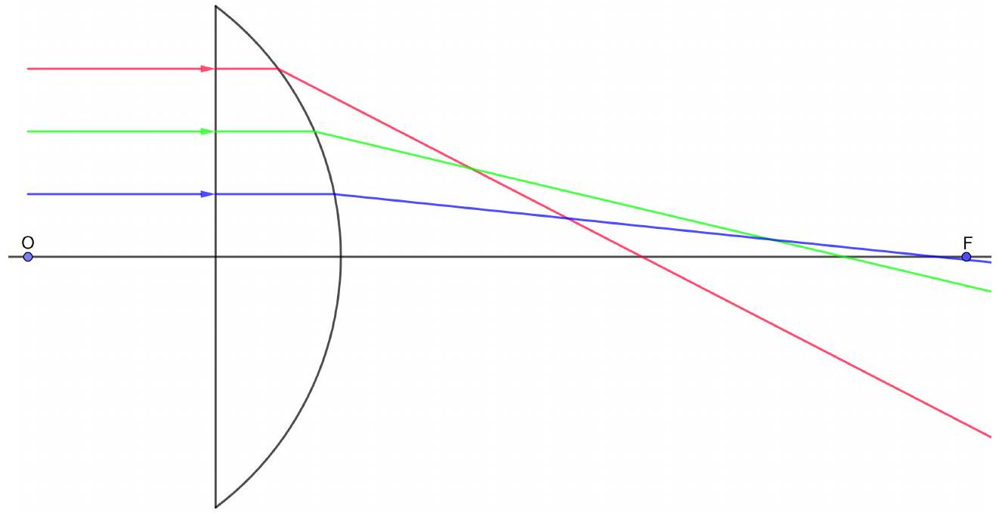
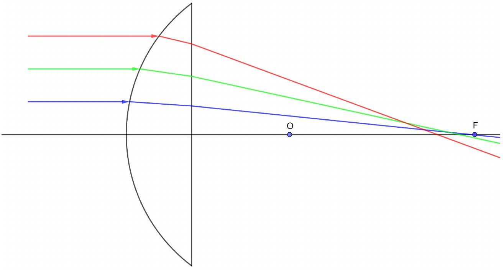
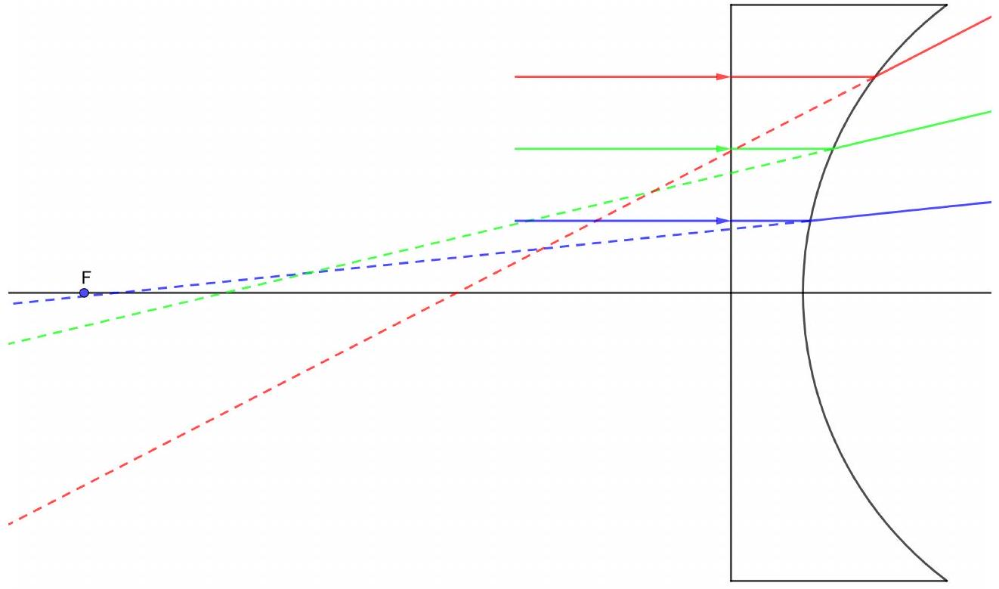
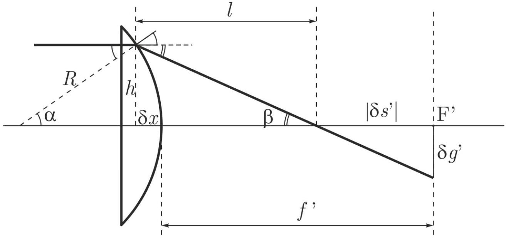
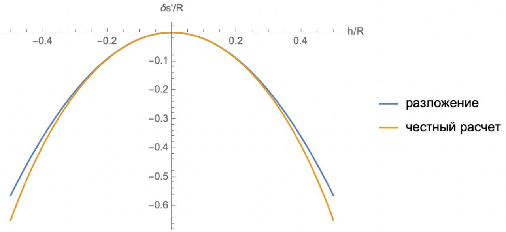
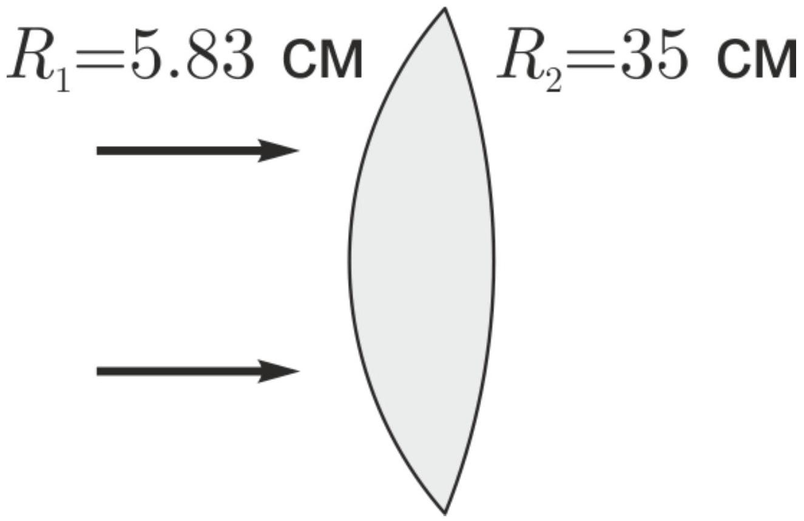
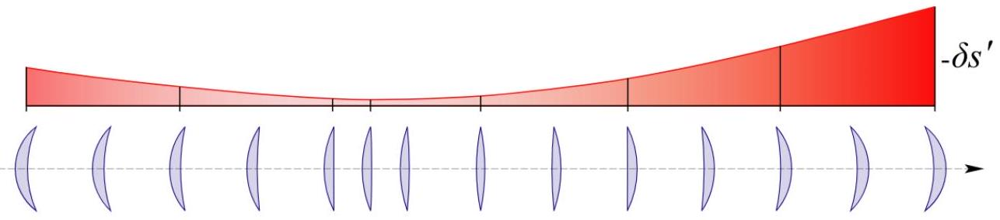
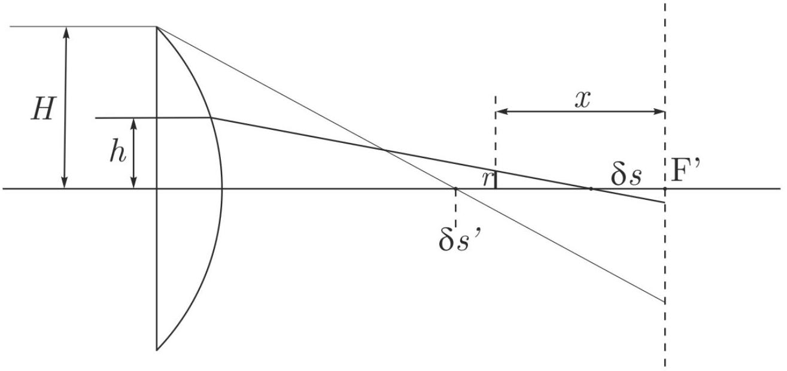

Заметим, что радиус линзы составляет 4 см, толщина линзы - 2 см, а падающие лучи нарисованы через каждый сантиметр от оптической оси линзы. Для плоско-выпуклой (первая) и плоско-вогнутой (третья) линзы преломление происходит только на одной поверхности. Положение фокуса для первой и третей линзы отмечаем используя формулу тонкой линзы:

$$
F = \frac { R } { n - 1 } = 10 \text { см. }
$$

Это расстояние отсчитывается от изогнутой поверхности.
Для выпукло-плоской (вторая) линзы преломление происходит сразу на двух поверхностях. Чтобы найти положение фокуса, учтём, что такая линза является толстой. После первого преломления лучи внутри стекла будут собираться на расстоянии $\frac { n } { n - 1 } R = 15$ см от изогнутой поверхности, то есть на расстоянии 13 см от плоской поверхности. При преломлении на плоской поверхности изображение окажется в $n$ раз ближе, то есть на расстоянии 8.67 см. Итого, получаем фокус на расстоянии 10.67 см от изогнутой поверхности.
Чтобы построить преломление лучей, используем транспортир, линейку и закон Снелиуса:
$n _ { 1 } \sin \alpha = n _ { 2 } \sin \beta$,
где $\alpha$ - угол падения, $\beta$ - угол преломления, $n _ { 1 }$ и $n _ { 2 }$ - коэффициенты преломления сред по разные стороны границы.

Ответ:

Ответ:

Ответ:

A2 ${ } ^ { 0.30 }$ Измерьте величину максимальной сферической аберрации $\delta s ^ { \prime }$ для всех построений. Запишите результаты (в мм) в лист ответов.

По результатам построений измеряем максимальную величину аберрации. Для выпукло-плоской эффект аберраций оказывается меньше. Ниже приведены результаты с точностью до десятых мм, полученные путём расчётов.

Ответ: Плоско-выпуклая $\delta s _ { \max } ^ { \prime } = - 51.8 \mathrm {~mm}$
Выпукло-плоская $\delta s _ { \text {max } } ^ { \prime } = - 11.5 \mathrm {~mm}$
Плоско-вогнутая $\delta s _ { \text {max } } ^ { \prime } = - 51.8 \mathrm { mM }$

В1 ${ } ^ { 0.25 }$ Чему равно фокусное расстояние $f ^ { \prime }$ для тонкой плоско-выпуклой линзы?

Для тонкой линзы

$$
\frac { 1 } { f ^ { \prime } } = ( n - 1 ) \left( \frac { 1 } { R _ { 1 } } + \frac { 1 } { R _ { 2 } } \right)
$$

в нашем случае $R _ { 1 } = \infty , R _ { 2 } = R$. Отсюда получаем ответ.

Ответ: $f ^ { \prime } = \frac { R } { n - 1 }$

В2 ${ } ^ { 1.50 }$ Для данной линзы найдите зависимость величины продольной сферической аберрации $\delta s ^ { \prime }$ от полуширины пучка $h$. Ответ выразите через $R , n$ и $h$. Запишите приближенное выражение для $\delta s ^ { \prime } ( h )$, разложив ответ в ряд Тейлора по степеням $h$ до $h ^ { 2 }$.
Постройте схематический график полученной зависимости.

Согласно геометрии (рис. B2) и закону Снеллиуса:

$$
n \sin \alpha = \sin ( \alpha + \beta ) .
$$

Выразим углы через отрезки и показатель преломления:

$$
\alpha = \arcsin \frac { h } { R } , \quad \alpha + \beta = \arcsin \frac { n h } { R } .
$$

Расстояние $l$ вдоль оптической оси от точки преломления до точки пересечения с оптической осью:

$$
l = h \operatorname { ctg } \beta = h \operatorname { ctg } \left( \arcsin \left( \frac { n h } { R } \right) - \arcsin \left( \frac { h } { R } \right) \right) .
$$

Преломление происходит в точке, смещенной на

$$
\delta x = R - \sqrt { R ^ { 2 } - h ^ { 2 } } .
$$

Выразим $\delta s ^ { \prime }$ :

$$
\delta s ^ { \prime } = l - \delta x - f ^ { \prime } .
$$

Подставим $l$ и $\delta x$ найденные ранее, подставим $f ^ { \prime }$ из В1, получим ответ.

Ответ: Ответ для $\delta s ^ { \prime }$

$$
\delta s ^ { \prime } = \frac { \sqrt { R ^ { 2 } - n ^ { 2 } h ^ { 2 } } \sqrt { R ^ { 2 } - h ^ { 2 } } + n h ^ { 2 } } { n \sqrt { R ^ { 2 } - h ^ { 2 } } - \sqrt { R ^ { 2 } - n ^ { 2 } h ^ { 2 } } } - \frac { n R } { n - 1 } + \sqrt { R ^ { 2 } - h ^ { 2 } }
$$

или

$$
\delta s ^ { \prime } = \frac { n \sqrt { R ^ { 2 } - h ^ { 2 } n ^ { 2 } } + \sqrt { R ^ { 2 } - h ^ { 2 } } } { n ^ { 2 } - 1 } - \frac { n R } { n - 1 } + \sqrt { R ^ { 2 } - h ^ { 2 } }
$$

или

$$
h \operatorname { ctg } \left( \arcsin \left( \frac { n h } { R } \right) - \arcsin \left( \frac { h } { R } \right) \right) - \frac { n R } { n - 1 } + \sqrt { R ^ { 2 } - h ^ { 2 } } .
$$

Ответ: Разложение $\delta s ^ { \prime } = - \frac { h ^ { 2 } n ^ { 2 } } { 2 R ( n - 1 ) }$

Ответ:

В3 ${ } ^ { 0.50 }$ Найдите величину поперечной сферической аберрации $\delta g ^ { \prime }$. Ответ выразите через $\delta s ^ { \prime } , f ^ { \prime }$ и $h$.

Из подобия треугольников (рис. В2) получаем

$$
\frac { h } { l } = \frac { \delta g ^ { \prime } } { \left| \delta s ^ { \prime } \right| }
$$

Считая аберрации малыми ( $l = f ^ { \prime }$ ), выражаем ответ.

Ответ: Из подобия треугольников:

$$
\delta g ^ { \prime } = \left| \delta s ^ { \prime } \right| \frac { h } { f ^ { \prime } }
$$

В4 ${ } ^ { 1.50 }$ Разобьем кружок рассеяния кольцами радиусов $0.2 \delta g ^ { \prime } , 0.4 \delta g ^ { \prime } , 0.6 \delta g ^ { \prime } , 0.8 \delta g ^ { \prime }$.
С какой доли (в 1\%) поперечной площади падающего пучка собираются лучи в центральный круг (радиуса $0.2 \delta g ^ { \prime }$ )? С какой доли (в 1\%) поперечной площади падающего пучка собираются лучи в последующие кольца (между $0.2 \delta g ^ { \prime }$ и $0.4 \delta g ^ { \prime }$ и так далее соответственно)? Какую долю площади кружка рассеяния занимает каждое кольцо? Сведите все расчеты в таблицу в листе ответов. Постройте схематический график зависимости интенсивности света от радиальной координаты в кружке рассеяния.

Считаем доли площади каждого кольца:

$$
\begin{array} { c l }
0 \div 0.2 \delta g ^ { \prime } : & 0.2 ^ { 2 } - 0 ^ { 2 } = 0.04 = 4 \% \\
0.2 \delta g ^ { \prime } \div 0.4 \delta g ^ { \prime } : & 0.4 ^ { 2 } - 0.2 ^ { 2 } = 0.12 = 12 \% \\
0.4 \delta g ^ { \prime } \div 0.6 \delta g ^ { \prime } : & 0.6 ^ { 2 } - 0.4 ^ { 2 } = 0.20 = 20 \% \\
0.6 \delta g ^ { \prime } \div 0.8 \delta g ^ { \prime } : & 0.8 ^ { 2 } - 0.6 ^ { 2 } = 0.28 = 28 \% \\
0.8 \delta g ^ { \prime } \div 1.0 \delta g ^ { \prime } : & 1.0 ^ { 2 } - 0.8 ^ { 2 } = 0.36 = 36 \%
\end{array}
$$

Из пункта В2 получаем $\left| \delta s ^ { \prime } \right| \sim h ^ { 2 }$. Учитывая пункт В3 получаем, что $\delta g ^ { \prime } \sim h ^ { 3 }$.
Считаем доли площади колец в падающем пучке:

$$
\begin{array} { c l }
0 \div 0.2 \delta g ^ { \prime } : & 0.2 ^ { 2 / 3 } - 0 ^ { 2 / 3 } = 0.34 = 34 \% ; \\
0.2 \delta g ^ { \prime } \div 0.4 \delta g ^ { \prime } : & 0.4 ^ { 2 / 3 } - 0.2 ^ { 2 / 3 } = 0.20 = 20 \% ; \\
0.4 \delta g ^ { \prime } \div 0.6 \delta g ^ { \prime } : & 0.6 ^ { 2 / 3 } - 0.4 ^ { 2 / 3 } = 0.17 = 17 \% ; \\
0.6 \delta g ^ { \prime } \div 0.8 \delta g ^ { \prime } : & 0.8 ^ { 2 / 3 } - 0.6 ^ { 2 / 3 } = 0.15 = 15 \% ; \\
0.8 \delta g ^ { \prime } \div 1.0 \delta g ^ { \prime } : & 1.0 ^ { 2 / 3 } - 0.8 ^ { 2 / 3 } = 0.14 = 14 \% ;
\end{array}
$$

Если разделить долю площади в падающем кольце на долю площади кольца в фокальной плоскости, то получим величину пропорциональную интенсивности. Получается качественно график $I \sim r ^ { - 4 / 3 }$.

Ответ:

| Кольцо | Доля пучка | Доля площади кружка |
| :--- | :--- | :--- |
| 0.0-0.2 | 34\% | 4\% |
| 0.2-0.4 | 20\% | 12\% |
| 0.4-0.6 | 17\% | 20\% |
| 0.6-0.8 | 15\% | 28\% |
| 0.8-1.0 | 14\% | 36\% |

С1 ${ } ^ { 0.30 }$ Используя теорему синусов для треугольников $M S C$ и $M S ^ { \prime } C$, а также закон преломления Снеллиуса, получите инвариант вида $n \cdot f ( r , s , p ) = n ^ { \prime } \cdot f \left( r , s ^ { \prime } , p ^ { \prime } \right) = \mathrm { inv }$.

Теорема синусов для треугольника $M S C$ (см. рис. 2 из условия):

$$
\frac { \sin \theta } { p } = \frac { \sin \angle S M C } { r - s } .
$$

Теорема синусов для треугольника $M S ^ { \prime } C$ :

$$
\frac { \sin \theta } { p ^ { \prime } } = \frac { \sin \angle S ^ { \prime } M C } { r - s ^ { \prime } } .
$$

Закон преломления:

$$
n \sin \angle S M C = n ^ { \prime } \sin \angle S ^ { \prime } M C .
$$

Выразим из теоремы синусов $\sin \angle S M C$ и $\sin \angle S ^ { \prime } M C$, подставим в закон преломления, получим инвариант

Ответ: $\frac { n ( r - s ) } { p } = \mathrm { inv }$

С2 ${ } ^ { 0.10 }$ Воспользовавшись теоремой косинусов в треугольнике $M S C$, перейдите в инварианте от величины $p$ к углу $\theta$.
Считая угол $\theta$ малым, разложите множители в виде корней в ряд Тейлора до первого слагаемого с ненулевой степенью $\theta$.
Разделите полученное приближенное значение на «- г» и получите приведенное значение инварианта.

Теорема косинусов

$$
p ^ { 2 } = r ^ { 2 } + ( r - s ) ^ { 2 } - 2 r ( r - s ) \cos \theta .
$$

Используя разложение косинуса и полный квадрат

$$
p ^ { 2 } = ( r - ( r - s ) ) ^ { 2 } + 2 r ( r - s ) \cdot \frac { \theta ^ { 2 } } { 2 } .
$$

Подставляем в инвариант, получаем:

$$
\frac { n ( r - s ) } { \sqrt { s ^ { 2 } + r ( r - s ) \theta ^ { 2 } } } = \frac { n ( r - s ) } { s } \left( 1 - \frac { r ( r - s ) } { 2 s ^ { 2 } } \right) .
$$

Разделим на «-r», получим ответ.

Ответ: $\frac { n ( r - s ) } { \sqrt { s ^ { 2 } + r ( r - s ) \theta ^ { 2 } } } = \operatorname { inv }$

$$
n \left( \frac { 1 } { r } - \frac { 1 } { s } \right) \left( 1 - \frac { r ( r - s ) \theta ^ { 2 } } { 2 s ^ { 2 } } \right) = \operatorname { inv }
$$

C3 ${ } ^ { 0.10 }$ Записав инвариант из пункта C2 для параксиальных лучей до и после преломления, покажите инвариантность величины $Q \left( s _ { 0 } \right)$.

Положим $\theta = 0$ в инварианте пункта С2.

Ответ: $n \left( \frac { 1 } { r } - \frac { 1 } { s _ { 0 } } \right) = n ^ { \prime } \left( \frac { 1 } { r } - \frac { 1 } { s _ { 0 } ^ { \prime } } \right) = Q ( s ) = \operatorname { inv }$

С4 ${ } ^ { 0.10 }$ Левая часть инварианта, полученного в С2, является функцией $f$ от $s$ и $\theta$. Найдите значение $f ( s , \theta ) - f \left( s _ { 0 } , \theta \right)$. Считайте, что $\delta s$ и $\theta$ являются малыми параметрами.

Инвариант является функцией от $s$ и от $\theta$ :

$$
f ( s , \theta ) = n \left( \frac { 1 } { r } - \frac { 1 } { s } \right) \left( 1 - \frac { r ( r - s ) \theta ^ { 2 } } { 2 s ^ { 2 } } \right) .
$$

Находим значение разницы, учитываем что $\theta$ одинаковый:

$$
f ( s , \theta ) - f \left( s _ { 0 } , \theta \right) = \frac { \partial f } { \partial s } d s .
$$

Так как $\theta$ тоже малая величина, то

$$
\frac { \partial f } { \partial s } = n \frac { 1 } { s ^ { 2 } }
$$

Ответ:

$$
\frac { n \delta s } { s _ { 0 } ^ { 2 } }
$$

С5 ${ } ^ { 0.20 }$ Используя результаты предыдущих пунктов, выразив малый угол $\theta$ через радиус кривизны поверхности и малую высоту $h$, получите искомое соотношение:

$$
\frac { n ^ { \prime } \delta s ^ { \prime } } { s _ { 0 } ^ { \prime 2 } } - \frac { n \delta s } { s _ { 0 } ^ { 2 } } = - \frac { h ^ { 2 } } { 2 } Q ^ { 2 } \left( s _ { 0 } \right) \left( \frac { 1 } { n ^ { \prime } s _ { 0 } ^ { \prime } } - \frac { 1 } { n s _ { 0 } } \right) .
$$

Выразим угол $\theta$ через $h$ :

$$
\theta = \frac { h } { r } .
$$

Представим выражение через $Q ( s )$ :

$$
\frac { r ( r - s ) \theta ^ { 2 } } { 2 s ^ { 2 } } = \frac { ( r - s ) h ^ { 2 } } { 2 s ^ { 2 } r } = n \left( \frac { 1 } { s } - \frac { 1 } { r } \right) \frac { h ^ { 2 } } { 2 n s } = Q ( s ) \frac { h ^ { 2 } } { 2 n s } .
$$

Следующие величины инвариантны

$$
\begin{aligned}
f ( s , \theta ) & = f \left( s ^ { \prime } , \theta \right) , \\
f \left( s _ { 0 } , \theta \right) + \frac { n \delta s _ { 0 } } { s _ { 0 } ^ { 2 } } & = f \left( s _ { 0 } ^ { \prime } , \theta \right) + \frac { n ^ { \prime } \delta s ^ { \prime } } { s _ { 0 } ^ { \prime 2 } } , \\
n \left( \frac { 1 } { r } - \frac { 1 } { s _ { 0 } } \right) \left( 1 - \frac { r \left( r - s _ { 0 } \right) \theta ^ { 2 } } { 2 s _ { 0 } ^ { 2 } } \right) + \frac { n \delta s } { s _ { 0 } ^ { 2 } } & = n \left( \frac { 1 } { r } - \frac { 1 } { s _ { 0 } ^ { \prime } } \right) \left( 1 - \frac { r \left( r - s _ { 0 } ^ { \prime } \right) \theta ^ { 2 } } { 2 s _ { 0 } ^ { \prime 2 } } \right) + \frac { n ^ { \prime } \delta s ^ { \prime } } { s _ { 0 } ^ { \prime 2 } } , \\
Q \left( s _ { 0 } \right) - \frac { h ^ { 2 } } { 2 n s _ { 0 } } Q ^ { 2 } \left( s _ { 0 } \right) + \frac { n \delta s } { s _ { 0 } ^ { 2 } } & = Q \left( s _ { 0 } ^ { \prime } \right) - \frac { h ^ { 2 } } { 2 n ^ { \prime } s _ { 0 } ^ { \prime } } Q ^ { 2 } \left( s _ { 0 } ^ { \prime } \right) + \frac { n ^ { \prime } \delta s ^ { \prime } } { s _ { 0 } ^ { \prime 2 } }
\end{aligned}
$$

Пользуемся тем, что $Q \left( s _ { 0 } \right) = Q \left( s _ { 0 } ^ { \prime } \right)$, получаем выражение

$$
\frac { n ^ { \prime } \delta s ^ { \prime } } { s _ { 0 } ^ { \prime 2 } } - \frac { n \delta s } { s _ { 0 } ^ { 2 } } = - \frac { h ^ { 2 } } { 2 } Q ^ { 2 } \left( s _ { 0 } \right) \left( \frac { 1 } { n ^ { \prime } s _ { 0 } ^ { \prime } } - \frac { 1 } { n s _ { 0 } } \right) .
$$

Ответ: ЧТД

C6 ${ } ^ { 0.20 }$ Покажите, что аберрации предмета и изображения после $k$-й преломляющей поверхности, связаны соотношением:

$$
n _ { k } ^ { \prime } \delta s _ { k } ^ { \prime } \alpha _ { k } ^ { \prime 2 } - n _ { 1 } \delta s _ { 1 } \alpha _ { 1 } ^ { 2 } = - \frac { 1 } { 2 } \sum _ { i = 1 } ^ { k } h _ { i } ^ { 4 } Q _ { i } ^ { 2 } ( s ) \left( \frac { 1 } { n _ { i } ^ { \prime } s _ { i } ^ { \prime } } - \frac { 1 } { n _ { i } s _ { i } } \right) .
$$

Иными словами, для вычисления суммарной аберрации нужно по всем поверхностям сложить правые части доказанного соотношения, умноженного на $h _ { i } ^ { 2 }$.

Перейдём от $s _ { i }$ к углам в левой части формулы из С5:

$$
\alpha _ { i } = \frac { h _ { i } } { s _ { i } } , \quad \alpha ^ { \prime } = \frac { h _ { i } } { s _ { i } ^ { \prime } } .
$$

При прохождении луча между преломляющими поверхностями меняется расстояние от луча до оптической оси, однако, сохраняется угол наклона:

$$
\begin{gathered}
\alpha _ { i } ^ { \prime } = \alpha _ { i + 1 } , \\
n _ { i } ^ { \prime } = n _ { i + 1 } , \\
\delta s _ { i } ^ { \prime } = \delta s _ { i + 1 } .
\end{gathered}
$$

Складывая такие выражения

$$
n _ { i } ^ { \prime } \delta s _ { i } ^ { \prime } \alpha _ { i } ^ { \prime 2 } - n _ { i } \delta s _ { i } \alpha _ { i } ^ { 2 } = - \frac { h _ { i } ^ { 4 } } { 2 } Q _ { i } ^ { 2 } \left( s _ { i } \right) \left( \frac { 1 } { n _ { i } ^ { \prime } s _ { i } ^ { \prime } } - \frac { 1 } { n _ { i } s _ { i } } \right) .
$$

в левой части остаётся только два слагаемых: одно соответствует вхождению лучей в оптическую систему, другое - вхождению из неё. Тем самым можно вычислять аберрации для сложных систем.

Ответ: ЧТД

D1 ${ } ^ { 2.00 }$ Найдите сферическую аберрацию $\delta s _ { 2 } ^ { \prime }$ тонкой собирающей линзы для падающего параллельного пучка света. Примените результат пункта С6 для двух преломляющих поверхностей и формулу тонкой линзы, оставив зависимость только от радиуса кривизны первой поверхности (куда падает исходный пучок света). Ответ выразите через показатель преломления $n$ и обратные величины $\rho = 1 / r$ и $\varphi = 1 / f ^ { \prime }$.

Будем использовать соглашение о знаках как в части С. Тогда

$$
s _ { 1 } = \infty , \quad s _ { 2 } ^ { \prime } = - f .
$$

Положение изображения после первого преломления:

$$
s _ { 1 } ^ { \prime } = s _ { 2 } = r \frac { n } { n - 1 } .
$$

Формула тонкой линзы позволяет найти радиус кривизны $r _ { 2 }$ второй поверхности при заданном фокусе $f$ и радиусе первой поверхности $r$ :

$$
\frac { 1 } { f } = ( n - 1 ) \left( - \frac { 1 } { r } + \frac { 1 } { r _ { 2 } } \right) .
$$

Так как линза тонкая, то $h _ { 1 } = h _ { 2 } = h$.
Левая часть формулы C6:

$$
\begin{gathered}
n _ { 2 } ^ { \prime } \delta s _ { 2 } ^ { \prime } \alpha _ { 2 } ^ { \prime 2 } - n _ { 1 } \delta s _ { 1 } \alpha _ { 1 } ^ { 2 } = \delta s _ { 2 } ^ { \prime } \left( \frac { h } { f } \right) ^ { 2 } . \\
Q _ { 1 } = \frac { 1 } { r } = \rho . \\
Q _ { 2 } = \frac { 1 } { r _ { 2 } } - \frac { 1 } { - f } = \frac { n } { n - 1 } \varphi + \rho .
\end{gathered}
$$

Собираем всё вместе:

$$
\delta s _ { 2 } ^ { \prime } = - \frac { h ^ { 2 } } { 2 \varphi ^ { 2 } } \left( Q _ { 1 } ^ { 2 } \frac { n - 1 } { n ^ { 2 } } \rho + Q _ { 2 } ^ { 2 } \left( - \varphi - \frac { n - 1 } { n ^ { 2 } } \rho \right) \right)
$$

получаем ответ.

Ответ: $\delta s _ { 2 } ^ { \prime } = \frac { h ^ { 2 } } { 2 } \left[ \frac { \rho ^ { 2 } } { \varphi } \frac { n + 2 } { n } + \rho \frac { 2 n + 1 } { n - 1 } + \varphi \frac { n ^ { 2 } } { ( n - 1 ) ^ { 2 } } \right]$

D2 ${ } ^ { 0.50 }$ Найдите значение $\rho ^ { * }$, при котором сферическая аберрация $\delta s _ { 2 } ^ { \prime }$ минимальна. Ответ выразите через $n$ и $\varphi$.

Выражение в квадратных скобках в D1 представляет собой параболу относительно $\rho$, ветви вверх. Минимальная аберрация (по модулю) будет соответствовать вершине. Отсюда получаем значение для $\rho ^ { * }$.

Заметим, что данные рассуждения верны только лишь тогда, когда парабола не пересекает горизонтальную ось. Ведь если она пересекает, то вообще говоря можно получить нулевую аберрацию. Предположим, что пересекает. Тогда дискриминант должен быть неотрицательным:

$$
\begin{gathered}
D = \frac { 1 - 4 n } { ( n - 1 ) ^ { 2 } } \geq 0 \\
n \leq 1 / 4
\end{gathered}
$$

Но для собирающей линзы $n > 1$, поэтому, в действительности парабола не пересекает горизонтальную ось в наших условиях.

Ответ: $\rho ^ { * } = - \frac { \varphi } { 2 } \frac { 2 n + 1 } { n - 1 } \frac { n } { n + 2 }$

D3 ${ } ^ { 0.50 }$ Рассчитайте значение радиусов кривизны поверхностей линзы. Нарисуйте (качественно) вашу рассчитанную линзу в листе ответов.

Ответ: $R _ { 1 } = - 5.83 \mathrm {~cm} , R _ { 2 } = + 35 \mathrm {~cm}$, т.е. линза двояко-выпуклая, а меньший радиус кривизны обращен в сторону падающего пучка света.

Ответ:

D4 ${ } ^ { 0.50 }$ Схематично изобразите график зависимости модуля продольной сферической аберрации $\delta s _ { 2 } ^ { \prime }$ для линз, приведенных на рисунке 4.

E1 ${ } ^ { 1.50 }$ В какую сторону и на какое расстояние нужно сместить плоскость наблюдения от фокальной плоскости, чтобы кружок рассеяния был минимального размера?

Используется факт из части B, что аберрация квадратична по удалённости луча от оптической оси $h$ :

$$
\delta s = \frac { h ^ { 2 } } { \varepsilon } , \quad \delta s ^ { \prime } = \frac { H ^ { 2 } } { \varepsilon }
$$

где $\varepsilon$ - некий коэффициент (размерности длины). Здесь $H$ - радиус линзы (максимально удалённый луч), $h$ - произвольный луч. Аналогично, $\delta s ^ { \prime }$ - максимальная аберрация, $\delta s$ - точка пересечения оптической оси лучем $h$. Если что тут $\delta s$ и $\delta s ^ { \prime }$ положительные, отчитываются от фокуса в сторону линзы. Расстояние $r$ от оси до точки луча на расстоянии $x$ от фокуса, который до преломления идёт на расстоянии $h$ от оси можно найти из подобия (рис. Е1):

$$
\frac { r } { x - \delta s } = \frac { h } { f } .
$$

Получается что $r$ есть функция плоскости наблюдения $x$ и луча $h$ :

$$
r ( x , h ) = \frac { 1 } { f } \left( x h - \frac { h ^ { 3 } } { \varepsilon } \right) .
$$

Находим, при каком $h$ при некотором фиксированном $x$ будет максимум

$$
h _ { 1 } = \sqrt { \frac { \varepsilon } { 3 } } x ^ { 1 / 2 } .
$$

Максимальный радиус пучка в зависимости от плоскости наблюдения

$$
r _ { \max } ( x ) = \frac { 2 \varepsilon ^ { 1 / 2 } x ^ { 3 / 2 } } { 3 ^ { 3 / 2 } f } .
$$

Это получается некоторая огибающая, которую мы получаем, смотря на лучи, которые не пересекают оптическую ось. Чем ближе к фокусу, тем меньше размер кружка, который дают эти лучи. Однако, ещё есть лучи, которые пересекают оптическую ось и при приближении к фокусу увеличивают размер кружка. Зависимость расстояния от оси до точки луча для крайнего противоположного луча от координаты

$$
y ( x ) = \frac { H } { f } \left( \delta s ^ { \prime } - x \right) .
$$

Минимальный кружок будет там, где эти эффекты равны $r _ { \max } ( x ) = y ( x )$ :

$$
\frac { 2 \varepsilon ^ { 1 / 2 } x ^ { 3 / 2 } } { 3 ^ { 3 / 2 } f } = \frac { H } { f } \left( \delta s ^ { \prime } - x \right) ,
$$

$$
\frac { 2 } { 3 ^ { 3 / 2 } } \left( \frac { x } { \delta s ^ { \prime } } \right) ^ { 3 / 2 } = \left( 1 - \frac { x } { \delta s ^ { \prime } } \right) .
$$

Решая это уравнение, получаем ответ

$$
x = \frac { 3 } { 4 } \delta s ^ { \prime } .
$$

Ответ: К линзе на расстояние $\frac { 3 } { 4 } \left| \delta s ^ { \prime } \right|$.

E2 ${ } ^ { 1.50 }$ Постройте схематический график зависимости интенсивности света от радиальной координаты в минимальном кружке рассеяния. Для этого выполните шаги, аналогичные пункту B4.

Ответим в начале на вопрос: как радиус окружности $( r )$ в плоскости E1 соотносится с радиусом окружности $( h )$ в пучке, падающем на линзу? Из прошлого пункта оказывается, что они связаны следующим образом:

$$
r = h \left| 3 - 4 h ^ { 2 } \right| ,
$$

здесь $r$ - отнормировано на максимальный радиус пятна $\left( \frac { 1 } { 4 } \frac { \delta s ^ { \prime } H } { f } \right)$ в рассматриваемой плоскости, $h$ - на радиус пучка $H$.
В общем случае одному радиусу в плоскости наблюдения соответсвует целых три радиуса в падающем пучке. Доля площади кружка оказывается такой же, как и в прошлый раз. Чтобы найти долю пучка, нужно сложить долю площади трех колец, то есть величины вида $h _ { 2 } ^ { 2 } - h _ { 1 } ^ { 2 }$. Для нахождения $h _ { 1 }$ и $h _ { 2 }$ каждого кольца нужно решить уравнение третей степени.

| плоскость наблюдения |  |  | первое кольцо |  | второе кольцо |  | третье кольцо |  |  |  |
| :--- | :--- | :--- | :--- | :--- | :--- | :--- | :--- | :--- | :--- | :--- |
| r2 | r1 | r2^2-r1^2 | h2 | h1 | h2 | h1 | h2 | h1 | доля пучка | интенсивность |
| 1 | 0,8 | 0,36 | 0,5 | 0,3042 | 0,6729 | 0,5 | 1 | 0,9771 | 0,40553236 | 1,12647878 |
| 0,8 | 0,6 | 0,28 | 0,3042 | 0,2129 | 0,7397 | 0,6729 | 0,9771 | 0,9526 | 0,18885056 | 0,67446629 |
| 0,6 | 0,4 | 0,2 | 0,2129 | 0,1367 | 0,7895 | 0,7397 | 0,9526 | 0,9262 | 0,152394 | 0,76197 |
| 0,4 | 0,2 | 0,12 | 0,1367 | 0,0671 | 0,8305 | 0,7895 | 0,9262 | 0,8976 | 0,13276516 | 1,10637633 |
| 0,2 | 0 | 0,04 | 0,0671 | 0 | 0,8660 | 0,8305 | 0,8976 | 0,8660 | 0,12045792 | 3,011448 |

Ответ:

| Кольцо | Доля пучка | Доля площади кружка | Интенсивность |
| :--- | :--- | :--- | :--- |
| 0.0-0.2 | 12\% | 4\% | 3.01 |
| 0.2-0.4 | 13\% | 12\% | 1.11 |

| 0.4-0.6 | 15\% | 20\% | 0.76 |
| :--- | :--- | :--- | :--- |
| 0.6-0.8 | 19\% | 28\% | 0.67 |
| 0.8-1.0 | 41\% | 36\% | 1.13 |
