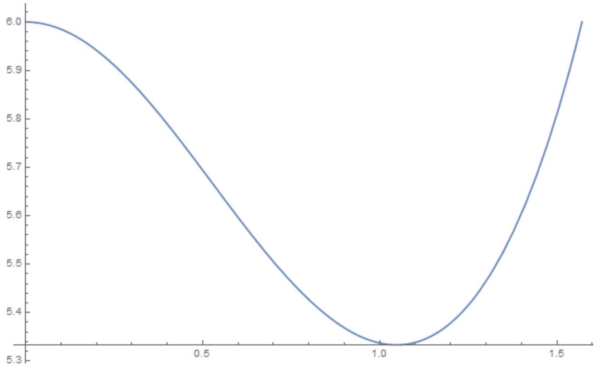
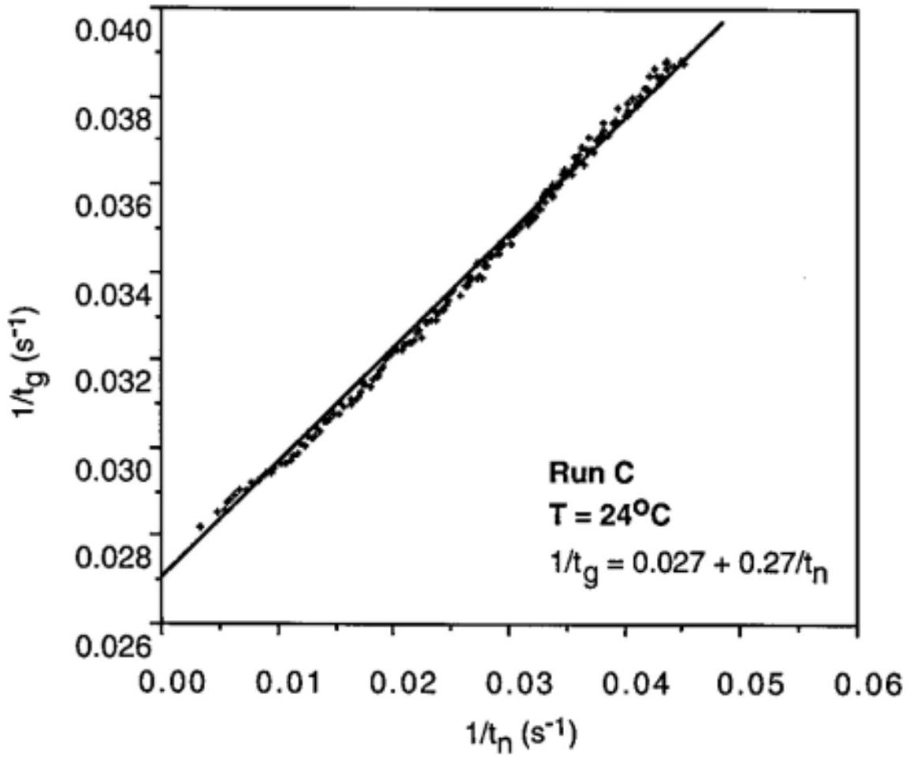

А1 ${ } ^ { 0.80 }$ Пусть общее число молей газа углекислого газа в закрытой бутылке $\nu _ { 0 } = 0.05$ моль, объем жидкости $V _ { L } = 250$ мл, объем газа $V _ { G } = 5$ мл. Найдите давление $P$ углекислого газа в бутылке. Приведите также численное значение. \textbf\{В дальнейших пунктах считайте, что жидкость находится в открытом сосуде.\}

Пусть $\nu _ { G }$ - количество вещества углекислого газа в газообразной форме, $\nu _ { L }$ - в растворе.
Количество вещества в газе можно выразить через давление с помощью уравнения состояния идеального газа. Концентрация углекислого газа в растворе выражается через давление с помощью закона Генри, тогда получаем уравнение

$$
\nu _ { 0 } = \nu _ { G } + \nu _ { L } = \frac { P V _ { G } } { R T } + c V _ { L } = P \left( \frac { V _ { G } } { R T } + k _ { H } V _ { L } \right)
$$

из которого давление

$$
P = \frac { \nu _ { 0 } R T } { V _ { G } + k _ { H } V _ { L } R T }
$$

Ответ:

$$
P = \frac { \nu _ { 0 } R T } { V _ { G } + k _ { H } V _ { L } R T } \approx 5.4 \cdot 10 ^ { 5 } \Pi \mathrm { a }
$$

А2 ${ } ^ { 0.70 }$ Пузырь с углекислым газом сможет образоваться, только если давление углекислого газа в нем сможет уравновесить давление, создаваемое силами поверхностного натяжения. Найдите минимальный радиус пузырька $R ^ { * }$, который сможет образоваться. Выразите ответ через молярную концентрацию газа в жидкости $c$, атмосферное давление $P _ { 0 }$, а также физические постоянные, характеризующие жидкость. Чему равна концентрация $c$, если критический радиус $R ^ { * } = 1.5 \cdot 10 ^ { - 6 } \mathrm {~m}$ ?

Давление углекислого газа в пузырьке должно уравновешивать внешнее давление (которое считаем равным атмосферному давлению $P _ { 0 }$ ) и добавку за счет поверхностного натяжения

$$
\frac { 2 \gamma } { R ^ { * } } + P _ { 0 } = P _ { C O _ { 2 } } = \frac { c } { k _ { H } } .
$$

У пузырька одна поверхность, поэтому поверхностное натяжение создает давление $2 \gamma / R$. Решая уравнение, получаем

$$
\frac { 2 \gamma } { R ^ { * } } = \frac { c - k _ { H } P _ { 0 } } { k _ { H } } , \quad R ^ { * } = \frac { 2 \gamma k _ { H } } { c - k _ { H } P _ { 0 } } .
$$

Концентрацию можно рассчитать по формуле

$$
c = k _ { H } \left( P _ { 0 } + \frac { 2 \gamma } { R ^ { * } } \right) \approx 61 \frac { \text { моль } } { \mathrm { m } ^ { 3 } } .
$$

Ответ:

$$
\begin{gathered}
R ^ { * } = \frac { 2 \gamma k _ { H } } { c - k _ { H } P _ { 0 } } \\
c = k _ { H } \left( P _ { 0 } + \frac { 2 \gamma } { R ^ { * } } \right) \approx 61 \frac { \text { Моль } } { \mathrm { M } ^ { 3 } }
\end{gathered}
$$

А3 ${ } ^ { 1.00 }$ Используя приведенные соображения, найдите коэффициент диффузии $B$. Выразите ответ через $k _ { B } , T , \beta$. Определите подвижность молекул $\beta$ через вязкость $\eta$ и размер молекул. Найдите численное значение коэффициента диффузии. \textbf\{Ecли вам не удастся решить этот пункт, можете для получения численных ответов в дальнейшем использовать значение\} $B = 5 \cdot 10 ^ { - 9 } \mathrm { м } ^ { 2 } / \mathrm { c }$.

Средняя скорость движения частицы под действием силы $F _ { z } = F$ равна $v = \beta F$, поэтому сила создает поток $j _ { z } ^ { F } = n v = n \beta F$.
Концентрация зависит от координаты как

$$
n = n _ { 0 } e ^ { - U / k T } = n _ { 0 } e ^ { F z / k T } ,
$$

поэтому диффузионный поток

$$
j _ { z } ^ { D } = - B \frac { d n } { d z } = - \frac { B n _ { 0 } F } { k T } e ^ { F z / k T } = - \frac { B n F } { k T } .
$$

В равновесии полный поток должен быть равен нулю:

$$
j _ { z } = j _ { z } ^ { F } + j _ { z } ^ { D } = n \beta F - \frac { B n F } { k T } = 0 .
$$

Отсюда получаем коэффициент диффузии

$$
B = \beta k _ { B } T .
$$

Если считать, что на молекулу действует сила вязкого трения $6 \pi \beta r v$, то подвижность определяется формулой

$$
\beta = \frac { 1 } { 6 \pi \eta r }
$$

Тогда коэффициент диффузии

$$
B = \frac { k _ { B } T } { 6 \pi \eta r } .
$$

Ответ:

$$
B = \frac { k _ { B } T } { 6 \pi \eta r } \approx 1.4 \cdot 10 ^ { - 9 } \mathrm {~m} ^ { 2 } / c
$$

В1 ${ } ^ { 1.00 }$ Найдите, как диаметр $D$ пузыря зависит от времени. Начальный диаметр считайте приближенно равным нулю, ответ выразите через $f _ { 1 } , f _ { 2 } , c , c _ { i } , R , T$ , $P _ { 0 }$. Давление в пузыре и температуру можно считать постоянными, вкладом поверхностного натяжения и давления столба жидкости в давление газа в пузыре можно пренебречь.

Выразим объем пузыря через количество вещества в нем

$$
V = \frac { R T } { P } \nu .
$$

Из формулы из условия получим скорость изменения объема

$$
\frac { d V } { d t } = \frac { R T } { P } \frac { d \nu } { d t } = \frac { R T } { P } k S \left( c - c _ { i } \right) .
$$

Подставим выражения через диаметр:

$$
3 D ^ { 2 } f _ { 2 } \frac { d D } { d t } = \frac { R T } { P } \frac { B } { \kappa D } f _ { 1 } D ^ { 2 } \left( c - c _ { i } \right)
$$

Отсюда получаем уравнение

$$
2 D \frac { d D } { d t } = \frac { 2 f _ { 1 } } { 3 \kappa f _ { 2 } } \frac { R T } { P } B \left( c - c _ { i } \right) ,
$$

в левой части которого стоит производная квадрата диаметра по времени.

Ответ:

$$
D = \sqrt { \frac { 2 f _ { 1 } } { 3 \kappa f _ { 2 } } \frac { R T } { P } B \left( c - c _ { i } \right) t }
$$

В2 ${ } ^ { 0.70 }$ Найдите выражения для $f _ { 1 } ( \theta )$ и $f _ { 2 } ( \theta )$. Постройте (качественно) график отношения $f _ { 1 } / f _ { 2 }$ при $\theta \in ( 0 , \pi / 2 )$.

Поверхность участка сферы равна произведению квадрата радиуса $D ^ { 2 } / 4$ на телесный угол, под которым он виден из центра, поэтому

$$
f _ { 1 } = \frac { \pi } { 2 } ( 1 + \cos \theta )
$$

Объем части сферы можно найти как сумму объема шарового сектора, видимого под тем же телесным углом, и конуса. Получим

$$
f _ { 2 } = \frac { \pi } { 24 } \left( 2 + 3 \cos \theta - \cos ^ { 3 } \theta \right)
$$

Ответ:

$$
\begin{gathered}
f _ { 1 } = \frac { \pi } { 2 } ( 1 + \cos \theta ) \\
f _ { 2 } = \frac { \pi } { 24 } \left( 2 + 3 \cos \theta - \cos ^ { 3 } \theta \right)
\end{gathered}
$$

Вз ${ } ^ { 0.30 }$ Найдите радиус пузыря $R$, при котором он оторвется от поверхности. Считайте, что он крепится к поверхности по окружности радиуса $a _ { d } \ll R$, угол между пузырьком и поверхностью равен $\theta$,

Сила поверхностного натяжения дожна уравновесить действующую на пузырь силу Архимеда

$$
2 \pi a _ { d } \gamma \sin \theta = \frac { 4 \pi } { 3 } \rho g R ^ { 3 }
$$

Ответ:

$$
R = \left( \frac { 3 a _ { d } \gamma \sin \theta } { 2 \rho g } \right) ^ { 1 / 3 }
$$

В4 ${ } ^ { 0.80 }$ После того, как пузырь оторвался от поверхности, вблизи нее остается участок жидкости с пониженной концентрацией растворенного углекислого газа. Из-за этого до того момента, когда в том же месте начнет формироваться следующий пузырь, должно пройти некоторое время $t _ { n }$. Считайте, что концентрация углекислого газа понижена в области размера $D _ { m }$, а глубина дефекта, которую нужно заполнить углекислым газом равна $h \ll D _ { m }$. Зависимость концентрации от расстояния до поверхности линейная. Найдите время $t _ { n }$, за которое пузырь, возникший на дне дефекта, вырастет до поверхности стекла. Концентрация вблизи дефекта равна минимальной концентрации $c _ { n }$, при которой возможно существование пузырька, зависимость концентрации от расстояния можно считать линейной.

Из-за разности концентраций возникает поток углекислого газа

$$
j = B \frac { c - c _ { n } } { D _ { m } } .
$$

Заметим, что один и тот же коэффициент диффузии связывает как поток молекул с разностью концентраций, так и молярный поток с разность молярных концентраций, поскольку обычная и молярная концентрации пропорциональны друг другу.
Пусть площадь дефекта $S$. Объем пузыря связан с количеством вещества в нем

$$
V = \nu \frac { R T } { P } .
$$

Скорость изменения количества вещества в пузыре

$$
\frac { d \nu } { d t } = j S = \frac { c - c _ { n } } { D _ { m } } B S = \frac { P } { R T } \frac { d V } { d t } = \frac { P S } { R T } \frac { d h } { d t }
$$

Отсюда следует, что дефект заполняется с постоянной скоростью

$$
\frac { d h } { d t } = \frac { R T } { P } B \frac { c - c _ { n } } { D _ { m } } ,
$$

и время формирования пузыря

$$
t _ { n } = \frac { P } { R T } \frac { h D _ { m } } { B \left( c - c _ { n } \right) } .
$$

Ответ:

$$
t _ { n } = \frac { P } { R T } \frac { h D _ { m } } { B \left( c - c _ { n } \right) }
$$

В5 ${ } ^ { 0.70 }$ Пусть $t _ { g }$ - время, за который пузырь вырастает от края дефекта до своего максимального диаметра $D _ { m }$. При изменении концентрации углекислого газа в жидкости это время, как и время формирования пузыря $t _ { n }$ могут меняться. В каких координатах зависимость $t _ { g }$ от $t _ { n }$ будет иметь линейный вид?

Время роста пузыря до максимального диаметра можно найти из результатов пункта В1:

$$
t _ { g } = \frac { D _ { m } ^ { 2 } } { K _ { 1 } \left( c - c _ { i } \right) } ,
$$

где $K _ { 1 }$ - некоторая постоянная, не зависящая от концентраций. $D _ { m }$ определяется в основном равновесием сил поверхностного натяжения и силы Архимеда, поэтому также не зависит от концентрации.
Тогда зависимости обратных времен от концентрации углекислого газа в растворе линейны:

$$
\frac { 1 } { t _ { g } } \sim c - c _ { i } , \quad \frac { 1 } { t _ { n } } \sim c - c _ { n } .
$$

Поэтому зависимость между самими обратными временами также должна быть линейной.

Ответ: Зависимость в координатах $1 / t _ { g }$ от $1 / t _ { n }$.

С1 ${ } ^ { 0.40 }$ Скорость всплывания пузырька определяется действующей на него силой вязкого трения, которую можно рассчитать по формуле Стокса $F = 6 \pi \eta a U$, где $a$ - радиус пузырька, $U$ - скорость пузырька, $\eta$ - вязкость жидкости. Найдите скорость всплывания пузырька радиуса $a$.

Считаем, что скорость пузыря устанавливается достаточно быстро. Тогда она определяется равновесием между силой вязкого трения и силой Архимеда

$$
\rho g \frac { 4 \pi } { 3 } a ^ { 3 } = 6 \pi \eta a U .
$$

Отсюда скорость

$$
U = \frac { 2 \rho g } { 9 \eta } a ^ { 2 } .
$$

Ответ:

$$
U = \frac { 2 \rho g } { 9 \eta } a ^ { 2 }
$$

С2 ${ } ^ { 0.60 }$ Найдите скорость изменения радиуса пузырька $d a / d t$. Выразите ответ через $a$, разность концентраций $\Delta c$, температуру $T$, атмосферное давление $P _ { 0 }$ , $\Delta c$ и физические постоянные.

Найдем значение коэффициента $K$ для пузырька:

$$
K = 0.63 B ^ { 2 / 3 } \frac { U ^ { 1 / 3 } } { a ^ { 2 / 3 } } = 0.63 B ^ { 2 / 3 } \left( \frac { 2 \rho g } { 9 \eta } \right) ^ { 1 / 3 } = 0.38 B ^ { 2 / 3 } \left( \frac { \rho g } { \eta } \right) ^ { 1 / 3 } .
$$

Оказывается, оно не зависит от радиуса.
Аналогично части В свяжем выразим скорость изменения объема:

$$
\frac { d V } { d t } = \frac { R T } { P } \frac { d \nu } { d t } = \frac { R T } { P } K S \Delta c .
$$

Изменение объема связано с изменением радиуса соотношением

$$
\frac { d V } { d t } = S \frac { d a } { d t } = \frac { R T } { P } K S \Delta c
$$

откуда

$$
\frac { d a } { d t } = 0.38 B ^ { 2 / 3 } \left( \frac { \rho g } { \eta } \right) ^ { 1 / 3 } \frac { R T } { P } \Delta c = v .
$$

Эта скорость не зависит от радиуса пузырька.

Ответ:

$$
\frac { d a } { d t } = 0.38 B ^ { 2 / 3 } \left( \frac { \rho g } { \eta } \right) ^ { 1 / 3 } \frac { R T } { P } \Delta c
$$

с3 ${ } ^ { 0.80 }$ Пузырек всплывает со дна сосуда, начальный радиус $a _ { 0 }$. Найдите его радиус $a$ и объем $V _ { b }$ вблизи поверхности.

Запишем уравнение для роста радиуса пузырька

$$
\frac { d a } { d t } = v ,
$$

а также для движения пузырька ( $h$ - высота подъема)

$$
\frac { d h } { d t } = U = \frac { 2 \rho g } { 9 \eta } a ^ { 2 }
$$

Отсюда

$$
\frac { d a } { d h } = \frac { 1 } { a ^ { 2 } } \frac { 9 \eta v } { 2 \rho g } .
$$

Интегрируя, получаем

$$
a ^ { 3 } = \frac { 27 \eta v } { 2 \rho g } h + a _ { 0 } ^ { 3 } .
$$

Ответ:

$$
\begin{aligned}
a & = \left( \frac { 27 \eta v } { 2 \rho g } h + a _ { 0 } ^ { 3 } \right) ^ { 1 / 3 } \\
V _ { b } & = \frac { 4 \pi } { 3 } \left( \frac { 27 \eta v } { 2 \rho g } h + a _ { 0 } ^ { 3 } \right)
\end{aligned}
$$

где $v = 0.38 B ^ { 2 / 3 } \left( \frac { \rho g } { \eta } \right) ^ { 1 / 3 } \frac { R T } { P } \Delta c$

Найдите также численное значение. Используйте данные $c = 100$ моль $/ \mathrm { м } ^ { 3 } , c _ { n } = 50$ моль/ $\mathrm { м } ^ { 3 } , V _ { L } = 0.5$ литра, диаметр сосуда $\xi = 6$ см.

Считайте, что концентрация вблизи поверхности пузырька такая, что газ углекислый газ в пузырьки находится в равновесии с растворенным в жидкости. Все пузыри всплывают со дна сосуда, а их начальный радиус равен нулю. Изменением концентрации за время от образования пузырька до того, как он достигнет поверхности, можно пренебречь.

С каждым пузырьком из жидкости выходит количество вещества углекислого газа

$$
\nu _ { b } = 10.7 \left( \frac { B \eta } { \rho g } \right) ^ { 2 / 3 } h \Delta c .
$$

Его можно получить, умножив объем пузырька на $P / R T$.
Разность концентраций вблизи пузырька и в объеме жидкости

$$
\Delta c = c - k _ { h } P _ { 0 }
$$

Изменение концентрации углекислого газа в жидкости при выходе одного пузырька

$$
d c = - \frac { \nu _ { b } } { V _ { L } } .
$$

Число вышедших пузырьков связано с изменением концентрации соотношением

$$
d N = - \frac { d c V _ { L } } { \nu _ { b } } = - 0.093 \left( \frac { \rho g } { B \eta } \right) ^ { 2 / 3 } \frac { V _ { L } } { h } \frac { d c } { c - k _ { H } P _ { 0 } }
$$

Интегрируя, находим число пузырьков

$$
N = 0.093 \left( \frac { \rho g } { B \eta } \right) ^ { 2 / 3 } \frac { V _ { L } } { h } \ln \frac { c - k _ { H } P _ { 0 } } { c _ { n } - k _ { H } P _ { 0 } } \approx 1.1 \cdot 10 ^ { 7 }
$$

Численное значение приведено для правильного коэффициента диффузии. Для приближенного значения $5 \cdot 10 ^ { - 9 } \mathrm {~m} ^ { 2 }$ /с получим $N \approx 4.6 \cdot 10 ^ { 6 }$.

Ответ:

$$
N = 0.093 \left( \frac { \rho g } { B \eta } \right) ^ { 2 / 3 } \frac { \pi \xi ^ { 2 } } { 4 } \ln \frac { c - k _ { H } P _ { 0 } } { c _ { n } - k _ { H } P _ { 0 } } \approx 1.1 \cdot 10 ^ { 7 }
$$

С5 ${ } ^ { 0.70 }$ Предположим, что все образовавшиеся в процессе пузырьки не разрушаются, а их размеры равны размерам пузырьков, достигающих поверхности жидкости при конечной концентрации углекислого газа. Пена какой высоты $H$ образуется на поверхности жидкости?

Высота пены связана с объемом пузырей соотношением $H = V / S$, где объем пены $V = V _ { b } N$. Объем пузыря, отвечающий конечному значению концентрации

$$
V _ { b } = 10.7 \left( \frac { B \eta } { \rho g } \right) ^ { 2 / 3 } h \left( c _ { n } - k _ { H } P _ { 0 } \right) \frac { R T } { P } ,
$$

объем пены

$$
V = \frac { \pi \xi ^ { 2 } } { 4 } h \left( c _ { n } - k _ { H } P _ { 0 } \right) \frac { R T } { P } \ln \frac { c - k _ { H } P _ { 0 } } { c _ { n } - k _ { H } P _ { 0 } } ,
$$

а значит ее высота

$$
H = \frac { R T } { P } \left( c _ { n } - k _ { H } P _ { 0 } \right) h \ln \frac { c - k _ { H } P _ { 0 } } { c _ { n } - k _ { H } P _ { 0 } } \approx 0.53 h .
$$

Здесь используется высота столба жидкости $h = V / \left( \pi \xi ^ { 2 } / 4 \right) \approx 17.7$ см.

Ответ:

$$
H = \frac { R T } { P } \left( c _ { n } - k _ { H } P _ { 0 } \right) h \ln \frac { c - k _ { H } P _ { 0 } } { c _ { n } - k _ { H } P _ { 0 } } \approx 0.53 h \approx 9 \text { см }
$$
