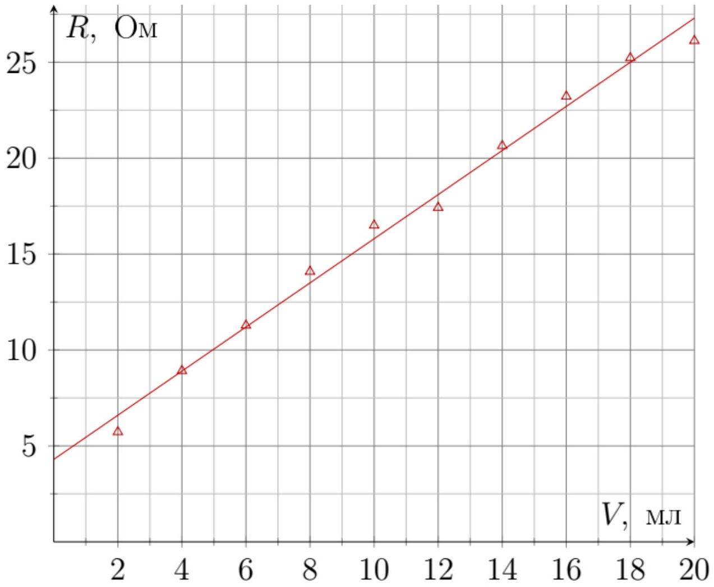
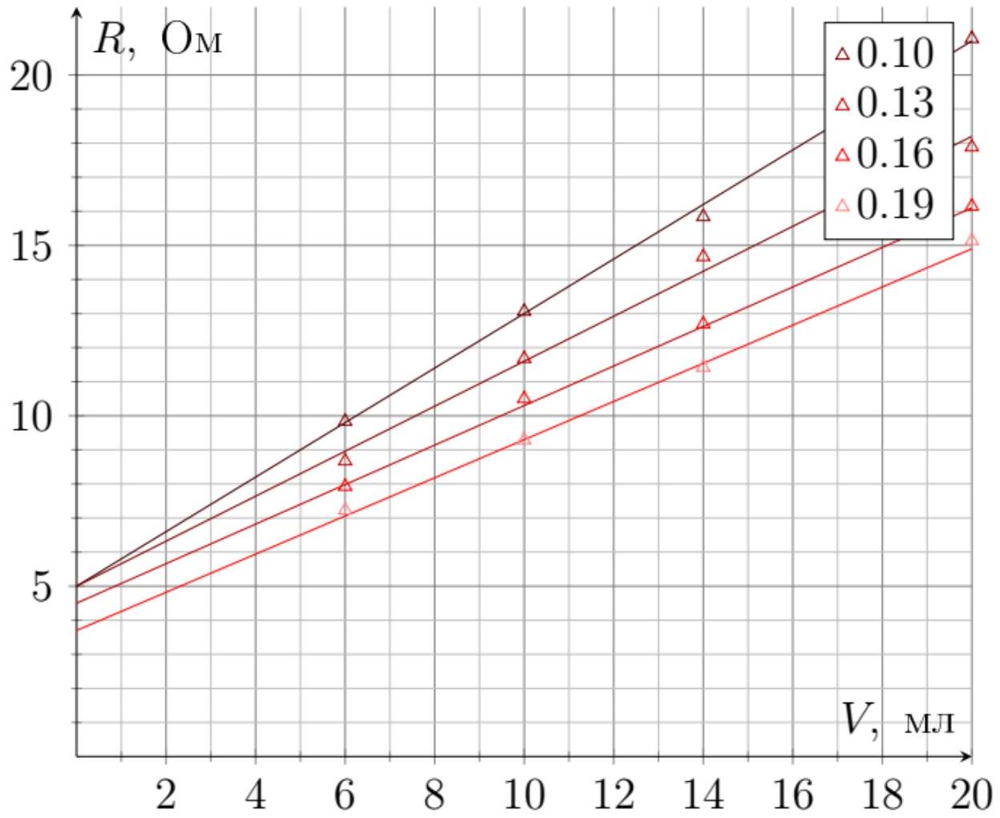
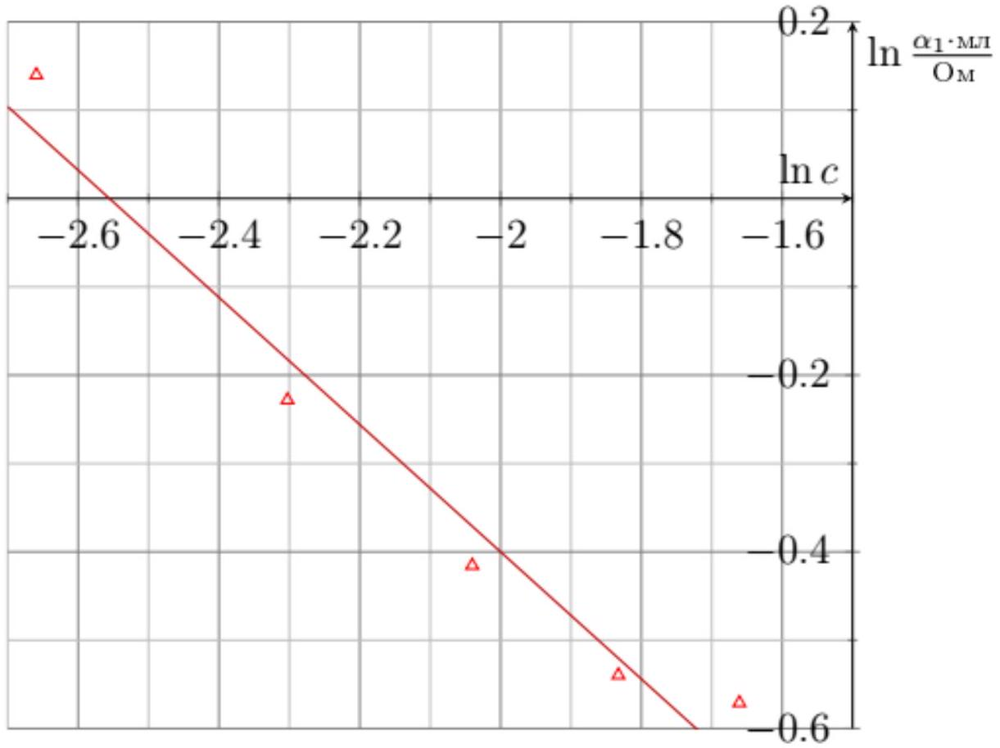
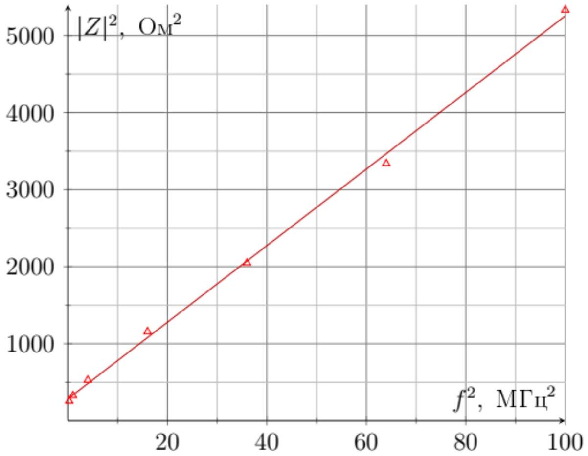
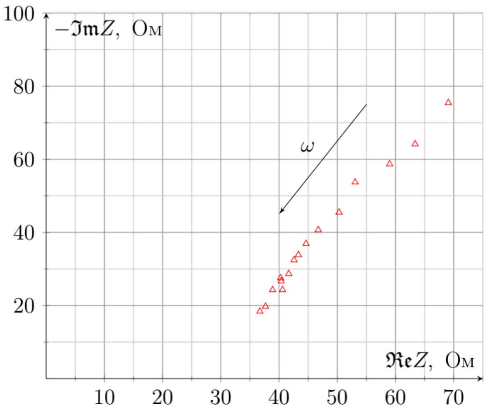
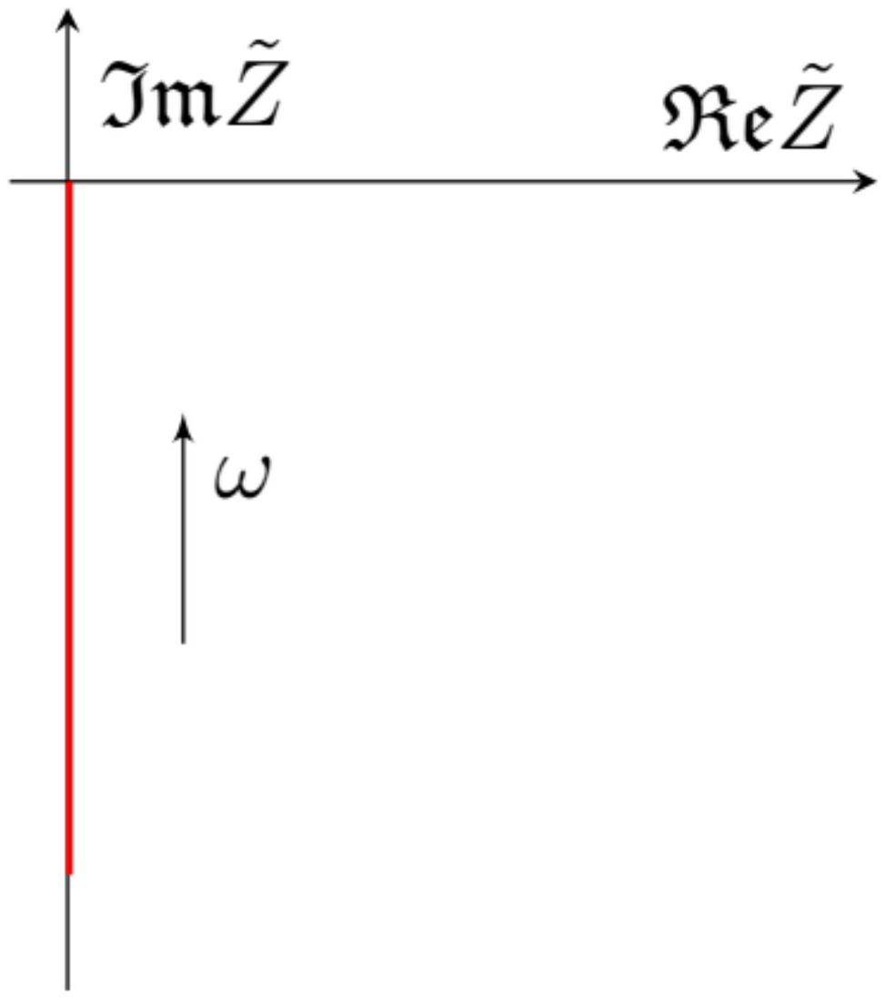
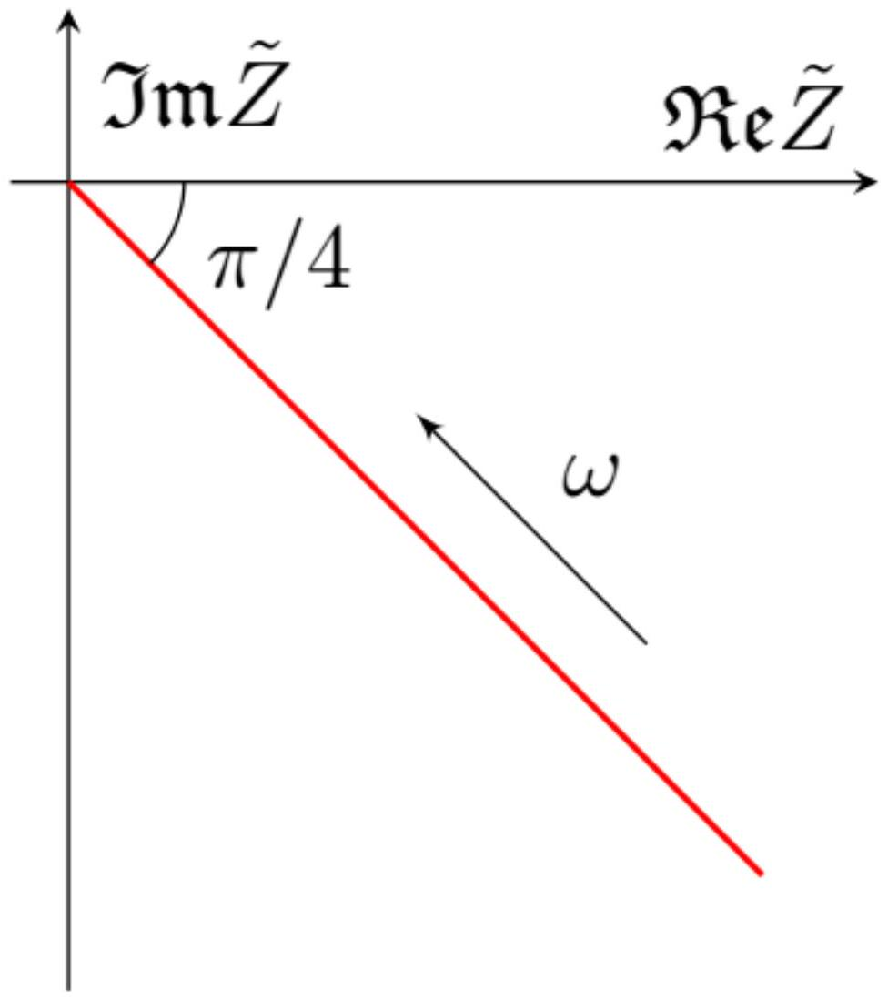
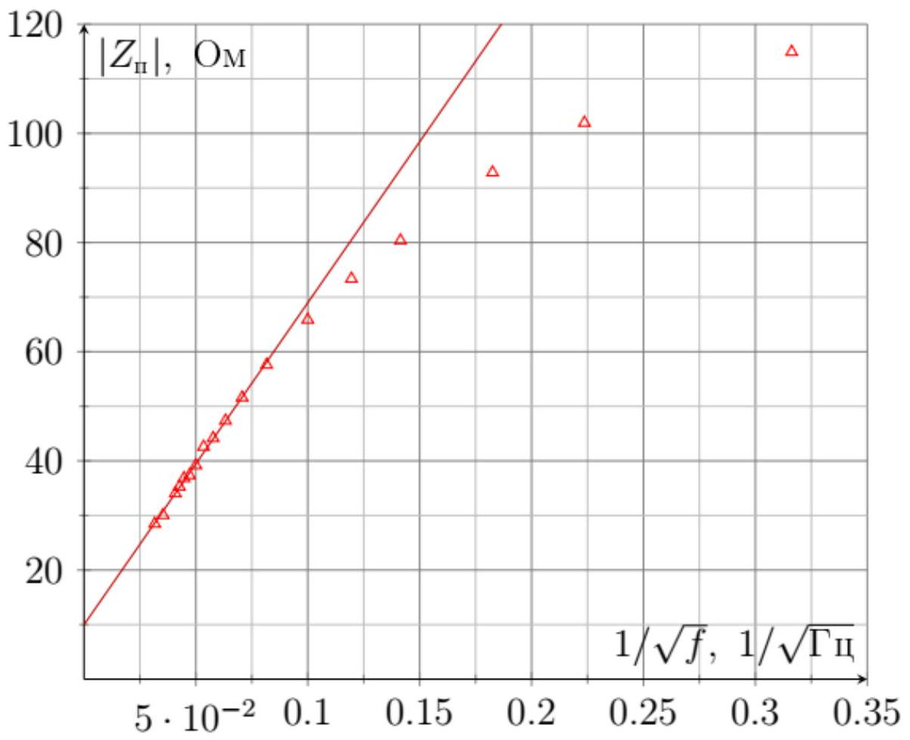

Ответ: $L _ { 0 } = 65 \mathrm {~mm}$

Ответ: Определить $D _ { 0 }$ можно поделив 20 мл на $L _ { 0 }$

$$
D _ { 0 } = 20 \mathrm { мм }
$$

А2 ${ } ^ { 0.40 }$ Сделайте измерения сопротивления $R$ соответствующие положениям шприца $V = 2,4 , \ldots , 20$ мл.

А3 ${ } ^ { 0.40 }$ Постройте график $R$ от $V$. Проведите сглаживающую прямую $R = R _ { 1 } + \alpha _ { 1 } V$. Рассчитайте значения параметров $R _ { 1 }$ и $\alpha _ { 1 }$.

Ответ: $R _ { 1 } = 4.30 \mathrm {~m}$

Ответ: $\alpha _ { 1 } = 1.15 \frac { \mathrm { Om } } { \mathrm { cm } ^ { 3 } }$

В1 ${ } ^ { 0.80 }$ Для каждого из приготовленных растворов проведите серию из 4-ех измерений $R$ от $V$.

В2 ${ } ^ { 0.12 }$ С помощью МНК для каждого из растворов посчитайте параметры $R _ { 1 }$ и $\alpha _ { 1 }$ по аналогии с пунктом $\mathbf { A 3 }$. Результаты представьте в виде таблицы.

| c | 0.07 | 0,1 | 0,13 | 0,16 | 0,19 |
| :--- | :--- | :--- | :--- | :--- | :--- |
| $\alpha _ { 1 } , \frac { \mathrm { Om } } { \mathrm { CM } ^ { 3 } }$ | 1.15 | 0.80 | 0.66 | 0.58 | 0.56 |
| $R _ { 1 } , 0 \mathrm {~m}$ | 4.3 | 5.0 | 4.9 | 4.5 | 3.7 |

Вз ${ } ^ { 0.06 }$ В среде создается внешнее постоянное поле $E$. Чему равна установившаяся скорость частицы $v _ { y }$ ? Ответ запишите через $E , k , q$.

Запишем II закон Ньютона:

$$
E q = k v _ { \mathrm { y } }
$$

Ответ:

$$
v _ { \mathrm { y } } = \frac { E q } { k }
$$

В4 ${ } ^ { 0.15 }$ Чему равен установившийся ток $I$, если к электродам подведена разность потенциалов $U$ ? Любыми поверхностными эффектами пренебрегите (например, контактной разностью потенциалов и контактным сопротивлением). Ответ запишите через $n , S , L , e , k _ { \mathrm { Na } ^ { + } } , k _ { \mathrm { Cl } ^ { - } }$и $U$.

По определению $I = \frac { d q } { d t }$, при этом поток площадью $S$ частиц зарядом $q$, двигающийся с постоянной скоростью $v$ образует такой ток:

$$
\begin{equation*}
I = \frac { d q } { d t } = n v S q \tag{1}
\end{equation*}
$$

Тогда ток в нашем случае складывается из двух потоков ионов. Концентрации ионов равны из условия электронейтральности:

$$
I = n S e \frac { E e } { k _ { \mathrm { Na } ^ { + } } } + n S e \frac { E e } { k _ { \mathrm { Cl } ^ { - } } } .
$$

Поле $E$ выражается через разность потенциалов, как $U / L$.

Ответ:

$$
I = \frac { n S e ^ { 2 } U } { L } \left( \frac { 1 } { k _ { \mathrm { Na } ^ { + } } } + \frac { 1 } { k _ { \mathrm { Cl } } } \right)
$$

В5 ${ } ^ { 0.65 }$ Пусть к основаниям подведена разность потенциалов $U ( t ) = U \cos \omega t$, как будет зависеть ток $I ( t )$ от времени? Любыми поверхностными эффектами снова пренебрегите. Ответ запишите через $n , S , L , e , \omega , m _ { \mathrm { Na } ^ { + } } , m _ { \mathrm { Cl } ^ { - } } , k _ { \mathrm { Na } ^ { + } } , k _ { \mathrm { Cl } ^ { - } } , U$ и $t$.

Будем решать задачу методом комплексных амплитуд:

$$
U \cos \omega t = \Re \mathfrak { e } U e ^ { i \omega t }
$$

Тогда комплексное электрическое поле $E$ внутри среды такое:

$$
\tilde { E } = \frac { U } { L } e ^ { i \omega t } .
$$

Запишем II закон Ньютона для частицы в переменном поле $E e ^ { i \omega t }$ :

$$
m \dot { v } + k v = E q e ^ { i \omega t } .
$$

Собственные решения являются экспоненциально спадающими, поэтому нас интересует только частное решение вида $v = \tilde { B } e ^ { i \omega t }$ :

$$
i \omega m \tilde { B } + k \tilde { B } = E q \Rightarrow \tilde { B } = \frac { E q } { i \omega m + k } = \frac { E q } { k } \frac { 1 } { 1 + i \omega \frac { m } { k } } = \frac { E q } { k } \frac { 1 } { \sqrt { 1 + \frac { \omega ^ { 2 } m ^ { 2 } } { k ^ { 2 } } } } e ^ { - i \arctan \frac { \omega m } { k } }
$$

Комплексный ток $\tilde { I }$ пересчитаем с учетом уравнения (1):

$$
\tilde { I } = \frac { n S e ^ { 2 } U } { L k _ { \mathrm { Na } ^ { + } } } \frac { 1 } { \sqrt { 1 + \frac { \omega ^ { 2 } m _ { \mathrm { Na } ^ { + } } ^ { 2 } } { k _ { \mathrm { Na } + } ^ { 2 } } } } e ^ { - i \arctan \frac { \omega m _ { \mathrm { Na } + } } { k _ { \mathrm { Na } } + } + i \omega t } + \frac { n S e ^ { 2 } U } { L k _ { \mathrm { Cl } ^ { - } } } \frac { 1 } { \sqrt { 1 + \frac { \omega ^ { 2 } m _ { \mathrm { Cl } - } ^ { 2 } } { k _ { \mathrm { Cl } - } } } } e ^ { - i \arctan \frac { \omega m _ { \mathrm { Cl } - } } { k _ { \mathrm { Cl } - } } + i \omega t }
$$

Перейдем от комплексного тока путем взятия действительной части.

Ответ:

$$
I = \frac { n S e ^ { 2 } U } { L k _ { \mathrm { Na } ^ { + } } } \frac { 1 } { \sqrt { 1 + \frac { \omega ^ { 2 } m _ { \mathrm { Na } ^ { + } } ^ { 2 } } { k _ { \mathrm { Na } ^ { + } } ^ { 2 } } } } \cos \left( - \arctan \frac { \omega m _ { \mathrm { Na } ^ { + } } } { k _ { \mathrm { Na } ^ { + } } } + \omega t \right) + \frac { n S e ^ { 2 } U } { L k _ { \mathrm { Cl } ^ { - } } } \frac { 1 } { \sqrt { 1 + \frac { \omega ^ { 2 } m _ { \mathrm { Cl } ^ { - } } ^ { 2 } } { k _ { \mathrm { Cl } ^ { - } } ^ { 2 } } } } \cos \left( - \arctan \frac { \omega m _ { \mathrm { Cl } ^ { - } } } { k _ { \mathrm { Cl } ^ { - } } } + \omega t \right)
$$

В6 ${ } ^ { 0.25 }$ Теперь учтем поверхностные эффекты в виде резистора $R _ { п }$, который последовательно подключен к раствору. Запишите формулу для импеданса $\tilde { Z } ( \omega )$ системы, состоящей из раствора NaCl и сосуда. Ответ запишите через $n , S , L , e , m _ { \mathrm { Na } ^ { + } } , m _ { \mathrm { Cl } ^ { - } } , \omega , k _ { \mathrm { Na } ^ { + } } , k _ { \mathrm { Cl } ^ { - } }$и $R _ { \Pi ^ { - } }$.

Импеданс одного вида ионов очевидно выражается из уже полученных уравнений

$$
\tilde { Z } = \frac { L k } { n S q ^ { 2 } } \left( 1 + i \omega \frac { m } { k } \right) ,
$$

при этом токи складываются при одинаковых напряжениях, значит импедансы $\mathrm { Na } ^ { + }$и $\mathrm { Cl } ^ { - }$"подключены" параллельно, и еще последовательно с ними стоит резистор $R _ { п }$.

Ответ:

$$
\tilde { Z } ( \omega ) = R _ { \mathrm { I } } + \frac { \frac { k _ { \mathrm { Na } + } L } { n S e ^ { 2 } } \left( 1 + \frac { i \omega m _ { \mathrm { Na } + } } { k _ { \mathrm { Na } ^ { + } } } \right) \cdot \frac { k _ { \mathrm { Cl } ^ { - } } L } { n S e ^ { 2 } } \left( 1 + \frac { i \omega m _ { \mathrm { Cl } ^ { - } } } { k _ { \mathrm { Cl } ^ { - } } } \right) } { \frac { k _ { \mathrm { Na } } + L } { n S e ^ { 2 } } \left( 1 + \frac { i \omega m _ { \mathrm { Na } ^ { + } } } { k _ { \mathrm { Na } ^ { + } } } \right) + \frac { k _ { \mathrm { Cl } ^ { - } } L } { n S e ^ { 2 } } \left( 1 + \frac { i \omega m _ { \mathrm { Cl } ^ { - } } } { k _ { \mathrm { Cl } ^ { - } } } \right) }
$$

В7 ${ } ^ { 0.10 }$ Чему равен теоретический импеданс системы $\tilde { Z }$, если разность фаз между напряжением пренебрежимо мала? Ответ выразите через $n , S , L , e , k _ { \mathrm { Na } ^ { + } } , k _ { \mathrm { Cl } } -$ и $R _ { \text {П. } }$.

Если разность фаз пренебрежимо мала, то комплексными частями можно пренебречь и поведение системы соответствует поведению при постоянном напряжении.

Ответ:

$$
\tilde { Z } = R _ { \Pi } + \frac { L } { n S e ^ { 2 } } \frac { k _ { \mathrm { Na } ^ { + } } \cdot k _ { \mathrm { Cl } ^ { - } } } { k _ { \mathrm { Na } ^ { + } } + k _ { \mathrm { Cl } ^ { - } } }
$$

B8 ${ } ^ { 0.40 }$ Используя линеаризованный график $\alpha _ { 1 }$ от $c$ получите значение $\alpha$.

Ответ:

$$
\alpha _ { 1 } = \frac { d Z } { d L } \cdot \frac { 1 } { S } \propto \frac { k } { n } \propto n ^ { \alpha - 1 }
$$

Из графика $\alpha _ { 1 } = 0.3$.

В9 ${ } ^ { 0.40 }$ Получите теоретическую зависимость $| \tilde { Z } | ^ { 2 } ( \omega )$ в приближении $\omega m _ { \mathrm { Na } ^ { + } } \gg k _ { \mathrm { Na } ^ { + } } , \omega m _ { \mathrm { Cl } ^ { - } } \gg k _ { \mathrm { Cl } ^ { - } }$. Ответ запишите через $n , S , L , e , m _ { \mathrm { Na } ^ { + } } , m _ { \mathrm { Cl } ^ { - } } , \omega , k _ { \mathrm { Na } ^ { + } } , k _ { \mathrm { Cl } ^ { - } }$и $R _ { \Pi ^ { \mathrm { I } } }$.

Упростим формулу для импеданса из В6:

$$
\tilde { Z } = R _ { \Pi } + \frac { L } { n S e ^ { 2 } } \frac { \left( k _ { \mathrm { Na } ^ { + } } + i \omega m _ { \mathrm { Na } ^ { + } } \right) \left( k _ { \mathrm { Cl } ^ { - } } + i \omega m _ { \mathrm { Cl } ^ { - } } \right) } { \left( k _ { \mathrm { Na } ^ { + } } + k _ { \mathrm { Cl } ^ { - } } \right) + i \omega \left( m _ { \mathrm { Na } ^ { + } } + m _ { \mathrm { Cl } ^ { - } } \right) }
$$

Первое приближение происходит на этапе перемножения:

$$
\tilde { Z } = R _ { \Pi } + \frac { L } { n S e ^ { 2 } } \frac { - \omega ^ { 2 } m _ { \mathrm { Na } ^ { + } } m _ { \mathrm { Cl } ^ { - } } + i \omega \left( m _ { \mathrm { Na } ^ { + } } k _ { \mathrm { Cl } ^ { - } } + m _ { \mathrm { Cl } ^ { - } } k _ { \mathrm { Na } ^ { + } } \right) } { \left( k _ { \mathrm { Na } ^ { + } } + k _ { \mathrm { Cl } ^ { - } } \right) + i \omega \left( m _ { \mathrm { Na } ^ { + } } + m _ { \mathrm { Cl } ^ { - } } \right) }
$$

Домножим числитель и знаменатель на комплексно сопряженное к знаменателю и снова сделаем пренебрежение:

$$
\tilde { Z } = R _ { \Pi } + \frac { L } { n S e ^ { 2 } } \frac { - \omega ^ { 2 } m _ { \mathrm { Na } ^ { + } } m _ { \mathrm { Cl } ^ { - } } \left( k _ { \mathrm { Na } ^ { + } } + k _ { \mathrm { Cl } ^ { - } } \right) + i \omega ^ { 3 } m _ { \mathrm { Na } ^ { + } } m _ { \mathrm { Cl } ^ { - } } \left( m _ { \mathrm { Na } ^ { + } } + m _ { \mathrm { Cl } ^ { - } } \right) + \omega ^ { 2 } \left( m _ { \mathrm { Na } ^ { + } } k _ { \mathrm { Cl } ^ { - } } + m _ { \mathrm { Cl } ^ { - } } k _ { \mathrm { Na } ^ { + } } \right) \left( m _ { \mathrm { Na } ^ { + } } + m _ { \mathrm { Cl } ^ { - } } \right) } { \omega ^ { 2 } \left( m _ { \mathrm { Na } ^ { + } } + m _ { \mathrm { Cl } ^ { - } } \right) ^ { 2 } }
$$

Ответ:

$$
| \tilde { Z } | ^ { 2 } = \left( R _ { \Pi } + \frac { L } { n S e ^ { 2 } } \frac { m _ { \mathrm { Na } ^ { + } } ^ { 2 } k _ { \mathrm { Cl } ^ { - } } + m _ { \mathrm { Cl } ^ { + } } ^ { 2 } k _ { \mathrm { Na } ^ { + } } } { \left( m _ { \mathrm { Na } ^ { + } } + m _ { \mathrm { Cl } ^ { - } } \right) ^ { 2 } } \right) ^ { 2 } + \omega ^ { 2 } \left( \frac { L } { n S e ^ { 2 } } \frac { m _ { \mathrm { Na } ^ { + } } m _ { \mathrm { Cl } ^ { - } } } { m _ { \mathrm { Na } ^ { + } } + m _ { \mathrm { Cl } ^ { - } } } \right) ^ { 2 }
$$

В10 ${ } ^ { 0.35 }$ Для раствора с концентрацией соли $c \approx 0.20$ проведите измерения модуля импеданса $| Z |$ от частоты $f$. Серия должна состоять из не менее 7-ми разных $f$ в диапазоне 500 кГц $\leq f \leq 10$ МГц.

В11 ${ } ^ { 0.50 }$ Постройте линеаризованный график $| Z |$ от $f$. Из графика определите экспериментальное значение $\mu _ { э ф ф } = \frac { \mu _ { \mathrm { Na } } \cdot \mu _ { \mathrm { Cl } } } { \mu _ { \mathrm { Na } } + \mu _ { \mathrm { Cl } } }$.

Согласно последнему теоретическому пункту график $| \tilde { Z } | ^ { 2 }$ от $f ^ { 2 }$ линейный.

Ответ: Из графика коэффициент наклона равен $61 \cdot 10 ^ { - 12 } \frac { \text { ом } ^ { 2 } } { \text { Гц } ^ { 2 } }$, а из теории он равен $\left( \frac { 2 \pi L m _ { \text {эфф } } } { n S e ^ { 2 } } \right) ^ { 2 }$.

$$
\mu _ { э ф ф } = 170 \cdot 10 ^ { 5 } \frac { \text { кг } } { \text { моль } }
$$

В12 ${ } ^ { 0.15 }$ Определите $N$ исходя из ваших экспериментальных данных.

Запишем формулу исходя из модели, описанной в условии:

$$
\mu _ { Э ф ф } = \frac { \left( \mu _ { \mathrm { Na } } + N \mu _ { \mathrm { H } _ { 2 } \mathrm { O } } \right) \cdot \left( \mu _ { \mathrm { Cl } } + N \mu _ { \mathrm { H } _ { 2 } \mathrm { O } } \right) } { \mu _ { \mathrm { Na } } + N \mu _ { \mathrm { H } _ { 2 } \mathrm { O } } + \mu _ { \mathrm { Cl } } + N \mu _ { \mathrm { H } _ { 2 } \mathrm { O } } }
$$

Преобразуем к квадратному уравнению относительно $N$ :

$$
N ^ { 2 } + N \left( \frac { \mu _ { \mathrm { Na } } + \mu _ { \mathrm { Cl } } - 2 \mu _ { \ni \phi \phi } } { \mu _ { \mathrm { H } _ { 2 } \mathrm { O } } } \right) + \frac { \mu _ { \mathrm { Na } } \mu _ { \mathrm { Cl } } - \mu _ { Э ф \phi } \left( \mu _ { \mathrm { Na } } + \mu _ { \mathrm { Cl } } \right) } { \mu _ { \mathrm { H } _ { 2 } \mathrm { O } } ^ { 2 } } = 0
$$

Из-за того, что $\mu _ { э ф ф }$ очень больше, фактически, $N = \frac { 2 \mu _ { \text {эфф } } } { \mu _ { \mathrm { H } _ { 2 } \mathrm { O } } } = 1.8 \cdot 10 ^ { 7 }$.
Можно заключить, что измеренная индуктивность никак не связана с теоретически рассмотренным эффектом. Тем временем индуктивность витка с током радиусом 10 см можно оценить, как $10 ^ { - 6 } \Gamma$ н, что имеет один порядок с корнем из коэффициента наклона.

Ответ:

$$
N = 1.8 \cdot 10 ^ { 7 }
$$

С1 ${ } ^ { 1.50 }$ В диапазоне частот 5 Гц $\leq f \leq 1$ кГц проведите измерения модуля импеданса шприца $| \tilde { Z } |$ и времени $\Delta t$, на которое пик тока опережает пик напряжения. Сделайте не менее 15 измерений.

С2 ${ } ^ { 0.60 }$ На основе Ваших данных постройте диаграмму Найквиста $\mathfrak { I m } \tilde { Z } _ { п }$ от $\Re \mathfrak { e } \tilde { Z } _ { п }$ для поверхностных эффектов. Укажите на диаграмме в виде стрелки направление перехода от точки к точке, соответствующее увеличению $\omega$.

Ответ:

Ответ: Ёмкость $C _ { l }$ — это ёмкость единицы длины поверхности цилиндра, поэтому

$$
C _ { l } = 2 \pi r \sigma .
$$

Сопротивление $R _ { l }$ - это сопротивление единицы длины воды вокруг одного цилиндра, поэтому $R _ { l } = \rho / S _ { 1 }$, где $S _ { 1 }$ - площадь воды, приходящаяся на один цилиндр, поэтому

$$
R _ { l } = \frac { \rho } { \frac { 1 } { \xi } - \pi r ^ { 2 } }
$$

$$
- R _ { l } d x \tilde { I } = \tilde { \varphi } ( x + d x ) - \tilde { \varphi } ( x )
$$

Ответ:

$$
\tilde { I } ( x ) = - \frac { 1 } { R _ { l } } \frac { d \tilde { \varphi } ( x ) } { d x }
$$

С6 ${ } ^ { 0.10 }$ Свяжите производную комплексного тока $\frac { d \tilde { I } ( x ) } { d x }$ и комплексный потенциал $\tilde { \varphi } ( x )$ через $C _ { l }$.

Ток через единицу длины конденсатора

$$
\frac { \tilde { I } ( x + d x ) - \tilde { I } ( x ) } { i \omega C _ { l } d x } = - \tilde { \varphi } ( x )
$$

Ответ:

$$
\frac { d \tilde { I } ( x ) } { d x } = - i \omega C _ { l } \tilde { \varphi } ( x )
$$

С7 ${ } ^ { 0.20 }$ Покажите, что $\tilde { I } ( 0 ) = 0$.

Если ток не нулевой, то он течет через бесконечно малую ёмкость, значит $\varphi ( 0 ) \rightarrow \infty$.

С8 ${ } ^ { 1.25 }$ Решите полученную в пунктах С5 и С6 систему дифференциальных уравнений и получите импеданс $\tilde { Z } _ { \text {ц } } ( \omega )$ одного цилиндра и электролита, окружающего его. Ёмкостью основания цилиндра и ёмкостью плоской поверхности, на которой стоят цилиндры пренебрегайте. Ответ выразите через $C _ { l } , R _ { l } , l$ и $\omega$.

Получим дифференциальное уравнение на $\tilde { \varphi } ( x )$ :

$$
\tilde { \varphi } ^ { \prime \prime } - i \omega C _ { l } R _ { l } \tilde { \varphi } = 0
$$

Это однородное линейное диф.уравнение второго порядка. Найдем собственные числа:

$$
\begin{gathered}
\lambda ^ { 2 } = i \omega C _ { l } R _ { l } . \\
\lambda _ { 1 } = e ^ { \frac { i \frac { \pi } { 2 } } { 2 } } \sqrt { \omega C _ { l } R _ { l } } = ( 1 + i ) \sqrt { \frac { \omega R _ { l } C _ { l } } { 2 } } \\
\lambda _ { 2 } = e ^ { \frac { i \frac { \pi } { 2 } + 2 \pi i } { 2 } } \sqrt { \omega C _ { l } R _ { l } } = - ( 1 + i ) \sqrt { \frac { \omega R _ { l } C _ { l } } { 2 } }
\end{gathered}
$$

Обозначим $\sqrt { \frac { \omega C _ { l } R _ { l } } { 2 } }$ за $\zeta$. Тогда

$$
\tilde { \varphi } ( x ) = A e ^ { i \zeta x } e ^ { \zeta x } + B e ^ { - i \zeta x } e ^ { - \zeta x } .
$$

Граничные условия: $\tilde { \varphi } ( l ) = U e ^ { i \omega t } , \tilde { \varphi } ^ { \prime } ( 0 ) = 0$.

$$
\begin{gathered}
\tilde { \varphi } ^ { \prime } ( 0 ) = A ( 1 + i ) \zeta - B ( 1 + i ) \zeta = 0 \Rightarrow B = A \\
\tilde { \varphi } ( l ) = A \left( e ^ { i \zeta l } e ^ { \zeta l } + e ^ { - i \zeta l } e ^ { - \zeta l } \right) = 2 A \cosh ( \zeta l + i \zeta l ) = U e ^ { i \omega t }
\end{gathered}
$$

В итоге решение на потенциал выглядит так:

$$
\tilde { \varphi } ( x ) = U e ^ { i \omega t } \frac { \cosh ( \zeta x + i \zeta x ) } { \cosh ( \zeta l + i \zeta l ) }
$$

Найдем ток $\tilde { I } ( l )$ :

$$
\tilde { I } ( l ) = - \frac { 1 } { R _ { l } } \tilde { \varphi } ^ { \prime } ( l ) = - U e ^ { i \omega t } \frac { \zeta ( 1 + i ) } { R _ { l } } \tanh ( \zeta l + i \zeta l ) ,
$$

затем импеданс (минус возникает благодаря согласованию положительного направления ток и убывания импеданса):

$$
\tilde { Z } _ { \text {ц } } = \frac { \tilde { \varphi } ( l ) } { - \tilde { I } ( l ) } = \frac { R _ { l } } { \zeta ( 1 + i ) \tanh ( \zeta l + i \zeta l ) } = \sqrt { \frac { R _ { l } } { 2 \omega C _ { l } } } \frac { 1 - i } { \tanh \left( ( 1 + i ) \sqrt { \frac { \omega C _ { l } R _ { l } } { 2 } } l \right) }
$$

Разложим tanh:

$$
\tilde { Z } _ { \text {ц } } = \sqrt { \frac { R _ { l } } { \omega C _ { l } } } \frac { 1 - i \tanh \sqrt { \frac { \omega C _ { l } R _ { l } } { 2 } } l \cdot \tan \sqrt { \frac { \omega C _ { l } R _ { l } } { 2 } } l } { \tanh \sqrt { \frac { \omega C _ { l } R _ { l } } { 2 } } l - i \tan \sqrt { \frac { \omega C _ { l } R _ { l } } { 2 } } l } e ^ { - i \pi / 4 } .
$$

Ответ:

$$
\tilde { Z } _ { \text {ц } } = \sqrt { \frac { R _ { l } } { \omega C _ { l } } } \frac { 1 + i \tanh \sqrt { \frac { \omega C _ { l } R _ { l } } { 2 } } l \cdot \tan \sqrt { \frac { \omega C _ { l } R _ { l } } { 2 } } l } { \tanh \sqrt { \frac { \omega C _ { l } R _ { l } } { 2 } } l + i \tan \sqrt { \frac { \omega C _ { l } R _ { l } } { 2 } } l } e ^ { - i \pi / 4 } .
$$

с9 ${ } ^ { 0.20 }$ Получите импеданс $\tilde { Z } _ { ц } ( \omega )$ в приближении $\sqrt { \omega C _ { l } R _ { l } l ^ { 2 } } \gg 1$. Ответ выразите через $C _ { l } , R _ { l } , l$ и $\omega$. Следующие теоретические пункты также решаются в этом приближении.

Домножим числитель и знаменатель на $\cosh \zeta l \cdot \cos \zeta l$ :

$$
\tilde { Z } _ { \text {ц } } = \sqrt { \frac { R _ { l } } { \omega C _ { l } } } \frac { \cosh \zeta l \cos \zeta l + i \sin \zeta l \sinh \zeta l } { \cos \zeta l \sinh \zeta l + i \cosh \zeta l \sin \zeta l } e ^ { - i \pi / 4 } ,
$$

при $\zeta l \gg 1$ гиперболические функции $\sinh \zeta l$ и $\cosh \zeta l$ равны экспоненте $\frac { e ^ { \zeta l } } { 2 }$, поэтому

$$
\tilde { Z } _ { \text {ц } } \simeq \sqrt { \frac { R _ { l } } { \omega C _ { l } } } \frac { \cos \zeta l e ^ { \zeta l } + i \sin \zeta l e ^ { \zeta l } } { \cos \zeta l e ^ { \zeta l } + i \sin \zeta l e ^ { \zeta l } } e ^ { - i \pi / 4 } = \sqrt { \frac { R _ { l } } { \omega C _ { l } } } e ^ { - i \pi / 4 }
$$

Ответ:

$$
\tilde { Z } _ { \text {ц } } = \sqrt { \frac { R _ { l } } { \omega C _ { l } } } e ^ { - i \pi / 4 }
$$

С10 ${ } ^ { 0.20 }$ Чему равен импеданс $\tilde { Z } _ { п } ( \omega )$ одной поверхности цилиндра, соприкасающейся с электролитом. Площадь поверхности $S$. Ответ выразите через $r , \sigma , \rho , \xi , S n \omega$.

Нарисуйте качественно диаграмму Найквиста $\tilde { Z } _ { п } ( \omega )$. Теоретическая и экспериментальная диаграммы Найквиста должны совпадать по форме, но часть их характеристик могут незначительно отличаться.

Совместим результаты предыдущих пунктов.

$$
\tilde { Z } _ { \Pi } = \frac { 1 } { \xi S } \sqrt { \frac { \rho } { 2 \pi r \sigma \omega \left( \frac { 1 } { \xi } - \pi r ^ { 2 } \right) } } e ^ { - i \pi / 4 }
$$

С11 ${ } ^ { 0.70 }$ Постройте линеаризованный график $\left| \tilde { Z } _ { \Pi } \right|$ от $\omega$.

C12 ${ } ^ { \text {0.10 } }$ Определите $\sigma$.

Ответ: $\sigma _ { 0 } = 6.9 \frac { \mathrm { MK } \Phi } { \mathrm { cm } ^ { 2 } }$
