А1 ${ } ^ { 0.20 }$ Измерьте фокусные расстояния $f$ и $F$ с помощью получения изображения $A ^ { \prime }$ на экране. Для измерения используйте $H \approx 1.20$ м. В листе ответов крестиком укажите соответствие между цветом линзы и названиями $L _ { f }$ и $L _ { F }$.

Воспользуемся формулой тонкой линзы

$$
\frac { 1 } { a } + \frac { 1 } { H - a } = \frac { 1 } { f }
$$

Для каждой линзы сделаем по два измерения.
Белая линза:
Ближняя фокусировка:

$$
H = 124.2 \mathrm {~cm} , \quad a = 7.3 \mathrm {~cm} \quad \Rightarrow \quad f = 6.9 \mathrm {~cm}
$$

Дальняя фокусировка:

$$
H = 124.2 \mathrm {~cm} , \quad a = 116.5 \mathrm {~cm} \quad \Rightarrow \quad f = 7.2 \mathrm {~cm}
$$

Синяя линза:
Ближняя фокусировка:

$$
H = 124.5 \mathrm {~cm} , \quad a = 18.0 \mathrm {~cm} \quad \Rightarrow \quad F = 15.4 \mathrm {~cm}
$$

Дальняя фокусировка:

$$
H = 124.2 \mathrm {~cm} , \quad a = 103.2 \mathrm {~cm} \quad \Rightarrow \quad F = 17.4 \mathrm {~cm}
$$

В1 ${ } ^ { 0.20 }$ Выставьте линзу так, что $a = a _ { 0 } + F / 2$. В дальнейших пунктах мы будем изучать характерный размер таких изображений, поэтому выберите, какой линейный размер - высоту $h$ или ширину $w$ нечеткого изображения вы будете измерять в последующих пунктах. Обоснуйте свой выбор и крестиком обозначьте его в листе ответов. Этот размер будет обозначаться за $p$.

Нечеткость края пятна связана с линейным размером источника, поэтому будем измерять ширину.

В2 ${ } ^ { 0.45 }$ Накройте часть линзы, обращенную к экрану, диафрагмой диаметра $D$. Для всех диафрагм измерьте размер изображения $p$.

В3 ${ } ^ { 0.40 }$ Постройте график зависимости $p ( D )$.
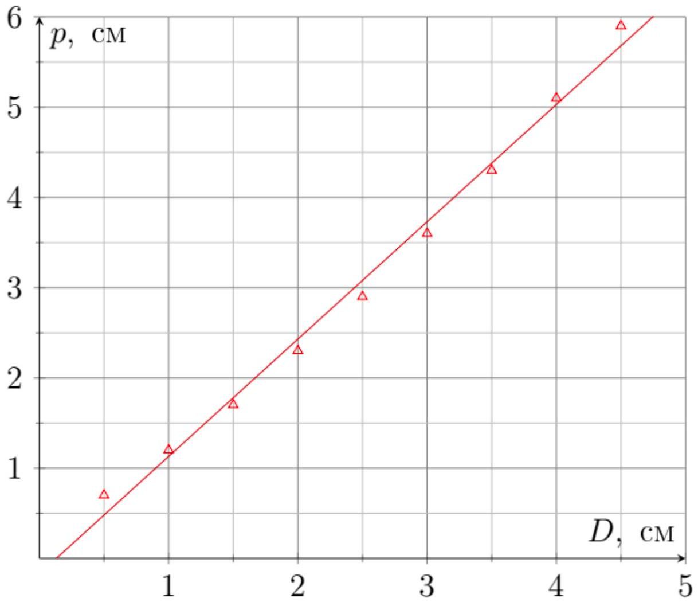

На графике видно слабую нелинейность у краев линзы - выпуклость вверх.

В4 ${ } ^ { 0.10 }$ При том же расположении объектов снимите диафрагму с линзы и измерьте размер $p _ { 0 }$ изображения на экране. Определите диаметр $D _ { 0 }$ открытой части линзы на основе $p _ { 0 }$, сравните результат с непосредственными измерениям.

Коэффициенты линейной зависимости: $p = - 0.17 \mathrm {~cm} + 1.3 \cdot D$. При этом $p _ { 0 } = 7.0$ см.
Из этой зависимости $D _ { 0 } = 5.5 \mathrm {~cm}$. Из непосредственных измерений $D _ { 0 } = 5.2$ см

B5 ${ } ^ { 0.55 }$ При 11 различных $a$ в диапазоне $\left[ a _ { 0 } - F / 3 , a _ { 0 } + F / 2 \right]$ измерьте размер $p$ изображения на экране.

Ответ:
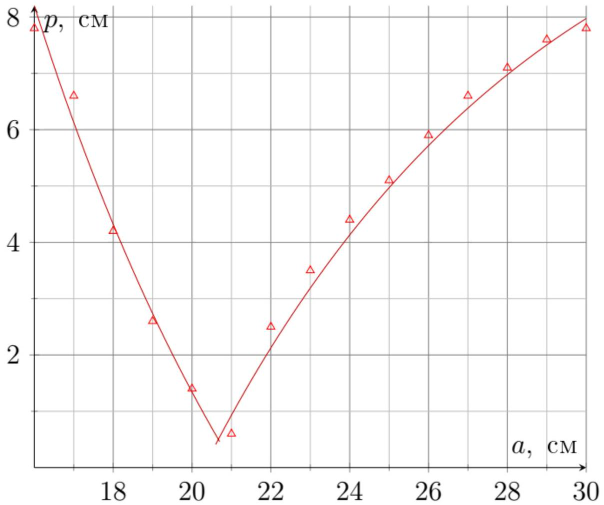

В6 ${ } ^ { 1.30 }$ Постройте линеаризованный график зависимости $p$ от $a$. Из графика найдите фокусное расстояние $F$ и сравните его с полученным ранее. Считайте, что спираль накаливания имеет размеры $0.10 \mathrm {~cm} \times 0.30 \mathrm {~cm}$.

Из формулы тонкой линзы

$$
\frac { 1 } { b } + \frac { 1 } { a } = \frac { 1 } { F } \quad \Rightarrow \quad b = \frac { F a } { a - F }
$$

а размер $w ^ { \prime }$ изображения $A ^ { \prime }$ равен $W _ { A } \frac { b } { a }$ и не зависит от сфокусированности на экране.
При $a > a _ { 0 }$ граница изображения на экране определяется лучем, проходящим через противоположный край линзы. Из геометрии:

$$
\frac { w - w ^ { \prime } } { H - a - b } = \frac { D + w ^ { \prime } } { b }
$$

Путем преобразований получим:

$$
w = W _ { A } \frac { H - a } { a } + D \frac { a ^ { 2 } - a H + F H } { a F }
$$

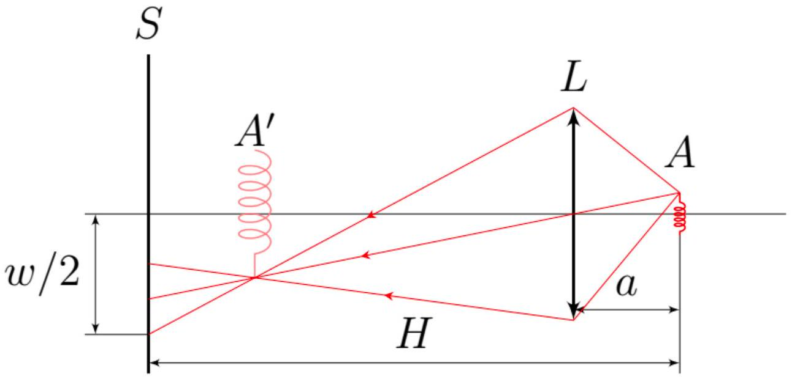

Случай $a > a _ { 0 }$
При $a > a _ { 0 }$ граница изображения на экране определяется лучем, проходящим через ближний край линзы. Из геометрии:

$$
\frac { w - w ^ { \prime } } { a + b - H } = \frac { D - w ^ { \prime } } { b }
$$

Путем преобразований получим:

$$
w = W _ { A } \frac { H - a } { a } - D \frac { a ^ { 2 } - a H + F H } { a F }
$$

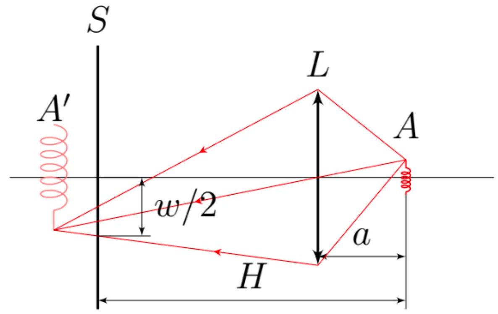

Линеаризация:

$$
\left( a H - a ^ { 2 } \right) = \pm \frac { F } { D } \left( w a - W _ { A } ( H - a ) \right) + F H
$$

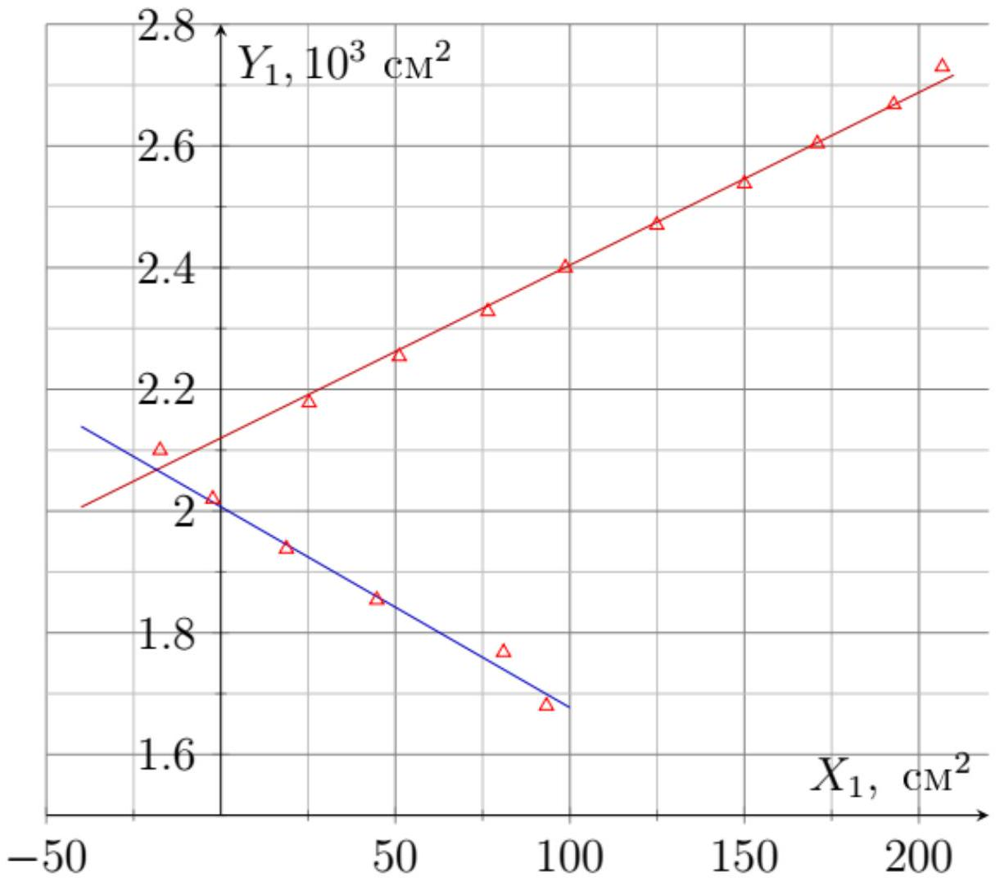

Координаты $X _ { 1 } = w a - W _ { A } ( H - a ) , Y _ { 1 } = a H - a ^ { 2 }$,

Ответ: Из графика можно получить $F$ четырьмя способами.
Для красной линии из свободного члена равного $F H$ следует, что $F = 17.0 \mathrm {~cm}$, из коэффициента наклона равного $F / D$ следует, что $F = 15.7$ см. Для синей линии из свободного члена равного $F H$ следует, что $F = 17.3 \mathrm {~cm}$, из коэффициента наклона равного $- F / D$ следует, что $F = 17.2$ см.

В7 ${ } ^ { 0.30 }$ Расположите линзу так, чтобы $a = a _ { 0 } + 2 F / 5$. Зарисуйте границу изображения на миллиметровой бумаге. Обозначьте центр изображения, горизонтальную ось $x _ { S }$ и вертикальную ось $y _ { S }$.

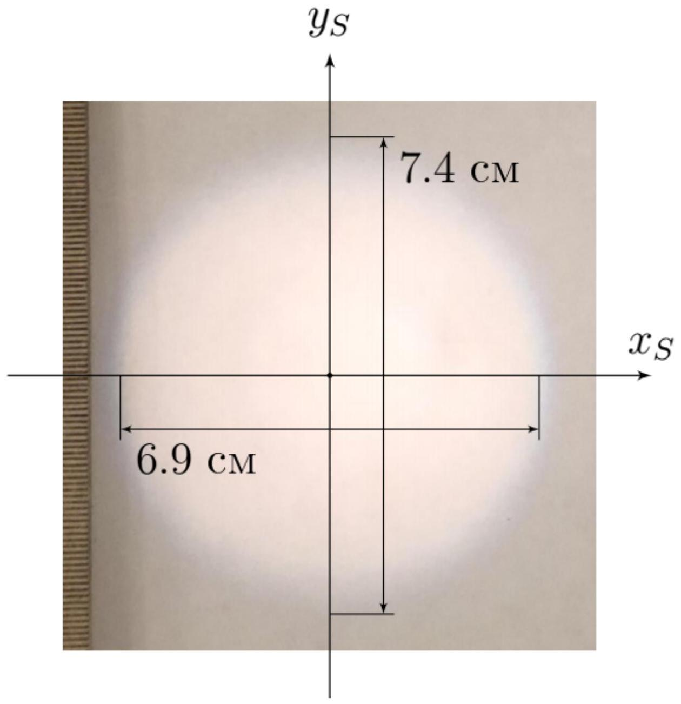

В8 ${ } ^ { 0.80 }$ Рассчитайте положение границы $\Gamma$ изображения относительного его центра в 11 точках, лежащих в области $x _ { S } > 0 , y _ { S } > 0$. Нанесите эти точки на тот же лист миллиметровой бумаги, где зарисовано изображение.
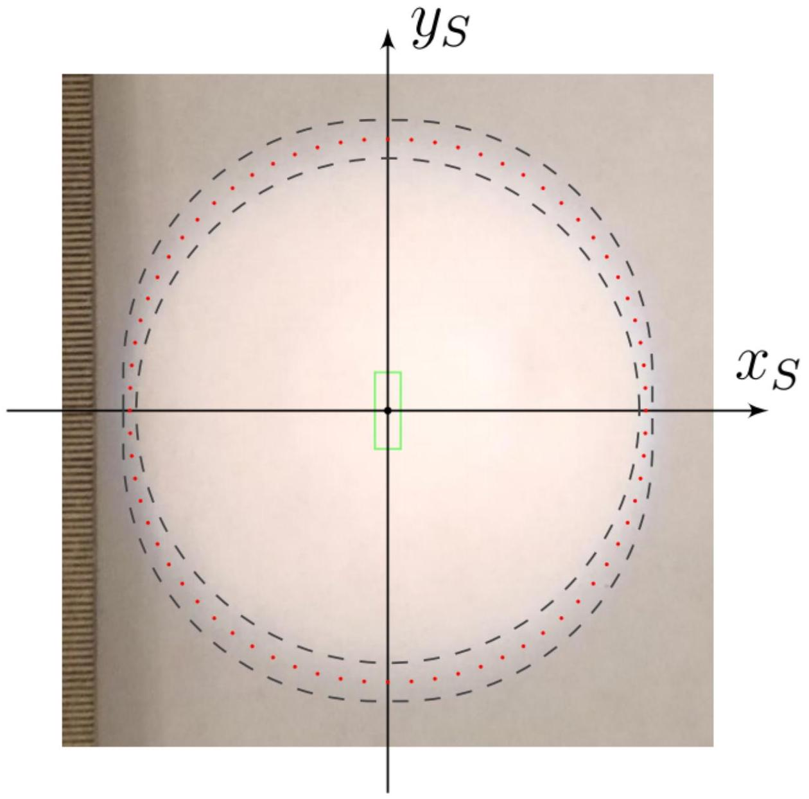

Зеленый прямоугольник -- контуры спирали, которые могли бы наблюдаться при очень маленькой диафрагме. Серыми контурами обозначены контур пятна от точечного источника (оценка снизу) и контур от прямоугольного источника. Красным обозначены точки лежащие посередине между этими кривыми -- эти точки и являются теоретической границей.

C1 ${ } ^ { 0.06 }$ В листах ответов поставьте крестик напротив истинных утверждений.

Ответ:

| $L _ { F }$ | Граница синяя при $a < a _ { 0 }$, красная при $a > a 0$ |
| :--- | :--- |
| $L _ { F }$ | Граница красная при $a < a _ { 0 }$, синяя при $a > a 0 \quad \times$ |
| $L _ { f }$ | Граница синяя при $a < a _ { 0 }$, красная при $a > a 0$ |

$L _ { f } \quad$ Граница красная при $a < a _ { 0 }$, синяя при $a > a 0 \quad \times$

C2 ${ } ^ { 0.50 }$ В листах ответов поставьте крестик напротив истинных утверждений о $n _ { \mathrm { b } }$ и $n _ { \mathrm { r } }$. Обоснуйте свой выбор.

Как видно из эксперимента при $a > a _ { 0 }$ границы изображения синие, из этого следует, что синие лучи фокусируются ближе ( $b _ { b } < b _ { r }$ ), из чего следует

$$
\frac { 1 } { b _ { b } } > \frac { 1 } { b _ { r } } \quad \Rightarrow \quad \frac { 1 } { F _ { b } } > \frac { 1 } { F _ { r } } ,
$$

откуда следует ответ из формулы шлифовщика:

$$
\frac { 1 } { F } = ( n - 1 ) \left( \frac { 1 } { R _ { 1 } } + \frac { 1 } { R _ { 2 } } \right)
$$

Ответ:

$$
\begin{array} { l l }
L _ { F } & n _ { b } > n _ { r } \quad \times \\
L _ { F } & n _ { r } > n _ { b } \\
L _ { f } & n _ { b } > n _ { r } \quad \times \\
L _ { f } & n _ { r } > n _ { b }
\end{array}
$$

D1 ${ } ^ { 0.70 }$ При 7-ми различных $H$ измерьте размер изображения $p$ в условиях ближней фокусировки.

Ответ:
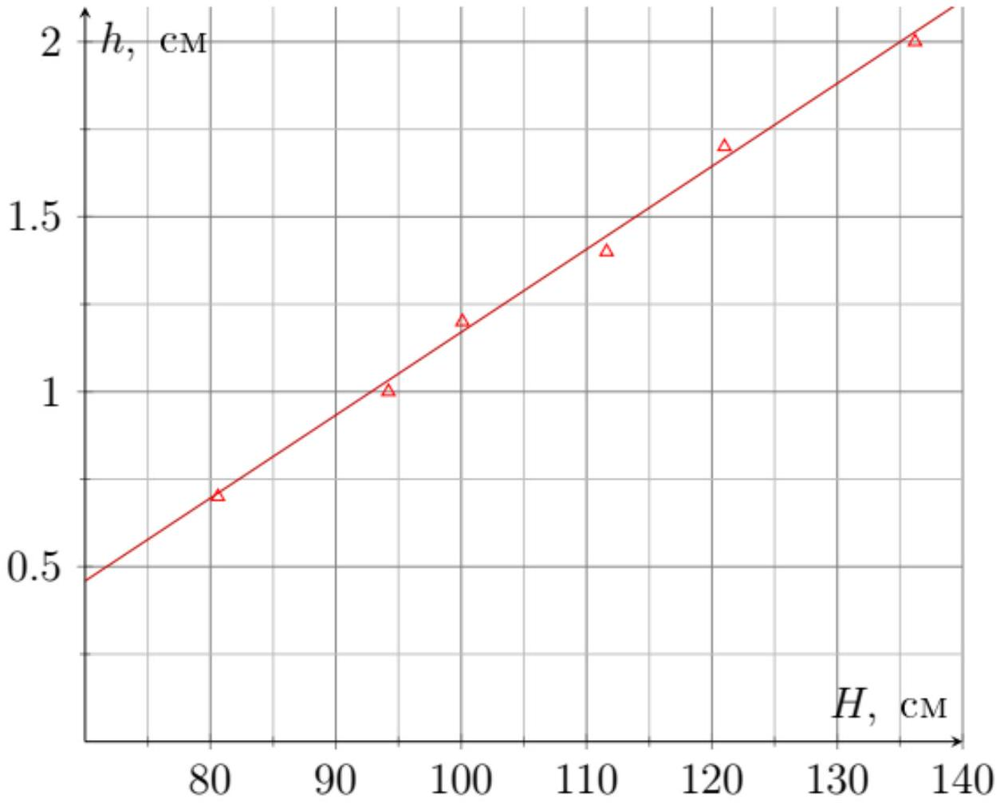

D2 ${ } ^ { 0.55 }$ Линеаризуйте зависимость $p$ от $H$, постройте ее график. Рассчитайте параметры источника $W _ { A }$ и $H _ { A }$, сделав дополнительные измерения при необходимости.

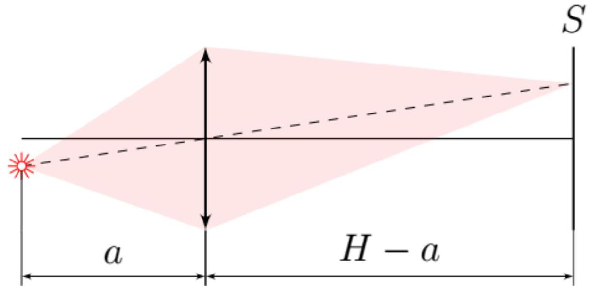
Высота сфокусированного изображения $h$ выражается через высоту спирали $H _ { A }$ :

$$
\frac { H _ { A } } { a } = \frac { w } { H - a } .
$$

Найдем $a$ из формулы тонкой линзы:

$$
\frac { 1 } { a } + \frac { 1 } { H - a } = \frac { 1 } { F } \quad \Rightarrow \quad a ^ { 2 } - a H + F H = 0
$$

Из двух корней нас интересует меньший $a = \frac { 1 } { 2 } \left( H - \sqrt { H ^ { 2 } - 4 F H } \right)$.
В таком случае линейной с коэффициентом наклона $H _ { A }$ оказывается зависимость $h$ от $X _ { 2 }$, где

$$
X _ { 2 } = \frac { H + \sqrt { H ^ { 2 } - 4 F H } } { H - \sqrt { H ^ { 2 } - 4 F H } }
$$

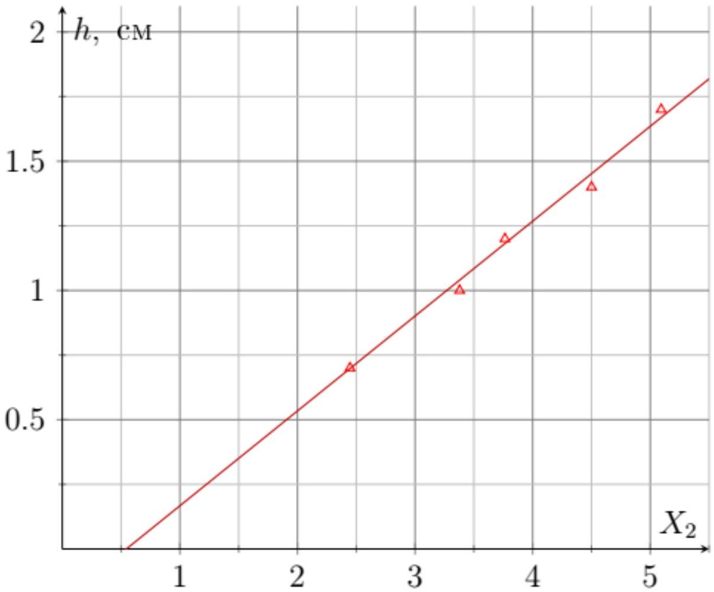

Координата $X _ { 2 } = \frac { H + \sqrt { H ^ { 2 } - 4 F H } } { H - \sqrt { H ^ { 2 } - 4 F H } }$.

Ответ: Из коэффициент наклона графика $H _ { A } = 0.37 с м$.
Измерим отношение $\frac { H _ { A } } { W _ { A } }$ по увеличенному изображению: $\frac { H _ { A } } { W _ { A } } = \frac { 3.1 \mathrm { cм } } { 1.0 \mathrm {~cm} }$, значит $W _ { A } = 0.12$ см.

D3 ${ } ^ { 0.10 }$ Посчитайте количество спиралей $N _ { A }$ в спирали источника.

Ответ: Посмотрим на увеличенное с помощью линзы изображение на экране, также будем использовать диафрагму, чтобы уменьшить размытие из-за аберраций.

$$
N _ { A } = 18
$$

E1 ${ } ^ { 0.85 }$ При различных фиксированных значениях $a$ подберите расстояния $l$, соответствующие четкому изображению. Измерьте высоту четкого изображения $h$. Если при нескольких разных значениях $l$ получается несколько четких изображений, то выбирайте изображение, имеющее большее $h$. У зависимости $h$ от $a$ есть характерная точка, опишите ее и промерьте ее окрестность особенно тщательно. Всего сделайте не менее 15 -ти измерений.

Ответ:
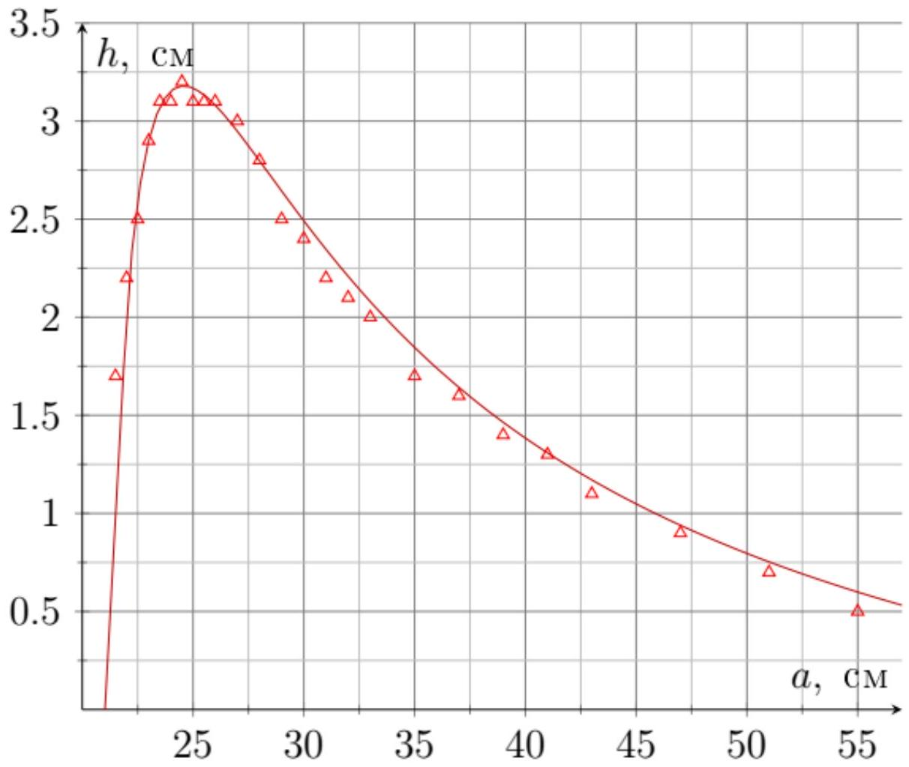

E2 ${ } ^ { 1.74 }$ Получите теоретическую формулу для зависимости $h$ от $a$. Постройте линеаризованный график и покажите, что теоретическая формула справедлива.
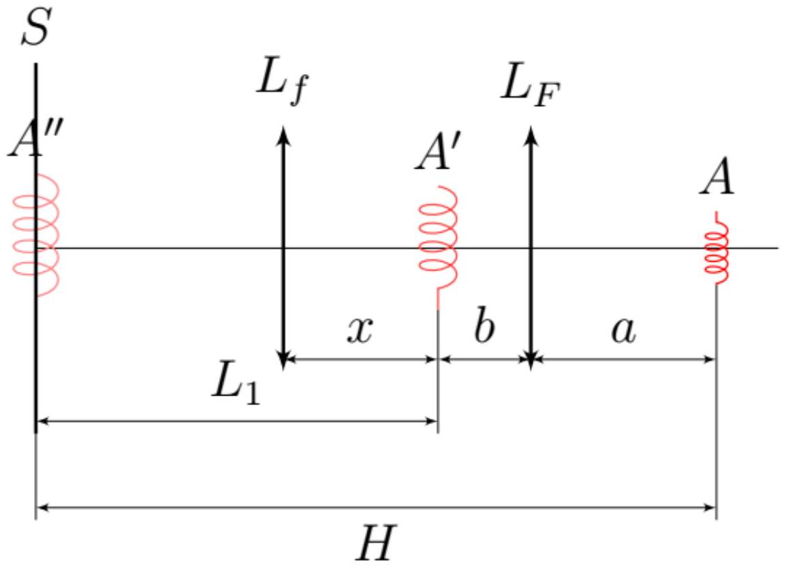
Формулы тонкой линзы:

$$
\begin{gathered}
\frac { 1 } { a } + \frac { 1 } { b } = \frac { 1 } { F } \Rightarrow b = \frac { a F } { a - F } \\
\frac { 1 } { x } + \frac { 1 } { L _ { 1 } - x } = \frac { 1 } { f } , \quad L _ { 1 } = H - a - b
\end{gathered}
$$

Получим уравнение на $x$ из второй формулы тонкой линзы:

$$
x ^ { 2 } - x L _ { 1 } - f L _ { 1 } = 0 , \quad \mathcal { D } = L _ { 1 } ^ { 2 } - 4 f L _ { 1 } , \quad x _ { 1,2 } = L _ { 1 } \frac { 1 \pm \sqrt { 1 - \frac { 4 f } { L _ { 1 } } } } { 2 } .
$$

При меньшем $x$ изображение больше, поэтому выбираем корень с минусом.
Теперь выразим высоту $h$ изображения $A ^ { \prime \prime }$, пусть высота $A ^ { \prime } - h ^ { \prime }$. Из подобных треугольников:

$$
\frac { H _ { A } } { a } = \frac { h ^ { \prime } } { b } , \quad \frac { h ^ { \prime } } { x } = \frac { h } { L _ { 1 } - x } .
$$

В итоге

$$
h = \frac { L _ { 1 } - x } { x } \frac { b } { a } H _ { A } = \frac { 1 + \sqrt { 1 - \frac { 4 f } { L _ { 1 } } } } { 1 - \sqrt { 1 - \frac { 4 f } { L _ { 1 } } } } \frac { F } { a - F } H _ { A } ,
$$

где $L _ { 1 } = H - a - \frac { a F } { a - F }$.
Таким образом линеаризация $h$ от $X _ { 3 }$, где

$$
X _ { 3 } = \frac { 1 + \sqrt { 1 - \frac { 4 f } { H - a - \frac { a F } { a - F } } } } { 1 - \sqrt { 1 - \frac { 4 f } { H - a - \frac { a F } { a - F } } } } \frac { F } { a - F } .
$$

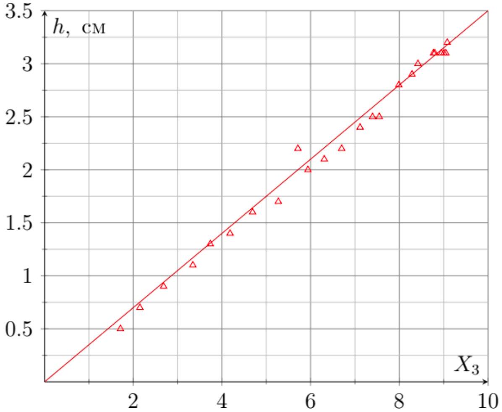

Ответ: Коэффициент наклона графика $k = 0.35$ см, что полностью соответствует $H _ { A }$ полученному в других пунктах.

E3 ${ } ^ { 0.80 }$ Настройте телескоп Кеплера так, чтобы расстояние между линзой $L _ { f }$ и линейкой было $H \approx 1.20 \mathrm {~m}$, и через телескоп Вам было четко видно увеличенное изображение линейки. Сделайте необходимые измерения и рассчитайте экспериментальное значение увеличения $\Gamma _ { K }$ телескопа Кеплера в такой системе.

Увеличение телескопа Кеплера можно оценить, если сравнить видимое изображение линейки с другим известным размером. Например, на пластиковое обрамление линзы наклеить две полоски малярного скотча. На фотографии показан процесс таких измерений.
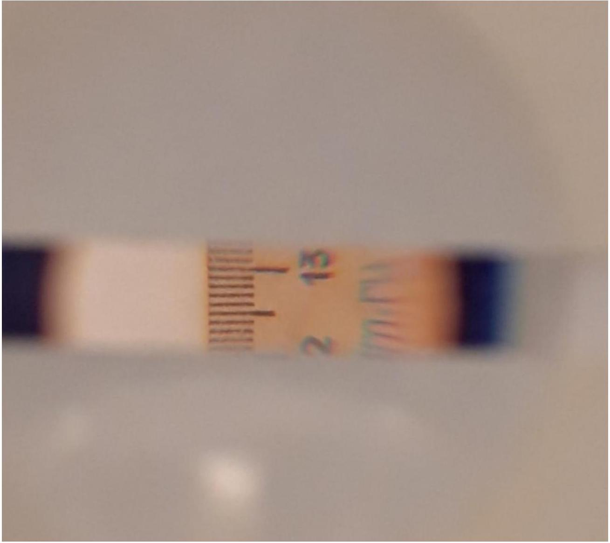

Ответ: С расстояния $L _ { \Gamma } = 33$ см мы видим, что щели толщиной $h _ { \Gamma } = 21$ мм соответствует $H _ { \Gamma } = 23$ мм на линейке. Расстояние между линейкой и линзой $H = 118$ см. Значит увеличение $\Gamma$ можно найти так:

$$
\Gamma = \frac { h _ { \Gamma } } { L _ { \Gamma } } \cdot \frac { H + L _ { \Gamma } } { H _ { \Gamma } } = 4.2
$$

Пронаблюдайте искажение изображения линейки у краев области видимости телескопа. Зарисуйте видимое через телескоп Кеплера изображение линейки. На рисунке отобразите и хроматические, и сферические аберрации.

Ответ:
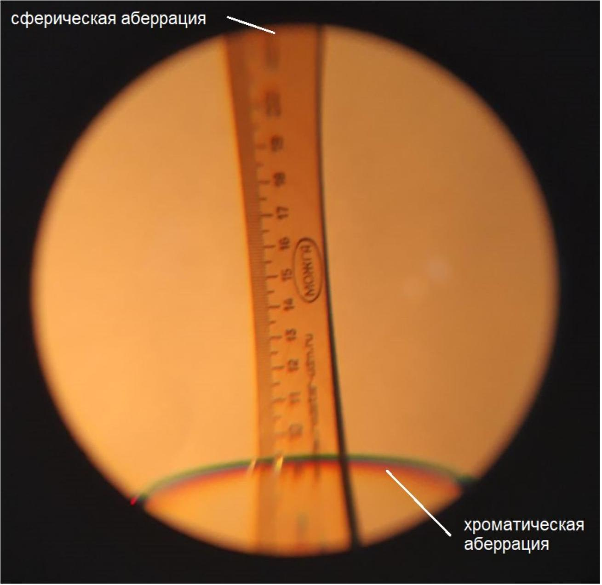
