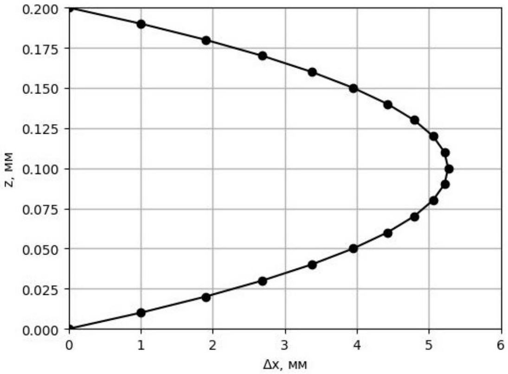
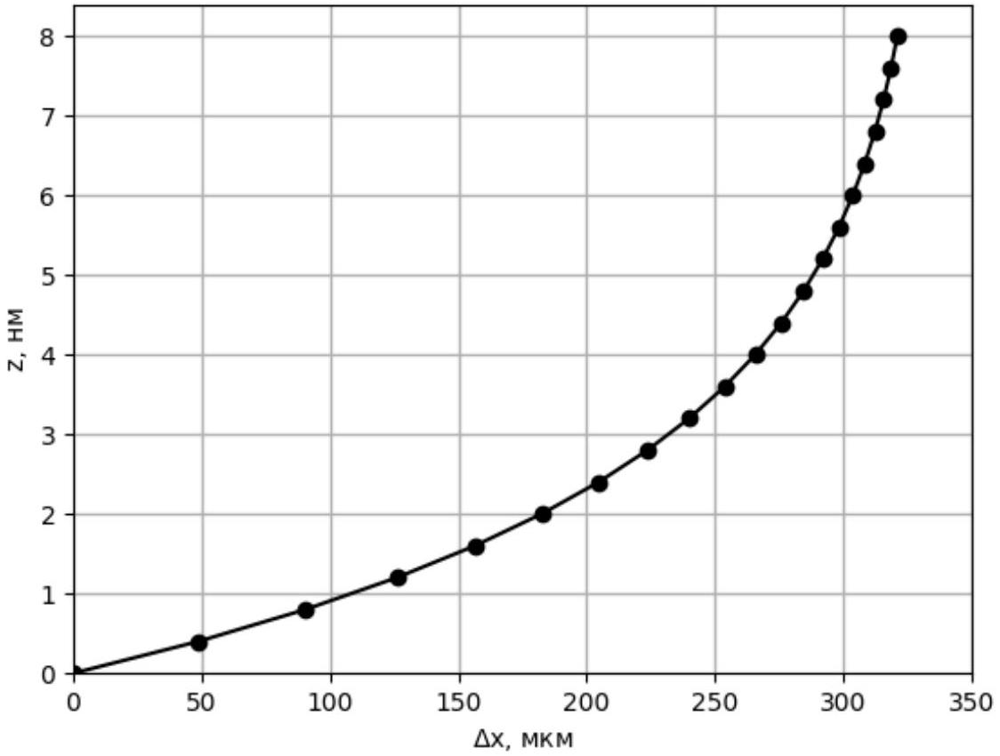
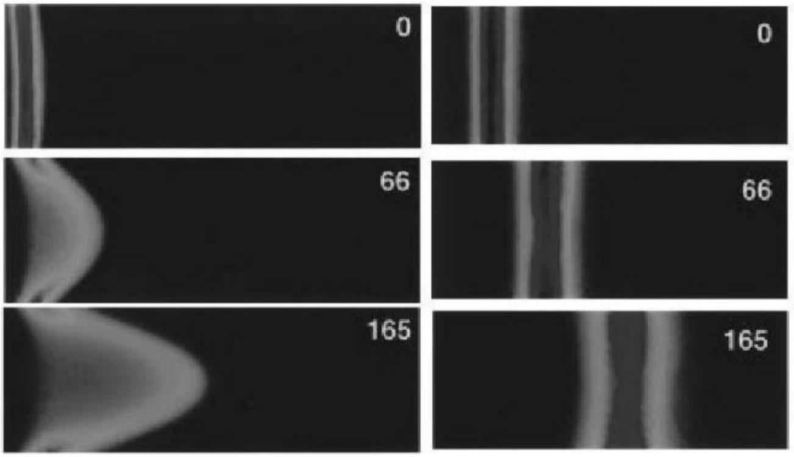

А1 ${ } ^ { 1.00 }$ Пусть в капилляре имеется установившееся ламинарное течение воды. Найдите зависимость скорости течения жидкости $v ( z )$ в капилляре от координаты $z$ при установившемся ламинарном течении воды в капилляре. Ось $z$ направлена вдоль стороны $b$, начало координат находится на одной из стенок капилляра. Выразите ответ через $\Delta P$, параметры капилляра и вязкость жидкости $\eta$.

Рассмотрим тонкий слоя жидкости, заключённый между плоскостями с координатами $z _ { 1 } = z$ и $z _ { 2 } = z + d z$. Силы вязкого трения, действующие в соответствующих плоскостях:

$$
\begin{gathered}
f _ { 1 } = - \eta a L \frac { d v _ { x } } { d z } ( z ) \\
f _ { 2 } = \eta a L \frac { d v _ { x } } { d z } ( z + d z )
\end{gathered}
$$

Тогда второй закон Ньютона примет вид:

$$
\begin{equation*}
\Delta P a d z + f _ { 1 } + f _ { 2 } = 0 \tag{1}
\end{equation*}
$$

Отсюда уравнение на скорость:

$$
\begin{equation*}
\frac { d ^ { 2 } v _ { x } } { d z ^ { 2 } } = - \frac { \Delta P } { \eta L } \tag{2}
\end{equation*}
$$

Заметим, что совершенно необязательно было устремлять толщину слоя к нулю (т.е. уравнение (1) верно и при конечном $d z$ ). Более того, зафиксировав (например $z _ { 1 } = 0$ или $z _ { 1 } = b / 2$ ), мы получим проинтегрированный аналог уравнения (2).

Общее решение уравнения (2) имеет вид:

$$
v _ { x } = - \frac { \Delta P } { \eta L } \frac { z ^ { 2 } } { 2 } + C _ { 1 } z + C _ { 2 }
$$

Константы интегрирования определяются граничными условиями, в данном случае $- v ( 0 ) = 0$ и $v ( b ) = 0$. Отсюда получаем правильный ответ

Ответ:

$$
v ( z ) = \frac { \Delta P } { 2 \eta L } \left( b z - z ^ { 2 } \right)
$$

A2 ${ } ^ { 1.00 }$ В некоторый момент в начальное сечение капилляра $A A ^ { \prime }$ равномерно впрыскивается реагент. На рисунке жирные горизонтальные линии обозначают стенки капилляра. В листе ответов нарисуйте, где будет находиться реагент через $\tau = 5$ с. Для рисунка выберите подходящий масштаб по горизонтальной оси, которая направлена вдоль течения жидкости.

Параметры капилляра: $L = 8 \mathrm {~mm} , b = 0.2 \mathrm {~mm}$, разность давлений $\Delta P = 1.5$ Па, $\eta = 8.9 \cdot 10 ^ { - 4 }$ Па • с. Диффузией реагента пренебрегите.

Построим на графике зависимость $x ( z ) = \tau v ( z )$

Ответ:

В1 ${ } ^ { 0.50 }$ Найдите установившуюся скорость ионов $v _ { z } ( z )$ на расстоянии $z$ от границы капилляра. Считайте, что перемещение иона за время установления скорости мало. Ответ выразите через заряд иона $q ( q = \pm e ) , \alpha$ и потенциал $\varphi ( z )$ (и его производные).

В установившемся режиме второй закон Ньютона в проекции на ось $z$ выглядит следующим образом:

$$
- \alpha v _ { z } + q E _ { z } = 0
$$

Выражая электрическое поле через градиент потенциала $E _ { z } = - \frac { d \varphi } { d z }$, получаем ответ

Ответ:

$$
\begin{equation*}
v _ { z } = - \frac { q } { \alpha } \frac { d \varphi } { d z } \tag{3}
\end{equation*}
$$

В2 ${ } ^ { 1.50 }$ Выразите концентрации катионов ( $n _ { + }$) и анионов ( $n _ { - }$) вблизи стенки капилляра через потенциал в этой точке, а также через $n _ { 0 } , e , \alpha , k , T$.

Поток частиц, связанный с наличием электрического поля уравновешивается потоком ионов, связанным с диффузией. Таким образом, условие баланса будет выглядеть следующим образом:

$$
n v _ { z } - D \frac { d n } { d z } = 0
$$

Подставляя сюда уравнение (3), получим

$$
- \frac { q } { \alpha D } \frac { d \varphi } { d z } = \frac { 1 } { n } \frac { d n } { d z }
$$

Интегрируя обе части уравнения по $z$ и подставляя $D = \frac { k T } { \alpha }$, находим

$$
- \frac { q } { k T } ( \varphi - 0 ) = \ln \left( \frac { n } { n _ { 0 } } \right)
$$

В итоге,

Ответ:

$$
n = n _ { 0 } \exp \left( - \frac { q \varphi } { k T } \right)
$$

Результат данного пункта является частным случаем распределения Больцмана. Конечно же, такое совпадение не случайно.

Вз ${ } ^ { 0.50 }$ Выразите объемную плотность нескомпенсированного заряда $\rho ( z )$ вблизи стенки капилляра через потенциал $\varphi ( z )$, концентрацию ионов $n _ { 0 }$ и физические постоянные $e , k , T$. Считая, что приложенный к стенке потенциал мал ( $e \varphi _ { 0 } \ll k T$ ), получите приближенное значение $\rho ( z )$.

$$
\begin{equation*}
\rho = e \left( n _ { + } - n _ { - } \right) = e n _ { 0 } \left[ \exp \left( - \frac { e \varphi } { k T } \right) - \exp \left( \frac { e \varphi } { k T } \right) \right] = - 2 e n _ { 0 } \sinh \left( \frac { e \varphi } { k T } \right) \tag{4}
\end{equation*}
$$

Раскладывая выражение по параметру $\frac { e \varphi } { k T }$, найдём

Ответ:

$$
\begin{equation*}
\rho \approx - 2 \frac { e ^ { 2 } n _ { 0 } \varphi } { k T } \tag{5}
\end{equation*}
$$

В4 ${ } ^ { 1.00 }$ Найдите зависимость потенциала $\varphi ( z )$ от координаты вблизи стенки капилляра в диффузном слое. Помните, что на границе потенциал равен $\varphi \delta$. Выразите ответ через $n _ { 0 } , \varphi _ { \delta } , T$, физические постоянные и параметры электролита.

Теорема Гаусса в дифференциальной форме в одномерном случае имеет вид:

$$
\rho = - \varepsilon \varepsilon _ { 0 } \frac { d ^ { 2 } \varphi } { d z ^ { 2 } }
$$

Используя разложение (5) получаем

$$
\begin{equation*}
\frac { d ^ { 2 } \varphi } { d z ^ { 2 } } = 2 \frac { e ^ { 2 } n _ { 0 } } { \varepsilon \varepsilon _ { 0 } k T } \varphi \tag{6}
\end{equation*}
$$

Это линейное дифференциальное уравнение, его общее решение в данном случае выглядит следующим образом:

$$
\varphi ( z ) = C _ { 1 } \exp ( z / \lambda ) + C _ { 2 } \exp ( - z / \lambda ) ,
$$

где $\lambda$ определяется из уравнения (6), а коэффициенты $C _ { 1 }$ и $C _ { 2 }$ - из начальных условий $\varphi ( 0 ) = \varphi _ { \delta }$ и $\varphi ( + \infty ) = 0$. Заметим, что второе граничное условие автоматически подразумевает $\lambda \ll b$, т.е. нахождение второй стенки на бесконечности. При учёте отклонения от этого условия, строго говоря, $C _ { 1 } \neq 0$. Однако, ответ пункта B5 позволяет отбросить какие-либо сомнения по этому поводу. В итоге

Ответ:

$$
\begin{equation*}
\varphi ( z ) = \varphi _ { \delta } \exp ( - z / \lambda ) \tag{7}
\end{equation*}
$$

где $\lambda = \sqrt { \frac { \varepsilon \varepsilon _ { 0 } k T } { 2 e ^ { 2 } n _ { 0 } } }$.

Примечание.
Заметим более интересный с точки зрения физики момент. Для применимости разложения $( 5 )$ и характерных значений $\varphi _ { \delta } \sim 1 \mathrm {~B}$ температура $T$ должна быть $T \gg \frac { e \varphi _ { \delta } } { k } \sim 10 ^ { 4 } \mathrm {~K}$ !

Однако, используемое в задаче приближение не так плохо, как могло бы показаться на первый взгляд. Убедимся в этом, решив уравнения без использования приближения (5).

Из комбинации (4) и теоремы Гаусса находим:

$$
\frac { d ^ { 2 } \varphi } { d z ^ { 2 } } = 2 \frac { e n _ { 0 } } { \varepsilon \varepsilon _ { 0 } } \sinh \left( \frac { e \varphi } { k T } \right)
$$

Далее, интегрируя уравнение по $\varphi$ :

$$
\begin{gathered}
\int \sinh \left( \frac { e \varphi } { k T } \right) d \varphi = \frac { k T } { e } \cosh \left( \frac { e \varphi } { k T } \right) + C \\
\int \frac { d ^ { 2 } \varphi } { d z ^ { 2 } } d \varphi = \int \frac { d \varphi _ { z } ^ { \prime } } { d z } \varphi _ { z } ^ { \prime } d z = \int \varphi _ { z } ^ { \prime } d \varphi _ { z } ^ { \prime } = \frac { \left( \varphi _ { z } ^ { \prime } \right) ^ { 2 } } { 2 } + C
\end{gathered}
$$

где $\varphi _ { z } ^ { \prime } \equiv \frac { d \varphi } { d z } = - E _ { z }$. Подставляя граничное условие $\varphi _ { z } ^ { \prime } ( + \infty ) = 0$ получаем:

$$
\varphi _ { z } ^ { \prime } = - 2 \sqrt { \frac { e n _ { 0 } } { \varepsilon \varepsilon _ { 0 } } \frac { k T } { e } \left( \cosh \left( \frac { e \varphi } { k T } \right) - 1 \right) } = - 2 \sqrt { 2 \frac { e n _ { 0 } } { \varepsilon \varepsilon _ { 0 } } \frac { k T } { e } } \sinh \left( \frac { e \varphi } { 2 k T } \right)
$$

Далее, разделяя переменные и интегрируя:

$$
- 2 \sqrt { 2 \frac { e n _ { 0 } } { \varepsilon \varepsilon _ { 0 } } \frac { k T } { e } } z = \int _ { \varphi _ { \delta } } ^ { \varphi } \frac { d \varphi } { \sinh \left( \frac { e \varphi } { 2 k T } \right) } = \left. \frac { 2 k T } { e } \ln \tanh \frac { e \varphi } { 4 k T } \right| _ { \varphi _ { \delta } } ^ { \varphi }
$$

Отсюда

$$
\varphi = \frac { 4 k T } { e } \tanh ^ { - 1 } \left[ \tanh \left( \frac { e \varphi _ { \delta } } { 4 k T } \right) \exp ( - z / \lambda ) \right] ,
$$

где $\lambda$ в точности равна своему значению в предыдущем рассмотрении.
Теперь проанализируем асимптотику данного решения на бесконечности. Для $z \gg \lambda$ экспонента оказывается малой, поэтому в ведущем приближении $\tanh ^ { - 1 } ( x ) \approx x$, и реальная зависимость оказывается

$$
\varphi \rightarrow \frac { 4 k T } { e } \tanh \left( \frac { e \varphi _ { \delta } } { 4 k T } \right) \exp ( - z / \lambda )
$$

Такие образом, наше приближение на низких температурах даёт правильное значение \lambda\$, однако коэффициент перед экспонентой (префактор) будет неточным.

В5 ${ } ^ { 0.50 }$ Найдите расстояние $\lambda$ (формулу и численное значение), на котором потенциал $\varphi ( z )$ уменьшается в $e$ раз. Эта длина считается характерным размером диффузного слоя Гуи. Вязкость жидкости $\eta = 8.9 \cdot 10 ^ { - 4 }$ Па $\cdot$ с, концентрация ионов $n = 1.1 \cdot 10 ^ { 25 } \mathrm { M } ^ { - 3 }$, электрическая постоянная $\varepsilon _ { 0 } = 8.85 \cdot 10 ^ { - 12 } \Phi / \mathrm { M }$, постоянная Больцмана $k = 1.38 \cdot 10 ^ { - 23 }$ Дж/К, температура $T = 300$ К, диэлектрическая проницаемость $\varepsilon = 100$.

Потенциал уменьшается в $e$ раз при $z = \lambda$, формула для $\lambda$ была найдена в пункте $B 4$.

Ответ: $\lambda = \sqrt { \frac { \varepsilon \varepsilon _ { 0 } k T } { 2 e ^ { 2 } n _ { 0 } } } \approx 2,55 \mathrm { hm }$

Запишите второй закон Ньютона для небольшого объема жидкости в проекции на направление электрического поля, учитывающий вязкое трение и электрическое поле, действующие на нескомпенсированный заряд. Выразите ответ через электрическое поле $E$, концентрацию ионов $n _ { 0 }$, потенциал $\varphi ( z )$, параметры жидкости и капилляра, а также скорость $v ( z )$ и ее производные.

Данный пункт аналогичен решению пункта $A 1$. Силы вязкого трения, действующие на слой будут эквивалентны, а электрическое поле будет действовать с силой

$$
F _ { E } = \rho E a L d z
$$

Тогда аналогично уравнению (1):

$$
\eta \frac { d ^ { 2 } v } { d z ^ { 2 } } + \rho E = 0
$$

С учетом выражений (5) и (7):

$$
\eta \frac { d ^ { 2 } v } { d z ^ { 2 } } - \frac { \varepsilon \varepsilon _ { 0 } E } { \lambda ^ { 2 } } \varphi _ { \delta } \exp ( - z / \lambda ) = 0
$$

Ответ:

$$
\eta \frac { d ^ { 2 } v } { d z ^ { 2 } } - \frac { \varepsilon \varepsilon _ { 0 } E } { \lambda ^ { 2 } } \varphi _ { \delta } \exp ( - z / \lambda ) = 0
$$

C2 ${ } ^ { 1.20 }$
Найдите зависимость скорости течения жидкости от координаты $v ( z )$.

Из пункта $C 1$ имеем дифференциальное уравнение:

$$
\frac { d ^ { 2 } v } { d z ^ { 2 } } = \frac { \varepsilon \varepsilon _ { 0 } E } { \eta \lambda ^ { 2 } } \varphi _ { \delta } e ^ { ( - z / \lambda ) }
$$

Найдем его решение, проинтегрировав обе части по $d z$ дважды:

$$
v = \frac { \varepsilon \varepsilon _ { 0 } E } { \eta } \varphi _ { \delta } e ^ { ( - z / \lambda ) } + C _ { 1 } z + C _ { 2 } \quad \left( C _ { 1 } , C _ { 2 } = \text { const } \right)
$$

Из граничного условия $v ( 0 ) = 0$ находим:

$$
C _ { 2 } = - \frac { \varepsilon \varepsilon _ { 0 } E } { \eta } \varphi _ { \delta }
$$

Со вторым граничным условием всё обстоит немного сложнее. Строго говоря, правильным граничным условием является $v ( b ) = 0$. Однако для того, чтобы рассматривать вторую стенку необходимо внести изменения и в распределение потенциала, добавив возрастающую экспоненту. Но с точки зрения физики это только добавит такую же картинку распределения потенциала у другой стенки.

При рассмотрении же только одной стенки возникает следующая проблема: с используемой точностью при $z \sim \lambda$ любые граничные условия для $z \sim b$ будут неотличимы друг от друга, так как фактически они все эквивалентны бесконечности и члены вида $z / b \ll 1$ пренебрежимо малы. Тем не менее если мы хотим найти распределение потенциала на масштабах размеров трубы, вклад этих членов становится существенным.

В нашей же модели найти $C _ { 2 }$ можно следующим образом. Обратимся к формуле (8) - она справедлива при любом $\varphi ( z )$. Т.к. граничные условия на стенках одинаковы, $v ( z )$ и $\varphi ( z )$ должны быть симметричны относительно центра трубы. Из этого факта и формулы (8) следует $C _ { 1 } = 0$.

Ответ:

$$
v = - \frac { \varepsilon \varepsilon _ { 0 } E } { \eta } \varphi _ { \delta } \left( 1 - e ^ { - z / \lambda } \right)
$$

Примечание.
На самом деле можно получить более общее выражение для скорости $v$, показав, что она зависит только лишь от $\varphi ( z )$, при этом вид самой зависимости потенциала от координаты неважен. Запишем уравнение:

$$
\eta \frac { d ^ { 2 } v } { d z ^ { 2 } } + \rho E = 0
$$

С учетом теоремы Гаусса оно запишется в виде:

$$
\eta \frac { d ^ { 2 } v } { d z ^ { 2 } } - \varepsilon \varepsilon _ { 0 } \frac { d ^ { 2 } \varphi } { d z ^ { 2 } } E = 0
$$

Аналогично два раза проинтегрируем по $d z$ и получим:

$$
v = \frac { \varepsilon \varepsilon _ { 0 } E \varphi } { \eta } + C _ { 3 } z + C _ { 4 } \quad \left( C _ { 3 } , C _ { 4 } = \text { const } \right)
$$

$C _ { 3 } = 0$ в силу симметрии трубки.
При $\varphi = \varphi _ { \delta } v = 0$, откуда $C _ { 4 } = - \frac { \varepsilon \varepsilon _ { 0 } E \varphi _ { \delta } } { \eta }$.
Итоговый ответ:

$$
\begin{equation*}
v = \frac { \varepsilon \varepsilon _ { 0 } E } { \eta } \left( \varphi - \varphi _ { \delta } \right) \tag{8}
\end{equation*}
$$

С3 ${ } ^ { 1.00 }$ Пусть в капилляре имеется установившееся ламинарное течение воды. В некоторый момент в сечение $A A ^ { \prime }$ капилляра равномерно впрыскивается реагент, рисунок такой же как в части А. В листе ответов нарисуйте, где будет находиться реагент через $\tau = 5$ с. Используйте параметры капилляра из А2 и численные данные из В5. Потенциал $\varphi _ { \delta } = 1.8 \mathrm {~B}$, падение напряжения на длине капилляра $U = 0.3 \mathrm {~B}$. Пренебрегите диффузией реагента вне диффузионного слоя. Для рисунка выберите подходящий масштаб по горизонтальной оси, направленной вдоль направления течения жидкости.

По формуле для скорости, полученной в пункте $C 2$ легко рассчитывается смещение слоя жидкости ( $\Delta x = v \tau$ ). Получив значения для нескольких $z$, можно построить график, представленный ниже.

Ответ:

Заметим, что экспонента значительно затухает уже при $z \sim \lambda$. Учитывая, что $\lambda \ll b$, при $z \sim b v \approx - \frac { \varepsilon \varepsilon _ { 0 } E } { \eta } \varphi _ { \delta } =$ const., и на рисунке фронт будет изображаться как прямая линия, параллельная оси $z$.

Фотографии реального эксперимента. Слева -- профиль распределения реагента в случае однородно распределённого давления, справа -- случай, рассматриваемый в части C.

С4 ${ } ^ { 1.00 }$ На основе части С этой задачи предложите систему, которая позволяет перемешать слои жидкости, текущие вблизи стенки капилляра.

Ответ: В данной части возможны различные системы, приведем качественный пример одной из них.
Обозначим за $O x$ ось, сонаправленную с $\vec { E }$ на рисунке из части $C$. Пусть проекция поля на данную ось имеет следующий вид зависимости от координаты $x$ :

$$
E _ { x } = E _ { 0 } \sin ( k x )
$$

На основании предыдущих пунктов части $C$ мы можем утверждать, что это приведет к тому, что слои в некоторых местах будут вынуждены двигаться навстречу друг другу. Такое движение приведет к их смешиванию.
