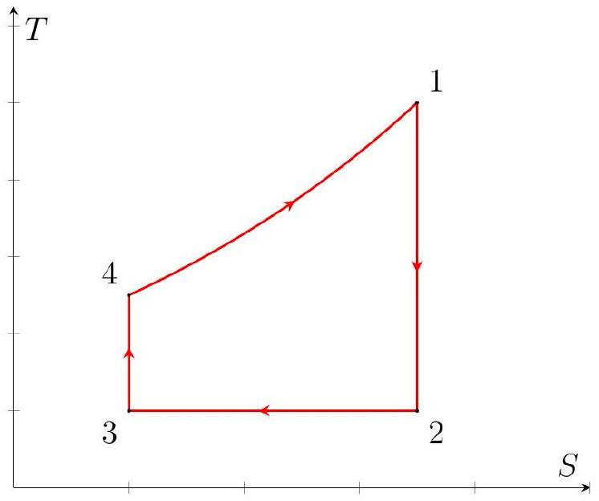
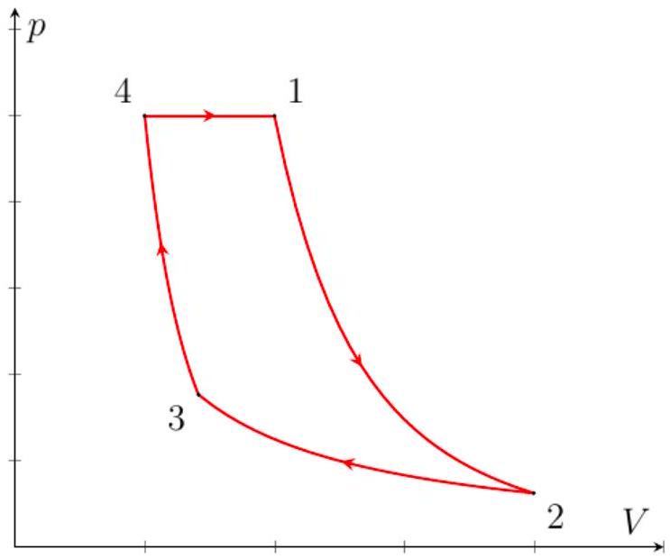
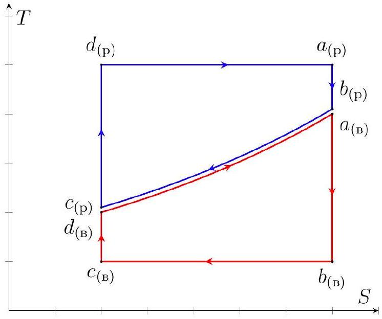
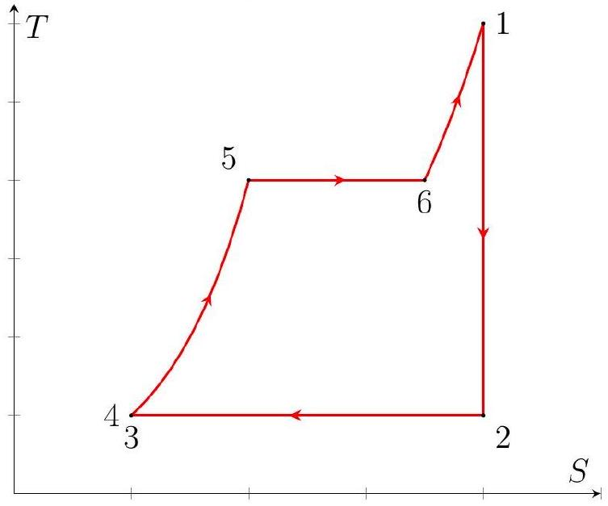
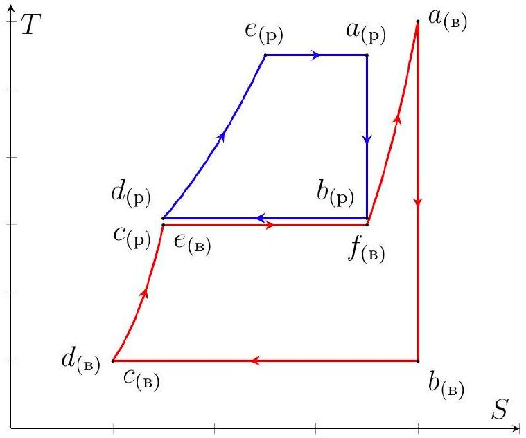

Решение в $T S$ координатах.
На рисунке представлена качественная диаграмма рассматриваемого цикла в $T S$ координатах.

Тепло отводится от газа в изотермическом процессе, поэтому для $Q _ { - }$получим:

$$
Q _ { - } = T _ { 2 } \left( S _ { 2 } - S _ { 3 } \right)
$$

где $S _ { 2 }$ и $S _ { 3 }$ - энтропия газа в точках 2 и 3 соответственно.
Поскольку изменение энтропии в адиабатических процессах равно нулю:

$$
S _ { 2 } - S _ { 3 } = S _ { 1 } - S _ { 4 } = \int _ { T _ { 4 } } ^ { T _ { 1 } } \frac { \nu C _ { p } d T } { T } = \frac { \gamma \nu R } { \gamma - 1 } \ln \frac { T _ { 1 } } { T _ { 4 } }
$$

откуда находим

Ответ:

$$
Q _ { - } = \frac { \gamma \nu R T _ { 2 } } { \gamma - 1 } \ln \frac { T _ { 1 } } { T _ { 4 } }
$$

Решение в $p V$ или $p T$ координатах.
На диаграмме представлен качественный график процесса в координатах $p V$.

Используем уравнение Менделеева-Клапейрона:

$$
p V = \nu R T
$$

Тепло отводится от газа в изотермическом процессе, в котором $\delta Q = \delta A$, поэтому:

$$
\delta Q = p d V = \frac { \nu R T d V } { V } \Rightarrow Q _ { - } = \nu R T _ { 2 } \int _ { V _ { 3 } } ^ { V _ { 2 } } \frac { d V } { V } = \nu R T _ { 2 } \ln \frac { V _ { 2 } } { V _ { 3 } }
$$

Поскольку процесс 23 изотермический - $V _ { 2 } / V _ { 3 } = p _ { 3 } / p _ { 2 }$. Перепишем выражение для $Q _ { - }$:

$$
Q _ { - } = \nu R T \ln \frac { p _ { 3 } } { p _ { 2 } }
$$

Для идеального газа в квазистатическом адиабатическом процессе верно уравнение Пуассона:

$$
p \sim T ^ { \gamma / ( \gamma - 1 ) }
$$

поэтому:

$$
\left\{ \begin{array} { l }
\frac { p _ { 1 } } { p _ { 2 } } = \left( \frac { T _ { 1 } } { T _ { 2 } } \right) ^ { \gamma / ( \gamma - 1 ) } \\
\frac { p _ { 4 } } { p _ { 3 } } = \left( \frac { T _ { 4 } } { T _ { 3 } } \right) ^ { \gamma / ( \gamma - 1 ) }
\end{array} \Longrightarrow \frac { p _ { 3 } } { p _ { 2 } } = \left( \frac { T _ { 1 } } { T _ { 4 } } \right) ^ { \gamma / ( \gamma - 1 ) } \right.
$$

Поскольку $T _ { 3 } = T _ { 2 }$ и $p _ { 4 } = p _ { 1 }$.
Окончательно:

Ответ:

$$
Q _ { - } = \frac { \gamma \nu R T _ { 2 } } { \gamma - 1 } \ln \frac { T _ { 1 } } { T _ { 4 } }
$$

А2 ${ } ^ { 0.80 }$ Выразите отношение $T _ { 1 } / T _ { 4 }$ через $\alpha , \beta$ и $\gamma$.

Запишем уравнение адиабаты для процесса $1 - 2$ в координатах $p T$ :

$$
p ^ { 1 - \gamma } T ^ { \gamma } = \text { const } \Rightarrow \frac { T _ { 1 } } { T _ { 2 } } = \left( \frac { p _ { 1 } } { p _ { 2 } } \right) ^ { \frac { \gamma - 1 } { \gamma } }
$$

Поскольку $p _ { 1 } = p _ { 4 }$

$$
\frac { T _ { 1 } } { T _ { 2 } } = \beta ^ { \frac { \gamma - 1 } { \gamma } }
$$

Также, поскольку $T _ { 2 } = T _ { 4 } / \alpha$ :

Ответ:

$$
\frac { T _ { 1 } } { T _ { 4 } } = \frac { \beta ^ { \frac { \gamma - 1 } { \gamma } } } { \alpha }
$$

А3 ${ } ^ { 0.50 }$ Получите выражение для КПД цикла $\eta _ { 1 }$. Ответ выразите через $\alpha , \beta$ и $\gamma$.
Найдите численное значение $\eta _ { 1 }$ при $p _ { 2 } = 15$ кПа, $p _ { 4 } = 60$ кПа, $T _ { 2 } = 340$ К и $T _ { 4 } = 400$ К.

Поскольку $Q _ { + } = C _ { p } \left( T _ { 1 } - T _ { 4 } \right)$, имеем:

$$
\eta _ { 1 } = 1 - \frac { C _ { p } T _ { 2 } \ln \left( T _ { 1 } / T _ { 4 } \right) } { C _ { p } \left( T _ { 1 } - T _ { 4 } \right) }
$$

откуда

Ответ:

$$
\eta _ { 1 } = 1 - \frac { \ln \left( \beta ^ { \frac { \gamma - 1 } { \gamma } } / \alpha \right) } { \beta ^ { \frac { \gamma - 1 } { \gamma } } - \alpha }
$$

Для $\alpha$ и $\beta$ имеем:

$$
\alpha = \frac { 20 } { 17 } \quad \beta = 4
$$

откуда:

Ответ:

$$
\eta _ { 1 } = 0,226
$$

Решение в $T S$ координатах.
На рисунке представлены качественные диаграммы рассматриваемых циклов в $T S$ координатах.

Поскольку количества теплоты, полученные и отданные водяным и ртутным парами соответственно в изобарных политропных процессах одинаковы при одинаковых изменениях температурах - теплоёмкости в изобарных процессах также одинаковы:

$$
C _ { p ( \mathrm {~B} ) } = \frac { m _ { ( \mathrm { B } ) } \gamma _ { ( \mathrm { B } ) } R } { \mu _ { ( \mathrm { B } ) } \left( \gamma _ { ( \mathrm { B } ) } - 1 \right) } = \frac { m _ { ( \mathrm { p } ) } \gamma _ { ( \mathrm { p } ) } R } { \mu _ { ( \mathrm { p } ) } \left( \gamma _ { ( \mathrm { p } ) } - 1 \right) } = C _ { p ( \mathrm { p } ) }
$$

откуда:

Ответ:

$$
\frac { m _ { ( \mathrm { p } ) } } { m _ { ( \mathrm { B } ) } } = \frac { \mu _ { ( \mathrm { p } ) } } { \mu _ { ( \mathrm { B } ) } } \frac { \gamma _ { ( \mathrm { p } ) } - 1 } { \gamma _ { ( \mathrm { p } ) } } \frac { \gamma _ { ( \mathrm { B } ) } } { \gamma _ { ( \mathrm { B } ) } - 1 } = 17,81
$$

В2 ${ } ^ { 0.40 }$ Используя графики зависимости давления насыщенных паров ртути и воды от температуры, оцените значения давлений $p _ { c ( \mathrm { p } ) }$ и $p _ { c ( \mathrm {~B} ) }$.

Искомые давления равны давлениям насыщенных паров при температурах $t _ { 4 }$ для ртути и $t _ { 2 }$ для воды. Из графиков находим:

Ответ:

$$
p _ { c ( \mathrm { p } ) } = 6 \text { кПа }
$$

Ответ:

$$
p _ { c ( \text { в } ) } \approx 7 - 8 \text { кПа }
$$

B3 ${ } ^ { 0.80 }$ Найдите КПД ртутного и водяного цикла $\eta _ { ( \mathrm { p } ) }$ и $\eta _ { ( \mathrm { B } ) }$ соответственно.

Примечание: во всех пунктах далее подразумевается, что $T _ { i } = t _ { i } + T _ { 0 }$, где $T _ { 0 } = 273$ К.
Изменение энтропии в изотермических и изобарных процессах одинаковы, поэтому:

$$
\Delta S = \int _ { T _ { 4 } } ^ { T _ { 3 } } \frac { C _ { p } d T } { T } = C _ { p } \ln \frac { T _ { 3 } } { T _ { 4 } }
$$

Количество теплоты, полученное ртутью в изотермическом процессе, равно:

$$
Q _ { + ( \mathrm { p } ) } = T _ { 1 } \Delta S
$$

Количество теплоты, отданное водяным паром в изотермическом процессе, равно:

$$
Q _ { - ( \text {в } ) } = T _ { 2 } \Delta S
$$

В изобарном процессе водяной пар получает а ртуть отдаёт количество теплоты $Q _ { p }$, равное:

$$
Q _ { p } = C _ { p } \left( T _ { 3 } - T _ { 4 } \right)
$$

поэтому ответы для $\eta _ { ( \mathrm { p } ) }$ и $\eta _ { ( \mathrm { B } ) }$ следующие:

Ответ:

$$
\eta _ { ( \mathrm { p } ) } = 1 - \frac { T _ { 3 } - T _ { 4 } } { T _ { 1 } \ln \left( T _ { 3 } / T _ { 4 } \right) } = 0,326
$$

Ответ:

$$
\eta _ { ( \mathrm { B } ) } = 1 - \frac { T _ { 2 } \ln \left( T _ { 3 } / T _ { 4 } \right) } { T _ { 3 } - T _ { 4 } } = 0,491
$$

В4 ${ } ^ { 0.80 }$ Найдите КПД $\eta _ { \text {гп } }$ бинарного газово-пароводяного цикла. Сравните его с $\eta _ { ( \mathrm { p } ) }$ и $\eta _ { ( \mathrm { B } ) }$.

Решение в $T S$ координатах.
Поскольку в изобарном процессе газы обмениваются теплом друг с другом - к системе, участвующей в бинарном цикле, извне подводится тепло только в ртутном изотермическом процессе. Тогда КПД бинарного цикла такой же, как и у цикла Карно, состоящего из двух изотерм и двух адиабат с температурами $T _ { 1 }$ и $T _ { 2 }$ :

$$
\eta _ { \text {Карно } } = 1 - \frac { T _ { \mathrm { x } } } { T _ { \mathrm { H } } }
$$

Окончательно:

Ответ:

$$
\eta _ { \text {гп } } = 1 - \frac { T _ { 2 } } { T _ { 1 } } = 0,657 > \eta _ { ( \mathrm { p } ) } , \eta _ { ( \mathrm { B } ) }
$$

С1 ${ } ^ { 0,40 }$ Найдите температуры системы в точках 2, 3, 4, 5 и 6.

Поскольку процесс 23 изотермический, а изменением температуры на участке 34 по условию можно пренебречь - температуры $t _ { 2 } , t _ { 3 }$ и $t _ { 4 }$ равны температуре насыщенного пара при давлении $p _ { 3 } = 16$ кПа, т. е:

Ответ:

$$
t _ { 2 } = t _ { 3 } = t _ { 4 } = t _ { 1 } ^ { \prime } = 55 ^ { \circ } \mathrm { C }
$$

Температуры системы в точках 5 и 6 соответствуют температуре насыщенного пара при давлении $p _ { 4 } = 2,8$ МПа, т. е:

Ответ:

$$
t _ { 5 } = t _ { 6 } = t _ { 2 } ^ { \prime } = 230 ^ { \circ } \mathrm { C }
$$

C2 ${ } ^ { 0.60 }$ Найдите количество теплоты $Q _ { + }$, подведённое к системе за цикл.

На рисунке представлена качественная диаграмма рассматриваемого цикла в $T S$ координатах.

На участке $4 - 5$ жидкость нагревается, на участке $5 - 6$ - испаряется, а участок $6 - 1$ соответствует перегреванию водяного пара. Тогда для $Q _ { + }$имеем:

$$
Q _ { + } = c m \left( t _ { 5 } - t _ { 4 } \right) + L \left( t _ { 5 } \right) m + \frac { \gamma _ { ( \mathrm { B } ) } m R \left( t _ { 1 } - t _ { 6 } \right) } { \mu _ { ( \mathrm { B } ) } \left( \gamma _ { ( \mathrm { B } ) } - 1 \right) }
$$

Поскольку $t _ { 6 } > 180 ^ { \circ } \mathrm { C }$ - показатель адиабаты водяного пара равен $9 / 7$.
Подставляя численные значения, находим:

Ответ:

$$
Q _ { + } = 57,35 \text { МДж }
$$

с3 ${ } ^ { 0.80 }$ Найдите количество теплоты $Q _ { - }$, отведённое от системы за цикл.

Количество теплоты, отданное за цикл в изотермическом процессе, равняется:

$$
Q _ { - } = T _ { 2 } \left( S _ { 2 } - S _ { 3 } \right)
$$

Найдём изменение энтропии другим способом, учитывая, что процессы $1 - 2$ и $3 - 4$ являются адиабатными:

$$
S _ { 2 } - S _ { 3 } = S _ { 5 } - S _ { 4 } + S _ { 6 } - S _ { 5 } + S _ { 1 } - S _ { 6 } = m \left( c \ln \frac { T _ { 5 } } { T _ { 4 } } + \frac { L \left( t _ { 5 } \right) } { T _ { 5 } } + \frac { \gamma _ { ( \mathrm { B } ) } R } { \mu _ { ( \mathrm { B } ) } \left( \gamma _ { ( \mathrm { B } ) } - 1 \right) } \ln \frac { T _ { 1 } } { T _ { 6 } } \right)
$$

Таким образом:

$$
Q _ { - } = m T _ { 2 } \left( c \ln \frac { T _ { 5 } } { T _ { 4 } } + \frac { L \left( t _ { 5 } \right) } { T _ { 5 } } + \frac { \gamma _ { ( \mathrm { B } ) } R } { \mu _ { ( \mathrm { B } ) } \left( \gamma _ { ( \mathrm { B } ) } - 1 \right) } \ln \frac { T _ { 1 } } { T _ { 6 } } \right)
$$

Подставляя численные значение, находим:

Ответ:

$$
Q _ { - } = 36,83 \text { МДж }
$$

C4 ${ } ^ { 0.20 }$ Найдите работу газа $A$ за цикл и его КПД $\eta _ { 2 }$.

Воспользуемся законом сохранения энергии:

$$
A = Q _ { + } - Q _ { - }
$$

откуда:

Ответ:

$$
A = 20,52 \text { МДж }
$$

По определению:

$$
\eta _ { 2 } = \frac { A } { Q _ { + } } = 1 - \frac { Q _ { - } } { Q _ { + } }
$$

откуда:

Ответ:

$$
\eta _ { 2 } = 0,358
$$

D1 ${ } ^ { 0.20 }$ Найдите температуры в точках $b _ { \mathrm { B } } , c _ { \mathrm { B } } , d _ { \mathrm { B } } , e _ { \mathrm { B } } , f _ { \mathrm { B } }$ водяного цикла.

Температуры в точках $b _ { ( \mathrm { B } ) } , c _ { ( \mathrm { B } ) }$ и $d _ { ( \mathrm { B } ) }$ одинаковы и равны температуре насыщенного пара воды при давлении $p _ { c ( \mathrm {~B} ) }$ :

Ответ:

$$
t _ { b ( \mathrm {~B} ) } = t _ { c ( \mathrm {~B} ) } = t _ { d ( \mathrm {~B} ) } = t _ { 1 } = 96 ^ { \circ } \mathrm { C }
$$

Температуры в точках $e _ { ( \mathrm { B } ) }$ и $f _ { ( \mathrm { B } ) }$ одинаковы и равны температуре насыщенного пара воды при давлении $p _ { e ( \mathrm {~B} ) }$ :

Ответ:

$$
t _ { e ( \text { в } ) } = t _ { f ( \text { В } ) } = t _ { 2 } = 188 ^ { \circ } \mathrm { C }
$$

D2 ${ } ^ { 1.00 }$ Найдите температуру в точке $a _ { \mathrm { B } }$ водяного цикла.

На рисунке представлены качественные диаграммы рассматриваемых циклов в $T S$ координатах.

Поскольку процессы $a _ { \mathrm { B } } - b _ { \mathrm { B } }$ и $c _ { \mathrm { B } } - d _ { \mathrm { B } }$ являются адиабатическими - изменение энтропии на участках $d _ { \mathrm { B } } - e _ { \mathrm { B } } - f _ { \mathrm { B } } - a _ { \mathrm { B } }$ равно изменению энтропии на участке $c _ { \mathrm { B } } - b _ { \mathrm { B } }$ :

$$
S _ { b ( \text { В } ) } - S _ { c ( \text { В } ) } = S _ { e ( \text { В } ) } - S _ { d ( \text { В } ) } + S _ { f ( \text { В } ) } - S _ { e ( \text { В } ) } + S _ { a ( \text { В } ) } - S _ { f ( \text { В } ) }
$$

Для изменении энтропии воды на участках $d _ { \mathrm { B } } - e _ { \mathrm { B } } - f _ { \mathrm { B } } - a _ { \mathrm { B } }$ имеем:

$$
S _ { a ( \mathrm {~B} ) } - S _ { d ( \mathrm {~B} ) } = m _ { \mathrm { B } } \left( c _ { \mathrm { B } } \ln \frac { T _ { 2 } } { T _ { 1 } } + \frac { L _ { \mathrm { B } } \left( T _ { 2 } \right) } { T _ { 2 } } + \frac { \gamma _ { \mathrm { B } } R } { \mu _ { \mathrm { B } } \left( \gamma _ { \mathrm { B } } - 1 \right) } \ln \frac { T _ { a ( \mathrm {~B} ) } } { T _ { 2 } } \right)
$$

Для изменения энтропии на участке $c _ { \mathrm { B } } - b _ { \mathrm { B } }$ имеем:

$$
S _ { b ( \text { в } ) } - S _ { c ( \text { В } ) } = \frac { m _ { \text {в } } L _ { \text {в } } \left( T _ { 1 } \right) } { T _ { 1 } } + \frac { A _ { \text {пар } } } { T _ { 1 } }
$$

где $A _ { \text {пар } }$ - работа водяного пара при расширении. Найдём её:

$$
A _ { \text {пар } } = \int _ { V _ { 0 } } ^ { V _ { \mathrm { к } } } p d V = \nu R T \int _ { V _ { 0 } } ^ { V _ { \mathrm { K } } } \frac { d V } { V } = \nu R T \ln \frac { V _ { \text {к } } } { V _ { 0 } }
$$

Поскольку пар расширяется по изотерме:

$$
\frac { V _ { \mathrm { K } } } { V _ { 0 } } = \frac { p _ { 0 } } { p _ { \mathrm { K } } } = \frac { p _ { c ( \mathrm {~B} ) } } { p _ { b ( \mathrm { в } ) } }
$$

Мы получили уравнение, содержащее $T _ { a }$ :

$$
\frac { L _ { \mathrm { B } } \left( T _ { 1 } \right) } { T _ { 1 } } + \frac { R } { \mu _ { \mathrm { B } } } \ln \frac { p _ { c ( \mathrm {~B} ) } } { p _ { b ( \mathrm {~B} ) } } = c _ { \mathrm { B } } \ln \frac { T _ { 2 } } { T _ { 1 } } + \frac { L _ { \mathrm { B } } \left( T _ { 2 } \right) } { T _ { 2 } } + \frac { \gamma _ { \mathrm { B } } R } { \mu _ { \mathrm { B } } \left( \gamma _ { \mathrm { B } } - 1 \right) } \ln \frac { T _ { a ( \mathrm {~B} ) } } { T _ { 2 } }
$$

Найдём численные $L _ { \mathrm { B } } \left( T _ { 1 } \right)$ и $L _ { \mathrm { B } } \left( T _ { 2 } \right)$ :

$$
L _ { \mathrm { B } } \left( T _ { 1 } \right) = 2,27 \text { МДж } \quad L _ { \mathrm { B } } \left( T _ { 2 } \right) = 1,98 \text { МДж }
$$

Окончательно получим:

Ответ:

$$
t _ { a ( \mathrm {~B} ) } \approx 677 ^ { \circ } \mathrm { C }
$$

D3 ${ } ^ { 1.30 }$ Найдите давление ртути на участке $d _ { \mathrm { p } } - e _ { \mathrm { p } } - a _ { \mathrm { p } }$.

Обозначим температуру в точке $e _ { \mathrm { p } }$ за $T _ { 4 }$. Тогда для изменения энтропии на участке $d _ { \mathrm { p } } - e _ { \mathrm { p } } - a _ { \mathrm { p } }$ имеем:

$$
S _ { a ( \mathrm { p } ) } - S _ { d ( \mathrm { p } ) } = m _ { \mathrm { p } } \left( c _ { \mathrm { p } } \ln \frac { T _ { 4 } } { T _ { 2 } } + \frac { L _ { \mathrm { p } } \left( T _ { 4 } \right) } { T _ { 4 } } \right)
$$

С другой стороны, это же изменение энтропии равно изменению энтропии на участке $c _ { \mathrm { p } } - b _ { \mathrm { p } }$, которое, в свою очередь, равно изменению энтропии воды на участке $e _ { \mathrm { B } } - f _ { \mathrm { B } }$ :

$$
S _ { f ( \mathrm {~B} ) } - S _ { f ( \mathrm {~B} ) } = \frac { m _ { \mathrm { B } } L _ { \mathrm { B } } \left( T _ { 2 } \right) } { T _ { 2 } }
$$

Приравнивая, получим зависимость $L _ { \mathrm { p } } \left( T _ { 4 } \right)$ :

$$
L _ { \mathrm { p } } \left( T _ { 4 } \right) = \frac { m _ { \mathrm { B } } L _ { \mathrm { B } } \left( T _ { 2 } \right) T _ { 4 } } { m _ { \mathrm { p } } T _ { 2 } } - c _ { \mathrm { p } } T _ { 4 } \ln \frac { T _ { 2 } } { T _ { 4 } }
$$

Построим данную функцию на границе зависимости $L _ { \mathrm { p } } ( t )$ и найдём решение:

$$
t _ { 4 } \approx 610 ^ { \circ } \mathrm { C }
$$

Сразу определим $L _ { \mathrm { p } } \left( t _ { 4 } \right)$ :

$$
L _ { \mathrm { p } } \left( t _ { 4 } \right) \approx 288 \text { кДж/кг }
$$

Давление ртути на искомом участке равно давлению насыщенного пара ртути при данной температуре.
Окончательно имеем:

Ответ:

$$
p _ { e ( \mathrm { p } ) } \approx 2,6 \text { МПа }
$$

D4 ${ } ^ { 1.00 }$ Найдите КПД бинарного цикла Ренкина с ртутью и водой $\eta _ { 3 }$.

Ртуть на участке $b _ { \mathrm { p } } - c _ { \mathrm { p } }$ обменивается теплом с водой на участке $e _ { \mathrm { B } } - f _ { \mathrm { B } }$, поэтому извне подводится тепло к ртути на участке $d _ { \mathrm { p } } - e _ { \mathrm { p } } - a _ { \mathrm { p } }$, а также к воде на участках $d _ { \mathrm { B } } - e _ { \mathrm { B } }$ и $f _ { \mathrm { B } } - a _ { \mathrm { B } }$.
Тогда для подведённого количества теплоты на единицу массы воды $Q _ { + 3 } / m _ { в }$ получим:

$$
\frac { Q _ { + 3 } } { m _ { \mathrm { в } } } = \left( c _ { \mathrm { B } } \left( t _ { 2 } - t _ { 1 } \right) + \frac { \gamma _ { \mathrm { B } } R \left( t _ { 3 } - t _ { 2 } \right) } { \mu _ { \mathrm { B } } \left( \gamma _ { \mathrm { B } } - 1 \right) } \right) + \frac { m _ { \mathrm { p } } } { m _ { \mathrm { B } } } \left( c _ { \mathrm { p } } \left( t _ { 4 } - t _ { 2 } \right) + L _ { \mathrm { p } } \left( t _ { 4 } \right) \right) \approx 4,976 \frac { \text { МДЖ } } { \text { кГ } }
$$

Тепло в системе отводится только от воды на участке $b _ { \mathrm { B } } - c _ { \mathrm { B } }$, поэтому для отведённого количества теплоты на единицу массы воды $Q _ { - 3 } / m _ { \mathrm { B } }$ имеем:

$$
\frac { Q _ { - 3 } } { m _ { \mathrm { в } } } = \frac { T _ { 1 } \left( S _ { b ( \text { в } ) } - S _ { c ( \text { В } ) } \right) } { m _ { \mathrm { в } } }
$$

Из результатов пункта D2:

$$
\frac { S _ { b \mathrm {~B} } - S _ { c \mathrm {~B} } } { m _ { \mathrm { B } } } = \left( c _ { \mathrm { B } } \ln \frac { T _ { 2 } } { T _ { 1 } } + \frac { L _ { \mathrm { B } } \left( T _ { 2 } \right) } { T _ { 2 } } + \frac { \gamma _ { \mathrm { B } } R } { \mu _ { \mathrm { B } } \left( \gamma _ { \mathrm { B } } - 1 \right) } \ln \frac { T _ { a ( \mathrm {~B} ) } } { T _ { 2 } } \right)
$$

Откуда:

$$
\frac { Q _ { - 3 } } { m _ { \mathrm { B } } } = T _ { 1 } \left( c _ { \mathrm { B } } \ln \frac { T _ { 2 } } { T _ { 1 } } + \frac { L _ { \mathrm { B } } \left( T _ { 2 } \right) } { T _ { 2 } } + \frac { \gamma _ { \mathrm { B } } R } { \mu _ { \mathrm { B } } \left( \gamma _ { \mathrm { B } } - 1 \right) } \ln \frac { T _ { a ( \mathrm {~B} ) } } { T _ { 2 } } \right) \approx 2,484 \frac { \text { МДЖ } } { \text { КГ } }
$$

Окончательно:

Ответ:

$$
\eta _ { 3 } \approx 0,50
$$
