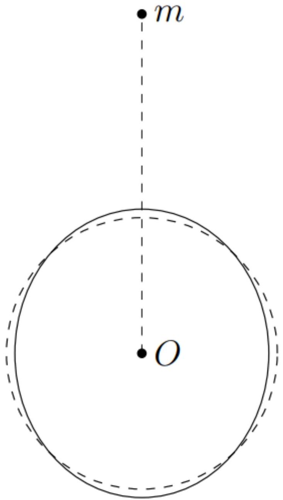

Ответ выразите через $G , m , M$ и $L$.

Пусть $\vec { e } _ { 1 }$ - единичный вектор, проведённый направленный на меньшее тело из центра большего. Ускорения тел за счет гравитации:

$$
\vec { a } _ { m } = - \frac { G M } { L ^ { 2 } } \vec { e } _ { 1 } \quad \vec { a } _ { M } = \frac { G m } { L ^ { 2 } } \vec { e } _ { 1 } ; \quad \vec { a } _ { M } - \vec { a } _ { m } = \frac { G ( M + m ) } { L ^ { 3 } } \vec { e } _ { 1 }
$$

С другой стороны:

$$
\vec { a } _ { M } - \vec { a } _ { m } = \omega ^ { 2 } L \vec { e } _ { 1 }
$$

откуда окончательно:

Ответ:

$$
\omega = \sqrt { \frac { G ( M + m ) } { L ^ { 3 } } }
$$

А2 ${ } ^ { 0.20 }$ Получите точное выражение для разности потенциалов гравитационного поля малого тела $\Delta \varphi _ { \text {гр } } = \varphi _ { \text {гр } P } - \varphi _ { \text {гр } }$ в точках $P$ и $O$. Ответ выразите через $G , m , L , \theta$ и $r ( \theta )$.

Потенциал поля малого тела в точке, расстояние до которой от неё равно $L _ { m }$, равен:

$$
\varphi _ { \text {гр } } = - \frac { G m } { L _ { m } }
$$

Найдём расстояние от малого тела до точки $A$ по теореме косинусов:

$$
L _ { m } ^ { 2 } = L ^ { 2 } + r ^ { 2 } ( \theta ) - 2 L r ( \theta ) \cos \theta
$$

Окончательно имеем:

Ответ:

$$
\Delta \varphi _ { \text {гр } } = G m \left( \frac { 1 } { L } - \frac { 1 } { \sqrt { L ^ { 2 } + r ^ { 2 } - 2 r L \cos \theta } } \right)
$$

A3 ${ } ^ { 0.50 }$ Получите точное выражение для разности потенциалов сил инерции $\Delta \varphi _ { \text {ин } } = \varphi _ { \text {ин } P } - \varphi _ { \text {ин } O }$ в точках $P$ и $O$. Ответ выразите через $G , m , M , L , \theta$ и $r ( \theta )$.

Поскольку жидкость неподвижна, а большее тело вращается с постоянной угловой скоростью - вклад в разность потенциалов вносят поля сил инерции $- \Delta m \vec { a } _ { 0 }$ и $\Delta m \omega ^ { 2 } \vec { r } _ { \perp }$, действующие на частицу массой $\Delta m$.
Для разности потенциалов точек $A$ и $O$ имеем:

$$
\varphi _ { \text {ин } A } - \varphi _ { \text {ин } O } = - \int _ { O } ^ { A } \left( \omega ^ { 2 } \vec { r } _ { \perp } - \vec { a } _ { 0 } \right) \cdot d \vec { r }
$$

Учитывая, что $\vec { a } _ { 0 } = G m \vec { e } _ { 1 } / L ^ { 2 }$, а $\vec { r } _ { \perp } = \vec { r }$ :

$$
\varphi _ { \text {ин } A } - \varphi _ { \text {ин } O } = - \int _ { O } ^ { A } \left( \omega ^ { 2 } \vec { r } - \frac { G m } { L ^ { 2 } } \vec { e } _ { 1 } \right) \cdot d \vec { r } = \frac { G m r \cos \theta } { L ^ { 2 } } - \frac { \omega ^ { 2 } r ^ { 2 } } { 2 }
$$

Окончательно:

Ответ:

$$
\Delta \varphi _ { \text {ин } } = \frac { G m r \cos \theta } { L ^ { 2 } } - \frac { G ( M + m ) r ^ { 2 } } { 2 L ^ { 3 } }
$$

А4 ${ } ^ { 1.30 }$ Получите зависимость $h ( \theta )$. Ответ выразите через $m , M , R , L$ и $\theta$. Максимально упростите ваш ответ. Качественно изобразите форму поверхности в рассматриваемом сечении. На этом же рисунке изобразите невозмущённую форму поверхности.

Примечание: воспользуйтесь следующим приближением:

$$
\frac { 1 } { \sqrt { 1 + a ^ { 2 } - 2 a \cos \theta } } \approx 1 + a \cos \theta + \frac { a ^ { 2 } \left( 3 \cos ^ { 2 } \theta - 1 \right) } { 2 }
$$

Поверхность большего тела в равновесии эквипотенциальна. Так как возмущения поверхности малы, будем считать, что потенциал гравитационного поля большего тела на поверхности равен:

$$
\varphi _ { M } = - \frac { G M } { r ( \theta ) }
$$

Поскольку поверхность эквипотенциальна:

$$
\varphi _ { A } = G m \left( \frac { 1 } { L } - \frac { 1 } { \sqrt { L ^ { 2 } + r ^ { 2 } - 2 r L \cos \theta } } \right) + \frac { G m r \cos \theta } { L ^ { 2 } } - \frac { G ( M + m ) r ^ { 2 } } { 2 L ^ { 3 } } - \frac { G M } { r ( \theta ) } + C _ { 1 } = C _ { 2 }
$$

где $C _ { 1 }$ и $C _ { 2 }$ - некоторые постоянные величины.
Раскладывая выражение под корнем:

$$
\frac { 1 } { \sqrt { L ^ { 2 } + r ^ { 2 } - 2 r L \cos \theta } } \approx \frac { 1 } { L } \left( 1 + a \cos \theta + \frac { a ^ { 2 } \left( 3 \cos ^ { 2 } \theta - 1 \right) } { 2 } \right) ; \quad a = \frac { r } { L } .
$$

Таким образом, имеем:

$$
- \frac { G M } { r } - \frac { G \left( M + 3 m \cos ^ { 2 } \theta \right) r ^ { 2 } } { 2 L ^ { 3 } } = \mathrm { const }
$$

Заметим, что слагаемые, пропорциональные $\cos \theta$ полностью сократились. Из-за этого и потребовалось раскладывать потенциал малого тела до второго порядка.
Далее подставим $r = R + h$ и разложим до первого порядка потенциал большого тела. В потенциале малого тела можно сразу считать $r = R$, так как он сам является малой величиной из-за условия $R \ll L$. Получим

$$
- \frac { G M } { R } + \frac { G M h } { R ^ { 2 } } - \frac { G \left( M + 3 m \cos ^ { 2 } \theta \right) R ^ { 2 } } { 2 L ^ { 3 } } = \text { const } .
$$

Оставим только переменные слагаемые:

$$
h \frac { G M } { R ^ { 2 } } - \frac { 3 G m R ^ { 2 } \cos ^ { 2 } \theta } { 2 L ^ { 3 } } = \text { const }
$$

Поскольку $h ( \pi / 2 ) = 0$, последняя константа равна нулю. Тогда имеем:

Ответ:

$$
h ( \theta ) = \frac { 3 m R ^ { 4 } \cos ^ { 2 } \theta } { 2 M d ^ { 3 } }
$$

Ответ:

Качественная форма поверхности

В1 ${ } ^ { 0.50 }$ Покажите, что касательную компоненту силы $F _ { \tau } ( t , \theta )$, действующую на частицу массой $\Delta m$, находящуюся на поверхности большего тела под углом $\theta$ , можно представить в виде:

$$
F _ { \tau } ( t , \theta ) = \Delta m \alpha \sin \left( 2 \omega _ { 1 } t - 2 \theta \right)
$$

Найдите $\alpha$. Ответ выразите через $G , m , L$ и $r ( \theta )$.

Примечание: воспользуйтесь результатами, полученными при решении пункта А4.

В пункте А4 нами было получено приближённое выражение для потенциала сил инерции и гравитационного поля меньшего тела:

$$
\varphi _ { \text {внеш } } = - \frac { G \left( M + 3 m \cos ^ { 2 } \theta \right) r ^ { 2 } } { 2 L ^ { 3 } }
$$

Тогда для компоненты силы $F _ { \tau }$ получим:

$$
F _ { \tau } = - \frac { \Delta m } { r } \frac { \partial \varphi _ { \text {внеш } } } { \partial \theta } = - \frac { 3 G m \Delta m r \sin 2 \theta } { 2 L ^ { 3 } }
$$

Отметим, что эта компонента силы возникает из-за неоднородности гравитационного поля меньшего тела.
Поскольку $\omega \neq \Omega$, в произвольный момент времени $t$ параметр $\theta$ равен:

$$
\theta = \theta _ { 0 } - \omega _ { 1 } t , \quad \omega _ { 1 } = \omega - \Omega .
$$

Также учтем, что с нужной нам точностью $r \approx R$. Тогда окончательно имеем:

$$
F _ { \tau } \left( t , \theta _ { 0 } \right) = \frac { 3 G m \Delta m R } { 2 L ^ { 3 } } \sin \left( 2 \omega _ { 1 } t - 2 \theta _ { 0 } \right)
$$

Ответ:

$$
\alpha = \frac { 3 G m R } { 2 L ^ { 3 } } .
$$

В2 ${ } ^ { \mathbf { 0 . 8 0 } }$ Покажите, что зависимость $\theta \left( t , \theta _ { 0 } \right)$ имеет следующий вид:

$$
\theta ( t ) = \theta _ { 0 } + A \sin \left( 2 \omega _ { 1 } t - 2 \theta _ { 0 } - \varphi _ { 0 } \right)
$$

Найдите $A$ и $\varphi _ { 0 }$. Ответы выразите через $G , m , L , \gamma , \omega _ { 0 } , \omega , \Omega$ и $\theta _ { 0 }$.

Подставим $F _ { \tau } ( t , \theta )$ в уравнение движения:

$$
\Delta m r ^ { 2 } \left( \ddot { \theta } + 2 \gamma \dot { \theta } + \omega _ { 0 } ^ { 2 } \left( \theta - \theta _ { 0 } \right) \right) = r F _ { \tau } ( t , \theta ) = \Delta m r ^ { 2 } \cdot \frac { 3 G m } { 2 L ^ { 3 } } \sin \left( 2 \omega _ { 1 } t - 2 \theta \right)
$$

Поскольку $\omega _ { 0 } ^ { 2 } \gg G m / L ^ { 3 }$ - можно считать, что $F _ { \tau } ( t , \theta ) \approx F _ { \tau } \left( t , \theta _ { 0 } \right)$. Тогда:

$$
\ddot { \theta } + 2 \gamma \dot { \theta } + \omega _ { 0 } ^ { 2 } \left( \theta - \theta _ { 0 } \right) = \frac { 3 G m } { 2 L ^ { 3 } } \sin \left( 2 \omega _ { 1 } t - 2 \theta _ { 0 } \right)
$$

Решение уравнения будем искать в виде $\theta ( t ) = \theta _ { 0 } + \operatorname { Re } \left( \hat { A } e ^ { 2 i ( \omega - \Omega ) t } \right)$ :

$$
\left( \omega _ { 0 } ^ { 2 } - 4 \omega _ { 1 } ^ { 2 } + 4 i \omega _ { 1 } \gamma \right) \hat { A } = \frac { 3 G m } { 2 L ^ { 3 } } e ^ { - i \left( 2 \theta _ { 0 } + \pi / 2 \right) }
$$

Представим $\hat { A }$ в показательной форме $\hat { A } = A e ^ { - i \varphi _ { 0 } }$, где:

Ответ:

$$
A = \frac { 3 G m } { 2 L ^ { 3 } \sqrt { \left. \left( \omega _ { 0 } ^ { 2 } - 4 \omega _ { 1 } ^ { 2 } \right) ^ { 2 } + 16 \gamma ^ { 2 } \omega _ { 1 } ^ { 2 } \right) } } ; \quad \varphi _ { 0 } = \arctan \frac { 4 \omega _ { 1 } \gamma } { \omega _ { 0 } ^ { 2 } - 4 \omega _ { 1 } ^ { 2 } }
$$

Вз ${ } ^ { 0.40 }$ Получите выражение для скорости роста высоты $\dot { h } ^ { \prime } \left( t , \theta _ { 0 } \right)$ в момент времени $t$ при угле $\theta _ { 0 }$. Ответ выразите через $h _ { 0 }$ и $\frac { d \dot { \theta } } { d \theta _ { 0 } }$

Объем жидкости, втекающей через одну из граней $h d z$ за время $d t$ равен произведению скорости течения $\dot { \theta } R$ на площадь $h d z$ и рассматриваемое время $d t$ :

$$
d V _ { 1 } = \dot { \theta } R h d z d t \approx \dot { \theta } R h _ { 0 } d z d t .
$$

Здесь мы учитываем, что высота поверхности воды меняется мало, и это практически не влияет на поток воды.
Скорости течения, отвечающие углам $\theta _ { 0 }$ и $\theta _ { 0 } + d \theta _ { 0 }$ несколько отличаются, поэтому разность втекающего и вытекающего объемов воды

$$
d V = \dot { \theta } \left( \theta _ { 0 } \right) R h _ { 0 } d z d t - \dot { \theta } \left( \theta _ { 0 } + d \theta _ { 0 } \right) R h _ { 0 } d z d t = - R h _ { 0 } \frac { \partial \dot { \theta } } { \partial \theta _ { 0 } } d \theta _ { 0 } d z d t .
$$

Из-за этого меняется высота поверхности жидкости:

$$
d V = R d \theta _ { 0 } d z d h = R d \theta _ { 0 } d z \dot { h } d t = - R h _ { 0 } \frac { \partial \dot { \theta } } { \partial \theta _ { 0 } } d \theta _ { 0 } d z .
$$

Отсюда $\dot { h } = - h _ { 0 } \frac { \partial \dot { \theta } } { \partial \theta _ { 0 } }$, а поскольку $h _ { 0 } =$ const

Ответ:

$$
\dot { h } ^ { \prime } ( t , \theta ) = - h _ { 0 } \frac { \partial \dot { \theta } ( t , \theta ) } { \partial \theta _ { 0 } } .
$$

B4 ${ } ^ { 0.30 }$ Считая, что амплитуда колебаний $h ^ { \prime }$ одинакова для всех значений $\theta _ { 0 }$, получите зависимость $h ( t )$. Ответ выразите через $h _ { 0 } , A , \omega _ { 1 } , \varphi _ { 1 }$ и $t$.

Из результатов пункта В2 получим:

$$
\theta = \theta _ { 0 } + A \sin \left( 2 \omega _ { 1 } t - \varphi _ { 1 } \right) , \quad \dot { \theta } = 2 \omega _ { 1 } A \cos \left( 2 \omega _ { 1 } t - \varphi _ { 1 } \right) .
$$

Тогда находим

$$
\frac { \partial \dot { \theta } \left( t , \theta _ { 0 } \right) } { \partial \theta _ { 0 } } = 4 \omega _ { 1 } A \sin \left( 2 \omega _ { 1 } t - \varphi _ { 1 } \right) ,
$$

откуда:

$$
\dot { h } ^ { \prime } = - 4 h _ { 0 } \omega _ { 1 } A \sin \left( 2 \omega _ { 1 } t - \varphi _ { 1 } \right)
$$

Интегрируя, находим:

Ответ:

$$
h ( t ) = h _ { 0 } \left( 1 + 2 A \cos \left( 2 \omega _ { 1 } t - \varphi _ { 1 } \right) \right)
$$

В5 ${ } ^ { 0.40 }$ Для момента времени $t$ определите значения углов $\theta _ { 0 }$, соответствующих максимальному значению $h \left( t , \theta _ { 0 } \right)$. Ответы выразите через $\omega _ { 1 } , t$ и $\varphi _ { 0 }$.

В точках максимума косинус равен единице, поэтому:

$$
2 \omega _ { 1 } t - \varphi _ { 1 } = 0 ; 2 \pi
$$

Подставляя $\varphi _ { 1 }$, находим:

Ответ:

$$
\theta _ { 1,2 } = \omega _ { 1 } t - \frac { \varphi _ { 0 } } { 2 } ; \pi + \omega _ { 1 } t - \frac { \varphi _ { 0 } } { 2 } .
$$

В6 ${ } ^ { 1.40 }$ Найдите момент сил $M _ { z }$, действующий со стороны малого тела на поверхность большого относительно оси $z$. Ответ выразите через $G , m , \rho , R , h _ { 0 } , L$, $A$ и $\varphi _ { 0 }$.

Плечо силы, соответствующее углу $\beta$, равно $R \sin \beta$. Тогда для элемента момента силы $d M _ { z }$ имеем:

$$
d M _ { z } = R \sin \beta d F _ { \tau } ( t , \theta , \beta )
$$

Для $d F _ { \tau }$ также имеем:

$$
d F _ { \tau } = \frac { 3 G m R \sin \beta } { 2 L ^ { 3 } } \Delta m \sin \left( 2 \omega _ { 1 } t - 2 \theta \right) .
$$

Масса рассматриваемого объема

$$
\Delta m = \rho d V = \rho h ( t , \theta , \beta ) d S = \rho h ( t , \theta , \beta ) R ^ { 2 } \sin \beta d \beta d \theta .
$$

Тогда получим:

$$
d F _ { \tau } = \frac { 3 G m R \sin \beta } { 2 L ^ { 3 } } \sin \left( 2 \omega _ { 1 } t - 2 \theta \right) \rho h ( t , \theta , \beta ) R ^ { 2 } \sin \beta d \beta d \theta .
$$

Для $h ( t , \theta , \beta )$ имеем:

$$
h ( t , \theta , \beta ) = h _ { 0 } \left( 1 + 2 A \cos \left( 2 \omega _ { 1 } t - \varphi _ { 1 } \right) \right)
$$

так как $A$ не зависит от расстояния до оси $z$.
Представим выражение для $M _ { z }$ в виде интеграла:

$$
M _ { z } = \frac { 3 G m \rho R ^ { 4 } h _ { 0 } } { 2 L ^ { 3 } } \int _ { 0 } ^ { \pi } \sin ^ { 3 } \beta d \beta \int _ { 0 } ^ { 2 \pi } \left( 1 + 2 A \cos \left( 2 \omega _ { 1 } t - \varphi _ { 1 } \right) \right) \sin \left( 2 \omega _ { 1 } t - 2 \theta \right) d \theta
$$

Для интеграла по $\beta$ имеем:

$$
\int _ { 0 } ^ { \pi } \sin ^ { 3 } \beta d \beta = \int _ { - 1 } ^ { 1 } \left( 1 - \cos ^ { 2 } \beta \right) d \cos \beta = \cos \beta - \left. \frac { \cos ^ { 3 } \beta } { 3 } \right| _ { - 1 } ^ { 1 } = \frac { 4 } { 3 }
$$

Поэтому:

$$
M _ { z } = \frac { 2 G m \rho R ^ { 4 } h _ { 0 } } { L ^ { 3 } } \int _ { 0 } ^ { 2 \pi } \left( 1 + 2 A \cos \left( 2 \omega _ { 1 } t - \varphi _ { 1 } \right) \right) \sin \left( 2 \omega _ { 1 } t - 2 \theta \right) d \theta
$$

Второй интеграл берётся за период, поэтому для функции $\sin \left( 2 \omega _ { 1 } t - 2 \theta \right)$ он равен нулю.
Перейдём к последнему интегралу:

$$
\int _ { 0 } ^ { 2 \pi } \cos \left( 2 \omega _ { 1 } t - \varphi _ { 1 } \right) \sin \left( 2 \omega _ { 1 } t - 2 \theta \right) d \theta = \int _ { 0 } ^ { 2 \pi } \cos \left( 2 \omega _ { 1 } t - 2 \theta - \varphi _ { 0 } \right) \sin \left( 2 \omega _ { 1 } t - 2 \theta \right) d \theta
$$

Воспользуемся тригонометрической формулой:

$$
\sin \alpha \cos \beta = \frac { \sin ( \alpha + \beta ) + \sin ( \alpha - \beta ) } { 2 }
$$

Получим:

$$
M _ { z } = \frac { 2 G m \rho R ^ { 4 } h _ { 0 } A } { L ^ { 3 } } \int _ { 0 } ^ { 2 \pi } \left[ \sin \left( 4 \omega _ { 1 } t - 4 \theta - \varphi _ { 0 } \right) + \sin \varphi _ { 0 } \right] d \theta
$$

Окончательно:

Ответ:

$$
M _ { z } = \frac { 4 \pi G m \rho R ^ { 4 } h _ { 0 } A \sin \varphi _ { 0 } } { L ^ { 3 } }
$$

с1 ${ } ^ { 0.80 }$ Найдите орбитальную угловую скорость вращения $\omega _ { \text {синх } }$ и расстояние $L _ { \text {синх } }$ между Землёй и Луной при синхронном вращении. Выразите ответы через $m , M , R , G , L _ { 0 } , \Omega _ { 0 }$ и найдите их численные значения.

Примечание: при синхронном вращении моментом импульса Земли, связанным с вращением вокруг ее оси, можно пренебречь.

Воспользуемся законом сохранения момента импульса, который обозначим за $K$ :

$$
K = I \Omega _ { 0 } + \frac { m M L _ { 0 } ^ { 2 } \omega _ { 0 } } { M + m } = \mathrm { const }
$$

где $I = 2 M R ^ { 2 } / 5$ - момент инерции Земного шара относительно диаметра.
В установившемся режиме $\Omega = \omega = \omega _ { \text {синх } }$, поэтому:

$$
K = \omega _ { \text {синх } } \left( I + \frac { m M L _ { \text {синх } } ^ { 2 } } { m + M } \right)
$$

Поскольку при синхронном вращении Землю можно считать материальной точкой:

$$
K \approx \frac { m M L _ { \text {синх } } ^ { 2 } \omega _ { \text {синх } } } { m + M }
$$

Используя соотношение

$$
\omega ^ { 2 } = \frac { G ( M + m ) } { L ^ { 3 } }
$$

получим:

$$
K \approx \frac { G ^ { 2 / 3 } M m } { ( m + M ) ^ { 1 / 3 } \omega _ { \text {синх } } ^ { 1 / 3 } }
$$

откуда окончательно:

Ответ:

$$
\begin{aligned}
\omega _ { \text {синх } } \approx & \frac { G ^ { 2 } m ^ { 3 } M ^ { 3 } } { ( M + m ) \left( \frac { 2 M R ^ { 2 } \Omega _ { 0 } } { 5 } + \frac { m M } { m + M } \sqrt { G ( M + m ) L _ { 0 } } \right) ^ { 3 } } \approx 1,376 \cdot 10 ^ { - 6 } \mathrm { c } ^ { - 1 } \\
L _ { \text {синх } } & = \frac { ( m + M ) \left( \frac { 2 M R ^ { 2 } \Omega _ { 0 } } { 5 } + \frac { m M } { m + M } \sqrt { G ( M + m ) L _ { 0 } } \right) ^ { 2 } } { G m ^ { 2 } M ^ { 2 } } \approx 5,971 \cdot 10 ^ { 8 } \mathrm { м }
\end{aligned}
$$

Расстояние между Землей и Луной увеличивается со скоростью $\dot { L } _ { 0 } = 1$ см/год.
Найдите величину среднего углового ускорение Земли $\dot { \Omega } _ { 0 }$.
Выразите ответ через $m , M , R , G , L _ { 0 } , \Omega _ { 0 } , \dot { L } _ { 0 }$ и найдите его численное значение.

Момент импульса системы $K$ с помощью связь $\omega$ и $L$ приводится к виду:

$$
K = I \Omega + \frac { m M L ^ { 2 } } { m + M } \sqrt { \frac { G ( m + M ) } { L ^ { 3 } } }
$$

Дифференцируя, находим:

$$
I \dot { \Omega } + \frac { m M } { 2 ( m + M ) ) } \sqrt { \frac { G ( m + M ) } { L } } \dot { L } = 0
$$

откуда:

Ответ:

$$
\dot { \Omega } _ { 0 } = - \frac { 5 m \dot { L } _ { 0 } } { 4 ( m + M ) R ^ { 2 } } \sqrt { \frac { G ( m + M ) } { L _ { 0 } } } \approx - 1,22 \cdot 10 ^ { - 22 } \mathrm { c } ^ { - 1 }
$$

с3 ${ } ^ { 0.80 }$ Найдите численные значения $\omega _ { 0 }$ и $\gamma$.

В пункте В5 было получено, что положение прилива отстаёт от Луны на угол $\varphi _ { 0 } / 2$ по направлению вращения Луны относительно Земли. Тогда имеем:

$$
2 \beta = \arctan \frac { - 4 \omega _ { 1 } \gamma } { \omega _ { 0 } ^ { 2 } - 4 \omega _ { 1 } ^ { 2 } } = - \varphi _ { 0 }
$$

Также для разницы высот прилива и отлива имеем:

$$
\Delta h = h _ { \text {пр } } - h _ { \text {от } } = 4 A h _ { 0 }
$$

или, после подстановки выражения для $A$ :

$$
\Delta h = \frac { 6 G m h _ { 0 } } { L _ { 0 } ^ { 3 } \sqrt { \left( \omega _ { 0 } ^ { 2 } - 4 \omega _ { 1 } ^ { 2 } \right) ^ { 2 } + 16 \omega _ { 1 } ^ { 2 } \gamma ^ { 2 } } } = \frac { 6 G m h _ { 0 } \cos 2 \beta } { L _ { 0 } ^ { 3 } \left( \omega _ { 0 } ^ { 2 } - 4 \omega _ { 1 } ^ { 2 } \right) }
$$

Находим:

Ответ:

$$
\omega _ { 0 } = \sqrt { 4 \omega _ { 1 } ^ { 2 } + \frac { 6 G m h _ { 0 } \cos 2 \beta } { L _ { 0 } ^ { 3 } \Delta h } } \approx 1,664 \cdot 10 ^ { - 4 } \mathrm { c } ^ { - 1 } \quad \gamma = \frac { 3 G m h _ { 0 } \sin 2 \beta } { 2 \left( - \omega _ { 1 } \right) L _ { 0 } ^ { 3 } \Delta h } \approx 3,025 \cdot 10 ^ { - 6 } \mathrm { c } ^ { - 1 }
$$

C4 ${ } ^ { 0.50 }$ В рамках описанной модели найдите угловое ускорение Земли $\dot { \Omega } _ { 0 ( \text { мод } ) }$, которое получается из результатов пункта B6.
Сравните его со значением $\dot { \Omega } _ { 0 }$, полученным в пункте С2 и сделайте вывод о применимости рассматриваемой модели (считайте модель применимой, если $\Omega _ { 0 }$ и $\Omega _ { 0 ( \text { мод } ) }$ отличаются не более, чем в 10 раз).

Из уравнения динамики вращательного движения относительно центра масс получим:

$$
I \dot { \Omega } = M _ { z } = \frac { 4 \pi G m \rho R ^ { 4 } h _ { 0 } A \sin \varphi _ { 0 } } { L ^ { 3 } }
$$

Далее обратим внимание, что $h _ { 0 } A = \Delta h / 4$, а $\varphi _ { 0 } = - 2 \theta$. Тогда имеем:

Ответ:

$$
\dot { \Omega } _ { 0 ( \text { мод } ) } = - \frac { 5 \pi G m \rho R ^ { 2 } \Delta h \sin 2 \theta } { 2 M L _ { 0 } ^ { 3 } } = - 1,16 \cdot 10 ^ { - 22 } \mathrm { c } ^ { - 1 }
$$

Рассматриваемая модель даёт величину нужного порядка и является применимой.

С5 ${ } ^ { 0.70 }$ Оцените численное значение $\tau _ { 2 }$. Ответ выразите в годах.

После перехода к режиму синхронного вращения можно считать, что:

$$
\omega = \text { const } \quad L = \text { const } \quad \omega _ { 0 } ^ { 2 } \gg \omega _ { 1 } ^ { 2 }
$$

Поэтому:

$$
I \dot { \Omega } = M _ { z } = \frac { 4 \pi G m \rho R ^ { 4 } h _ { 0 } A \sin \varphi _ { 0 } } { L ^ { 3 } } \approx \frac { 4 \pi G m \rho R ^ { 4 } h _ { 0 } } { L _ { \text {синх } } ^ { 3 } } \cdot \frac { 3 G m } { 2 L _ { \text {синх } } ^ { 3 } \omega _ { 0 } ^ { 2 } } \cdot \frac { 4 \left( \omega _ { \text {синх } } - \Omega \right) \gamma } { \omega _ { 0 } ^ { 2 } }
$$

откуда:

$$
d \tau _ { 2 } = - \frac { d \Omega } { \Omega - \omega _ { \text {синх } } } \cdot \frac { M L _ { \text {синх } } ^ { 6 } \omega _ { 0 } ^ { 4 } } { 120 \pi G ^ { 2 } m ^ { 2 } \rho R ^ { 2 } h _ { 0 } \gamma }
$$

откуда:

Ответ:

$$
\tau _ { 2 } \approx \frac { M L _ { \text {синх } } ^ { 6 } \omega _ { 0 } ^ { 4 } } { 120 \pi G ^ { 2 } m ^ { 2 } \rho R ^ { 2 } h _ { 0 } \gamma } \approx 3,14 \cdot 10 ^ { 12 } \text { лет }
$$
