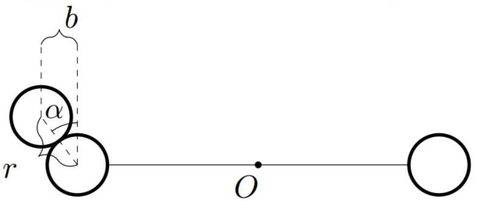
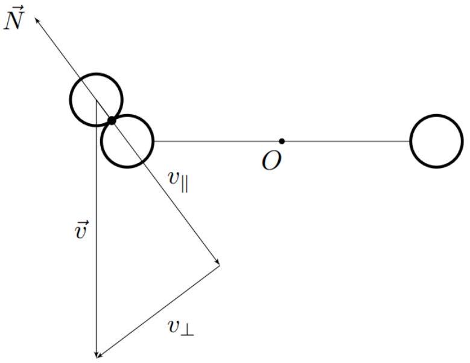
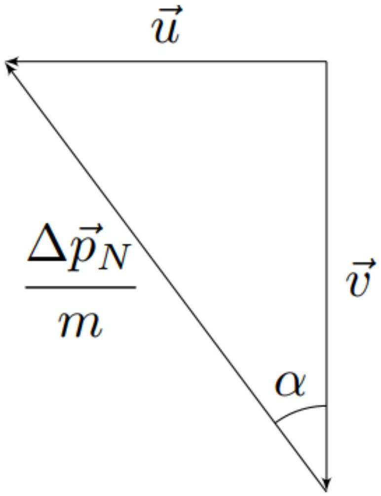
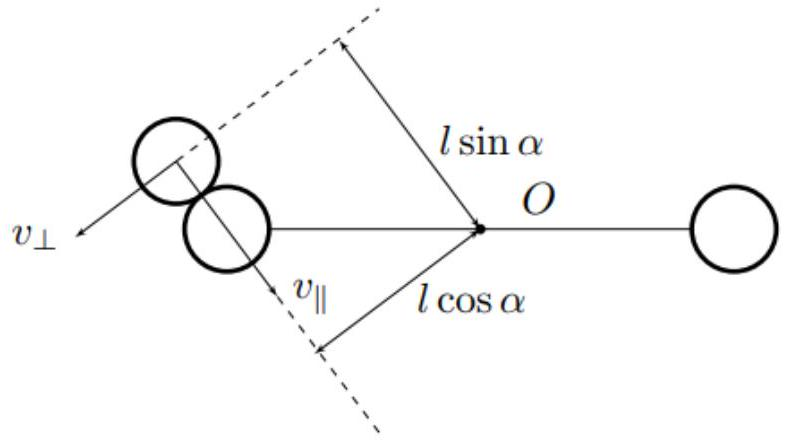

Момент инерции каждой сферы относительно оси вращения равен $m l ^ { 2 }$, поскольку их размерами можно пренебречь.
Исходный стержень эквивалентен двум другим с массой $2 m$ и длиной $l$.
Момент инерции стержня массой $M$ и длиной $L$ относительно оси, проходящей перпендикулярно стержню через его конец, равен:

$$
I _ { \text {ст } } = \frac { M L ^ { 2 } } { 3 }
$$

Тогда момент инерции $I$ системы относительно оси вращения равен:

Ответ:

$$
I = \frac { 10 m l ^ { 2 } } { 3 }
$$

А2 ${ } ^ { 0.50 }$ Выразите угловую скорость $\omega _ { i + 1 }$ системы после столкновения с $i + 1$-ым вылетевшим шариком через $\omega _ { i } , v$ и $l$.

Воспользуемся законами сохранения энергии и момента импульса относительно оси вращения:

$$
\left\{ \begin{array} { l }
E = \frac { m v ^ { 2 } } { 2 } + \frac { I \omega _ { i } ^ { 2 } } { 2 } = \frac { m u ^ { 2 } } { 2 } + \frac { I \omega _ { i + 1 } ^ { 2 } } { 2 } \\
L = m v l + I \omega _ { i } = m u l + I \omega _ { i + 1 }
\end{array} \right.
$$

Здесь $u$ - скорость налетающего шарика сразу после удара, по направлению совпадающая со скоростью $v$.
Исключим из системы $u$ :

$$
u = v - \frac { I \left( \omega _ { i + 1 } - \omega _ { i } \right) } { m l } \Rightarrow I \left( \omega _ { i + 1 } ^ { 2 } - \omega _ { i } ^ { 2 } \right) = v ^ { 2 } - \left( v - \frac { I \left( \omega _ { i + 1 } - \omega _ { i } \right) } { m l } \right) ^ { 2 }
$$

Сокращая корень $\omega _ { i + 1 } = \omega _ { i }$, получим:

$$
\omega _ { i + 1 } \left( 1 + \frac { I } { m l ^ { 2 } } \right) + \omega _ { i } \left( 1 - \frac { I } { m l ^ { 2 } } \right) = \frac { 2 v } { l }
$$

Таким образом:

Ответ:

$$
\omega _ { i + 1 } = \frac { 7 \omega _ { i } } { 13 } + \frac { 6 v } { 13 l }
$$

А3 ${ } ^ { 0.20 }$ Чему равна $\omega _ { 1 }$ ? Ответ выразите через $v$ и $l$.

Поскольку $\omega _ { 0 } = 0$, находим:

Ответ:

$$
\omega _ { 1 } = \frac { 6 v } { 13 l }
$$

А4 ${ } ^ { 0.20 }$ Выразите $\omega ^ { * }$ через $v$ и $l$.

Приравнивая $\omega _ { i + 1 }$ и $\omega _ { i }$, находим:

Ответ:

$$
\omega ^ { * } = \frac { v } { l }
$$

А5 ${ } ^ { 0.60 }$ Решив рекуррентное уравнение, полученное в пункте A1, получите явное выражение для $\omega _ { i }$. Ответ выразите через $i , v$ и $l$.
Подсказка: воспользуйтесь переменной $\omega _ { i } ^ { \prime } = \omega _ { i } - v / l$.

Уравнение, полученное в пункте А1, приводится к следующему виду:

$$
13 \left( \omega _ { i + 1 } - \frac { v } { l } \right) = 7 \left( \omega _ { i } - \frac { v } { l } \right)
$$

Вводя переменную $\omega _ { i } ^ { \prime } = \omega _ { i } - v / l$, получим:

$$
13 \omega _ { i + 1 } ^ { \prime } = 7 \omega _ { i } ^ { \prime }
$$

Откуда:

$$
\omega _ { i } ^ { \prime } = \omega _ { 1 } ^ { \prime } \cdot \left( \frac { 7 } { 13 } \right) ^ { i - 1 }
$$

Поскольку $\omega _ { 0 } = 0 , \omega _ { 1 } = 6 v / ( 13 l )$. Тогда $\omega _ { 1 } ^ { \prime } = - 7 v / ( 13 l )$, откуда :

$$
\omega _ { i } ^ { \prime } = - \frac { v } { l } \left( \frac { 7 } { 13 } \right) ^ { i }
$$

и окончательно

Ответ:

$$
\omega _ { i } = \frac { v } { l } \left( 1 - \left( \frac { 7 } { 13 } \right) ^ { i } \right)
$$

А6 ${ } ^ { 0.20 }$ Каким будет предельное значение $\omega ^ { * }$ для такой системы?

Обратим внимание, что если в рекуррентном уравнении, полученном в пункте A1, положить $\omega _ { i + 1 } = \omega _ { i }$, то при любых значениях момента инерции $I$ получится значение:

Ответ:

$$
\omega ^ { * } = \frac { v } { l }
$$

В $1 ^ { 1.00 }$ При каком значении параметра $k _ { 0 }$ скорость первого вылетевшего шарика сразу после столкновения со сферой будет направлена горизонтально?

Пусть $u$ - скорость вылетающего шарика сразу после удара. Поскольку она направлена горизонтально - сразу после удара момент импульса вылетающего шарика относительно оси вращения равен нулю.
Тогда законы сохранения энергии и момента импульса записываются следующим образом:

$$
\left\{ \begin{array} { l }
E = \frac { m v ^ { 2 } } { 2 } = \frac { I \omega _ { 1 } ^ { 2 } } { 2 } + \frac { m u ^ { 2 } } { 2 } \\
L = m v l = I \omega _ { 1 }
\end{array} \right.
$$

Явно рассмотрим столкновение вылетающего шарика и сферы. Обратим внимания, что если $\alpha$ - угол между линией центров и вертикалью, то $k = \sin \alpha$.

Поскольку трения нет - сила взаимодействия между ними направлена вдоль линии центров. Тогда в процессе удара компонента скорости вылетающего шарика, перпендикулярная линии центров, остаётся постоянной и равной $v _ { \perp } = v \sin \alpha$

Воспользуемся сохранением компоненты скорости $v _ { \perp }$.
Сразу после удара вектор скорости шарика $\vec { u }$ равен:

$$
\vec { u } = \vec { v } + \frac { \Delta \vec { p } _ { N } } { m }
$$

где $\Delta \vec { p } _ { N }$ - импульс силы реакции, действующей на шарик со стороны сферы.
Поскольку $\Delta \vec { p } _ { N }$ направлен вдоль линии центров, из рисунка находим:

$$
u = v \tan \alpha
$$

Подставляя значение $u$ систему уравнений из законов сохранения, получим:

$$
v ^ { 2 } = \frac { I \omega _ { 1 } ^ { 2 } } { m } + u ^ { 2 } = \frac { I } { m } \left( \frac { m v l } { I } \right) ^ { 2 } + v ^ { 2 } \tan ^ { 2 } \alpha \Rightarrow \tan ^ { 2 } \alpha = 1 - \frac { m l ^ { 2 } } { I }
$$

Учитывая, что $\sin \alpha = \frac { \tan \alpha } { \sqrt { 1 + \tan ^ { 2 } \alpha } }$, находим:

Ответ:

$$
k _ { 0 } = \sqrt { \frac { I - m l ^ { 2 } } { 2 I - m l ^ { 2 } } } = \sqrt { \frac { 7 } { 17 } }
$$

В2 ${ } ^ { 1.00 }$ Выразите угловую скорость $\omega _ { i + 1 }$ системы после столкновения с $i + 1$-ым вылетевшим шариком через $\omega _ { i } , v , l$ и $k$.

Разложим скорость вылетающего шарика на компоненты скорости $v _ { \| }$и $v _ { \perp }$, направленные соответственно вдоль и перпендикулярно линии центров.
Момент импульса шарика относительно точки $O$ равен:

$$
\vec { L } _ { O } = m [ \vec { v } \times \vec { r } ] = m \left[ \vec { v } _ { \| } \times \vec { r } \right] + m \left[ \vec { v } _ { \perp } \times \vec { r } \right]
$$

На рисунке обозначены плечи скоростей $v _ { \| }$и $v _ { \perp }$ относительно оси вращения, соответственно равные $l \cos \alpha$ и $l \sin \alpha$.

Скорость шарика сразу после удара также разложим на $u _ { \| }$и $u _ { \perp }$. Их направления выберем теми же, что и у $v _ { \| }$и $v _ { \perp }$ соответственно. Запишем законы сохранения энергии и момента импульса относительно оси вращения:

$$
\left\{ \begin{array} { l }
E = \frac { I \omega _ { i } ^ { 2 } } { 2 } + \frac { m \left( v _ { \| } ^ { 2 } + v _ { \perp } ^ { 2 } \right) } { 2 } = \frac { I \omega _ { i + 1 } ^ { 2 } } { 2 } + \frac { m \left( u _ { \| } ^ { 2 } + u _ { \perp } ^ { 2 } \right) } { 2 } \\
L = I \omega _ { i } + m v _ { \| } l \cos \alpha + m v _ { \perp } l \sin \alpha = I \omega _ { i + 1 } + m u _ { \| } l \cos \alpha + m u _ { \perp } l \sin \alpha
\end{array} \right.
$$

Поскольку $v _ { \perp } = u _ { \perp }$, а $v _ { \| } = v \cos \alpha$, перепишем систему более компактно:

$$
\left\{ \begin{array} { l }
I \omega _ { i } ^ { 2 } + m v ^ { 2 } \cos ^ { 2 } \alpha = I \omega _ { i + 1 } ^ { 2 } + m u _ { \| } ^ { 2 } \\
I \omega _ { i } + m v l \cos ^ { 2 } \alpha = I \omega _ { i + 1 } + m u _ { \| } l \cos \alpha
\end{array} \right.
$$

Исключим из системы $u _ { \| }$:

$$
u _ { \| } ^ { 2 } = v ^ { 2 } \cos ^ { 2 } \alpha - \frac { I \left( \omega _ { i + 1 } ^ { 2 } - \omega _ { i } ^ { 2 } \right) } { m } = \left( v \cos \alpha - \frac { I \left( \omega _ { i + 1 } - \omega _ { i } \right) } { m l \cos \alpha } \right) ^ { 2 }
$$

Раскрывая скобки и сокращая множитель $\omega _ { i + 1 } - \omega _ { i }$, получим:

$$
\frac { 2 v } { l } = \omega _ { i + 1 } \left( 1 + \frac { I } { m l ^ { 2 } \cos ^ { 2 } \alpha } \right) - \omega _ { i } \left( \frac { I } { m l ^ { 2 } \cos ^ { 2 } \alpha } - 1 \right)
$$

Ответ:

$$
\omega _ { i + 1 } = \frac { 6 v \left( 1 - k ^ { 2 } \right) } { l \left( 13 - 3 k ^ { 2 } \right) } + \omega _ { i } \cdot \frac { 7 + 3 k ^ { 2 } } { 13 - 3 k ^ { 2 } }
$$

B3 ${ } ^ { 0.20 }$ Чему равна $\omega _ { 1 }$ ? Ответ выразите через $v _ { 0 } , l$ и $k$.

Поскольку $\omega _ { 0 } = 0$, находим:

Ответ:

$$
\omega _ { 1 } = \frac { 6 v \left( 1 - k ^ { 2 } \right) } { l \left( 13 - 3 k ^ { 2 } \right) }
$$

в4 ${ } ^ { 0.80 }$ Решив рекуррентное уравнение, полученное в пункте $\mathbf { B 2 }$, получите явное выражение для $\omega _ { i }$. Ответ выразите через $i , v$ и $l$.

Вновь введём переменную $\omega _ { i } ^ { \prime } = \omega _ { i } - v / l$ и получим:

$$
\omega _ { i + 1 } ^ { \prime } \left( 1 + \frac { I } { m l ^ { 2 } \cos ^ { 2 } \alpha } \right) = \omega _ { i } ^ { \prime } \left( \frac { I } { m l ^ { 2 } \cos ^ { 2 } \alpha } - 1 \right)
$$

откуда после подстановки $I$ :

$$
\omega _ { i + 1 } ^ { \prime } = \omega _ { i } ^ { \prime } \left( \frac { 7 + 3 k ^ { 2 } } { 13 - 3 k ^ { 2 } } \right) \Rightarrow \omega _ { i } ^ { \prime } = \omega _ { 1 } ^ { \prime } \left( \frac { 7 + 3 k ^ { 2 } } { 13 - 3 k ^ { 2 } } \right) ^ { i - 1 }
$$

Для $\omega _ { 1 } ^ { \prime }$ имеем:

$$
\omega _ { 1 } ^ { \prime } = \omega _ { 1 } - \frac { v } { l } = - \frac { v \left( 7 + 3 k ^ { 2 } \right) } { l \left( 13 - 3 k ^ { 2 } \right) }
$$

Таким образом:

$$
\omega _ { i } ^ { \prime } = \frac { v } { l } \left( \frac { 7 + 3 k ^ { 2 } } { 13 - 3 k ^ { 2 } } \right) ^ { i }
$$

и окончательно:

Ответ:

$$
\omega _ { i } = \frac { v } { l } \left( 1 - \left( \frac { 7 + 3 k ^ { 2 } } { 13 - 3 k ^ { 2 } } \right) ^ { i } \right)
$$

С1 ${ } ^ { 0.50 }$ Найдите, при каких значениях параметра $\alpha$ система в режиме сухого трения будет продолжать движение неограниченно долго после первого столкновения с шариком.

Для удобства решения найдём сначала угловую скорость системы $\omega ^ { \uparrow }$ после первого столкновения с шариком. Подставляя $\omega _ { i } = 0$ и $\omega _ { i + 1 } = \omega ^ { \uparrow }$ в рекуррентное уравнение, получим:

$$
\omega ^ { \uparrow } = \frac { 2 \varepsilon \omega _ { 0 } } { 1 + \varepsilon } .
$$

Временные зависимости $\omega ( t )$ для режимов вязкого трения можно найти, как в решении к пунктам С5 и С7.

Случай сухого трения.

Кинетическая энергия вращательного движения системы должна быть потерь на трение за половину оборота, т.е.:

$$
\frac { I } { 2 } \omega ^ { \uparrow 2 } > \pi \alpha I \Longrightarrow \alpha < \frac { \omega ^ { \uparrow 2 } } { 2 \pi } = \frac { 2 \varepsilon ^ { 2 } \omega _ { 0 } ^ { 2 } } { \pi ( 1 + \varepsilon ) ^ { 2 } }
$$

Ответ:

$$
\alpha < \frac { 2 \varepsilon ^ { 2 } \omega _ { 0 } ^ { 2 } } { \pi ( 1 + \varepsilon ) ^ { 2 } }
$$

C2 ${ } ^ { 0.50 }$ Найдите, при каких значениях параметра $\beta$ система в режиме линейного вязкого трения будет продолжать движение неограниченно долго после первого столкновения с шариком.

Случай линейного вязкого трения.

Поскольку $\omega ( t ) = \omega ^ { \uparrow } e ^ { - \beta T }$, то предельный угол поворота системы после первого соударения составит:

$$
\varphi = \int _ { 0 } ^ { + \infty } \omega ^ { \uparrow } e ^ { - \beta t } \mathrm {~d} t = \frac { \omega ^ { \uparrow } } { \beta }
$$

Этот угол должен быть больше $\pi$, поэтому:

$$
\beta < \frac { \omega ^ { \uparrow } } { \pi } = \frac { 2 \varepsilon \omega _ { 0 } } { \pi ( 1 + \varepsilon ) }
$$

Ответ:

$$
\beta < \frac { 2 \varepsilon \omega _ { 0 } } { \pi ( 1 + \varepsilon ) }
$$

c3 ${ } ^ { 0.50 }$ Найдите, при каких значениях параметра $\gamma$ система в режиме квадратичного вязкого трения будет продолжать движение неограниченно долго после первого столкновения с шариком.

Случай квадратичного вязкого трения.

Поскольку интеграл вида $\int \frac { 1 } { x } \mathrm {~d} x$ расходится при $x \rightarrow + \infty$, то при любом значении $\gamma$ система сможет совершить один оборот за конечное, пусть и экспоненциально большое время. Таким образом, $\gamma$ может быть произвольной положительной величиной.

Ответ:

$$
\gamma < + \infty
$$

Примечание: Так как в действительности в пределе малых угловых скоростей вязкое трение переходит в линейный режим, то реально значение $\gamma$ имеет верхний предел, однако этим мы здесь пренебрегаем.

C4 ${ } ^ { 0.70 }$ Найдите установившуюся среднюю по периоду угловую скорость системы $\bar { \omega } _ { 1 }$ в режиме сухого трения. Выразите ответ через $\varepsilon$, $\alpha$ и $\omega _ { 0 }$.

Приравнивая изменение кинетической энергии системы за один оборот к потерям на трение, имеем:

$$
\frac { I } { 2 } \omega ^ { \uparrow 2 } - \frac { I } { 2 } \omega ^ { \downarrow 2 } = \pi \alpha I \Longrightarrow \omega ^ { \uparrow 2 } - \omega ^ { \downarrow 2 } = 2 \pi \alpha .
$$

Поскольку в режиме сухого трения движение системы происходит в постоянным угловым ускорением, средняя угловая скорость $\bar { \omega }$ будет равна среднему арифметическому $\omega ^ { \uparrow }$ и $\omega ^ { \downarrow }$. Для удобства введём ещё одну величину:

$$
\Delta \omega = \frac { \omega ^ { \uparrow } - \omega ^ { \downarrow } } { 2 } ,
$$

тогда, добавив рекуррентное уравнение, получим следующую систему:

$$
\left\{ \begin{array} { l }
\bar { \omega } \Delta \omega = \frac { \pi \alpha } { 2 } \\
\bar { \omega } + \frac { \Delta \omega } { \varepsilon } = \omega _ { 0 }
\end{array} \Longrightarrow \bar { \omega } ^ { 2 } - \omega _ { 0 } \bar { \omega } + \frac { \pi \alpha } { 2 \varepsilon } = 0 . \right.
$$

Это - квадратное уравнение, корни которого:

$$
\bar { \omega } _ { \pm } = \frac { \omega _ { 0 } \pm \sqrt { \omega _ { 0 } ^ { 2 } - \frac { 2 \pi \alpha } { \varepsilon } } } { 2 } .
$$

Из физических соображений ясно, что необходимо взять бо́льший корень $\bar { \omega } _ { + }$. Итак:

Ответ:

$$
\bar { \omega } _ { 1 } = \frac { 1 } { 2 } \left[ \omega _ { 0 } + \sqrt { \omega _ { 0 } ^ { 2 } - \frac { 2 \pi \alpha } { \varepsilon } } \right]
$$

С5 ${ } ^ { 0.50 }$ Найдите стационарное значение угловой скорости $\omega _ { 2 } ^ { \uparrow }$ системы непосредственно после очередного столкновения с шариком в режиме линейного вязкого трения.

Случай линейного вязкого трения.

Уравнение на угловую скорость между столкновениями с шариком запишется в виде:

$$
\dot { \omega } = - \beta \omega .
$$

Его решение с начальным условием $\omega ( t = 0 ) = \omega ^ { \uparrow }$ имеет вид:

$$
\frac { \mathrm { d } \omega } { \omega } = - \beta \mathrm { d } t \Longrightarrow \omega = C e ^ { - \beta t } , \omega ( t = 0 ) = C = \omega ^ { \uparrow } \Longrightarrow \omega ( t ) = \omega ^ { \uparrow } e ^ { - \beta t } .
$$

Тогда время $T$ следующего столкновения с шариком определится из условия:

$$
\pi = \int _ { 0 } ^ { T } \omega ( t ) \mathrm { d } t = \int _ { 0 } ^ { T } \omega ^ { \uparrow } e ^ { - \beta t } \mathrm {~d} t = \frac { 1 } { \beta } \left( 1 - e ^ { - \beta T } \right) \omega ^ { \uparrow }
$$

Так как угловая скорость системы $\omega ^ { \downarrow }$ непосредственно перед столкновением с шариком равна:

$$
\omega ^ { \downarrow } = \omega ^ { \uparrow } e ^ { - \beta T } ,
$$

то имеем в итоге:

$$
\omega ^ { \uparrow } - \omega ^ { \downarrow } = \pi \beta .
$$

Подставляя это в рекуррентное уравнение, получим:

$$
\omega ^ { \uparrow } \left( 1 + \varepsilon ^ { - 1 } \right) + \left( \omega ^ { \uparrow } - \pi \beta \right) \left( 1 - \varepsilon ^ { - 1 } \right) = 2 \omega _ { 0 } \Longrightarrow \omega ^ { \uparrow } = \omega _ { 0 } - \frac { \pi \beta } { 2 } \left( \varepsilon ^ { - 1 } - 1 \right) .
$$

Ответ:

Из результатов, полученных в предыдущем пункте, точное значение средней угловой скорости равно:

$$
\bar { \omega } _ { 2 } = \frac { \pi } { T } = \frac { \pi \beta } { - \ln \left( 1 - \frac { \pi \beta } { \omega ^ { \uparrow } } \right) } = \frac { \pi \beta } { \ln \left( 2 \varepsilon \omega _ { 0 } - \pi \beta ( 1 - \varepsilon ) \right) - \ln \left( 2 \varepsilon \omega _ { 0 } - \pi \beta ( 1 + \varepsilon ) \right) } .
$$

Ответ:

$$
\bar { \omega } _ { 2 } = \frac { \pi \beta } { \ln \left( 2 \varepsilon \omega _ { 0 } - \pi \beta ( 1 - \varepsilon ) \right) - \ln \left( 2 \varepsilon \omega _ { 0 } - \pi \beta ( 1 + \varepsilon ) \right) }
$$

С7 ${ } ^ { 0.50 }$ Найдите стационарное значение угловой скорости $\omega _ { 3 } ^ { \uparrow }$ системы непосредственно после очередного столкновения с шариком в режиме квадратичного вязкого трения.

Случай квадратичного вязкого трения.

Уравнение на угловую скорость между столкновениями с шариком запишется в виде:

$$
\dot { \omega } = - \gamma \omega ^ { 2 } .
$$

Его решение с начальным условием $\omega ( t = 0 ) = \omega ^ { \uparrow }$ имеет вид:

$$
\frac { \mathrm { d } \omega } { \omega ^ { 2 } } = - \gamma \mathrm { d } t \Longrightarrow \frac { 1 } { \omega } = \gamma t + C , \omega ( t = 0 ) = \frac { 1 } { C } = \omega ^ { \uparrow } \Longrightarrow \omega ( t ) = \frac { 1 } { \gamma t + \frac { 1 } { \omega ^ { \uparrow } } } = \frac { \omega ^ { \uparrow } } { 1 + \gamma \omega ^ { \uparrow } t } .
$$

Тогда время $T$ следующего столкновения с шариком определится из условия:

$$
\pi = \int _ { 0 } ^ { T } \omega ( t ) \mathrm { d } t = \int _ { 0 } ^ { T } \frac { \omega ^ { \uparrow } } { 1 + \gamma \omega ^ { \uparrow } t } \mathrm {~d} t = \frac { 1 } { \gamma } \ln \left( 1 + \gamma \omega ^ { \uparrow } T \right) \Longrightarrow T = \frac { e ^ { \pi \gamma } - 1 } { \gamma \omega ^ { \uparrow } }
$$

Угловая скорость системы $\omega ^ { \downarrow }$ непосредственно перед столкновением с шариком составит:

$$
\omega ^ { \downarrow } = \omega ( T ) = \omega ^ { \uparrow } e ^ { - \pi \gamma } .
$$

Подставляя это в рекуррентное уравнение, имеем:

$$
\omega ^ { \uparrow } \left( 1 + \varepsilon ^ { - 1 } \right) + \omega ^ { \uparrow } e ^ { - \pi \gamma } \left( 1 - \varepsilon ^ { - 1 } \right) = 2 \omega _ { 0 } \Longrightarrow \omega ^ { \uparrow } = \frac { 2 \omega _ { 0 } \varepsilon } { 1 - e ^ { - \pi \gamma } + \varepsilon \left( 1 + e ^ { - \pi \gamma } \right) } .
$$

Ответ:

$$
\omega ^ { \uparrow } = \frac { 2 \omega _ { 0 } \varepsilon } { 1 - e ^ { - \pi \gamma } + \varepsilon \left( 1 + e ^ { - \pi \gamma } \right) }
$$

С8 ${ } ^ { 0.40 }$ Найдите установившуюся среднюю по периоду угловую скорость системы $\bar { \omega } _ { 3 }$ в режиме квадратичного вязкого трения.

Из результатов, полученных в предыдущем пункте, точное значение средней угловой скорости равно:

$$
\bar { \omega } _ { 3 } = \frac { \pi } { T } = \frac { \pi \gamma \omega ^ { \uparrow } } { e ^ { \pi \gamma } - 1 } = \frac { \pi \varepsilon \gamma \omega _ { 0 } } { 2 \operatorname { sh } \frac { \pi \gamma } { 2 } \left( \operatorname { sh } \frac { \pi \gamma } { 2 } + \varepsilon \operatorname { ch } \frac { \pi \gamma } { 2 } \right) } .
$$

Ответ:

$$
\bar { \omega } _ { 3 } = \frac { \pi \varepsilon \gamma \omega _ { 0 } } { 2 \operatorname { sh } ( \pi \gamma / 2 ) [ \operatorname { sh } ( \pi \gamma / 2 ) + \varepsilon \operatorname { ch } ( \pi \gamma / 2 ) ] }
$$
