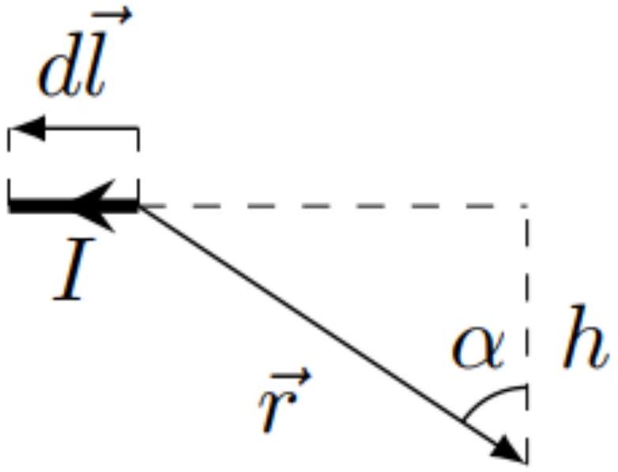
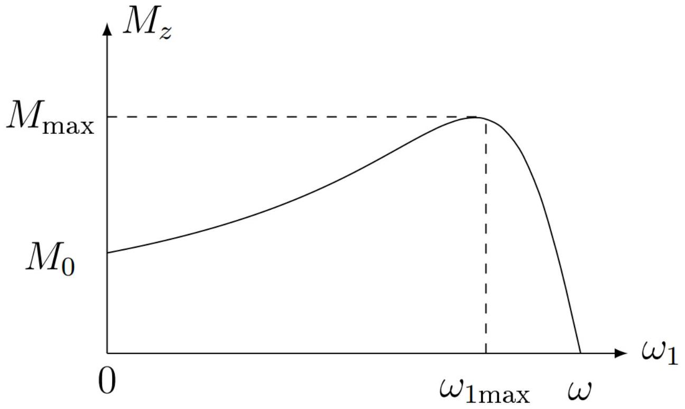

А1 ${ } ^ { 0.60 }$ Линейное напряжение между выводами $a$ и $b$ можно представить в виде $\mathcal { E } _ { a b } = \mathcal { E } _ { 0 } ^ { \prime } \cos ( \omega t - \Delta \varphi ) , \mathcal { E } _ { 0 } ^ { \prime } > 0$. Найдите $\mathcal { E } _ { 0 } ^ { \prime }$ и $\Delta \varphi$. Выразите ответ через $\mathcal { E } _ { 0 }$.

$$
\mathcal { E } _ { a b } = \mathcal { E } _ { a } - \mathcal { E } _ { b } = \mathcal { E } _ { 0 } \left( \cos ( \omega t ) - \cos \left( \omega t - \frac { 2 \pi } { 3 } \right) \right) .
$$

Применив формулу разности косинусов, получим:

$$
\mathcal { E } _ { a b } = 2 \mathcal { E } _ { 0 } \left( \sin \left( \omega t - \frac { \pi } { 3 } \right) \sin \left( - \frac { \pi } { 3 } \right) \right) = - \sqrt { 3 } \mathcal { E } _ { 0 } \sin \left( \omega t - \frac { \pi } { 3 } \right) .
$$

Заменяем синус на требуемый косинус:

$$
\mathcal { E } _ { a b } = \sqrt { 3 } \mathcal { E } _ { 0 } \cos \left( \omega t + \frac { \pi } { 6 } \right) .
$$

Примечание.
В условии не была указана полярность $\mathcal { E } _ { a b }$, поэтому возможен вариант $\mathcal { E } _ { a b } = \mathcal { E } _ { b } - \mathcal { E } _ { a }$. В этом случае знак косинуса в окончательно выражении поменяется, что соответствует сдвигу фазы косинуса на $\pi$ :

$$
\mathcal { E } _ { a b } = \sqrt { 3 } \mathcal { E } _ { 0 } \cos \left( \omega t - \frac { 5 \pi } { 6 } \right) .
$$

Ответ:

$$
\begin{gathered}
\mathcal { E } _ { \mathrm { o } } ^ { \prime } = \sqrt { 3 } \mathcal { E } _ { 0 } \\
\Delta \varphi = - \frac { \pi } { 6 } \quad \text { либо } \quad \Delta \varphi = \frac { 5 \pi } { 6 }
\end{gathered}
$$

А2 ${ } ^ { 1.00 }$ Пусть каждый из элементов нагрузки $\left( Z _ { a } , Z _ { b } , Z _ { c } \right)$ представляет собой последовательно соединенные резистор $R = 9$ кОм и конденсатор $C = 2 \cdot 10 ^ { - 7 }$ Ф. Найдите амплитуды тока через линейный провод $I _ { a }$ и нулевой провод $I _ { 0 }$ (формулу и численное значение).

Воспользуемся методом комплексных амплитуд. Будем обозначать комплексные амплитуды чертой над соответствующими величинами. Запишем 2-й закон Кирхгофа для контура с током $I _ { a }$ :

$$
\begin{equation*}
\mathcal { E } _ { a } = \overline { I _ { a } } ( R + r ) - \overline { I _ { a } } \frac { i } { \omega C } + \overline { I _ { 0 } } r \tag{1}
\end{equation*}
$$

Аналогично для $I _ { b } , I _ { c }$ :

$$
\begin{align*}
& \mathcal { E } _ { b } = \overline { I _ { a } } ( R + r ) - \overline { I _ { b } } \frac { i } { \omega C } + \overline { I _ { 0 } } r  \tag{2}\\
& \mathcal { E } _ { c } = \overline { I _ { a } } ( R + r ) - \overline { I _ { c } } \frac { i } { \omega C } + \overline { I _ { 0 } } r \tag{3}
\end{align*}
$$

Также запишем 1-й закон Кирхгофа:

$$
\begin{equation*}
\overline { I _ { 0 } } = \overline { I _ { a } } + \overline { I _ { b } } + \overline { I _ { c } } . \tag{4}
\end{equation*}
$$

Выразим $\overline { I _ { a } } , \overline { I _ { b } } , \overline { I _ { c } }$ из (1), (2), (3) соответственно и подставим в (4):

$$
\overline { I _ { 0 } } = \frac { \mathcal { E } _ { a } - \overline { I _ { 0 } } r } { R + r - \frac { i } { \omega C } } + \frac { \mathcal { E } _ { b } - \overline { I _ { 0 } } r } { R + r - \frac { i } { \omega C } } + \frac { \mathcal { E } _ { c } - \overline { I _ { 0 } } r } { R + r - \frac { i } { \omega C } } .
$$

Так как

$$
\mathcal { E } _ { a } + \mathcal { E } _ { b } + \mathcal { E } _ { c } = 0 ,
$$

получим

$$
\overline { I _ { 0 } } = 0 .
$$

С учетом этого имеем ответ для $\overline { I _ { a } }$ :

$$
\begin{gathered}
\overline { I _ { a } } = \frac { \mathcal { E } _ { 0 } } { ( R + r ) - \frac { i } { \omega C } } , \\
\left| \overline { I _ { a } } \right| = I _ { a } = \frac { \mathcal { E } _ { 0 } } { \sqrt { ( R + r ) ^ { 2 } + \frac { 1 } { ( \omega C ) ^ { 2 } } } } .
\end{gathered}
$$

Ответ:

$$
\begin{gathered}
I _ { a } = \frac { \mathcal { E } _ { 0 } } { \sqrt { ( R + r ) ^ { 2 } + \frac { 1 } { ( \omega C ) ^ { 2 } } } } \approx 14,6 \mathrm {~mA} ; \\
I _ { 0 } = 0 .
\end{gathered}
$$

А3 ${ } ^ { 0.40 }$ Найдите коэффициент полезного действия схемы из пункта А2 $\eta$ (формулу и численное значение). Коэффициентом полезного действия считайте отношение средней мощности, выделяющейся на нагрузке, к средней мощности, выделяющейся во всей цепи.

Мощность в схеме выделяется только на резисторах. Полезная мощность выделяется на резисторах $R$. Пусть для этого резистора сдвиг фаз равен $\Delta \varphi _ { 1 }$. Мощность на резисторе $a$ :

$$
P _ { a } = \left| \overline { I _ { a } } \right| ^ { 2 } \cos ^ { 2 } \left( \omega t - \Delta \varphi _ { 1 } \right) R = \frac { 1 } { 2 } \left| \overline { I _ { a } } \right| ^ { 2 } R \left( 1 + \cos \left( 2 \left( \omega t - \Delta \varphi _ { 1 } \right) \right) . \right.
$$

Так как среднее $\cos \left( 2 \left( \omega t - \Delta \varphi _ { 1 } \right) \right)$ за период равно 0 , средняя за период мощность:

$$
\left\langle P _ { a } \right\rangle = \frac { 1 } { 2 } \left| \overline { I _ { a } } \right| ^ { 2 } R .
$$

Видно, что сдвиг фаз $\Delta \varphi _ { 1 }$ не влияет на $\left\langle P _ { a } \right\rangle$, а значит:

$$
\left\langle P _ { a } \right\rangle = \left\langle P _ { b } \right\rangle = \left\langle P _ { c } \right\rangle .
$$

Итого полезная мощность:

$$
P _ { \text {пол } } = \frac { 3 } { 2 } \left| \overline { I _ { a } } \right| ^ { 2 } R .
$$

Аналогично находим общую мощность в цепи:

$$
P _ { \text {вся } } = \frac { 3 } { 2 } \left| \overline { I _ { a } } \right| ^ { 2 } ( R + r ) .
$$

По определению, данному в условии:

$$
\eta = \frac { P _ { \text {пол } } } { P _ { \text {вся } } } = \frac { R } { R + r } \approx 64,3 \% .
$$

Ответ:

$$
\eta = \frac { R } { R + r } \approx 64,3 \% .
$$

А4 ${ } ^ { 1.00 }$ Пусть теперь нагрузка несимметричная: элементы $Z _ { b }$ и $Z _ { c }$ представляют собой резисторы с сопротивлением $R$, а элемент $Z _ { a }$ - конденсатор с емкостью $\mathrm { C } _ { 1 } = 10 ^ { - 9 }$ Ф. Найдите численное значение коэффициента полезного действия схемы $\eta _ { 1 }$ в этом случае. Получать аналитическое выражение для $\eta _ { 1 }$ не требуется. Воспользуйтесь численными данными из пункта $A 2$.

Модуль импеданса конденсатора:

$$
\left| Z _ { a } \right| = \frac { 1 } { \omega C } = \frac { 1 } { 2 \pi f C } \approx 3183 \text { кОм. }
$$

Заметим, что $\left| Z _ { a } \right| \gg R$, поэтому при расчете токов током через конденсатор можно пренебречь. Аналогично пункту $A 2$ напишем законы Кирхгофа для цепи:

$$
\begin{equation*}
\overline { I _ { 0 } } = \overline { I _ { b } } + \overline { I _ { c } } ; \tag{1}
\end{equation*}
$$

$$
\begin{equation*}
\mathcal { E } _ { 0 } \left( - \frac { \sqrt { 3 } } { 2 } i - \frac { 1 } { 2 } \right) = \overline { I _ { b } } ( R + r ) + \overline { I _ { 0 } } r \tag{2}
\end{equation*}
$$

$$
\begin{equation*}
\mathcal { E } _ { 0 } \left( \frac { \sqrt { 3 } } { 2 } i - \frac { 1 } { 2 } \right) = \overline { I _ { c } } ( R + r ) + \overline { I _ { 0 } } r \tag{3}
\end{equation*}
$$

Сложим (2) и (3) и воспользуемся (1). Таким образом найдем $\overline { I _ { 0 } }$ :

$$
\overline { I _ { 0 } } = - \frac { \mathcal { E } _ { \mathrm { o } } } { R + 3 r } .
$$

Подставив найденное $\overline { I _ { 0 } }$ в (2) и (3), находим $\overline { I _ { b } }$ и $\overline { I _ { c } }$ :

$$
\begin{gathered}
\overline { I _ { b } } = \frac { \mathcal { E } _ { \mathrm { o } } } { R + r } \left( - \frac { \sqrt { 3 } } { 2 } i + \left( \frac { r } { R + 3 r } - \frac { 1 } { 2 } \right) \right) ; I \\
\overline { I _ { c } } = \frac { \mathcal { E } _ { \mathrm { o } } } { R + r } \left( \frac { \sqrt { 3 } } { 2 } i + \left( \frac { r } { R + 3 r } - \frac { 1 } { 2 } \right) \right)
\end{gathered}
$$

Выражения для модулей:

$$
\begin{gathered}
\left| \overline { I _ { 0 } } \right| = \frac { \mathcal { E } _ { \mathrm { o } } } { R + 3 r } \approx 12,92 \mathrm { мA } ; \\
\left| \overline { I _ { b } } \right| = \left| \overline { I _ { \mathrm { c } } } \right| = \frac { \mathcal { E } _ { \mathrm { o } } } { R + r } \sqrt { \frac { 3 } { 4 } + \left( \frac { r } { R + 3 r } - \frac { 1 } { 2 } \right) ^ { 2 } } \approx 20,23 \mathrm {~mA} ;
\end{gathered}
$$

Находим средние полезную и общую мощности:

$$
\begin{gathered}
P _ { \text {пол } } = 2 \frac { 1 } { 2 } \left| \overline { I _ { b } } \right| ^ { 2 } R ; \\
P _ { \text {вся } } = 2 \frac { 1 } { 2 } \left| \overline { I _ { b } } \right| ^ { 2 } ( R + r ) + \frac { 1 } { 2 } \left| \overline { I _ { 0 } } \right| ^ { 2 } r ; \\
\eta _ { 1 } = \frac { 2 \left| \overline { I _ { b } } \right| ^ { 2 } R } { 2 \left| \overline { I _ { b } } \right| ^ { 2 } ( R + r ) + \left| \overline { I _ { 0 } } \right| ^ { 2 } r } \approx 59,9 \%
\end{gathered}
$$

Ответ:

$$
\eta _ { 1 } \approx 59,9 \% .
$$

В1 ${ } ^ { 0.60 }$ Пусть в одной из квадратных рамок со стороной $a$ в данный момент времени течет ток $I _ { 0 }$. Найдите магнитное поле $B _ { 0 }$ в центре квадрата, создаваемое только этой рамкой.

Для начала рассмотрим отрезок с током $I$. Найдем поле в точке, расположенной на расстоянии $h$ от прямой, содержащей его. Закон Био-Савара-Лапласа:

$$
\overrightarrow { d B } = \frac { \mu _ { 0 } I _ { 0 } } { 4 \pi } \frac { [ \vec { d } l \times \vec { r } ] } { | \vec { r } | ^ { 3 } } .
$$

Поле от любого малого фрагмента отрезка поле будет направлено одинаково - по $O z$. С учетом этого запишем выражение для проекции поля $\overrightarrow { d B }$ на $O z$ :

$$
d B _ { z } = \frac { \mu _ { 0 } I _ { 0 } } { 4 \pi } \frac { d l \cos ( \alpha ) } { r ^ { 2 } } .
$$

Подставим $d l = \frac { h d \alpha } { \cos ^ { 2 } ( \alpha ) } , r = \frac { h } { \cos ( \alpha ) }$ :

$$
\begin{gathered}
d B _ { z } = \frac { \mu _ { 0 } I _ { 0 } } { 4 \pi h } \cos ( \alpha ) d \alpha \\
B _ { z } = \frac { \mu _ { 0 } I _ { 0 } } { 4 \pi h } \int _ { \alpha _ { 1 } } ^ { \alpha _ { 2 } } \cos ( \alpha ) d \alpha \\
B _ { z } = \frac { \mu _ { 0 } I _ { 0 } } { 4 \pi h } \left( \sin \left( \alpha _ { 2 } \right) - \sin \left( \alpha _ { 1 } \right) \right) .
\end{gathered}
$$

Для одной стороны квадратной рамки $h = a / 2 , \alpha _ { 2 } = - \alpha _ { 1 } = \pi / 4$. Тогда поле в центре рамки:

$$
B _ { 0 } = 4 \frac { \mu _ { 0 } I _ { 0 } } { 4 \pi \frac { a } { 2 } } \left( 2 \frac { \sqrt { 2 } } { 2 } \right) = 2 \sqrt { 2 } \frac { \mu _ { 0 } I _ { 0 } } { \pi a } .
$$

Ответ:

$$
B _ { 0 } = 2 \sqrt { 2 } \frac { \mu _ { 0 } I _ { 0 } } { \pi a } .
$$

В2 ${ } ^ { 1.50 }$ Будем теперь рассматривать поле, которое создают все три рамки, токи через которые указаны во введении. Докажите, что в этом случае магнитное поле вращается с постоянной угловой скоростью в плоскости $x y$, то есть его модуль постоянен и равен $B _ { 1 }$, а угол с осью $x \psi = \omega t + \psi _ { 0 }$ (тогда $B _ { x } = B _ { 1 } \cos \psi$, $B _ { y } = B _ { 1 } \sin \psi$ ). Найдите $B _ { 1 }$ и $\psi _ { 0 }$. Выразите ответ через $B _ { 0 }$.

Получим проекцию поля от трех рамок на $O x$ :

$$
\begin{gathered}
B _ { x } = B _ { 0 } \cos ( \omega t ) + B _ { 0 } \cos \left( \omega t - \frac { 2 \pi } { 3 } \right) \cos \left( \frac { 2 \pi } { 3 } \right) + B _ { 0 } \cos \left( \omega t - \frac { 4 \pi } { 3 } \right) \cos \left( \frac { 4 \pi } { 3 } \right) = \\
= B _ { 0 } \left( \cos ( \omega t ) - \frac { 1 } { 2 } \left( \cos \left( \omega t - \frac { 2 \pi } { 3 } \right) + \cos \left( \omega t - \frac { 4 \pi } { 3 } \right) \right) \right) .
\end{gathered}
$$

Применим формулу суммы косинусов:

$$
B _ { 0 } \left( \cos ( \omega t ) - \cos ( \omega t - \pi ) \cos \left( \frac { \pi } { 3 } \right) \right) = \frac { 3 } { 2 } B _ { 0 } \cos ( \omega t ) .
$$

Аналогично можно рассчитать проекцию суммарного поля на $O y$ :

$$
\begin{gathered}
B _ { y } = B _ { 0 } \cos \left( \omega t - \frac { 2 \pi } { 3 } \right) \sin \left( \frac { \pi } { 3 } \right) - B _ { 0 } \cos \left( \omega t - \frac { 4 \pi } { 3 } \right) \sin \left( \frac { \pi } { 3 } \right) , \\
B _ { y } = \frac { \sqrt { 3 } } { 2 } 2 \sin ( \omega t - \pi ) \sin \left( - \frac { \pi } { 3 } \right) = \frac { 3 } { 2 } B _ { 0 } \sin ( \omega t ) .
\end{gathered}
$$

Оба выражения приводят к ответу:

$$
B _ { 1 } = \frac { 3 } { 2 } B _ { 0 } ; \quad \psi _ { 0 } = 0
$$

Ответ:

$$
B _ { 1 } = \frac { 3 } { 2 } B _ { 0 } ; \quad \psi _ { 0 } = 0
$$

Альтернативное решение.
Пусть $\overrightarrow { e _ { x } } , \overrightarrow { e _ { y } }$ - единичные вектора осей $x , y$ соответственно.
Запишем с помощью них векторные выражения для полей от трех рамок:

$$
\begin{gathered}
\vec { B } _ { a } = B _ { 0 } \vec { e } _ { x } \cos ( \omega t ) \\
\vec { B } _ { b } = B _ { 0 } \left( - \frac { 1 } { 2 } \vec { e } _ { x } + \frac { \sqrt { 3 } } { 2 } \vec { e } _ { y } \right) \cos \left( \omega t - \frac { 2 \pi } { 3 } \right) \\
\vec { B } _ { c } = B _ { 0 } \left( - \frac { 1 } { 2 } \vec { e } _ { x } - \frac { \sqrt { 3 } } { 2 } \vec { e } _ { y } \right) \cos \left( \omega t - \frac { 4 \pi } { 3 } \right) .
\end{gathered}
$$

Перейдем к комплексным амплитудам:

$$
\begin{gathered}
\vec { B } _ { a } = B _ { 0 } \overrightarrow { e _ { x } } e ^ { i \omega t } ; \\
\vec { B } _ { b } = B _ { 0 } \left( - \frac { 1 } { 2 } \overrightarrow { e _ { x } } + \frac { \sqrt { 3 } } { 2 } \overrightarrow { e _ { y } } \right) e ^ { i \omega t } e ^ { - i \frac { 2 \pi } { 3 } } ; \\
\vec { B } _ { c } = B _ { 0 } \left( - \frac { 1 } { 2 } \overrightarrow { e _ { x } } - \frac { \sqrt { 3 } } { 2 } \overrightarrow { e _ { y } } \right) e ^ { i \omega t } e ^ { - i \frac { 4 \pi } { 3 } } = B _ { 0 } \left( - \frac { 1 } { 2 } \overrightarrow { e _ { x } } - \frac { \sqrt { 3 } } { 2 } \overrightarrow { e _ { y } } \right) e ^ { i \omega t } e ^ { i \frac { 2 \pi } { 3 } } .
\end{gathered}
$$

$$
\begin{gathered}
\vec { B } _ { 1 } = \vec { B } _ { a } + \vec { B } _ { b } + \vec { B } _ { c } = B _ { 0 } e ^ { i \omega t } \left( \vec { e } _ { x } \left( 1 - \frac { e ^ { i \frac { 2 \pi } { 3 } } + e ^ { - i \frac { 2 \pi } { 3 } } } { 2 } \right) - \sqrt { 3 } i \vec { e } _ { y } \frac { e ^ { i \frac { 2 \pi } { 3 } } - e ^ { - i \frac { 2 \pi } { 3 } } } { 2 i } \right) = \\
= B _ { 0 } e ^ { i \omega t } \left( \vec { e } _ { x } \left( 1 - \cos \left( \frac { 2 \pi } { 3 } \right) \right) - \sqrt { 3 } i \vec { e } _ { y } \sin \left( \frac { 2 \pi } { 3 } \right) \right) = \\
= B _ { 0 } e ^ { i \omega t } \left( \frac { 3 } { 2 } \vec { e } _ { x } - \frac { 3 } { 2 } i \overrightarrow { e _ { y } } \right)
\end{gathered}
$$

Взяв действительную часть от выражения выше, получим:

$$
\vec { B } _ { 1 } = \frac { 3 } { 2 } B _ { 0 } \left( \overrightarrow { e _ { x } } \cos ( \omega t ) + \overrightarrow { e _ { y } } \sin ( \omega t ) \right) .
$$

Отсюда следует полученный ранее ответ.

В3 ${ } ^ { 0.40 }$ Маленькая рамка в центре повернута так, что ее нормаль образует угол $\alpha$ с осью $x$. Найдите магнитный поток через нее в момент времени $t$. Выразите ответ через $B _ { 1 } , S , \alpha , \omega$.

Ответ:

$$
\Phi = B _ { 1 } S \cos ( \alpha - \omega t )
$$

В4 ${ } ^ { 1.00 }$ Пусть индуктивность рамки $L _ { 2 }$, сопротивление $R _ { 2 }$. Рамка вращается с постоянной угловой скоростью $\omega _ { 1 }$, так что $\alpha = \omega _ { 1 } t \left( 0 < \omega _ { 1 } < \omega \right)$. В установившемся режиме ток в рамке зависит от времени как

$$
I ( t ) = A \cos \left( \omega _ { 2 } t - \varphi _ { 2 } \right)
$$

Найдите $A , \omega _ { 2 }$ и $\varphi _ { 2 }$. Выразите ответ через параметры рамки, $B _ { 1 } , \omega , \omega _ { 1 }$.

Полный поток магнитного поля через рамку создается вращающимся полем и током в рамке $I$

$$
\Phi _ { t } = \Phi + L _ { 2 } I
$$

Суммарная ЭДС индукции в рамке с током $I$ :

$$
\mathcal { E } = \dot { \Phi } _ { t } = - \dot { \Phi } - L _ { 2 } \dot { I } .
$$

Из закона Ома для рамки $I R _ { 2 } = \mathcal { E }$ получим

$$
- \dot { \Phi } = L _ { 2 } \dot { I } + I R _ { 2 }
$$

Это уравнение формально эквивалентно уравнению для $R L$-цепи с источником переменного напряжения $- \dot { \Phi }$. Будем записывать колебания в комплексном виде:

$$
\Phi = B _ { 1 } S e ^ { i \left( \omega - \omega _ { 1 } \right) t } .
$$

Поскольку поток меняется с частотой $\omega _ { 2 } = \omega - \omega _ { 1 }$, с той же частотой будет меняться и ток. ЭДС индукции в рамке:

$$
\mathcal { E } ( t ) = - \dot { \Phi } = - i \omega _ { 2 } B _ { 1 } S e ^ { i \omega _ { 2 } t }
$$

Подставим зависимость тока от времени в виде $I = \bar { I } e ^ { i \omega _ { 2 } t }$, получим

$$
\begin{aligned}
& \left( i \omega _ { 2 } L _ { 2 } + R _ { 2 } \right) \bar { I } = - i \omega _ { 2 } B _ { 1 } S \\
& \bar { I } = - \frac { i \left( \omega - \omega _ { 1 } \right) B _ { 1 } S } { i \left( \omega - \omega _ { 1 } \right) L _ { 2 } + R _ { 2 } }
\end{aligned}
$$

Отсюда получаем ответы

$$
\begin{gathered}
\omega _ { 2 } = \omega - \omega _ { 1 } \\
A = | \bar { I } | = \frac { B _ { 1 } S \left( \omega - \omega _ { 1 } \right) } { \sqrt { R _ { 2 } ^ { 2 } + \left( \omega - \omega _ { 1 } \right) ^ { 2 } L _ { 2 } ^ { 2 } } } ; \\
\varphi _ { 2 } = \pi - \arctan \left( \frac { R _ { 2 } } { \left( \omega - \omega _ { 1 } \right) L _ { 2 } } \right) .
\end{gathered}
$$

Ответ:

$$
\begin{gathered}
\omega _ { 2 } = \omega - \omega _ { 1 } ; \\
A = \frac { B _ { 1 } S \left( \omega - \omega _ { 1 } \right) } { \sqrt { R _ { 2 } ^ { 2 } + \left( \omega - \omega _ { 1 } \right) ^ { 2 } L _ { 2 } ^ { 2 } } } ; \\
\varphi _ { 2 } = \pi - \arctan \left( \frac { R _ { 2 } } { \left( \omega - \omega _ { 1 } \right) L _ { 2 } } \right) .
\end{gathered}
$$

В5 ${ } ^ { 1.50 }$ Для того, чтобы обеспечить более равномерное вращение ротора, вместо одной рамки будем использовать три рамки, повернутых друг относительно друга на 120° вокруг оси $z$ (то есть если положение одной рамки задается углом $\alpha$, положения остальных рамок задаются углами $\alpha _ { 2 } = \alpha + 2 \pi / 3$, $\alpha _ { 3 } = \alpha + 4 \pi / 3$ ). Рамки изолированы друг от друга, их взаимной индукцией можно пренебречь. Докажите, что проекция на ось $z$ момент сил, действующий на конструкцию из трех рамок, постоянен. Найдите ее величину $M _ { z }$. Выразите ответ через параметры рамки, $B _ { 1 } , \omega , \omega _ { 1 }$.

Магнитный поток вращающегося магнитного поля через $i$-ю рамку $( i = 1,2,3 )$ равен $\Phi _ { i } = B _ { 1 } S \cos \left( \omega _ { 2 } t - \alpha _ { 0 i } \right) \left( \alpha _ { 01 } = 0 , \alpha _ { 02 } = 2 \pi / 3 = \Delta \alpha \right.$, $\alpha _ { 03 } = 4 \pi / 3 = 2 \Delta \alpha$ ). Таким образом, магнитный поток через вторую и третью рамку запаздывают на $2 \pi / 3$ и $4 \pi / 3$. Тогда токи через эти рамки запаздывают на такую же фазу.
Магнитный момент рамки с током $I$ площадью $S$

$$
m = I S ,
$$

на $i$-тую рамку действует момент сил

$$
\vec { M } _ { i } = \left[ \vec { m } _ { i } \times \vec { B } \right] .
$$

В проекции на $O z$ :

$$
M _ { i z } = m _ { i } B _ { 1 } \sin \left( \psi - \alpha _ { i } \right) .
$$

Таким образом (обозначения для тока взяты из предыдущего пункта):

$$
\begin{gathered}
M _ { z } = B _ { 1 } A S \left( \sin \left( \omega _ { 2 } t \right) \cos \left( \omega _ { 2 } t - \varphi _ { 2 } \right) + \sin \left( \omega _ { 2 } t - \Delta \alpha \right) \cos \left( \omega _ { 2 } t - \varphi _ { 2 } - \Delta \alpha \right) + \right. \\
\left. + \sin \left( \omega _ { 2 } t - 2 \Delta \alpha \right) \cos \left( \omega _ { 2 } t - \varphi _ { 2 } - 2 \Delta \alpha \right) \right)
\end{gathered}
$$

Применим формулу произведения синуса на косинус:

$$
\begin{aligned}
M _ { z } = \frac { 1 } { 2 } B _ { 1 } A S \left( \sin \varphi _ { 2 } \right. & \left. + \sin \left( 2 \omega _ { 2 } t - \varphi _ { 2 } \right) + \sin \varphi _ { 2 } + \sin \left( 2 \omega _ { 2 } t - \varphi _ { 2 } - 2 \Delta \alpha \right) \right) + \\
& + \sin \varphi _ { 2 } + \sin \left( 2 \omega _ { 2 } t - \varphi _ { 2 } - 4 \Delta \alpha \right)
\end{aligned}
$$

Сумма трех синусов, зависящих от времени, обращается в 0, поэтому

$$
M _ { z } = \frac { 3 } { 2 } B _ { 1 } A S \sin \varphi _ { 2 }
$$

Подставив $\varphi _ { 2 } , A$, получим

$$
\sin \varphi _ { 2 } = \sin \left( \arctan \frac { R _ { 2 } } { \left( \omega - \omega _ { 1 } \right) L _ { 2 } } \right) = \frac { R _ { 2 } } { \sqrt { R _ { 2 } ^ { 2 } + \left( \omega - \omega _ { 1 } \right) ^ { 2 } R _ { 2 } ^ { 2 } } } .
$$

Ответ:

$$
M _ { z } = \frac { 3 } { 2 } B _ { 1 } ^ { 2 } S ^ { 2 } \frac { \left( \omega - \omega _ { 1 } \right) R _ { 2 } } { \left( \omega - \omega _ { 1 } \right) ^ { 2 } L _ { 2 } ^ { 2 } + R _ { 2 } ^ { 2 } }
$$

Альтернативное решение.
Найдем суммарный момент трех рамок с током. Эта задача математически эквивалентна задаче о нахождении суммарного магнитного поля от трех внешних рамок с током. Действительно, магнитный момент каждой следующей рамки повернут на 120° градусов относительно магнитного момента предыдущей рамки, и запаздывает по фазе на $2 \pi / 3$. Рассмотрим сначала задачу в системе отсчета вращающихся рамок. Тогда если $m _ { 0 } = A S$ - амплитуда магнитного момента от одной рамки, то величина суммарного магнитного момента $m _ { 1 } = \frac { 3 } { 2 } m _ { 0 }$, а магнитный момент вращается с угловой скоростью $\omega _ { 2 }$. При этом начальная фаза магнитного момента равна $- \varphi _ { 2 }$, поскольку все токи запаздывают относительно магнитного поля на эту фазу. Поскольку сами рамки вращаются с угловой скоростью $\omega _ { 1 }$, относительно лабораторной системы отсчета магнитный момент вращается с угловой скоростью $\omega _ { 1 } + \omega _ { 2 } = \omega$. Угловые скорости магнитного момента и магнитного поля совпадают, поэтому угол между ними остается постоянным. Отсюда следует, что момент сил также постоянен и равен

$$
M _ { z } = \frac { 3 } { 2 } m _ { 0 } B _ { 1 } \sin \varphi _ { 2 } = \frac { 3 } { 2 } A S B _ { 1 } \sin \varphi _ { 2 } .
$$

Таким образом, получаем прежний ответ.

В6 ${ } ^ { 1.00 }$ Постройте качественный график зависимости $M _ { z } \left( \omega _ { 1 } \right)$ в диапазоне частот $0 < \omega _ { 1 } < \omega$. Укажите координаты характерных точек. Считайте, что $R _ { 2 } / L _ { 2 } < \omega$.

Перепишем выражение для момента сил в виде

$$
M = \frac { 3 } { 2 } B _ { 1 } ^ { 2 } S ^ { 2 } \frac { R _ { 2 } } { L _ { 2 } ^ { 2 } } \frac { 1 } { \left( \omega - \omega _ { 1 } \right) + \frac { R _ { 2 } ^ { 2 } } { L _ { 2 } ^ { 2 } } \frac { 1 } { \left( \omega - \omega _ { 1 } \right) } } .
$$

Максимуму момента отвечает минимум знаменателя

$$
\left( \omega - \omega _ { 1 } \right) + \frac { R _ { 2 } ^ { 2 } } { L _ { 2 } ^ { 2 } } \frac { 1 } { \left( \omega - \omega _ { 1 } \right) } .
$$

Взяв производную по $\omega - \omega _ { 1 }$, получим, что экстремуму соответствует

$$
\begin{aligned}
& \omega - \omega _ { 1 \max } = \frac { R _ { 2 } } { L _ { 2 } } ; \\
& \omega _ { 1 \max } = \omega - \frac { R _ { 2 } } { L _ { 2 } } .
\end{aligned}
$$

Максимальное значение момента $M _ { \max } = \frac { 3 } { 4 } \frac { B _ { 1 } ^ { 2 } S ^ { 2 } } { L _ { 2 } }$. Любопытно отметить, что $M _ { \max }$ не зависит от $R _ { 2 }$.
При $\omega _ { 1 } = 0$

$$
M _ { 0 } = \frac { 3 } { 2 } B _ { 1 } ^ { 2 } S ^ { 2 } \frac { \omega R _ { 2 } } { \omega ^ { 2 } L _ { 2 } ^ { 2 } + R _ { 2 } ^ { 2 } }
$$

Ответ:

Ответ:

$$
\omega _ { 1 \max } = \omega - \frac { R _ { 2 } } { L _ { 2 } } ; \quad M _ { \max } = \frac { 3 } { 4 } \frac { B _ { 1 } ^ { 2 } S ^ { 2 } } { L _ { 2 } } ; \quad M _ { 0 } = \frac { 3 } { 2 } B _ { 1 } ^ { 2 } S ^ { 2 } \frac { \omega R _ { 2 } } { \omega ^ { 2 } L _ { 2 } ^ { 2 } + R _ { 2 } ^ { 2 } } .
$$
