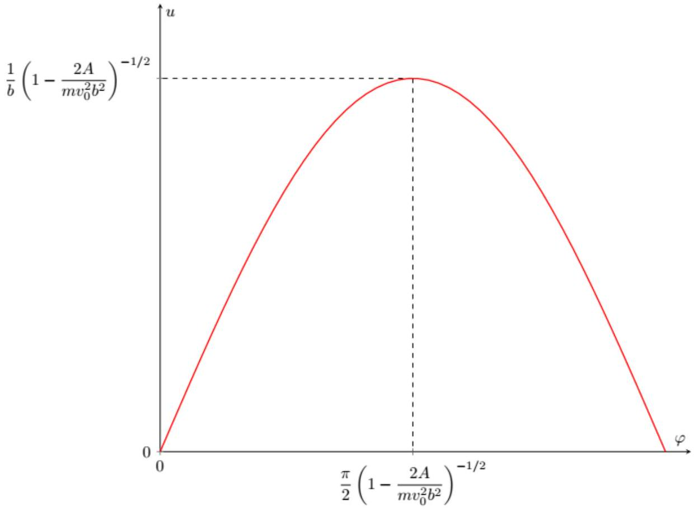
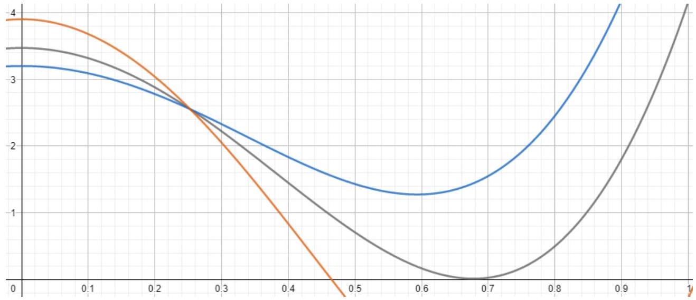

А1 ${ } ^ { 0.80 }$ Металлический шар радиуса $R$ помещён в однородное электрическое поле $\vec { E } _ { 0 }$.
Найдите приобретаемый шаром дипольный момент $\vec { p }$.
Ответ выразите через $\vec { E } _ { 0 } , R$ и электрическую постоянную $\epsilon _ { 0 }$.

Электрическое поле внутри шара равняется нулю, а вне шара представляет собой сумму внешнего поля и поля диполя:

$$
\vec { E } = \vec { E } _ { 0 } + \frac { 1 } { 4 \pi \epsilon _ { 0 } } \left( \frac { 3 ( \vec { p } \cdot \vec { r } ) \vec { r } } { r ^ { 5 } } - \frac { \vec { p } } { r ^ { 3 } } \right)
$$

На поверхности шара электрическое поле направлено перпендикулярно поверхности.
Отсюда:

Ответ:

$$
\vec { p } = 4 \pi \epsilon _ { 0 } R ^ { 3 } \vec { E } _ { 0 }
$$

A2 ${ } ^ { 0.50 }$ Пусть шар расположен в электрическом поле, направленном вдоль оси $z$, напряжённость которого меняется по закону:

$$
\vec { E } \approx \left( E _ { 0 } + k z \right) \vec { e } _ { z }
$$

где $E _ { 0 }$ и $k$ - известные величины, причём $k R \ll E _ { 0 }$.
Найдите силу $F _ { z }$, действующую на шар.
Ответ выразите через $E _ { 0 } , k , R$ и электрическую постоянную $\epsilon _ { 0 }$.

По определению диполь представляет собой два точечных заряда $+ q$ и $- q$, расположенные на расстоянии $l$ друг от друга.
Пусть $\vec { r }$ - радиус-вектор отрицательного заряда, а $\vec { l }$ - радиус-вектор положительного заряда относительно отрицательного.
Тогда для силы взаимодействия имеем:

$$
\vec { F } = q ( \vec { E } ( \vec { r } + \vec { l } ) - \vec { E } ( \vec { r } ) )
$$

Если электрическое поле направлено вдоль дипольного момента системы, то, поскольку диполь ориентирован вдоль оси $z$, сила, действующая на него, направлена вдоль оси $z$.
Если диполь можно считать точечным

$$
E _ { z } ( \vec { r } + \vec { l } ) - E _ { z } ( \vec { r } ) = \frac { d E _ { z } } { d z } \cdot l
$$

Отсюда для силы получим:

$$
F _ { z } = p _ { z } \frac { d E _ { z } } { d z }
$$

В нашей задаче поскольку $k R \ll E _ { 0 }$ - модель электрического диполя хорошо описывает электрическое поле шара.
Подставляя выражение для $p _ { z }$ и $\frac { d E _ { z } } { d z }$, найдём:

Ответ:

$$
F _ { z } = 4 \pi R ^ { 3 } \epsilon _ { 0 } E _ { 0 } k
$$

А3 ${ } ^ { 0.20 }$ Найдите величину электрического поля провода $E _ { п }$ на расстоянии $r$ от него. Ответ выразите через $\lambda$, $r$ и электрическую постоянную $\varepsilon _ { 0 }$.

Из теоремы Гаусса имеем:

$$
2 \pi r L E _ { \text {п } } = \frac { q } { \epsilon _ { 0 } } = \frac { \lambda L } { \epsilon _ { 0 } }
$$

откуда:

Ответ:

$$
E _ { \text {п } } = \frac { \lambda } { 2 \pi \epsilon _ { 0 } r }
$$

A4 ${ } ^ { 0.50 }$ Найдите величину и направление (притяжение или отталкивание) силы $F$, действующей на шар со стороны провода на расстоянии $r$ от него. Ответ выразите через $\lambda , R , r$ и электрическую постоянную $\varepsilon _ { 0 }$.

При $r \gg R$ величины $E$ и $\frac { d E } { d r }$ поля провода на масштабах размеров шара могут считаться постоянными. В данном приближении дипольный момент шара равен:

$$
p = \frac { 2 \lambda R ^ { 3 } } { r }
$$

Сила, действующая на шар, равна:

$$
F _ { r } = p \frac { d E _ { r } } { d x }
$$

откуда:

Ответ: Сила притяжения равна:

$$
F = \frac { \lambda ^ { 2 } R ^ { 3 } } { \pi \epsilon _ { 0 } r ^ { 3 } }
$$

A5 ${ } ^ { 0.40 }$ Покажите, что механическая потенциальная энергия $W _ { p }$ шара в поле провода при расстоянии $r$ между проводом и центром шара равна:

$$
W _ { p } = - \frac { A } { r ^ { 2 } }
$$

Найдите $A$. Ответ выразите через $\lambda , R$ и электрическую постоянную $\varepsilon _ { 0 }$.

Для потенциальной энергии имеем:

$$
W _ { p } = - \int _ { r } ^ { \infty } F d r
$$

Интегрируя, находим:

$$
W _ { p } = - \frac { \lambda ^ { 2 } R ^ { 3 } } { 2 \pi \epsilon _ { 0 } r ^ { 2 } }
$$

Отсюда параметр $A$ равен:

Ответ:

$$
A = \frac { \lambda ^ { 2 } R ^ { 3 } } { 2 \pi \epsilon _ { 0 } }
$$

В1 ${ } ^ { 0.60 }$ Найдите минимальное расстояние $r _ { \min }$ между центром шара и проводом в процессе движения, считая, что столкновения не происходит. Ответ выразите через $A , b , m$ и $v _ { 0 }$.

Из закона сохранения энергии имеем:

$$
\frac { m v ^ { 2 } } { 2 } - \frac { A } { r ^ { 2 } } = \frac { m v _ { 0 } ^ { 2 } } { 2 }
$$

Представим квадрат скорости в следующем виде:

$$
v ^ { 2 } = \dot { r } ^ { 2 } + r ^ { 2 } \dot { \varphi } ^ { 2 }
$$

Из закона сохранения момент импульса получим:

$$
L = m r ^ { 2 } \dot { \varphi } \Rightarrow \dot { \varphi } = \frac { v _ { 0 } b } { r ^ { 2 } }
$$

Комбинируя с законом сохранения энергии, получим:

$$
\frac { m \dot { r } ^ { 2 } } { 2 } + \frac { m v _ { 0 } ^ { 2 } b ^ { 2 } } { 2 r ^ { 2 } } - \frac { A } { r ^ { 2 } } = \frac { m v _ { 0 } ^ { 2 } } { 2 }
$$

Минимальное расстояние до провода достигается при $\dot { r } = 0$. Отсюда получим:

Ответ:

$$
r _ { \min } = \sqrt { b ^ { 2 } - \frac { 2 A } { m v _ { 0 } ^ { 2 } } }
$$

В2 ${ } ^ { 0.20 }$ Найдите $v _ { \text {crit } }$. Ответ выразите через $A , b$ и $m$.

Подкоренное выражение должно быть неотрицательным. Отсюда получим:

Ответ:

$$
v _ { c r i t } = \frac { 1 } { b } \sqrt { \frac { 2 A } { m } }
$$

С1 ${ } ^ { 0.40 }$ Выразите $u ^ { \prime }$ через $r , \dot { r }$ и $\dot { \varphi }$.
Найдите $u ^ { \prime } ( 0 )$, соответствующую значению $\varphi = 0$.

Явно продифференцируем $u$ :

$$
u ^ { \prime } = \frac { d u } { d \varphi } = - \frac { 1 } { r ^ { 2 } } \frac { d r } { d \varphi }
$$

Представим $\frac { d r } { d \varphi }$ как производную сложной функции:

$$
\frac { d r } { d \varphi } = \frac { \dot { r } } { \dot { \varphi } }
$$

откуда:

Ответ:

$$
u ^ { \prime } = - \frac { \dot { r } } { r ^ { 2 } \dot { \varphi } }
$$

Величина постоянна и равна:

$$
r ^ { 2 } \dot { \varphi } = \frac { L } { m } = v _ { 0 } b
$$

В начальный момент скорость направлена прямо на провод. Тогда находим:

Ответ:

$$
u ^ { \prime } ( 0 ) = \frac { 1 } { b }
$$

С2 ${ } ^ { 0.30 }$ Выразите механическую энергию $E$ шара через $m , u , u ^ { \prime } , v _ { 0 } , b$ и $A$.

Выражение для механической энергии шара следующее:

$$
E = \frac { m \dot { r } ^ { 2 } } { 2 } + \frac { m r ^ { 2 } \dot { \varphi } ^ { 2 } } { 2 } - \frac { A } { r ^ { 2 } }
$$

Из закона сохранения момента импульса имеем:

$$
L = m r ^ { 2 } \dot { \varphi } = m v _ { 0 } b
$$

откуда:

$$
E = \frac { m \dot { r } ^ { 2 } } { 2 } + \frac { m v _ { 0 } ^ { 2 } b ^ { 2 } } { 2 r ^ { 2 } } - \frac { A } { r ^ { 2 } }
$$

Переходя к переменным $u$ и $u ^ { \prime }$, получим:

Ответ:

$$
\frac { m v _ { 0 } ^ { 2 } b ^ { 2 } } { 2 } \left( u ^ { \prime 2 } + u ^ { 2 } \right) - A u ^ { 2 } = E = \frac { m v _ { 0 } ^ { 2 } } { 2 }
$$

С3 ${ } ^ { 0.70 }$ Получите зависимость $u ( \varphi )$. Ответ выразите через $m , v _ { 0 } , b , A$ и $\varphi$.

Дифференцируя по $\varphi$ выражение для энергии, получим уравнение гармонических колебаний:

$$
u ^ { \prime \prime } = - u \left( 1 - \frac { 2 A } { m v _ { 0 } ^ { 2 } b ^ { 2 } } \right)
$$

с циклической частотой:

$$
\omega _ { 0 } = \sqrt { 1 - \frac { 2 A } { m v _ { 0 } ^ { 2 } b ^ { 2 } } }
$$

Общее решение запишем в виде:

$$
u ( \varphi ) = C \sin \left( \omega _ { 0 } \varphi + \varphi _ { 1 } \right)
$$

С учётом начальных условий:

$$
u ( 0 ) = 0 \quad u ^ { \prime } ( 0 ) = \frac { 1 } { b }
$$

Находим:

Ответ:

$$
u ( \varphi ) = \frac { 1 } { b \sqrt { 1 - \frac { 2 A } { m v _ { 0 } ^ { 2 } b ^ { 2 } } } } \sin \left( \varphi \sqrt { 1 - \frac { 2 A } { m v _ { 0 } ^ { 2 } b ^ { 2 } } } \right)
$$

С4 ${ } ^ { 0.60 }$ В листе ответов качественно постройте траекторию центра шара в координатах $u , \varphi$. Координаты всех характерных точек могут быть выражены через $m , v _ { 0 } , b$ и $A$.

Величина $u$, начиная от нуля, достигает максимума, а затем, достигая нуля, остаётся постоянной во времени. График приведён на рисунке ниже:

Ответ:

С5 ${ } ^ { 0.50 }$ Используя значение параметра $A$, найденное в пункте $\mathbf { A 4 }$, найдите начальную скорость шара $v _ { 1 }$, при которой за время взаимодействия между ним и проводом направление скорости шара изменяется на противоположное.
Ответ выразите через $m , b , R , \lambda$ и электрическую постоянную $\epsilon _ { 0 }$.

При изменении направления скорости шарика на противоположное, полное изменение угла $\varphi$ равно $2 \pi$. Отсюда находим величину $\omega _ { 0 }$ :

$$
\omega _ { 0 } = \frac { 1 } { 2 }
$$

Тогда параметр $A$ равен:

$$
A = \frac { 3 m v _ { 1 } ^ { 2 } b ^ { 2 } } { 8 }
$$

Приравнивая с выражением, полученным в пункте А4

$$
\frac { \lambda ^ { 2 } R ^ { 3 } } { 2 \pi \epsilon _ { 0 } } = \frac { 3 m v _ { 1 } ^ { 2 } b ^ { 2 } } { 8 }
$$

находим:

Ответ:

$$
v _ { 1 } = \frac { 2 \lambda R } { b } \sqrt { \frac { R } { 3 \pi \epsilon _ { 0 } m } }
$$

D1 ${ } ^ { 0.60 }$ Найдите $S$ и $q _ { 2 }$. Ответы выразите через $R , L$ и $q$.

Введём в центре сферы цилиндрической систему координат с осью $z$, направленной вдоль линии, соединяющей центр сферы с зарядом $q _ { 1 }$.
Потенциал зарядов $q _ { 1 }$ и $- q _ { 2 }$ в любой точке на поверхности шара равен нулю, поэтому:

$$
\frac { q _ { 1 } } { \sqrt { r ^ { 2 } + ( x - L ) ^ { 2 } } } = \frac { q _ { 2 } } { \sqrt { r ^ { 2 } + ( x - S ) ^ { 2 } } }
$$

или:

$$
\left( q _ { 1 } ^ { 2 } - q _ { 2 } ^ { 2 } \right) \left( r ^ { 2 } + x ^ { 2 } \right) + 2 x \left( q _ { 2 } ^ { 2 } L - q _ { 1 } ^ { 2 } S \right) + q _ { 1 } ^ { 2 } S ^ { 2 } - q _ { 2 } ^ { 2 } L ^ { 2 } = 0
$$

Поскольку $r ^ { 2 } + x ^ { 2 } = R ^ { 2 }$, коэффициент при $x$ равен нулю. Тогда получим систему уравнений:

$$
\frac { L } { S } = \frac { q _ { 1 } ^ { 2 } } { q _ { 2 } ^ { 2 } } \quad \left( q _ { 1 } ^ { 2 } - q _ { 2 } ^ { 2 } \right) R ^ { 2 } = q _ { 2 } ^ { 2 } L ^ { 2 } - q _ { 1 } ^ { 2 } S ^ { 2 }
$$

решая которую, находим:

Ответ:

$$
S = \frac { R ^ { 2 } } { L } \quad q _ { 2 } = \frac { q _ { 1 } R } { L }
$$

D2 ${ } ^ { 0.40 }$ Найдите $d q _ { 1 } , d q _ { 2 } , S$ и $r _ { - }$.
Ответы выразите через $\lambda , R , r , \alpha$ и $d \alpha$.

Для $d q _ { 1 }$ имеем:

$$
d q _ { 1 } = \lambda r d \tan \alpha
$$

или:

Ответ:

$$
d q _ { 1 } = \frac { \lambda r } { \cos ^ { 2 } \alpha } d \alpha
$$

Рассматриваемый элемент находится на расстоянии $L = \frac { r } { \cos \alpha }$ от центра шара. Отсюда найдём $d q _ { 2 }$ и $S$ :

Ответ:

$$
d q _ { 2 } = \frac { \lambda R } { \cos \alpha } d \alpha \quad S = \frac { R ^ { 2 } \cos \alpha } { r }
$$

Для $r _ { - }$имеем:

$$
r _ { - } = r - S \cos \alpha
$$

или

Ответ:

$$
r _ { - } = r - \frac { R ^ { 2 } \cos ^ { 2 } \alpha } { r }
$$

D3 ${ } ^ { 0.20 }$ Найдите величину и направление (притяжение или отталкивание) векторной суммы сил $d \vec { F } = d \vec { F } _ { + } + d \vec { F } _ { - }$взаимодействия зарядов $d q _ { 2 }$ и $- d q _ { 2 }$ с проводом. Ответ выразите через $\lambda , R , r , \alpha , d \alpha$ и электрическую постоянную $\epsilon _ { 0 }$.

Пара зарядов-изображений притягивается к проводу, поскольку отрицательный заряд находится на меньшем расстоянии от провода.
Для силы притяжения с учётом электрического поля провода имеем:

$$
d F = \frac { \lambda d q _ { 2 } } { 2 \pi \epsilon _ { 0 } } \left( \frac { 1 } { r _ { - } } - \frac { 1 } { r } \right)
$$

или:

Ответ: Сила притяжения равна

$$
d F = \frac { \lambda ^ { 2 } R ^ { 3 } } { 2 \pi \epsilon _ { 0 } r ^ { 3 } } \frac { \cos \alpha d \alpha } { 1 - \frac { R ^ { 2 } } { r ^ { 2 } } + \frac { R ^ { 2 } } { r ^ { 2 } } \sin ^ { 2 } \alpha }
$$

D4 ${ } ^ { 1.00 }$ Найдите величину и направление полной силы взаимодействия шара с проводом $F _ { \text {полн } }$.
Ответ выразите через $\lambda , R , \theta$ и электрическую постоянную $\epsilon _ { 0 }$.

Для нахождения полной силы вычислим интеграл от выражения, полученного в пункте $\mathbf { D 3 }$ в пределах от $- \frac { \pi } { 2 }$ до $\frac { \pi } { 2 }$.
Введём величину $t$, равную:

$$
t = \frac { R \sin \alpha } { \sqrt { r ^ { 2 } - R ^ { 2 } } }
$$

Тогда получим:

$$
F = \frac { \lambda ^ { 2 } R ^ { 2 } } { 2 \pi \epsilon _ { 0 } r \sqrt { r ^ { 2 } - R ^ { 2 } } } \int _ { - \frac { R } { \sqrt { r ^ { 2 } - R ^ { 2 } } } } ^ { \frac { R } { \sqrt { r ^ { 2 } - R ^ { 2 } } } } \frac { d t } { 1 + t ^ { 2 } } = \frac { \lambda ^ { 2 } } { \pi \epsilon _ { 0 } } \frac { R } { r } \frac { R } { \sqrt { r ^ { 2 } - R ^ { 2 } } } \arctan \frac { R } { \sqrt { r ^ { 2 } - R ^ { 2 } } }
$$

Учитывая связь $r , R$ и $\theta$, находим:

Ответ: Сила притяжения равна

$$
F = \frac { \lambda ^ { 2 } } { \pi \epsilon _ { 0 } } \frac { \sin ^ { 2 } \theta \cdot \theta } { \cos \theta }
$$

D5 ${ } ^ { 1.00 }$ Найдите потенциальную энергию $W _ { p }$ взаимодействия шарика с проводом.
Ответ выразите через $\lambda , R , \theta$ и электрическую постоянную $\varepsilon _ { 0 }$.

Учитывая, что шар притягивается к проводу, выражение для потенциальной энергии следующее:

$$
W _ { p } = - \int _ { r } ^ { \infty } F ( r ) d r
$$

Найдём величину $d r$ в переменных $R$ и $\theta$ :

$$
d r = d \left( \frac { R } { \sin \theta } \right) = - \frac { R \cos \theta d \theta } { \sin ^ { 2 } \theta }
$$

Тогда имеем:

$$
W _ { p } = - \frac { \lambda ^ { 2 } R } { \pi \epsilon _ { 0 } } \int _ { 0 } ^ { \theta } \theta d \theta
$$

откуда:

Ответ:

$$
W _ { p } ( \theta ) = - \frac { \lambda ^ { 2 } R \theta ^ { 2 } } { 2 \pi \epsilon _ { 0 } }
$$

D6 ${ } ^ { 0.30 }$ Какую скорость $v _ { \text {ст } }$ будет иметь незаряженный металлический шар радиусом $R$ и массой $m$ при столкновении с проводом, если его из бесконечности отпустить без начальной скорости?
Ответ выразите через $\lambda , R , m$ и электрическую постоянную $\varepsilon _ { 0 }$.

В момент контакта шара и провода $\theta = \frac { \pi } { 2 }$.
Запишем закон сохранения энергии:

$$
\frac { m v _ { 0 } ^ { 2 } } { 2 } = \frac { \lambda ^ { 2 } R } { 2 \pi \epsilon _ { 0 } } \left( \frac { \pi } { 2 } \right) ^ { 2 }
$$

откуда:

Ответ:

$$
v = \frac { \pi \lambda } { 2 } \sqrt { \frac { R } { \pi \epsilon _ { 0 } m } }
$$

Е1 ${ } ^ { 0,40 }$ Для заданного значения $v _ { 0 }$ получите зависимость квадрата радиальной компоненты скорости $\dot { r } ^ { 2 }$ от параметра $\theta$.
Ответ выразите через $m , v _ { 0 } , \lambda , R , b$, электрическую постоянную $\varepsilon _ { 0 }$ и $\theta$.

Из закона сохранения энергии имеем:

$$
\frac { m v ^ { 2 } } { 2 } - \frac { \lambda ^ { 2 } R \theta ^ { 2 } } { 2 \pi \epsilon _ { 0 } } = \frac { m v _ { 0 } ^ { 2 } } { 2 }
$$

Представим скорость в следующем виде:

$$
v ^ { 2 } = \dot { r } ^ { 2 } + r ^ { 2 } \dot { \varphi } ^ { 2 }
$$

С учётом закона сохранения момента импульса

$$
L = m v _ { 0 } b = m r ^ { 2 } \dot { \varphi }
$$

находим:

Ответ:

$$
\dot { r } ^ { 2 } = v _ { 0 } ^ { 2 } - v _ { 0 } ^ { 2 } \frac { b ^ { 2 } } { R ^ { 2 } } \sin ^ { 2 } \theta + \frac { \lambda ^ { 2 } R } { \pi \epsilon _ { 0 } m } \theta ^ { 2 }
$$

E2 ${ } ^ { 0.60 }$ Постройте качественные графики зависимости $\dot { r } ^ { 2 } ( \theta )$ при разных значениях $v _ { 0 }$.

В зависимости от величины $v _ { 0 }$ функции делятся на три типа:

1) пересекающие ось ординат при $\theta < \frac { \pi } { 2 }$;
2) не пересекающие ось ось ординат;
3) касающиеся оси ординат при $\theta < \frac { \pi } { 2 }$.

E3 ${ } ^ { \mathbf { 0 . 6 0 } }$ Считая все величины, кроме $v _ { 0 }$, постоянными, получите систему уравнений, позволяющую определить величину $v _ { c r i t }$.
В систему уравнений могут войти $m , R , b , \lambda$, электрическая постоянная $\varepsilon _ { 0 } , \theta _ { \text {max } }$ и $v _ { \text {crit } }$.

При достаточно больших скоростях (функция 1-го типа) график пересекает ось ординат. В момент пересечения величина $\dot { r }$ изменяется на противоположную, поскольку $\dot { r } ^ { 2 } > 0$.
При достаточно низких скоростях (функция 2-го типа) значение $\dot { r } ^ { 2 }$ в экстремуме положительно, поэтому шар падает на провод. Функция 3-го типа является граничным случаем рассмотренных выше - в экстремуме значение функции $\dot { r } ^ { 2 }$ обращается в ноль.
При сколь угодно больших скоростях шар не коснётся провода.
Отсюда ясно, что в равенства нулю величины $\dot { r } ^ { 2 }$ нужно также приравнять нулю производную $\frac { d \dot { r } ^ { 2 } } { d \varphi }$, что в виде системы записывается следующим образом:

Ответ:

$$
\left( \frac { b ^ { 2 } \sin ^ { 2 } \theta _ { \max } } { R ^ { 2 } } - 1 \right) = \frac { \lambda ^ { 2 } R \theta _ { \max } ^ { 2 } } { m v _ { 0 } ^ { 2 } \pi \epsilon _ { 0 } } \quad \frac { b ^ { 2 } \sin 2 \theta _ { \max } } { R ^ { 2 } } = \frac { 2 \lambda ^ { 2 } R \theta _ { \max } } { m v _ { 0 } ^ { 2 } \pi \epsilon _ { 0 } }
$$

E4 ${ } ^ { 1.20 }$
Найдите $v _ { \text {crit } 1 } , v _ { \text {crit } 2 }$ и $v _ { \text {crit3 } }$, соответствующие следующим значениям $b$ :

$$
b _ { 1 } = 20 R \quad b _ { 2 } = 3 R \quad b _ { 3 } = 1,1 R
$$

Ответы выразите через $m , R , \lambda$ и электрическую постоянную $\varepsilon _ { 0 }$.

Из уравнения для равной нулю производной находим:

$$
v _ { 0 } = \lambda \sqrt { \frac { R } { \pi \epsilon _ { 0 } m } } \cdot \frac { R } { b } \sqrt { \frac { 2 \theta _ { \max } } { \sin 2 \theta _ { \max } } }
$$

Для нахождения $v _ { 0 }$ необходимо определить $\theta _ { \text {max } }$.
Разделив уравнения друг на друга, получим:

$$
\frac { k ^ { 2 } \sin ^ { 2 } \theta _ { \max } - 1 } { k ^ { 2 } \sin 2 \theta _ { \max } } = \frac { \theta _ { \max } } { 2 } \quad k = \frac { b } { R }
$$

Решая уравнение на калькуляторе, находим:

$$
\theta _ { \max 1 } = 0,296 \text { рад } \quad \theta _ { \max 2 } = 0,793 \text { рад } \quad \theta _ { \max 3 } = 1,459 \text { рад }
$$

откуда:

Ответ:

$$
v _ { c r i t 1 } \approx 5,15 \cdot 10 ^ { - 2 } \lambda \sqrt { \frac { R } { \pi \epsilon _ { 0 } m } } \quad v _ { c r i t 2 } \approx 3,15 \cdot 10 ^ { - 1 } \lambda \sqrt { \frac { R } { \pi \epsilon _ { 0 } m } } \quad v _ { c r i t 3 } \approx 3,30 \lambda \sqrt { \frac { R } { \pi \epsilon _ { 0 } m } }
$$
