A0 ${ } ^ { ? ? }$ Измерьте сопротивления катушек А и B ( $r _ { A }$ и $r _ { B }$ соответственно), а также сопротивления последовательно соединённых с ними резисторов. Все значения должны лежать в диапазоне до 15 Ом.

С помощью мультиметра в режиме омметра измеряем сопротивления катушек и убеждаемся в их работоспособности.

Ответ:

$$
\begin{gathered}
r _ { A } = ( 13.3 \pm 0.1 ) \mathrm { OM } \\
r _ { B } = ( 9.0 \pm 0.1 ) \mathrm { OM } \\
r _ { A , \text { рез } } = r _ { B , \text { рез } } = ( 0.97 \pm 0.04 ) \mathrm { OM }
\end{gathered}
$$

А1 ${ } ^ { 0.60 }$ Проведите измерения для проверки приведённой выше модели экранирования магнитных полей при частоте $f = 10$ кГц. Постройте линеаризованный график и найдите коэффициент затухания $\alpha$ для данной частоты. Фольгу необходимо располагать между катушкой А и катушкой датчика.

Из закона электромагнитной индукции Фарадея следует, что ЭДС индукции

$$
\mathcal { E } _ { \text {инд } } ( t ) = - N \frac { d \Phi ( t ) } { d t } = - N S \frac { d B } { d t }
$$

Пренебрегая омическим сопротивлением катушки, получим, что напряжение на катушке

$$
U ( t ) = - \mathcal { E } _ { \text {инд } } ( t ) = N S \frac { d B } { d t }
$$

Следовательно, амплитуды напряжения на катушке и индукции магнитного поля связаны как

$$
U _ { \text {ампл } } = 2 \pi f _ { 0 } N S B _ { \text {ампл } } \Longrightarrow U _ { \text {ампл } } \sim B _ { \text {ампл } }
$$

Пусть $U _ { 0 }$ - амплитуда напряжения на катушке датчика в отсутствии фольги, $U _ { d }$ - амплитуда напряжения на катушке датчика при слое фольги толщиной $d$ мкм. $B _ { 0 }$ и $B _ { d }$ определим аналогично. Тогда

$$
\frac { B _ { d } } { B _ { 0 } } = \frac { U _ { d } } { U _ { 0 } } \Longrightarrow - \alpha d = \ln \frac { B _ { d } } { B _ { 0 } } = \ln \frac { U _ { d } } { U _ { 0 } }
$$

Видно, что $\ln \frac { U _ { d } } { U _ { 0 } } ( d )$ - линейная зависимость
Таблица измеренных и рассчитанных величин представлена ниже.

| $d$, мкм | $U _ { d } , \mathrm {~B}$ | $\ln \frac { U _ { d } } { U _ { 0 } }$ |
| :--- | :--- | :--- |
| 0 | 2.12 | 0 |
| 50 | 1.70 | -0.22 |
| 100 | 1.26 | -0.52 |
| 200 | 0.78 | -1.00 |
| 300 | 0.46 | -1.53 |

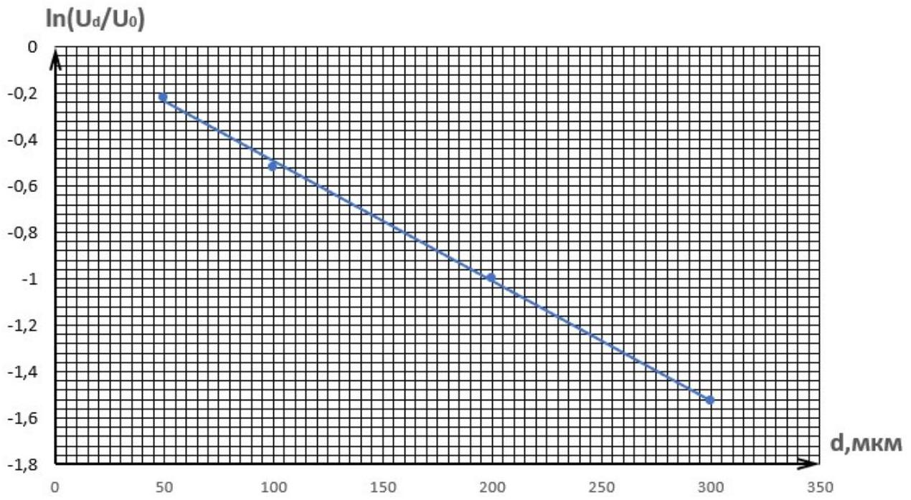
Построим график линейной зависимости $\ln \frac { U _ { d } } { U _ { 0 } } ( d )$ и из коэффициента угла наклона определим $\alpha$.

Ответ: $\alpha = 5160 \mathrm {~m} ^ { - 1 }$

Повторим измерения предыдущего пункта для других частот. Измерения и соответствующие им $\alpha$ представлены в таблице ниже.

| $f$, кГц | $U _ { 0 } , \mathrm {~B}$ | $U _ { 50 } , \mathrm {~B}$ | $U _ { 100 } , \mathrm {~B}$ | $U _ { 200 } , \mathrm {~B}$ | $U _ { 300 } , \mathrm {~B}$ | $\alpha , 10 ^ { 3 } \mathrm { M } ^ { - 1 }$ |
| :--- | :--- | :--- | :--- | :--- | :--- | :--- |
| 5.00 | 2.10 | 1.88 | 1.62 | 1.17 | 0.74 | 3170 |
| 6.00 | 2.10 | 1.84 | 1.55 | 1.06 | 0.65 | 3690 |
| 7.00 | 2.12 | 1.82 | 1.48 | 0.98 | 0.58 | 4130 |
| 8.00 | 2.12 | 1.78 | 1.41 | 0.90 | 0.53 | 4540 |
| 9.00 | 2.12 | 1.74 | 1.34 | 0.82 | 0.50 | 5000 |
| 10.00 | 2.12 | 1.70 | 1.26 | 0.78 | 0.46 | 5140 |
| 12.00 | 2.12 | 1.62 | 1.14 | 0.66 | 0.40 | 5910 |
| 14.00 | 2.21 | 1.54 | 1.03 | 0.60 | 0.34 | 6160 |
| 16.00 | 2.15 | 1.46 | 0.94 | 0.54 | 0.31 | 6480 |
| 18.00 | 2.31 | 1.38 | 0.86 | 0.50 | 0.30 | 6580 |
| 20.00 | 2.18 | 1.31 | 0.82 | 0.46 | 0.27 | 6810 |
| 25.00 | 2.58 | 1.04 | 0.70 | 0.40 | 0.25 | 6980 |

А3 ${ } ^ { 1.20 }$ Постройте график зависимости $\alpha$ от частоты.
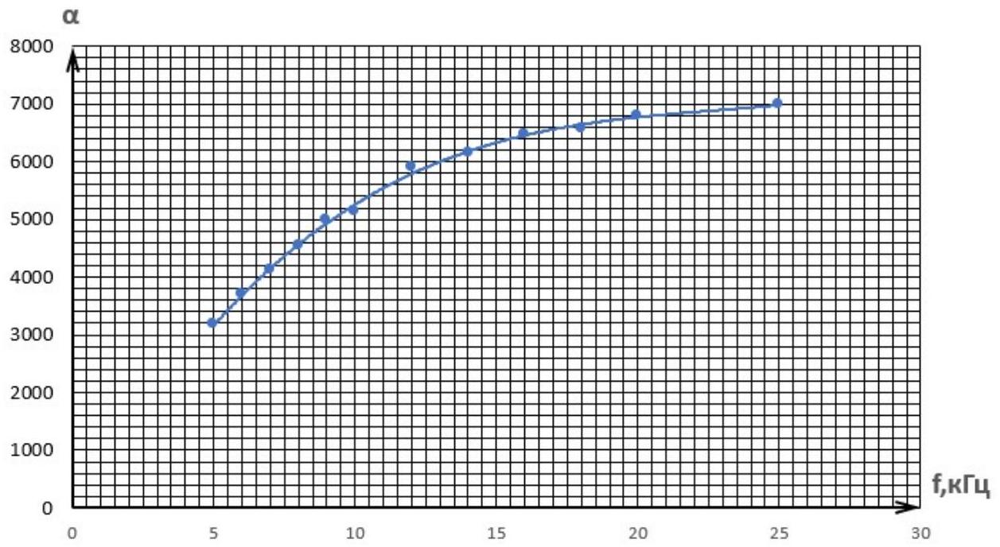

В1 ${ } ^ { 0.30 }$ Экспериментально определите $m$. Нарисуйте схемы измерений, необходимых для получения численного значения этой величины.

Соберем схему, представленную на рисунке и будем измерять $U _ { \text {in } }$ и $U _ { \text {out } }$ с помощью осциллографа.

$$
\begin{aligned}
& U _ { i n , 0 } = ( 6,10 \pm 0.05 ) \text { В. } \\
& U _ { o u t , 0 } = ( 3.48 \pm 0.04 ) \text { В. }
\end{aligned}
$$

Получаем значение $m = \frac { U _ { \text {out } , 0 } } { U _ { \text {in } , 0 } }$ :
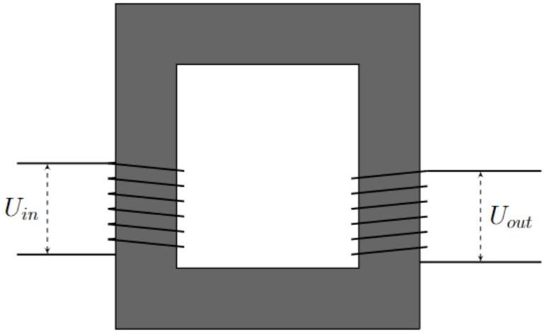

Ответ:
$m = 0.57 \pm 0.01$.

В2 ${ } ^ { 1.30 }$ Снимите зависимость $P _ { \text {пол } }$ и $P _ { 0 }$ от амплитуды тока во вторичной катушке $I _ { B , 0 }$.

Введём обозначения: $U _ { 1 }$ и $I _ { 1 }$ - амплитуды напряжения и тока в первичной катушке соответственно, $\varphi$ - разность фаз между напряжением и током в первичной катушке, $U _ { 2 }$ - амплитуда напряжения на реостате, $I _ { 2 }$ - амплитуда тока через него ( $I _ { 2 } = I _ { B , 0 }$ ).
Тогда $P _ { 0 } = \frac { U _ { 1 } I _ { 1 } \cos \varphi } { 2 } , P _ { \text {пол } } = \frac { U _ { 2 } I _ { 2 } } { 2 } = \frac { U _ { 2 } ^ { 2 } } { 2 R }$
$U _ { 1 } , U _ { 2 } , \varphi$ измеряются непосредственно с помощью осциллографа.
$I _ { 1 } = \frac { U _ { r } } { r }$, где $r = 10$ Ом - сопротивление, включённое последовательно первичной катушке, $U _ { r }$ - амплитуда напряжения на нём.
$I _ { B , 0 }$ изменяется при повороте ручки реостата.
Измерение и рассчитанные величины приведены в таблице ниже.

| $U _ { 1 } , \mathrm {~B}$ | $I _ { 1 }$, MA | $\cos \varphi$ | $P _ { 0 }$, мВт | $R$, Ом | $U _ { 2 } , \mathrm {~B}$ | $I _ { B , 0 } , \mathrm { MA }$ | $P _ { \text {пол } }$, мВт | $\eta$ |
| :--- | :--- | :--- | :--- | :--- | :--- | :--- | :--- | :--- |
| 3.36 | 59.0 | 0.85 | 84.1 | 2.1 | 0.16 | 78.1 | 6.4 | 0.08 |
| 3.60 | 54.5 | 0.88 | 86.6 | 8.3 | 0.58 | 70.0 | 20.3 | 0.23 |
| 4.20 | 39.2 | 0.92 | 75.8 | 33.5 | 1.77 | 52.9 | 46.9 | 0.62 |
| 4.60 | 31.8 | 0.91 | 66.9 | 53.8 | 2.26 | 42.0 | 47.4 | 0.71 |
| 4.92 | 26.2 | 0.88 | 56.9 | 79.3 | 2.62 | 33.0 | 43.1 | 0.76 |
| 5.10 | 23.0 | 0.86 | 50.3 | 102 | 2.83 | 27.8 | 39.3 | 0.78 |
| 5.20 | 21.8 | 0.77 | 43.3 | 125 | 2.89 | 23.2 | 33.4 | 0.77 |
| 5.30 | 19.4 | 0.80 | 41.1 | 146 | 3.09 | 21.2 | 32.7 | 0.80 |
| 5.45 | 16.6 | 0.71 | 32.0 | 200 | 3.26 | 16.3 | 26.5 | 0.83 |
| 5.60 | 15.6 | 0.55 | 23.8 | 303 | 3.45 | 11.4 | 19.6 | 0.82 |
| 5.70 | 14.0 | 0.50 | 20.0 | 399 | 3.55 | 8.9 | 15.7 | 0.79 |
| 5.70 | 13.2 | 0.44 | 16.5 | 506 | 3.56 | 7.0 | 12.5 | 0.76 |
| 5.85 | 12.8 | 0.28 | 10.3 | 1080 | 3.65 | 3.4 | 6.2 | 0.60 |
| 5.90 | 13.0 | 0.14 | 5.3 | 5810 | 3.81 | 0.7 | 1.2 | 0.23 |
| 5.90 | 12.8 | 0.14 | 5.2 | 10500 | 3.85 | 0.4 | 0.7 | 0.13 |

B3 ${ } ^ { 1.20 }$ Постройте график зависимости $\eta \left( I _ { B , 0 } \right)$. Укажите максимальное КПД $\eta _ { \max }$ и при каком $I _ { B , 0 } ^ { \text {max } }$ оно достигается.
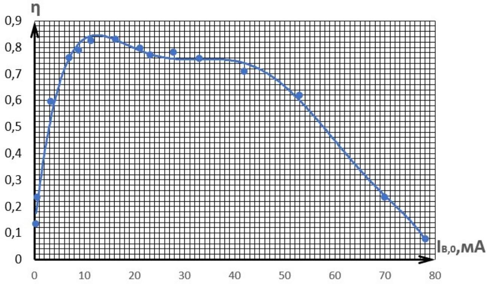

Ответ: $\eta _ { \text {max } } = 0.83 \pm 0.01$.

$$
I _ { B , 0 } ^ { \max } = ( 15 \pm 5 ) \text { мА. }
$$

B4 ${ } ^ { 2.00 }$ Получите зависимости относительного вклада каждого источника потерь $\frac { P _ { \text {Дж } } } { P _ { 0 } }$ и $\frac { P _ { \text {серд } } } { P _ { 0 } }$ от амплитуды тока во вторичной катушке $I _ { B , 0 }$. Постройте их графики.

Джоулевы потери складываются из мощности, рассеивающейся непосредственно на катушках из-за наличия у них омического сопротивления, и мощности, рассеивающейся на резисторе, включённом последовательно первичной катушке.
Зная токи в обеих катушках, их сопротивления и номинал резистора $r$, мы можем посчитать джоулевы потери $P _ { \text {Дж, } }$ а потери в сердечнике $P _ { \text {серд } }$ найдём как остаточный член уравнения «разложения» $P _ { 0 }$ в условии.

$$
\begin{aligned}
& P _ { \text {Дж } } = I _ { 1 } ^ { 2 } \left( r _ { A } + r \right) + I _ { 2 } ^ { 2 } r _ { B } , \\
& P _ { \text {серд } } = P _ { 0 } - P _ { \text {пол } } - P _ { \text {Дж. } } .
\end{aligned}
$$

| $I _ { B , 0 } , \mathrm {~mA}$ | $P _ { \text {Дж, } }$ мВт | $P _ { \text {серд } }$, мВт | $\frac { P _ { \text {Дж } } } { P _ { 0 } }$ | $\frac { P _ { \text {серд } } } { P _ { 0 } }$ |
| :--- | :--- | :--- | :--- | :--- |
| 78.1 | 67.7 | 10.0 | 0.81 | 0.12 |
| 70.0 | 56.4 | 9.9 | 0.65 | 0.11 |
| 52.9 | 30.4 | 0 | 0.40 | 0 |
| 42.0 | 19.6 | 0 | 0.29 | 0 |
| 33.0 | 12.8 | 1.0 | 0.23 | 0.02 |
| 27.8 | 9.6 | 1.4 | 0.19 | 0.03 |
| 23.2 | 7.9 | 2.1 | 0.18 | 0.05 |
| 21.2 | 6.4 | 2.0 | 0.16 | 0.05 |
| 16.3 | 4.4 | 1.1 | 0.14 | 0.03 |
| 11.4 | 3.4 | 0.8 | 0.14 | 0.03 |
| 8.9 | 2.6 | 1.6 | 0.13 | 0.08 |
| 7.0 | 2.3 | 1.7 | 0.14 | 0.10 |
| 3.4 | 2.0 | 2.2 | 0.19 | 0.21 |
| 0.7 | 2.0 | 2.1 | 0.37 | 0.40 |
| 0.4 | 1.9 | 2.6 | 0.36 | 0.50 |

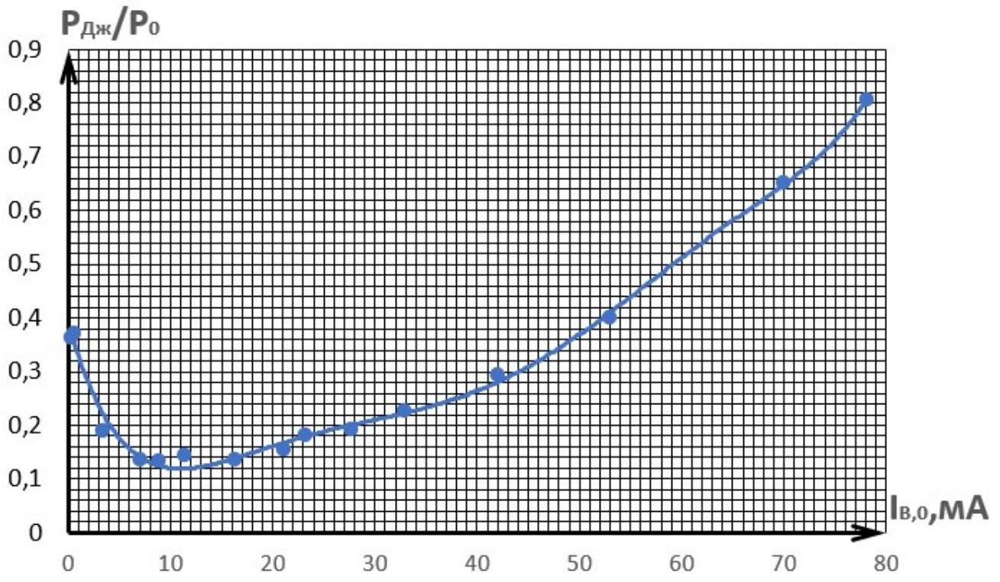

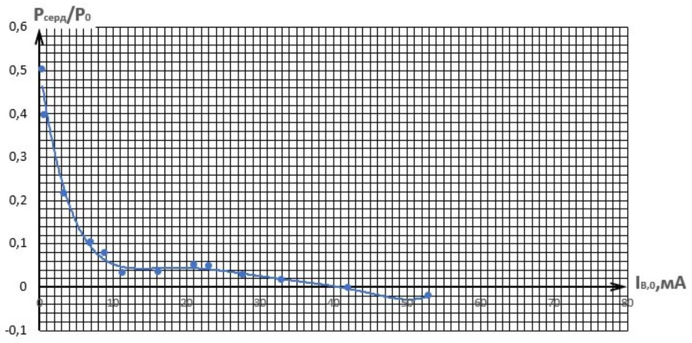

C1 ${ } ^ { 0.10 }$ Получите уравнение, связывающее между собой амплитуды тока и напряжения в катушке.

Из закона электромагнитной индукции Фарадея ЭДС индукции

$$
\mathcal { E } _ { \text {инд } } ( t ) = - N \frac { d \Phi ( t ) } { d t } = - \mu \mu _ { 0 } g N ^ { 2 } \frac { d I ( t ) } { d t }
$$

В связи с пренебрежением омическим сопротивлением напряжение на катушке

$$
U ( t ) = - \mathcal { E } _ { \text {инд } } ( t ) = \mu \mu _ { 0 } g N ^ { 2 } \frac { d I ( t ) } { d t }
$$

Отсюда сразу следует

Ответ:

$$
U _ { \text {ампл } } = 2 \pi \mu \mu _ { 0 } g f _ { 0 } N ^ { 2 } I _ { \text {ампл } }
$$

С2 ${ } ^ { 0.10 }$ В этом случае получите выражения для ЭДС индукции $\mathcal { E } _ { A } ( t )$ и $\mathcal { E } _ { B } ( t )$ в катушках А и В соответственно. Ответ выразите через $N _ { A } , N _ { B } , k , U _ { g } ( t )$. Ток в первичной катушке считайте положительным, если он течет от «плюса» источника к «минусу».

В связи с пренебрежением омическим сопротивлением катушек

$$
\begin{gathered}
- N _ { A } \frac { d \Phi _ { A } } { d t } = \mathcal { E } _ { A } ( t ) = - U _ { g } ( t ) \\
\mathcal { E } _ { B } ( t ) = - N _ { B } \frac { d \Phi _ { B } } { d t } = - k N _ { B } \frac { d \Phi _ { A } } { d t } = - \frac { k N _ { B } } { N _ { A } } U _ { g } ( t )
\end{gathered}
$$

Ответ: $\mathcal { E } _ { A } ( t ) = - U _ { g } ( t )$,

$$
\mathcal { E } _ { B } ( t ) = - \frac { k N _ { B } } { N _ { A } } U _ { g } ( t ) .
$$

С3 ${ } ^ { 0,30 }$ Получите выражение для производной тока в катушке А $\frac { d I _ { A } ( t ) } { d t }$. Ответ выразите через $\mu , \mu _ { 0 } , g , N _ { A } , N _ { B } , k , U _ { g } ( t ) , I _ { B } ( t )$. Считайте токи $I _ { A }$ и $I _ { B }$ одного знака, если создаваемые ими потоки складываются.

$$
\mathcal { E } _ { A } ( t ) = - N _ { A } \frac { d \left( \Phi _ { A } + k \Phi _ { B } ^ { \prime } \right) } { d t } = - \mu \mu _ { 0 } g N _ { A } \left( N _ { A } \frac { d I _ { A } ( t ) } { d t } + k N _ { B } \frac { d I _ { B } ( t ) } { d t } \right) = - U _ { g } ( t ) .
$$

Отсюда получаем

Ответ:

$$
\frac { d I _ { A } ( t ) } { d t } = \frac { 1 } { \mu \mu _ { 0 } g N _ { A } ^ { 2 } } \left( U _ { g } ( t ) - \mu \mu _ { 0 } g k N _ { A } N _ { B } \frac { d I _ { B } ( t ) } { d t } \right)
$$

C4 ${ } ^ { 0.60 }$ Получите теоретические выражения для собственных индуктивностей $L _ { A }$ и $L _ { B }$. Ответ выразите через $\mu , \mu _ { 0 } , g , N _ { A } , N _ { B }$.

Используя закон электромагнитной индукции Фарадея и выражение для потока магнитного поля, получаем:

$$
\mathcal { E } _ { \text {инд } } ( t ) = - N \frac { d \Phi ( t ) } { d t } = - \mu \mu _ { 0 } g N ^ { 2 } \frac { d I ( t ) } { d t }
$$

И из определения индуктивности находим выражения для $L _ { A }$ и $L _ { B }$ :

Ответ:

$$
\begin{aligned}
& L _ { A } = \mu \mu _ { 0 } g N _ { A } ^ { 2 } \\
& L _ { B } = \mu \mu _ { 0 } g N _ { B } ^ { 2 }
\end{aligned}
$$

С5 ${ } ^ { 0.80 }$ Экспериментально определите $L _ { A } , L _ { B } , k$. Нарисуйте схемы измерений, необходимых для получения численных значений этих величин.

Определим амплитуды напряжения и тока в катушке $\mathrm { A } U _ { A , \text { ампл } }$ и $I _ { A , \text { ампл. } }$. Амплитуда напряжения непосредственно измеряется осциллографом, для определения амплитуды тока нужно измерить амплитуду напряжения на сопротивлении, подключённом последовательно катушке (см. рис.), и поделить её на номинал сопротивления.

$$
U _ { A , \text { ампл } } = ( 6.0 \pm 0.1 ) \mathrm { B } , \quad I _ { A , \text { ампл } } = ( 1.20 \pm 0.05 ) \text { мА. }
$$

Тогда используем выражение для импеданса катушки

$$
L _ { A } = \frac { U _ { A , \text { ампл } } } { 2 \pi f _ { 0 } I _ { A , \text { ампл } } } = ( 80 \pm 5 ) \text { мГН }
$$

Аналогично для катушки B

$$
\begin{gathered}
U _ { B , \text { ампл } } = ( 6.0 \pm 0.1 ) \mathrm { B } , \quad I _ { B , \text { ампл } } = ( 2.80 \pm 0.15 ) \text { мА. } \\
L _ { B } = \frac { U _ { B , \text { ампл } } } { 2 \pi f _ { 0 } I _ { B , \text { ампл } } } = ( 34 \pm 2 ) \text { мГн. }
\end{gathered}
$$

Чтобы определить $k$ нужно найти отношение ЭДС индукции катушек в расчёте на один виток:

$$
k = \frac { U _ { o u t , 0 } / N _ { B } } { U _ { i n , 0 } / N _ { A } } = m \frac { N _ { A } } { N _ { B } } = 0.86 \pm 0.02 .
$$

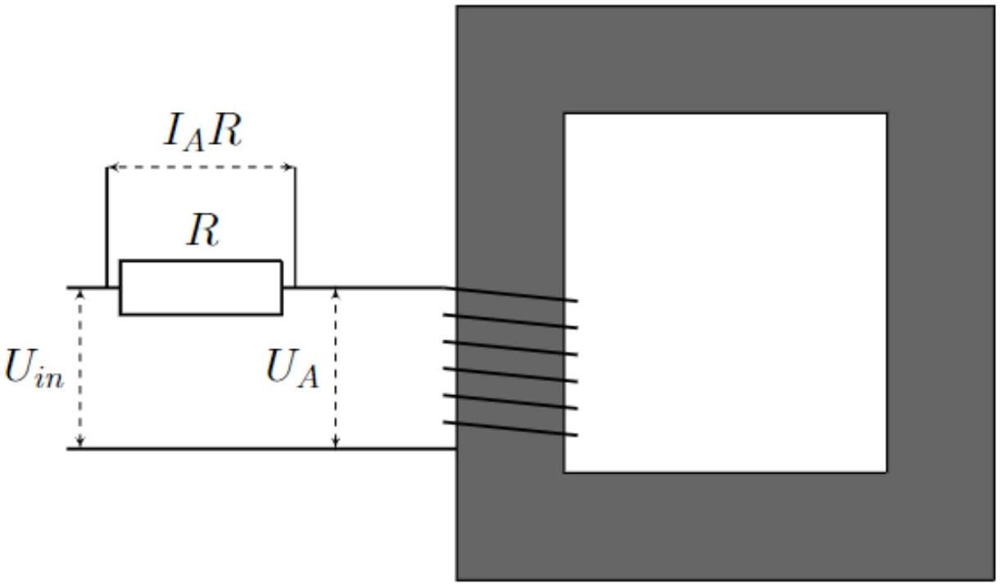

C6 ${ } ^ { 0.30 }$ Покажите, что пренебрежение внутренним сопротивлением катушки оправдано.

Внутреннее сопротивление катушки $r _ { A , B } \approx 10$ 0м.
Импеданс её индуктивности при частоте $f _ { 0 } Z _ { A , B } \approx 3000$ Ом.
Из этого следует, что $r _ { A , B } \ll Z _ { A , B }$, поэтому пренебрежение оправдано.

С7 ${ } ^ { 0.60 }$ Получите в явном виде выражение для $I _ { P } ( t )$ через $f _ { 0 } , L _ { A } , k , U _ { g } ( t )$ и найдите численное значение его амплитуды $I _ { P , 0 }$.

Катушка В замкнута, поэтому падение напряжения на ней равно нулю:

$$
\mathcal { E } _ { B } ( t ) = - N _ { B } \frac { d \left( k \Phi _ { A } + \Phi _ { B } ^ { \prime } \right) } { d t } = - \mu \mu _ { 0 } g N _ { B } \left( k N _ { A } \frac { d I _ { P } ( t ) } { d t } + N _ { B } \frac { d I _ { B } ( t ) } { d t } \right) = 0 .
$$

Отсюда получаем

$$
\frac { d I _ { P } ( t ) } { d t } = - \frac { N _ { B } } { k N _ { A } } \frac { d I _ { B } ( t ) } { d t } .
$$

Воспользуемся результатом, полученным в пункте СЗ:

$$
- \frac { N _ { B } } { k N _ { A } } \frac { d I _ { B } ( t ) } { d t } = \frac { d I _ { P } ( t ) } { d t } = \frac { 1 } { \mu \mu _ { 0 } g N _ { A } ^ { 2 } } \left( U _ { g } ( t ) - \mu \mu _ { 0 } g k N _ { A } N _ { B } \frac { d I _ { B } ( t ) } { d t } \right) .
$$

И выражаем значение $\frac { d I _ { B } ( t ) } { d t }$ :

$$
\frac { d I _ { B } ( t ) } { d t } = - \frac { k U _ { g } ( t ) } { \mu \mu _ { 0 } g N _ { A } N _ { B } \left( 1 - k ^ { 2 } \right) } .
$$

Подставляя в выражение для $\frac { d I _ { P } ( t ) } { d t }$ :

$$
\frac { d I _ { P } ( t ) } { d t } = \frac { U _ { g } ( t ) } { \mu \mu _ { 0 } g N _ { A } ^ { 2 } \left( 1 - k ^ { 2 } \right) } = \frac { U _ { g } ( t ) } { L _ { A } \left( 1 - k ^ { 2 } \right) } .
$$

Так как мы знаем, что $U _ { g } ( t ) = U _ { g , 0 } \cos 2 \pi f _ { 0 } t$ :

$$
I _ { P } ( t ) = - \frac { U _ { g , 0 } } { 2 \pi f _ { 0 } L _ { A } \left( 1 - k ^ { 2 } \right) } \cos 2 \pi f _ { 0 } t
$$

Окончательно получаем:

Ответ:

$$
I _ { P , 0 } = \frac { U _ { g , 0 } } { 2 \pi f _ { 0 } L _ { A } \left( 1 - k ^ { 2 } \right) } = ( 4.6 \pm 1.0 ) \mathrm { mA }
$$

С8 ${ } ^ { 0.60 }$ Экспериментально определите $I _ { P , 0 }$.

Замкнём катушку В и определим амплитуду тока в первичной катушке $I _ { P , 0 }$ ранее описанным в пункте С5 методом (с помощью последовательно соединённого резистора).

Получим:

Ответ: $I _ { P , 0 } = ( 5.0 \pm 0.3 ) \mathrm { mA }$.

Полученные значения совпадают с учетом погрешности.

с9 ${ } ^ { 0.20 }$ Выразите собственную индуктивность последовательно соединенных катушек $L _ { A + B }$ в случае, когда потоки от разных катушек суммируются. Ответ выразите через $L _ { A } , L _ { B } , k$.

Выразим суммарное ЭДС индукции на последовательно соединённых катушках, найдя полный поток через катушку A и B:

$$
\begin{gathered}
\mathcal { E } _ { A + B } ( t ) = - N _ { A } \frac { d \left( \mu \mu _ { 0 } g N _ { A } I _ { A } ( t ) + k \mu \mu _ { 0 } g N _ { B } I _ { B } ( t ) \right) } { d t } - N _ { B } \frac { d \left( k \mu \mu _ { 0 } g N _ { A } I _ { A } ( t ) + \mu \mu _ { 0 } g N _ { B } I _ { B } ( t ) \right) } { d t } \\
I _ { A } ( t ) = I _ { B } ( t ) = I _ { A + B } ( t ) \Longrightarrow \mathcal { E } _ { A + B } ( t ) = - \left( L _ { A } + L _ { B } + 2 k \sqrt { L _ { A } L _ { B } } \right) \frac { d I _ { A + B } ( t ) } { d t }
\end{gathered}
$$

И по определению получаем индуктивность $L _ { A + B }$ :

Ответ:

$$
L _ { A + B } = L _ { A } + L _ { B } + 2 k \sqrt { L _ { A } L _ { B } } .
$$

С10 ${ } ^ { 0.30 }$ Экспериментально определите $L _ { A + B }$.

Метод измерения аналогичен методу в С5, только теперь катушки будут соединены последовательно в цепь.

$$
U _ { A + B , \text { ампл } } = ( 6.1 \pm 0.1 ) \mathrm { B } , \quad I _ { A + B , \text { ампл } } = ( 0.50 \pm 0.05 ) \text { мА. }
$$

Ответ:

$$
L _ { A + B } = \frac { U _ { A + B , \text { ампл } } } { 2 \pi f _ { 0 } I _ { A + B , \text { ампл } } } = ( 190 \pm 20 ) \text { мГн. }
$$

С11 ${ } ^ { 0.20 }$ Используя экспериментальные значения $L _ { A } , L _ { B } , L _ { A + B }$, найдите коэффициент связи $k$. Сравните полученное значение с полученным в пункте С5.

Из выражения в С9 выразим коэффициент связи $k$ :

Ответ:

$$
k = \frac { L _ { A + B } - L _ { A } - L _ { B } } { 2 \sqrt { L _ { A } L _ { B } } } = 0.73 \pm 0.20 .
$$

В пределах погрешности значение совпадает с полученным в пункте С5.

С12 ${ } ^ { 0.30 }$ Проведите измерение амплитуды ЭДС индукции на катушках $\mathcal { E } _ { A , 0 }$ и $\mathcal { E } _ { B , 0 }$, когда направления создаваемых потоков противоположны и найдите отношение $\frac { \mathcal { E } _ { A , 0 } } { \mathcal { E } _ { B , 0 } }$. Получите теоретическое выражение для $\frac { \mathcal { E } _ { A , 0 } } { \mathcal { E } _ { B , 0 } }$. Ответ выразите через $k , N _ { A } , N _ { B }$.

Измерим амплитуды ЭДС на катушках при противоположно направленных потоках:

$$
\begin{aligned}
& \mathcal { E } _ { A , 0 } = ( 8.7 \pm 0.4 ) \mathrm { B } \\
& \mathcal { E } _ { B , 0 } = ( 2.7 \pm 0.2 ) \mathrm { B }
\end{aligned}
$$

Тогда экспериментальное отношение амплитуд ЭДС:

Ответ:

$$
\frac { \mathcal { E } _ { A , 0 } } { \mathcal { E } _ { B , 0 } } = 3.2 \pm 0.4 .
$$

Из закона электромагнитной индукции Фарадея, учитывая последовательное соединение ( $I _ { 1 } = I _ { 2 } = I$ ):

$$
\begin{aligned}
& \mathcal { E } _ { A } ( t ) = - \mu \mu _ { 0 } g N _ { A } \left( N _ { A } - k N _ { B } \right) \frac { d I ( t ) } { d t } \\
& \mathcal { E } _ { B } ( t ) = - \mu \mu _ { 0 } g N _ { B } \left( N _ { B } - k N _ { A } \right) \frac { d I ( t ) } { d t }
\end{aligned}
$$

Тогда

Ответ:

$$
\frac { \mathcal { E } _ { A , 0 } } { \mathcal { E } _ { B , 0 } } = \frac { N _ { A } } { N _ { B } } \left| \frac { N _ { A } - k N _ { B } } { N _ { B } - k N _ { A } } \right| \approx 3.3 .
$$

Полученные значения совпадают с учетом погрешности.

С13 ${ } ^ { 2.00 }$ Определите относительную магнитную проницаемость $\mu$ ферритового материала. Нарисуйте схемы измерений, обозначив на них линии индукции магнитного поля.

Обозначим $l = ( 24 \pm 1 )$ см, $h = ( 1.20 \pm 0.02 )$ мм.
Запишем теоремы о циркуляции вектора напряжённости магнитного поля для двух систем: с прокладкой и без нее.

$$
\begin{gathered}
\frac { B _ { 1 } } { \mu \mu _ { 0 } } l = N _ { A } I _ { 1 } , \\
\frac { B _ { 2 } } { \mu \mu _ { 0 } } l + \frac { B _ { 2 } } { \mu _ { 0 } } 2 h = N _ { A } I _ { 2 } .
\end{gathered}
$$

$$
L I = \Phi = B S N \Rightarrow \frac { N S } { L } = \frac { I } { B } ,
$$

где $S$ - это площадь поперечного сечения сердечника.
Отсюда

$$
\frac { l } { \mu \mu _ { 0 } } = \frac { S N _ { A } ^ { 2 } } { L _ { 1 } } , \quad \frac { l } { \mu \mu _ { 0 } } + \frac { 2 h } { \mu _ { 0 } } = \frac { S N _ { A } ^ { 2 } } { L _ { 2 } } .
$$

Поделим одно на другое:

$$
\frac { L _ { 1 } } { L _ { 2 } } = 1 + \frac { 2 h } { l } \mu .
$$

Аналогично пункту С5, в котором мы искали индуктивности, найдём $L _ { 1 }$ и $L _ { 2 }$ - индуктивности катушки А без прокладки и с прокладкой соответственно.

$$
L _ { 1 } = ( 78 \pm 7 ) \text { мГн } , \quad L _ { 2 } = ( 22 \pm 1 ) \text { мГн. }
$$

Ответ:

$$
\mu = \frac { l } { 2 h } \left( \frac { L _ { 1 } } { L _ { 2 } } - 1 \right) = ( 260 \pm 50 ) .
$$

D1 ${ } ^ { 1.00 }$ Соберите интегрирующую схему для рисунка выше, сигнал на выходе которой пропорционален $B ( t )$. Подберите её параметры так, чтобы током через вторичную катушку можно было пренебречь. Зарисуйте собранную схему в листах ответов и укажите подобранные параметры.

Соберем схему, которая представлена на рисунке ниже (она состоит из резистора $R$ и конденсатора $C$ ), и подберем значения $R$ и $f$ так, чтобы она была интегрирующей, т.е.

$$
U _ { 2 } ( t ) \sim \int U _ { B } ( t ) d t
$$

Для этого необходимо выполнение условия $f R C \gg 1$, где $f$ - это угловая частота подаваемого сигнала (это выполнено при $R = 51$ кОм и $f \approx 50$ Гц). Покажем это.

При $f R C \gg 1$ напряжение на резисторе примерно равно $U _ { B } ( t )$, тогда $I _ { R } ( t ) \approx \frac { U _ { B } ( t ) } { R }$.
При этом $I _ { B } ( t ) = C \dot { U } _ { C } ( t )$, следовательно,

$$
\dot { U } _ { C } ( t ) = \frac { U _ { B } ( t ) } { R C } \Rightarrow U _ { C } ( t ) = \frac { 1 } { R C } \int U _ { B } ( t ) d t = U _ { 2 } ( t )
$$

При этом $U _ { B } ( t ) = N _ { B } S \frac { d B ( t ) } { d t } \Rightarrow U _ { C } ( t ) = \frac { N _ { B } S } { R C } B ( t ) \Rightarrow B ( t ) = \frac { R C } { N _ { B } S } U _ { C } ( t )$.
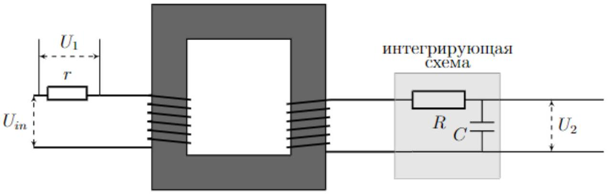

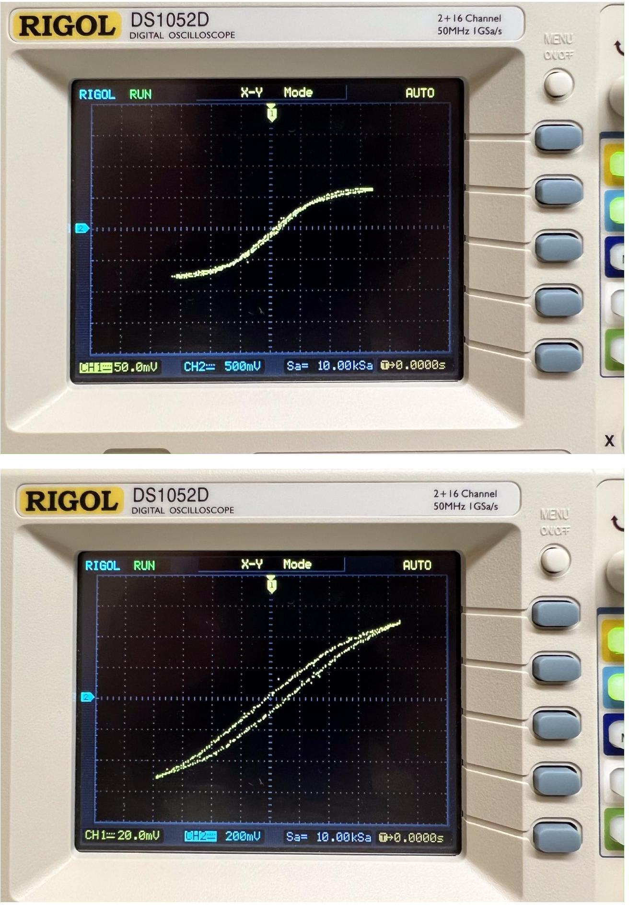

D3 ${ } ^ { 2.00 }$ Запишите $f _ { b }$ в лист ответов. При частоте $f _ { b }$ получите кривую намагничивания $B ( H )$, регулируя напряжение $U _ { i n }$, и постройте её.
$f _ { b } = ( 45 \pm 5 )$ Гц
Также из теоремы о циркуляции получим: $H ( t ) = \frac { N } { l } I ( t )$, где $l = ( 24 \pm 1 )$ см.
Измеренные и рассчитанные величины приведены в таблице ниже.

| $I _ { 1 }$, MA | $U _ { 2 } , \mathrm {~B}$ | $H , \mathrm {~A} / \mathrm { M }$ | $B$, мТл | $\mu _ { n }$ |
| :--- | :--- | :--- | :--- | :--- |
| 184 | 1.02 | 153 | 163 | 844 |
| 172 | 0.98 | 143 | 156 | 867 |
| 160 | 0.94 | 133 | 150 | 894 |
| 146 | 0.90 | 122 | 143 | 938 |
| 132 | 0.86 | 110 | 137 | 991 |
| 120 | 0.80 | 100 | 127 | 1010 |
| 108 | 0.74 | 90 | 118 | 1040 |
| 100 | 0.70 | 83 | 112 | 1070 |
| 94.0 | 0.66 | 78 | 105 | 1070 |
| 86.0 | 0.58 | 72 | 92.4 | 1030 |
| 74.4 | 0.52 | 62 | 82.9 | 1060 |
| 68.0 | 0.48 | 57 | 76.5 | 1070 |
| 61.6 | 0.43 | 51 | 68.8 | 1070 |
| 44.0 | 0.30 | 37 | 47.2 | 1020 |

| 35.2 | 0.23 | 29 | 37.0 | 1000 |
| :--- | :--- | :--- | :--- | :--- |
| 28.0 | 0.19 | 23 | 30.6 | 1040 |
| 17.4 | 0.09 | 15 | 15.0 | 822 |
| 9.0 | 0.05 | 8 | 7.3 | 778 |

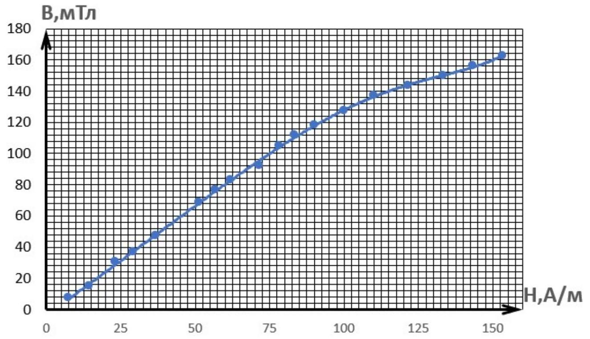

D4 ${ } ^ { 1.50 }$ Постройте график $\mu _ { n } ( H )$ для зависимости из прошлого пункта. Укажите характерные точки, если они есть.
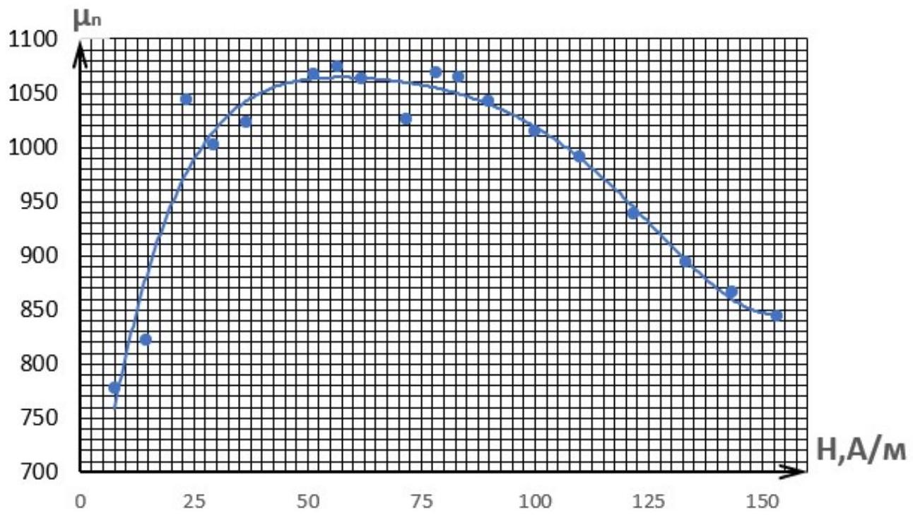

Ответ: У зависимости есть максимум $\mu _ { \max } = 1050 \pm 50$ при $H _ { \max } = 60 \pm 15 \mathrm {~A} / \mathrm { м }$.
