Соединим лампу и резистор 10м последовательно и подключим к источнику. Используем мультиметр в режиме вольтметра для измерения напряжения на лампе $U$ и напряжения на резисторе, значение которого можно пересчитать в ток $I$, текущий через лампу.

| $U , \mathrm {~B}$ | $I , A$ | $U , \mathrm {~B}$ | $I , A$ |
| :--- | :--- | :--- | :--- |
| 0,15 | 0,015 | 5,81 | 0,103 |
| 0,40 | 0,024 | 6,39 | 0,109 |
| 0,81 | 0,034 | 6,82 | 0,113 |
| 1,37 | 0,045 | 7,25 | 0,117 |
| 1,82 | 0,053 | 7,52 | 0,120 |
| 2,23 | 0,059 | 7,77 | 0,122 |
| 2,64 | 0,065 | 8,04 | 0,125 |
| 3,01 | 0,070 | 8,46 | 0,128 |
| 3,52 | 0,077 | 8,69 | 0,130 |
| 3,87 | 0,081 | 8,91 | 0,133 |
| 4,27 | 0,086 | 9,21 | 0,136 |
| 4,60 | 0,090 | 9,52 | 0,138 |
| 5,03 | 0,095 | 9,86 | 0,141 |
| 5,41 | 0,099 | 10,11 | 0,143 |

Ответ:

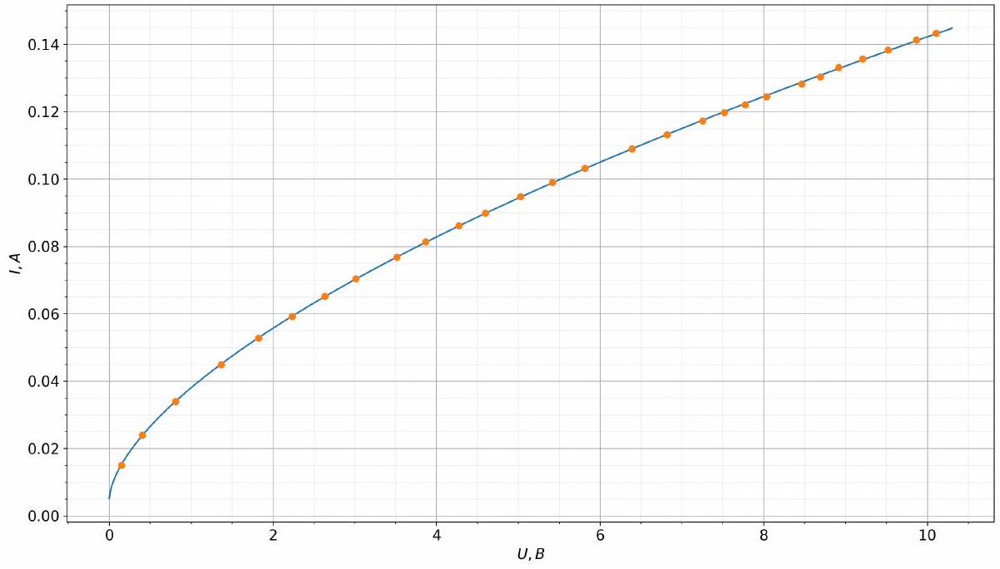
Рис. 1. ВАХ лампы

A2 ${ } ^ { 1.00 }$
В рамках предположений, сделанных в начале данной части, постройте линеаризованный график зависимости мощности, выделяемой на лампе, от её температуры. Сделайте выводы о корректности сделанных предположений.

Рассчитаем сопротивление $R$ лампы как отношение напряжения на ней и тока, текущего через неё. Полученные значения пересчитаем в температуру по следующей формуле:

$$
T = T _ { 0 } + \frac { R - R _ { 0 } } { \alpha R _ { 0 } } .
$$

Сопротивление лампы при комнатной температуре $R _ { 0 }$ измерим с помощью омметра.
Мощность, выделяющаяся на лампе $P = U \cdot I$ пропорциональна четвёртой степени температуры. Пересчитаем соответствующие значения и построим линеаризированный график $P \left( T ^ { 4 } \right)$ :

| $T , К$ | $T ^ { 4 } , \kappa ^ { 4 }$ | $P$, Вт | $T , К$ | $T ^ { 4 } , \kappa ^ { 4 }$ | $P$, Вт |
| :--- | :--- | :--- | :--- | :--- | :--- |
| 375 | 0,00 | 0,00 | 1760 | 0,96 | 0,60 |
| 586 | 0,01 | 0,01 | 1827 | 1,12 | 0,70 |
| 796 | 0,04 | 0,03 | 1875 | 1,23 | 0,77 |

| 988 | 0,10 | 0,06 | 1922 | 1,36 | 0,85 |
| :--- | :--- | :--- | :--- | :--- | :--- |
| 1113 | 0,15 | 0,10 | 1949 | 1,44 | 0,90 |
| 1205 | 0,21 | 0,13 | 1977 | 1,53 | 0,95 |
| 1287 | 0,27 | 0,17 | 2003 | 1,61 | 1,00 |
| 1357 | 0,34 | 0,21 | 2045 | 1,75 | 1,09 |
| 1445 | 0,44 | 0,27 | 2065 | 1,82 | 1,13 |
| 1498 | 0,50 | 0,31 | 2073 | 1,85 | 1,19 |
| 1559 | 0,59 | 0,37 | 2101 | 1,95 | 1,25 |
| 1603 | 0,66 | 0,41 | 2128 | 2,05 | 1,32 |
| 1661 | 0,76 | 0,48 | 2159 | 2,17 | 1,39 |
| 1710 | 0,86 | 0,54 | 2181 | 2,26 | 1,45 |

Ответ:

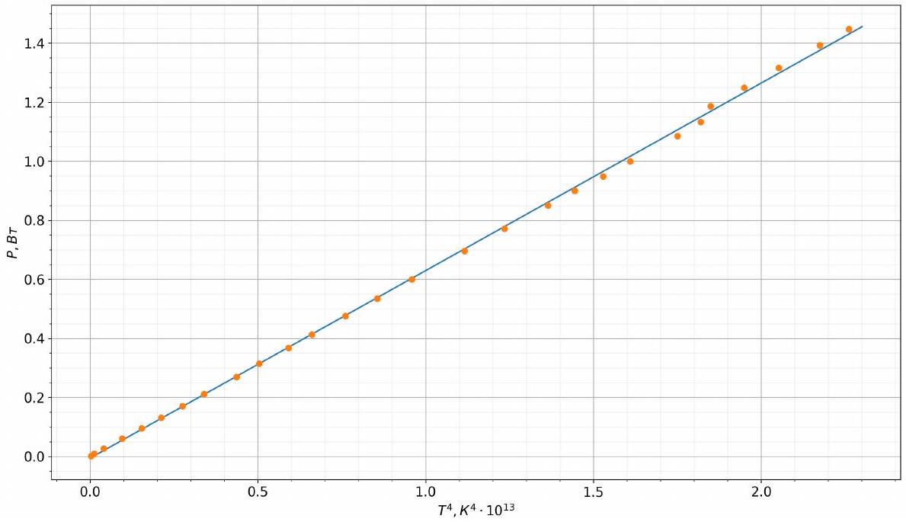
Рис. 2. График зависимости $P \left( T ^ { 4 } \right)$

Ответ: График хорошо описывается линейной функцией, а значит сделанные нами предположения верны.

А3 ${ } ^ { 0.50 }$ По графику определите поглощательную способность вольфрама $\varepsilon$, из которого изготовлена нить лампы. Вы можете считать, что нить лампы имеет круговое сечение, длина её светящейся части $L = ( 15.5 \pm 0.5 )$ мм, диаметр $d = ( 130 \pm 5 )$ мкм.

Используя метод наименьших квадратов, найдём угловой коэффициент графика:

$$
\frac { d P } { d ( T ) ^ { 4 } } = ( 0.64 \pm 0.02 ) \cdot 10 ^ { - 13 } \text { Вт } / К ^ { 4 }
$$

Можем записать:

$$
P = S \varepsilon \sigma T ^ { 4 } ,
$$

где $S$ - площадь поверхности нити, $S = \pi d L$.
Отсюда

$$
\varepsilon = \frac { d P } { d ( T ) ^ { 4 } } ( \pi d L \sigma ) ^ { - 1 }
$$

Численно получим:

$$
\varepsilon = ( 0.18 \pm 0.01 ) .
$$

Ответ:

$$
\varepsilon = ( 0.18 \pm 0.01 )
$$

Будем считать сопротивление нити $R = U / I$ и согласно формуле из условия пересчитывать в температуру нити $T$.

| $U , \mathrm {~B}$ | $T$, К | $U , \mathrm {~B}$ | $T$, К |
| :--- | :--- | :--- | :--- |
| 0,15 | 375 | 5,81 | 1760 |
| 0,40 | 586 | 6,39 | 1827 |
| 0,81 | 796 | 6,82 | 1875 |
| 1,37 | 988 | 7,25 | 1922 |
| 1,82 | 1113 | 7,52 | 1949 |
| 2,23 | 1205 | 7,77 | 1977 |
| 2,64 | 1287 | 8,04 | 2003 |
| 3,01 | 1357 | 8,46 | 2045 |
| 3,52 | 1445 | 8,69 | 2065 |
| 3,87 | 1498 | 8,91 | 2073 |
| 4,27 | 1559 | 9,21 | 2101 |
| 4,60 | 1603 | 9,52 | 2128 |
| 5,03 | 1661 | 9,86 | 2159 |
| 5,41 | 1710 | 10,11 | 2181 |

Ответ:

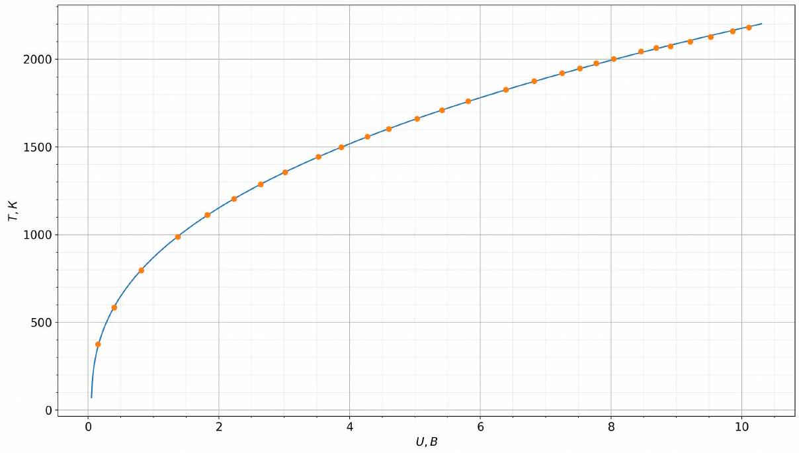
Рис. 3. График $T ( U )$

В $1 ^ { 3.60 }$ Снимите ВАХ фотодиода для трёх различных значений мощности излучения, попадающего на фотодиод, соответствующих в вашей конфигурации напряжениям на лампе 0 В, 5 В, 7 В (не менее 20 точек для каждого значения).
Сила тока через фотодиод в прямом направлении не должна превышать 1 мкА. В этом пункте не исследуйте напряжения на фотодиоде, меньшие -0.4 В.
Зарисуйте используемую схему измерений. Считайте известным сопротивление осциллографа $R _ { \text {osc } } = 1 \mathrm { MOm }$.
Примечание. Под напряжением на фотодиоде подразумевается напряжение только на нем, а не суммарное напряжение на нем и резисторе, соединенном с ним.

Последовательно подключим источник постоянного тока, фотодиод с резистором и осциллограф, параллельно источнику постоянного тока подключим вольтметр (рис. 4). Вместо вольтметра можно использовать второй канал осциллографа. С учётом равенства сопротивлений резистора и осциллографа для напряжения и силы тока фотодиода можем записать:

$$
\begin{gathered}
U _ { д } = U _ { V } - 2 U _ { o s c } ; \\
\qquad I _ { д } = \frac { U _ { o s c } } { R _ { o s c } }
\end{gathered}
$$

Расположим лампу и фотодиод как указано на рисунке. Снимем $U _ { V }$ и $U _ { \text {osc } }$ для требуемых значений напряжения на лампе, затем пересчитаем в $U _ { \text {д } } , I _ { \text {д } }$. После снятия точек в положительном направлении сменим полярность источника и переподключим осциллограф так, чтобы его земля и минус источника были соединены.

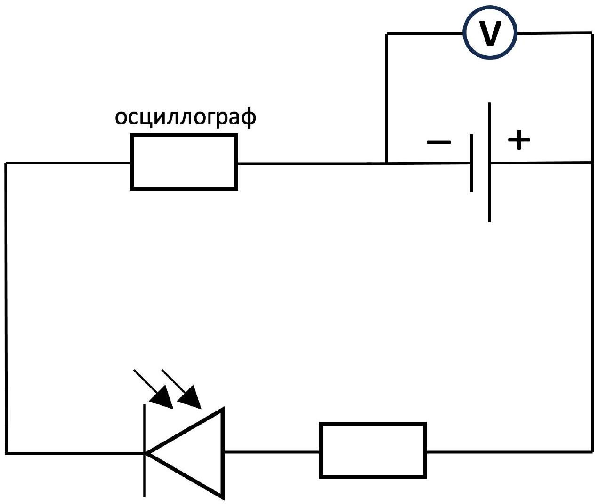
Рис. 4. Схема подключения

$U _ { л } = 0 \mathrm {~B}$

| $U , \mathrm {~B}$ | $I$, мкА | $U , \mathrm {~B}$ | $I$, мкА |
| :--- | :--- | :--- | :--- |
| 0.060 | -0.06 | 0.250 | 0.64 |
| 0.142 | -0.04 | 0.249 | 0.88 |
| 0.152 | -0.02 | 0.252 | 0.99 |
| 0.163 | -0.03 | 0.257 | 1.07 |
| 0.198 | 0.05 | -0.244 | -0.06 |
| 0.211 | 0.123 | -0.070 | -0.03 |
| 0.227 | 0.293 | -0.150 | -0.04 |
| 0.238 | 0.37 | 0.120 | -0.02 |
| 0.248 | 0.52 | 0.180 | 0.01 |
| 0.245 | 0.59 | 0.226 | 0.22 |

$U _ { л } = 5 \mathrm {~B}$

| $U , \mathrm {~B}$ | $I$, мкА | $U , \mathrm {~B}$ | $I$, мкА |
| :--- | :--- | :--- | :--- |
| 0.216 | -0.10 | 0.252 | 0.644 |
| 0.202 | -0.26 | 0.262 | 0.734 |
| 0.178 | -0.37 | 0.272 | 0.931 |
| 0.162 | -0.46 | 0.086 | -0.748 |
| 0.132 | -0.68 | 0.028 | -0.789 |
| 0.229 | 0.05 | -0.170 | -0.800 |
| 0.218 | 0.12 | -0.210 | -0.805 |
| 0.230 | 0.19 | -0.370 | -0.805 |
| 0.237 | 0.28 | -0.226 | -0.797 |
| 0.240 | 0.37 | -0.374 | -0.803 |

$U _ { л } = 7 \mathrm {~B}$

| $U , \mathrm {~B}$ | $I$, мкА | $U , \mathrm {~B}$ | $I$, мкА |
| :--- | :--- | :--- | :--- |
| 0.236 | -0.130 | 0.235 | -0.250 |

| 0.244 | -0.032 | 0.228 | -0.322 |
| :--- | :--- | :--- | :--- |
| 0.256 | -0.008 | 0.209 | -0.408 |
| 0.240 | 0.110 | 0.203 | -0.620 |
| 0.262 | 0.134 | 0.094 | -1.30 |
| 0.257 | 0.188 | 0.086 | -1.40 |
| 0.260 | 0.276 | 0.065 | -1.50 |
| 0.261 | 0.345 | 0.184 | -0.781 |
| 0.262 | 0.416 | 0.109 | -1.34 |
| 0.279 | 0.492 | 0.014 | -1.74 |
| 0.277 | 0.524 | 0.150 | -1.05 |
| 0.275 | 0.724 | -0.053 | -1.96 |
| 0.294 | 0.889 | -0.250 | -2.12 |
| 0.295 | 0.951 | -0.175 | -2.12 |
| 0.224 | -0.178 | -0.330 | -2.12 |
| 0.226 | -0.198 | -0.360 | -2.12 |

В2 ${ } ^ { 1.90 }$ Постройте графики полученных зависимостей на одном листе миллиметровки.

Ответ:

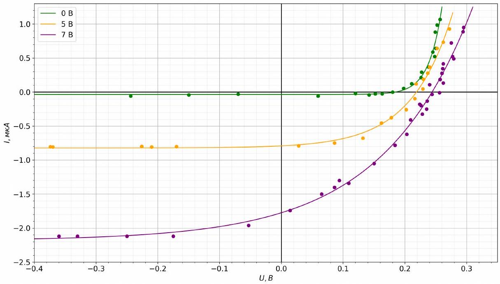
Рис. 5. ВАХ фотодиода для разных напряжений на лампе

Вз ${ } ^ { 0.20 }$ Сделайте вывод: при каких напряжениях на фотодиоде ( $U < 0$ либо $U > 0$ ) его можно применять для измерения мощности излучения, попадающего на него, почти независимо от поданного на него напряжения?

Из полученных графиков видно, что при отрицательных напряжениях значение тока, текущего через фотодиод, выходит на константу, зависящую только от мощности попадающего на него излучения. Поэтому этот участок ВАХа удобно использовать для определения мощности излучения.

Ответ:

$$
U < 0
$$

С1 ${ } ^ { 0.20 }$ Качественно объясните, почему полученные сигналы $V ( t )$ имеют частоту $2 f _ { 1 }$ и $f _ { 2 }$ соответственно.

Ответ: Температура нити лампы в установившемся режиме определяется мощностью, выделяемой на ней, мощность пропорциональна $U ^ { 2 } ( t )$. В случае синуса эта функция имеет частоту $2 f _ { 1 }$, в случае ступеней $- f _ { 2 }$.

Запишите уравнение, определяющее малое изменение температуры нити лампы $d T$ за малое время $d t$ в момент времени $t$, когда температура лампы равна $T$. В уравнении могут присутствовать $C ( T ) , R ( T ) , P ( T ) , U ( t )$.

Запишем уравнение теплового баланса.

Ответ:

$$
C ( T ) d T = \left( \frac { U ^ { 2 } ( t ) } { R ( T ) } - P ( T ) \right) d t
$$

с3 ${ } ^ { 0.30 }$ Выразите $P _ { 1 }$ через $\left\langle U ^ { 2 } ( t ) \right\rangle$ и $R _ { 1 }$, проинтегрировав уравнение пункта С2 по времени в пределах одного периода. Здесь за $\left\langle U ^ { 2 } ( t ) \right\rangle$ обозначено среднее за период значение функции $U ^ { 2 } ( t )$ :

$$
\left\langle U ^ { 2 } ( t ) \right\rangle = f \int _ { 0 } ^ { 1 / f } U ^ { 2 } ( t ) d t
$$

$$
\int _ { 0 } ^ { 1 / f } C _ { 1 } d T = 0 = \frac { 1 } { f } \left( \frac { \left\langle U ^ { 2 } ( t ) \right\rangle } { R _ { 1 } } - P _ { 1 } \right)
$$

Отсюда следует ответ.

Ответ:

$$
P _ { 1 } = \frac { \left\langle U ^ { 2 } ( t ) \right\rangle } { R _ { 1 } }
$$

с4 ${ } ^ { 0.30 }$ Получите зависимость $\Delta T ( t )$. Ответ выразите через $U ( t ) , \left\langle U ^ { 2 } ( t ) \right\rangle , R _ { 1 } , C _ { 1 }$. Ответ может содержать определённые интегралы.

Проинтегрируем выражение из С2, подставив $P _ { 1 }$ из СЗ.

Ответ:

$$
\Delta T ( t ) = \frac { 1 } { R _ { 1 } C _ { 1 } } \left( \int _ { 0 } ^ { t } U ^ { 2 } ( t ) d t - \left\langle U ^ { 2 } ( t ) \right\rangle \cdot t \right)
$$

С5 ${ } ^ { 0.10 }$ Выразите $\Delta V$ в произвольный момент времени через $\Delta T$ и $( d V / d T ) \left( T _ { 1 } \right)$.

Запишем выражение для $\Delta V$, учитывая малость колебаний напряжения.

Ответ:

$$
\Delta V = \Delta T \frac { d V } { d T }
$$

С6 ${ } ^ { 0.20 }$ Получите явное выражение для $V ( t )$. Считайте, что $V ( 0 ) = V _ { 1 }$. Ответ выразите через $U ( t ) , \left\langle U ^ { 2 } ( t ) \right\rangle , R _ { 1 } , C _ { 1 } , ( d V / d T ) \left( T _ { 1 } \right)$. Ответ может содержать определённые интегралы.

Из результатов пунктов С4, С5 получаем зависимость.

Ответ:

$$
V ( t ) = V _ { 1 } + \frac { ( d V / d T ) \left( T _ { 1 } \right) } { R _ { 1 } C _ { 1 } } \left( \int _ { 0 } ^ { t } U ^ { 2 } ( t ) d t - \left\langle U ^ { 2 } ( t ) \right\rangle \cdot t \right)
$$

с7 ${ } ^ { 1.00 }$ Получите зависимость $V ( t )$ в следующих случаях:

1. Синусоидальный сигнал: $U ( t ) = U _ { 0 } \sin ( 2 \pi f t )$
2. Ступенчатый сигнал:
$$
U ( t ) = \begin{cases} U _ { 1 } , & t \in \left[ \frac { N } { f } ; \frac { N } { f } + \frac { 1 } { 2 f } \right] , \\ U _ { 2 } , & t \in \left[ \frac { N } { f } + \frac { 1 } { 2 f } ; \frac { N + 1 } { f } \right] , \end{cases}
$$
где $N$ - целое число. Для определенности считайте $\left| U _ { 1 } \right| > \left| U _ { 2 } \right|$.

Представьте ответ в виде графика $V ( t )$, указав все его характерные параметры. Используйте $( d V / d T ) \left( T _ { 1 } \right) , R _ { 1 } , C _ { 1 } , f , U _ { 0 } , U _ { 1 } , U _ { 2 }$.
Для каждого из случаев выразите теплоёмкость нити лампы $C _ { 1 }$ через разность максимального и минимального напряжения на осциллографе $\Delta V = V _ { \text {max } } - V _ { \text {min } } , ( d V / d T ) \left( T _ { 1 } \right) , R _ { 1 } , f , U _ { 0 } , U _ { 1 } , U _ { 2 }$.

Если вам не удалось получить ответы в этом пункте, далее вы можете использовать выражения:

1. $C _ { 1 } = \frac { U _ { 0 } ^ { 2 } } { \pi f R _ { 1 } } \cdot \frac { ( d V / d T ) \left( T _ { 1 } \right) } { \Delta V }$
2. $C _ { 1 } = \frac { U _ { 1 } ^ { 2 } - U _ { 2 } ^ { 2 } } { f R _ { 1 } } \cdot \frac { ( d V / d T ) \left( T _ { 1 } \right) } { \Delta V }$

Если вы используете эти формулы, укажите это явно в вашем решении.

Для синусоидального напряжения на лампе:

$$
\begin{gathered}
\int _ { 0 } ^ { t } U ^ { 2 } ( t ) d t - \left\langle U ^ { 2 } ( t ) \right\rangle \cdot t = \int _ { 0 } ^ { t } U _ { 0 } ^ { 2 } \sin ^ { 2 } ( 2 \pi f t ) \cdot d t - \left\langle U _ { 0 } ^ { 2 } \sin ^ { 2 } ( 2 \pi f t ) \right\rangle \cdot t = \\
= U _ { 0 } ^ { 2 } \int _ { 0 } ^ { t } \frac { 1 - \cos ( 4 \pi f t ) } { 2 } d t - U _ { 0 } ^ { 2 } \frac { t } { 2 } = - \frac { U _ { 0 } ^ { 2 } } { 8 \pi f } \sin ( 4 \pi f t )
\end{gathered}
$$

С учётом этого напряжение $V$ будет зависеть от $t$ следующим образом:

$$
V ( t ) = V _ { 1 } - \frac { U _ { 0 } ^ { 2 } } { 8 \pi f R _ { 1 } } \frac { ( d V / d T ) \left( T _ { 1 } \right) } { C _ { 1 } } \sin ( 4 \pi f t ) .
$$

В таком случае связь между теплоёмкостью и разностью максимального и минимального напряжения следующая:

$$
C _ { 1 } = \frac { U _ { 0 } ^ { 2 } } { 4 \pi f R _ { 1 } } \cdot \frac { ( d V / d T ) \left( T _ { 1 } \right) } { \Delta V } .
$$

Для ступенчатого сигнала производная $d V / d t$ может принимать только два значения, одинаковых по модулю и разных по знаку. Это означает, что сигнал на осциллографе $V ( t )$ будет треугольным.

$$
d V / d t = \frac { ( d V / d T ) \left( T _ { 1 } \right) } { R _ { 1 } C _ { 1 } } \left( U _ { 1 } ^ { 2 } - \frac { U _ { 2 } ^ { 2 } + U _ { 1 } ^ { 2 } } { 2 } \right) = \frac { ( d V / d T ) \left( T _ { 1 } \right) } { R _ { 1 } C _ { 1 } } \frac { U _ { 1 } ^ { 2 } - U _ { 2 } ^ { 2 } } { 2 }
$$

Тогда за половину периода прирост составит

$$
\Delta V = \frac { U _ { 1 } ^ { 2 } - U _ { 2 } ^ { 2 } } { 4 f R _ { 1 } } \frac { ( d V / d T ) \left( T _ { 1 } \right) } { C _ { 1 } }
$$

Выразим теплоёмкость:

$$
C _ { 1 } = \frac { U _ { 1 } ^ { 2 } - U _ { 2 } ^ { 2 } } { 4 f R _ { 1 } } \cdot \frac { ( d V / d T ) \left( T _ { 1 } \right) } { \Delta V }
$$

Ответ:
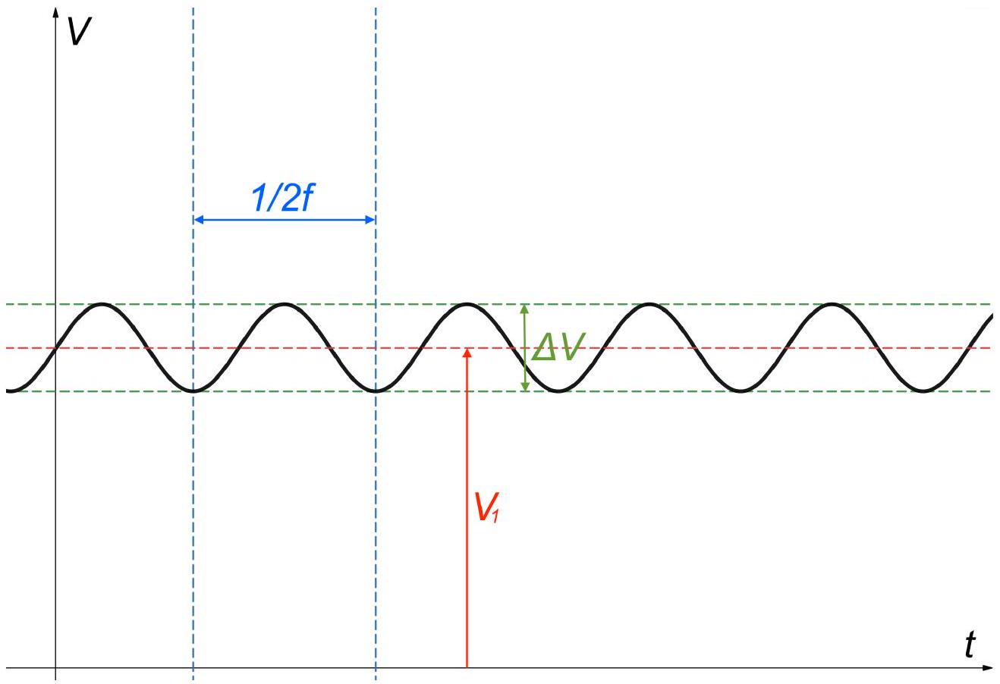

Ответ:
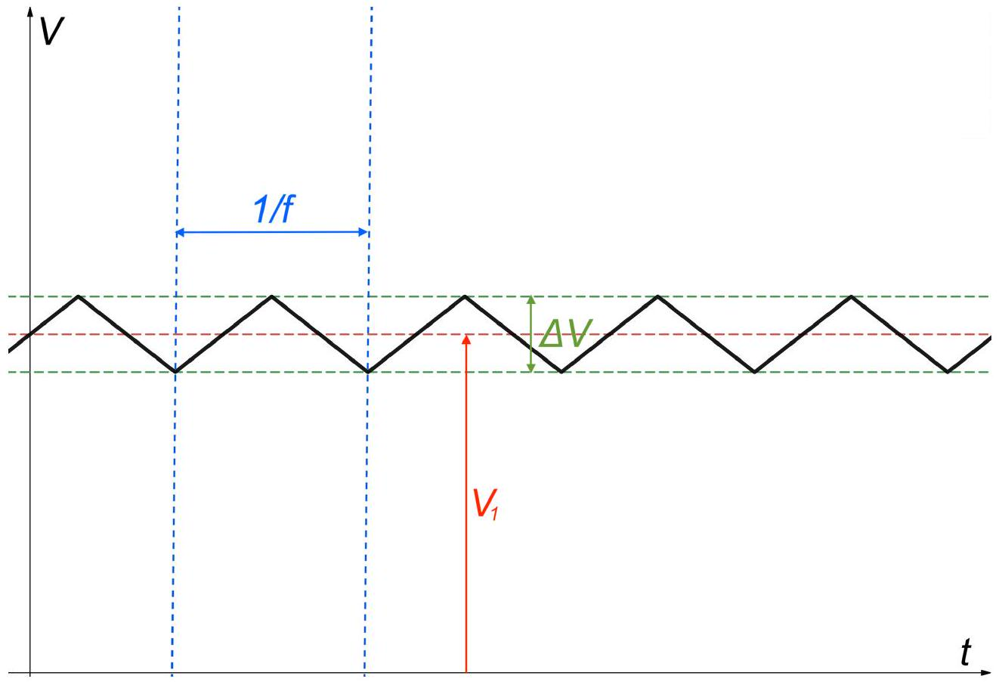

Ответ: Для синуса:

$$
C _ { 1 } = \frac { U _ { 0 } ^ { 2 } } { 4 \pi f R _ { 1 } } \cdot \frac { ( d V / d T ) \left( T _ { 1 } \right) } { \Delta V }
$$

Для ступеней:

$$
C _ { 1 } = \frac { U _ { 1 } ^ { 2 } - U _ { 2 } ^ { 2 } } { 4 f R _ { 1 } } \cdot \frac { ( d V / d T ) \left( T _ { 1 } \right) } { \Delta V }
$$

Снимите зависимость напряжения $V$ на осциллографе, соединенном с фотодиодом, от напряжения на лампе $U$ в диапазоне $\left[ 0 ; U _ { c } \right]$ (не менее 15 точек). Используя график пункта A4, пересчитайте $U$ в температуру нити лампы $T$. Точки полученной зависимости $V ( T )$ занесите в файл «V(T)_синус.txt» согласно инструкции по работе с программой. Температура $T$ должна быть в первом столбце, напряжение $V$ - во втором. После окончания тура в файле «V(T)_синус.txt» должны остаться данные, по которым вы строили график. Эти точки также должны присутствовать в листе ответов.

Расположим фотодиод и лампу согласно условию и снимем необходимые данные. Затем введём данные в программу и построим график.

| $V , \mathrm {~B}$ | $U , \mathrm {~B}$ | $T$, К | $V , \mathrm {~B}$ | $U , \mathrm {~B}$ | $T$, К |
| :--- | :--- | :--- | :--- | :--- | :--- |
| 0.04 | 1.09 | 903 | 2.83 | 3.20 | 1390 |
| 0.07 | 1.33 | 977 | 3.40 | 3.41 | 1425 |
| 0.29 | 1.58 | 1049 | 3.99 | 3.62 | 1459 |
| 0.54 | 1.87 | 1123 | 4.62 | 3.79 | 1485 |
| 0.87 | 2.20 | 1197 | 5.17 | 3.98 | 1515 |
| 1.27 | 2.41 | 1241 | 5.57 | 4.08 | 1530 |
| 1.75 | 2.67 | 1293 | 6.37 | 4.27 | 1558 |
| 2.39 | 3.00 | 1355 | 7.04 | 4.49 | 1589 |

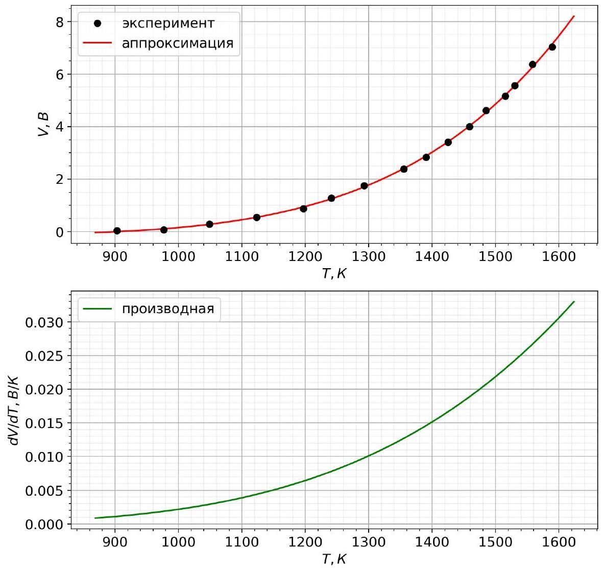

с9 ${ } ^ { 1.70 }$ Изменяя амплитуду напряжения на лампе, для каждого значения амплитуды запишите значения среднего напряжения осциллографа $V _ { 1 }$ и разности $\Delta V = V _ { \text {max } } - V _ { \text {min } }$. По зависимости $V ( T )$ пересчитайте $V _ { 1 }$ в температуру лампы. Получите зависимость теплоёмкости лампы от температуры в максимально возможном диапазоне температур (не менее 10 точек).

Снимем данные, пересчитаем необходимые величины, получив зависимость $C ( T )$.

| $V _ { 1 } , \mathrm {~B}$ | $\Delta V , \mathrm { mB }$ | $U _ { 0 } , \mathrm {~B}$ | $T$, К | $R$, Ом | $d V / d T , \mathrm { mB } / К$ | $C$, мкДж/К |
| :--- | :--- | :--- | :--- | :--- | :--- | :--- |
| 6,39 | 1149 | 6,10 | 1563 | 49,0 | 27 | 71,0 |
| 4,84 | 670 | 5,10 | 1495 | 46,5 | 22 | 72,3 |
| 2,60 | 335 | 4,20 | 1366 | 42,3 | 14 | 66,9 |
| 3,45 | 466 | 4,64 | 1423 | 44,2 | 17 | 69,8 |
| 2,76 | 346 | 4,32 | 1378 | 42,7 | 14 | 71,2 |
| 1,67 | 197 | 3,76 | 1285 | 39,6 | 10 | 69,5 |
| 0,99 | 105 | 3,32 | 1201 | 36,8 | 7 | 74,7 |
| 0,70 | 68 | 2,96 | 1152 | 35,2 | 5 | 76,0 |
| 0,26 | 27 | 2,32 | 1035 | 31,3 | 3 | 69,3 |
| 0,38 | 35 | 2,56 | 1077 | 32,7 | 3 | 79,4 |

С10 ${ } ^ { 0.90 }$ Снимите зависимость напряжения $V$ на осциллографе, соединенном с фотодиодом, от напряжения на лампе $U$ в диапазоне $\left[ 0 ; U _ { c } \right]$ (не менее 15 точек). Используя график пункта A4, пересчитайте $U$ в температуру нити лампы $T$. Точки полученной зависимости $V ( T )$ занесите в файл «V(T)_cтупени.txt» согласно инструкции по работе с программой. Температура $T$ должна быть в первом столбце, напряжение $V$ - во втором. После окончания тура в файле «V(T)_ступени.txt» должны остаться данные, по которым вы строили график. Эти точки также должны присутствовать в листе ответов.

Аналогично С8 снимем и обработаем данные.

| $V , \mathrm {~B}$ | $U , \mathrm {~B}$ | $T , К$ | $V , \mathrm {~B}$ | $U , \mathrm {~B}$ | $T$, К |
| :--- | :--- | :--- | :--- | :--- | :--- |
| 0.01 | 1.16 | 909 | 2.96 | 3.23 | 1396 |
| 0.11 | 1.38 | 983 | 3.52 | 3.48 | 1431 |
| 0.29 | 1.63 | 1055 | 4.14 | 3.66 | 1465 |
| 0.57 | 1.91 | 1129 | 4.66 | 3.88 | 1491 |
| 0.98 | 2.26 | 1203 | 5.33 | 4.06 | 1521 |
| 1.30 | 2.45 | 1247 | 5.70 | 4.18 | 1536 |

| 1.76 | 2.70 | 1299 | 6.42 | 4.36 | 1564 |
| :--- | :--- | :--- | :--- | :--- | :--- |
| 2.48 | 3.04 | 1361 | 7.31 | 4.56 | 1595 |

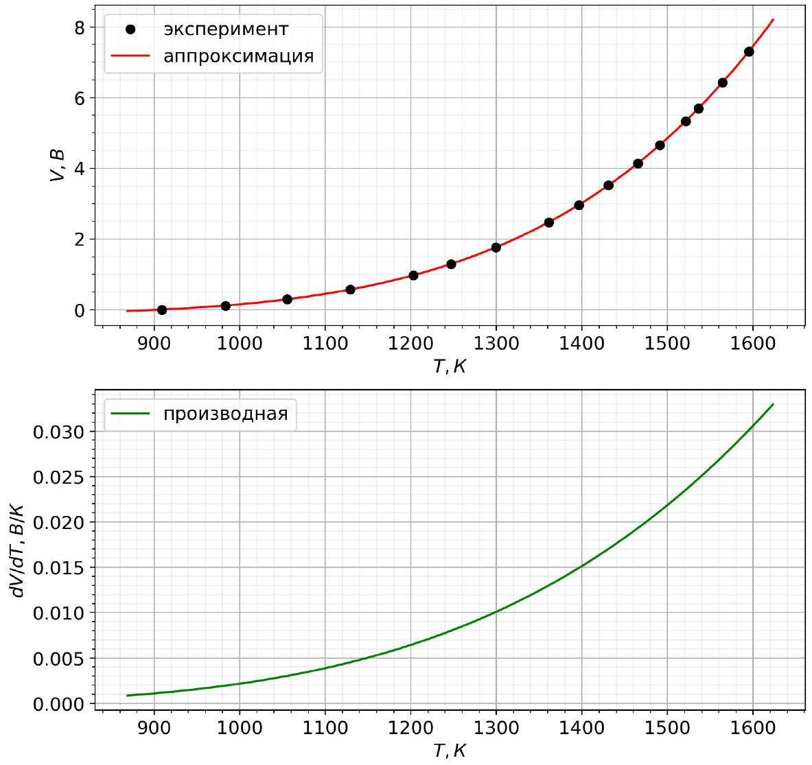

С11 ${ } ^ { 1.70 }$ Изменяя амплитуду напряжения на лампе, для каждой пары амплитуды и сдвига запишите значения $V _ { 1 }$ и $\Delta V = V _ { \text {max } } - V _ { \text {min } }$. По зависимости $V ( T )$ пересчитайте $V _ { 1 }$ в температуру лампы. Получите зависимость теплоёмкости лампы от температуры в максимально возможном диапазоне температур (не менее 10 точек).

Аналогично С9 снимем и обработаем данные.

| $V _ { 1 } , \mathrm {~B}$ | $\Delta V , \mathrm { mB }$ | $U _ { 1 } , \mathrm {~B}$ | $U _ { 2 } , \mathrm {~B}$ | $T$, К | $R _ { 1 } , 0 \mathrm {~m}$ | $d V / d T , \mathrm { mB } / \kappa$ | $C$, мкДж/К |
| :--- | :--- | :--- | :--- | :--- | :--- | :--- | :--- |
| 6,03 | 871 | 4,96 | 2,40 | 1545 | 48,2 | 26 | 72,9 |
| 5,78 | 804 | 4,96 | 1,92 | 1535 | 47,9 | 25 | 85,3 |
| 5,31 | 1072 | 5,20 | 0,64 | 1516 | 47,2 | 24 | 77,3 |
| 5,11 | 871 | 4,88 | 1,76 | 1507 | 46,9 | 23 | 72,2 |
| 4,83 | 1032 | 4,96 | 0,72 | 1495 | 46,5 | 22 | 68,4 |
| 4,36 | 898 | 4,88 | 0,56 | 1472 | 45,8 | 20 | 71,9 |
| 3,55 | 683 | 4,56 | 0,64 | 1429 | 44,4 | 17 | 72,2 |
| 3,03 | 563 | 4,32 | 0,32 | 1396 | 43,3 | 15 | 72,3 |
| 2,36 | 410 | 4,00 | 0,16 | 1348 | 41,7 | 13 | 73,3 |
| 1,65 | 288 | 3,76 | 0,16 | 1284 | 39,5 | 10 | 74,1 |

С12 ${ } ^ { 2.40 }$ Постройте графики зависимостей $C ( T )$, полученных в С9, С11. Рассчитайте $d C / d T$ по обоим графикам, аппроксимировав зависимость прямой.

Ответ:

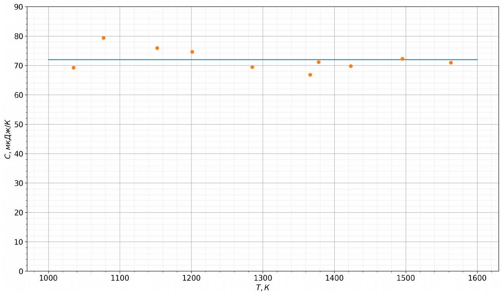
Рис. 6. $C ( T )$ для синусоидального сигнала

Ответ:

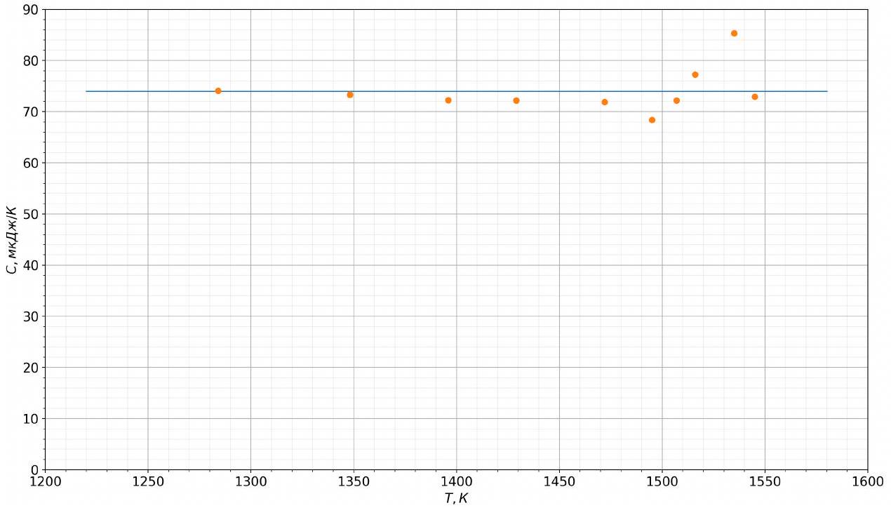
Рис. 7. $C ( T )$ для ступенчатого сигнала

По обоим графикам получаем $\frac { d C } { d T } \approx 0$, что говорит о том, что в рассматриваемом диапазоне температур теплоемкость меняется очень незначительно. Согласно табличным данным относительное изменение теплоемкости вольфрама в диапазоне температур $[ 1000 ; 1600 ]$ К составляет $\sim 1 \%$.

Ответ:

$$
\frac { d C } { d T } \approx 0
$$
