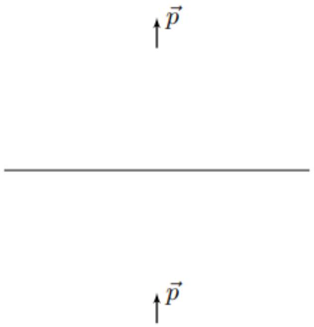
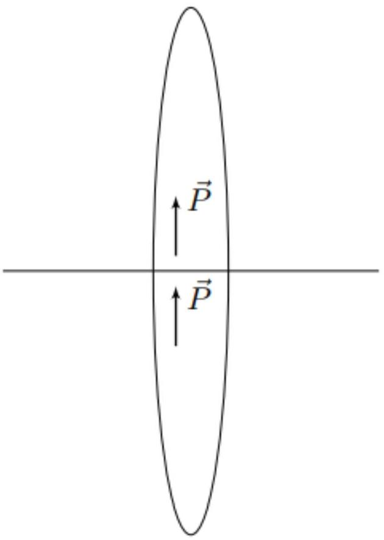

А1 ${ } ^ { 0.80 }$ Пусть проводящий шар радиусом $R$, несущий заряд $Q$, помещён в однородное электростатическое поле напряжённостью $\vec { E } _ { 0 }$. Определите полную напряжённость $\vec { E }$ электрического поля в точке с радиус-вектором $\vec { r }$ относительно центра шара, находящейся вне шара. Ответ выразите через $Q , \vec { E } _ { 0 } , R , \varepsilon _ { 0 }$ и $\vec { r }$.

Рассмотрим для начала незаряженный шар, помещённый в однородное поле напряжённостью $\vec { E } _ { 0 }$. Внутри шара напряжённость электрического поля равняется нулю, а снаружи представляет собой суперпозицию электрического поля с напряжённостью $\vec { E } _ { 0 }$ и поля электрического диполя с дипольным моментом $\vec { p }$ в его центре:

$$
\vec { E } = \vec { E } _ { 0 } + \frac { 1 } { 4 \pi \varepsilon _ { 0 } } \left( \frac { 3 ( \vec { p } \cdot \vec { r } ) \vec { r } } { r ^ { 5 } } - \frac { \vec { p } } { r ^ { 3 } } \right) .
$$

Величину дипольного момента можно определить из условия равенства нулю тангенциальной компоненты напряжённости электрического поля в любой точке поверхности шара:

$$
[ \vec { E } \times \vec { r } ] = 0 \Rightarrow \vec { p } = 4 \pi \varepsilon _ { 0 } R ^ { 3 } \vec { E } _ { 0 }
$$

Таким образом, в данной конструкции:

$$
\vec { E } = \vec { E } _ { 0 } \left( 1 - \frac { R ^ { 3 } } { r ^ { 3 } } \right) + \frac { 3 \left( \vec { E } _ { 0 } \cdot \vec { r } \right) \vec { r } } { r ^ { 2 } } \frac { R ^ { 3 } } { r ^ { 3 } } .
$$

Если шар несёт заряд $Q$, если к найденному выше распределению добавить распределение этого заряда $Q$ равномерно по поверхности, то электрическое поле внутри шара останется равным нулю, как и его тангенциальная компонента на поверхности шара.
Прибавляя электрическое поле равномерно заряженного по поверхности шара, получим:

Ответ:

$$
\vec { E } = \vec { E } _ { 0 } \left( 1 - \frac { R ^ { 3 } } { r ^ { 3 } } \right) + \frac { 3 \left( \vec { E } _ { 0 } \cdot \vec { r } \right) \vec { r } } { r ^ { 2 } } \frac { R ^ { 3 } } { r ^ { 3 } } + \frac { Q \vec { r } } { 4 \pi \varepsilon _ { 0 } r ^ { 3 } } .
$$

А2 ${ } ^ { 0.40 }$ Пусть $\theta$ - угол между направлением вектора электростатического поля $\vec { E } _ { 0 }$ и радиус-вектором $\vec { r }$ некоторой точки поверхности шара относительно его центра.
Определите проекцию напряжённости электрического поля $E _ { n } ( \theta )$ на направление нормали. Ответ выразите через $Q , E _ { 0 } , R , \varepsilon _ { 0 }$ и $\theta$.

При $R = r$ получим:

$$
\vec { E } = \frac { Q \vec { r } } { 4 \pi \varepsilon _ { 0 } R ^ { 3 } } + \frac { 3 \left( \vec { E } _ { 0 } \cdot \vec { r } \right) \vec { r } } { R ^ { 2 } } .
$$

Проецируя на направление вектора нормали, получим:

Ответ:

$$
E _ { n } = \frac { Q } { 4 \pi \varepsilon _ { 0 } R ^ { 2 } } + 3 E _ { 0 } \cos \theta
$$

А3 ${ } ^ { 0.20 }$ При каких значениях заряда $Q$ шара величина $E _ { n }$ может обращаться в ноль? Ответ выразите через $E _ { 0 } , \varepsilon _ { 0 }$ и $R$.
Далее во всех пунктах считайте, что заряд шара $Q$ попадает в найденный вами диапазон.

Условие равенства нулю компоненты электростатического поля $E _ { n }$ можно записать в виде:

$$
Q = - 12 \pi \varepsilon _ { 0 } R ^ { 2 } E _ { 0 } \cos \theta .
$$

Поскольку $\cos \theta \in [ - 1 ; 1 ]$, имеем:

Ответ:

$$
Q \in \left[ - 12 \pi R ^ { 2 } \varepsilon _ { 0 } E _ { 0 } ; 12 \pi R ^ { 2 } \varepsilon _ { 0 } E _ { 0 } \right] .
$$

А4 ${ } ^ { 0.50 }$ Пусть заряд шара равен $Q$. При каком значении угла $\theta _ { 0 }$ компонента напряжённости $E _ { n } \left( \theta _ { 0 } \right)$ обращается в ноль? Ответ выразите через $Q , E _ { 0 } , \varepsilon _ { 0 }$ и $R$. Определите также, при каких значениях угла $\theta$ на поверхность шара попадают отрицательные ионы, а при каких - положительные. Ответы выразите через $\theta _ { 0 }$.

Величина $E _ { n }$ обращается в ноль при угле $\theta _ { 0 }$, равном:

Ответ:

$$
\theta _ { 0 } = \arccos \left( - \frac { Q } { 12 \pi R ^ { 2 } \varepsilon _ { 0 } E _ { 0 } } \right) .
$$

Положительные ионы попадают на поверхность шара при $E _ { n } < 0$, а отрицательные - при $E _ { n } > 0$. Таким образом:

Ответ: Отрицательные ионы попадают на поверхность шара при $\theta \in \left[ 0 , \theta _ { 0 } \right]$;
Положительные ионы попадают на поверхность шара при $\theta \in \left[ \theta _ { 0 } , \pi \right]$.

А5 ${ } ^ { 1.00 }$ Определите полную производную по времени заряда шара $d Q / d t$. Ответ выразите через $Q , E _ { 0 } , \varepsilon _ { 0 } , R , \sigma _ { + } , \sigma _ { - }$и, если понадобится, $\theta _ { 0 }$.

С учётом определённых в предыдущем пункте областей, величина $d Q / d t$ определяется выражением:

$$
\frac { d Q } { d t } = \frac { d Q _ { - } } { d t } + \frac { d Q _ { + } } { d t } ,
$$

где $d Q _ { + } / d t$ и $d Q _ { - } / d t$ обозначают силы тока, текущего на поверхность шара со стороны положительных и отрицательных ионов соответственно. Для $d Q _ { + } / d t$ и $d Q _ { - } / d t$ имеем:

$$
\frac { d Q _ { - } } { d t } = - \sigma _ { - } \int _ { 0 } ^ { \theta _ { 0 } } E _ { n } ( \theta ) \cdot 2 \pi R ^ { 2 } \sin \theta d \theta \quad \frac { d Q _ { + } } { d t } = - \sigma _ { + } \int _ { \theta _ { 0 } } ^ { \pi } E _ { n } ( \theta ) \cdot 2 \pi R ^ { 2 } \sin \theta d \theta
$$

Определим $d Q _ { - } / d t$ :

$$
\frac { d Q _ { - } } { d t } = - \sigma _ { - } \int _ { 0 } ^ { \theta _ { 0 } } E _ { n } ( \theta ) \cdot 2 \pi R ^ { 2 } \sin \theta d \theta = - \sigma _ { - } \int _ { 0 } ^ { \theta _ { 0 } } \left( \frac { Q } { 2 \varepsilon _ { 0 } } + 6 \pi R ^ { 2 } R _ { 0 } \cos \theta \right) \sin \theta d \theta
$$

или же:

$$
\frac { d Q _ { - } } { d t } = - \sigma _ { - } \left( \frac { Q \left( 1 - \cos \theta _ { 0 } \right) } { 2 \varepsilon _ { 0 } } + 3 \pi R ^ { 2 } E _ { 0 } \sin ^ { 2 } \theta _ { 0 } \right) .
$$

Аналогично для $d Q _ { + } / d t$ :

$$
\frac { d Q _ { + } } { d t } = - \sigma _ { + } \int _ { \theta _ { 0 } } ^ { \pi } E _ { n } ( \theta ) \cdot 2 \pi R ^ { 2 } \sin \theta d \theta = - \sigma _ { + } \int _ { \theta _ { 0 } } ^ { \pi } \left( \frac { Q } { 2 \varepsilon _ { 0 } } + 6 \pi R ^ { 2 } E _ { 0 } \cos \theta \right) \sin \theta d \theta
$$

или же:

$$
\frac { d Q _ { + } } { d t } = - \sigma _ { + } \left( \frac { Q \left( 1 + \cos \theta _ { 0 } \right) } { 2 \varepsilon _ { 0 } } - 3 \pi R ^ { 2 } E _ { 0 } \sin ^ { 2 } \theta _ { 0 } \right) .
$$

Складывая, находим:

Ответ:

$$
\frac { d Q } { d t } = - \frac { Q \left( \sigma _ { + } + \sigma _ { - } \right) } { 2 \varepsilon _ { 0 } } + \left( \sigma _ { + } - \sigma _ { - } \right) \left( 3 \pi R ^ { 2 } E _ { 0 } \sin ^ { 2 } \theta _ { 0 } - \frac { Q \cos \theta _ { 0 } } { 2 \varepsilon _ { 0 } } \right) .
$$

А6 ${ } ^ { 0.80 }$ Определите стационарный заряд шара $Q _ { 0 }$, при котором он остаётся постоянным во времени. Ответ выразите через $E _ { 0 } , \varepsilon _ { 0 } , R , \sigma _ { + }$и $\sigma _ { - }$.

В стационарном режиме $d Q / d t = 0$, откуда имеем:

$$
- \frac { Q _ { 0 } \left( \sigma _ { + } + \sigma _ { - } \right) } { 2 \varepsilon _ { 0 } } + \left( \sigma _ { + } - \sigma _ { - } \right) \left( 3 \pi R ^ { 2 } E _ { 0 } \sin ^ { 2 } \theta _ { 0 } - \frac { Q _ { 0 } \cos \theta _ { 0 } } { 2 \varepsilon _ { 0 } } \right) = 0 .
$$

Подставляя $\theta _ { 0 }$, получим:

$$
- \frac { Q _ { 0 } \left( \sigma _ { + } + \sigma _ { - } \right) } { 2 \varepsilon _ { 0 } } + \left( \sigma _ { + } - \sigma _ { - } \right) \left( 3 \pi R ^ { 2 } E _ { 0 } - \frac { Q _ { 0 } ^ { 2 } } { 48 \pi \varepsilon _ { 0 } ^ { 2 } R ^ { 2 } E _ { 0 } } + \frac { Q _ { 0 } ^ { 2 } } { 24 \pi \varepsilon _ { 0 } ^ { 2 } R ^ { 2 } E _ { 0 } } \right) = 0 ,
$$

или же:

$$
Q _ { 0 } ^ { 2 } - Q _ { 0 } \frac { 24 \pi R ^ { 2 } \varepsilon _ { 0 } E _ { 0 } \left( \sigma _ { + } + \sigma _ { - } \right) } { \left( \sigma _ { + } - \sigma _ { - } \right) } + 144 \pi ^ { 2 } R ^ { 4 } \varepsilon _ { 0 } ^ { 2 } E _ { 0 } ^ { 2 } = 0 .
$$

Для корней квадратного уравнения имеем:

$$
Q _ { 0 } = \frac { 12 \pi R ^ { 2 } \varepsilon _ { 0 } E _ { 0 } } { \sigma _ { + } - \sigma _ { - } } \left( \sigma _ { + } + \sigma _ { - } \pm \sqrt { \left( \sigma _ { + } + \sigma _ { - } \right) ^ { 2 } - \left( \sigma _ { + } - \sigma _ { - } \right) ^ { 2 } } \right)
$$

или же:

$$
Q _ { 0 } = \frac { 12 \pi R ^ { 2 } \varepsilon _ { 0 } E _ { 0 } \left( \sqrt { \sigma _ { + } } \pm \sqrt { \sigma _ { - } } \right) ^ { 2 } } { \sigma _ { + } - \sigma - } = 12 \pi R ^ { 2 } \varepsilon _ { 0 } E _ { 0 } \left( \frac { \sqrt { \sigma _ { + } } + \sqrt { \sigma _ { - } } } { \sqrt { \sigma _ { + } } - \sqrt { \sigma _ { - } } } \right) ^ { \pm 1 } .
$$

Учитывая, что $Q < 12 \pi R ^ { 2 } \varepsilon _ { 0 } E _ { 0 }$, выбираем корень со знаком минус:

Ответ:

$$
Q _ { 0 } = 12 \pi R ^ { 2 } \varepsilon _ { 0 } E _ { 0 } \left( \frac { \sqrt { \sigma _ { + } } - \sqrt { \sigma _ { - } } } { \sqrt { \sigma _ { + } } + \sqrt { \sigma _ { - } } } \right)
$$

А7 ${ } ^ { 0.60 }$ При малых значениях $\Delta Q$ зависимость $\dot { Q } ( \Delta Q )$ можно представить в виде:

$$
\dot { Q } \approx A \Delta Q .
$$

Выразите $A$ через $\sigma _ { + } , \sigma _ { - }$и $\varepsilon _ { 0 }$.
Является ли найденное значение заряда $Q _ { 0 }$ устойчивым? Ответ обоснуйте.

Выражение для $\dot { Q }$ можно записать в следующей форме:

$$
\dot { Q } = a Q ^ { 2 } - b Q + c .
$$

Раскладывая вблизи значения $Q = Q _ { 0 }$, получим:

$$
\dot { Q } = a \left( Q _ { 0 } + \Delta Q \right) ^ { 2 } - b \left( Q _ { 0 } + \Delta Q \right) + c \approx - \left( b - 2 a Q _ { 0 } \right) \Delta Q .
$$

Подставим $a , b$ и $Q _ { 0 }$ :

$$
\dot { Q } \approx - \left( \frac { \sigma _ { + } + \sigma _ { - } } { 2 \varepsilon _ { 0 } } - \frac { \left( \sigma _ { + } - \sigma _ { - } \right) Q _ { 0 } } { 24 \pi R ^ { 2 } \varepsilon _ { 0 } ^ { 2 } E _ { 0 } } \right) \Delta Q ,
$$

или же:

$$
\dot { Q } = - \frac { 1 } { 2 \varepsilon _ { 0 } } \left( \sigma _ { + } + \sigma _ { - } - \left( \sqrt { \sigma _ { + } } - \sqrt { \sigma _ { - } } \right) ^ { 2 } \right) \Delta Q = - \frac { \sqrt { \sigma _ { + } \sigma _ { - } } } { \varepsilon _ { 0 } } \Delta Q .
$$

Таким образом:

Ответ:

$$
A = - \frac { \sqrt { \sigma _ { + } \sigma _ { - } } } { \varepsilon _ { 0 } } .
$$

Поскольку $A < 0$ :

Ответ: Значение заряда $Q _ { 0 }$ является устойчивым.

А8 ${ } ^ { 0.30 }$ Получите зависимость отклонения заряда шара $\Delta Q$ от времени $t$. Ответ выразите через $\Delta Q _ { 0 } , \varepsilon _ { 0 } , \sigma _ { + } , \sigma _ { - }$и $t$. Покажите также, что вид временной зависимости определяется только произведением $\sigma _ { + } \sigma _ { - }$.

Для нахождения зависимости $\Delta Q ( t )$ разделим переменные:

$$
\frac { d Q } { \Delta Q } = - \frac { \sqrt { \sigma _ { + } \sigma _ { - } } d t } { \varepsilon _ { 0 } } .
$$

Интегрируя, находим:

Ответ:

$$
\Delta Q ( t ) = \Delta Q _ { 0 } \exp \left( - \frac { \sqrt { \sigma _ { + } \sigma _ { - } } t } { \varepsilon _ { 0 } } \right) .
$$

В1 ${ } ^ { 0.50 }$ Определите вектор $\vec { E }$ напряжённости электростатического поля в области пересечения изолированных эллипсоидов. Ответ выразите через $\rho \vec { l } , \varepsilon _ { 0 }$ и A.

Координата $z _ { + }$относительно центра положительно заряженного эллипсоида равна $z - l$, а координаты $y _ { + }$и $z _ { + }$равны координатам $y$ и $z$ соответственно. Отсюда:

$$
\vec { E } = \frac { \rho } { \varepsilon _ { 0 } } \left( A \left( z _ { + } - z \right) \vec { e } _ { z } + B \left( y _ { + } - y \right) \vec { e } _ { y } + B \left( x _ { + } - x \right) \vec { e } _ { x } \right) .
$$

Подставляя соотношения между координатами, получим:

$$
\vec { E } = - \frac { \rho A l \vec { e } _ { z } } { \varepsilon _ { 0 } } ,
$$

или же:

Ответ:

$$
\vec { E } = - \frac { \rho A \vec { l } } { \varepsilon _ { 0 } } .
$$

В2 ${ } ^ { 0.30 }$ Рассмотрим изолированный равномерно поляризованный вдоль оси $z$ эллипсоид.
Пусть напряжённость электростатического поля внутри эллипсоида равняется $\vec { E }$. Определите вектор поляризации эллипсоида $\vec { P }$. Ответ выразите через $\vec { E }$, $\varepsilon _ { 0 }$ и A.

В предельном переходе величина $\rho \vec { l }$ по определению представляет собой вектор поляризации $\vec { P }$. Таким образом:

$$
\vec { E } = - \frac { A \vec { P } } { \varepsilon _ { 0 } } .
$$

Таким образом:

Ответ:

$$
\vec { P } = - \frac { \varepsilon _ { 0 } \vec { E } } { A } .
$$

Вз ${ } ^ { 0.30 }$ Определите вектор поляризации $\vec { P }$ эллипсоида. Ответ выразите через $\vec { E } _ { 0 } , \varepsilon _ { 0 }$ и $A$.
Определите также максимальную величину поверхностной плотности заряда $\sigma _ { \max }$ на поверхности эллипсоида. Ответ выразите через $P$.

При помещении проводящего эллипсоида в однородное электрическое поле, внутри эллипсоида напряжённость электрического поля должна оказаться равной нулю. Это реализуется, если напряжённость собственного электрического поля эллипсоида $\vec { E } = - \vec { E } _ { 0 }$, при этом все граничные условия автоматически будут выполнены.
Таким образом:

Ответ:

$$
\vec { P } = \frac { \varepsilon _ { 0 } \vec { E } _ { 0 } } { A } .
$$

Величина поверхностной плотности заряда $\sigma$ определяется выражением:

$$
\sigma = \vec { P } \cdot \vec { n } ,
$$

где $\vec { n }$ - вектор нормали к поверхности проводника, направленный наружу.
Максимальное значение достигается, его вектор поляризации оказывается направлен вдоль вектора нормали, т.е в вершине эллипсоида.
Таким образом:

Ответ:

$$
\sigma _ { \max } = P .
$$

В4 ${ } ^ { 0.40 }$ Выразите полную компоненту напряжённости электростатического поля $E _ { n }$ на поверхности проводника через поверхностную плотность заряда $\sigma$ и $\varepsilon _ { 0 }$.
Определите максимальную величину напряжённости $E _ { \text {max } }$ электростатического поля на поверхности эллипсоида. Ответ выразите через $E _ { 0 }$ и $A$.

Воспользуемся теоремой Гаусса для напряжённости электростатического поля. Выберем в качестве Гауссовой поверхности цилиндрическую, основания которой параллельны поверхности проводника. Основания расположены бесконечно близко к поверхности проводника, при этом одно из них расположено внутри проводника, а другое - снаружи.
Получим:

$$
\oint _ { S } \vec { E } \cdot d \vec { S } = \left( \vec { E } _ { n } - 0 \right) d S = \frac { q } { \varepsilon _ { 0 } } = \frac { \sigma d S } { \varepsilon _ { 0 } } \Rightarrow E _ { n } = \frac { \sigma } { \varepsilon _ { 0 } } .
$$

Таким образом, величина электрического поля на поверхности проводника прямо пропорциональна величине поверхностной плотности зарядов, и, соответственно, максимальна в точке со значением $\sigma _ { \text {max } }$ :

$$
E _ { \max } = \frac { \sigma _ { \max } } { \varepsilon _ { 0 } } = \frac { P } { \varepsilon _ { 0 } } .
$$

Подставляя $P$, находим:

Ответ:

$$
E _ { \max } = \frac { E _ { 0 } } { A } .
$$

В5 ${ } ^ { 0.40 }$ В листах ответов приведён рисунок, на котором над бесконечной проводящей плоскостью расположен точечный диполь, дипольный момент которого направлен перпендикулярно плоскости. В листах ответов приведите электростатическое изображение диполя в проводящей плоскости. Используя полученный результат, приведите в листах ответов электростатическое изображение половины равномерно поляризованного эллипсоида вращения, контактирующего с проводящей плоскостью экваториальным сечением.

Известно, что электростатическое изображение точечного заряда $q$ в плоскости расположено на том же расстоянии от плоскости, что и заряд $q$, и несёт заряд, равный $- q$. Воспользуемся этим и получим электростатическое изображение точечного диполя в плоскости.
Поскольку изображение более удалённого от плоскости заряда также является более удалённым и меняет знак, дипольный момент сохраняет не только величину, но и направление:

Используя данный факт, становится понятно, что электростатическое изображение половины равномерно поляризованного эллипсоида в проводящей плоскости дополняет его до целого:

Ответ:

Если электростатическое поле плоскости равняется $\vec { E } _ { 0 }$, то такое распределение заряда, что исходная половина эллипсоида поляризована равномерно, а электростатическое изображение эллипсоида дополняет его до целого, удовлетворяет всем граничным условиям, поскольку напряжённость электростатического поля эллипсоида направлена перпендикулярно плоской поверхности в любой её точке. По теореме о единственности решения электростатических задач данное распределение заряда является единственным верным.
Таким образом:

Ответ:

$$
E _ { \max } = \left( \frac { a } { b } \right) ^ { 2 } \frac { E _ { 0 } } { \ln \frac { 2 a } { b } - 1 } \approx 7.4 \cdot 10 ^ { 12 } \mathrm {~B} / \mathrm { m } .
$$

Ответ: Величины $E _ { 0 }$ достаточно для пробоя воздуха.

C1 ${ } ^ { 0.30 }$ Принимая потенциал шара равным потенциалу на поверхности Земли, т.е нулю, определите величину заряда $q _ { 0 }$ шара. Ответ выразите через $\varepsilon _ { 0 } , E _ { 0 }$, $R _ { 0 }$ и $h$.
Влиянием электростатического поля шара на электростатическое поле Земли можно пренебречь. Влиянием электростатического поля зарядов, расположенных на проводе, можно пренебречь во всём пространстве.

Потенциал на поверхности шара должен быть равен нулю.
Поскольку влиянием провода можно пренебречь - получим:

$$
\Delta \varphi = E _ { 0 } h + \frac { k q } { R _ { 0 } } = 0 ,
$$

откуда:

Ответ:

$$
q = - 4 \pi \varepsilon _ { 0 } R _ { 0 } h E _ { 0 } .
$$

C2 ${ } ^ { 0.40 }$ Определите величину силы тока $I$, перетекающего из атмосферы в шар, если проводимость воздуха во всей атмосфере можно принять равной $\sigma _ { 0 }$. Ответ выразите через $E _ { 0 } , R _ { 0 } , h , \varepsilon _ { 0 }$ и $\sigma _ { 0 }$.

Воспользуемся законом Ома в дифференциальной форме:

$$
\vec { j } = \sigma _ { 0 } \vec { E } .
$$

Поскольку поверхность сферическая, имеем:

$$
I = - 4 \pi R _ { 0 } ^ { 2 } j = - 4 \pi R _ { 0 } ^ { 2 } \sigma _ { 0 } E .
$$

Для электрического поля имеем:

$$
E = \frac { q } { 4 \pi \varepsilon _ { 0 } R _ { 0 } ^ { 2 } } = - \frac { E _ { 0 } h } { R _ { 0 } } ,
$$

откуда:

Ответ:

$$
I = 4 \pi R _ { 0 } h \sigma _ { 0 } E _ { 0 } .
$$

C3 ${ } ^ { 0.30 }$ Запишите выражение для условия равенства нулю потенциала шара. В уравнение могут войти $E _ { 0 } , h , q _ { 0 } , q , R _ { 0 }$ и $R$.

Потенциал в центре шара складывается из потенциала электростатического поля Земли, а также потенциала сферических поверхностей:

$$
\varphi ( h ) - \varphi ( 0 ) = E _ { 0 } h + \frac { k q _ { 0 } } { R _ { 0 } } + \frac { k q } { R } = 0 .
$$

Таким образом:

Ответ:

$$
E _ { 0 } h + \frac { 1 } { 4 \pi \varepsilon _ { 0 } } \left( \frac { q _ { 0 } } { R _ { 0 } } + \frac { q } { R } \right) = 0 .
$$

C4 ${ } ^ { 0.30 }$ Из условия равенства силы текущего тока $I$, пересекающего сферическую поверхность внутри и вне ионизированного слоя, получите уравнение, связывающее заряды $q _ { 0 }$ и $q$. В уравнение также могут войти проводимости $\sigma _ { 0 }$ и $\sigma$.

В ионизированной области имеем:

$$
I = - 4 \pi R ^ { 2 } \sigma E _ { i n } = - \frac { q _ { 0 } \sigma } { \varepsilon _ { 0 } }
$$

Вне ионизированного слоя имеем:

$$
I = - 4 \pi R ^ { 2 } \sigma _ { 0 } E _ { o u t } = - \frac { \left( q _ { 0 } + q \right) \sigma _ { 0 } } { \varepsilon _ { 0 } }
$$

Приравнивая, получим:

Ответ:

$$
\left( q _ { 0 } + q \right) \sigma _ { 0 } = q _ { 0 } \sigma .
$$

С5 ${ } ^ { 0.20 }$ Определите величину силы тока $I$, перетекающего из атмосферы в шар в этом случае. Ответ выразите через $E _ { 0 } , R 0 , R , h , \varepsilon _ { 0 } , \sigma _ { 0 }$ и $\sigma$.

Определим величину заряда $q _ { 0 }$ :

$$
E _ { 0 } h = - \frac { 1 } { 4 \pi \varepsilon _ { 0 } } \left( \frac { q _ { 0 } } { R _ { 0 } } + \frac { q } { R } \right) = - \frac { q _ { 0 } } { 4 \pi \varepsilon _ { 0 } R _ { 0 } } \left( 1 + \frac { R _ { 0 } } { R } \left( \frac { \sigma } { \sigma _ { 0 } } - 1 \right) \right) ,
$$

откуда:

$$
q _ { 0 } = - \frac { 4 \pi \varepsilon _ { 0 } R _ { 0 } h E _ { 0 } } { 1 + \frac { R _ { 0 } } { R } \left( \frac { \sigma } { \sigma _ { 0 } } - 1 \right) } .
$$

Подставляя в выражение для $I$, находим:

Ответ:

$$
I = \frac { 4 \pi R _ { 0 } h \sigma E _ { 0 } } { 1 + \frac { R _ { 0 } } { R } \left( \frac { \sigma } { \sigma _ { 0 } } - 1 \right) }
$$

C6 ${ } ^ { 0.10 }$ Покажите, что при $R \approx R _ { 0 }$ приближённое выражение для силы тока $I$ переходит в выражение, соответствующее отсутствию ионизированного слоя.

При $R \approx R _ { 0 }$ и $\sigma \gg \sigma _ { 0 }$ получим:

Ответ:

$$
I \approx 4 \pi R h \sigma _ { 0 } E _ { 0 } .
$$

D1 ${ } ^ { 0.20 }$ Определите величину дрейфовой скорости $u$ движения электронов. Ответ выразите через $e , E , \lambda , m$ и $\bar { v } _ { \text {т } }$.

В рамках указанной модели:

$$
u = \frac { a \tau } { 2 } .
$$

Для $a$ и $\tau$ имеем:

$$
a = \frac { e E } { m } \quad \tau = \frac { \lambda } { \bar { v } _ { \mathrm { T } } } ,
$$

откуда:

Ответ:

$$
u = \frac { e E \lambda } { 2 m \bar { v } _ { \mathrm { T } } } .
$$

D2 ${ } ^ { 0.40 }$ Из баланса энергии определите среднюю величину $\overline { \Delta W }$ потери кинетической энергии электрона при столкновении с молекулами воздуха. Ответ выразите через $e , E , \lambda , m$ и $\bar { W }$.

В среднем за одно столкновение частица теряет энергию $\Delta W$, причём за время $\tau$. Тогда средняя мощность потерь энергии частицы должна компенсироваться работой электростатического поля:

$$
\overline { \Delta W } = e E u \tau .
$$

Подставляя $u$ и $\tau$, получим:

$$
\overline { \Delta W } = \frac { e ^ { 2 } E ^ { 2 } \lambda ^ { 2 } } { 2 m \bar { v } _ { \mathrm { T } } ^ { 2 } } ,
$$

или же:

Ответ:

$$
\overline { \Delta W } = \frac { ( e E \lambda ) ^ { 2 } } { 4 \bar { W } } .
$$

D3 ${ } ^ { 1.00 }$ Получите точное выражение для величины $\overline { \Delta W } / \bar { W }$. Ответ выразите через $m$ и $M$. Упростите ваш ответ с учётом $m \ll M$. Если вы не смогли решить этот пункт - в дальнейшем считайте, что $\overline { \Delta W } / \bar { W } = m / M$.

Воспользуемся методом векторных диаграмм скоростей. Поскольку изначально тяжёлый ион массой $M$ неподвижен - скорость движения центра масс системы $v _ { c } = m v / ( m + M )$ равна скорости движения тяжёлого иона относительно центра масс.
Тогда, если сразу после соударения скорость тяжёлого иона относительно центра масс образует угол $\varphi$ со скоростью налетающего электрона, в лабораторной системе отсчёта скорость тяжёлого иона составляет:

$$
v _ { M } = 2 v _ { C } \cos ( \varphi / 2 ) ,
$$

откуда для кинетической энергии $K _ { M }$ тяжёлого иона в лабораторной системе отсчёта находим:

$$
K _ { M } = 2 M v _ { C } ^ { 2 } \cos ^ { 2 } ( \varphi / 2 ) = \frac { M m ^ { 2 } v ^ { 2 } ( 1 + \cos \varphi ) } { ( m + M ) ^ { 2 } } .
$$

Произведём усреднение, как указано в условии задачи:

$$
\overline { \Delta W } = \frac { M m ^ { 2 } v ^ { 2 } } { 4 \pi ( m + M ) ^ { 2 } } \int _ { 0 } ^ { \pi } ( 1 + \cos \varphi ) \cdot 2 \pi \sin \varphi d \varphi = \frac { M m ^ { 2 } v ^ { 2 } } { ( m + M ) ^ { 2 } }
$$

Учитывая, что $W = m v ^ { 2 } / 2$, находим:

Ответ:

$$
\frac { \overline { \Delta W } } { \bar { W } } = \frac { 2 M m } { ( M + m ) ^ { 2 } } \approx \frac { 2 m } { M } .
$$

D4 ${ } ^ { 0,80 }$ Определите стационарное значение кинетической энергии теплового движения электронов $\bar { W }$ и скорости образования искрового канала $u$. Ответы выразите через $m , M , e , E$ и $\lambda$. Рассчитайте полученные значения.

Воспользуемся выражениями для $\Delta W$, полученными в пунктах В2 и В3:

$$
\overline { \Delta W } = \frac { 2 m \bar { W } } { M } = \frac { ( e E \lambda ) ^ { 2 } } { 4 \bar { W } } ,
$$

откуда:

Ответ:

$$
\bar { W } = \frac { 1 } { 2 } \sqrt { \frac { \bar { M } } { 2 m } } e E \lambda \approx 4.2 \cdot 10 ^ { - 17 } \text { Дж. }
$$

Воспользуемся выражением для $u$ :

$$
u = \frac { e E \lambda } { 2 m \bar { v } _ { \mathrm { T } } } = \frac { e E \lambda } { 2 \sqrt { 2 W m } } .
$$

Подставляя выражение для $W$, находим:

Ответ:

$$
u = \frac { 1 } { 2 } \sqrt { \frac { e E \lambda \sqrt { 2 } } { \sqrt { M m } } } \approx 27.6 \mathrm {~km} / \mathrm { c }
$$
