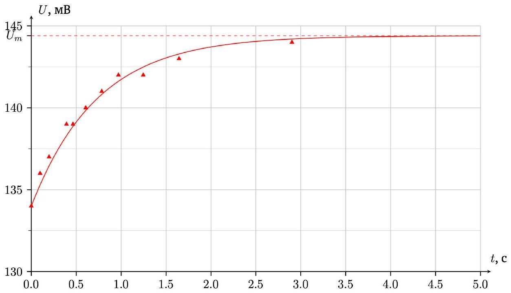
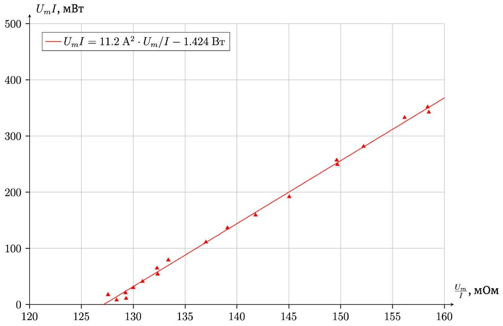
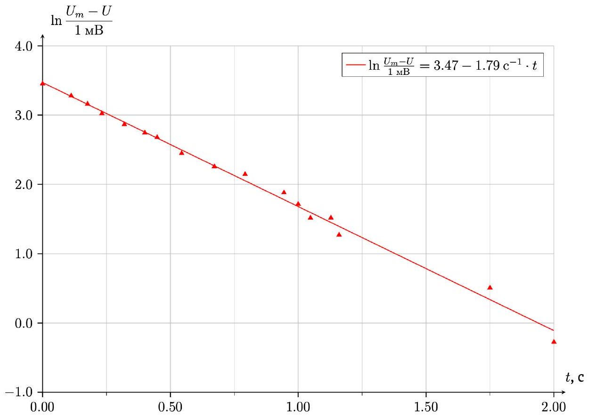
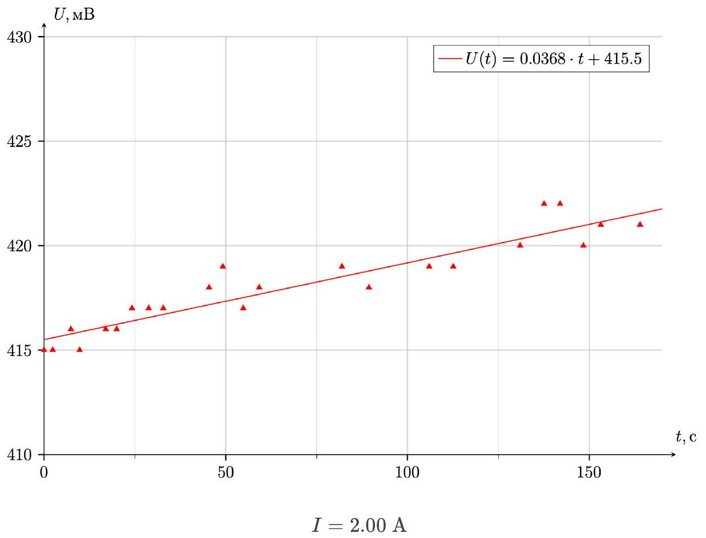
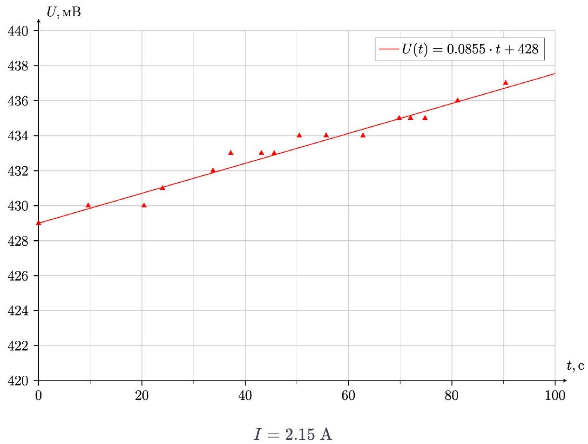
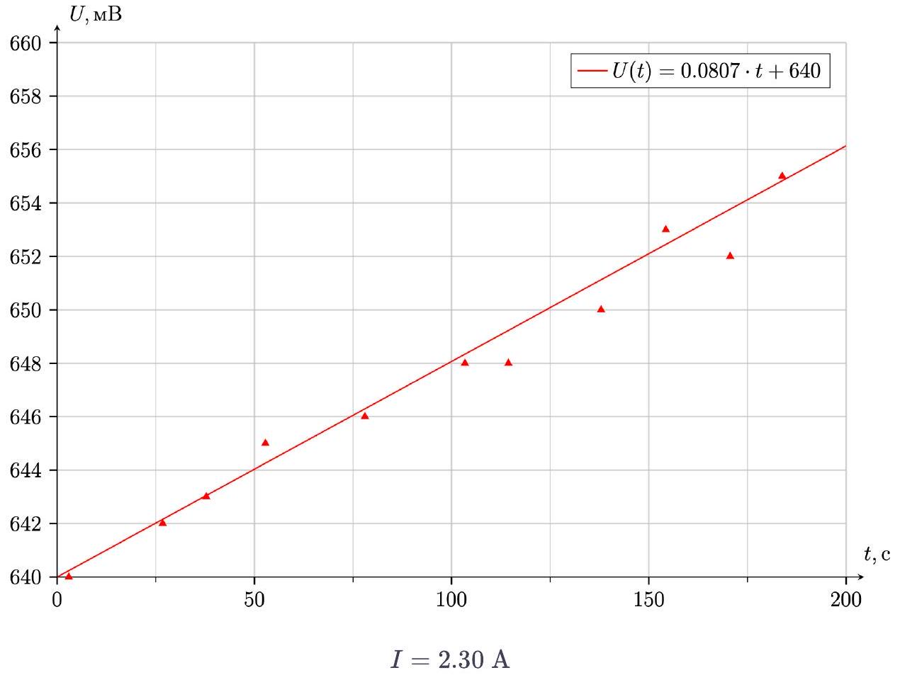
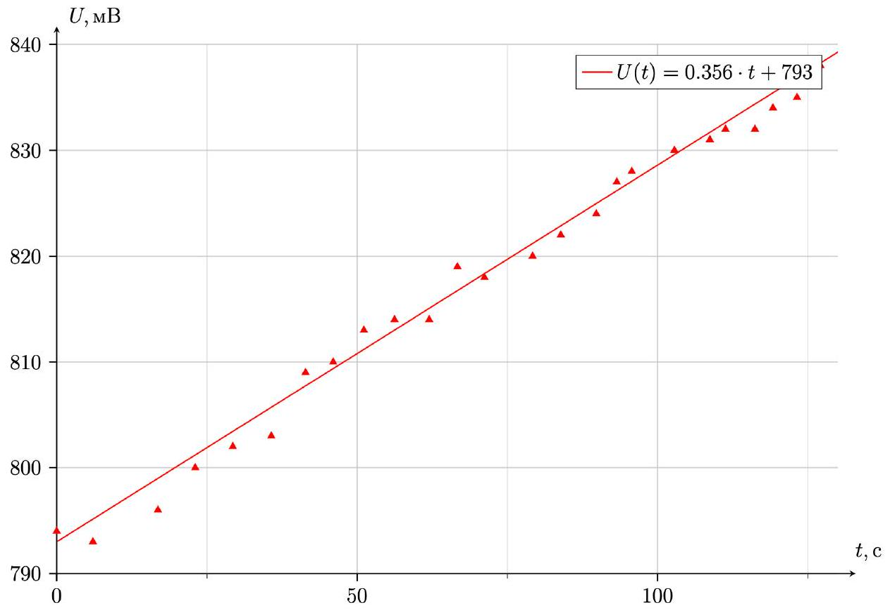
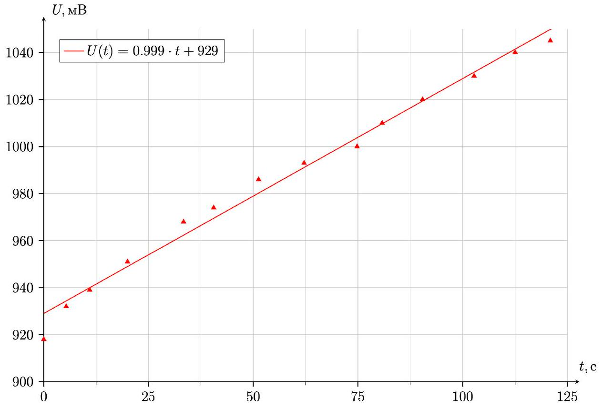
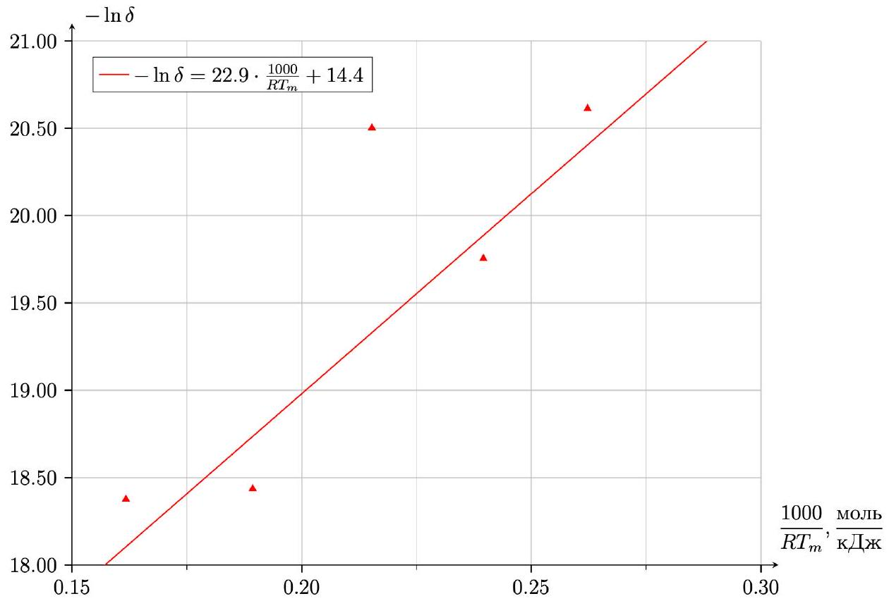

Ответ: Если подуть на проволоку, напряжение на ней уменьшится. Объясняется тем, что удельное сопротивление падает, когда температура уменьшается

Снимите зависимость напряжения на проволоке от времени в диапазоне $0 - 5$ с после подключения к источнику при силе тока через него $I = 1.0 \mathrm {~A}$. Укажите характерное время, за которое напряжение на проволоке устанавливается.

| $t$, MC | 0.00 | 0.10 | 0.20 | 0.39 | 0.46 | 0.61 | 0.78 | 0.97 | 1.25 | 1.64 |
| :--- | :--- | :--- | :--- | :--- | :--- | :--- | :--- | :--- | :--- | :--- |
| $U _ { \text {avg } } , \mathrm { mB }$ | 134 | 136 | 137 | 139 | 139 | 140 | 141 | 142 | 142 | 143 |
| $\ln \frac { U _ { m } - U } { 1 \mathrm { MB } }$ | 2.30 | 02.08 | 1.95 | 1.61 | 1.61 | 1.39 | 1.10 | 0.69 | 0.69 | 0.00 |

Ответ:

Ответ:

$$
\tau \approx 3 \text { с }
$$

A3 0.60
Снимите зависимость установившегося напряжения $U _ { m }$ через проволоку от силы тока $I < 1.5 \mathrm {~A}$ через проволоку. Сделайте не менее 15 измерений.

| $I , A$ | 0.25 | 0.29 | 0.37 | 0.40 | 0.48 | 0.56 | 0.64 | 0.70 | 0.77 | 0.90 | 0.99 | 1.06 | 1.15 | 1.29 | 1.46 | 1.47 | 1.49 | 1.31 | 1.36 |
| :--- | :--- | :--- | :--- | :--- | :--- | :--- | :--- | :--- | :--- | :--- | :--- | :--- | :--- | :--- | :--- | :--- | :--- | :--- | :--- |
| $U _ { m } , \mathrm { mB }$ | 32.1 | 37.5 | 47.2 | 51.7 | 62.4 | 73.3 | 84.7 | 92.6 | 102.7 | 123.3 | 137.7 | 150.3 | 166.8 | 193.1 | 228 | 233 | 236 | 196 | 207 |
| $U _ { m } I$, мВт | 8.0 | 10.9 | 17.5 | 20.7 | 30.0 | 41.0 | 54.2 | 64.8 | 79.1 | 111.0 | 136.3 | 159.3 | 191.8 | 249.1 | 332.9 | 342.5 | 351.6 | 256.8 | 281.5 |
| $U _ { m } / I$, мОм | 128.4 | 129.3 | 127.6 | 129.3 | 130.0 | 130.9 | 132.3 | 132.3 | 133.4 | 137.0 | 139.1 | 141.8 | 145.0 | 149.7 | 156.2 | 158.5 | 158.4 | 149.6 | 152.2 |

A4 ${ } ^ { 0.20 }$
Теоретически получите зависимость $T ( U )$. Ответ выразите через $\alpha , I , L , r _ { 0 } , T , U$.

Сопротивление проволоки при температуре $T$ равно:

$$
R ( T ) = \frac { \alpha T L } { \pi r _ { 0 } ^ { 2 } } = \frac { U } { I }
$$

Ответ:

$$
T ( U ) = \frac { \pi r _ { 0 } ^ { 2 } } { \alpha I L } \cdot U
$$

$$
U I \mathrm {~d} t = \rho _ { \mathrm { M } } \pi r _ { 0 } ^ { 2 } L c _ { \mathrm { M } } \mathrm {~d} T + \beta \cdot 2 \pi r _ { 0 } L \left( T - T _ { 0 } \right) \mathrm { d } t
$$

Ответ:

$$
U I = \rho _ { \mathrm { M } } \pi r _ { 0 } ^ { 2 } L c _ { \mathrm { M } } \frac { \mathrm {~d} T } { \mathrm {~d} t } + \beta \cdot 2 \pi r _ { 0 } L \left( T - T _ { 0 } \right)
$$

А6 ${ } ^ { 0.30 }$ Теоретически свяжите установившееся напряжение $U _ { m }$ и силу тока $I$ через проволоку. Ответ запишите через $\alpha , T _ { 0 } , r _ { 0 } , L , \beta , U _ { m } , I$.

Когда $U = U _ { m } : T = T \left( U _ { m } \right) =$ const, значит:

$$
U _ { m } I = \beta \cdot 2 \pi r _ { 0 } L \left( T \left( U _ { m } \right) - T _ { 0 } \right)
$$

Из пункта А4 выразим $T \left( U _ { m } \right)$ и подставим:

$$
U _ { m } I = \beta \cdot 2 \pi r _ { 0 } L \left( \frac { \pi r _ { 0 } ^ { 2 } } { \alpha L } \cdot \frac { U _ { m } } { I } - T _ { 0 } \right)
$$

Ответ:

$$
U _ { m } I = \beta \cdot 2 \pi r _ { 0 } L \left( \frac { \pi r _ { 0 } ^ { 2 } } { \alpha L } \cdot \frac { U _ { m } } { I } - T _ { 0 } \right)
$$

А7 ${ } ^ { 1.20 }$ Постройте график зависимости $U _ { m }$ и $I$ в таких осях, в которых он будет линейным. Из графика получите значение коэффициента теплоотдачи $\beta$.

Построим график в осях $U _ { m } I$ и $\frac { U _ { m } } { I } , \beta = \frac { \alpha k _ { \text {угл } } } { 2 \pi ^ { 2 } r _ { 0 } ^ { 3 } }$

Ответ:

Ответ:

$$
\beta = 263.3 \frac { \mathrm { BT } } { \mathrm { M } ^ { 2 } \cdot \mathrm {~K} }
$$

А8 ${ } ^ { 0.60 }$ Используя результаты пунктов А4 и A5, получите теоретическую зависимость напряжения на проволоке $U$ от времени $t$. Ответ выразите через $U _ { 0 } , \alpha , \beta , I , r _ { 0 } , L , T _ { 0 } , \rho _ { \mathrm { M } } , c _ { \mathrm { M } } , U , t$.

$$
\begin{gathered}
U I = \rho _ { \mathrm { M } } \pi r _ { 0 } ^ { 2 } L c _ { \mathrm { M } } \cdot \frac { \pi r _ { 0 } ^ { 2 } } { \alpha I L } \cdot \frac { \mathrm {~d} U } { \mathrm {~d} t } + \beta \cdot 2 \pi r _ { 0 } L \left( \frac { \pi r _ { 0 } ^ { 2 } } { \alpha I L } \cdot U - T _ { 0 } \right) \\
\quad U \left( I - \frac { 2 \beta \pi ^ { 2 } r _ { 0 } ^ { 3 } } { \alpha I } \right) + 2 \beta \pi r _ { 0 } L T _ { 0 } = \rho _ { \mathrm { M } } c _ { \mathrm { M } } \cdot \frac { \pi ^ { 2 } r _ { 0 } ^ { 4 } } { \alpha I } \cdot \frac { \mathrm {~d} U } { \mathrm {~d} t }
\end{gathered}
$$

$$
\begin{aligned}
& \int _ { 0 } ^ { t } \mathrm {~d} t = \rho _ { \mathrm { M } } c _ { \mathrm { M } } \cdot \frac { \pi ^ { 2 } r _ { 0 } ^ { 4 } } { \alpha I } \cdot \int _ { U _ { 0 } } ^ { U ( t ) } \frac { \mathrm { d } U } { U \left( I - \frac { 2 \beta \pi ^ { 2 } r _ { 0 } ^ { 3 } } { \alpha I } \right) + 2 \beta \pi r _ { 0 } L T _ { 0 } } \\
& t = \frac { \rho _ { \mathrm { M } } c _ { \mathrm { M } } \pi ^ { 2 } r _ { 0 } ^ { 4 } } { \alpha I ^ { 2 } - 2 \beta \pi ^ { 2 } r _ { 0 } ^ { 3 } } \cdot \ln \frac { U \left( I - \frac { 2 \beta \pi ^ { 2 } r _ { 0 } ^ { 3 } } { \alpha I } \right) + 2 \beta \pi r _ { 0 } L T _ { 0 } } { U _ { 0 } \left( I - \frac { 2 \beta \pi ^ { 2 } r _ { 0 } ^ { 3 } } { \alpha I } \right) + 2 \beta \pi r _ { 0 } L T _ { 0 } } \\
& + 2 \beta \pi r _ { 0 } L T _ { 0 } = \left( U _ { 0 } \left( I - \frac { 2 \beta \pi ^ { 2 } r _ { 0 } ^ { 3 } } { \alpha I } \right) + 2 \beta \pi r _ { 0 } L T _ { 0 } \right) \cdot \exp \left( \frac { \alpha I ^ { 2 } - 2 \beta \pi ^ { 2 } r _ { 0 } ^ { 3 } } { \rho _ { \mathrm { M } } c _ { \mathrm { M } } \pi ^ { 2 } r _ { 0 } ^ { 4 } } \cdot t \right) \\
& \left( U _ { 0 } + \frac { 2 \beta \pi r _ { 0 } L T _ { 0 } } { I - \frac { 2 \beta \pi ^ { 2 } r _ { 0 } ^ { 3 } } { \alpha I } } \right) \cdot \exp \left( \frac { \alpha I ^ { 2 } - 2 \beta \pi ^ { 2 } r _ { 0 } ^ { 3 } } { \rho _ { \mathrm { M } } c _ { \mathrm { M } } \pi ^ { 2 } r _ { 0 } ^ { 4 } } \cdot t \right) - \frac { 2 \beta \pi r _ { 0 } L T _ { 0 } } { I - \frac { 2 \beta \pi ^ { 2 } r _ { 0 } ^ { 3 } } { \alpha I } } \\
& = U _ { 0 } - \left( U _ { 0 } + \frac { 2 \beta \pi r _ { 0 } L T _ { 0 } } { I - \frac { 2 \beta \pi ^ { 2 } r _ { 0 } ^ { 3 } } { \alpha I } } \right) \cdot \left( 1 - \exp \left( \frac { \alpha I ^ { 2 } - 2 \beta \pi ^ { 2 } r _ { 0 } ^ { 3 } } { \rho _ { \mathrm { M } } c _ { \mathrm { M } } \pi ^ { 2 } r _ { 0 } ^ { 4 } } \cdot t \right) \right)
\end{aligned}
$$

Ответ:

$$
U ( t ) = U _ { 0 } + \left( \frac { 2 \alpha I \beta \pi r _ { 0 } L T _ { 0 } } { 2 \beta \pi ^ { 2 } r _ { 0 } ^ { 3 } - \alpha I ^ { 2 } } - U _ { 0 } \right) \cdot \left( 1 - \exp \left( - \frac { 2 \beta \pi ^ { 2 } r _ { 0 } ^ { 3 } - \alpha I ^ { 2 } } { \rho _ { \mathrm { M } } c _ { \mathrm { M } } \pi ^ { 2 } r _ { 0 } ^ { 4 } } \cdot t \right) \right)
$$

A9 ${ } ^ { 0.50 }$ Постройте линеаризованный график зависимости $U$ от $t$, измеренной в пункте A2. Из графика определите удельную теплоемкость меди $c _ { \mathrm { M } }$.

$$
\begin{gathered}
U ( t ) = U _ { 0 } + \left( U _ { m } - U _ { 0 } \right) \cdot \left( 1 - \exp \left( - \frac { 2 \beta \pi ^ { 2 } r _ { 0 } ^ { 3 } - \alpha I ^ { 2 } } { \rho _ { \mathrm { M } } c _ { \mathrm { M } } \pi ^ { 2 } r _ { 0 } ^ { 4 } } \cdot t \right) \right) \\
1 - \frac { U ( t ) - U _ { 0 } } { U _ { m } - U _ { 0 } } = \exp \left( - \frac { 2 \beta \pi ^ { 2 } r _ { 0 } ^ { 3 } - \alpha I ^ { 2 } } { \rho _ { \mathrm { M } } c _ { \mathrm { M } } \pi ^ { 2 } r _ { 0 } ^ { 4 } } \cdot t \right) \\
\ln \frac { U _ { m } - U ( t ) } { U _ { m } - U _ { 0 } } = - \frac { 2 \beta \pi ^ { 2 } r _ { 0 } ^ { 3 } - \alpha I ^ { 2 } } { \rho _ { \mathrm { M } } c _ { \mathrm { M } } \pi ^ { 2 } r _ { 0 } ^ { 4 } } \cdot t
\end{gathered}
$$

Ответ:

Ответ:

$$
c _ { \mathrm { M } } = - \frac { 2 \beta \pi ^ { 2 } r _ { 0 } ^ { 3 } - \alpha I ^ { 2 } } { \rho _ { \mathrm { M } } k _ { \text {угл } } \pi ^ { 2 } r _ { 0 } ^ { 4 } } = 600.7 \frac { \text { Дж } } { \text { кг.К } }
$$

А10 ${ } ^ { 0.10 }$ Современная теория теплоемкости твердых тел утверждает, что молярная теплоемкость твёрдых тел примерно равна $3 R$. Оцените удельную теплоемкость $c _ { \mathrm { M } } ^ { \text {th } }$ исходя из этой теории.

$$
c _ { \mathrm { M } } ^ { t h } = \frac { 3 R } { \mu } = 392.6 \frac { Д ж } { \kappa \Gamma \cdot \mathrm {~K} }
$$

В $1 ^ { 4.00 }$ Проведите измерения, согласно алгоритму выше, для 5-ти различных значений $I$ из указанного диапазона.

$I = 2.45 \mathrm {~A}$

$I = 2.60 \mathrm {~A}$

| $n$ | $I , \mathrm {~A}$ | $R _ { n } , \Omega$ | $U _ { 0 } , \mathrm {~B}$ | $\gamma ( I ) , \mathrm { mB } / \mathrm { c }$ | $L , \mathrm { M }$ | $\delta , \mathrm { m } / \mathrm { c }$ | $T _ { m } , \mathrm {~K}$ | $\ln \delta$ | $1 / R T _ { m } , \frac { \text { МОЛЬ } } { \text { Дж } }$ |
| :--- | :--- | :--- | :--- | :--- | :--- | :--- | :--- | :--- | :--- |
| 1 | 2.00 | 0.105 | 0.416 | 0.037 | 0.0482 | $1.12 \cdot 10 ^ { - 09 }$ | 458.9 | -20.61 | $2.62 \cdot 10 ^ { - 04 }$ |
| 2 | 2.15 | 0.105 | 0.428 | 0.086 | 0.0482 | $2.63 \cdot 10 ^ { - 09 }$ | 502.3 | -19.75 | $2.40 \cdot 10 ^ { - 04 }$ |
| 3 | 2.30 | 0.110 | 0.640 | 0.081 | 0.0505 | $1.25 \cdot 10 ^ { - 09 }$ | 559.0 | -20.50 | $2.15 \cdot 10 ^ { - 04 }$ |
| 4 | 2.45 | 0.265 | 0.766 | 0.356 | 0.0405 | $9.85 \cdot 10 ^ { - 09 }$ | 635.6 | -18.44 | $1.89 \cdot 10 ^ { - 04 }$ |
| 5 | 2.60 | 0.136 | 0.919 | 0.999 | 0.0624 | $1.05 \cdot 10 ^ { - 09 }$ | 744.0 | -18.38 | $1.62 \cdot 10 ^ { - 04 }$ |

В2 ${ } ^ { 0.10 }$ Выразите длину $L _ { n }$ образца проволоки с номером $n$ через $\alpha , T _ { 0 } , r _ { 0 } , R _ { n }$. По полученным ранее данным пересчитайте $L _ { n }$.

$$
R _ { n } = \frac { \alpha T _ { 0 } L _ { n } } { \pi r _ { 0 } ^ { 2 } }
$$

Ответ:

$$
L _ { n } = \frac { \pi r _ { 0 } ^ { 2 } R _ { n } } { \alpha T _ { 0 } }
$$

Вз ${ } ^ { 0.10 }$ Выразите температуру проволоки $T$ через $I , \beta , L , U , r _ { 0 } , T _ { 0 }$.

$$
U I = 2 \beta \pi r _ { 0 } L \left( T - T _ { 0 } \right)
$$

Ответ:

$$
T = T _ { 0 } + \frac { U I } { 2 \beta \pi r _ { 0 } L }
$$

в4 ${ } ^ { 0.10 }$ Выразите напряжение на проволоке $U$ через $I , \alpha , L , T ( U )$ и радиус проводящей части проволоки $r ( t )$.

Ответ:

$$
U = \frac { \alpha T ( U ) \cdot I L } { \pi r ( t ) ^ { 2 } }
$$

В5 ${ } ^ { 0.70 }$ Используя результаты пунктов ВЗ и В4, получите теоретическую зависимость $r ( t )$. Ответ выразите через $I , L , \alpha , \beta , T _ { 0 } , r _ { 0 } , t , \gamma ( I ) , U _ { 0 }$.

$$
U _ { 0 } + \gamma ( I ) t = \frac { \alpha I L } { \pi r ( t ) ^ { 2 } } \cdot \left( T _ { 0 } + \frac { \left( U _ { 0 } + \gamma ( I ) t \right) I } { 2 \beta \pi r _ { 0 } L } \right)
$$

Ответ:

$$
r ( t ) = \sqrt { \frac { \alpha I L } { \pi \left( U _ { 0 } + \gamma ( I ) t \right) } \cdot \left( T _ { 0 } + \frac { \left( U _ { 0 } + \gamma ( I ) t \right) I } { 2 \beta \pi r _ { 0 } L } \right) }
$$

В6 ${ } ^ { 0.50 }$ Разложите полученное $r ( t )$ в ряд Тейлора по степеням $t$ до линейного члена: $r ( t ) = r _ { 0 } - \delta t$. Выразите $\delta$ через $r _ { 0 } , \gamma ( I ) , \alpha , T _ { 0 } , L , I , U _ { 0 }$.

$$
\begin{gathered}
r ^ { 2 } ( t ) \approx \frac { \alpha I L } { \pi } \left( \frac { I } { 2 \beta \pi r _ { 0 } L } + \frac { T _ { 0 } } { U _ { 0 } + \gamma t } \right) \approx \frac { \alpha I L } { \pi } \left( \frac { I } { 2 \beta \pi r _ { 0 } L } + \frac { T _ { 0 } } { U _ { 0 } } - \frac { \gamma T _ { 0 } } { U _ { 0 } ^ { 2 } } t \right) \\
r ( t ) = \sqrt { \frac { \alpha I L } { \pi } \left( \frac { I } { 2 \beta \pi r _ { 0 } L } + \frac { T _ { 0 } } { U _ { 0 } } \right) \cdot \left( 1 - \frac { \gamma T _ { 0 } t } { \frac { I U _ { 0 } ^ { 2 } } { 2 \beta \pi r _ { 0 } L } + U _ { 0 } T _ { 0 } } \right) } \\
r ( t ) = \sqrt { \frac { \alpha I L } { \pi } \left( \frac { I } { 2 \beta \pi r _ { 0 } L } + \frac { T _ { 0 } } { U _ { 0 } } \right) } \cdot \left( 1 - \frac { \gamma T _ { 0 } t } { \frac { I U _ { 0 } ^ { 2 } } { \beta \pi r _ { 0 } L } + 2 U _ { 0 } T _ { 0 } } \right) \\
r ( t ) = r _ { 0 } \cdot \left( 1 - \frac { \gamma T _ { 0 } t } { \frac { I U _ { 0 } ^ { 2 } } { \beta \pi r _ { 0 } L } + 2 U _ { 0 } T _ { 0 } } \right) \\
\delta = \frac { \alpha I L r _ { 0 } \gamma T _ { 0 } } { 2 U _ { 0 } ^ { 2 } \pi r _ { 0 } ^ { 2 } }
\end{gathered}
$$

Ответ:

$$
\delta = \frac { \alpha I L \gamma T _ { 0 } } { 2 U _ { 0 } ^ { 2 } \pi r _ { 0 } }
$$

в8 ${ } ^ { 0.20 }$ Укажите размерность $E _ { A }$.

Ответ:

$$
\left[ E _ { A } \right] = \frac { \text { Дж } } { \text { моль } }
$$

$$
\begin{gathered}
T _ { m } = T \left( U _ { m } \right) = \frac { \pi r _ { 0 } ^ { 2 } } { \alpha I L } \cdot U _ { m } = \frac { 2 \pi ^ { 2 } r _ { 0 } ^ { 3 } \beta T _ { 0 } } { - \alpha I ^ { 2 } + 2 \beta \pi ^ { 2 } r _ { 0 } ^ { 3 } } \\
\ln \delta = \ln \delta _ { 0 } - \frac { E _ { A } } { R T _ { m } }
\end{gathered}
$$

Ответ:

$$
E _ { A } = 22.9 \frac { \text { кДж } } { \text { моль } }
$$
