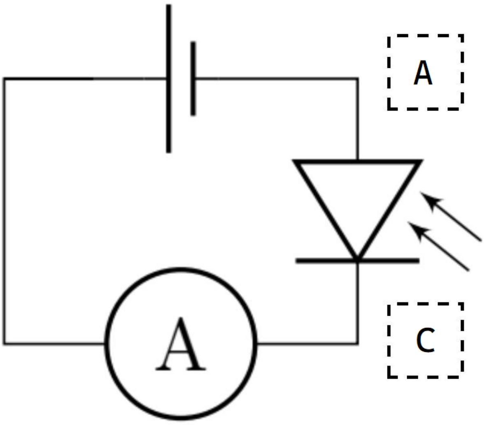
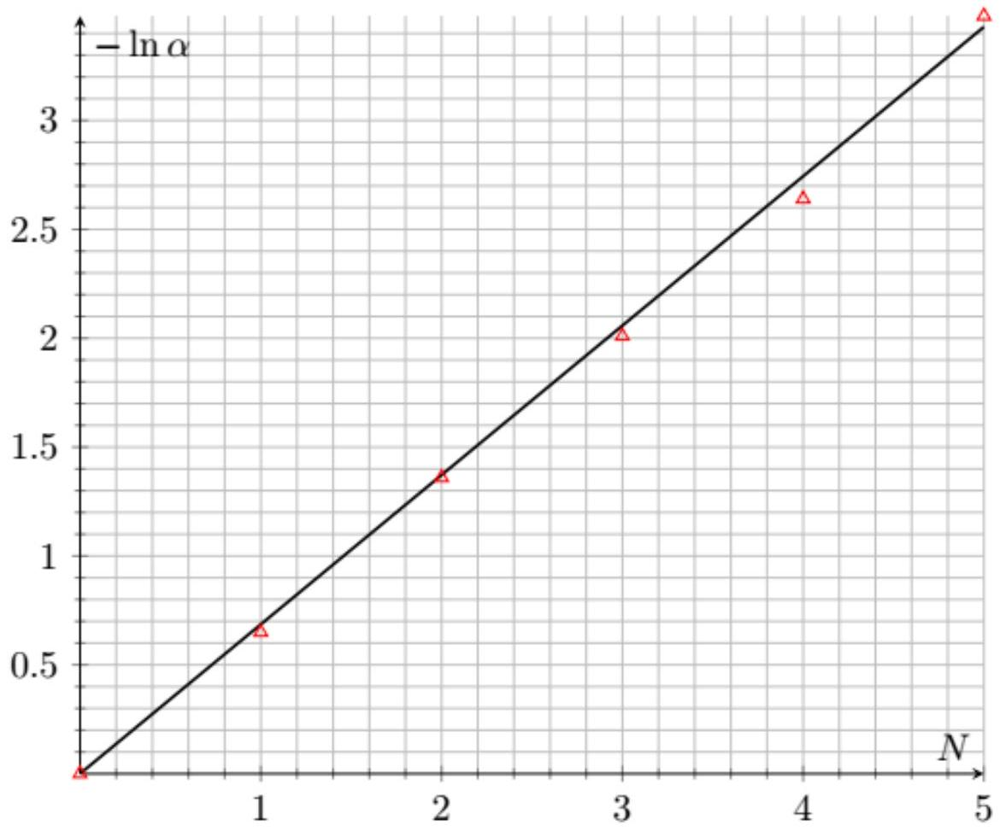
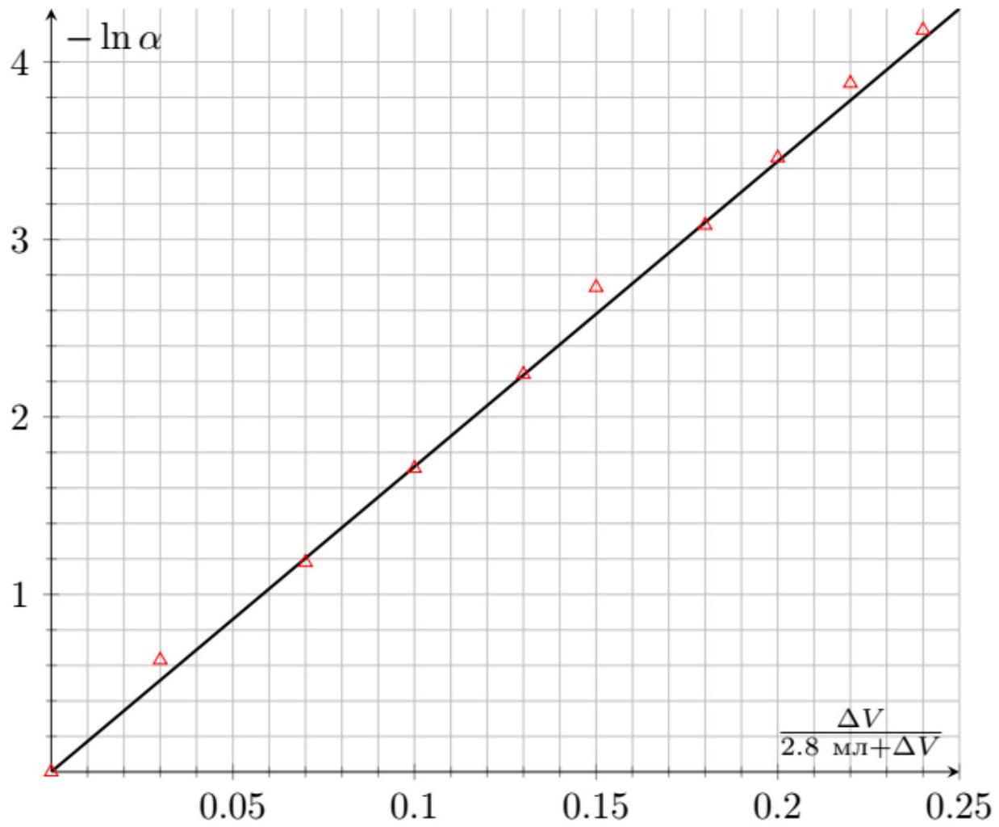
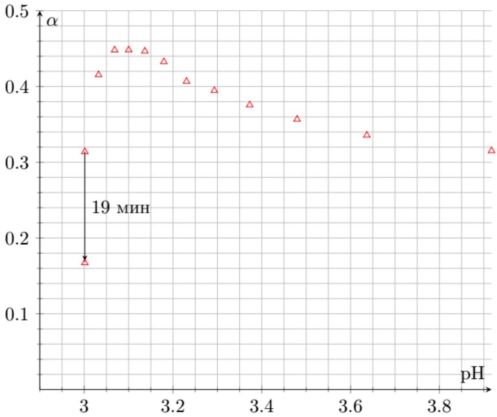
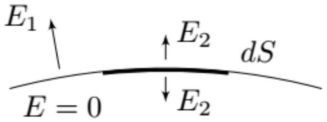
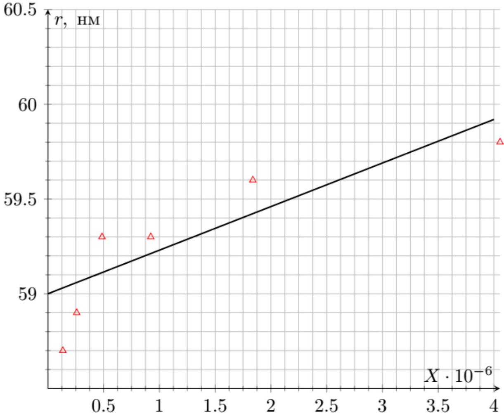

A1 ${ } ^ { 0.10 }$ Используя фотографию, укажите на схеме в листе ответов, каким контактам фотодиода соответствует каждый из проводов A, C.

Ответ:

А2 ${ } ^ { 0.50 }$ Расположите 5 кювет с 2.8 мл воды так, чтобы луч лазера проходил через них и падал на их стенки нормально. Последовательно добавляя в каждую из кювет по 0.1 мл раствора молока, снимите зависимость коэффициента пропускания $\alpha$ от количества кювет $N$, в которых добавлен раствор молока.

Зарисуйте используемую оптическую схему для $N = 3$.

Фоновое излучение $I _ { \text {back } } = 1.6 \mathrm {~mA}$. Коэффициент пропускания тогда задается формулой

$$
\alpha = \frac { I - I _ { \mathrm { back } } } { I _ { 0 } - I _ { \mathrm { back } } }
$$

Ответ:

| $I$, мкА | $N$ | $\alpha$ |
| :--- | :--- | :--- |
| 118,10 | 0 | 1,000 |
| 58,10 | 1 | 0,483 |
| 32,30 | 2 | 0,260 |
| 16,10 | 3 | 0,121 |
| 9,60 | 4 | 0,065 |
| 6,30 | 5 | 0,036 |

При измерениях в данной части важно учитывать отражения на границах раздела, т.е. для изучения интенсивности света для заданного $N$ ставить $N$ кювет с раствором молока и $5 - N$ кювет с чистой водой.

А3 ${ } ^ { 0.50 }$ Расположите одну кювету с 2.8 мл воды так, чтобы луч лазера проходил через ее стенки нормально. Снимите зависимость коэффициента пропускания $\alpha$ от объема $\Delta V$ добавленного раствора молока в диапазоне $\Delta V \leq 1$ мл.

Ответ:

| $\Delta V$, мл | $I$, мкА | $\alpha$ |
| :--- | :--- | :--- |
| 0 | 262 | 1,000 |
| 0,1 | 139,7 | 0,530 |
| 0,2 | 81,6 | 0,307 |

| 0,3 | 48,9 | 0,182 |
| :--- | :--- | :--- |
| 0,4 | 29,4 | 0,107 |
| 0,5 | 18,6 | 0,065 |
| 0,6 | 13,6 | 0,046 |
| 0,7 | 9,8 | 0,031 |
| 0,8 | 7,0 | 0,021 |
| 0,9 | 5,6 | 0,015 |

А4 ${ } ^ { 0.30 }$ Пусть на слой раствора молока толщиной $L$ с концентрацией мицелл $n$ падает параллельный пучок света.

Выразите коэффициент пропускания $\alpha$ через $L , n$ и эффективную площадь рассеяния $\delta S$ мицелл.

В слое объёма $d V = S \cdot d L$ содержится $d N = d V \cdot n$ мицелл, каждая из которых поглощает свет, попадающий на неё. Тогда так как интенсивность поглощённого света пропорциональна суммарной площади поглощения в этом слое:

$$
d I = - I \cdot \frac { d N \delta S } { S } = - I \cdot \delta S \cdot d L \cdot n
$$

Проинтегрировав это уравнение, получим

$$
I = I _ { 0 } e ^ { - L n \delta S }
$$

Ответ:

$$
\alpha = e ^ { - \operatorname { Ln } \delta S }
$$

A5 ${ } ^ { 0.70 }$ Линеаризуйте зависимость $\alpha$ от $N$ из пункта А1 и постройте ее график. Определите параметры прямой.

В рассматриваемом эксперименте меняется длина поглощающего слоя $L = L _ { 0 } \cdot N$. Из ответа предыдущего пункта следует линеаризация

$$
\ln \alpha = - N \cdot L _ { 0 } n \delta S
$$

Ответ:

Прямая проходит через ноль и имеет коэффициент наклона $k _ { \mathbf { A 5 } } = 0.668$.

А6 ${ } ^ { 0.80 }$ Линеаризуйте зависимость $\alpha$ от $\Delta V$ из пункта А2 и постройте ее график. Найдите параметры прямой.

$$
n = n _ { 0 } \frac { \Delta V } { V + \Delta V }
$$

, тогда линеаризация:

$$
\ln \alpha = - \frac { \Delta V } { 2.8 \text { мл + } \Delta V } \cdot L _ { 0 } n _ { 0 } \delta S .
$$

Ответ:

Прямая проходит через ноль и имеет коэффициент наклона $k _ { \mathbf { A } \mathbf { 6 } } = 17.2$.

А7 ${ } ^ { 0.30 }$ Считая, что радиус мицелл равен $r _ { 0 } = 60$ нм, найдите количество молекул $P$ казеина в каждой из них. Молярная масса молекулы казеина равна 23 кг/моль (белок является высокомолекулярным органическим веществом, поэтому имеет гигантскую по меркам неорганических соединений молярную массу).

По условию эффективная площадь рассеяния мицелл равна:

$$
\delta S = \frac { 8 \pi } { 3 } \left( \frac { 2 \pi } { \lambda } \right) ^ { 4 } \left( \frac { n _ { b } ^ { 2 } - n _ { 0 } ^ { 2 } } { n _ { b } ^ { 2 } + 2 n _ { 0 } ^ { 2 } } \right) ^ { 2 } \cdot r _ { 0 } ^ { 6 } = 4.59 \cdot 10 ^ { - 17 } \mathrm {~m} ^ { 2 }
$$

Из наклона любого из графиков $k _ { \mathbf { A 5 } }$ и $k _ { \mathbf { A 6 } }$ можно определить концентрацию мицелл $n _ { 0 }$ в исходном растворе молока.

$$
\begin{gathered}
n _ { 0 } = \frac { k _ { \mathbf { A } \mathbf { 5 } } } { L _ { 0 } \delta S } \cdot \frac { 2.9 \mathrm { мЛ } } { 0.1 \mathrm { M } Л } = 4.0 \cdot 10 ^ { 19 } \mathrm { M } ^ { - 3 } \\
n _ { 0 } = \frac { k _ { \mathbf { A } \mathbf { 6 } } } { L _ { 0 } \delta S } = 3.56 \cdot 10 ^ { 19 } \mathrm { M } ^ { - 3 }
\end{gathered}
$$

При этом концентрация молекул казеина $n _ { \text {Cas } } = \frac { 2.5 \text { г/л } } { 23 \text { кг/моль } } \cdot N _ { A } = 6.5 \cdot 10 ^ { 22 }$ м $^ { - 3 }$ и $P = n _ { \text {Саs } } / n _ { 0 }$.

Ответ:

$$
P = 1.8 \cdot 10 ^ { 3 }
$$

В $1 ^ { 0.90 }$ Снимите зависимость установившегося коэффициента пропускания $\alpha$ от концентрации кислоты в растворе $c$. Концентрацию $c$ измеряйте в г кислоты на 1 л раствора.

При концентрации $c _ { \text {крит } }$ измерьте значение $\alpha$ и через 1 мин после добавления порции кислоты и через 20 мин.

Ответ:

$$
\Delta V , \text { мл } \quad I , \text { мкА } \quad \alpha
$$

| 0 | 100,2 | 0,297 |
| :--- | :--- | :--- |
| 0,1 | 106,2 | 0,315 |
| 0,2 | 113,1 | 0,336 |
| 0,3 | 120,2 | 0,357 |
| 0,4 | 126,6 | 0,376 |
| 0,5 | 133 | 0,395 |
| 0,6 | 137,1 | 0,407 |
| 0,7 | 145,8 | 0,433 |
| 0,8 | 150,5 | 0,447 |
| 0,9 | 151,1 | 0,448 |
| 1,0 | 151 | 0,448 |

| 0,1 | 140 | 0,415 |
| :--- | :--- | :--- |
| 0,2 | 105,8 | 0,314 |

Интенсивность нерассеянного света $I _ { 0 } = 337$ мкА
В последней точке появляется зависимость от времени и через 20 мин значение интенсивности становится равным $I _ { 2,0.2 + 19 } = 56.3$ мкА.

B2 ${ } ^ { 1.40 }$ Пересчитайте ранее полученную зависимость $\alpha ( c )$ в $\alpha ( \mathrm { pH } )$ и постройте ее график.

До достижения объема 4.0 мл концентрация кислоты $c = c _ { 0 } \frac { \Delta V } { 3.0 \text { мл+ } \Delta V }$. После достижения объема 4.0 мл концентрация кислоты

$$
c = \frac { \frac { c _ { 0 } } { 4 } \cdot 3.0 \text { мл } + c _ { 0 } \Delta V } { 3.0 \text { мл } + \Delta V } .
$$

Для нахождения pH решим квадратное уравнение, обозначив $\mu = 210$ г/моль

$$
\begin{gathered}
{ \left[ \mathrm { H } ^ { + } \right] ^ { 2 } + \left[ \mathrm { H } ^ { + } \right] k _ { 1 } - \frac { c k _ { 1 } } { \mu } = 0 } \\
\mathcal { D } = k _ { 1 } ^ { 2 } + \frac { 4 c k _ { 1 } } { \mu } \Rightarrow \left[ \mathrm { H } ^ { + } \right] = \frac { - k _ { 1 } \pm \sqrt { k _ { 1 } ^ { 2 } + \frac { 4 c k _ { 1 } } { \mu } } } { 2 }
\end{gathered}
$$

Выбираем положительный корень и получаем две формулы для пересчета $\Delta V$ в pH (для первой итерации и для второй)

$$
\mathrm { pH } = - \log _ { 10 } \left( \frac { - k _ { 1 } + \sqrt { k _ { 1 } ^ { 2 } + \frac { 4 c _ { 0 } k _ { 1 } } { \mu } \frac { \Delta V } { 3.0 \mathrm { м } л + \Delta V } } } { 2 } \right) , \quad \mathrm { pH } = - \log _ { 10 } \left( \frac { - k _ { 1 } + \sqrt { k _ { 1 } ^ { 2 } + \frac { 4 c _ { 0 } k _ { 1 } } { \mu } \frac { 0.75 \mathrm { м } л + \Delta V } { 3.0 \mathrm { м } л + \Delta V } } } { 2 } \right)
$$

Ответ:

B3 ${ } ^ { 0.20 }$ Определите значение pI.

Значению pI соответствует pH при $c = c _ { \text {крит } }$

$$
\mathrm { pI } = 3.0
$$

В4 ${ } ^ { 0.40 }$ Оцените скорость склеивания мицелл $d P / d t$ сразу после доведения pH раствора до pI .

Пусть в среднем $P$ мицелл склеились в одну. Это значит что концентрация мицелл уменьшилась в $P$ раз, а радиус мицеллы увеличился в $P ^ { 1 / 3 }$ раз. Значит $- \ln \alpha \propto n r ^ { 6 }$ увеличится в $P$ раз.

Тогда

$$
\frac { d P } { d t } = \frac { 1 } { 19 \text { мин } } \frac { \ln \frac { I _ { 2,0.2 } - I _ { \text {back } } } { I _ { 0 } - I _ { \text {back } } } } { \ln \frac { I _ { 2,0.2 + 19 } - I _ { \text {back } } } { I _ { 0 } - I _ { \text {back } } } } = 8.1 \cdot 10 ^ { - 2 } 1 / \text { мин }
$$

В5 ${ } ^ { 0.20 }$ Укажите знак заряда мицелл казеина в чистой воде.

В воде $\mathrm { pH } = 7 n \mathrm { pI } < 7$, поэтому $q < 0$.

В6 ${ } ^ { 1.70 }$ Постройте линеаризованный график $r$ от pH и из графика оцените значение $k$.

До достижения объема 4.0 мл концентрация кислоты $c = c _ { 0 } \frac { \Delta V } { 3.0 \text { мл } + \Delta V }$, концентрация мицелл $n = n _ { 0 } \frac { 0.2 \text { мл } } { 3.0 \text { мл } + \Delta V }$.

После достижения объема 4.0 мл концентрация кислоты

$$
c = \frac { \frac { c _ { 0 } } { 4 } \cdot 3.0 \text { мл } + c _ { 0 } \Delta V } { 3.0 \text { мл } + \Delta V } ,
$$

а концентрация мицелл $n = n _ { 0 } \frac { 3.0 \text { мл } } { 4.0 \text { мл } } \frac { 0.2 \text { мл } } { 3.0 \text { мл } + \Delta V }$.

Если бы радиус мицелл не зависел от рН или если бы они не склеивались то

$$
- \ln \alpha _ { \mathrm { th } } = n L _ { 0 } \cdot \delta S .
$$

При этом $\delta S \propto r ^ { 6 }$ и до начала склеивания концентрация $n$ меняется только из-за разбавления согласно формулам выше, поэтому

$$
r = 60 \mathrm { HM } \cdot \left( \frac { \ln \alpha } { - n L _ { 0 } \delta S } \right) ^ { 1 / 6 }
$$

Заряд одной молекулы $\kappa$-казеина равен $q$, значит заряд всей мицеллы равен $N q$. Будем рассматривать мицеллу, как сферу с равномерной поверхностной плотностью заряда $\sigma = N q / \left( 4 \pi r ^ { 2 } \right)$. При этом электрическое поле сразу над поверхностью мицеллой равно

$$
E _ { 1 } = \frac { 1 } { 4 \pi \varepsilon _ { 0 } } \frac { N q } { r ^ { 2 } }
$$

а поле сразу под поверхностью мицеллы равно нулю.
Рассмотрим небольшой участок поверхности мицеллы площадью $d S$. Он имеет поверхностную плотность заряда $\sigma$, поэтому создает электрическое поле $E _ { 2 } = \frac { \sigma } { 2 \varepsilon _ { 0 } }$ с двух сторон от себя. Обозначим поле всей остальной сферы, кроме участка $d S$, как $E _ { \text {ост } }$.

Общее электрическое поле складывается из $E _ { 2 }$ и $E _ { \text {ост, } }$ поэтому

$$
\left\{ \begin{array} { l }
E _ { 2 } + E _ { \mathrm { ocT } } = E _ { 1 } \\
- E _ { 2 } + E _ { \mathrm { oct } } = 0
\end{array} \Rightarrow E _ { \mathrm { oct } } = E _ { 2 } = \frac { E _ { 1 } } { 2 } = \frac { 1 } { 8 \pi \varepsilon _ { 0 } } \frac { N q } { r ^ { 2 } } . \right.
$$

Значит каждая молекула $\kappa$-казеина находится в поле $E _ { \text {ост } }$ и поэтому на ее конец действует электростатическая сила

$$
F = \frac { N q ^ { 2 } } { 8 \pi \varepsilon _ { 0 } r ^ { 2 } }
$$

которая уравновешивается силой упругости $k \left( r - r _ { 0 } \right)$. При этом абсолютное значение радиуса $r$ мицеллы меняется очень слабо, что можно подтвердить непосредственным расчётом.

Итоговая линеаризация:

$$
r = r _ { 0 } + \frac { N e ^ { 2 } \left( 9.5 \cdot 10 ^ { - 4 } \right) ^ { 2 } } { 8 \pi \varepsilon _ { 0 } k \cdot ( 60 \mathrm { HM } ) ^ { 2 } } \left( 10 ^ { \mathrm { pH } } - 10 ^ { \mathrm { pI } } \right) ^ { 2 } .
$$

Обозначим $X = \left( 10 ^ { \mathrm { pH } } - 10 ^ { \mathrm { pI } } \right) ^ { 2 }$ и удалим из зависимости точки $\mathrm { pH } < 3.1$ т.к. в них радиус начинает увеличиваться, что связанно с процессом склеивания мицелл

Ответ: Полученный график позволяет лишь оценить значение $k$ по порядку - сказывается малый шаг в концентрации и отсутствие дополнительных методов измерения радиуса мицеллы.

Тем не менее, $k _ { \mathbf { B 6 } } = 0.23 \cdot 10 ^ { - 6 }$ нм и поэтому $k = 0.9 \mathrm { H } / \mathrm { м }$.
