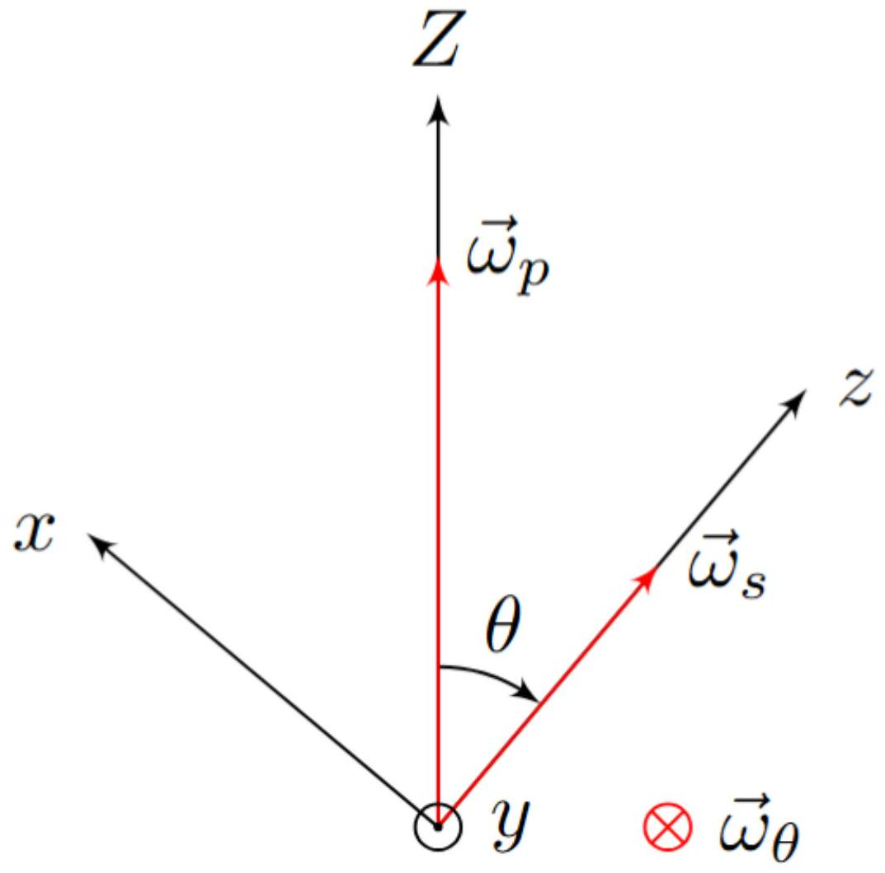
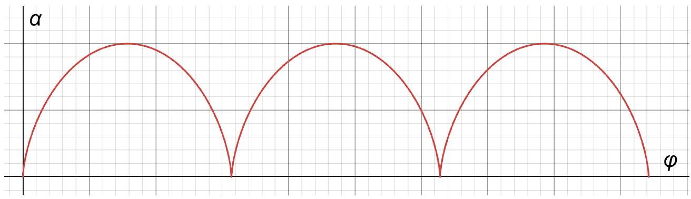

Используем формулу Эйлера для твёрдого тела.

Ответ:

$$
\vec { v } = [ \vec { \Omega } \times \vec { r } ]
$$

A2 ${ } ^ { 0.20 }$ Запишите в векторном виде выражение для момента импульса $d \vec { L }$ фрагмента $d m$ в рассматриваемый момент. Ответ выразите через $\vec { \Omega } , \vec { r } , d m$.

По определению, момент импульса элемента массой $d m$ :

Ответ:

$$
d \vec { L } = d m [ \vec { r } \times [ \vec { \Omega } \times \vec { r } ] ]
$$

А3 ${ } ^ { 0.30 }$ Получите выражения для компонент вектора $d \vec { L } = \left( d L _ { x } , d L _ { y } , d L _ { z } \right)$ в системе координат $O X Y Z$. Ответ выразите через $X , Y , Z , \Omega _ { x } , \Omega _ { y } , \Omega _ { z } , d m$.

Раскроем двойное векторное произведение в выражении для $d \vec { L }$ :

$$
d \vec { L } = d m ( \vec { r } \times ( \vec { \Omega } \times \vec { r } ) ) = d m \left( \vec { \Omega } r ^ { 2 } - \vec { r } ( \vec { \Omega } \cdot \vec { r } ) \right) .
$$

Распишем полученное векторное выражение покомпонентно:

$$
\begin{aligned}
& d L _ { x } = d m \left( \Omega _ { x } \left( X ^ { 2 } + Y ^ { 2 } + Z ^ { 2 } \right) - X \left( \Omega _ { x } X + \Omega _ { y } Y + \Omega _ { z } Z \right) \right) \\
& d L _ { y } = d m \left( \Omega _ { y } \left( X ^ { 2 } + Y ^ { 2 } + Z ^ { 2 } \right) - Y \left( \Omega _ { x } X + \Omega _ { y } Y + \Omega _ { z } Z \right) \right) \\
& d L _ { z } = d m \left( \Omega _ { z } \left( X ^ { 2 } + Y ^ { 2 } + Z ^ { 2 } \right) - Z \left( \Omega _ { x } X + \Omega _ { y } Y + \Omega _ { z } Z \right) \right)
\end{aligned}
$$

Упрощая, получаем ответ.

Ответ:

$$
\begin{aligned}
d L _ { x } & = d m \left( \Omega _ { x } \left( Y ^ { 2 } + Z ^ { 2 } \right) - \Omega _ { y } X Y - \Omega _ { z } X Z \right) \\
d L _ { y } & = d m \left( - \Omega _ { x } Y X + \Omega _ { y } \left( X ^ { 2 } + Z ^ { 2 } \right) - \Omega _ { z } Y Z \right) \\
d L _ { z } & = d m \left( - \Omega _ { x } Z X - \Omega _ { y } Z Y + \Omega _ { z } \left( X ^ { 2 } + Y ^ { 2 } \right) \right)
\end{aligned}
$$

A4 ${ } ^ { 0.50 }$ Для произвольного движения твердого тела можно записать момент импульса в виде

$$
\begin{aligned}
& L _ { x } = I _ { x x } \Omega _ { x } + I _ { x y } \Omega _ { y } + I _ { x z } \Omega _ { z } ; \\
& L _ { y } = I _ { y x } \Omega _ { x } + I _ { y y } \Omega _ { y } + I _ { y z } \Omega _ { z } ; \\
& L _ { z } = I _ { z x } \Omega _ { x } + I _ { z y } \Omega _ { y } + I _ { z z } \Omega _ { z } .
\end{aligned}
$$

Получите выражения для коэффициентов $I _ { x x } , I _ { x y } , I _ { x z } , I _ { y x } , I _ { y y } , I _ { y z } , I _ { z x } , I _ { z y } , I _ { z z }$ в виде интегралов по $d m$. Интеграл по $d m$ представляет собой сумму по бесконечно малым участкам твердого тела массы $d m$.
Например, координаты центра масс можно записать как

$$
X _ { c } = \frac { 1 } { m } \int X d m ; \quad Y _ { c } = \frac { 1 } { m } \int Y d m , \quad Z _ { c } = \frac { 1 } { m } \int Z d m
$$

В дальнейших пунктах полученные здесь формулы не используются.

Ответ получается интегрированием по $d m$ выражений предыдущего пункта.

Ответ:

$$
\begin{array} { c c c }
I _ { x x } = \int d m \left( Y ^ { 2 } + Z ^ { 2 } \right) & I _ { y y } = \int d m \left( X ^ { 2 } + Z ^ { 2 } \right) & I _ { z z } = \int d m \left( X ^ { 2 } + Y ^ { 2 } \right) \\
I _ { x y } = I _ { y x } = - \int d m X Y & I _ { y z } = I _ { z y } = - \int d m Y Z & I _ { z x } = I _ { x z } = - \int d m X Z
\end{array}
$$

В главных осях выражения для компонент момента импульса $\vec { L }$ принимают вид

$$
L _ { x } = I _ { x } \omega _ { x } , \quad L _ { y } = I _ { y } \omega _ { y } , \quad L _ { z } = I _ { z } \omega _ { z } .
$$

Отсюда следует ответ.

Ответ:

$$
\vec { L } = I _ { x } \omega _ { x } \vec { e } _ { x } + I _ { y } \omega _ { y } \vec { e } _ { y } + I _ { z } \omega _ { z } \vec { e } _ { z }
$$

Согласно условию

$$
T = \frac { 1 } { 2 } \vec { \omega } \cdot \vec { L }
$$

Используя найденное выше выражение для $\vec { L }$, приходим к ответу.

Ответ:

$$
T = \frac { 1 } { 2 } \left( I _ { x } \omega _ { x } ^ { 2 } + I _ { y } \omega _ { y } ^ { 2 } + I _ { z } \omega _ { z } ^ { 2 } \right)
$$

А6 ${ } ^ { 0.50 }$ Получите выражения для компонент вектора $\dot { \vec { L } }$ в подвижной системы координат $( \dot { \vec { L } } ) _ { x } , ( \dot { \vec { L } } ) _ { y } , ( \dot { \vec { L } } ) _ { z }$. Ответ выразите через $I _ { x } , I _ { y ^ { \prime } } I _ { z } , \omega _ { x } , \omega _ { y } , \omega _ { z } , \dot { \omega } _ { x } , \dot { \omega } _ { y }$, $\dot { \omega } _ { z }$.

Продифференцируем ранее полученное выражение для $\vec { L }$. Так как единичные орты системы координат подвижны, их тоже необходимо дифференцировать.

$$
\begin{gathered}
\dot { \vec { L } } = I _ { x } \frac { d } { d t } \left( \omega _ { x } \vec { e } _ { x } \right) + I _ { y } \frac { d } { d t } \left( \omega _ { y } \vec { e } _ { y } \right) + I _ { z } \frac { d } { d t } \left( \omega _ { z } \vec { e } _ { z } \right) = \\
= I _ { x } \dot { \omega } _ { x } \vec { e } _ { x } + I _ { y } \dot { \omega } _ { y } \vec { e } _ { y } + I _ { z } \dot { \omega } _ { z } \vec { e } _ { z } + I _ { x } \omega _ { x } \dot { \vec { e } } _ { x } + I _ { y } \omega _ { y } \dot { \vec { e } } _ { y } + I _ { z } \omega _ { z } \dot { \vec { e } } _ { z } = \\
= I _ { x } \dot { \omega } _ { x } \vec { e } _ { x } + I _ { y } \dot { \omega } _ { y } \vec { e } _ { y } + I _ { z } \dot { \omega } _ { z } \vec { e } _ { z } + \left( \vec { \omega } \times \left( I _ { x } \omega _ { x } \vec { e } _ { x } + I _ { y } \omega _ { y } \vec { e } _ { y } + I _ { z } \omega _ { z } \vec { e } _ { z } \right) \right) = \\
= I _ { x } \dot { \omega } _ { x } \vec { e } _ { x } + I _ { y } \dot { \omega } _ { y } \vec { e } _ { y } + I _ { z } \dot { \omega } _ { z } \vec { e } _ { z } + ( \vec { \omega } \times \vec { L } )
\end{gathered}
$$

Распишем в координатах векторное произведение:

$$
[ \vec { \omega } \times \vec { L } ] = \left| \begin{array} { c c c }
\vec { e } _ { x } & \vec { e } _ { y } & \vec { e } _ { z } \\
\omega _ { x } & \omega _ { y } & \omega _ { z } \\
L _ { x } & L _ { y } & L _ { z }
\end{array} \right| = \vec { e } _ { x } \left( \omega _ { y } L _ { z } - \omega _ { z } L _ { y } \right) + \vec { e } _ { y } \left( \omega _ { z } L _ { x } - \omega _ { x } L _ { z } \right) + \vec { e } _ { z } \left( \omega _ { x } L _ { y } - \omega _ { y } L _ { z } \right)
$$

Таким образом получаем проекции $\dot { \vec { L } }$ на оси системы $O x y z$.

Ответ:

$$
\begin{aligned}
& ( \dot { \vec { L } } ) _ { x } = I _ { x } \dot { \omega } _ { x } + \left( I _ { z } - I _ { y } \right) \omega _ { y } \omega _ { z } \\
& ( \dot { \vec { L } } ) _ { y } = I _ { y } \dot { \omega } _ { y } + \left( I _ { x } - I _ { z } \right) \omega _ { z } \omega _ { x } \\
& ( \dot { \vec { L } } ) _ { z } = I _ { z } \dot { \omega } _ { z } + \left( I _ { y } - I _ { x } \right) \omega _ { x } \omega _ { y }
\end{aligned}
$$

В1 ${ } ^ { 0.40 }$ Найдите проекции угловой скорости $\omega _ { x } , \omega _ { y } , \omega _ { z }$. Выразите ответ через $\omega _ { s } , \dot { \theta } , \dot { \varphi } , \theta$.

Проецируя $\vec { \omega } _ { s } , \vec { \omega } _ { \theta } , \vec { \omega } _ { \varphi }$ на оси $x , y , z$ и учитывая

$$
\vec { \omega } _ { \theta } = - \dot { \theta } \vec { e } _ { y } , \quad \vec { \omega } _ { \varphi } = \dot { \varphi } \vec { e } _ { Z }
$$

получим ответ.

Ответ:

$$
\begin{gathered}
\omega _ { x } = \dot { \varphi } \sin \theta \\
\omega _ { y } = - \dot { \theta } \\
\omega _ { z } = \omega _ { s } + \dot { \varphi } \cos \theta
\end{gathered}
$$

В2 ${ } ^ { 0.40 }$ Покажите, что проекция $L _ { 1 }$ момента импульса $\vec { L }$ на неподвижную вертикальную ось $O Z$ постоянна. Покажите, что проекция $L _ { 2 }$ момента импульса $\vec { L }$ на подвижную ось $O z$ постоянна.

Момент силы тяжести выражается по формуле

$$
\vec { M } = \vec { l } \times m \vec { g } ,
$$

из которой следует, что $\vec { M }$ перпендикулярен плоскости $O Z z$. Из уравнения моментов в неподвижных осях следует

$$
\dot { L } _ { 1 } = \dot { L } _ { Z } = M _ { Z } = 0 .
$$

Из уравнения Эйлера для оси $O z$ следует

$$
I _ { z } \dot { \omega } _ { z } + \left( I _ { y } - I _ { x } \right) \omega _ { x } \omega _ { y } = 0 .
$$

В силу симметрии $I _ { x } = I _ { y }$, поэтому

$$
\dot { L } _ { 2 } = I _ { z } \dot { \omega } _ { z } = 0 .
$$

Отметим, что перпендикулярности $\vec { M }$ и $O z$ для сохранения $L _ { 2 }$ недостаточно.

B3 ${ } ^ { 0.60 }$ Используя результаты пункта A5, выразите значения проекций $L _ { 1 }$ и $L _ { 2 }$ через $\omega _ { s } , \dot { \theta } , \dot { \varphi } , \theta , A , C$.

Выразим $L _ { 1 }$ через проекции $\vec { L }$ :

$$
L _ { 1 } = L _ { z } \cos \theta + L _ { x } \sin \theta = A \omega _ { x } \sin \theta + C \omega _ { z } \cos \theta .
$$

Используя результат пункта В1, получаем окончательный ответ для $L _ { 1 }$ :

$$
L _ { 1 } = C \left( \omega _ { s } + \dot { \varphi } \cos \theta \right) \cos \theta + A \dot { \varphi } \sin ^ { 2 } \theta .
$$

Для $L _ { 2 }$ верно

$$
L _ { 2 } = L _ { z } = C \omega _ { z } = C \left( \omega _ { s } + \dot { \varphi } \cos \theta \right) .
$$

Ответ:

$$
\begin{gathered}
L _ { 1 } = C \left( \omega _ { s } + \dot { \varphi } \cos \theta \right) \cos \theta + A \dot { \varphi } \sin ^ { 2 } \theta \\
L _ { 2 } = C \left( \omega _ { s } + \dot { \varphi } \cos \theta \right)
\end{gathered}
$$

В4 ${ } ^ { 0.70 }$ В этом пункте будем считать, что $l = 0$, и момент силы тяжести можно не учитывать. Пусть момент импульса волчка равен $L _ { 0 }$ и направлен вдоль оси $O Z$. В момент времени $t = 0$ значения углов $\theta = \theta _ { 0 } , \varphi = \varphi _ { 0 }$. Найдите зависимость углов $\theta , \varphi$ от времени. Такое движение называется регулярной прецессией.

В описанном случае

$$
L _ { 1 } = L _ { 0 } , \quad L _ { 2 } = L _ { 0 } \cos \theta .
$$

В силу постоянства величин $L _ { 0 } , L _ { 1 } , L _ { 2 }$ угол $\theta$ также остаётся постоянным.
Используя выражения для $L _ { 1 } , L _ { 2 }$ из предыдущего пункта, получаем систему уравнений:
BEEQUATION
Решая систему, получаем

$$
\dot { \varphi } = \frac { L _ { 0 } } { A }
$$

Далее зависимость $\varphi$ от времени получается простым интегрированием.

Ответ:

$$
\begin{gathered}
\theta ( t ) = \theta _ { 0 } \\
\varphi ( t ) = \varphi _ { 0 } + \frac { L _ { 0 } } { A } t
\end{gathered}
$$

C1 ${ } ^ { 0.60 }$ Для произвольного положения волчка выразите полную энергию $E$ движения волчка (сумму кинетической и потенциальной) через $\omega _ { s } , \dot { \theta } , \dot { \varphi } , A , C , m$, $g , l , \theta$.

Запишем выражения для потенциальной и кинетической энергий:

$$
\begin{aligned}
T = \frac { 1 } { 2 } \left( C \omega _ { z } ^ { 2 } + A \left( \omega _ { x } ^ { 2 } + \omega _ { y } ^ { 2 } \right) \right) = & \frac { 1 } { 2 } \left( C \left( \omega _ { s } + \dot { \varphi } \cos \theta \right) ^ { 2 } + A \left( \dot { \theta } ^ { 2 } + \dot { \varphi } ^ { 2 } \sin ^ { 2 } \theta \right) \right) \\
& \Pi = m g l \cos \theta
\end{aligned}
$$

Полная энергия:

$$
E = T + \Pi .
$$

Ответ:

$$
E = \frac { 1 } { 2 } \left( C \left( \omega _ { s } + \dot { \varphi } \cos \theta \right) ^ { 2 } + A \left( \dot { \theta } ^ { 2 } + \dot { \varphi } ^ { 2 } \sin ^ { 2 } \theta \right) \right) + m g l \cos \theta
$$

C2 ${ } ^ { 0.30 }$ Выразите $\omega _ { s }$ и $\dot { \varphi }$ через $L _ { 1 } , L _ { 2 } , A , C , \theta$, используя результаты пункта B3.

Ответ получается путём решения системы относительно $\omega _ { s } , \dot { \varphi }$.

$$
\left\{ \begin{array} { l }
L _ { 1 } = \dot { \varphi } \left( A \sin ^ { 2 } \theta + C \cos ^ { 2 } \theta \right) + C \omega _ { s } \cos \theta \\
L _ { 2 } = C \left( \omega _ { s } + \dot { \varphi } \cos \theta \right)
\end{array} \right.
$$

Ответ:

$$
\begin{gathered}
\dot { \varphi } = \frac { L _ { 1 } - L _ { 2 } \cos \theta } { A \sin ^ { 2 } \theta } \\
\omega _ { s } = \frac { L _ { 2 } } { C } - \frac { L _ { 1 } - L _ { 2 } \cos \theta } { A \sin ^ { 2 } \theta } \cos \theta
\end{gathered}
$$

$$
E = \frac { \mu } { 2 } \dot { \theta } ^ { 2 } + U ( \theta ) .
$$

Получите выражения для $\mu , U ( \theta )$ через $A , C , L _ { 1 } , L _ { 2 } , m , g , l$.

Примечание. Как известно, полная энергия определена с точностью до константы, которую для удобства можно положить равной нулю.

Подстановка в выражение для энергии $\omega _ { s }$ и $\dot { \varphi }$ из предыдущего пункта приводит к результату

$$
E = \frac { A } { 2 } \dot { \theta } ^ { 2 } + \frac { \left( L _ { 1 } - L _ { 2 } \cos \theta \right) ^ { 2 } } { 2 A \sin ^ { 2 } \theta } + m g l \cos \theta + \frac { L _ { 2 } ^ { 2 } } { 2 C } .
$$

Последнее константное слагаемое можно отбросить:

$$
E = \frac { A } { 2 } \dot { \theta } ^ { 2 } + \frac { \left( L _ { 1 } - L _ { 2 } \cos \theta \right) ^ { 2 } } { 2 A \sin ^ { 2 } \theta } + m g l \cos \theta .
$$

Из полученного выражения следует ответ.

Ответ:

$$
\begin{gathered}
\mu = A \\
U ( \theta ) = m g l \cos \theta + \frac { \left( L _ { 1 } - L _ { 2 } \cos \theta \right) ^ { 2 } } { 2 A \sin ^ { 2 } \theta }
\end{gathered}
$$

D1 ${ } ^ { 0,80 }$ Найдите период колебаний волчка. Ответ получите в виде определённого интеграла, содержащего $A , C , l , \theta _ { 0 } , g$. Получите также упрощённое выражение для случая $\pi - \theta _ { 0 } \ll 1$.

Для заданных начальных условий

$$
L _ { 1 } = L _ { 2 } = 0 .
$$

Закон сохранения энергии в этом случае запишется в виде

$$
\frac { A \dot { \theta } ^ { 2 } } { 2 } + m g l \cos \theta = m g l \cos \theta _ { 0 } .
$$

Отсюда выражается зависимость $\dot { \theta } ( \theta )$ :

$$
\dot { \theta } = \pm \sqrt { \frac { 2 m g l } { A } \left( \cos \theta _ { 0 } - \cos \theta \right) } .
$$

Движение от $\theta = \theta _ { 0 }$ до $\theta = \pi$ с $\dot { \theta } > 0$ занимает четверть периода. Для нахождения этого времени требуется проинтегрировать уравнение

$$
d t = \frac { d \theta } { \dot { \theta } } .
$$

Интегрируем:

$$
\frac { T } { 4 } = \sqrt { \frac { A } { 2 m g l } } \int _ { \theta _ { 0 } } ^ { \pi } \frac { d \theta } { \sqrt { \cos \theta _ { 0 } - \cos \theta } }
$$

Отсюда следует ответ.

Ответ:

$$
T = 4 \sqrt { \frac { A } { 2 m g l } } \int _ { \theta _ { 0 } } ^ { \pi } \frac { d \theta } { \sqrt { \cos \theta _ { 0 } - \cos \theta } }
$$

Введём переменную $\beta = \pi - \theta$, тогда $\beta \ll 1$.

1 метод
С учётом малости $\beta$ выражение для энергии запишется в виде:

$$
E = \frac { A \dot { \beta } ^ { 2 } } { 2 } + m g l \frac { \beta ^ { 2 } } { 2 }
$$

Такой вид уравнения соответствует гармоническим колебаниям с периодом

$$
T = 2 \pi \sqrt { \frac { A } { m g l } } .
$$

Введём $\beta _ { 0 } = \pi - \theta _ { 0 }$. Преобразуем интеграл

$$
\int _ { \theta _ { 0 } } ^ { \pi } \frac { d \theta } { \sqrt { \cos \theta _ { 0 } - \cos \theta } }
$$

в рассматриваемом приближении.

$$
\begin{gathered}
\int _ { \theta _ { 0 } } ^ { \pi } \frac { d \theta } { \sqrt { \cos \theta _ { 0 } - \cos \theta } } = \int _ { \beta _ { 0 } } ^ { 0 } \frac { - d \beta } { \sqrt { \cos \left( \pi - \beta _ { 0 } \right) - \cos ( \pi - \beta ) } } = \int _ { 0 } ^ { \beta _ { 0 } } \frac { d \beta } { \sqrt { \cos \beta - \cos \beta _ { 0 } } } \simeq \\
\simeq \sqrt { 2 } \int _ { 0 } ^ { \beta _ { 0 } } \frac { d \beta } { \sqrt { \beta _ { 0 } ^ { 2 } - \beta ^ { 2 } } } = \sqrt { 2 } \int _ { 0 } ^ { \beta _ { 0 } } \frac { \frac { d \beta } { \beta _ { 0 } } } { \sqrt { 1 - \frac { \beta ^ { 2 } } { \beta _ { 0 } ^ { 2 } } } } = \sqrt { 2 } \int _ { 0 } ^ { 1 } \frac { d x } { \sqrt { 1 - x ^ { 2 } } } = \sqrt { 2 } \frac { \pi } { 2 }
\end{gathered}
$$

Подстановка найденного значения в исходное выражение для $T$ приводит к ответу, полученному способом 1.

Ответ:

$$
T = 2 \pi \sqrt { \frac { A } { m g l } }
$$

D2 ${ } ^ { 0.20 }$ Выразите $L _ { 1 }$ и $L _ { 2 }$ через $A , C , \omega _ { 0 }$.

В заданной ситуации $L _ { 1 } = L _ { 2 }$. Их значения мгновенно получаются из выражения $\vec { L }$ в главных осях.

Ответ:

$$
L _ { 1 } = L _ { 2 } = C \omega _ { 0 }
$$

D3 ${ } ^ { 0.50 }$ Найдите условие, связывающее $A , C , m , g , l , \omega _ { 0 }$, при котором положение $\theta = 0$ является устойчивым для отклонений, описанных выше. Это условие называется условием Маиевского.

Оказывается, что при выполнении найденного условия положение равновесия является устойчивым даже при отказе от условия сохранения $L _ { 1 }$ и $L _ { 2 }$.

При $L _ { 1 } = L _ { 2 } = C \omega _ { 0 }$ выражение для энергии принимает вид

$$
E = \frac { A } { 2 } \dot { \theta } ^ { 2 } + m g l \cos \theta + \frac { C ^ { 2 } \omega _ { 0 } ^ { 2 } ( 1 - \cos \theta ) ^ { 2 } } { 2 A \sin ^ { 2 } \theta } .
$$

Разложим с учётом малости $\theta$ :

$$
E = \frac { A \dot { \theta } ^ { 2 } } { 2 } + \left( \frac { C ^ { 2 } \omega _ { 0 } ^ { 2 } } { 4 A } - m g l \right) \frac { \theta ^ { 2 } } { 2 } .
$$

Для устойчивости необходимо, чтобы коэффициент перед $\theta ^ { 2 }$ был положительным, что определяет требуемое условие.

Ответ:

$$
\frac { C ^ { 2 } \omega _ { 0 } ^ { 2 } } { 4 A } > m g l
$$

D4 ${ } ^ { 0.70 }$ Получите уравнение на $\theta$, которому удовлетворяет угол $\theta _ { 1 }$. Уравнение может содержать $A , C , L _ { 1 } , L _ { 2 } , m , g , l$.
Подсказка. $U ( \theta )$ можно представить в виде функции от новой переменной $s = \cos \theta$, что значительно упрощает решение.

В положении равновесия $\frac { d } { d \theta } U ( \theta ) = 0$. Перейдём к переменной $s = \cos \theta$. Тогда

$$
\frac { d } { d \theta } U ( \theta ) = \frac { d } { d s } U ( s ) \cdot \frac { d s } { d \theta } = \frac { d } { d s } U ( s ) \cdot \sin \theta .
$$

Отсюда следует, что условие

$$
\frac { d } { d \theta } U ( \theta ) = 0
$$

$$
\frac { d } { d s } U ( s ) = 0
$$

для всех $\theta \in ( 0 , \pi / 2 )$.
Получим $\frac { d } { d s } U ( s )$

$$
\begin{gathered}
U ( s ) = m g l s + \frac { \left( L _ { 1 } - L _ { 2 } s \right) ^ { 2 } } { 2 A \left( 1 - s ^ { 2 } \right) } \\
\frac { d } { d \theta } U ( s ) = m g l - \frac { \left( L _ { 1 } - L _ { 2 } s \right) L _ { 2 } } { A \left( 1 - s ^ { 2 } \right) } + \frac { \left( L _ { 1 } - L _ { 2 } s \right) ^ { 2 } } { A \left( 1 - s ^ { 2 } \right) ^ { 2 } }
\end{gathered}
$$

Упростим выражение и перейдём обратно к переменной $\theta$. Приравнивая его к нулю, получим требуемое уравнение.

Ответ:

$$
\frac { \left( L _ { 2 } \cos \theta - L _ { 1 } \right) \left( L _ { 2 } - L _ { 1 } \cos \theta \right) } { \sin ^ { 4 } \theta } + \text { Amgl } = 0
$$

D5 ${ } ^ { 0.80 }$ Найдите возможные скорости прецессии волчка $\omega _ { p }$ при $\theta = \theta _ { 1 }$. Ответ выразите через $A , C , m , g , l , \omega _ { s } , \theta _ { 1 }$. Одним из способов решения может быть подстановка в уравнение из D4 выражений для $L _ { 1 } , L _ { 2 }$ через угловые скорости $\omega _ { s } , \omega _ { p }$.

Подставляя выражения для $L _ { 1 }$ и $L _ { 2 }$ из пункта ВЗ в полученное в прошлом пункте уравнение, приходим к квадратному уравнению на $\omega _ { p }$ :

$$
\omega _ { p } ^ { 2 } ( A - C ) \cos \theta _ { 1 } - \omega _ { p } C \omega _ { s } + m g l = 0 .
$$

Оно имеет два решения, что и является ответом.

Ответ:

$$
\omega _ { p } = \frac { C \omega _ { s } } { 2 ( A - C ) \cos \theta _ { 1 } } \left( 1 \pm \sqrt { 1 - \frac { 4 m g l ( A - C ) \cos \theta _ { 1 } } { C ^ { 2 } \omega _ { s } ^ { 2 } } } \right)
$$

D6 ${ } ^ { 0.30 }$ Получите приближенные выражения для частот в случае $m g l \ll C \omega _ { s } ^ { 2 }$. Считайте, что $A$ и $C$ - величины одного порядка.

Разложим $\omega _ { p }$, используя приближённую формулу $\sqrt { 1 + x } \simeq 1 + \frac { x } { 2 }$, для $x \ll 1$.
Для большего корня:

Ответ:

$$
\omega _ { p } ^ { \text {fast } } = \frac { C \omega _ { s } } { ( A - C ) \cos \theta _ { 1 } }
$$

Для меньшего корня:

Ответ:

$$
\omega _ { p } ^ { \text {slow } } = \frac { m g l } { C \omega _ { s } }
$$

Отметим, что частота $\omega _ { p } ^ { \text {slow } }$ совпадает с частотой прецессии «быстрого» волчка в упрощённой модели, то есть при пренебрежении вкладом прецессии в момент импульса.

D7 ${ } ^ { 0.70 }$ Определите угол $\alpha _ { \text {max } }$ максимального отклонения оси волчка от горизонтали в процессе последующего движения. Ответ выразите через $A , C , m , g , l$ ,$\omega _ { 0 }$.

Запишем выражение для энергии с учётом начальных условий:

$$
\begin{gathered}
L _ { 1 } = 0 \\
L _ { 2 } = C \omega _ { 0 } \\
E = \frac { A \dot { \theta } ^ { 2 } } { 2 } + m g l \cos \theta + \frac { C ^ { 2 } \omega _ { 0 } ^ { 2 } \cos ^ { 2 } \theta } { 2 A \sin ^ { 2 } \theta } = 0
\end{gathered}
$$

Перейдём к переменной $\alpha$ по формуле:

$$
\theta = \frac { \pi } { 2 } + \alpha .
$$

Тогда

$$
\frac { A \dot { \alpha } ^ { 2 } } { 2 } - m g l \sin \alpha + \frac { C ^ { 2 } \omega _ { 0 } ^ { 2 } \sin ^ { 2 } \alpha } { 2 A \cos ^ { 2 } \alpha } = 0 .
$$

Условие $\alpha = \alpha _ { \text {max } }$ соответствует $\dot { \alpha } = 0$. Подставляя $\dot { \alpha } = 0$ в уравнение выше и преобразовывая, получаем квадратное уравнение на синус максимального угла отклонения:

$$
\sin ^ { 2 } \alpha _ { \max } + \frac { C ^ { 2 } \omega _ { 0 } ^ { 2 } } { 2 A m g l } \sin \alpha _ { \max } - 1 = 0 .
$$

Решим полученное квадратное уравнение:

$$
\sin \alpha _ { \max } = \pm \sqrt { 1 + \left( \frac { C ^ { 2 } \omega _ { 0 } ^ { 2 } } { 4 A m g l } \right) ^ { 2 } } - \frac { C ^ { 2 } \omega _ { 0 } ^ { 2 } } { 4 A m g l }
$$

Так как $\left| \sin \alpha _ { \text {max } } \right| \leq 1$, следует выбрать корень с «+».

Ответ:

$$
\alpha _ { \max } = \arcsin \left( \sqrt { 1 + \left( \frac { C ^ { 2 } \omega _ { 0 } ^ { 2 } } { 4 A m g l } \right) ^ { 2 } } - \frac { C ^ { 2 } \omega _ { 0 } ^ { 2 } } { 4 A m g l } \right)
$$

D8 ${ } ^ { 0.70 }$ Найдите зависимость угла отклонения оси волчка от горизонтали от времени $\alpha ( t )$. Ответ выразите через $A , C , m , g , l , \omega _ { 0 }$.

Запишем приближённое выражение для $\alpha _ { \max }$ в этом случае:

$$
\alpha _ { \max } = \frac { 2 \text { Amgl } } { C ^ { 2 } \omega _ { 0 } ^ { 2 } } \sim \frac { m g l } { C \omega _ { 0 } ^ { 2 } } \ll 1 .
$$

В силу малости $\alpha _ { \text {max } }$ можем рассматривать выражение для энергии для малых $\alpha$. С учётом начальных условий полная энергия равна нулю.

$$
\frac { A \dot { \alpha } ^ { 2 } } { 2 } + \frac { C ^ { 2 } \omega _ { 0 } ^ { 2 } } { 2 A } \alpha ^ { 2 } - m g l \alpha = 0
$$

Такой вид выражения для энергии соответствует колебаниям с частотой

$$
\omega = \frac { C } { A } \omega _ { 0 } ,
$$

амплитудой

$$
\alpha _ { 0 } = \frac { A m g l } { C ^ { 2 } \omega _ { 0 } ^ { 2 } }
$$

и смещением от центра

$$
\alpha _ { 1 } = \alpha _ { 0 } = \frac { A m g l } { C ^ { 2 } \omega _ { 0 } ^ { 2 } } .
$$

С учётом всех найденных параметров движения и начальных условий получаем зависимость $\alpha ( t )$.

Ответ:

$$
\alpha ( t ) = \frac { A m g l } { C ^ { 2 } \omega _ { 0 } ^ { 2 } } \left( 1 - \cos \left( \frac { C } { A } \omega _ { 0 } t \right) \right)
$$

D9 ${ } ^ { 0.50 }$ Найдите зависимость угла прецессии от времени $\varphi ( t )$. В начальный момент $\varphi ( 0 ) = \varphi _ { 0 }$. Ответ выразите через $A , C , m , g , l , \omega _ { 0 } , \varphi _ { 0 }$.

Выразим $\dot { \varphi } ( t )$, используя найденную зависимость $\alpha ( t )$ :

$$
\dot { \varphi } = \frac { L _ { 1 } - L _ { 2 } \cos \theta } { A \sin ^ { 2 } \theta } = \frac { C \omega _ { 0 } \sin \alpha } { A \cos ^ { 2 } \alpha } \simeq \frac { m g l } { C \omega _ { 0 } } \left( 1 - \cos \left( \frac { C } { A } \omega _ { 0 } t \right) \right)
$$

Интегрируя, получаем ответ.

Ответ:

$$
\varphi ( t ) = \varphi _ { 0 } + \frac { m g l } { C \omega _ { 0 } } \left( t - \frac { A } { C \omega _ { 0 } } \sin \left( \frac { C } { A } \omega _ { 0 } t \right) \right)
$$

D10 ${ } ^ { 0.50 }$ Изобразите характерный график зависимости $\alpha ( \varphi )$. Определите угол $\Delta \varphi$, на который поворачивается ось волчка между двумя последовательными возвращениями оси волчка в горизонтальное положение. Ответ выразите через $A , C , m , g , l , \omega _ { 0 }$.

Выражения $\varphi ( t ) , \alpha ( t )$ параметрически задают циклоиду, характерный вид котором представлен на рисунке ниже.

Ответ:

Время между последующими моментами $\alpha = 0$ составляет $t = \frac { 2 \pi } { \omega _ { 0 } } \frac { A } { C }$. Подставляя $t$ в выражение для $\varphi$, получаем ответ.

Ответ:

$$
\Delta \varphi = \frac { 2 \pi A m g l } { C ^ { 2 } \omega _ { 0 } ^ { 2 } }
$$

D11 ${ } ^ { 0.50 }$ Рассчитайте для описанной системы $\Delta \varphi$.

Найдём $A , C , l$ :

$$
\begin{gathered}
C = \frac { ( 2 m ) R ^ { 2 } } { 2 } = m R ^ { 2 } \\
A = \frac { ( 2 m ) R ^ { 2 } } { 4 } + ( 2 m ) R ^ { 2 } + \frac { m R ^ { 2 } } { 3 } = \frac { 17 } { 6 } m R ^ { 2 } \\
l = \frac { 2 m R + m \frac { R } { 2 } } { 3 m } = \frac { 5 } { 6 } R
\end{gathered}
$$

Подставим в формулу для $\Delta \varphi$ найденные величины (требуется также учесть, что масса волчка составляет $3 m$ ) и получим ответ.

Ответ:

$$
\Delta \varphi = \frac { 17 } { 120 } \pi
$$
