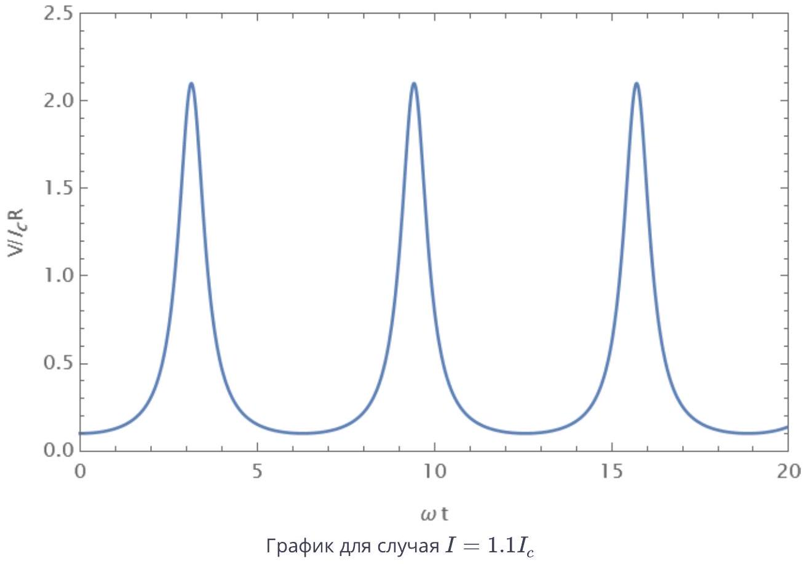
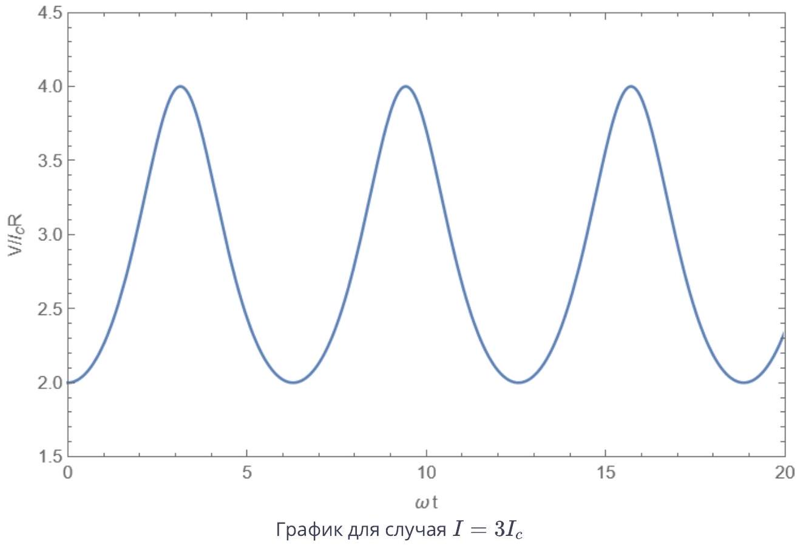

А1 ${ } ^ { 0.50 }$ Пусть в начальный момент времени $t = 0$ ток через контакт равен нулю. В этот момент на контакт подали напряжение $V$. Определите зависимость тока от времени $I ( t )$. Выразите ответ через $\Phi _ { 0 } , V , I _ { c } , R$.

Напряжение задает производную разности фаз на контакте

$$
\dot { \varphi } = \frac { 2 \pi } { \Phi _ { 0 } } V .
$$

Поскольку до включения напряжения ток равен нулю, начальная фаза $\varphi ( 0 ) = 0$. (При включении напряжения фаза не может измениться мгновенно, поскольку быстрое изменение фазы приводит к бесконечно большому напряжению.) Тогда фаза имеет вид

$$
\varphi = \frac { 2 \pi } { \Phi _ { 0 } } V t .
$$

Тогда полный ток складывается из нормального тока $I _ { n } = V / R$ и сверхпроводящего тока $I _ { s } = I _ { c } \sin \varphi$

Ответ:

$$
I = \frac { V } { R } + I _ { c } \sin \left( \frac { 2 \pi } { \Phi _ { 0 } } V t \right)
$$

А2 ${ } ^ { 0.50 }$ Пусть через контакт пропускается постоянный ток $I > I _ { c }$. Запишите дифференциальное уравнение для $\varphi ( t )$.

Запишем полный ток как сумму нормального тока и сверхпроводящего, выразив напряжение через производную фазы, в результате получим

Ответ:

$$
I = I _ { c } \sin \varphi + \frac { \Phi _ { 0 } } { 2 \pi R } \dot { \varphi }
$$

А3 ${ } ^ { 0.70 }$ Продифференцируйте уравнение по времени. Исключите из уравнения фазы и получите выражение для $\dot { V } ( t ) ^ { 2 }$ через $V , I$ и параметры системы.

Дифференцируя уравнение, получим

$$
\left( I _ { c } \cos \varphi \right) \dot { \varphi } + \frac { \Phi _ { 0 } } { 2 \pi R } \ddot { \varphi } = 0 .
$$

Производную $\dot { \varphi }$ выразим через напряжение

$$
V \left( I _ { c } \cos \varphi \right) + \frac { \Phi _ { 0 } } { 2 \pi R } \dot { V } = 0 ,
$$

а косинус фазы - через синус из исходного уравнения,

$$
I _ { c } \sin \varphi = I - \frac { V } { R } , \quad I _ { c } ^ { 2 } \cos ^ { 2 } \varphi = I _ { c } ^ { 2 } - \left( I - \frac { V } { R } \right) ^ { 2 } ,
$$

Окончательно получим

Ответ:

$$
\dot { V } ^ { 2 } = \left( \frac { 2 \pi R } { \Phi _ { 0 } } \right) ^ { 2 } V ^ { 2 } \left( I _ { c } ^ { 2 } - \left( I - \frac { V } { R } \right) ^ { 2 } \right)
$$

А4 ${ } ^ { 0.30 }$ В предыдущем уравнении перейдите к переменной $u = 1 / V$, выразите $\dot { u } ^ { 2 }$ через $u , I$ и параметры системы.

Выразим производную напряжения

$$
\dot { V } = - \frac { \dot { u } } { u ^ { 2 } } ,
$$

подставим в уравнение

$$
\frac { \dot { u } ^ { 2 } } { u ^ { 4 } } = \left( \frac { 2 \pi R } { \Phi _ { 0 } } \right) ^ { 2 } \frac { 1 } { u ^ { 2 } } \left( I _ { c } ^ { 2 } - \left( I - \frac { 1 } { R u } \right) ^ { 2 } \right) .
$$

Домножая на $u ^ { 4 }$, получим

Ответ:

$$
\dot { u } ^ { 2 } = \left( \frac { 2 \pi R } { \Phi _ { 0 } } \right) ^ { 2 } \left( I _ { c } ^ { 2 } u ^ { 2 } - \left( I u - \frac { 1 } { R } \right) ^ { 2 } \right)
$$

A5 ${ } ^ { \mathbf { 0 . 8 0 } }$ У вас должно получиться уравнение, аналогичное закону сохранения энергий для колебаний гармонического осциллятора. Определите частоту колебаний $\omega$, значение $u _ { 0 }$, относительно которого происходят колебания, и амплитуду колебаний $A$.

Продифференцировав уравнение из предыдущего пункта, получим уравнение колебаний

$$
\ddot { u } = - \left( \frac { 2 \pi R } { \Phi _ { 0 } } \right) ^ { 2 } \left( \left( I ^ { 2 } - I _ { c } ^ { 2 } \right) u - \frac { I } { R } \right) .
$$

Из коэффициента перед $u$ находим частоту колебаний

$$
\omega = \frac { 2 \pi R } { \Phi _ { 0 } } \sqrt { I ^ { 2 } - I _ { 0 } ^ { 2 } }
$$

а также положение равновесия

$$
u _ { 0 } = \frac { I } { R \left( I ^ { 2 } - I _ { c } ^ { 2 } \right) } .
$$

Для того, чтобы найти амплитуду колебаний, определим значения $u$, при которых $\dot { u } = 0$, получим квадратное уравнение

$$
\left( I ^ { 2 } - I _ { c } ^ { 2 } \right) u ^ { 2 } - \frac { 2 I } { R } u + \frac { 1 } { R ^ { 2 } } = 0 ,
$$

корни которого

$$
u = \frac { 1 } { I ^ { 2 } - I _ { c } ^ { 2 } } \left( \frac { I } { R } \pm \frac { I _ { c } } { R } \right) , \quad u _ { 1 } = \frac { 1 } { R \left( I + I _ { c } \right) } , \quad u _ { 2 } = \frac { 1 } { R \left( I - I _ { c } \right) } .
$$

Тот же результат можно найти, определив максимальное и минимальное значения напряжения из уравнения

$$
I = I _ { c } \sin \varphi + \frac { V } { R } , \quad V _ { \min } = R \left( I - I _ { c } \right) , \quad V _ { \max } = R \left( I + I _ { c } \right) .
$$

Тогда амплитуда

$$
A = \frac { 1 } { 2 } \left( u _ { 2 } - u _ { 1 } \right) = \frac { I _ { c } } { R \left( I ^ { 2 } - I _ { c } ^ { 2 } \right) } .
$$

Ответ:

$$
\omega = \frac { 2 \pi R } { \Phi _ { 0 } } \sqrt { I ^ { 2 } - I _ { 0 } ^ { 2 } } ; \quad u _ { 0 } = \frac { I } { R \left( I ^ { 2 } - I _ { c } ^ { 2 } \right) } ; \quad A = \frac { I _ { c } } { R \left( I ^ { 2 } - I _ { c } ^ { 2 } \right) } .
$$

А6 ${ } ^ { 0.20 }$ Запишите зависимость $V ( t )$. Считайте, что при $t = 0$ значение $V ( t )$ имеет минимум.

Зависимость величины $u$ от времени

$$
u = u _ { 0 } + A \cos \omega t ,
$$

где фаза определяется тем условием, что $V$ минимальна в начальный момент времени, а значит $u$ максимальна.

Ответ:

$$
V = \frac { R \left( I ^ { 2 } - I _ { c } ^ { 2 } \right) } { I + I _ { c } \cos \left( \frac { 2 \pi R } { \Phi _ { 0 } } \sqrt { I ^ { 2 } - I _ { 0 } ^ { 2 } } t \right) }
$$

А7 ${ } ^ { 0.60 }$ Постройте качественные графики зависимости $V ( t )$ для случаев $I = 1.1 I _ { c }$ и $I = 3 I _ { c }$, укажите координаты характерных точек.

Ответ:

Ответ:

A8 ${ } ^ { 0,80 }$ Найдите среднее (по времени) значение напряжения на контакте. Выразите ответ через $R , I , I _ { c }$.

Выразим напряжение через производную фазы и проинтегрируем по времени

$$
V = \frac { \Phi _ { 0 } } { 2 \pi } \dot { \varphi } , \quad \int _ { 0 } ^ { T } V ( t ) d t = \frac { \Phi _ { 0 } } { 2 \pi } ( \varphi ( T ) - \varphi ( 0 ) )
$$

Если $T$ - период колебаний, то $\varphi ( T ) - \varphi ( 0 ) = 2 \pi$, а среднее значение напряжения равно

$$
\langle V \rangle = \frac { 1 } { T } \int _ { 0 } ^ { T } V ( t ) d t = \frac { \Phi _ { 0 } } { T } = \frac { \Phi _ { 0 } } { 2 \pi } \omega = R \sqrt { I ^ { 2 } - I _ { 0 } ^ { 2 } }
$$

Этот же результат можно получить интегрированием явного выражения для $V ( t )$

$$
\langle V \rangle = \frac { 1 } { T } \int _ { 0 } ^ { T } V ( t ) d t = \frac { 1 } { T } \int _ { 0 } ^ { T } \frac { R \left( I ^ { 2 } - I _ { c } ^ { 2 } \right) } { I + I _ { c } \cos ( \omega t ) } d t = \frac { 1 } { 2 \pi } \int _ { 0 } ^ { 2 \pi } \frac { R \left( I ^ { 2 } - I _ { c } ^ { 2 } \right) } { I + I _ { c } \cos \theta } d \theta
$$

где $\theta = \omega t$. Этот интеграл можно вычислить с помощью подстановки

$$
\begin{gathered}
\xi = \tan \frac { \theta } { 2 } , \cos \theta = \frac { 1 - t ^ { 2 } } { 1 + t ^ { 2 } } , d \theta = \frac { 2 d t } { 1 + t ^ { 2 } } \\
\int _ { 0 } ^ { 2 \pi } \frac { d \theta } { I + I _ { c } \cos \theta } = \int _ { - \pi } ^ { \pi } \frac { d \theta } { I + I _ { c } \cos \theta } = \int _ { - \infty } ^ { \infty } \frac { \frac { 2 d t } { 1 + t ^ { 2 } } } { I + I _ { c } \frac { 1 - t ^ { 2 } } { 1 + t ^ { 2 } } } = 2 \int _ { - \infty } ^ { \infty } \frac { d t } { I + I _ { c } + \left( I - I _ { c } \right) t ^ { 2 } } = \frac { 2 \pi } { \sqrt { I ^ { 2 } - I _ { c } ^ { 2 } } }
\end{gathered}
$$

Отсюда получается тот же ответ

Ответ:

$$
V = R \sqrt { I ^ { 2 } - I _ { c } ^ { 2 } }
$$

А9 ${ } ^ { 0.70 }$ Определите зависимость энергии $E ( \varphi )$ джозефсоновского контакта в зависимости от разности фаз $\varphi$ на нем. В ответ также могут входить $\Phi _ { 0 }$ и $I _ { c }$. считайте, что $E ( 0 ) = 0$.

Мощность источника

$$
P = I V = I _ { s } V = I _ { c } \sin \varphi \frac { \Phi _ { 0 } } { 2 \pi } \dot { \varphi }
$$

Вклад нормального тока в мощность имеет вид

$$
P _ { n } = I _ { n } V = \frac { 1 } { R } \left( \frac { \Phi _ { 0 } } { 2 \pi } \right) ^ { 2 } \dot { \varphi } ^ { 2 } .
$$

При увеличении характерного времени изменения фазы $T$ эта мощность изменяется как $1 / T ^ { 2 }$, поэтому полное выделившееся тепло ведет себя как $\left( 1 / T ^ { 2 } \right) T \sim 1 / T$ и его можно сделать сколь угодно малым, увеличивая $T$.
Интегрируя по времени, найдем работу, совершенную источником.

$$
A = \frac { \Phi _ { 0 } I _ { c } } { 2 \pi } \int \sin \varphi \dot { \varphi } d t = \frac { \Phi _ { 0 } I _ { c } } { 2 \pi } \int _ { 0 } ^ { \varphi } \sin \varphi d \varphi = \frac { \Phi _ { 0 } I _ { c } } { 2 \pi } ( 1 - \cos \varphi )
$$

Эта работа и равна энергии джозефсоновского контакта.

Ответ:

$$
E = \frac { \Phi _ { 0 } I _ { c } } { 2 \pi } ( 1 - \cos \varphi )
$$

А10 ${ } ^ { 0.20 }$ Для типичного джозефсоновского контакта значение критического тока $I _ { c } = 0.5 \mathrm {~mA}$, сопротивление $R = 0.7$ Ом. Фундаментальные постоянные $e = 1.602 \times 10 ^ { - 19 }$ Кл, $\hbar = 1.055 \times 10 ^ { - 34 }$ Дж с с. Найдите численное значение энергии джозефсоновского контакта $E ( \pi )$ и частоту колебаний напряжения при постоянном токе через контакт $I = 2 I _ { c }$.

$$
\begin{aligned}
& E ( \pi ) = \frac { \hbar I _ { c } } { e } = 3.3 \times 10 ^ { - 19 } \text { Дж, } \\
& \omega = 2 \sqrt { 3 } \frac { e R I _ { c } } { \hbar } = 1.84 \times 10 ^ { 12 } \mathrm { c } ^ { - 1 }
\end{aligned}
$$

В1 ${ } ^ { 0.30 }$ Пусть в контакт втекает постоянный ток $I$ (см. рис. во введении к задаче). Запишите дифференциальное уравнение, описывающее изменение разности фаз $\varphi$. В ответ также могут входить $\Phi _ { 0 } , R , C , I _ { c }$.

К выражению для тока из части А2 нужно добавить ток, который идет на зарядку конденсатора, $I _ { C } = \dot { q } = C \dot { V }$, причем производная напряжения выражается через вторую производную фазы

Ответ:

$$
I = I _ { c } \sin \varphi + \frac { \Phi _ { 0 } } { 2 \pi R } \dot { \varphi } + \frac { \Phi _ { 0 } C } { 2 \pi } \ddot { \varphi }
$$

В2 ${ } ^ { 0.60 }$ Пусть внешний ток равен нулю, а разность фаз $\varphi \ll 1$. В этом случае $\varphi$ (а значит и другие величины, характеризующие контакт) будет совершать затухающие колебания. Определите частоту колебаний $\omega _ { p }$.

При малых значениях фазы уравнение имеет вид (после деления на коэффициент перед второй производной)

$$
\ddot { \varphi } + \frac { 1 } { R C } \dot { \varphi } + \frac { 2 \pi I _ { c } } { \Phi _ { 0 } C } \varphi = 0 .
$$

Это уравнение имеет стандартный вид уравнения затухающих колебаний

$$
\ddot { \varphi } + 2 \gamma \dot { \varphi } + \omega _ { 0 } ^ { 2 } \varphi = 0 ,
$$

с коэффициентами

$$
\omega _ { 0 } ^ { 2 } = \frac { 2 \pi I _ { c } } { \Phi _ { 0 } C } , \quad \gamma = \frac { 1 } { 2 R C }
$$

Тогда частота $\omega = \sqrt { \omega _ { 0 } ^ { 2 } - \gamma ^ { 2 } }$, Этот ответ можно получить, подставит в уравнение решение вида $\varphi = A e ^ { i \omega t }$, найдя соответствующие значения $\omega$ и взяв вещественную часть.

Ответ:

$$
\omega _ { p } = \sqrt { \frac { 2 \pi I _ { c } } { \Phi _ { 0 } C } - \frac { 1 } { 4 R ^ { 2 } C ^ { 2 } } }
$$

В3 ${ } ^ { \mathbf { 0 . 6 0 } }$ Определите добротность колебательной системы из предыдущего пункта $Q$. При каких значениях емкости в системе возможны колебания, а не затухающее движение?

Добротность можно выразить как

$$
Q = \frac { \omega _ { 0 } } { 2 \gamma } = R \sqrt { \frac { 2 e I _ { c } C } { \hbar } } .
$$

Колебания возможны, пока значение $\omega _ { p }$ вещественно, иначе решение уравнения на $\varphi$ будет представлять собой сумму затухающих экспонент, отсюда находим

$$
C \geq \frac { \Phi _ { 0 } } { 8 \pi R ^ { 2 } I _ { c } } .
$$

Ответ:

$$
Q = R \sqrt { \frac { 2 e I _ { c } C } { \hbar } } , \quad C \geq \frac { \Phi _ { 0 } } { 8 \pi R ^ { 2 } I _ { c } } .
$$

С1 ${ } ^ { 1.20 }$ Пусть критические токи через контакты равны $I _ { a c }$ и $I _ { b c }$ соответственно. Тогда максимальный сверхпроводящий ток $I$, который может течь через такой контакт, будет зависеть от магнитного потока через интерферометр. Определите это максимальное значение $I _ { 0 }$, а также косинусы разностей фаз $\varphi _ { a } , \varphi _ { b }$, при которых этот максимум достигается. Выразите ответ через $I _ { a c } , I _ { b c } , \Phi , \Phi _ { 0 }$. Ваши ответы не должны содержать обратных тригонометрических функций.

Полный ток через контакты равен

$$
I = I _ { a } + I _ { b } = I _ { a c } \sin \varphi _ { a } + I _ { b c } \sin \varphi _ { b } .
$$

Используем соотношение между фазами $\varphi _ { b } = \varphi _ { a } - \Delta \varphi$, где $\Delta \varphi = 2 \pi \Phi / \Phi _ { 0 }$, получим после преобразований

$$
I = I _ { a c } \sin \varphi _ { a } + I _ { b c } \sin \left( \varphi _ { a } - \Delta \varphi \right) = \left( I _ { a c } + I _ { b c } \cos \Delta \varphi \right) \sin \varphi _ { a } - I _ { b c } \sin \Delta \varphi \cos \varphi _ { a } = I _ { 0 } \sin \left( \varphi _ { a } - \psi \right) ,
$$

где амплитуда

$$
I _ { 0 } ^ { 2 } = \left( I _ { a c } + I _ { b c } \cos \Delta \varphi \right) ^ { 2 } + \left( I _ { b c } \sin \Delta \varphi \right) ^ { 2 } = I _ { a c } ^ { 2 } + I _ { b c } ^ { 2 } + 2 I _ { a c } I _ { b c } \cos \Delta \varphi ,
$$

а фаза определяется соотношениями

$$
I _ { 0 } \cos \psi = I _ { a c } + I _ { b c } \cos \Delta \varphi , \quad I _ { 0 } \sin \psi = I _ { b c } \sin \Delta \varphi .
$$

Ток будет максимальным, если аргумент синуса равен $\pi / 2$, то есть $\varphi _ { a } = \psi + \pi / 2$, откуда

$$
\cos \varphi _ { a } = - \sin \psi = - \frac { I _ { b c } \sin \Delta \varphi } { \sqrt { I _ { a c } ^ { 2 } + I _ { b c } ^ { 2 } + 2 I _ { a c } I _ { b c } \cos \Delta \varphi } } .
$$

Косинус второй фазы можно получить, используя симметрию между контактами $a$ и $b$ (если записать выражение для $I _ { 0 }$ через $\varphi _ { b }$, выражение будет отличаться только заменой $a$ на $b$ в индексах и изменением знака $\Delta \varphi$ ). Иначе его можно найти прямым вычислением

$$
\cos \varphi _ { b } = \cos \left( \varphi _ { a } - \Delta \varphi \right) = \cos \varphi _ { a } \cos \Delta \varphi + \sin \varphi _ { a } \sin \Delta \varphi .
$$

Подставив выражения для косинуса и синуса через $\psi$, получим

$$
\begin{gathered}
\cos \varphi _ { b } = - \sin \psi \cos \Delta \varphi + \cos \psi \sin \Delta \varphi = - \frac { I _ { b c } \sin \Delta \varphi } { I _ { 0 } } \cos \Delta \varphi + \frac { I _ { a c } + I _ { b c } \cos \Delta \varphi } { I _ { 0 } } \sin \Delta \varphi , \\
\cos \varphi _ { b } = \frac { I _ { a c } \sin \Delta \varphi } { \sqrt { I _ { a c } ^ { 2 } + I _ { b c } ^ { 2 } + 2 I _ { a c } I _ { b c } \cos \Delta \varphi } } .
\end{gathered}
$$

Ответ:

$$
I _ { 0 } = \sqrt { I _ { a c } ^ { 2 } + I _ { b c } ^ { 2 } + 2 I _ { a c } I _ { b c } \cos \left( 2 \pi \frac { \Phi } { \Phi _ { 0 } } \right) }
$$

$$
\begin{aligned}
& \cos \varphi _ { a } = - \frac { I _ { b c } \sin \left( 2 \pi \frac { \Phi } { \Phi _ { 0 } } \right) } { \sqrt { I _ { a c } ^ { 2 } + I _ { b c } ^ { 2 } + 2 I _ { a c } I _ { b c } \cos \left( 2 \pi \frac { \Phi } { \Phi _ { 0 } } \right) } } \\
& \cos \varphi _ { b } = \frac { I _ { a c } \sin \left( 2 \pi \frac { \Phi } { \Phi _ { 0 } } \right) } { \sqrt { I _ { a c } ^ { 2 } + I _ { b c } ^ { 2 } + 2 I _ { a c } I _ { b c } \cos \left( 2 \pi \frac { \Phi } { \Phi _ { 0 } } \right) } }
\end{aligned}
$$
