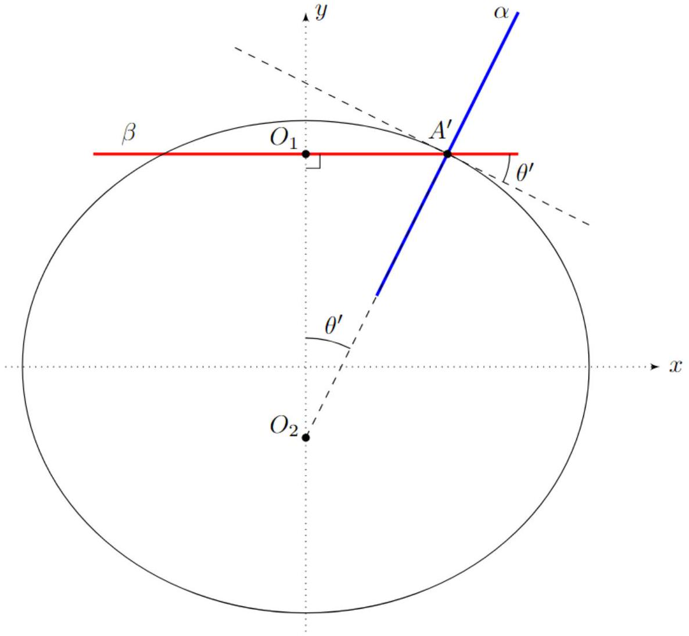

А1 ${ } ^ { 0.30 }$ Чему равен поток вектора относительной скорости жидкости через произвольную замкнутую поверхность, не пересекающую поверхность шара? Ответ обоснуйте.
Примечание: потоком вектора относительной скорости жидкости через замкнутую поверхность называется величина $\Phi$, определяемая выражением:

$$
\Phi = \oint _ { S } \vec { v } _ { \text {отн } } ( \vec { r } ) d \vec { S }
$$

В силу несжимаемости жидкости её масса внутри выбранной поверхности постоянна:

$$
0 = \frac { d m } { d t } = \oint \rho \vec { v } \cdot \overrightarrow { d S } = \rho \Phi
$$

Ответ:

$$
\Phi = 0
$$

A2 ${ } ^ { 0.10 }$ Чему равна нормальная компонента скорости жидкости $v _ { \text {отн } , n }$ в системе отсчёта, связанной с шаром?

Ответ: $v _ { \text {отн. } . n } = 0$

А3 ${ } ^ { 0.10 }$ Чему равна относительная скорость жидкости $\vec { v } _ { \infty }$ на бесконечном удалении от шара?

Ответ: Теорема о циркуляции и теорема Гаусса (п. А1) в дифференицальной форме:

$$
\begin{gathered}
\vec { \nabla } \times \vec { v } _ { \text {отн } } = 0 \\
\vec { \nabla } \vec { v } _ { \text {отн } } = 0
\end{gathered}
$$

Граничные условия:

$$
\begin{aligned}
& v _ { \text {OTH } , n } = 0 \\
& \vec { v } _ { \text {OTH } } ( \infty ) = - \vec { v } _ { 0 }
\end{aligned}
$$

A4 ${ } ^ { 0.40 }$ Рассмотрим сверхпроводящее тело, помещенное в однородное магнитное поле с индукцией $\vec { B } _ { 0 }$. Напишите выражение для циркуляции магнитного поля $\vec { B } ( \vec { r } )$ по контуру, не пересекающему поверхность сверхпроводника, и выражение для потока магнитного поля через замкнутую поверхность, не пересекающую поверхность сверхпроводника. Также укажите граничные условия магнитного поля на границе тела и на бесконечном удалении от него.

Ответ: Теорема о циркуляции и теорема Гаусса (п. А1) в дифференицальной форме:

$$
\begin{gathered}
\vec { \nabla } \times B = 0 \\
\vec { \nabla } \vec { B } = 0
\end{gathered}
$$

Граничные условия:

$$
\begin{aligned}
& B _ { \text {отн, } n } = 0 \\
& \vec { B } _ { \text {отн } } ( \infty ) = \vec { B } _ { 0 }
\end{aligned}
$$

А5 ${ } ^ { 0.80 }$ Поместим сверхпроводящий шар радиусом $R$ в однородное магнитное поле с индукцией $\vec { B } _ { 0 }$. Найдите индукцию магнитного поля $\vec { B } ( \vec { r } )$ во всем пространстве вне шара. Ответ выразите через $\vec { B } _ { 0 } , \vec { r }$ и $R$.

Известно,что поле сверхпроводящего шара, помещённого в однородное магнитное магнитное поле совпадет с полем магнитного диполя.Выражение для суммарного магнитного поля принимает вид

$$
\vec { B } = \vec { B } _ { 0 } + \frac { \mu _ { 0 } } { 4 \pi } \left( \frac { 3 ( \vec { m } \vec { r } ) \vec { r } } { r ^ { 5 } } - \frac { \vec { m } } { r ^ { 3 } } \right)
$$

где $m$ - магнитный момент.
Из условия нулевой нормальной составляющей магнитного поля на поверхности шара получим

$$
( \vec { B } \vec { r } ) = \left( \vec { B } _ { 0 } \vec { r } \right) + \frac { \mu _ { 0 } } { 2 \pi } \frac { ( \vec { m } \vec { r } ) } { R ^ { 4 } } = 0
$$

Из последнего соотношения находим магнитный момент шара

$$
\vec { m } = - \frac { 2 \pi R ^ { 3 } } { \mu _ { 0 } } \vec { B } _ { 0 }
$$

После нахождения магнитного момента выражение для магнитного поля принимает вид:

Ответ:

$$
\vec { B } = \vec { B } _ { 0 } - \frac { 3 R ^ { 3 } \left( \vec { B } _ { 0 } \vec { r } \right) \vec { r } } { 2 r ^ { 5 } } + \frac { \vec { B } _ { 0 } R ^ { 3 } } { 2 r ^ { 3 } }
$$

А6 ${ } ^ { 0.20 }$ Пользуясь результатами предыдущих пунктов, найдите зависимость $\vec { v } _ { \text {отн } } ( \vec { r } )$.

Система уравнений на $\vec { v } _ { \text {отн } } ( \vec { r } )$ совпадает с системой уравнений на $\vec { B } ( \vec { r } )$ с точностью до замены $\vec { B } _ { 0 } = - \vec { v } _ { 0 }$.

Ответ:

$$
\vec { v } _ { \text {OTH } } ( \vec { r } ) = - \vec { v } _ { 0 } + \frac { 3 R ^ { 3 } \left( \overrightarrow { v _ { 0 } } \vec { r } \right) \vec { r } } { 2 r ^ { 5 } } - \frac { \vec { v } _ { 0 } R ^ { 3 } } { 2 r ^ { 3 } }
$$

A7 ${ } ^ { 0.40 }$ Рассмотрим стационарное движение несжимаемой жидкости с нулевой вязкостью по тонкой трубке. Пусть $p$ - давление в жидкости, $\varphi$ - потенциальная энергия единицы массы жидкости, а $v$ - скорость течения в трубе.
Используя законы сохранения энергии и массы, покажите, что для всех точек трубки выполняется соотношение (уравнение Бернулли):

$$
\varphi + \frac { p } { \rho } + \frac { v _ { \text {отн } } ^ { 2 } } { 2 } = \text { const }
$$

Ответ: В системе отсчёта шара распределение скоростей в пространстве, а значит и линии тока, не зависят от времени. Выделим одну линию тока, через которую протекает массовый расход $\frac { d m } { d t } = \rho \frac { d v } { d t }$. В выберем две точки (1) и (2) в этой линии тока. Рассмотрим жидкость, заключенную между этими двумя точками. Мощность внешней силы давления в точке (1) равна $P _ { 1 } = p _ { 1 } \frac { d V } { d t } = p _ { 1 } \frac { d m } { d t } / \rho$, а в точке (2) равна $P _ { 2 } = - p _ { 2 } \frac { d V } { d t } = p _ { 2 } \frac { d m } { d t } / \rho$. За время $d t$ работа сил давлений уходит на разгон кусочка жидкости массой $d m$ от скорости $v _ { 1 }$ до скорости $v _ { 2 }$ :

$$
\begin{gathered}
\left( P _ { 1 } + P _ { 2 } \right) \cdot d t = d m \left( \frac { v _ { 2 } ^ { 2 } } { 2 } - \frac { v _ { 1 } ^ { 2 } } { 2 } \right) \\
p _ { 1 } / \rho - p _ { 2 } / \rho = \frac { v _ { 2 } ^ { 2 } } { 2 } - \frac { v _ { 1 } ^ { 2 } } { 2 } \\
p _ { 1 } + \frac { \rho v _ { 1 } ^ { 2 } } { 2 } = p _ { 2 } + \frac { \rho v _ { 2 } ^ { 2 } } { 2 }
\end{gathered}
$$

Что и требовалось доказать.

А8 ${ } ^ { 0.60 }$ Считая, что давление на бесконечном удалении от шара равно $p _ { 0 }$, найдите зависимость $p ( \theta )$ на поверхности шара. Выразите ответ через $p _ { 0 } , \rho , v _ { 0 } , \theta$.

Запишем уравнение Бернулли, полученое в пункте А7 в двух точках - на бесконечности и на поверхности шара:

$$
\begin{aligned}
& p ( \theta ) + \frac { \rho v _ { \text {пов } } ^ { 2 } ( \theta ) } { 2 } = p _ { 0 } + \frac { \rho v _ { 0 } ^ { 2 } } { 2 } \\
& p ( \theta ) = p _ { 0 } + \frac { \rho \left( v _ { 0 } ^ { 2 } - v _ { \text {пов } } ^ { 2 } ( \theta ) \right) } { 2 }
\end{aligned}
$$

В формулу из пункта А6 подставим $r = R$ :

$$
\begin{gathered}
\vec { v } _ { \text {пов } } \left( \vec { e } _ { r } \right) = - \vec { v } _ { 0 } + \frac { 3 \left( \vec { v } _ { 0 } \vec { e } _ { r } \right) \vec { e } _ { r } } { 2 } - \frac { \vec { v } _ { 0 } } { 2 } = \frac { 3 } { 2 } \left( - \vec { v } _ { 0 } + \left( \vec { v } _ { 0 } \vec { e } _ { r } \right) \vec { e } _ { r } \right) \\
\vec { v } _ { \text {пов } } ^ { 2 } \left( \vec { e } _ { r } \right) = \frac { 9 } { 4 } \left( v _ { 0 } ^ { 2 } - 2 \left( \vec { v } _ { 0 } \vec { e } _ { r } \right) ^ { 2 } + \left( \vec { v } _ { 0 } \vec { e } _ { r } \right) ^ { 2 } \right) = \frac { 9 } { 4 } \left( v _ { 0 } ^ { 2 } - \left( \vec { v } _ { 0 } \vec { e } _ { r } \right) ^ { 2 } \right) = \frac { 9 } { 4 } v _ { 0 } ^ { 2 } \sin ^ { 2 } \theta
\end{gathered}
$$

Ответ:

$$
p ( \theta ) = p _ { 0 } + \frac { \rho v _ { 0 } ^ { 2 } } { 2 } \left( 1 - \frac { 9 } { 4 } \sin ^ { 2 } \theta \right)
$$

А9 ${ } ^ { 0.40 }$ Вычислите равнодействующую сил давления, действующих на поверхность шара. Выразите ответ через $\overrightarrow { v _ { 0 } } , R , \rho$.

Ответ: Зависимость $p ( \theta )$ - чётная функция, а значит сила не изменится если мы начнём отсчитывать $\theta$ от противоположного полюса шара. Следовательно, компоненты силы, сонаправленной $\vec { v } _ { 0 }$, нет. Другие компоненты отсутствуют в силу симметрии.

А10 ${ } ^ { 0.10 }$ Найдите распределение скорости жидкости $\vec { v } ( \vec { r } )$ в лабораторной системе отсчёта.

Ответ:

$$
\vec { v } ( \vec { r } ) = \vec { v } _ { 0 } + \vec { v } _ { \mathrm { oTH } } ( \vec { r } ) = \frac { 3 R ^ { 3 } \left( \overrightarrow { v _ { 0 } } \vec { r } \right) \vec { r } } { 2 r ^ { 5 } } - \frac { \vec { v } _ { 0 } R ^ { 3 } } { 2 r ^ { 3 } }
$$

А11 ${ } ^ { 0,80 }$ Чему равна кинетическая энергия жидкости $E _ { k }$ в лабораторной системе отсчёта? Выразите ответ через $\rho , R , v _ { 0 }$.

Для вычисления кинетической энергии жидкости необходимо вычислить интеграл $\int \frac { \rho v ^ { 2 } d V } { 2 }$.
Выделим при данном угле $\theta$ сегмент с углом $d \theta$ и толщиной $d r$.Объём данного элемента равен $2 \pi r ^ { 2 } \sin ( \theta ) d r d \theta$.Тогда

$$
W _ { \mathrm { K } } = \int _ { R } ^ { \infty } \int _ { 0 } ^ { \pi } \rho \pi r ^ { 2 } \sin ( \theta ) d r d \theta v ^ { 2 } ( \theta )
$$

Найдём $v ^ { 2 } ( \theta )$ из теоремы косинусов

$$
v ^ { 2 } ( \theta ) = \frac { v ^ { 2 } \left( 1 + 3 \cos ^ { 2 } ( \theta ) \right) R ^ { 6 } } { 4 r ^ { 6 } }
$$

Комбинация последнего выражения и уже полученного интеграла даёт

$$
\begin{gathered}
\int _ { R } ^ { \infty } \frac { d r } { r ^ { 4 } } = \frac { 1 } { 3 R ^ { 3 } } \\
\int _ { 0 } ^ { \pi } \sin ( \theta ) \left( 1 + 3 \cos ^ { 2 } ( \theta ) \right) d \theta = \int _ { 1 } ^ { - 1 } - \left( d \cos ( \theta ) + 3 \cos ^ { 2 } ( \theta ) d \cos ( \theta ) \right) = 4
\end{gathered}
$$

Ответ:

$$
W _ { \mathrm { K } } = \frac { \pi \rho R ^ { 3 } v ^ { 2 } } { 3 }
$$

А12 ${ } ^ { 0.20 }$ Найдите присоединённую массу $\mu$. Выразите ответ через $\rho , R$.

Ответ:

$$
\mu = \frac { 2 W _ { \mathrm { K } } } { v ^ { 2 } } = \frac { 2 \pi \rho R ^ { 3 } } { 3 }
$$

А13 ${ } ^ { 0.30 }$ Рассмотрим шар, движущийся со скоростью $\vec { v } _ { 0 }$ и ускорением $\vec { a } _ { 0 }$. Используя выражение для импульса $\vec { p }$ жидкости, получите выражение для силы $\vec { F }$, действующей на шар со стороны жидкости. Ответ выразите через $\rho , R$ и $\vec { a } _ { 0 }$.

Согласно первому закону ньютона, на воду со стороны шара действует сила $- \vec { F }$ Второй закон Ньютона для жидкости:

$$
- \vec { F } = \frac { d } { d t } ( \vec { p } ) = \mu \vec { a } _ { 0 }
$$

Ответ:

$$
\vec { F } = - \mu \vec { a } _ { 0 }
$$

А14 ${ } ^ { 0.30 }$ Получите зависимость кривизны $K$ поверхности пузыря от угла $\theta$. Используйте $p _ { i n } , p _ { 0 } , \rho , \theta$ и $v _ { 0 }$. Примечание: кривизной $K$ поверхности называется сумма обратных главных радиусов кривизны:

$$
K = \frac { 1 } { R _ { 1 } } + \frac { 1 } { R _ { 2 } }
$$

Она связана с Лапласовым давлением как:

$$
\Delta p = \sigma K
$$

$$
\Delta P = p _ { i n } - p _ { 0 } - \frac { \rho v _ { 0 } ^ { 2 } } { 2 } + \frac { 9 \rho v _ { 0 } ^ { 2 } } { 8 } \sin ^ { 2 } ( \theta ) = \sigma K
$$

Ответ:

$$
K = \frac { 1 } { \sigma } \left( p _ { i n } - p _ { 0 } - \frac { \rho v _ { 0 } ^ { 2 } } { 2 } + \frac { 9 \rho v _ { 0 } ^ { 2 } } { 8 } \sin ^ { 2 } ( \theta ) \right)
$$

В $1 ^ { 0.60 }$ С учётом малости $\varepsilon$ величины $R _ { 1 }$ и $R _ { 2 }$ можно представить в виде:

$$
R _ { 1 } ( \theta ) \approx R \left( 1 + A _ { 1 } \varepsilon - B _ { 1 } \varepsilon \sin ^ { 2 } \theta \right) \quad R _ { 2 } \approx R \left( 1 + A _ { 2 } \varepsilon - B _ { 2 } \varepsilon \sin ^ { 2 } \theta \right) .
$$

Найдите $B _ { 1 }$ и $B _ { 2 }$. Далее слагаемыми $A _ { 1 } \varepsilon$ и $A _ { 2 } \varepsilon$ можно пренебречь.
Если вы не смогли решить данный пункт, то далее можно считать, что $B _ { 1 } = B _ { 2 } = 1$. К потере последующих баллов это не приводит.

Найдём радиус кривизны в плоскости ( $x , y$ ). Формула для радиуса кривизны в двумерных координатах:

$$
\begin{gathered}
R = \frac { \left( 1 + ( d y / d x ) ^ { 2 } \right) ^ { 3 / 2 } } { d ^ { 2 } y / d x ^ { 2 } } \\
\frac { d y } { d x } = \tan \theta
\end{gathered}
$$

Производные выразим через $\theta$ :

$$
\frac { d ^ { 2 } y } { d x ^ { 2 } } = \frac { 1 } { R \cos ^ { 3 } \theta }
$$

Затем мы растянули всё тело в $k$ раз по оси x . Первая и вторая производная $\frac { d y } { d x }$ и $\frac { d ^ { 2 } y } { d x ^ { 2 } }$ в каждой точке изменятся в $k$ раз.

$$
\begin{gathered}
R _ { 1 } ( \theta ) = \frac { \left( 1 + \left( d y ^ { \prime } / d x \right) ^ { 2 } \right) ^ { 3 / 2 } } { d ^ { 2 } y ^ { \prime } / d x ^ { 2 } } = \frac { \left( 1 + \left( k d y ^ { \prime } / d x \right) ^ { 2 } \right) ^ { 3 / 2 } } { k d ^ { 2 } y / ( d x ) ^ { 2 } } = \frac { \left( 1 + k ^ { 2 } \cdot ( d y / d x ) ^ { 2 } \right) ^ { 3 / 2 } } { k \cdot d ^ { 2 } y / d x ^ { 2 } } = \\
= k R \cos ^ { 3 } \theta \left( 1 + k ^ { 2 } \cdot \tan \theta ^ { 2 } \right) ^ { 3 / 2 } = \frac { R } { k } \cdot \left( \cos ^ { 2 } \theta + k ^ { 2 } \sin ^ { 2 } \theta \right) ^ { \frac { 3 } { 2 } }
\end{gathered}
$$

Считая $R \approx a$ :

$$
\begin{aligned}
& R _ { 1 } ( \theta ) = \frac { a } { k } \cdot \left( \cos ^ { 2 } \theta + k ^ { 2 } \sin ^ { 2 } \theta \right) ^ { \frac { 3 } { 2 } } = \frac { a } { 1 - \varepsilon } \cdot \left( \cos ^ { 2 } \theta + ( 1 - \varepsilon ) ^ { 2 } \sin \theta ^ { 2 } \right) ^ { \frac { 3 } { 2 } } \approx \\
& \quad \approx a ( 1 + \varepsilon ) \left( \cos ^ { 2 } \theta + ( 1 - 2 \varepsilon ) \sin ^ { 2 } \theta \right) ^ { \frac { 3 } { 2 } } = a ( 1 + \varepsilon ) \left( 1 - 2 \varepsilon \sin ^ { 2 } \theta \right) ^ { \frac { 3 } { 2 } } \approx \\
& \approx a ( 1 + \varepsilon ) \left( 1 - 3 \varepsilon \sin ^ { 2 } \theta \right) \approx a \left( 1 + \varepsilon - 3 \varepsilon \sin ^ { 2 } \theta \right) \approx R \left( 1 + \varepsilon - 3 \varepsilon \sin ^ { 2 } \theta \right)
\end{aligned}
$$

Получаем: $A _ { 1 } = 1 ; B _ { 1 } = 3$;
Теперь найдем радиус кривизны в плоскости $\alpha$, перпендикулярной $x , y$ и содержащей нормаль к поверхности в точке $A ^ { \prime }$. Тогда мы сможем воспользоваться формулой Лапласа для давления поверхностного натяжения.

На рисунке сверху $\alpha$ и $\beta$ - плоскости, перпендикулярные плоскости рисунка. В точке $A ^ { \prime }$, кривая, получаемая при сечении эллипсоида плоскостью $\beta$, имеет центр кривизны $O _ { 1 }$. Аналогично, кривая, получаемая при сечении эллипсоида плоскостью $\alpha$, имеет центр кривизны $O _ { 2 }$. Теорема Мёнье гласит, что так как $O _ { 2 }$ является главным центром кривизны, то его проекция на плоскость $\beta$ есть центр кривизны в этой плоскости - то есть $O _ { 1 }$.

$$
R _ { 2 } = R _ { \alpha } = R _ { \beta } / \sin \theta ^ { \prime }
$$

$R _ { \beta } = R \sin \theta$ - радиус кривизны в плоскости $\beta$. Он не меняется при растягивании. Тогда:

$$
R _ { 2 } = R \cdot \frac { \sin \theta } { \sin \theta ^ { \prime } }
$$

При этом $\theta ^ { \prime }$ также является углом наклона касательной к эллипсу в точке $A ^ { \prime }$ :

$$
\tan \theta ^ { \prime } = \left( \left| \frac { d y } { d x } \right| \right) _ { A ^ { \prime } } = k \cdot \left( \left| \frac { d y } { d x } \right| \right) _ { A } = k \tan \theta
$$

Тогда:

$$
\begin{gathered}
R _ { 2 } ( \theta ) = \frac { R \sin \theta } { \sin \theta ^ { \prime } } = R \frac { \tan \theta } { \sqrt { 1 + \tan ^ { 2 } \theta } } \cdot \frac { \sqrt { 1 + \tan ^ { 2 } \theta ^ { \prime } } } { \tan \theta ^ { \prime } } = \\
= R \frac { \tan \theta } { \sqrt { 1 + \tan ^ { 2 } \theta } } \cdot \frac { \sqrt { 1 + k ^ { 2 } \tan ^ { 2 } \theta } } { k \tan \theta } = \frac { R } { k } \sqrt { \frac { 1 + k ^ { 2 } \tan ^ { 2 } \theta } { 1 + \tan ^ { 2 } \theta } } = \frac { R } { k } \sqrt { \cos ^ { 2 } \theta + k ^ { 2 } \sin ^ { 2 } \theta }
\end{gathered}
$$

Считая $R \approx a$ :

$$
\begin{aligned}
& R _ { 2 } ( \theta ) = \frac { a } { k } \sqrt { \cos ^ { 2 } \theta + k ^ { 2 } \sin ^ { 2 } \theta } = \frac { a } { 1 - \varepsilon } \sqrt { \cos ^ { 2 } \theta + ( 1 - \varepsilon ) ^ { 2 } \sin ^ { 2 } \theta } \approx \\
& \approx a ( 1 + \varepsilon ) \sqrt { \cos ^ { 2 } \theta + ( 1 - 2 \varepsilon ) \sin ^ { 2 } \theta } = a ( 1 + \varepsilon ) \sqrt { 1 - 2 \varepsilon \sin ^ { 2 } \theta } \approx \\
& \approx a ( 1 + \varepsilon ) \left( 1 - \varepsilon \sin ^ { 2 } \theta \right) \approx a \left( 1 + \varepsilon - \varepsilon \sin ^ { 2 } \theta \right) \approx R \left( 1 + \varepsilon - \varepsilon \sin ^ { 2 } \theta \right)
\end{aligned}
$$

Получаем: $A _ { 2 } = 1 ; B _ { 2 } = 1$;

В2 ${ } ^ { 0.20 }$ Найдите зависимость кривизны эллипсоида $K ( \theta )$ в первом порядке по $\varepsilon$. Выразите ответ через $R , \theta$.

$$
\begin{gathered}
K = \frac { 1 } { R \left( 1 - B _ { 1 } \varepsilon \sin ^ { 2 } \theta \right) } + \frac { 1 } { R \left( 1 - B _ { 2 } \varepsilon \sin ^ { 2 } \theta \right) } \approx \frac { 1 } { R } \left( 1 + B _ { 1 } \varepsilon \sin ^ { 2 } \theta + 1 + B _ { 2 } \varepsilon \sin ^ { 2 } \theta \right) = \\
= \frac { 1 } { R } \left( 2 + \left( B _ { 1 } + B _ { 2 } \right) \varepsilon \sin ^ { 2 } \theta \right) = \frac { 1 } { R } \left( 2 + 4 \varepsilon \sin ^ { 2 } \theta \right)
\end{gathered}
$$

Вз ${ } ^ { 0.60 }$ Чему равна величина $\varepsilon$ для пузыря, рассмотренного в пункте А14? Ответ выразите через скорость пузыря $v _ { 0 }$, радиус пузыря $R$, коэффициент поверхностного натяжения $\sigma$ и плотность жидкости $\rho$.

Воспользуемся формулой для Лапласова Давления:

$$
\Delta p = \sigma K
$$

Согласно пункту А13:

$$
\Delta P = p _ { i n } - p _ { 0 } - \frac { \rho v _ { 0 } ^ { 2 } } { 2 } + \frac { 9 \rho v _ { 0 } ^ { 2 } } { 8 } \sin ^ { 2 } ( \theta ) = \sigma / R \cdot \left( 2 + 4 \varepsilon \sin ^ { 2 } \theta \right)
$$

Так как равенство выполняется для всех углов $\theta$, то коэффициенты перед слагаемыми $\sin ^ { 2 } \theta$ должны быть равны:

$$
\frac { 9 \rho v _ { 0 } ^ { 2 } } { 8 } = \frac { 4 \varepsilon \sigma } { R }
$$

Ответ:

$$
\varepsilon = \frac { 9 R \rho v _ { 0 } ^ { 2 } } { 32 \sigma }
$$

B4 ${ } ^ { 0.30 }$ Чему равен эксцентриситет $e$ пузыря, рассмотренного в пункте A14? Ответ выразите через скорость пузыря $v _ { 0 }$, радиус пузыря $R$, коэффициент поверхностного натяжения $\sigma$ и плотность жидкости $\rho$.

$$
e = \frac { \sqrt { a ^ { 2 } - b ^ { 2 } } } { a } = \sqrt { 1 - ( 1 - \varepsilon ) ^ { 2 } } \approx \sqrt { 2 \varepsilon } = \sqrt { \frac { 9 R \rho v _ { 0 } ^ { 2 } } { 16 \sigma } }
$$

В5 ${ } ^ { 0.80 }$ Сферический пузырь с начальным диаметром $d = 2$ мм поднимается в воде плотностью $\rho = 10 ^ { 3 }$ кг/с и поверхностным натяжением $\sigma = 72 \cdot 10 ^ { - 3 } \mathrm { H } / \mathrm { m }$. Проведя необходимые измерения, вычислите скорость пузыря на последних трёх фотографиях. Также вычислите ускорение пузыря $a$.

$$
v _ { 2 } ^ { 2 } = v _ { 3 } ^ { 2 } - 2 a l _ { 23 }
$$

$l _ { 23 }$ можно получить сравнивая расстояние с горизонтальным диаметром пузырей на первых снимках.

$$
l _ { 23 } = 2.8 \mathrm { mM }
$$

Ответ:

$$
v _ { 1 } = 17 \mathrm {~cm} / \mathrm { c } , v _ { 2 } = 26 \mathrm {~cm} / \mathrm { c } , v _ { 3 } = 32 \mathrm {~cm} / \mathrm { c } , a = 6 \mathrm {~m} / \mathrm { c } ^ { 2 }
$$

С1 ${ } ^ { 0.60 }$ Чему равно его ускорение $a$ в начальный момент времени? Ответ выразите через $g$.

С пренебрегая массой воздуха:

$$
0 = 0 + \frac { 4 } { 3 } \pi R ^ { 3 } \rho g - \mu a - \pi R ^ { 2 } \rho v ^ { 2 }
$$

В начальный момент времени скорость пузыря равна нулю, а значит:

$$
a = \frac { \frac { 4 } { 3 } \pi R ^ { 3 } \rho } { \mu } g = 2 g
$$

Ответ:

$$
a = 2 g
$$

С2 ${ } ^ { 0.30 }$ Найдите установившуюся скорость пузыря $v _ { \max }$. Чему равно $\varepsilon$ при установившейся скорости? Ответы выразите через $R , g , \rho$ и $\sigma$.

Ускорение пузыря равно нулю:

$$
\begin{gathered}
0 = 0 + \frac { 4 } { 3 } \pi R ^ { 3 } \rho g - \pi R ^ { 2 } \rho v _ { \max } ^ { 2 } \\
v _ { \max } = \sqrt { \frac { 4 } { 3 } R g } \\
\varepsilon = \frac { 9 R \rho v _ { \max } ^ { 2 } } { 32 \sigma } = \frac { 9 R \rho } { 32 \sigma } \cdot \frac { 4 } { 3 } R g = \frac { 3 R ^ { 2 } \rho g } { 8 \sigma }
\end{gathered}
$$

с3 ${ } ^ { 0.60 }$ Рассчитайте численные значения $v _ { \text {max } }$ и $\varepsilon$ для $\rho = 10 ^ { 3 }$ кг $/ \mathrm { M } ^ { 3 } , \sigma = 72 \cdot 10 ^ { - 3 } \mathrm { H } / \mathrm { m } , g = 10 \mathrm {~m} / \mathrm { c } ^ { 2 }$ и $R = 1$ мм. Применима ли выбранная модель для указанного радиуса?

Ответ:

$$
\begin{gathered}
v _ { \max } = \sqrt { \frac { 4 } { 3 } R g } = 12 \text { см/с } \\
\varepsilon = \frac { 3 R ^ { 2 } \rho g } { 8 \sigma } = 5.2 \cdot 10 ^ { - 2 } \ll 1 \\
\varepsilon \ll 1 \Rightarrow \text { Модель применима }
\end{gathered}
$$

D1 ${ } ^ { 0.20 }$ Докажите, что давление воды в точках на поверхности пузыря постоянно.

Ответ: Давление над пузырем рассчитывается по формуле

$$
p = p _ { i n } - \sigma K
$$

где оба слагаемых постоянны.

D2 ${ } ^ { 1.00 }$ Найдите зависимость давления над поверхностью пузыря $p ( \theta )$, используя $\rho , v _ { 0 } , g , R , \theta$ и $h$.

Запишем уравнение Бернулли в системе отсчёта пузыря для линии тока с поверхности водоёма до некоторой точки на пузыре:

$$
p _ { 0 } + \rho g h + \frac { \rho v _ { 0 } ^ { 2 } } { 2 } = p ( \theta ) + \frac { \rho v ^ { 2 } ( \theta ) } { 2 } + \rho g R ( \cos \theta - 1 )
$$

Мы это можем сделать, так как линии тока в этой системе отсчёта постоянны в силу $h \gg R$ (Краевыми эффектами, возникающими на поверхности водоёма, пренебрегаем)

Согласно условию, распределение скоростей такое же, как в части A:

Ответ:

$$
p ( \theta ) = p _ { 0 } + \rho g h + \rho \frac { v _ { 0 } ^ { 2 } } { 2 } \rho g R ( 1 - \cos \theta ) - \frac { 9 } { 8 } \rho v _ { 0 } ^ { 2 } \sin ^ { 2 } \theta
$$

D3 ${ } ^ { 0.80 }$ Получите выражение для установившейся скорости пузыря $v _ { 0 }$. Рассчитайте значение для $R = 30$ см и $g = 10 \mathrm { м } / \mathrm { c } ^ { 2 }$.

Разложим формулу из предыдущего пункта до второго порядка по углу $\theta$ :

$$
p ( \theta ) = p _ { 0 } + \rho g h + \rho \frac { v _ { 0 } ^ { 2 } } { 2 } + \rho g R \cdot \theta ^ { 2 } / 2 - \frac { 9 } { 8 } \rho v _ { 0 } ^ { 2 } \cdot \theta ^ { 2 }
$$

Используя факт постоянства давления, приравняем коэффициенты перед $\theta ^ { 2 }$ :

$$
\rho g R / 2 = \frac { 9 } { 8 } \rho v _ { 0 } ^ { 2 }
$$

Ответ:

Ответ:

$$
v _ { 0 } = \sqrt { \frac { 4 } { 9 } R g } = 1.2 \mathrm {~m} / c
$$
