Рассчитаем угловой размер стороны квадрата. Так как $a \ll L$, то:

$$
\beta \approx \frac { a } { L } .
$$

Ответ:

$$
\beta \approx 6 ^ { \circ }
$$

Ответ:

$$
\beta \gg \alpha
$$

A2 ${ } ^ { 0.20 }$
Пусть теперь сторона квадратного отверстия равна $a = 5$ мМ. Найдите характерный угловой размер $\beta$ отверстия при взгляде с экрана. Сравните его с угловым размером Солнца.

Аналогично прошлому пункту:

$$
\beta \approx \frac { a } { L } .
$$

Ответ:

$$
\beta \approx 0.03 ^ { \circ }
$$

Ответ:

$$
\beta \ll \alpha
$$

A3 ${ } ^ { 0.30 }$
В листах ответов качественно приведите изображение Солнца при $a = 1$ М. Укажите размеры, характеризующие это изображение.

Изображение будет иметь вид квадрата с скруглёнными углами. Прямая часть стороны имеет длину $a$, радиус кривизны углов равен $r = \frac { \alpha L } { 2 } = 4.4$ см.

Ответ:
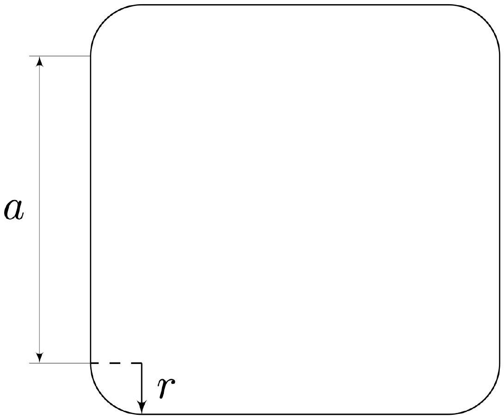

В этом случае изображение будет слабо отличаться от круга диаметром $D = \alpha L = 8.7$ см.

Ответ:
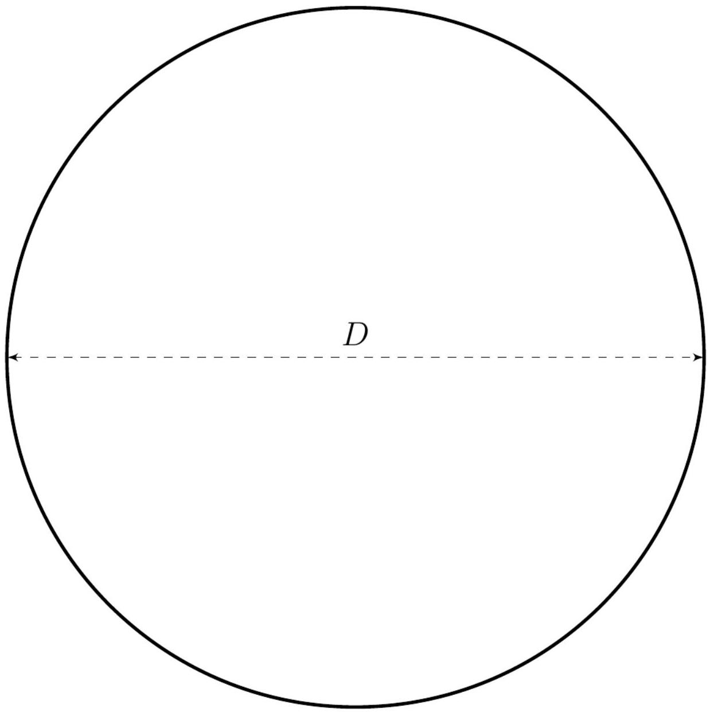

В1 ${ } ^ { 0.30 }$ Найдите зависимость размера $a$ изображения человека от времени $t$.

Из подобия треугольников $A O B$ и $A ^ { \prime } O B ^ { \prime }$ :

$$
\frac { a } { h } = \frac { L } { l _ { 0 } + v t } .
$$

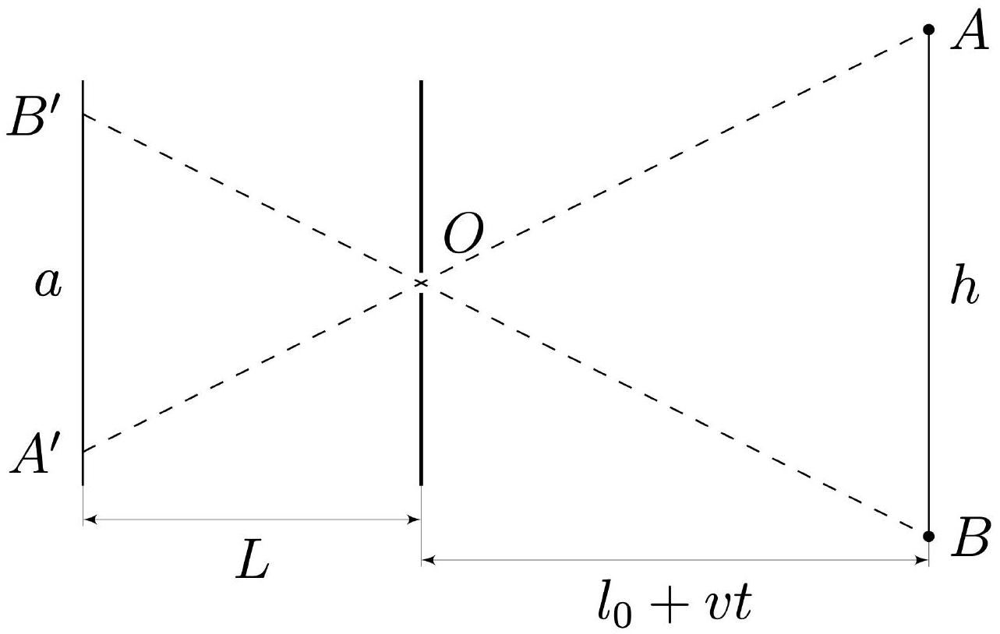

Ответ:

$$
a = \frac { L h } { l _ { 0 } + v t } .
$$

В2 ${ } ^ { 0.70 }$ На рисунке показаны изображения взрослого человека и Солнца (угловой размер Солнца $\alpha = 0.5 ^ { \circ }$ ) в неизвестном масштабе. Оцените, на каком расстоянии был взрослый человек в момент фотографирования.

Угловые размеры Солнца и человека одного порядка, поэтому можно считать, что все лучи параксиальные и размеры на фотографии пропорциональны угловым размерам.
Из рисунка отношение угловых размеров человека и Солнца:

$$
\frac { h / l } { \alpha } = \frac { 75 \mathrm {~mm} } { 30 \mathrm {~mm} } = \frac { 5 } { 2 } .
$$

Для оценки возьмём $h = 2$ м:

$$
l = \frac { 2 h } { 5 \alpha } \approx 90 \mathrm { м } .
$$

Ответ:

$$
l \approx 90 \mathrm { м }
$$

С1 ${ } ^ { 0.20 }$ Докажите, что изображение отрезка на фотографии будет отрезком или лучом.

Заметим, что $A , B , O$ и изображение отрезка лежат в одной плоскости, изображение $A B$ полностью лежит на прямой - пересечении этой плоскости с плоскостью экрана.
Если $A$ и $B$ находятся перед передней плоскостью камеры, то изображение будет отрезком.
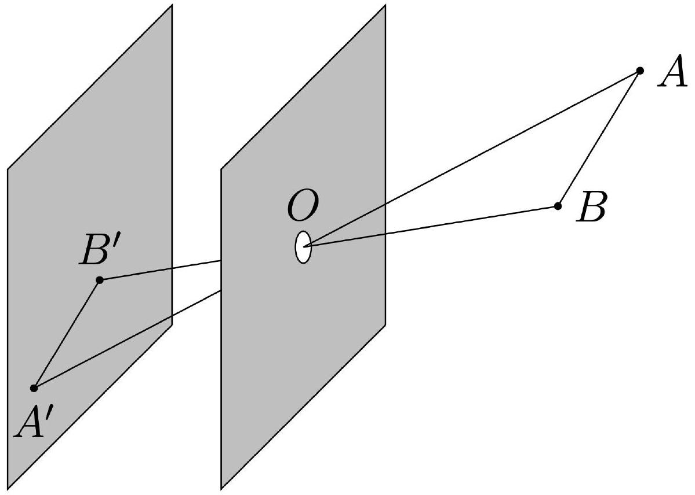

Если $A$ и $B$ находятся с разных сторон от передней плоскости камеры, то изображение будет лучом.
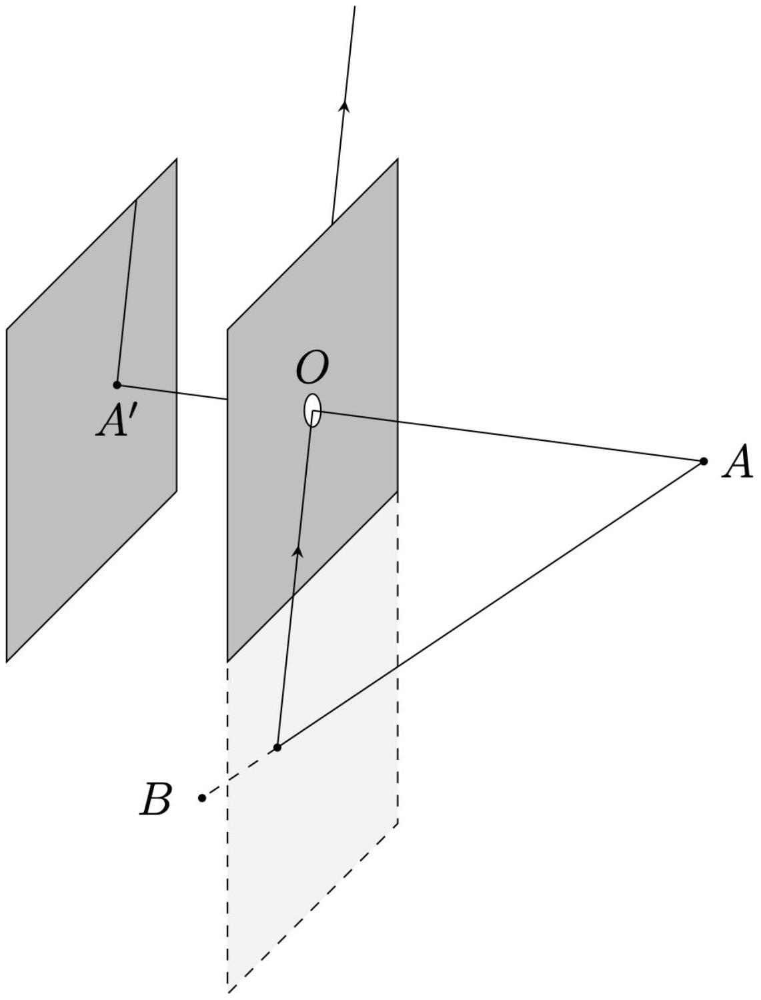

C2 ${ } ^ { 0.50 }$ При каком соотношении между $l _ { 0 }$ и $a$ на экране в любой момент времени будут изображены все точки флага, если пренебречь конечностью размеров экрана? Во всех последующих пунктах данной части задачи считайте полученное условие выполненным.

Какой-то части флага не будет на фотографии, если она лежит с обратной стороны от передней плоскости камеры. Рассмотрим происходящее в проекции на плоскость перпендикулярную плоскости флага и передней плоскости камеры.

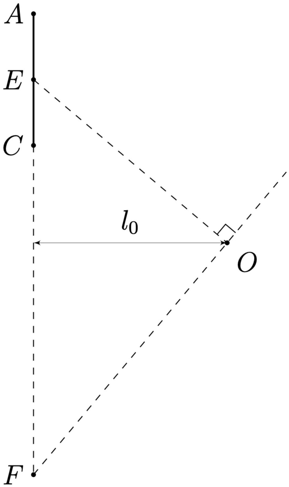

Чтобы флаг было видно всегда необходимо, чтобы при любом положении точки $E$ ( $E$ - центр флага) выполнялось: $E C < E F$. Длина $E C$ постоянна:

$$
E C = \frac { a \sqrt { 2 } } { 2 } .
$$

$E F$ - гипотенуза прямоугольного треугольника $E O F$, поэтому $E F = 2 l _ { m }$, где $l _ { m }$ - длина медианы этого треугольника из вершины $O$. Высота $E O F$ из вершины $O$ равна $l _ { 0 }$, и она не может быть больше $l _ { m }$ :

$$
l _ { 0 } \leqslant l _ { m } = \frac { E F } { 2 } .
$$

То есть $E F \geqslant 2 l _ { 0 }$ и равенство выполняется, когда рассматриваемый треугольник равнобедренный. Таким образом, чтобы флаг всегда было видно, необходимо:

$$
\frac { a } { \sqrt { 2 } } < 2 l _ { 0 } .
$$

Ответ:

$$
a < 2 \sqrt { 2 } l _ { 0 } .
$$

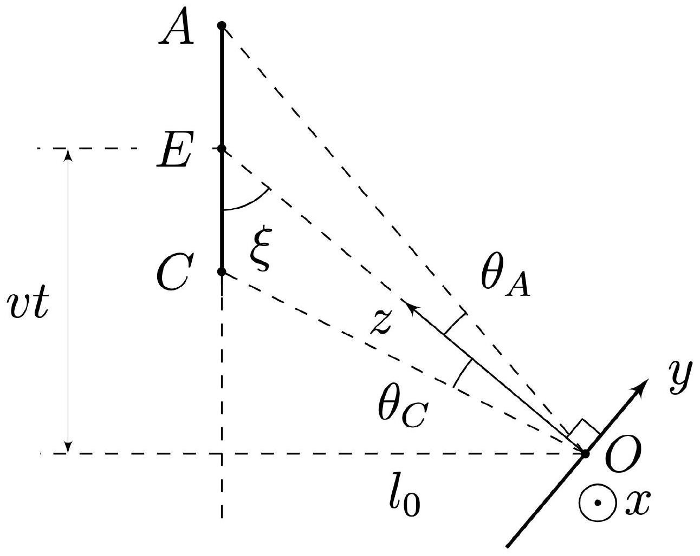

Расстояние от начала координат $X Y$ до изображения точки определяется тангенсом угла между осью камеры и направлением на эту точку (обозначим для точек $A , B , C$ и $D$ эти углы $\theta _ { A } , \theta _ { B } , \theta _ { C }$ и $\theta _ { D }$ соответсвенно). Можем найти координаты $x , y$ и $z$ этих точек и получить:

$$
\begin{gathered}
\tan \theta _ { B } = \tan \theta _ { D } = \frac { \left| x _ { B } \right| } { z _ { B } } = \frac { a / \sqrt { 2 } } { \sqrt { l _ { 0 } ^ { 2 } + v ^ { 2 } t ^ { 2 } } } = \frac { a } { \sqrt { 2 \left( l _ { 0 } ^ { 2 } + v ^ { 2 } t ^ { 2 } \right) } } ; \\
\tan \theta _ { A } = \frac { \left| y _ { A } \right| } { z _ { A } } = \frac { \frac { a } { \sqrt { 2 } } \sin \xi } { \sqrt { l _ { 0 } ^ { 2 } + v ^ { 2 } t ^ { 2 } } + \frac { a } { \sqrt { 2 } } \cos \xi } ; \\
\tan \theta _ { C } = \frac { \left| y _ { C } \right| } { z _ { C } } = \frac { \frac { a } { \sqrt { 2 } } \sin \xi } { \sqrt { l _ { 0 } ^ { 2 } + v ^ { 2 } t ^ { 2 } } - \frac { a } { \sqrt { 2 } } \cos \xi } .
\end{gathered}
$$

При этом можем выразить $\xi$ через данные величины:

$$
\cos \xi = \frac { v t } { \sqrt { l _ { 0 } ^ { 2 } + v ^ { 2 } t ^ { 2 } } } \quad \text { и } \quad \sin \xi = \frac { l _ { 0 } } { \sqrt { l _ { 0 } ^ { 2 } + v ^ { 2 } t ^ { 2 } } } .
$$

Получим итоговый ответ:

Ответ:

$$
\begin{gathered}
X _ { A } = 0 \quad Y _ { A } = \frac { \frac { a } { \sqrt { 2 } } l _ { 0 } L } { l _ { 0 } ^ { 2 } + v ^ { 2 } t ^ { 2 } + \frac { a } { \sqrt { 2 } } v t } \\
X _ { B } = - \frac { a L } { \sqrt { 2 \left( l _ { 0 } ^ { 2 } + v ^ { 2 } t ^ { 2 } \right) } } \quad Y _ { B } = 0 \\
X _ { C } = 0 \quad Y _ { C } = - \frac { \frac { a } { \sqrt { 2 } } l _ { 0 } L } { l _ { 0 } ^ { 2 } + v ^ { 2 } t ^ { 2 } - \frac { a } { \sqrt { 2 } } v t } \\
X _ { D } = \frac { a L } { \sqrt { 2 \left( l _ { 0 } ^ { 2 } + v ^ { 2 } t ^ { 2 } \right) } } \quad Y _ { D } = 0
\end{gathered}
$$

C4 ${ } ^ { 1.20 }$ На рисунке изображена фотография флага в неизвестном масштабе. Определите, в какой момент времени $\tau$ была сделана фотография.

По фотографии можем в неизветсном масштабе найти координаты изображений вершин, то есть мы можем с точностью до неизвестного множителя найти тангенсы углов $\theta _ { A } , \theta _ { B } , \theta _ { C }$ и $\theta _ { D }$.

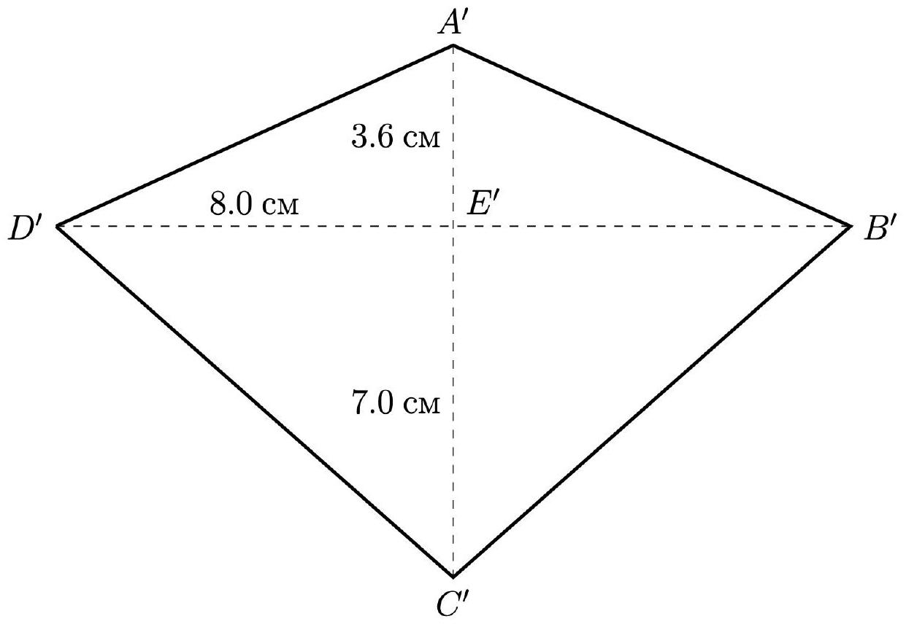

Для удобства в промежуточных вычислениях будем использовать $\xi$.

$$
\begin{gathered}
\tan \theta _ { B } = \frac { a / \sqrt { 2 } } { \sqrt { l _ { 0 } ^ { 2 } + v ^ { 2 } t ^ { 2 } } } = \frac { \frac { a } { \sqrt { 2 } } \sin \xi } { l _ { 0 } } = 8 k \\
\tan \theta _ { A } = \frac { \frac { a } { \sqrt { 2 } } \sin \xi } { \frac { l _ { 0 } } { \sin \xi } + \frac { a } { \sqrt { 2 } } \cos \xi } = 3.6 k \\
\tan \theta _ { C } = \frac { \frac { a } { \sqrt { 2 } } \sin \xi } { \frac { l _ { 0 } } { \sin \xi } - \frac { a } { \sqrt { 2 } } \cos \xi } = 7 k
\end{gathered}
$$

Поделим $\tan \theta _ { B }$ на $\tan \theta _ { A }$ и $\tan \theta _ { C }$.

$$
\begin{gathered}
\frac { 8 } { 3.6 } = \frac { 1 } { \sin \xi } + \frac { a } { \sqrt { 2 } l _ { 0 } } \cos \xi \\
\frac { 8 } { 7 } = \frac { 1 } { \sin \xi } - \frac { a } { \sqrt { 2 } l _ { 0 } } \cos \xi
\end{gathered}
$$

Сложив, получим значение $\xi$.

$$
\begin{gathered}
\frac { 8 } { 7 } + \frac { 8 } { 3.6 } = \frac { 2 } { \sin \xi } \\
\sin \xi = \frac { l _ { 0 } } { \sqrt { l _ { 0 } ^ { 2 } + v ^ { 2 } t ^ { 2 } } } = 0.594 \\
v t = 4.06 \mathrm { м }
\end{gathered}
$$

Получаем ответ:

Ответ:

$$
t = 4.06 \mathrm { c }
$$

D1 ${ } ^ { 0.10 }$ Чему равен угол $\theta$ ? Ответ выразите через $R$ и $h$.

Ответ:

$$
\theta = \arccos \frac { R } { R + h }
$$

D2 ${ } ^ { 0.40 }$ Определите координаты $x , y$ и $z$ точки горизонта, соответствующей углу $\varphi$. Ответ выразите через $\theta , R , \varphi$.

Координата $y$ точек горизонта не зависит от $\varphi$ и она равна:

$$
y = - \frac { R } { \cos \theta } + R \cos \theta .
$$

Координаты $x$ и $z$ равны:

$$
\begin{aligned}
& x = R \sin \theta \sin \varphi \\
& z = R \sin \theta \cos \varphi
\end{aligned}
$$

Ответ:

$$
\begin{gathered}
x = R \sin \theta \sin \varphi \\
y = - \frac { R } { \cos \theta } + R \cos \theta \\
z = R \sin \theta \cos \varphi
\end{gathered}
$$

D3 ${ } ^ { 0.20 }$ Докажите, что координаты $X , Y$ связаны с координатами $x , y$ и $z$ соотношениями:

$$
\frac { X } { x } = \frac { Y } { y } = \frac { L } { z } .
$$

Рассмотрим происходящее в проекции на $y z$.
Из подобия треугольников получаем:

$$
\frac { Y } { y } = \frac { L } { z } .
$$

Аналогично в проекции на $x z$ получим:

$$
\frac { X } { x } = \frac { L } { z } .
$$

D4 ${ } ^ { 0.70 }$ Покажите, что изображение горизонта на экране описывается следующим уравнением:

$$
\frac { Y ^ { 2 } } { A ^ { 2 } } - \frac { X ^ { 2 } } { B ^ { 2 } } = 1 ,
$$

где $A , B > 0$. Выразите $A$ и $B$ через $L$ и $\theta$.
Примечание: следующее выражение может оказаться полезным:

$$
\frac { 1 } { \cos ^ { 2 } \varphi } = 1 + \tan ^ { 2 } \varphi .
$$

Используя полученные раннее результаты, выразим $X$ и $Y$ через $L , \theta$ и $\varphi$.

$$
\begin{gathered}
X = \frac { x L } { z } = L \tan \varphi \\
Y = \frac { y L } { z } = L \frac { - \frac { 1 } { \cos \theta } + \cos \theta } { \sin \theta \cos \varphi } = - \frac { L \tan \theta } { \cos \varphi }
\end{gathered}
$$

Возведём $Y$ в квадрат и выразим через $X$ :

$$
\begin{gathered}
Y ^ { 2 } = \frac { L ^ { 2 } \tan ^ { 2 } \theta } { \cos ^ { 2 } \varphi } = L ^ { 2 } \tan ^ { 2 } \theta + X ^ { 2 } \tan ^ { 2 } \theta \\
\frac { Y ^ { 2 } } { ( L \tan \theta ) ^ { 2 } } - \frac { X ^ { 2 } } { L ^ { 2 } } = 1
\end{gathered}
$$

Ответ:

$$
\begin{gathered}
A = L \tan \theta \\
B = L
\end{gathered}
$$

D5 ${ } ^ { 1.00 }$ Определите, с какой высоты $h$ была сделана фотография.

Воспользуемся формулой из прошлого пункта задачи. Подставим в неё две точки из графика: $( 0,7 k )$ и $( 40 k , 10 k )$, где $k$ - неизвестный множитель, отвечающий за масштаб.

$$
\begin{gathered}
\frac { ( 7 k ) ^ { 2 } } { A ^ { 2 } } = 1 = \frac { ( 10 k ) ^ { 2 } } { A ^ { 2 } } - \frac { ( 40 k ) ^ { 2 } } { B ^ { 2 } } \\
\tan ^ { 2 } \theta = \frac { A ^ { 2 } } { B ^ { 2 } } = \frac { 10 ^ { 2 } - 7 ^ { 2 } } { 40 ^ { 2 } }
\end{gathered}
$$

Найдём $\theta$ и подставим в выражение через $h$ и $R$.

$$
\begin{aligned}
& \theta = 10.1 ^ { \circ } \\
& \frac { h } { R } = \frac { 1 } { \cos \theta } - 1
\end{aligned}
$$

Ответ:

$$
h = 100 \text { км }
$$

D6 ${ } ^ { 0.50 }$ Определите угол $\theta ^ { \prime }$. Ответ выразите через $R , n _ { 0 }$ и $h$.

Атмосфера Земли сферически симметрична, поэтому при движении луча в атмосфере сохраняется выражение $n ( r ) \cdot r \cdot \cos \theta ( r )$, где $r$ - расстояние до центра земли, $n ( r )$ - показатель преломления воздуха в этой точке, $\theta ( r )$ - угол направления луча с горизонтом. Подставим значения у поверхности земли и на высоте $h$.

$$
n _ { 0 } R = ( R + h ) \cos \theta ^ { \prime }
$$

Ответ:

$$
\theta ^ { \prime } = \arccos \frac { n _ { 0 } R } { R + h }
$$

D7 ${ } ^ { 0.60 }$ С учётом малости $n _ { 0 } - 1$ определите, на какую величину $\Delta h$ отличается реальная высота фотографирования от полученной вами в пункте D5. Выразите ответ через $n _ { 0 } - 1 , R$ и $h$, рассчитайте его численное значение.

Запишем новое выражение для $\theta$ и приравняем его к старому, так как угол $\theta$ определяется из графика и его значение при расчётах будет одно.

$$
\begin{aligned}
& \frac { n _ { 0 } R } { R + h + \Delta h } = \frac { R } { R + h } \\
& ( R + h ) \left( n _ { 0 } - 1 \right) = \Delta h
\end{aligned}
$$

Ответ:

$$
\Delta h = ( R + h ) \left( n _ { 0 } - 1 \right) = 1.77 \text { км }
$$

E1 ${ } ^ { 0.30 }$ Определите $h _ { c r }$, начиная с которого при подъёме горизонт видно полностью.

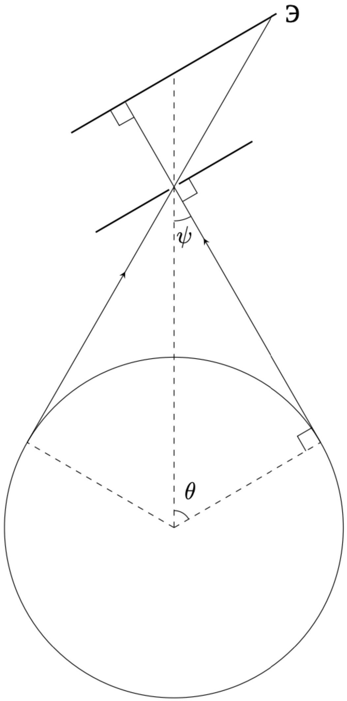

Горизонт видно полностью, когда весь конус лучей от горизонта лежит с одной стороны от передней плоскости камеры. Это условие выполнено при $2 \psi < 90 ^ { \circ }$. При этом $\theta = 90 ^ { \circ } - \psi$, поэтому условие на $\theta$ :

$$
\theta > 45 ^ { \circ } .
$$

Это равносильно следующему неравенству:

$$
R + h > \sqrt { 2 } R .
$$

Ответ:

$$
h _ { c r } = ( \sqrt { 2 } - 1 ) R
$$

E2 ${ } ^ { 1.10 }$ Определите зависимость видимой части горизонта $\eta$ от величины $h / R$. Постройте график этой зависимости. Примечание: при промежуточных вычислениях может быть полезен угол $\theta$, показанный на рисунке.

Рассмотрим сечение окружности горизонта передней плоскостью камеры, когда горизонт видно не полностью.

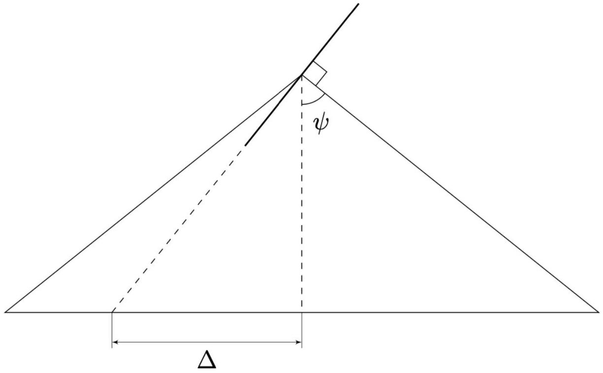
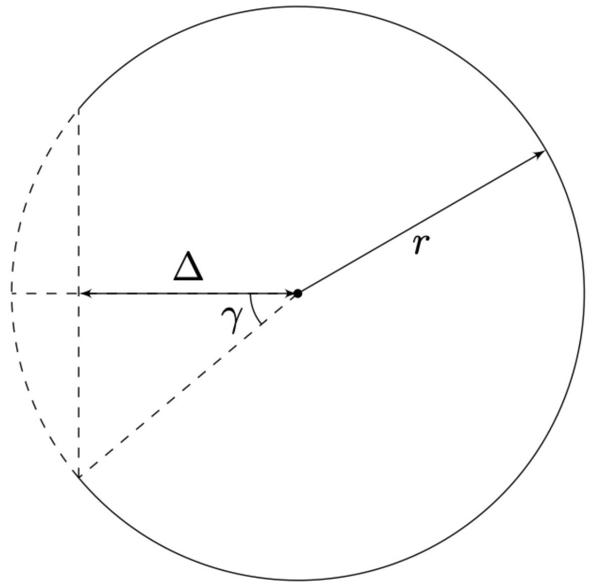
Заметим, что искомая величина:

$$
\eta = \frac { 2 \pi - 2 \gamma } { 2 \pi } = 1 - \frac { \gamma } { \pi } .
$$

Высота треугольника на первой фотографии равна $\frac { R } { \cos \theta } - R \cos \theta$. Выразим $\Delta$ через $R , \theta$.

$$
\Delta = \left( \frac { R } { \cos \theta } - R \cos \theta \right) \tan \left( 90 ^ { \circ } - \psi \right) = \left( \frac { R } { \cos \theta } - R \cos \theta \right) \tan \theta = R \cos \theta \tan ^ { 3 } \theta
$$

Выразим $\gamma$ :

$$
\gamma = \arccos \frac { \Delta } { r } = \arccos \frac { R \cos \theta \tan ^ { 3 } \theta } { R \sin \theta } = \arccos \left( \tan ^ { 2 } \theta \right) .
$$

Видимая часть горизонта в этом случае:

$$
\eta = 1 - \frac { \arccos \left( \tan ^ { 2 } \theta \right) } { \pi } = 1 - \frac { 1 } { \pi } \arccos \left( \left( 1 + \frac { h } { R } \right) ^ { 2 } - 1 \right) .
$$

Заметим, что эта формула имеет смысл при $\theta < 45 ^ { \circ }$, то есть при $h < h _ { c r }$. При $h \geqslant h _ { c r }$ горизонт виден полностью, поэтому $\eta = 1$.

Ответ: При $\frac { h } { R } < \sqrt { 2 } - 1$ :

$$
\eta = 1 - \frac { 1 } { \pi } \arccos \left( \left( 1 + \frac { h } { R } \right) ^ { 2 } - 1 \right) .
$$

При $\frac { h } { R } \geqslant \sqrt { 2 } - 1$ :

$$
\eta = 1 .
$$

Ответ:
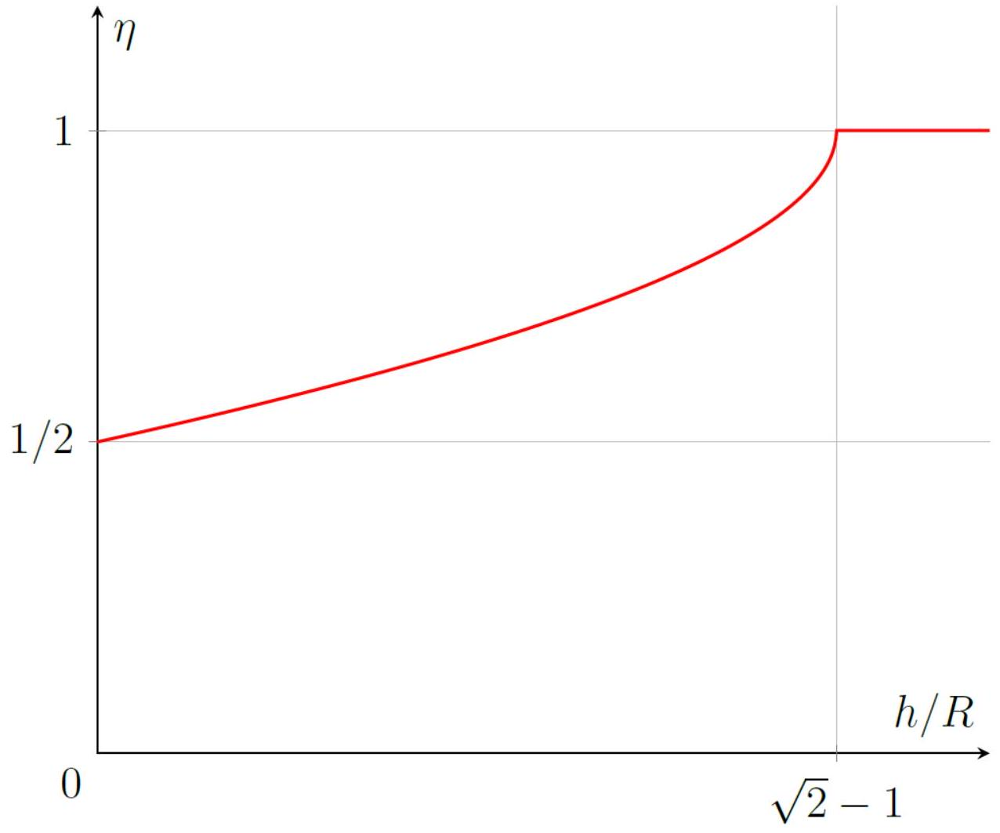

E3 ${ } ^ { 0.60 }$ Нарисуйте качественные изображения горизонта при $h < h _ { c r } , h = h _ { c r }$ и $h > h _ { c r }$. Определите типы кривых, получающихся при фотографировании с разных высот.

Заметим, что изображение - коническое сечение. В обозначениях условия $\alpha = \psi = 90 ^ { \circ } - \theta$.
В таком случае изображение будет эллипсом при $\theta > 90 ^ { \circ } - \theta$, параболой при $\theta = 90 ^ { \circ } - \theta$ и гиперболой при $\theta < 90 ^ { \circ } - \theta$. Подставляя $h$, получим ответ.

Ответ: При $h < h _ { c r }$ изображение - гипербола.

Ответ:
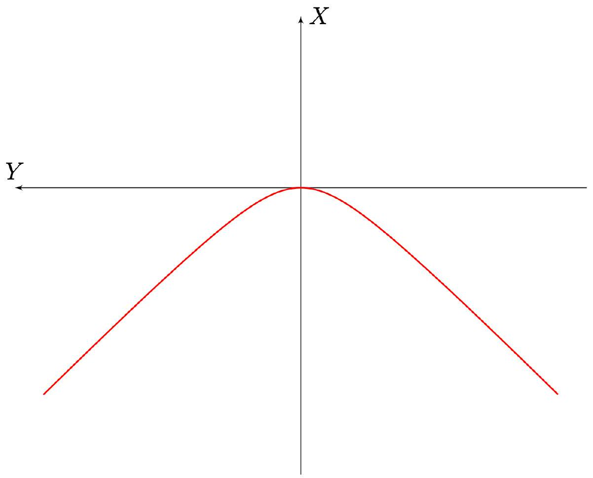

Ответ: При $h = h _ { c r }$ изображение - парабола.

Ответ:
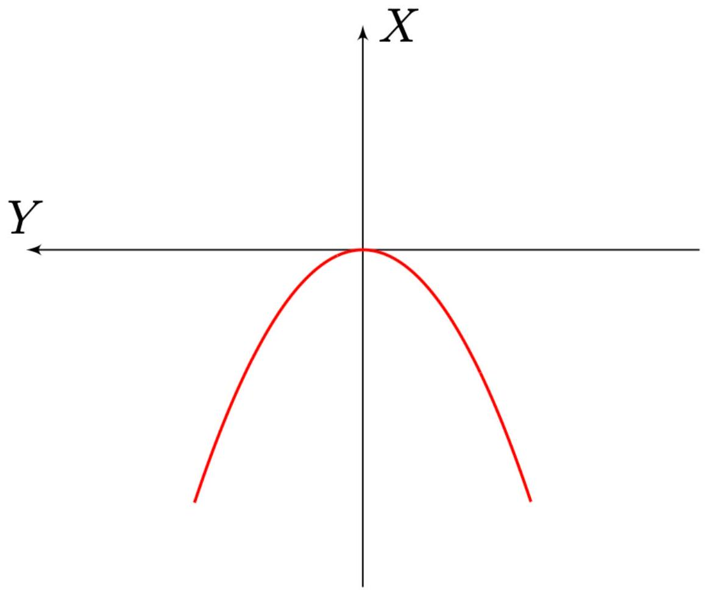

Ответ: При $h > h _ { c r }$ изображение - эллипс.

Ответ:
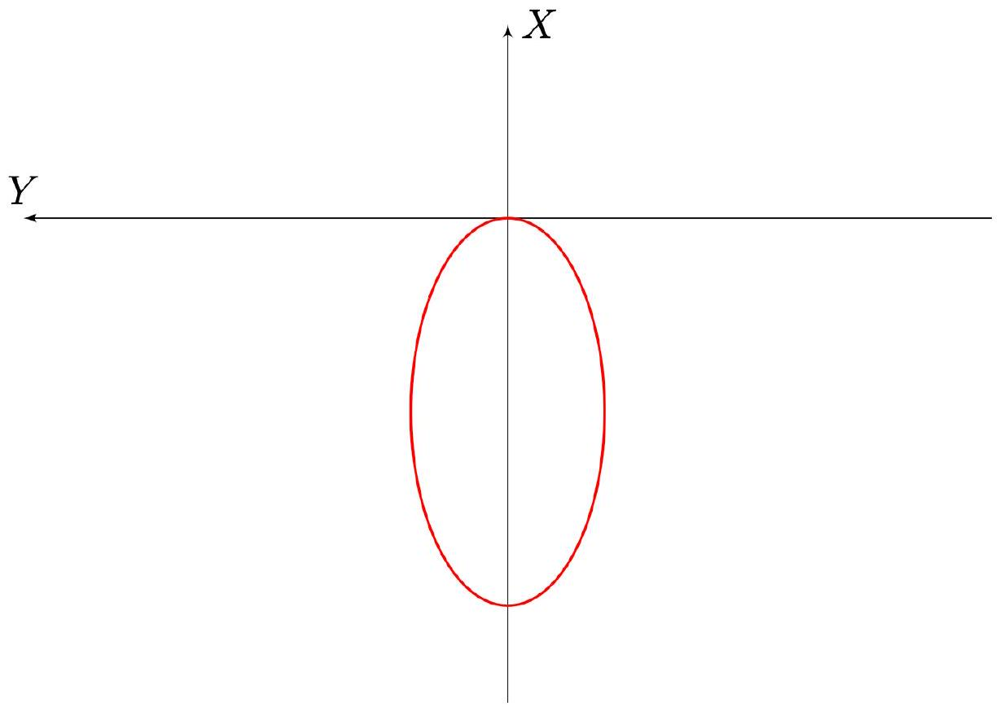
