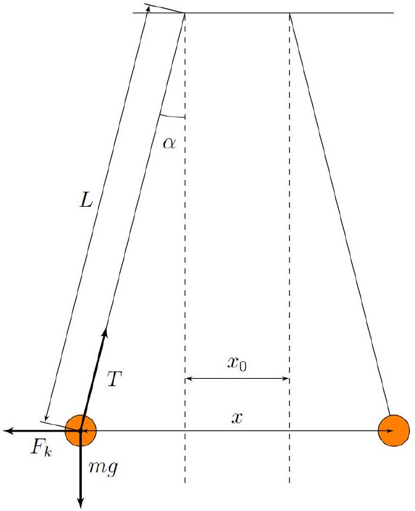
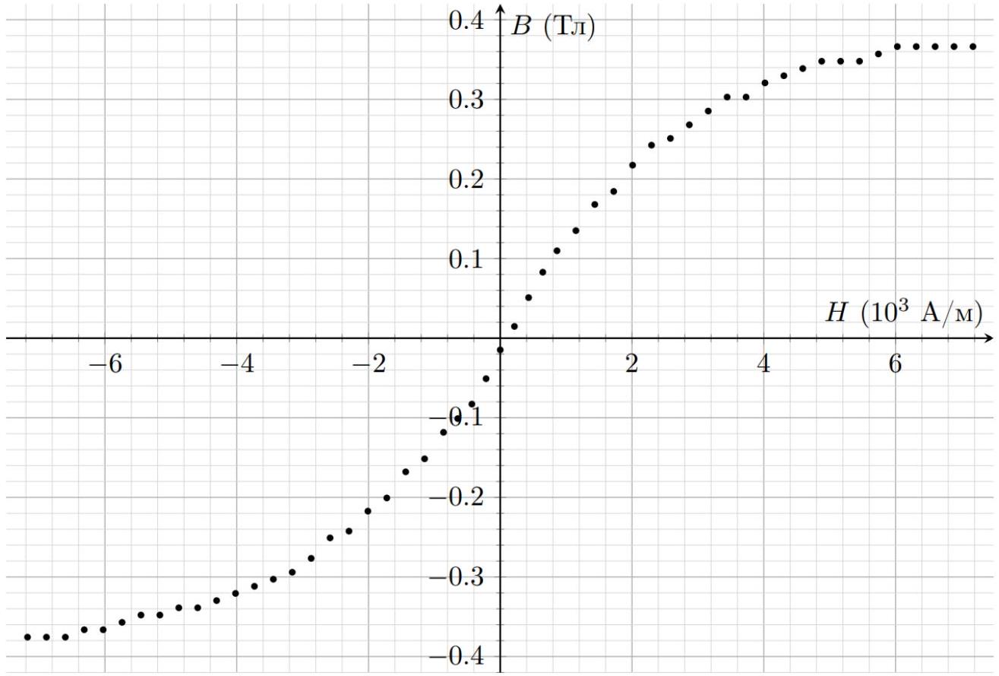
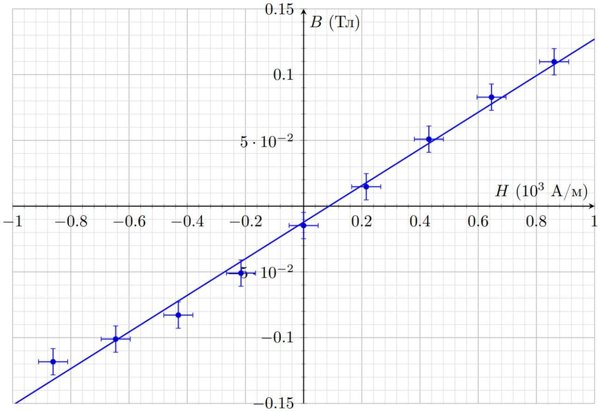
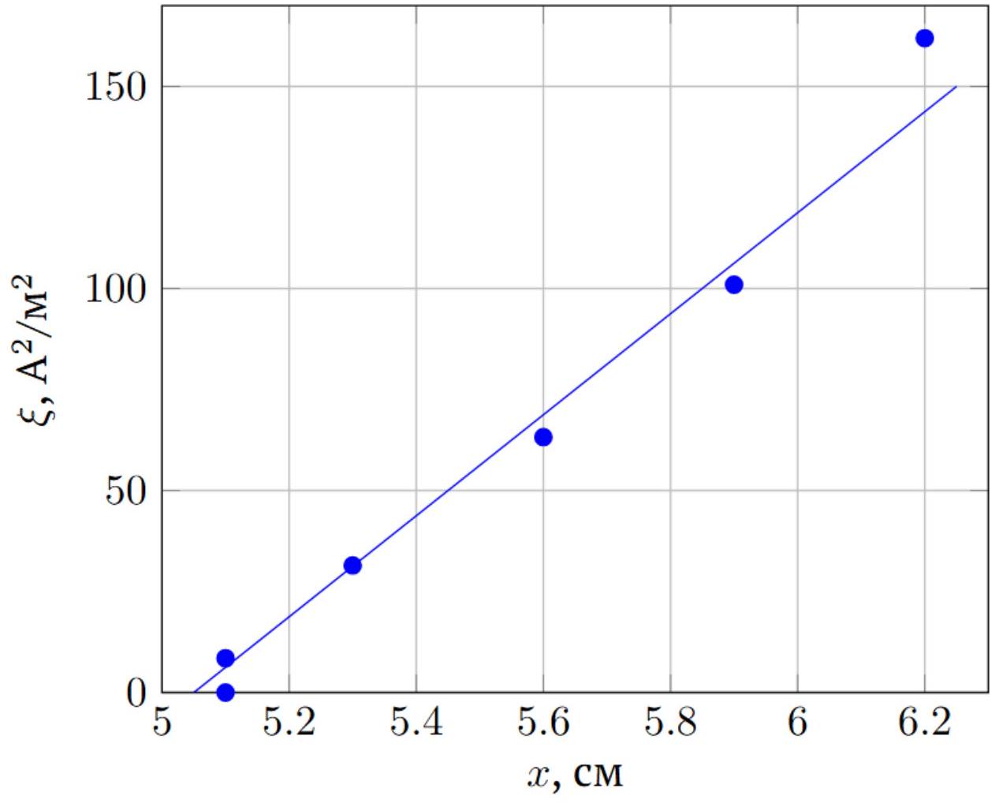
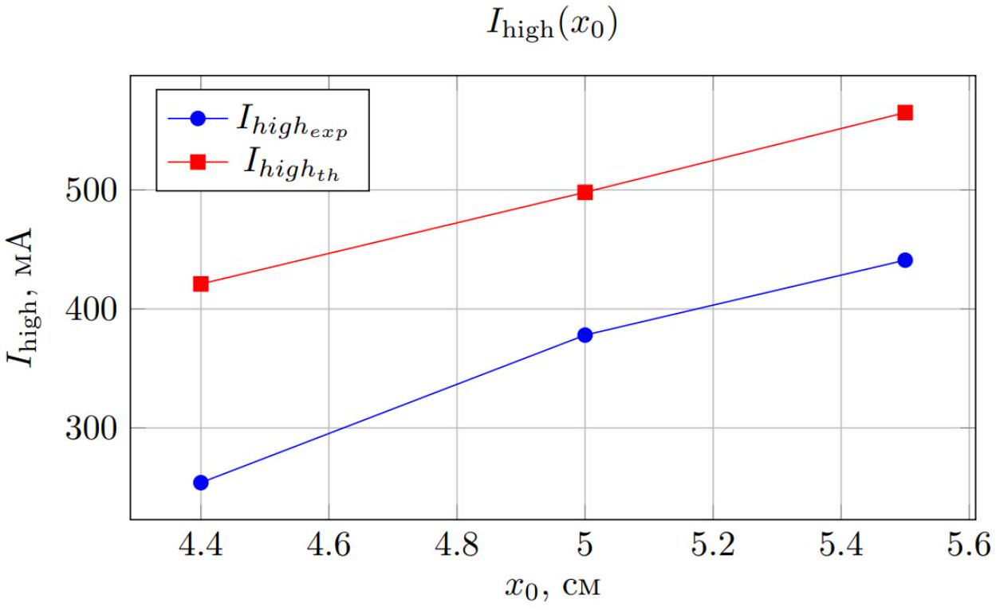
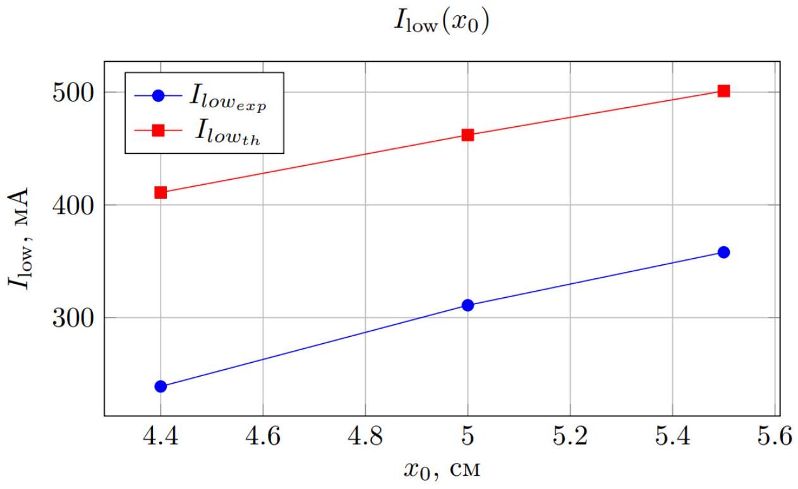
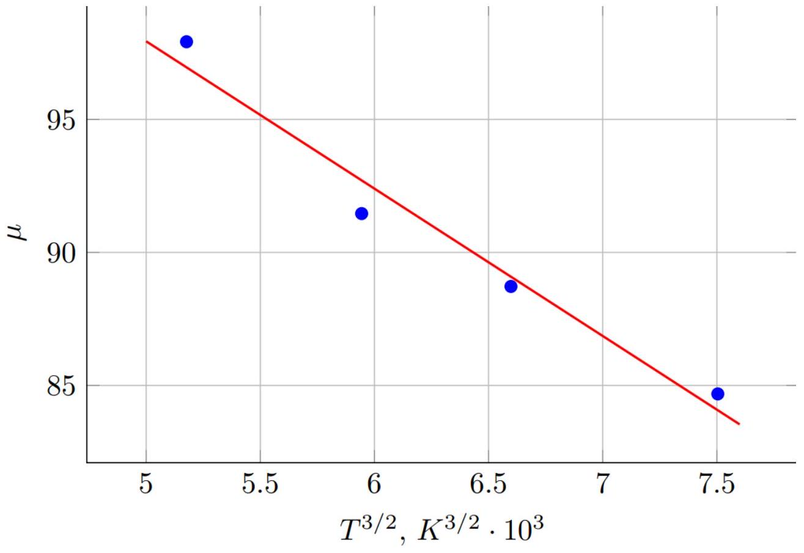

А0 ${ } ^ { 1.00 }$ Запишите расстояние $x _ { 0 }$ между осями соленоидов при отсутствии тока через них.
После сборки установки пригласите дежурного по аудитории сфотографировать вашу установку.
На фотографии должны быть видны:

1. Соленоиды, закрепленные на нитях как можно большей длины. Соленоиды должны быть расположены параллельно и горизонтально!
2. Провода, выведенные через верх рядом с точками подвеса соленоидов (иначе провода будут создавать дополнительный отклоняющий момент сил).

Вся установка должна быть закреплена и не может поддерживаться руками!
Внимание! В случае нарушения порядка сборки установки и признания установки непригодной для измерений или отсутствия фотографии, все пункты, связанные с измерениями и обработкой данных, БУДУТ ОЦЕНЕНЫ В 0 БАЛЛОВ!

Зафиксируем равновесное расстояние между осями соленоидов в отсутствие тока:

Ответ:

$$
x _ { 0 } = 5.1 \mathrm {~cm}
$$

А1 ${ } ^ { 0.30 }$ Получите формулу, связывающую силу отталкивания $F$ соленоидов друг от друга с расстоянием $x$ между ними. Выразите эту силу через магнитные заряды $q _ { m }$ на концах соленоидов, длину соленоидов $l , x$ и $\mu _ { 0 }$.

Рассмотрим соленоид, отклонившийся на малый угол $\alpha$ от положения равновесия (см. рисунок 2). Запишем II закон Ньютона для этого соленоида в проекции на ось $y$ :

$$
2 F _ { k } \cos \alpha = m g \sin \alpha .
$$

Коэффициент 2 появляется из-за того, что соленоид имеет два полюса (магнитных заряда), каждый из которых взаимодействует с соседним полюсом другого соленоида. Учитывая, что для малого угла $\alpha$ справедливы формулы $\sin \alpha \approx \alpha \approx \frac { x - x _ { 0 } } { 2 L }$ и $\cos \alpha \approx 1$, преобразуем ॥ закон Ньютона:

$$
F _ { k } = \frac { m g } { 2 } \frac { x - x _ { 0 } } { 2 L } = \frac { \mu _ { 0 } q _ { m } ^ { 2 } } { 4 \pi } \left( \frac { 1 } { x ^ { 2 } } - \frac { x } { \left( x ^ { 2 } + l ^ { 2 } \right) ^ { \frac { 3 } { 2 } } } \right)
$$

Во всех пунктах задачи использовались высота подвеса $h = 1.37$ м и плотность намотки $n = \frac { N } { l } = \frac { 300 } { 20.9 \mathrm { cM } } = 1435 \mathrm {~m} ^ { - 1 }$.

Ответ:

$$
F = 2 F _ { k } = 2 \frac { m g } { 2 } \frac { x - x _ { 0 } } { 2 L } = \frac { \mu _ { 0 } q _ { m } ^ { 2 } } { 2 \pi } \left( \frac { 1 } { x ^ { 2 } } - \frac { x } { \left( x ^ { 2 } + l ^ { 2 } \right) ^ { \frac { 3 } { 2 } } } \right)
$$

А2 ${ } ^ { 0.20 }$ Выразите индукцию магнитного поля $B$ в центре сердечников соленоидов через расстояние $x$ между ними, массу соленоидов $m$, длину подвеса $L$, а также другие необходимые величины.

В А4 введения было сказано, что магнитный заряд соленоида равен потоку вектора индукции магнитного поля $B$ через торец соленоида. Этот поток равен:

$$
\Phi _ { B } = B \cdot S
$$

где $B$ - значение индукции магнитного поля на торце соленоида, $S$ - площадь сечения соленоида.
А значит:

$$
\mu _ { 0 } q _ { m } = B \cdot S
$$

Подставляя формулу для магнитного заряда $q _ { m }$ в формулу для силы Кулона, получим:

$$
F _ { k } = \frac { m g } { 2 } \frac { x - x _ { 0 } } { 2 L } = \frac { B ^ { 2 } S ^ { 2 } } { 4 \pi \mu _ { 0 } } \left( \frac { 1 } { x ^ { 2 } } - \frac { x } { \left( x ^ { 2 } + l ^ { 2 } \right) ^ { \frac { 3 } { 2 } } } \right)
$$

Выразим отсюда индукцию магнитного поля внутри соленоида $B$ через расстояние $x$ между соленоидами:

Ответ:

$$
B = \frac { 1 } { S } \sqrt { \frac { \pi \mu _ { 0 } m g \left( x - x _ { 0 } \right) } { \left( \frac { 1 } { x ^ { 2 } } - \frac { x } { \left( x ^ { 2 } + l ^ { 2 } \right) ^ { \frac { 3 } { 2 } } } \right) L } }
$$

А3 ${ } ^ { 5.00 }$ Измерьте зависимость расстояния $x$ между осями соленоидов от силы тока $I$, протекающего через каждый из соленоидов, изменяя ток в диапазоне от -5 A до +5 A с шагом 0.2 A, а при токах меньше 0.6 A по модулю - с шагом 0.15 A.
Поскольку магнитная проницаемость сердечника соленоида зависит от температуры, старайтесь, чтобы в рамках ваших измерений температура соленоидов отклонялась от комнатной температуры не более чем на 10 °C.

Снимем зависимость расстояния между соленоидами $x$ от силы тока $I$, протекающего по ним, в диапазоне токов от -5 А до +5 А.

Ответ:

| $I , \mathrm {~A}$ | $x , \mathrm { CM }$ | $I , \mathrm {~A}$ | $x , \mathrm { CM }$ | $I , \mathrm {~A}$ | $x , \mathrm { CM }$ | $I , \mathrm {~A}$ | $x , \mathrm { CM }$ |
| :--- | :--- | :--- | :--- | :--- | :--- | :--- | :--- |
| -5 | 9 | -2,2 | 8,1 | 0,3 | 5,3 | 3 | 8,5 |
| -4,8 | 9 | -2 | 7,9 | 0,45 | 5,6 | 3,2 | 8,6 |
| -4,6 | 9 | -1,8 | 7,6 | 0,6 | 5,9 | 3,4 | 8,7 |
| -4,4 | 8,9 | -1,6 | 7,5 | 0,8 | 6,2 | 3,6 | 8,7 |
| -4,2 | 8,9 | -1,4 | 7,2 | 1 | 6,6 | 3,8 | 8,7 |
| -4 | 8,8 | -1,2 | 7 | 1,2 | 6,8 | 4 | 8,8 |
| -3,8 | 8,7 | -1 | 6,6 | 1,4 | 7,2 | 4,2 | 8,9 |
| -3,6 | 8,7 | -0,8 | 6,4 | 1,6 | 7,5 | 4,4 | 8,9 |
| -3,4 | 8,6 | -0,6 | 6 | 1,8 | 7,6 | 4,6 | 8,9 |
| -3,2 | 8,6 | -0,45 | 5,8 | 2 | 7,8 | 4,8 | 8,9 |
| -3 | 8,5 | -0,3 | 5,6 | 2,2 | 8 | 5 | 8,9 |
| -2,8 | 8,4 | -0,15 | 5,3 | 2,4 | 8,2 |  |  |
| -2,6 | 8,3 | 0 | 5,1 | 2,6 | 8,2 |  |  |
| -2,4 | 8,2 | 0,15 | 5,1 | 2,8 | 8,4 |  |  |

A4 ${ } ^ { 1.20 }$
Из полученной в А3 зависимости рассчитайте значения индукции магнитного поля $B$ внутри соленоида и напряженности магнитного поля $H = n I$ внутри соленоида, где $n$ - это число витков на единицу длины соленоида, $I$ - ток через соленоид. Постройте график зависимости $B ( H )$ для токов $I$ от -5 А до + 5 A , пренебрегая гистерезисом.

Рассчитаем значения $H$ и $B$. Построим петлю гистерезиса для данных значений $H$ и $B$ (красная петля на рисунке 3).

| $H$, A/M | $B$, Тл | $H$, A/m | $B$, Тл | $H$, A/m | $B$, Тл | $H$, A/m | $B$, Тл |
| :--- | :--- | :--- | :--- | :--- | :--- | :--- | :--- |
| -7175 | -0,37563 | -3157 | -0,29406 | 430,5 | 0,050919 | 4305 | 0,329651 |

| -6888 | -0,37563 | -2870 | -0,27663 | 645,75 | 0,082839 | 4592 | 0,338711 |
| :--- | :--- | :--- | :--- | :--- | :--- | :--- | :--- |
| -6601 | -0,37563 | -2583 | -0,25091 | 861 | 0,109779 | 4879 | 0,347838 |
| -6314 | -0,3663 | -2296 | -0,24244 | 1148 | 0,135063 | 5166 | 0,347838 |
| -6027 | -0,3663 | -2009 | -0,21731 | 1435 | 0,167933 | 5453 | 0,347838 |
| -5740 | -0,35703 | -1722 | -0,20076 | 1722 | 0,184312 | 5740 | 0,357033 |
| -5453 | -0,34784 | -1435 | -0,16793 | 2009 | 0,217314 | 6027 | 0,366298 |
| -5166 | -0,34784 | -1148 | -0,15155 | 2296 | 0,242443 | 6314 | 0,366298 |
| -4879 | -0,33871 | -861 | -0,11832 | 2583 | 0,250912 | 6601 | 0,366298 |
| -4592 | -0,33871 | -645,75 | -0,10107 | 2870 | 0,268003 | 6888 | 0,366298 |
| -4305 | -0,32965 | -430,5 | -0,08284 | 3157 | 0,285315 | 7175 | 0,366298 |
| -4018 | -0,32066 | -215,25 | -0,05092 | 3444 | 0,302862 |  |  |
| -3731 | -0,31173 | 0 | -0,01476 | 3731 | 0,302862 |  |  |
| -3444 | -0,30286 | 215,25 | 0,01476 | 4018 | 0,320657 |  |  |

Ответ:

Ответ:

$$
B _ { r } = ( 15 \pm 5 ) \text { мТл }
$$

А6 ${ } ^ { 0.30 }$ Оцените по экспериментальным данным коэрцитивную силу $H _ { c }$ для петли гистерезиса из А4.

Соленоиды возвращаются в исходное положение равновесие при токе через них $I \approx 150 \mathrm {~mA}$. Выразим коэрцитивную силу:

Ответ:

$$
\left. H _ { c } = ( 85 \pm 20 ) \right) \mathrm { A } / \mathrm { M }
$$

А7 ${ } ^ { 0.20 }$ При каком максимальном по модулю токе, текущем через соленоиды, зависимость $B ( H )$ в пренебрежении гистерезисом все ещё описывается прямой пропорциональностью?

Зависимость $B ( H )$ становится нелинейной при $H > 1000 \mathrm {~A} / \mathrm { M }$, что соответствует:

Ответ: $I _ { c r } = 0.8 \mathrm {~A}$

А8 ${ } ^ { 1.50 }$ Вычислите магнитную проницаемость $\mu = \frac { 1 } { \mu _ { 0 } } \frac { \mathrm {~d} B } { \mathrm {~d} H }$ сердечника соленоида на линейном участке.
Для повышения точности измерений используйте линеаризацию, не требующую знания величины $x _ { 0 }$.

Значение магнитной восприимчивости железного сердечника можно вычислить по формуле:

$$
\mu = \frac { 1 } { \mu _ { 0 } } \frac { \mathrm {~d} B } { \mathrm {~d} H }
$$

Максимальную магнитную восприимчивость $\mu _ { \max }$ железный сердечник будет иметь тогда, когда отношение $\frac { \mathrm { d } B } { \mathrm {~d} H }$ максимально, то есть вблизи нуля.
Максимальный ток не должен превышать значения $I _ { c r }$, найденного в пункте A7.
Условие равновесия:

$$
B = \frac { 1 } { S } \sqrt { \frac { \pi \mu _ { 0 } m g \left( x - x _ { 0 } \right) } { \left( \frac { 1 } { x ^ { 2 } } - \frac { x } { \left( x ^ { 2 } + l ^ { 2 } \right) ^ { \frac { 3 } { 2 } } } \right) L } } = \mu \mu _ { 0 } n I
$$

Отсюда зависимость

$$
\xi ( x ) = I ^ { 2 } \cdot \left( \frac { 1 } { x ^ { 2 } } - \frac { x } { \left( x ^ { 2 } + l ^ { 2 } \right) ^ { \frac { 3 } { 2 } } } \right)
$$

линейна. Произведем пересчет точек и построим график полученной зависимости:

| $I , \mathrm {~A}$ | $x$, CM | $\xi , \mathrm { A } ^ { 2 } / \mathrm { M } ^ { 2 }$ |
| :--- | :--- | :--- |
| 0 | 5,1 | 0 |
| 0,15 | 5,1 | 8,51 |
| 0,3 | 5,3 | 31,47 |
| 0,45 | 5,6 | 63,23 |
| 0,6 | 5,9 | 100,94 |
| 0,8 | 6,2 | 161,93 |

Рассчитаем угловой коэффициент полученного графика:

$$
k = \frac { \partial \xi } { \partial x } = \frac { \pi m g } { \mu _ { 0 } L S ^ { 2 } n ^ { 2 } \mu ^ { 2 } } = ( 14300 \pm 600 ) \frac { \mathrm { A } ^ { 2 } } { \mathrm { M } ^ { 3 } } ,
$$

откуда:

$$
\mu = \sqrt { \frac { \pi m g } { \mu _ { 0 } L S ^ { 2 } n ^ { 2 } k } } = 94 \pm 4
$$

Ответ:

$$
\mu = 94 \pm 4
$$

В1 ${ } ^ { 0.30 }$ Получите теоретическое выражение, связывающее расстояние $x$ между соленоидами и ток $I$ через один соленоид. В ответ может входить функция $B ( H )$ и любые необходимые величины.

Аналогично части A:

$$
B ( n I ) = \frac { 1 } { S } \sqrt { \frac { \pi \mu _ { 0 } m g \left( x _ { 0 } - x \right) } { \left( \frac { 1 } { x ^ { 2 } } - \frac { x } { \left( x ^ { 2 } + l ^ { 2 } \right) ^ { \frac { 3 } { 2 } } } \right) L } } \approx \frac { x } { S } \sqrt { \frac { \pi \mu _ { 0 } m g \left( x _ { 0 } - x \right) } { L } }
$$

Ответ:

$$
B ( n I ) = \frac { x } { S } \sqrt { \frac { \pi \mu _ { 0 } m g \left( x _ { 0 } - x \right) } { L } }
$$

В2 ${ } ^ { 1.00 }$ При каком минимальном токе $I _ { \text {high } }$ происходит резкое «слипание» соленоидов при плавном увеличении тока? В ответ может входить функция $H ( B )$ и любые необходимые величины.

Резкое слипание соленоидов происходит в момент, когда их равновесие становится неустойчивым. Условие равновесия:

$$
\frac { B ^ { 2 } ( n I ) S ^ { 2 } L } { x ^ { 2 } } = \pi \mu _ { 0 } m g \left( x _ { 0 } - x \right)
$$

Дифференцируем по $x$ :

$$
- 2 \frac { B ^ { 2 } ( n I ) S ^ { 2 } L } { x ^ { 3 } } = - \pi \mu _ { 0 } m g
$$

Решая совместно, получаем:

$$
\begin{gathered}
x = 2 x _ { 0 } / 3 \\
B ^ { 2 } ( n I ) S ^ { 2 } L = \frac { 4 \pi } { 27 } \mu _ { 0 } m g x _ { 0 } ^ { 3 }
\end{gathered}
$$

$$
F _ { k } = \frac { m g } { 2 } \frac { x - x _ { 0 } } { 2 L } = \frac { \mu _ { 0 } q _ { m } ^ { 2 } } { 4 \pi } \left( \frac { 1 } { x ^ { 2 } } - \frac { x } { \left( x ^ { 2 } + l ^ { 2 } \right) ^ { \frac { 3 } { 2 } } } \right)
$$

Ответ:

$$
B \left( n I _ { \text {high } } \right) = \sqrt { \frac { 4 \pi } { 27 S ^ { 2 } L } \mu _ { 0 } m g x _ { 0 } ^ { 3 } }
$$

B3 ${ } ^ { 0.30 }$ При каком токе $I _ { \text {low } }$ соленоиды разлипаются обратно? В ответ может входить функция $H ( B )$ и любые необходимые величины.

После слипания соленоиды находятся в равновесии из-за силы реакции, возникающей при их давлении друг на друга. Разлипание происходит в момент $N = 0$

$$
B \left( n I _ { \text {low } } \right) = \frac { x _ { 1 } } { S } \sqrt { \frac { \pi \mu _ { 0 } m g \left( x _ { 0 } - x _ { 1 } \right) } { L } } ,
$$

где $x _ { 1 } = 2.5 \mathrm {~cm}$ - расстояние между осями соленоидов, когда они прижаты друг к другу вплотную.

Ответ:

$$
B \left( n I _ { \text {low } } \right) = \frac { x _ { 1 } } { S } \sqrt { \frac { \pi \mu _ { 0 } m g \left( x _ { 0 } - x _ { 1 } \right) } { L } }
$$

B4 ${ } ^ { 1.90 }$ Измерьте зависимость $I _ { \text {low, } }$ high $\left( x _ { 0 } \right)$ для трех разных значений $x _ { 0 }$. Постройте эти зависимости на одном графике с теоретическими зависимостями, рассчитанными по кривой, полученной в предыдущей части. Расходятся ли какие-то из этих зависимостей с теоретическими? Если да, объясните причину.

Измерим зависимости $I _ { \text {low, } \text { high } } \left( x _ { 0 } \right)$, paccчитаем соответствующие теоретические значения и построим соответствующие графики:

| $x _ { 0 }$, CM | $I _ { \text {high } } ^ { \text {exp } }$ | $I _ { l o w _ { \text {exp } } }$ | $B _ { \text {high } }$ | $B _ { \text {low } }$ | $I _ { \text {high } } { } _ { \text {th } }$ | $I _ { l o w _ { t h } }$ |
| :--- | :--- | :--- | :--- | :--- | :--- | :--- |
| 4,40 | 254 | 239 | 0,0720 | 0,0699 | 421 | 411 |
| 5,1 | 378 | 311 | 0,0898 | 0,0818 | 511 | 470 |
| 5,5 | 396 | 321 | 0,1006 | 0,0878 | 565 | 501 |

Ответ: Обе зависимости расходятся с теоретическими т.к. провода создают дополнительный крутящий момент.

С1 ${ } ^ { 4.50 }$ Получите не менее четырех различных значений $\mu ( T )$. Для измерения используйте отталкивание, как в части А. Если вы собираете установку заново, вы не можете использовать значение, полученное в части А при комнатной температуре. Это связано с тем, что отличия в значениях $\mu$, возникающие из-за неидеальности сборки установки, могут быть сравнимы с измеряемым эффектом. При обработке экспериментальных данных используйте линеаризацию из А8. Внимание! Выданные сердечники обладают малой теплопроводностью. Вы можете считать температуру сердечника равной температуре термопары при поддержании соответствующей постоянной температуры термопары не менее 10 минут.

Выданные сердечники нагреваются достаточно медленно. Выставим постоянное значение тока через катушки. По истечении 10 минут выкрутим ток в ноль, снимем зависимость расстояния между осями соленоидов от тока через них. Гистерезис можно не учитывать т.к. он мал и в линеаризации будет влиять на постоянный сдвиг. Максимальный ток не должен превышать значения $I _ { c r }$, найденного в пункте А8. В зависимостях не должно быть большого количества точек т.к. сердечники остынут.

Условие равновесия такое же, как в части A:

$$
B = \frac { 1 } { S } \sqrt { \frac { \pi \mu _ { 0 } m g \left( x - x _ { 0 } \right) } { \left( \frac { 1 } { x ^ { 2 } } - \frac { x } { \left( x ^ { 2 } + l ^ { 2 } \right) ^ { \frac { 3 } { 2 } } } \right) L } } = \mu \mu _ { 0 } n I
$$

Отсюда зависимость

$$
\xi ( x ) = I ^ { 2 } \cdot \left( \frac { 1 } { x ^ { 2 } } - \frac { x } { \left( x ^ { 2 } + l ^ { 2 } \right) ^ { \frac { 3 } { 2 } } } \right)
$$

линейна.
Снимем зависимости $I ( x )$ при четырех различных температурах. Сердечник остывает достаточно медленно, поэтому в качестве температуры проведения эксперимента запишем температуру, соответствующую показаниям омметра в момент начала проведения измерений.

$$
R = 111 \text { Ом, } T = 299 \text { К }
$$

| $I , \mathrm {~A}$ | $x$, CM | $\xi , \mathrm { A } ^ { 2 } / \mathrm { M } ^ { 2 }$ |
| :--- | :--- | :--- |
| 0 | 6,1 | 0 |
| 0,15 | 6,2 | 5,69 |
| 0,3 | 6,4 | 21,3 |
| 0,45 | 6,5 | 46,4 |
| 0,6 | 6,7 | 77,5 |
| 0,75 | 6,9 | 113,8 |
| 0,9 | 7,3 | 145,5 |

$$
R = 122 \text { Ом, } T = 328 \text { К }
$$

| $I , \mathrm {~A}$ | $x$, CM | $\xi , \mathrm { A } ^ { 2 } / \mathrm { M } ^ { 2 }$ |
| :--- | :--- | :--- |
| 0 | 6,2 | 0,0 |
| 0,15 | 6,3 | 5,5 |
| 0,3 | 6,4 | 21,3 |

| 0,45 | 6,5 | 46,4 |
| :--- | :--- | :--- |
| 0,6 | 6,7 | 77,5 |
| 0,75 | 7 | 110,4 |
| 0,9 | 7,2 | 149,8 |

$$
R = 131 \text { Ом, } T = 352 \text { К }
$$

| $I , \mathrm {~A}$ | $x$, CM | $\xi , \mathrm { A } ^ { 2 } / \mathrm { M } ^ { 2 }$ |
| :--- | :--- | :--- |
| 0 | 6,2 | 0,0 |
| 0,15 | 6,4 | 5,3 |
| 0,3 | 6,5 | 20,6 |
| 0,45 | 6,6 | 45,0 |
| 0,6 | 6,7 | 77,5 |
| 0,75 | 7 | 110,4 |
| 0,9 | 7,2 | 149,8 |

$$
R = 143 \text { Ом, } T = 383 \text { К }
$$

| $I , \mathrm {~A}$ | $x$, CM | $\xi , \mathrm { A } ^ { 2 } / \mathrm { M } ^ { 2 }$ |
| :--- | :--- | :--- |
| 0 | 6,2 | 0,0 |
| 0,15 | 6,3 | 5,5 |
| 0,3 | 6,4 | 21,3 |
| 0,45 | 6,5 | 46,4 |
| 0,6 | 6,7 | 77,5 |
| 0,75 | 6,9 | 113,8 |
| 0,9 | 7,1 | 154,3 |

Угловые коэффициенты получим с помощью МНК. Полученные значения связаны с параметрами сердечников следующим образом:

$$
k = \frac { \partial \xi } { \partial x } = \frac { \pi m g } { \mu _ { 0 } L S ^ { 2 } n ^ { 2 } \mu ^ { 2 } }
$$

откуда:

$$
\mu = \sqrt { \frac { \pi m g } { \mu _ { 0 } L S ^ { 2 } n ^ { 2 } k } }
$$

Рассчитаем значения $\mu ( T )$ и построим линеаризованный график:

| $T$, К | $k , \mathrm {~A} ^ { 2 } / \mathrm { M } ^ { 3 }$ | $\mu$ | $T ^ { \frac { 3 } { 2 } } , \mathrm {~K} ^ { \frac { 3 } { 2 } }$ |
| :--- | :--- | :--- | :--- |
| 299 | 13200 | 97,92 | 5177 |
| 328 | 15130 | 91,46 | 5944 |
| 352 | 16080 | 88,72 | 6598 |
| 383 | 17650 | 84,68 | 7504 |

С2 ${ } ^ { 2.00 }$ Определите $\mu ( 0 )$ и $T _ { c }$ для выданных сердечников.

Угловой коэффициент построенного графика:

$$
k = - \mu ( 0 ) T _ { c } ^ { - \frac { 3 } { 2 } } = - 5.54 \cdot 10 ^ { - 3 } \mathrm {~K} ^ { - \frac { 3 } { 2 } } ,
$$

Свободный член:

$$
\mu ( 0 ) = 126
$$

Отсюда:

$$
T _ { c } = 800 \mathrm {~K}
$$

Ответ:

$$
\begin{aligned}
& \mu ( 0 ) = 126 \\
& T _ { c } = 800 \mathrm {~K}
\end{aligned}
$$
