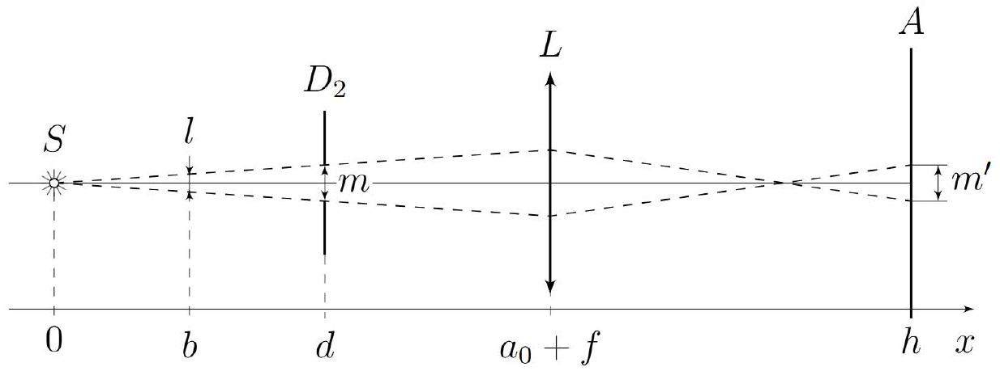
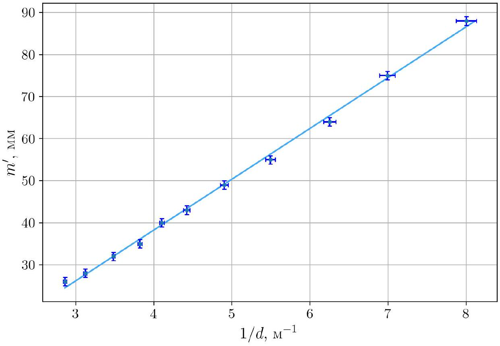
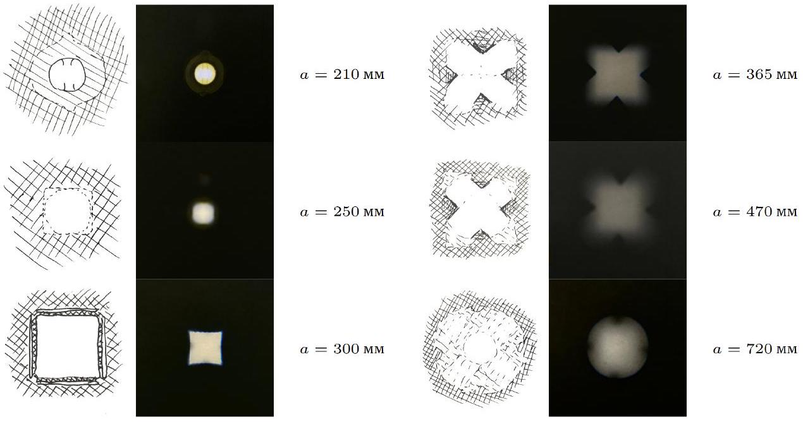
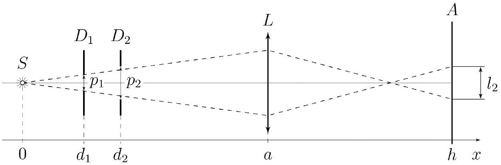
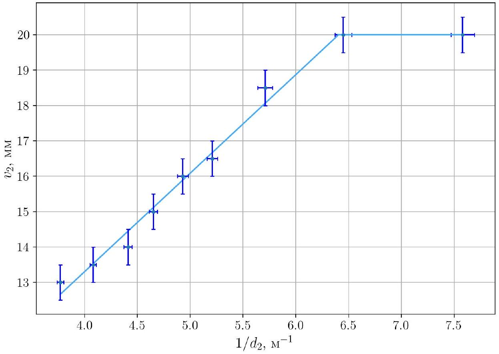
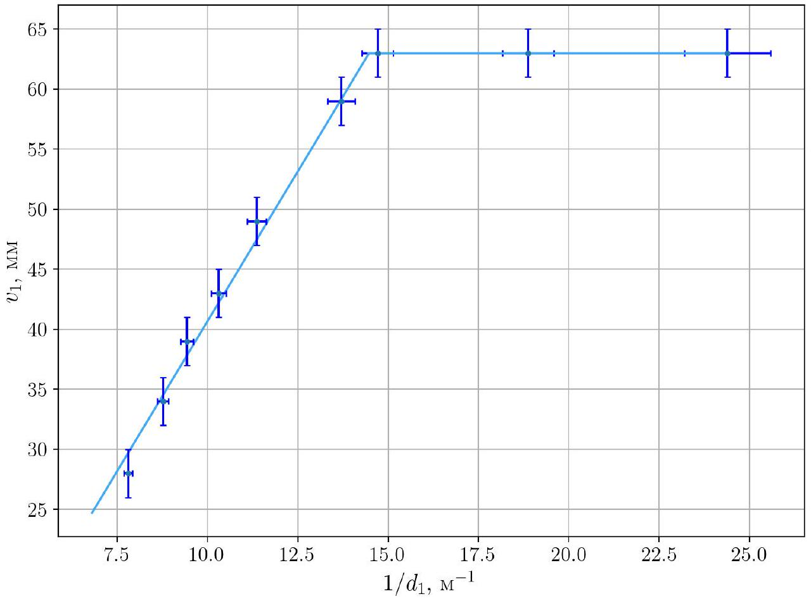

А1 ${ } ^ { 0.60 }$ Для 5 различных значений $a$ получите 5 соответствующих значений $h$, при которых изображение $S ^ { \prime }$ светодиода сфокусировано на экране. Для каждого измерения рассчитайте значение фокусного расстояния $f$. Усредните полученные значения $f$ и запишите в лист ответов усреднённое значение $f _ { \text {avg } }$.

| $a , \mathrm { MM }$ | $b$, мм | $f$, мм |
| :--- | :--- | :--- |
| 210 | 828 | 167.5 |
| 225 | 694 | 169.9 |
| 235 | 620 | 170.4 |
| 252 | 528 | 170.5 |
| 280 | 429 | 169.4 |

Ответ:

$$
f _ { \mathrm { avg } } = ( 170 \pm 2 ) \text { мм }
$$

Во ${ } ^ { 0.10 }$ Измерьте и запишите в листы ответов расстояние $a _ { 0 }$.

Ответ:

$$
a _ { 0 } = ( 207 \pm 2 ) \text { мм }
$$

В1 ${ } ^ { 0.40 }$ Меняя расположение $d$ диафрагмы, пронаблюдайте изменения изображения на экране. Отметьте галочкой $( \checkmark )$ в листах ответов все верные утверждения.

Ответ: Размер изображения и его форма остаются неизменным.
При приближении диафрагмы к источнику яркость изображения увеличивается, при отдалении диафрагмы от источника, его яркость уменьшается.

В2 ${ } ^ { 0.60 }$ Для 8 различных расстояний $d$ между источником и диафрагмой $D _ { 2 }$ измерьте размеры $m _ { 1 } ^ { \prime } , m _ { 2 } ^ { \prime }$ обеих диагоналей изображения креста на экране. Изменяйте $d$ в максимально возможном диапазоне. Рассчитайте для каждого $d$ усредненный размер изображения $m ^ { \prime }$.

| $d$, мм | $m 1 ^ { \prime }$, MM | $m 2 ^ { \prime }$, мм | $1 / d , \mathrm { M } ^ { - 1 }$ | $m ^ { \prime }$, MM |
| :--- | :--- | :--- | :--- | :--- |
| 50 | 88 | 88 | $20.0 \pm 0.80$ | 88 |
| 75 | 88 | 88 | $13.3 \pm 0.36$ | 88 |
| 100 | 88 | 88 | $10.0 \pm 0.20$ | 88 |
| 125 | 88 | 88 | $8.00 \pm 0.13$ | 88 |
| 143 | 85 | 85 | $6.99 \pm 0.10$ | 85 |
| 160 | 64 | 64 | $6.25 \pm 0.08$ | 64 |
| 182 | 55 | 55 | $5.49 \pm 0.06$ | 55 |
| 204 | 49 | 49 | $4.90 \pm 0.05$ | 49 |
| 226 | 43 | 43 | $4.42 \pm 0.04$ | 43 |
| 244 | 40 | 40 | $4.10 \pm 0.03$ | 40 |
| 262 | 35 | 35 | $3.82 \pm 0.03$ | 35 |
| 287 | 32 | 32 | $3.48 \pm 0.02$ | 32 |
| 321 | 28 | 28 | $3.12 \pm 0.02$ | 28 |

| 350 | 27 | 27 | $2.86 \pm 0.02$ | 27 |
| :--- | :--- | :--- | :--- | :--- |
| $\pm 2$ | $\pm 1$ | $\pm 1$ |  | $\pm 1$ |

ВЗ ${ } ^ { 1.50 }$ Получите теоретическую зависимость $m ^ { \prime } ( d )$ через $m , d , f , a _ { 0 }$.
Постройте линеаризованный график и получите размер $m$ креста.

Выделим пунктиром плоскость на расстоянии $b$ от источника, которая фокусируется линзой на экран. Очевидно, что из этой плоскости до экрана дойдут только лучи ограниченные пунктиром. Тогда мы можем рассматривать изображение размером $m ^ { \prime }$ на экране, как изображение отрезка длины $l$ в указанной плоскости.

$$
l = \frac { m } { d } \cdot b
$$

Тогда размер изображения на экране:

$$
m ^ { \prime } = l \cdot \frac { h - a _ { 0 } - f } { a _ { 0 } + f - b }
$$

Формула тонкой линзы:

$$
\frac { 1 } { f } = \frac { 1 } { a _ { 0 } + f - b } + \frac { 1 } { h - a _ { 0 } - f }
$$

Откуда:

$$
a _ { 0 } + f - b = f \cdot \frac { h - a _ { 0 } - f } { h - a _ { 0 } - 2 f }
$$

Исключая $b$ получаем:

$$
\begin{gathered}
m ^ { \prime } = - \frac { m } { f d } \left( h - a _ { 0 } - 2 f \right) \cdot \left( f \cdot \frac { h - a _ { 0 } - f } { h - a _ { 0 } - 2 f } - a _ { 0 } - f \right) \\
m ^ { \prime } = \frac { m } { f d } \cdot \left( a _ { 0 } \left( h - a _ { 0 } - 2 f \right) - f ^ { 2 } \right)
\end{gathered}
$$

Подставим $h - a _ { 0 }$ из формулы тонкой линзы:

$$
\begin{gathered}
h - a _ { 0 } = \frac { a _ { 0 } f } { a _ { 0 } - f } \\
m ^ { \prime } = \frac { m } { d } \cdot \left( \frac { a _ { 0 } } { a _ { 0 } - f } \left( 2 f - a _ { 0 } \right) - f \right) = \frac { m } { d } \cdot \left( \frac { a _ { 0 } f } { a _ { 0 } - f } - \left( a _ { 0 } + f \right) \right)
\end{gathered}
$$

Линеаризация:

$$
m ^ { \prime } ( 1 / d )
$$

Точки которые лежат на плато - диафрагирование линзой, их наносить на график не будем, т.к. они не нужны для вычисления коэффициента наклона.

Из полученного графика поучаем коэффициент наклона прямой:

$$
k _ { 1 } = ( 1.21 \pm 0.06 ) \cdot 10 ^ { - 2 } \mathrm { M } ^ { 2 }
$$

Выразим $m$ ч:

$$
m = \frac { k _ { 1 } } { \frac { a _ { 0 } f } { a _ { 0 } - f } - \left( a _ { 0 } + f \right) }
$$

Итого:

$$
\begin{aligned}
& m = 21 \mathrm { mM } \\
& \Delta m = 3 \mathrm { mM }
\end{aligned}
$$

Ответ:

$$
m = ( 21 \pm 3 ) \text { мм }
$$

С1 ${ } ^ { 1.80 }$ При перемещении линзы вид изображения на экране будет меняться. Изменяйте положение линзы (то есть значение $a$ ) и для каждого $a$ зарисуйте в листы ответов вид изображения. На вашем изображении должны быть явно обозначены (штриховкой или как-либо иначе) свет, тень и полутень (при наличии).

Комментарий к картинкам.

1. $a = 210$ мм - сфокусированный светодиод;
2. $a = 250 \mathrm {~mm}$ - размытый круг (почти квадрат);
3. $a = 300$ мМ - сфокусированный квадрат (полоски по краям - отражения от кромок);
4. $a = 365$ мм - крест, почти сфокусирован, обрезан квадратом;
5. $a = 470$ мМ - крест, обрезанный квадратом, размытый;
6. $a = 720$ мМ - крест, обрезанный кругом (линзой), сильно размытый.

C2 ${ } ^ { 0.90 }$ Измерьте и запишите $a _ { 1 }$. Меняя только положение диафрагмы $D _ { 2 }$ (крест), снимите 8 точек зависимости минимальной горизонтальной ширины $v _ { 2 }$ изображения (ширины в самом узком месте) от расстояния $d _ { 2 }$ между источником и диафрагмой $D _ { 2 }$. Изменяйте $d _ { 2 }$ в максимально возможном диапазоне.

$$
a _ { 1 } = 295 \mathrm { мм }
$$

| $d _ { 2 } , \mathrm { MM }$ | $v _ { 2 } , \mathrm { MM }$ | $1 / d _ { 2 \mathrm { M } ^ { - 1 } }$ |
| :--- | :--- | :--- |
| 132 | 20 | $7.58 \pm 0.11$ |
| 155 | 20 | $6.45 \pm 0.08$ |
| 175 | 18.5 | $5.71 \pm 0.07$ |
| 192 | 16.5 | $5.21 \pm 0.05$ |
| 203 | 16 | $4.93 \pm 0.05$ |
| 215 | 15 | $4.65 \pm 0.04$ |
| 227 | 14 | $4.41 \pm 0.04$ |
| 245 | 13.5 | $4.08 \pm 0.03$ |
| 265 | 13 | $3.77 \pm 0.03$ |
| $\pm 2$ | $\pm 0.5$ |  |

| $a _ { 2 } = 382 \mathrm { мм }$ |  |  |
| :--- | :--- | :--- |
| $d _ { 1 } , \mathrm { MM }$ | $v _ { 1 }$, MM | $1 / d _ { 1 } , \mathrm { M } ^ { - 1 }$ |
| 22 | 63 | $45.4 \pm 4.13$ |
| 41 | 63 | $24.3 \pm 1.19$ |
| 53 | 63 | $18.8 \pm 0.71$ |
| 68 | 63 | $14.7 \pm 0.43$ |
| 73 | 59 | $13.7 \pm 0.38$ |
| 88 | 49 | $11.3 \pm 0.26$ |
| 97 | 43 | $10.3 \pm 0.21$ |
| 106 | 39 | $9.43 \pm 0.18$ |
| 114 | 34 | $8.77 \pm 0.15$ |
| 128 | 28 | $7.81 \pm 0.12$ |
| $\pm 2$ | $\pm 2$ |  |

С4 ${ } ^ { 0.80 }$ Пусть расстояние $a$ между линзой и источником такое, что на экране получается сфокусированное изображение диафрагмы $D _ { 1 } ^ { \prime }$. Найдите зависимость размера изображения $l _ { 2 }$ на экране от расстояния $d _ { 2 }$ между источником и второй диафрагмой $D _ { 2 } ^ { \prime }$. Найдите $d _ { 2 } ^ { \prime }$, при котором меняется характер зависимости. Ответы выразите через $h , a , d _ { 1 } , d _ { 2 } , p _ { 1 } , p _ { 2 }$.

Из рисунка видно, что при малых $d _ { 2 }$ изображение будет выглядеть как распределение интенсивности света в сечении $D _ { 1 }$, и не будет меняться при измении $d _ { 2 }$, до какого-то определенного значения ( $d _ { 2 } = d _ { 2 } ^ { \prime }$ ).
Начиная с $d _ { 2 } ^ { \prime }$ часть лучей проходящих диафрагму $D _ { 1 }$ не будут проходить диафрагму $D _ { 2 }$. Этот момент наступает тогда, когда угловые размеры диафрагм одинаковы. Тогда:

$$
d _ { 2 } ^ { \prime } = \frac { p _ { 2 } } { p _ { 1 } } \cdot d _ { 1 } .
$$

Теперь найдем $l _ { 2 }$. Аналогично пункту ВЗ можем рассмотреть отрезок $l$ в плоскости $D _ { 1 }$ ограниченный крайнии лучами проходящими через диафрагму $D _ { 2 }$ (или $D _ { 1 }$, если $d _ { 2 } < d _ { 2 } ^ { \prime }$ ).

$$
l _ { 2 } = \frac { h - a } { a - d _ { 1 } } \cdot l ,
$$

где:

$$
l = \begin{cases} p _ { 1 } , & \text { при } d _ { 2 } < d _ { 2 } ^ { \prime } \\ \frac { d _ { 1 } } { d _ { 2 } } \cdot p _ { 2 } , & \text { при } d _ { 2 } > d _ { 2 } ^ { \prime } \end{cases}
$$

Ответ:

$$
\begin{gathered}
d _ { 2 } ^ { \prime } = \frac { p _ { 2 } } { p _ { 1 } } \cdot d _ { 1 } , \\
l _ { 2 } = \left\{ \begin{array} { l l }
\frac { h - a } { a - d _ { 1 } } \cdot p _ { 1 } , & \text { при } d _ { 2 } < d _ { 2 } ^ { \prime } \\
\frac { h - a } { a - d _ { 1 } } \cdot \frac { d _ { 1 } } { d _ { 2 } } \cdot p _ { 2 } , & \text { при } d _ { 2 } > d _ { 2 } ^ { \prime }
\end{array} . \right.
\end{gathered}
$$

C5 ${ } ^ { 0.40 }$
Пусть теперь расстояние $a$ между линзой и источником такое, что на экране получается сфокусированное изображение диафрагмы $D _ { 2 } ^ { \prime }$. Найдите зависимость размера изображения $l _ { 1 }$ на экране от расстояния $d _ { 1 }$ между источником и второй диафрагмой $D _ { 1 } ^ { \prime }$. Найдите $d _ { 1 } ^ { \prime }$, при котором меняется характер зависимости. Ответы выразите через $h , a , d _ { 1 } , d _ { 2 } , p _ { 1 } , p _ { 2 }$.

Записав уравнения аналогичные C4 получаем ответ:

Ответ:

$$
\begin{gathered}
d _ { 1 } ^ { \prime } = \frac { p _ { 1 } } { p _ { 2 } } \cdot d _ { 2 } \\
l _ { 1 } = \begin{cases} \frac { h - a } { a - d _ { 2 } } \cdot p _ { 2 } , & \text { при } d _ { 1 } < d _ { 1 } ^ { \prime } \\
\frac { h - a } { a - d _ { 2 } } \cdot \frac { d _ { 2 } } { d _ { 1 } } \cdot p _ { 1 } , & \text { при } d _ { 1 } > d _ { 1 } ^ { \prime } \end{cases}
\end{gathered}
$$

C6 ${ } ^ { 0.60 }$
Получите выражения для $v _ { 1 } \left( d _ { 1 } \right)$ и $v _ { 2 } \left( d _ { 2 } \right)$. Ответы выразите через $h , a , d _ { 1 } , d _ { 2 } , m , n , c$.

Используя результат предыдущего пункта для пункта С2 можно сопоставить

$$
\left\{ \begin{array} { l }
p _ { 1 } = c \\
p _ { 2 } = n \sqrt { 2 } \\
l _ { 2 } = v _ { 2 } \\
a = a _ { 1 }
\end{array} \right.
$$

тогда получаем:

Ответ:

$$
\begin{gathered}
d _ { 2 } ^ { \prime } = \frac { n \sqrt { 2 } } { c } \cdot d _ { 1 } , \\
v _ { 2 } = \begin{cases} \frac { h - a _ { 1 } } { a _ { 1 } - d _ { 1 } } \cdot c , & \text { при } d _ { 2 } < d _ { 2 } ^ { \prime } \\
\frac { h - a _ { 1 } } { a _ { 1 } - d _ { 1 } } \cdot \frac { d _ { 1 } } { d _ { 2 } } \cdot n \sqrt { 2 } , & \text { при } d _ { 2 } > d _ { 2 } ^ { \prime } . \end{cases}
\end{gathered}
$$

Для С3:

$$
\left\{ \begin{array} { l }
p _ { 1 } = c \sqrt { 2 } \\
p _ { 2 } = m \\
l _ { 1 } = v _ { 1 } \\
a = a _ { 2 }
\end{array} \right.
$$

Итого получаем:

Ответ:

$$
\begin{gathered}
d _ { 1 } ^ { \prime } = \frac { c \sqrt { 2 } } { m } \cdot d _ { 2 } \\
v _ { 1 } = \begin{cases} \frac { h - a _ { 2 } } { a _ { 2 } - d _ { 2 } } \cdot m , & \text { при } d _ { 1 } < d _ { 1 } ^ { \prime } \\
\frac { h - a _ { 2 } } { a _ { 2 } - d _ { 2 } } \cdot \frac { d _ { 2 } } { d _ { 1 } } \cdot c \sqrt { 2 } , & \text { при } d _ { 1 } > d _ { 1 } ^ { \prime } . \end{cases}
\end{gathered}
$$

Линеаризация $- v _ { 2 } \left( 1 / d _ { 2 } \right)$.

Из графика находим коэффиуиент наклона, размер изображения на плато, и точку излома:

$$
\begin{gathered}
k _ { 2 } = 2.78 \cdot 10 ^ { - 3 } \mathrm { M } ^ { 2 } \\
v _ { 2 } ^ { \prime } = 20 \mathrm { MM } \\
d _ { 2 } ^ { \prime } = 156 \mathrm { MM }
\end{gathered}
$$

Ответ: Из коэффициента наклона прямой:

$$
n = \frac { k _ { 2 } \left( a _ { 1 } - d _ { 1 } \right) } { \sqrt { 2 } d _ { 1 } \left( h - a _ { 1 } \right) } = 5.7 \mathrm { mM }
$$

Из значения плато:

$$
c = \frac { v _ { 2 } ^ { \prime } \left( a _ { 1 } - d _ { 1 } \right) } { h - a _ { 1 } } = 4.9 \mathrm { mM }
$$

Из точки излома и значения плато:

$$
n = \frac { c d _ { 2 } ^ { \prime } } { \sqrt { 2 } d _ { 1 } } = 6.4 \mathrm { MM }
$$

Прямые измерения $n = 6.3$ мм, $c = 5.3$ мм.

C8 ${ } ^ { 0.70 }$ Постройте линеаризованный график зависимости, снятой в пункте СЗ, и получите размеры $c$ и $m$ диафрагм. Оценка погрешности конечного ответа $c$ и $m$ не требуется.

Линеаризация $- v _ { 1 } \left( 1 / d _ { 1 } \right)$

Из графика находим коэффиуиент наклона, размер изображения на плато, и точку излома:

$$
\begin{gathered}
k _ { 3 } = 4.99 \cdot 10 ^ { - 3 } \mathrm { M } ^ { 2 } \\
v _ { 1 } ^ { \prime } = 63 \mathrm { MM } \\
d _ { 1 } ^ { \prime } = 69 \mathrm { MM }
\end{gathered}
$$

Ответ: Из коэффициента наклона прямой:

$$
c = \frac { k _ { 3 } \left( a _ { 2 } - d _ { 2 } \right) } { \sqrt { 2 } d _ { 2 } \left( h - a _ { 2 } \right) } = 5.7 \mathrm { mM }
$$

Из значения плато:

$$
m = \frac { v _ { 1 } ^ { \prime } \left( a _ { 2 } - d _ { 2 } \right) } { h - a _ { 2 } } = 17.4 \mathrm { MM }
$$

Из точки излома и значения плато:

$$
m = \frac { \sqrt { 2 } c d _ { 2 } } { d _ { 1 } ^ { \prime } } = 19.9 \mathrm { MM }
$$

Прямые измерения $m = 17.3 \mathrm {~mm} , c = 5.3 \mathrm {~mm}$.
