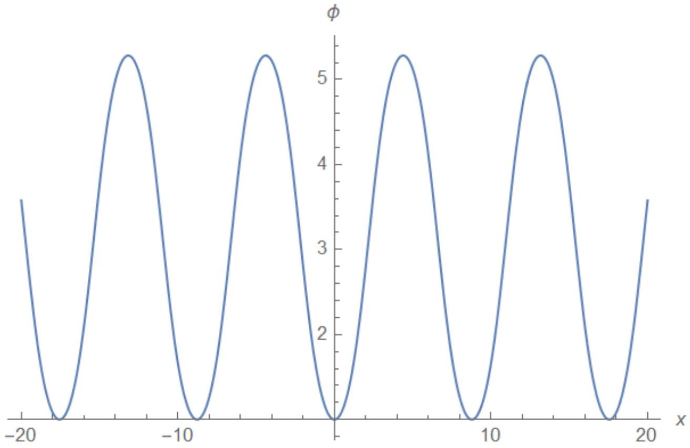

В процессе движения $\phi$ изменяется от 0 до $2 \pi . \phi ( - \infty ) = 0$, а $\phi ( + \infty ) = a \pi / 2 \Rightarrow a = 4$. Для нижней точки можем записать:

$$
\dot { \varphi } ( t ) = \frac { 4 b e ^ { b t } } { 1 + e ^ { 2 b t } } = \frac { \sqrt { 4 g L } } { L } ,
$$

откуда при $t = 0$ получаем $b = \sqrt { g / L } = \omega _ { 0 }$.

Ответ:

$$
a = 4 , \quad b = \sqrt { g / L }
$$

В1 ${ } ^ { 1.00 }$ Напишите уравнение движения для $\varphi ( x , t )$.

$$
I \frac { \partial ^ { 2 } \varphi _ { i } } { \partial t ^ { 2 } } = - m g d \sin \varphi _ { i } + K \left( \varphi _ { i + 1 } + \varphi _ { i - 1 } - 2 \varphi _ { i } \right)
$$

Так как $\lambda \gg b$, то можем написать $K \left( \varphi _ { i + 1 } + \varphi _ { i - 1 } - 2 \varphi _ { i } \right) \approx K b ^ { 2 } \left( \partial ^ { 2 } \varphi / \partial x ^ { 2 } \right)$. Таким образом, уравнение движения для $\varphi ( x , t )$ :

Ответ:

$$
K b ^ { 2 } \frac { \partial ^ { 2 } \varphi } { \partial x ^ { 2 } } - I \frac { \partial ^ { 2 } \varphi } { \partial t ^ { 2 } } = m g d \sin \varphi .
$$

В2 ${ } ^ { 0.50 }$ Постройте качественный график зависимости $\varphi ( x )$ для покоящегося солитона.

Ответ:

B3 ${ } ^ { 2.00 }$ Найдите максимальную скорость $v _ { c r }$ с которой может распространяться такой солитон.

Так как $\varphi ( x , t ) = \varphi ( x \pm v t )$, то $\left( \partial ^ { 2 } \varphi / \partial x ^ { 2 } \right) = \left( 1 / v ^ { 2 } \right) \left( \partial ^ { 2 } \varphi / \partial t ^ { 2 } \right)$, а значит

$$
\left( \frac { K b ^ { 2 } } { v ^ { 2 } } - I \right) \frac { \partial ^ { 2 } \varphi } { \partial t ^ { 2 } } = m g d \sin \varphi
$$

Для существования солитоноподобного решения, описанного в части A, необходимо, чтобы $\left( K b ^ { 2 } / v ^ { 2 } - I \right) > 0$.

Ответ:

$$
v _ { c r } = b \sqrt { K / I }
$$

Если $\lambda$ - характерный размер солитона, то $\tau = \lambda / v$ - характерное время, за которое он проходит отметку. Так как $\phi$ в заданной точке зависит лишь от $\omega t$, то $\lambda \sim ( v / \omega )$. Из уравнения (4) находим, что

$$
\omega = \sqrt { \frac { m g d } { \left( \frac { K b ^ { 2 } } { v ^ { 2 } } - I \right) } } \sim \sqrt { \frac { 1 } { \frac { v _ { c r } ^ { 2 } } { v ^ { 2 } } - 1 } } .
$$

Отсюда получаем, что $\lambda \sim \sqrt { v _ { c r } ^ { 2 } - v ^ { 2 } }$, а значит

Ответ:

$$
\lambda = \lambda _ { 0 } \sqrt { 1 - \frac { v ^ { 2 } } { v _ { c r } ^ { 2 } } } .
$$

В5 ${ } ^ { 2.00 }$ Пусть энергия покоящегося солитона равна $E _ { 0 }$. Найдите энергию солитона, движущегося со скоростью $v$.

Полная энергия солитона

$$
E = \sum _ { i } \frac { I \ddot { \varphi } _ { i } ^ { 2 } } { 2 } + \sum _ { i } \frac { K \left( \varphi _ { i + 1 } - \varphi _ { i } \right) ^ { 2 } } { 2 } + \sum _ { i } m g d \left( 1 - \cos \varphi _ { i } \right) \sim \int _ { - \infty } ^ { \infty } \varepsilon d x
$$

где

$$
\varepsilon = \frac { 1 } { 2 } \left( \frac { \partial \varphi } { \partial x } \right) ^ { 2 } \frac { \left( I v ^ { 2 } + K b ^ { 2 } \right) } { b } + \frac { m g d } { b } ( 1 - \cos \varphi ) .
$$

плотность энергии. Если $\lambda$ - характерный размер солитона, то

$$
\int _ { - \infty } ^ { + \infty } \left( \frac { \partial \varphi } { \partial x } \right) ^ { 2 } d x \sim \frac { 1 } { \lambda }
$$

и

$$
\int _ { - \infty } ^ { + \infty } ( 1 - \cos \varphi ) d x \sim \lambda
$$

Рассмотрим покоящийся солитон. Тогда $E _ { 0 } = \frac { A } { \lambda _ { 0 } } + B \lambda _ { 0 }$, где $A$ и $B$ - некоторые константы. Так как энергия для покоящегося солитона должна принимать минимальное значение, то

$$
- \frac { A } { \lambda _ { 0 } ^ { 2 } } + B = 0
$$

т.е. $\lambda _ { 0 } = \sqrt { B / A }$. Для солитона движущегося со скоростью $v$ энергия запишется в виде

$$
E = \frac { A } { \lambda } \frac { I v ^ { 2 } + K b ^ { 2 } } { K b ^ { 2 } } + B \lambda = \frac { A } { \lambda _ { 0 } \sqrt { 1 - \frac { v ^ { 2 } } { v _ { c r } ^ { 2 } } } } \left( \frac { v ^ { 2 } } { v _ { c r } ^ { 2 } } + 1 \right) + B \lambda _ { 0 } \sqrt { 1 - \frac { v ^ { 2 } } { v _ { c r } ^ { 2 } } } = \frac { \frac { A } { \lambda _ { 0 } } \left( \frac { v ^ { 2 } } { v _ { c r } ^ { 2 } } + 1 \right) + B \lambda _ { 0 } \left( 1 - \frac { v ^ { 2 } } { v _ { c r } ^ { 2 } } \right) } { \sqrt { 1 - \frac { v ^ { 2 } } { v _ { c r } ^ { 2 } } } } .
$$

Используя то, что $A / \lambda _ { 0 } = B \lambda _ { 0 }$ и $\left( A / \lambda _ { 0 } \right) + B \lambda _ { 0 } = E _ { 0 }$, получаем

Ответ:

$$
E = \frac { E _ { 0 } } { \sqrt { 1 - \frac { v ^ { 2 } } { v _ { c r } ^ { 2 } } } } .
$$

взаимодействия между солитонами.

Заметим, что угол $\varphi ( x , t = 0 ) = 4 \arctan e ^ { \pm \omega x / v }$ при больших (по модулю) значениях x равен $4 e ^ { - \omega | x | / v }$. Значит, учитывая то, что

$$
\frac { \omega } { v } = \frac { 1 } { v } \sqrt { \frac { m g d } { \left( \frac { K b ^ { 2 } } { v ^ { 2 } } - I \right) } } = \sqrt { \frac { m g d } { \left( K b ^ { 2 } - I v ^ { 2 } \right) } } ,
$$

плотность энергии для покоящегося солитона в удаленных точках

$$
\varepsilon = \frac { K b } { 2 } \left( \frac { \partial \phi } { \partial x } \right) ^ { 2 } + \frac { m g d } { b } ( 1 - \cos \phi ) \approx \frac { K b } { 2 } \frac { \omega _ { 0 } ^ { 2 } } { v ^ { 2 } } ( \varphi ) ^ { 2 } + \frac { m g d } { 2 b } ( \varphi ) ^ { 2 } = 16 \frac { m g d } { b } e ^ { - \sqrt { \frac { m g d } { K b ^ { 2 } } } x } \sim e ^ { - 2 x / l } ,
$$

где $l = \sqrt { \frac { m g d } { K b ^ { 2 } } }$. Таким образом плотность энергии спадает экспоненциально быстро с расстоянием. Поэтому, когда мы имеем два солитона, влияние одного на плотность энергии другого существенно только начиная с середины дистанции между ними. Для нахождения силы воспользуемся методом виртуальных перемещений: $F \Delta x \approx \varepsilon _ { M } \Delta x$, где $\varepsilon _ { M } \approx \varepsilon ( R / 2 )$ - характерная плотность энергии на "границе влияния". Таким образом заключаем, что сила взаимодействия экспоненциально спадает с расстоянием, и в ведущем члене $F \sim e ^ { - R / l }$.
