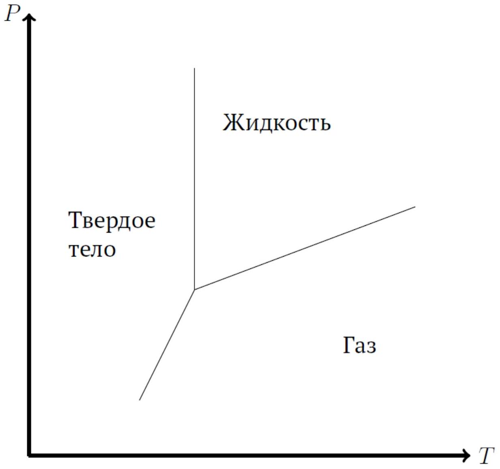
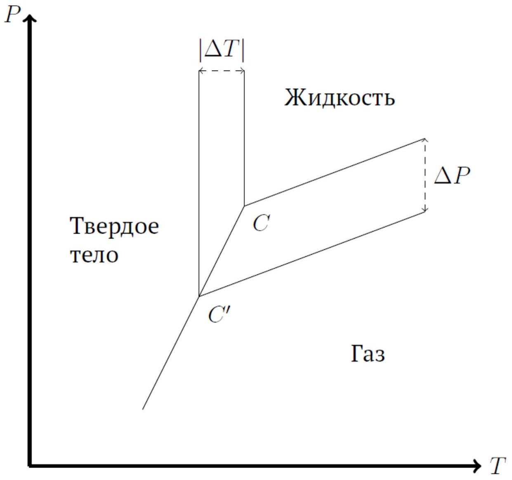

А1 ${ } ^ { 0.20 }$ При какой температуре кипит вода в Швейцарии на пике Дюфур на высоте 4634 м, если давление там 430 мм.рт.ст. Нормальное давление 760 мм.рт.ст. В нормальных условиях вода кипит при $100 ^ { \circ } \mathrm { C }$.

Индекс 1 будем обозначать жидкость, индексом 2 - газ. Т.к. удельный объем газа много больше удельного объема жидкости, то

$$
v _ { 2 } - v _ { 1 } \approx v _ { 2 } = \frac { R T } { p }
$$

Подставляя в уравнение Клапейрона-Клаузиуса и интегрируя его, получим

$$
\Delta \ln P = - \frac { q } { R } \Delta \frac { 1 } { T } .
$$

Здесь $q$ - теплота в пересчете на 1 моль, т.е. $q = q _ { m } \mu$, где $q _ { m } \approx 2.3 \cdot 10 ^ { 6 }$ Дж/кг - та же теплота в пересчете на 1 кг, $\mu$ - молярная масса воды. Выражая отсюда $T _ { 1 }$, получим

Ответ:

$$
T _ { 1 } = 85 ^ { \circ } \mathrm { C } .
$$

А2 ${ } ^ { 0.10 }$ Найдите давление Лапласа в случае цилиндрической поверхности - разница давлений по разные стороны от искривленной поверхности жидкости. Выразите ответ через $\sigma , K , p _ { a }$ (атмосферное давление) и физические константы.

Рассмотрим участок поверхности, который в цилиндрических координатах заключен между углами $\varphi$ и $\varphi + d \varphi$, высоты $h$. На него действуют силы поверхностного натяжения $h \sigma$, угол между которыми $d \varphi$. Их равнодействующая будет равна $h \sigma d \varphi$ и направлена к оси цилиндра. Она должна быть уравновешена силой давления $P _ { \text {л } } h R d \varphi = P _ { \text {л } } h d \varphi / K$, откуда

Ответ:

$$
P _ { л } = \sigma K .
$$

А3 ${ } ^ { 0.10 }$ Найдите давление Лапласа в случае сферической поверхности. Выразите ответ через $\sigma , K , p _ { a }$ (атмосферное давление) и физические константы.

Рассмотрим участок сферической поверхности, задающийся уравнением $\theta \leq d \theta ( \theta$ - угол с произвольной осью, например $z )$. Проекция силы поверхностного натяжения на ось $z$ будет равна

$$
F _ { \sigma } = - 2 \pi R \sigma d \theta \cdot d \theta = - 2 \pi R \sigma d \theta ^ { 2 } .
$$

Она должна уравновешиваться силой давления:

$$
F _ { p } = P _ { л } \cdot \pi ( R d \theta ) ^ { 2 } .
$$

Отсюда находим

Ответ:

$$
P _ { л } = \frac { 2 \sigma } { R } = 2 \sigma K .
$$

A4 ${ } ^ { 0.10 }$ Рассмотрим пузырек в жидкости. Где давление больше: внутри (IN) пузырька или снаружи (OUT)?

Как ясно из предыдущих пунктов, давление больше внутри пузырька.

Ответ:

$$
I N .
$$

А5 ${ } ^ { 0.20 }$ Выразите $h$ через $\sigma , K , v _ { L } , v _ { G } , T , \mu$ и физические константы ( $\mu$ - молярная масса).

Обозначим давление прямо над поверхностью $A B$ через $P _ { 1 }$. Тогда давление прямо над поверхностью $C D$ будет меньше на давление столба газа высоты $h$ :

$$
P _ { 2 } \equiv P _ { \text {above CD } } = P _ { 1 } - \frac { g h } { v _ { G } } .
$$

Аналогично можем выразить давление прямо под поверхностью $C D$ :

$$
P _ { \text {under CD } } = P _ { 1 } - \frac { g h } { v _ { L } }
$$

Разность этих давлений должна быть равна $P _ { \text {under } \mathrm { CD } } - P _ { \text {above } \mathrm { CD } } = 2 \sigma K$, откуда находим $h$ :

Ответ:

$$
h = \frac { 2 \sigma K } { g } \frac { 1 } { 1 / v _ { L } - 1 / v _ { G } }
$$

А6 ${ } ^ { 0.40 }$ Пусть жидкость смачивает стенки сосуда. Выразите разницу давлений $p _ { 2 } - p _ { 1 }$ через $\sigma , K , v _ { L } , v _ { G } , T , \mu$ и физические константы.

Используя ответ предыдущего пункта,

Ответ:

$$
P _ { 2 } - P _ { 1 } = - \frac { g h } { v _ { G } } = - 2 \sigma K \frac { v _ { L } } { v _ { G } - v _ { L } } .
$$

А7 ${ } ^ { 0.10 }$ Каким будет ответ, если жидкость не будет смачивать стенок сосуда? Выразите ответ через $\sigma , K , v _ { L } , v _ { G } , T , \mu$ и физические константы.

В случае несмачивания поверхность $C D$ будет ниже $A B$ на $| h |$, в смысле достаточно поменять знак ответа (либо считать, что $K$ меняет знак):

Ответ:

$$
P _ { 2 } - P _ { 1 } = + 2 \sigma K \frac { v _ { L } } { v _ { G } - v _ { L } }
$$

А8 ${ } ^ { 0.40 }$ При большой кривизне (σΚ>>|P_2-P_1 |) $\sigma K \gg \left| p _ { 2 } - p _ { 1 } \right|$ поверхности уже нельзя считать плотность пара постоянной. Какой будет разность давлений $p _ { 2 } - p _ { 1 }$ в этом случае? Выразите ответ через $\sigma , K , v _ { L } , v _ { G } , T , \mu$ и физические константы.

В случае переменной плотности пара давления $P _ { 2 }$ и $P _ { 1 }$ связаны как

$$
P _ { 2 } = P _ { 1 } \exp \left( - \frac { \mu g h } { R T } \right) .
$$

Рассмотрение разницы давлений по-прежнему дает

$$
2 \sigma K + P _ { 1 } - P _ { 2 } = \frac { g h } { v _ { L } }
$$

Пренебрегая разностью давлений $P _ { 1 } - P _ { 2 }$ по сравнению с $\sigma K$, находим отсюда $h$ и искомую разность:

Ответ:

$$
P _ { 2 } - P _ { 1 } = - \frac { R T } { \mu v _ { G } } \left[ 1 - \exp \left( - \frac { 2 \mu \sigma K v _ { L } } { R T } \right) \right] .
$$

В1 ${ } ^ { 0.50 }$ Выразите осмотическое давление $p _ { o s }$ для слабого раствора (раствора с малой концентрацией растворенного вещества). Выразите ответ через $p _ { a } , n$, $n _ { s } , T$ и физические константы.

Ответ:

$$
P _ { o s } = n _ { s } k T .
$$

В2 ${ } ^ { 0.50 }$ Выразите разницу $p - p _ { 0 }$ через $v _ { L } , v _ { G } , p _ { o s }$ и физические константы.

Гидростатическое давление дополнительного столба жидкости должно быть равно осмотическому давлению:

$$
\frac { g h } { v _ { L } } = P _ { o s }
$$

Тогда искомая разность

Ответ:

$$
P - P _ { 0 } = - \frac { g h } { v _ { G } } = - \frac { v _ { L } } { v _ { G } } P _ { o s }
$$

В3 ${ } ^ { 0.30 }$ Выразите разницу $p - p _ { 0 }$ через $p _ { 0 } , n , n _ { s }$ и физические константы.

Подставим выражение для осмотического давления:

$$
P - P _ { 0 } = - \frac { v _ { L } } { v _ { G } } n _ { s } k T .
$$

Замечаем, что $\frac { k T } { v _ { G } } = P _ { 0 }$ - давление газа, если $v _ { G }$ относить к одной молекуле. Но тогда $v _ { L }$ можно переписать как $1 / n$ :

Ответ:

$$
P - P _ { 0 } = - P _ { 0 } \frac { n _ { s } } { n } \text {. }
$$

С1 ${ } ^ { 2.00 }$ Считая разницу между $p$ и $p _ { 0 }$ малой, найдите изменение температуры кипения жидкости при растворении в ней какого-либо вещества. Выразите ответ через $\mu , T , q _ { 12 } , n _ { s } , n$ и физические константы.

Рассмотрим пузырек газа внутри жидкости. Как мы видели в пунктах В2 и В3, давление пара над раствором будет меньше на $P _ { 0 } n _ { s } / n$. Тогда, чтобы парам в растворе достичь того же давления, что в чистой жидкости, температура раствора должна быть больше на $\Delta T = \frac { d T } { d P } P _ { 0 } n _ { s } / n$, где производная находится из уравнения Клаузиуса:

Ответ:

$$
\Delta T = \frac { n _ { s } } { n } \frac { R T ^ { 2 } } { \mu \left| q _ { 12 } \right| } .
$$

C2 ${ } ^ { 0.30 }$ Каков знак изменения температуры кипения жидкости при растворении в ней чего-либо?
T.к. $d P _ { \text {нас } } / d T > 0$, то

Ответ:

$$
\Delta T > 0 .
$$

C3 ${ } ^ { 1.50 }$ Выразите $q _ { 23 }$ через $q _ { 13 }$ и $q _ { 21 }$ в тройной точке.

Теплоту перехода $q _ { 21 }$ можно выразить как разницу внутренней энергии между фазами + работу:

$$
q _ { 21 } = U _ { 1 } - U _ { 2 } + p \left( V _ { 1 } - V _ { 2 } \right) .
$$

Аналогичное выражение можем записать для $q _ { 13 }$ и $q _ { 23 }$ :

$$
\begin{aligned}
& q _ { 13 } = U _ { 3 } - U _ { 1 } + p \left( V _ { 3 } - V _ { 1 } \right) , \\
& q _ { 23 } = U _ { 3 } - U _ { 2 } + p \left( V _ { 3 } - V _ { 2 } \right) .
\end{aligned}
$$

Видно, что

Ответ:

$$
q _ { 23 } = q _ { 21 } + q _ { 13 } .
$$

Ответ:

С5 ${ } ^ { 2.00 }$ Найдите изменение температуры замерзания жидкости при растворении в ней какого-либо вещества. Выразите ответ через $\mu , T , q _ { 13 } , n _ { s } , n$ и физические константы.

Пусть $C$ - тройная точка до растворения, $C ^ { \prime }$ - после (см. рис.). Аналогично рассуждениям пункта С1, прямая жидкость-газ опускается на

$$
\Delta P = P _ { 0 } \frac { n _ { s } } { n } .
$$

Из рисунка ясно, что

$$
| \Delta T | \left( \left( \frac { d P } { d T } \right) _ { \text {пар-тт } } - \left( \frac { d P } { d T } \right) _ { \text {пар-жидкость } } \right) = | \Delta P | \text {. }
$$

Учитывая, что объем газа много больше как объема жидкости, так и объема твердого тела, выражение в скобках можно упростить, используя уравнение Клаузиуса, и получить

Ответ:

$$
| \Delta T | = \frac { n _ { s } } { n } \frac { R T ^ { 2 } } { \mu q _ { 13 } } .
$$

C6 ${ } ^ { 0.30 }$ Каков знак изменения температуры замерзания жидкости при растворении в ней чего-либо?

Как видно из рисунка, $C ^ { \prime }$ лежит левее $C$, т.е. $\Delta T < 0$.

Ответ:

$$
\Delta T < 0 .
$$
