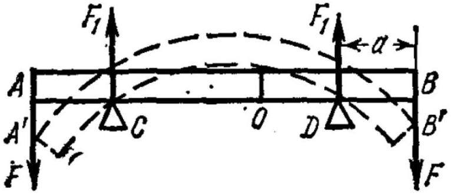
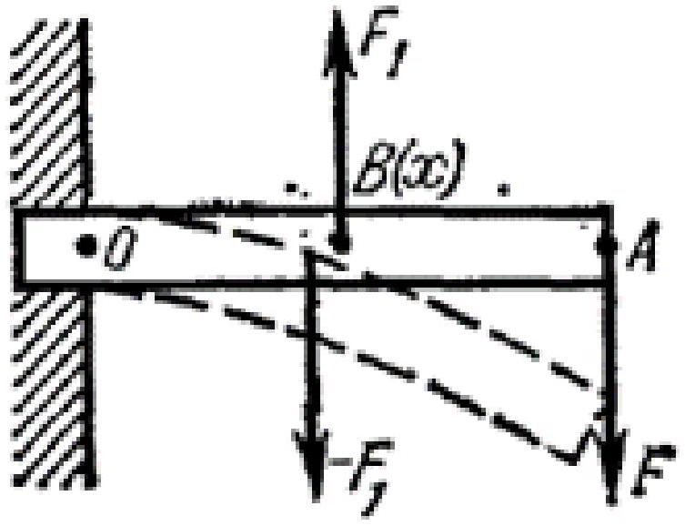

А1 ${ } ^ { 1.00 }$ Рассмотрите случай деформации всестороннего сжатия, когда все напряжения $\sigma _ { x } , \sigma _ { y } , \sigma _ { z }$ равны и отрицательны (на брусок действует постоянное давление со всех сторон $P = - \sigma _ { x } = - \sigma _ { y } = - \sigma _ { z }$ ). Модулем всестороннего сжатия называется величина $K$, которая определяется из соотношения:

$$
\frac { \Delta V } { V } = - \frac { P } { K } ,
$$

где $V$ - объём бруска. Определите модуль всестороннего сжатия $K$ через $E$ и $\mu$.

Объем выражается через стороны бруска как

$$
V = l _ { x } l _ { y } l _ { z } .
$$

Дифференцируя логарифм объема, получаем

$$
\frac { \Delta V } { V } = \frac { \Delta l _ { x } } { l _ { x } } + \frac { \Delta l _ { y } } { l _ { y } } + \frac { \Delta l _ { z } } { l _ { z } } = \varepsilon _ { x } + \varepsilon _ { y } + \varepsilon _ { z } .
$$

Используем выражение для деформации

$$
\varepsilon _ { x } = \frac { \sigma _ { x } } { E } - \mu \frac { \sigma _ { y } + \sigma _ { z } } { E } = - \frac { P } { E } ( 1 - 2 \mu ) .
$$

Для деформаций по двум другим осям выражения такие же.
Тогда получаем

$$
\frac { \Delta V } { V } = - \frac { 3 P } { E } ( 1 - 2 \mu )
$$

Ответ:

$$
K = \frac { E } { 3 ( 1 - 2 \mu ) }
$$

А2 ${ } ^ { 1.00 }$ Рассмотрите случай деформации одноосного растяжения. В этом случае однородный стержень может растягиваться или сжиматься только в одном направлении, в направлении оси, которую примите за координатную ось $x$. Поперечные размеры стержня не меняются! (этому мешает окружающая среда). Модулем одностороннего растяжения называется величина $E ^ { \prime }$, которая определяется из соотношения:

$$
\frac { \Delta l _ { x } } { l _ { x } } = \frac { \sigma _ { x } } { E ^ { \prime } } .
$$

Определите модуль одностороннего растяжения $E ^ { \prime }$ через $E$ и $\mu$.

Запишем уравнения для деформации вдоль оси $y$ и потребуем, чтобы она была равна нулю

$$
\varepsilon _ { y } = \frac { \sigma _ { y } } { E } - \mu \frac { \sigma _ { x } + \sigma _ { z } } { E } = 0 , \quad \sigma _ { y } = \mu \left( \sigma _ { x } + \sigma _ { z } \right) .
$$

Такое же уравнение можно записать и для оси $z$ :

$$
\sigma _ { z } = \mu \left( \sigma _ { x } + \sigma _ { y } \right) .
$$

Решая эту пару уравнений, получим

$$
\sigma _ { y } = \sigma _ { z } = \frac { \mu } { 1 - \mu } \sigma _ { x } .
$$

Тогда деформация вдоль оси $x$

$$
\varepsilon _ { x } = \frac { \sigma _ { x } } { E } - \mu \frac { \sigma _ { y } + \sigma _ { z } } { E } = \frac { \sigma _ { x } } { E } \left( 1 - \frac { 2 \mu ^ { 2 } } { 1 - \mu } \right) = \frac { \sigma _ { x } } { E } \frac { 1 - \mu - 2 \mu ^ { 2 } } { 1 - \mu }
$$

Ответ:

$$
E ^ { \prime } = E \frac { 1 - \mu } { 1 - \mu - 2 \mu ^ { 2 } } = E \frac { 1 - \mu } { ( 1 + \mu ) ( 1 - 2 \mu ) }
$$

В1 ${ } ^ { 0.50 }$ Рассмотрите волокно бруса, находящееся на расстоянии $\xi$ от нейтрального сечения (величина $\xi$ положительна, если волокно находится выше нейтрального сечения и отрицательна, если ниже). Найдите удлинение этого волокна $\Delta l ( \xi )$. Выразите ответ через $l _ { 0 } , \alpha , \xi$.

Радиус окружности в которую переходит сечение на расстоянии $\xi$ от нейтрального, равен $R _ { 1 } = R + \xi$. Угол одинаков для всех сечений, поэтому при $l _ { 0 } = R \alpha$, $l _ { 1 } = R _ { 1 } \alpha = ( R + \xi ) l _ { 0 } / R$. Тогда удлинение $\Delta l = l _ { 1 } - l _ { 0 } = \xi l _ { 0 } / R$

Ответ:

$$
\Delta l ( \xi ) = \frac { l _ { 0 } } { R } \xi
$$

В2 ${ } ^ { 0.50 }$ Определите натяжение $\tau$, действующее вдоль рассматриваемого волокна. Выразите ответ через модуль Юнга $E , \xi , \alpha , R , l _ { 0 }$.

Ответ:

$$
\tau = E \frac { \Delta l } { l _ { 0 } } = E \frac { \xi } { R }
$$

Вз ${ } ^ { 2.00 }$ Пусть нейтральная линия и нейтральное сечение проходят через центр тяжести поперечного сечения бруса. Тогда сумма сил в одном сечении равно нулю. Выразите в интегральной (интеграл по площади сечения, $d S$ - элемент площади для интегрирования) форме момент сил натяжения действующих на сечение $A B$. Выразите ответ через $E , \xi , \alpha , R , l _ { 0 }$.

На элемент площади $d S$ действует сила $d F = \tau d S$. Момент этой силы относительно оси, проходящей перпендикулярно плоскости рисунка $d M = \xi d F = \tau \xi d S = \frac { E } { R } \xi ^ { 2 } d S$. Интегрируя, получаем ответ

Ответ:

$$
M = \frac { E } { R } \int \xi ^ { 2 } d S
$$

B3 0.90
Обратите внимание на получившийся в предыдущем пункте интеграл. Введём обозначение $I = \int \xi ^ { 2 } d S$. Величина $I$ называется моментом инерции поперечного сечения бруса по аналогии с соответствующей величиной, вводимой при рассмотрении вращения тела вокруг неподвижной оси. Однако, в отличие от последней величины, имеющей размерность массы умноженной на квадрат длины, $I$ есть чисто геометрическая величина с размерностью четвертой степени длины. Определите $I$ для разных форм поперечных сечений бруса:

- Прямоугольное сечение с шириной $w$ и высотой $h$.
- Круговое сечение радиуса $r$.
- Сечение цилиндрической трубы с внутренним диаметром $r _ { 1 }$ и наружным $r _ { 2 }$.

Воспользуемся известными результатами для моментов инерции тел. Только теперь нужно считать, что эти тела плоские, сделанные из вещества с поверхностной плотностью, равной 1. Тогда вместо массы тела нужно использовать его площадь.

$$
\begin{aligned}
\text { 1) } I & = w h \frac { 1 } { 12 } h ^ { 2 } = \frac { w h ^ { 3 } } { 12 } . \\
\text { 2) } I & = \pi r ^ { 2 } \frac { 1 } { 4 } r ^ { 2 } = \frac { \pi } { 4 } r ^ { 4 } .
\end{aligned}
$$

Последний момент инерции можно получить как разность моментов инерции двух круговых сечений. Нужно учесть, что теперь $r$ - диаметр, а не радиус.

$$
\text { 3) } I = \frac { \pi } { 64 } \left( r _ { 2 } ^ { 4 } - r _ { 1 } ^ { 4 } \right)
$$

Ответ:

1) $I = \frac { w h ^ { 3 } } { 12 }$
2) $I = \frac { \pi r ^ { 4 } } { 4 }$
3) $I = \frac { \pi \left( r _ { 2 } ^ { 4 } - r _ { 1 } ^ { 4 } \right) } { 64 }$

C1 ${ } ^ { 1.50 }$
Рассмотрите однородный стержень с модулем Юнга $E$ с круговым сечением радиуса $r$ и длиной $l _ { 0 }$, который лежит на двух симметрично расположенных опорах $C$ и $D$. К концам стержня $A$ и $B$ приложены одинаково направленные силы $F$. Найдите радиус кривизны $R ( x )$ изогнутого бруса в каждой его точке по длине (координату $x$ отсчитывайте по неизогнутому стержню от его центра). Выразите ответ через $E , F , a , r , l _ { 0 }$.
Силой тяжести следует пренебречь по сравнению с $F$. Считайте также, что $R \gg l _ { 0 }$.

Рассмотрим сначала центральный участок бруса, расположенный между опорами. Мысленно разрежем его на две части в точке с координатой $| x | < l _ { 0 } / 2 - a$ (отсчитывается от центра), тогда со стороны внешних сил на правый участок действует момент $M = F a$. Он должен уравновешиваться моментом упругих сил, поэтому

$$
F a = \frac { E I } { R } , \quad R = \frac { E I } { F a } = \frac { \pi E r ^ { 4 } } { 4 F a } .
$$

Если же мы рассмотрим участок, который находится за одной из опор (например за правой), то момент сил будет создаваться только одной самой правой силой.
Поскольку мы отсчитываем момент относительно центрального точки разрезания, он равен $M = F \left( l _ { 0 } / 2 - x \right)$.
Тогда радиус кривизны

$$
R = \frac { \pi E r ^ { 4 } } { 4 F \left( l _ { 0 } / 2 - x \right) }
$$

Ответ:

$$
R = \begin{cases} \frac { \pi E r ^ { 4 } } { 4 F a } , & | x | < \frac { l _ { 0 } } { 2 } - a ; \\ \frac { \pi E r ^ { 4 } } { 4 F \left( l _ { 0 } / 2 - | x | \right) } , & | x | > \frac { l _ { 0 } } { 2 } - a . \end{cases}
$$

C2 ${ } ^ { 2.00 }$
Рассмотрите балку с прямоугольным сечением с шириной $w$ и высотой $h$ и длиной $l _ { 0 }$, жёстко закреплённую в стене одним своим концом (перпендикулярно стене в месте крепления). На другой конец балки действует сосредоточенная сила $F$. Пусть $x$ - координата по длине неизогнутой балки, отсчитываемая от стены, $y ( x )$ - отклонение по высоте от неизогнутого положения балки. Определите функцию $y ( x )$. Выразите ответ через $E , F , l _ { 0 } , w , h$.
Силой тяжести следует пренебречь по сравнению с $F$. Считайте также, что для любого $x$ выполнено: $y ( x ) \ll l _ { 0 }$.
При решении Вам может понадобиться формула для радиуса кривизны линии заданной уравнением $y ( x ) : R = \frac { \left( 1 + y ^ { \prime } ( x ) ^ { 2 } \right) ^ { 3 / 2 } } { y ^ { \prime \prime } ( x ) }$.

Момент, который действует на участок балки на расстоянии $x$ от стены равен $F \left( l _ { 0 } - x \right)$. Тогда радиус кривизны

$$
R = \frac { E I } { F \left( l _ { 0 } - x \right) } .
$$

Здесь $I = w h ^ { 3 } / 12$ - момент инерции балки.
Поскольку по условию изгиб мал, можно считать $y ^ { \prime } \ll 1$ и приближенно записать

$$
R = \frac { 1 } { y ^ { \prime \prime } ( x ) }
$$

Тогда получим дифференциальное уравнение для формы балки

$$
y ^ { \prime \prime } = \frac { F } { E I } \left( l _ { 0 } - x \right) .
$$

Будем интегрировать это уравнение с учетом начальных условий $y ( 0 ) = 0 , y ^ { \prime } ( 0 ) = 0$ :

$$
y ^ { \prime } ( x ) = \frac { F } { E I } \left( l _ { 0 } x - \frac { x ^ { 2 } } { 2 } \right) , \quad y ( x ) = \frac { F } { E I } \left( \frac { l _ { 0 } x ^ { 2 } } { 2 } - \frac { x ^ { 3 } } { 6 } \right) .
$$

Ответ:

$$
y ( x ) = \frac { 12 F } { E w h ^ { 3 } } \left( \frac { l _ { 0 } x ^ { 2 } } { 2 } - \frac { x ^ { 3 } } { 6 } \right)
$$
