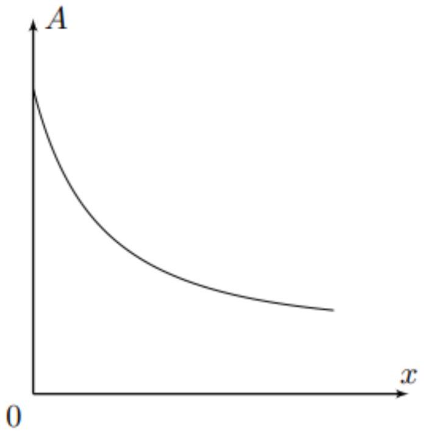
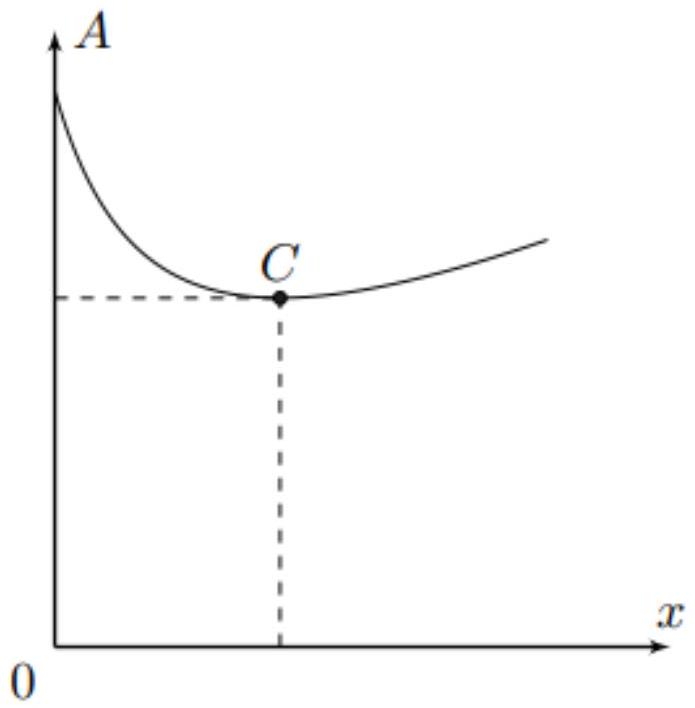
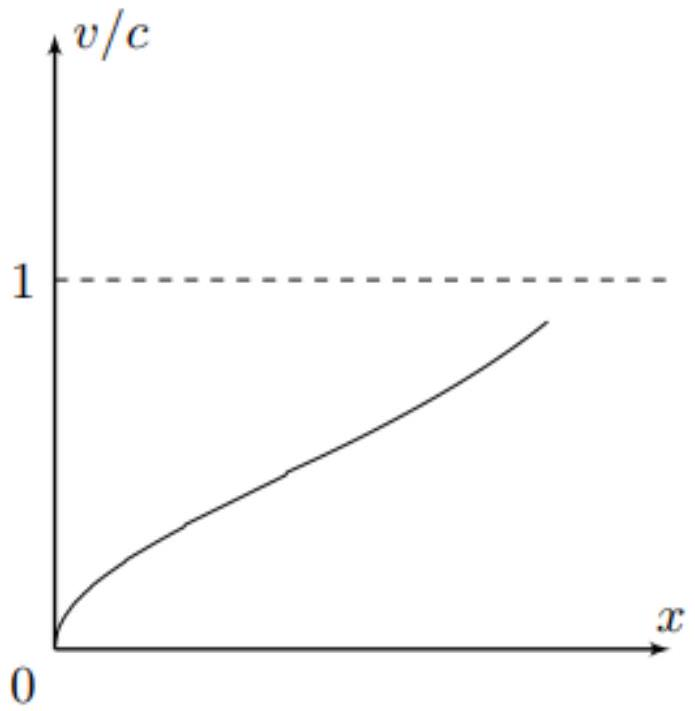
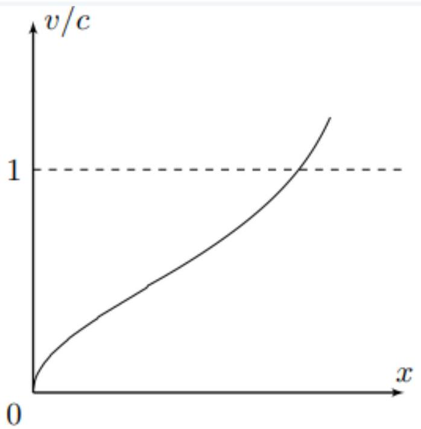
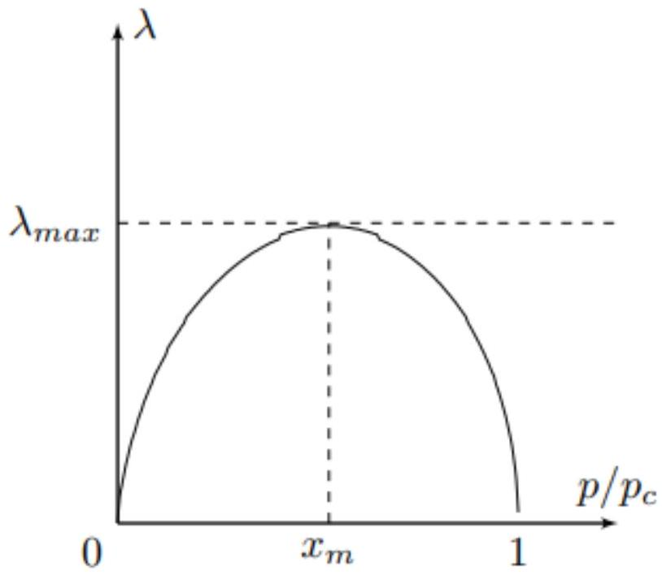

Запишем закон изменения импульса в проекции на ось $x$ для выделенного цилиндра:

$$
d F _ { x } = ( p ( x ) - p ( x + d x ) ) S = - S d p = a _ { x } d m = \rho S a _ { x } d x
$$

откуда:

$$
\frac { d p } { d x } = - \rho a _ { x }
$$

Поскольку движение газа является стационарным - скорость движения газа $v _ { x }$ является функцией только координаты $x$. Таким образом:

$$
a _ { x } = \frac { d v _ { x } } { d t } = \frac { d v _ { x } } { d x } \frac { d x } { d t } = v _ { x } \frac { d v _ { x } } { d x } .
$$

Тогда для градиента давления имеем:

Ответ:

$$
\frac { d p } { d x } = - \rho v \frac { d v } { d x } .
$$

A2 ${ } ^ { 0.50 }$ Определите величину скорости звука $c$ в газе. Ответ выразите через $p , \rho$ и показатель адиабаты $\gamma$.

Выражение для скорости звука $c$ в газе даётся выражением:

$$
c = \sqrt { \left( \frac { \partial p } { \partial \rho } \right) _ { S } } ,
$$

где частная производная $p$ по $\rho$ берётся при постоянной энтропии $S$.
В адиабатическом процессе:

$$
p V ^ { \gamma } = \text { const } \Rightarrow p \rho ^ { - \gamma } = \text { const } \Rightarrow \frac { d p } { d \rho } = \frac { \gamma p } { \rho } .
$$

Таким образом:

Ответ:

$$
c = \sqrt { \frac { \gamma p } { \rho } } .
$$

В1 ${ } ^ { 1.00 }$ Обозначим площадь поперечного сечения сопла за $A$. Определите величину $d A / d x$. Ответ выразите через $A , v , c$ и $d v / d x$.

Массовый расход газа должен быть одинаков в каждой точке трубы в силу стационарности течения. Отсюда:

$$
\rho v A = \text { const } \Rightarrow \frac { d \rho } { \rho } + \frac { d v } { v } + \frac { d A } { A } = 0 .
$$

Тогда для $d A / d x$ имеем:

$$
\frac { d A } { d x } = - A \left( \frac { 1 } { v } \frac { d v } { d x } + \frac { 1 } { \rho } \frac { d \rho } { d x } \right)
$$

Избавимся от величины $d \rho / d x$ с помощью продифференцированного в А2 уравнения адиабаты:

$$
\frac { d \rho } { d x } = \frac { \rho } { \gamma p } \frac { d p } { d x } = \frac { 1 } { c ^ { 2 } } \frac { d p } { d x } .
$$

Воспользовавшись результатом пункта А1, получим:

$$
\frac { d \rho } { d x } = - \frac { \rho v } { c ^ { 2 } } \frac { d v } { d x } .
$$

Тогда для $d A / d x$ имеем:

Ответ:

$$
\frac { d A } { d x } = - \frac { A } { v } \frac { d v } { d x } \left( 1 - \frac { v ^ { 2 } } { c ^ { 2 } } \right) .
$$

В2 ${ } ^ { 0.50 }$ Качественно постройте профиль сечения сопла $A ( x )$, когда скорость газа на выходе $v < c$. Можно считать, что при входе в сопло скорость газа пренебрежимо мала. Укажите особые точки (если они есть).

Ответ:

В3 ${ } ^ { 0.50 }$ Качественно постройте профиль сечения сопла $A ( x )$, когда скорость газа на выходе $v > c$. Можно считать, что при входе в сопло скорость газа пренебрежимо мала. Укажите особые точки (если они есть).

Ответ:

Ответ: В точке $C$ площадь сечения принимает минимальное значение.

С1 ${ } ^ { 2.00 }$ Изготавливая ракетный двигатель, задается желаемое давление на выходе из сопла $p$. Найдите скорость истечения газа $v$ из сопла в зависимости от отношения $p / p _ { c }$. Ответ выразите через $p _ { c }$, $\rho _ { c ^ { \prime } }$, $\gamma$ и отношение $p / p _ { c }$.

При расширении газ подчиняется уравнению Пуассона:

$$
p V ^ { \gamma } = \mathrm { const } \Rightarrow p ^ { 1 - \gamma } T ^ { \gamma } = \mathrm { const } \Rightarrow T \sim p ^ { ( \gamma - 1 ) / \gamma } .
$$

Далее для решения задачи нам понадобится уравнение Бернулли для линии тока:

$$
\frac { v ^ { 2 } } { 2 } + \varphi + \frac { C _ { p } T } { \mu } = \text { const. }
$$

Приведём два способа его вывода.
Первый способ: переместим газ массой $d m$ из положения 1 в положение 2. С учётом стационарности движения закон сохранения энергии записывается следующим образом:

$$
\delta A _ { \text {внеш } } = p _ { 1 } d V _ { 1 } - p _ { 2 } d V _ { 2 } = d U + d W _ { p } + d E _ { k } = \frac { C _ { V } d m \left( T _ { 2 } - T _ { 1 } \right) } { \mu } + d m \left( \varphi _ { 2 } - \varphi _ { 1 } \right) + \frac { d m \left( v _ { 2 } ^ { 2 } - v _ { 1 } ^ { 2 } \right) } { 2 } .
$$

Поскольку $d V = d m / \rho$, получим:

$$
\delta A _ { \text {внеш } } = d m \left( \frac { p _ { 2 } } { \rho _ { 2 } } - \frac { p _ { 1 } } { \rho _ { 1 } } \right) \Rightarrow \frac { v ^ { 2 } } { 2 } + \varphi + \frac { C _ { V } T } { \mu } + \frac { p } { \rho } = \text { const. }
$$

Запишем уравнение Менделеева-Клапейрона:

$$
p V = \nu R T \Rightarrow \frac { p } { \rho } = \frac { R T } { \mu } .
$$

Поскольку $C _ { p } = C _ { V } + R$, имеем:

$$
\frac { v ^ { 2 } } { 2 } + \varphi + \frac { C _ { p } T } { \mu } = \text { const. }
$$

Второй способ: Из уравнения Эйлера имеем:

$$
\vec { a } = - \frac { \nabla p } { \rho } - \nabla \varphi .
$$

Рассмотрим скалярное произведение последнего выражения с вектором $d \vec { l }$, направленным вдоль данной линии тока:

$$
\vec { a } \cdot d \vec { l } = \vec { v } \cdot d \vec { v } = v d v = - \frac { d p } { \rho } - d \varphi
$$

Из уравнения Менделеева-Клапейрона получим:

$$
\frac { 1 } { \rho } = \frac { R T } { \mu p } \Rightarrow v d v = - \frac { R T } { \mu } \frac { d p } { p } - d \varphi .
$$

Продифференцируем уравнение Пуассона в координатах $p T$ :

$$
T ^ { \gamma } p ^ { 1 - \gamma } = \text { const } \Rightarrow \gamma T ^ { \gamma - 1 } d T p ^ { 1 - \gamma } + ( 1 - \gamma ) T ^ { \gamma } p ^ { - \gamma } d p = 0 \Rightarrow \frac { d p } { p } = \frac { \gamma } { \gamma - 1 } \frac { d T } { T } .
$$

Таким образом:

$$
v d v + \frac { \gamma R d T } { ( \gamma - 1 ) \mu } + d \varphi = 0 \Rightarrow \frac { v ^ { 2 } } { 2 } + \varphi + \frac { C _ { p } T } { \mu } = \text { const. }
$$

Из уравнения Бернулли имеем:

$$
\frac { C _ { p } T _ { c } } { \mu } = \frac { v ^ { 2 } } { 2 } + \frac { C _ { p } T } { \mu } \Rightarrow v = \sqrt { \frac { 2 C _ { p } T ^ { \prime } } { \mu } \left( 1 - \frac { T } { T _ { c } } \right) } .
$$

Отношение $T / T _ { c }$ определим из уравнения Пуассона:

$$
\frac { T } { T _ { c } } = \left( \frac { p } { p _ { c } } \right) ^ { ( \gamma - 1 ) / \gamma } .
$$

Окончательно с учётом уравнения Менделеева-Клапейрона находим:

Ответ:

$$
v = \sqrt { \frac { 2 \gamma } { \gamma - 1 } \frac { p _ { c } } { \rho _ { c } } \left( 1 - \left( \frac { p } { p _ { c } } \right) ^ { ( \gamma - 1 ) / \gamma } \right) } .
$$

С2 ${ } ^ { 0.40 }$ При каком значении $p ^ { \prime }$ скорость истечения из сопла достигает максимального значения? Чему равна эта максимальная скорость $v _ { \max }$ ? Ответы выразите через $p _ { c } , \rho _ { c }$ и $\gamma$.

Максимум скорости достигается при минимальном давлении $p$, поэтому:

Ответ:

$$
p ^ { \prime } = 0 .
$$

Ответ:

$$
v _ { \max } = \sqrt { \frac { 2 \gamma } { \gamma - 1 } \frac { p _ { c } } { \rho _ { c } } } .
$$

С3 ${ } ^ { 1.10 }$ Как зависит площадь выходного сечения сопла $A$ от желаемого давления на выходе из сопла $p$ (при фиксированных параметрах на входе в сопло)? Т.е. найдите функцию $A \left( p / p _ { c } \right)$, считая, что массовый расход в каждом сечении сопла постоянен и равен $\lambda$. Ответ выразите через $\lambda$, $p _ { c }$, $\rho _ { c }$, $\gamma$ и отношение $p / p _ { c }$.

На выходе имеем:

$$
\lambda = A v \rho .
$$

Выражение для скорости было получено в пункте С1, а плотность $\rho$ определим из уравнения Пуассона:

$$
p \rho ^ { - \gamma } = p _ { c } \rho _ { c } ^ { - \gamma } \Rightarrow \rho = \rho _ { c } \left( \frac { p } { p _ { c } } \right) ^ { 1 / \gamma } .
$$

Окончательно:

Ответ:

$$
A = \frac { \lambda } { \rho _ { c } \sqrt { \frac { 2 \gamma } { \gamma - 1 } \frac { p _ { c } } { \rho _ { c } } } \left( \frac { p } { p _ { c } } \right) ^ { 1 / \gamma } \left( 1 - \left( \frac { p } { p _ { c } } \right) ^ { ( \gamma - 1 ) / \gamma } \right) ^ { 1 / 2 } } .
$$

C4 ${ } ^ { 1.50 }$ Найдите отношение давлений $p _ { t } / p _ { c }$ в особых точках для пунктов В2 и В3. Ответ выразите через показатель адиабаты газа $\gamma$. Такие давления называют критическими.

Воспользуемся уравнением Бернулли:

$$
\frac { \gamma } { \gamma - 1 } \frac { p _ { c } } { \rho _ { c } } = \frac { v ^ { 2 } } { 2 } + \frac { \gamma } { \gamma - 1 } \frac { p _ { t } } { \rho _ { t } } .
$$

В особой точке $v = c = \sqrt { \gamma p _ { t } / \rho _ { t } }$, поэтому:

$$
\frac { p _ { c } } { \rho _ { c } } = \frac { \gamma - 1 } { 2 } \frac { p _ { t } } { \rho _ { t } } + \frac { p _ { t } } { \rho _ { t } } = \frac { \gamma + 1 } { 2 } \frac { p _ { t } } { \rho _ { t } } .
$$

Из уравнения Пуассона имеем:

$$
\frac { \rho _ { t } } { \rho _ { c } } = \left( \frac { p _ { t } } { p _ { c } } \right) ^ { 1 / \gamma } ,
$$

откуда:

Ответ:

$$
\frac { p _ { t } } { p _ { c } } = \left( \frac { 2 } { \gamma + 1 } \right) ^ { \gamma / ( \gamma - 1 ) } .
$$

С5 ${ } ^ { 0.70 }$ Для формы сопла, определенной в пункте В3, определите зависимость величины $v / c$ от величины $p / p _ { c }$. Ответ выразите через $\gamma$ и $p / p _ { c }$. Постройте качественные графики зависимости скорости течения газа $v / c$ вдоль сопла для случаев, когда давление на выходе больше критического ( $p / p _ { c } > p _ { t } / p _ { c }$ ) и когда давление на выходе меньше критического ( $p / p _ { c } < p _ { t } / p _ { c }$ ).

Получим искомую зависимость:

$$
\frac { v } { c } = \frac { \sqrt { \frac { 2 \gamma } { \gamma - 1 } \frac { p _ { c } } { \rho _ { c } } \left( 1 - \left( \frac { p } { p _ { c } } \right) \right) } } { \sqrt { \frac { \gamma p } { \rho } } } = \sqrt { \frac { 2 } { \gamma - 1 } \frac { p _ { c } } { p } \frac { \rho } { \rho _ { c } } \left( 1 - \left( \frac { p } { p _ { c } } \right) ^ { ( \gamma - 1 ) / \gamma } \right) } .
$$

С учётом уравнения Пуассона:

$$
\frac { v } { c } = \sqrt { \frac { 2 } { \gamma - 1 } \left( \left( \frac { p } { p _ { c } } \right) ^ { ( 1 - \gamma ) / \gamma } - 1 \right) } .
$$

Поскольку $d v / d x > 0 - d p / d x < 0$ по всей длине трубы, а значит величина $v / c$ монотонно возрастает во всей длине трубы.
Таким образом, при $p / p _ { c } > p _ { t } / p _ { c }$ максимальное значение $v / c < 1$, а при $p / p _ { c } < p _ { t } / p _ { c }$ максимальное значение $v / c > 1$.

Ответ:

C6 ${ } ^ { 0.80 }$ Для формы сопла, определенной в пункте В3, массовый расход газа на выходе из сопла можно представить в виде:

$$
\lambda = C \left( A _ { \mathrm { BЫX } } , \gamma , p _ { c } , \rho _ { c } \right) \cdot f \left( p / p _ { c } \right) ,
$$

где $C$ - постоянная величина, зависящая только от $A _ { \text {вых } } , \gamma , p _ { c }$ и $\rho _ { c }$, а $f \left( p / p _ { c } \right)$ - функция, зависящая только от отношения $p / p _ { c }$ и $\gamma$.
Определите функцию $f \left( p / p _ { c } \right)$. Ответ выразите через $p / p _ { c }$ и $\gamma$.
Постройте качественный график массового расхода $\lambda$ от давления на выходе из сопла ( $p / p _ { c } \in [ 0 ; 1 ]$ ). Если на графике имеются особые точки, то укажите их на графике и получите соответствующие им аналитические выражения $p / p _ { c }$.

Качественная зависимость $\lambda \left( p / p _ { c } \right)$ имеет следующий вид:

$$
\lambda = C \cdot \sqrt { \left( \frac { p } { p _ { c } } \right) ^ { 2 / \gamma } - \left( \frac { p } { p _ { c } } \right) ^ { ( \gamma + 1 ) / \gamma } } ,
$$

т.е:

Ответ:

$$
f \left( p / p _ { c } \right) = \sqrt { \left( \frac { p } { p _ { c } } \right) ^ { 2 / \gamma } - \left( \frac { p } { p _ { c } } \right) ^ { ( \gamma + 1 ) / \gamma } }
$$

Сразу обратим внимание, что при $p / p _ { c } = x = 0 ; 1$ массовый расход обращается в ноль.
Также массовый расход имеет максимум при следующем значении $x _ { m }$ :

$$
\frac { 2 } { \gamma } x ^ { ( 2 - \gamma ) / \gamma } - \frac { \gamma + 1 } { \gamma } x ^ { 1 / \gamma } = 0 \Rightarrow x _ { m } = \left( \frac { 2 } { \gamma + 1 } \right) ^ { \gamma / ( \gamma - 1 ) } .
$$

Качественный график приведён на рисунке ниже:

Ответ:

D1 ${ } ^ { 0.50 }$ Найдите удельный импульс, приобретаемый ракетой, при полете в атмосфере. Ответ выразите через $p _ { 0 } , p , A$ и $v$. Удельный импульс - это дополнительный импульс, приобретаемый ракетой, при выбросе единицы массы топлива.

При выбросе вещества импульс, получаемый ракетой в единицу времени, составляет:

$$
\frac { d P } { d t } = F ,
$$

где $F$ - полная сила, действующая на ракету.
Тогда для удельного импульса, обусловленного реактивной тягой, имеем:

$$
\frac { d P } { d m } = \frac { F } { \lambda }
$$

Сила, действующая на ракету, складывается из силы реактивной тяги $F _ { \mathrm { p } } = \lambda v$, а также разности сил атмосферного давления и давления, действующего на вылетающий газ $F _ { \text {д } } = - \left( p _ { 0 } - p \right) A$.
Таким образом:

$$
F = \lambda v - \left( p _ { 0 } - p \right) A ,
$$

или же:

Ответ:

$$
\frac { d p } { d m } = \frac { F } { \lambda } = v - \frac { \left( p _ { 0 } - p \right) } { \lambda } .
$$
