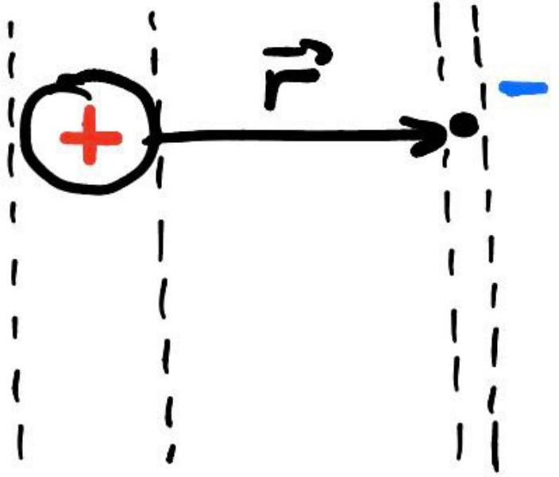
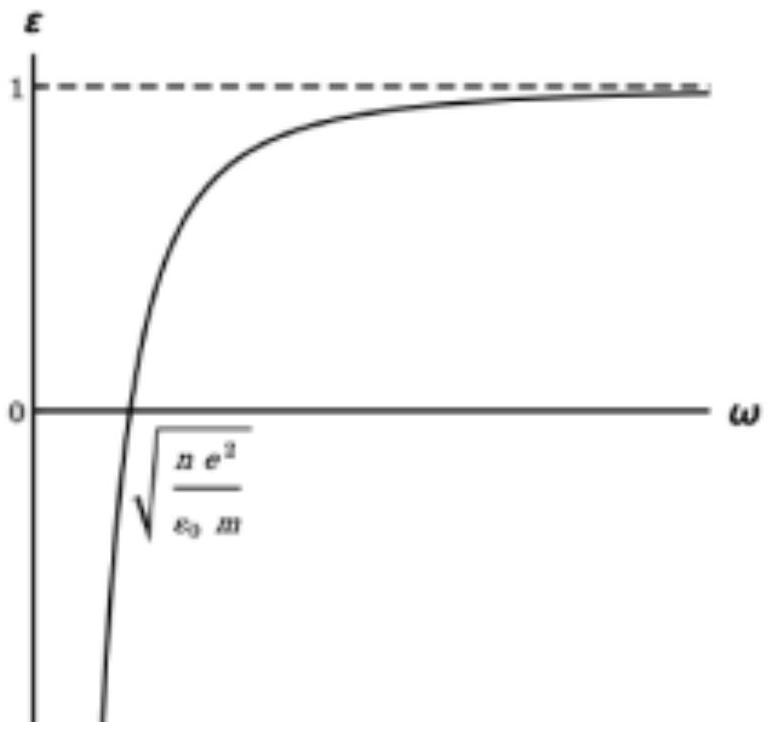
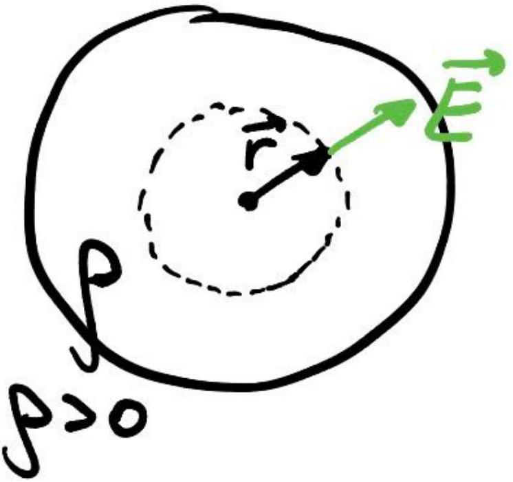
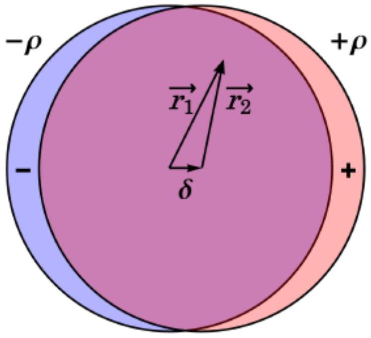
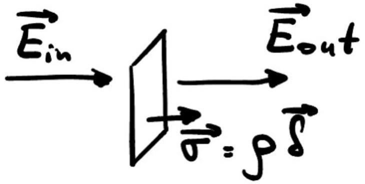
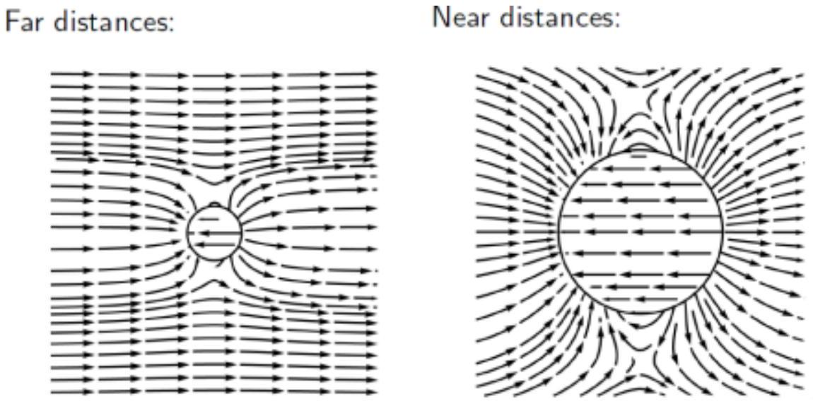
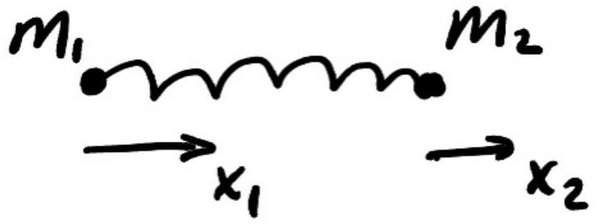
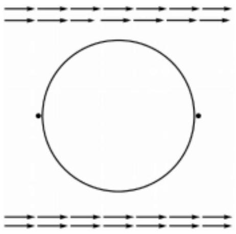

А1 ${ } ^ { 1.10 }$ Электрическое поле приводит к согласованному смещению $\vec { r } ( t )$ электронов в направлении поля. Определите зависимость $\vec { r } ( t )$ и вектор поляризации среды $P ( t )$ в установившемся режиме.

Запишем второй закон Ньютона для электрона, движущегося в указанном поле $( e > 0 )$ :

$$
m \frac { d ^ { 2 } } { d t ^ { 2 } } \vec { r } ( t ) = - e \vec { E } _ { 0 } \sin ( \omega t )
$$

Интегрируя уравнение движения, с условиями, что координата и скорость ограничены при $t \rightarrow \infty$, получаем ответ на первый вопрос

Ответ:

$$
\vec { r } ( t ) = \frac { e \vec { E } _ { 0 } } { m \omega ^ { 2 } } \sin \omega t
$$

В результате перераспределения зарядов среда приобретает дипольный момент. Дипольный момент направлен противоположно вектору $\vec { r }$. Таким образом, искомый вектор поляризации (как дипольный момент единицы объема) равен:

$$
\vec { P } = - \frac { \vec { r } \cdot e ( n r S ) } { r S } = - n e \vec { r } ,
$$

где $S$ - площадь поперечного сечения в плоскости перпендикулярной $\vec { r }$. Итоговый ответ:

Ответ:

$$
\vec { P } ( t ) = - \frac { n e ^ { 2 } \vec { E } _ { 0 } } { m \omega ^ { 2 } } \sin \omega t
$$

A2 ${ } ^ { 0.30 }$
Вычислите диэлектрическую проницаемость металла $\varepsilon ( \omega )$ и постройте график этой зависимости.

Используя соотношения между вектором электрической индукции, напряженности и поляризации, получим:

$$
\varepsilon _ { 0 } \varepsilon ( \omega ) \vec { E } _ { 0 } = \varepsilon \vec { E } _ { 0 } + \vec { P } ,
$$

учитывая ответ пункта А1, получаем ответ:

Ответ:

$$
\varepsilon ( \omega ) = 1 - \frac { n e ^ { 2 } } { \varepsilon _ { 0 } m \omega ^ { 2 } }
$$

В1 ${ } ^ { 2.60 }$ Определите поле $\vec { E } _ { \text {in } }$ внутри шара и его дипольный момент $\vec { d } _ { 0 }$.

Этот пункт задачи представляет собой классическую задачу по нахождению поля внутри диэлектрического шара, помещенного в постоянное электрическое поле. Одно из решений приводится ниже.

Рассмотрим вспомогательный случай: найдем электрическое поле внутри равномерно заряженного шара. Из соображений симметрии поле должно быть направлено по радиусу. Запишем теорему Гаусса для сферической поверхности произвольного радиуса внутри шара:

$$
4 \pi r ^ { 2 } E = \frac { 4 } { 3 } \pi r ^ { 3 } \rho \frac { 1 } { \varepsilon _ { 0 } } ,
$$

откуда

$$
E = \frac { \rho r } { 3 \varepsilon _ { 0 } } ,
$$

или в векторном виде:

$$
\vec { E } = \frac { \rho } { 3 \varepsilon _ { 0 } } \vec { r } .
$$

В соответствии с моделью, предложенной в условии, рассмотрим систему как два однородно заряженных шара, сдвинутых друг относительно друга на малый вектор $\vec { \delta }$, помещенных во внешнее поле $\vec { E } _ { 0 }$. В произвольной точке фиолетовой области рассчитаем поле:

$$
\vec { E } _ { i n } = \vec { E } _ { 0 } + \frac { - \rho } { 3 \varepsilon _ { 0 } } \vec { r } _ { 1 } + \frac { \rho } { 3 \varepsilon _ { 0 } } \vec { r } _ { 2 } = \vec { E } _ { 0 } + \frac { \rho } { 3 \varepsilon _ { 0 } } \left( \vec { r } _ { 2 } - \vec { r } _ { 1 } \right) = \vec { E } _ { 0 } - \frac { \rho \vec { \delta } } { 3 \varepsilon _ { 0 } } .
$$

Запишем теперь граничные условия в точке «+» шара. Граничное условие на скачок вектора напряженности при наличии заряда:

$$
\vec { E } _ { i n } + \frac { \vec { \sigma } } { \varepsilon _ { 0 } } = \vec { E } _ { o u t }
$$

где $\vec { \sigma } = \rho \vec { \delta }$ - поверхностная плотность заряда, умноженная на единичный вектор, направленный по $\vec { \delta }$. Так удобно записать все в векторном виде. Т.к. в точке «+» нет свободных зарядов, непрерывна нормальная компонента вектора $\vec { D }$, и с учетом связи напряженностей через диэлектрическую проницаемость:

$$
\vec { E } _ { \text {out } } = \varepsilon \vec { E } _ { \text {in } } .
$$

Решая систему из трех уравнений, приведенных выше, относительно $\vec { E } _ { \text {in } } , \vec { E } _ { \text {out } }$ и $\vec { \sigma }$, получим:

Ответ:

$$
\vec { E } _ { i n } = \frac { 3 } { \varepsilon + 2 } \vec { E } _ { 0 }
$$

Дипольный момент системы равен заряду шаров, умноженному на вектор $\vec { \delta }$, т.е.

$$
\vec { d } _ { 0 } = \frac { 4 } { 3 } \pi R ^ { 3 } \rho \cdot \vec { \delta } = \frac { 4 } { 3 } \pi R ^ { 3 } \vec { \sigma } ,
$$

а вектор $\vec { \sigma }$ также получим из решения системы уравнений выше. Таким образом:

Ответ:

$$
\vec { d } _ { 0 } = 4 \pi R ^ { 3 } \frac { \varepsilon _ { 0 } ( \varepsilon - 1 ) } { \varepsilon + 2 } \vec { E } _ { 0 }
$$

В2 ${ } ^ { 0.70 }$ Нарисуйте картину силовых линий электрического поля в системе (внутри, вблизи и вдали от шара), считая $\varepsilon ( \omega ) = - 3$.

Ответ:

ВЗ ${ } ^ { 0.20 }$ При некотором значении $\varepsilon \left( \omega _ { \text {res } } \right) = \varepsilon _ { \text {res } }$ амплитуда электрического поля внутри шара $\left| \vec { E } _ { i n } \right|$ начинает неограниченно возрастать. Определите значение $\varepsilon _ { \text {res } }$.

Ответ:

$$
\varepsilon _ { \text {res } } = - 2
$$

В4 ${ } ^ { 0.60 }$ Осциллирующий диполь излучает энергию. Оцените мощность $I$ этих потерь, используя анализ размерностей и тот факт, что интенсивность дипольного излучения зависит только от амплитуды дипольного момента $\left| \vec { d } _ { 0 } \right|$, частоты его колебаний $\omega _ { r e s }$, скорости распространения волн с и электрической постоянной $\varepsilon _ { 0 }$.

$$
I = \varepsilon _ { 0 } ^ { \alpha } \cdot \left| \vec { d } _ { s p } \right| ^ { \beta } \cdot \omega _ { r e s } ^ { \gamma } \cdot c ^ { \zeta }
$$

Запишем размерности величин

$$
\begin{aligned}
& { [ I ] = \mathrm { H } \cdot \mathrm { M } \cdot \mathrm { c } ^ { - 1 } } \\
& { \left[ \varepsilon _ { 0 } \right] = \text { Кл } ^ { 2 } \cdot \mathrm { H } ^ { - 1 } \cdot \mathrm { M } ^ { - 2 } } \\
& { [ d ] = \text { Кл } \cdot \mathrm { M } } \\
& { [ \omega ] = \mathrm { c } ^ { - 1 } } \\
& { [ c ] = \mathrm { M } \cdot \mathrm { c } ^ { - 1 } }
\end{aligned}
$$

Решая систему, получим $\alpha = - 1 , \beta = 2 , \gamma = 4 , \zeta = - 3$.

Ответ:

$$
I = \frac { \left| \vec { d } _ { s p } \right| ^ { 2 } \omega _ { \mathrm { res } } ^ { 4 } } { \varepsilon _ { 0 } c ^ { 3 } }
$$

В5 ${ } ^ { 3.80 }$ Оцените среднюю энергию, вкачиваемую в систему за счет внешнего поля в условиях плазмонного резонанса при $\omega = \omega _ { \text {res } }$. Из условия баланса энергии оцените амплитуду поля внутри шара в резонансе.

Оценим энергию, вкачиваемую в систему, как среднюю потенциальную энергию диполя за период.

$$
\begin{gathered}
W = - ( \vec { d } , \vec { E } ) = d _ { 0 } E _ { 0 } \cos ^ { 2 } \omega t = \frac { d _ { 0 } E _ { 0 } } { 2 } ( 1 - \cos 2 \omega t ) \\
\bar { W } = \frac { d _ { 0 } E _ { 0 } } { 2 }
\end{gathered}
$$

Таким образом, средняя мощность за период равна

$$
P = \bar { W } / T = \frac { d _ { 0 } E _ { 0 } \omega _ { \text {res } } } { 4 \pi }
$$

и с точностью до множителя может быть оценена как

$$
P \sim d _ { 0 } E _ { 0 } \omega _ { r e s } .
$$

В равновесном случае вкачиваемая мощность должна уноситься излучением $P = I$ или

$$
d _ { 0 } E _ { 0 } \omega _ { r e s } = \frac { \left| \vec { d } _ { 0 } \right| ^ { 2 } \omega _ { \mathrm { res } } ^ { 4 } } { \varepsilon _ { 0 } c ^ { 3 } } ,
$$

учитывая, что $d _ { 0 } = \varepsilon _ { 0 } E _ { i n } R ^ { 3 }$ из пункта B1, получаем ответ:

Ответ:

$$
E _ { i n } = E _ { 0 } \left( \frac { c } { \omega _ { r e s } R } \right) ^ { 3 }
$$

Классическая задача о приведенной массе.
Пусть смещения грузов относительно положения равновесия равны $x _ { 1 }$ и $x _ { 2 }$, соответственно. Запишем уравнения движения:

$$
\left\{ \begin{array} { l }
m _ { 1 } \ddot { x } _ { 1 } = - k \left( x _ { 1 } - x _ { 2 } \right) \\
m _ { 2 } \ddot { x } _ { 2 } = + k \left( x _ { 1 } - x _ { 2 } \right)
\end{array} , \right.
$$

поделив первое уравнение на $m _ { 1 }$, а второе на $m _ { 2 }$ и вычитая второе из первого, приходим к

$$
\ddot { x } _ { 1 } - \ddot { x } _ { 2 } = - \left( \frac { k } { m _ { 1 } } + \frac { k } { m _ { 2 } } \right) \left( x _ { 1 } - x _ { 2 } \right) .
$$

Уравнение выше представляет собой уравнение гармонических колебаний с частотой

Ответ:

$$
\omega _ { 0 } = \sqrt { \frac { k \left( m _ { 1 } + m _ { 2 } \right) } { m _ { 1 } m _ { 2 } } }
$$

C2 ${ } ^ { 0.20 }$ Считая малой амплитуду механических колебаний около положения равновесия, напишите явное выражение для $\alpha ( x )$ в линейном приближении, если $\alpha ( 0 ) = \alpha _ { 0 }$ и $\left. \frac { d \alpha } { d x } \right| _ { x = 0 } = \beta _ { 0 }$.

Ответ:

$$
\alpha ( x ) = \alpha _ { 0 } + \beta _ { 0 } x
$$

С3 ${ } ^ { 0.20 }$ Вычислите дипольный момент двухатомной молекулы во внешнем поле $\vec { E } _ { 0 } \cos \omega t$. Ответ представьте в виде:

$$
\vec { d } = \sum _ { i } \vec { d } _ { i } \cos \omega _ { i } t
$$

$$
d = \varepsilon _ { 0 } \left( \alpha _ { 0 } + \beta _ { 0 } x _ { 0 } \cos \omega _ { 0 } t \right) E _ { 0 } \cos \omega t ,
$$

что, раскрывая скобки, даст ответ

Ответ:

$$
\begin{gathered}
d = \varepsilon _ { 0 } \alpha _ { 0 } E _ { 0 } \cos \omega t + \\
+ \frac { 1 } { 2 } \varepsilon _ { 0 } \beta _ { 0 } x _ { 0 } E _ { 0 } \cos \left( \omega - \omega _ { 0 } \right) t + \\
+ \frac { 1 } { 2 } \varepsilon _ { 0 } \beta _ { 0 } x _ { 0 } E _ { 0 } \cos \left( \omega + \omega _ { 0 } \right) t
\end{gathered}
$$

C4 ${ } ^ { 0.20 }$
Детектор регистрирует дипольное излучение молекулы. Выражению из предыдущего пункта будут соответствовать несколько пиков на частотах $\omega _ { i }$. Высота каждого пика равна интенсивности излучения отдельного диполя $\vec { d } _ { i }$. Для каждого пика определите его частоту и высоту. Выразите ответ через $\varepsilon _ { 0 }$, $\alpha _ { 0 }$, $\beta _ { 0 } , x _ { 0 } , \omega , \omega _ { 0 }$ и $\vec { E } _ { 0 }$.

Используя найденное в пункте B4 значение интенсивности излучения, для каждой из частот из пункта С3 получим

Ответ:

| $\omega$ | $\frac { \varepsilon _ { 0 } \left( \alpha _ { 0 } E _ { 0 } \right) ^ { 2 } \omega ^ { 4 } } { c ^ { 3 } }$ |
| :--- | :--- |
| $\omega - \omega _ { 0 }$ | $\frac { \varepsilon _ { 0 } \left( \beta _ { 0 } x _ { 0 } E _ { 0 } \right) ^ { 2 } \left( \omega - \omega _ { 0 } \right) ^ { 4 } } { 4 c ^ { 3 } }$ |
| $\omega + \omega _ { 0 }$ | $\frac { \varepsilon _ { 0 } \left( \beta _ { 0 } x _ { 0 } E _ { 0 } \right) ^ { 2 } \left( \omega + \omega _ { 0 } \right) ^ { 4 } } { 4 c ^ { 3 } }$ |

D1 ${ } ^ { 1.20 }$ В какую точку пространства нужно поместить молекулу исследуемого вещества, чтобы она находилась в электрическом поле максимальной напряженности?

Максимальное поле будет в двух точках, где сонаправлены внешнее поле $\vec { E } _ { 0 }$ и поле диполя, создаваемое шаром. Это диаметрально противоположные точки шара, причем диаметр выбран коллинеарным полю $\vec { E } _ { 0 }$.

Ответ:

D2 ${ } ^ { 0.30 }$ Вычислите фактор усиления $g ( \omega )$ электрического поля в этой точке, $g ( \omega ) = \max _ { \vec { r } } \frac { | \vec { E } ( \vec { r } ) | } { \left| \vec { E } _ { 0 } \right| }$. Ответ выразите через диэлектрическую проницаемость металла $\varepsilon ( \omega )$.

В обозначениях пункта В1 в задании спрашивается отношение $E _ { \text {out } } / E _ { 0 }$, т.е.

$$
\frac { E _ { \text {out } } } { E _ { 0 } } = \frac { \varepsilon ( \omega ) E _ { \text {in } } } { E _ { 0 } } = \frac { 3 \varepsilon ( \omega ) } { \varepsilon ( \omega ) + 2 }
$$

Ответ:

$$
g ( \omega ) = \frac { 3 \varepsilon ( \omega ) } { \varepsilon ( \omega ) + 2 }
$$

D3 ${ } ^ { 1.40 }$ Из экспериментальных данных, приведенных на рисунке выше, оцените фактор усиления $g$ электрического поля вследствие плазмонного резонанса (рассмотрите пик при рамановском сдвиге $\omega _ { 0 } / c = 1000 \mathrm {~cm} ^ { - 1 }$ ). Считайте, что условие $\omega _ { 0 } \ll \omega$ выполнено.

Снимем величины, которые понадобятся для расчетов, из графика:

$$
\begin{gathered}
I _ { S E R S } = 3 \cdot 10 ^ { 6 } \text { y. е. } \\
I _ { R a m a n } = 0.45 \cdot 10 ^ { 6 } \text { у.е. } \\
N _ { S E R S } = 1.4 \cdot 10 ^ { 7 } \\
N _ { R a m a n } = 1.3 \cdot 10 ^ { 14 }
\end{gathered}
$$

Рассчитаем фактор усиления

$$
g = \sqrt [ 4 ] { \frac { I _ { S E R S } / N _ { S E R S } } { I _ { R a m a n } / N _ { R a m a n } } }
$$

Ответ:

$$
g \approx 92
$$

D4 ${ } ^ { 0.50 }$ Пользуясь результатами второй части задачи, оцените размер $R$ металлических частиц, использовавшихся в эксперименте, если длина волны падающего излучения $\lambda = 785 \mathrm { нм }$.

Используя ответы пунктов B5 и D2, получаем:

$$
\frac { E _ { i n } } { E _ { 0 } } = \frac { g \left( \omega _ { r e s } \right) } { \left| \varepsilon \left( \omega _ { r e s } \right) \right| } = \left( \frac { c } { \omega _ { r e s } R } \right) ^ { 3 } = \left( \frac { \lambda } { 2 \pi R } \right) ^ { 3 } ,
$$

откуда

$$
R \sim \frac { \lambda } { 2 \pi ( g / \varepsilon ) ^ { 1 / 3 } }
$$

Расчеты произведем для $g = 92 , | \varepsilon | = 2 , \lambda = 735$ нм и получим

Ответ:

$$
R \sim 35 \text { нм }
$$
